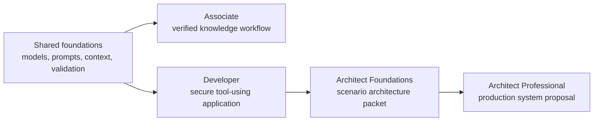

# Claude 认证课程 | Claude Certification Curriculum

> 通过亲手构建考试所描述的系统，学会答案背后的判断力。

**状态：** 本地预览
**指南版本：** 1.0
**指南生效日期：** 2026 年 7 月
**最后核实：** 2026-08-09

本免费课程覆盖：

| 考试 | 认证名称 | 题数 | 时长 | 费用 | 核心路线 |
|------|----------|-----:|-----:|----:|--------:|
| CCAO-F | Claude Certified Associate - Foundations（助理级） | 60 | 120 分钟 | $99 | 9 课 |
| CCDV-F | Claude Certified Developer - Foundations（开发者基础级） | 53 | 120 分钟 | $125 | 15 课 |
| CCAR-F | Claude Certified Architect - Foundations（架构师基础级） | 60 | 120 分钟 | $125 | 21 课 |
| CCAR-P | Claude Certified Architect - Professional（架构师专业级） | 63 | 120 分钟 | $175 | 25 课 |

> **【中文解读】** 四项认证构成一条进阶链：助理（会用 Claude 做知识工作）→ 开发者（会构建带工具调用的安全应用）→ 架构师基础（会做架构决策与威胁建模）→ 架构师专业（会交付完整生产架构方案）。全部采用 100-1000 分制的 720 分换算及格线，证书有效期 12 个月。注册前务必以官方指南为准（项目细节可能变化）。

截至 2026 年 8 月 9 日核实：官方考试注册仅限 Claude Partner Network 成员组织的人员，需要可识别的伙伴公司邮箱。本课程对所有人开放——包括只想学技能、不打算考试的学习者。付费或预约前请查看最新的
[认证 FAQ](https://anthropic-partners.skilljar.com/page/faq-certifications)，因为报考资格可能变化。

## 在 GitHub 上跟 AI 导师学习 | Learn From GitHub With an AI Tutor

本课程是 AI 原生的。Claude Code、Codex、ChatGPT、Cursor 或其他 Agent
都可以一步步带你学完整条路线：运行仓库里的实验、评审你构建的产物、组织课后测验、
从保存的进度续学。

从 [GitHub 学习指南](GETTING_STARTED.md) 开始，或安装
[便携认证导师 skill](../../skills/claude-certification/SKILL.md)：

```bash
npx skills add rohitg00/ai-engineering-from-scratch
```

然后让你的 Agent 运行：

```text
/claude-certification
```

克隆仓库后，本地 Claude Code 会话会从 `.claude/skills/` 自动发现同一个
skill。不支持斜杠命令的工具可以直接读 `GETTING_STARTED.md` 和导师 skill。
学习进度记录在 `CLAUDE-CERTIFICATION.md`；学习产物保存在
`learning-artifacts/claude/` 下。仓库中的 `outputs/` 文件只是参考产物，
永远不会被覆盖。

## 你将构建什么 | What You Build

各条路线共享基础，再按角色分化：



- 助理（Associate）：一条带证据和升级机制的知识工作流程。
- 开发者（Developer）：一个协议优先的 Claude 应用，含工具、测试、安全与评估。
- 架构师基础（Architect Foundations）：一套架构决策记录、威胁模型、评估器、上下文计划与故障恢复手册。
- 架构师专业（Architect Professional）：一份从需求调研到运维的完整架构方案，含 RAG、集成、评估、治理、SLA 与归属。

每条路线都包含一次短诊断测试和一套与公开指南题量相同的完整原创模拟题。
题目配比在取整范围内遵循大纲权重，不模仿、不复制真题。

## GitHub 课程索引 | GitHub Lesson Index

导师按所选路线文件确定学习顺序。这份完整索引也让每门共享课程都可以在
GitHub 上直接浏览。

| # | 课程 |
|---:|--------|
| 00 | [学决策，不是学术语](lessons/00-certification-strategy/) |
| 01 | [选择能承载工作的最小接口面](lessons/01-claude-product-and-model-landscape/) |
| 02 | [把能力花在失败代价高的地方](lessons/02-model-selection-and-token-economics/) |
| 03 | [把请求变成可测试的契约](lessons/03-prompting-and-task-decomposition/) |
| 04 | [把每类事实放进正确类型的上下文](lessons/04-context-knowledge-memory-and-caching/) |
| 05 | [验证的是论断，不是自信](lessons/05-output-evaluation-and-validation/) |
| 06 | [把权限围绕能力来设计](lessons/06-governance-safety-and-responsible-use/) |
| 07 | [先设计交接，再设计自动化](lessons/07-workflow-design-and-human-handoffs/) |
| 08 | [Messages API 是一台状态机](lessons/08-messages-api-and-application-lifecycle/) |
| 09 | [结构化输出是不受信任的契约](lessons/09-structured-output-and-defensive-parsing/) |
| 10 | [工具循环是受控的委托](lessons/10-tool-use-and-agentic-loops/) |
| 11 | [MCP 把能力与宿主分离](lessons/11-mcp-server-design-and-integration/) |
| 12 | [Agent SDK 是执行框架，不是许可](lessons/12-claude-agent-sdk-and-hooks/) |
| 13 | [安全活在提示词之外](lessons/13-application-security-and-secrets/) |
| 14 | [评估把 Agent 行为变成工程证据](lessons/14-evals-testing-debugging-and-observability/) |
| 15 | [Claude Code 靠共享约束实现规模化](lessons/15-claude-code-for-development-teams/) |
| 16 | [多 Agent 编排与委托](lessons/16-multi-agent-orchestration-and-delegation/) |
| 17 | [Agent SDK 会话、子 Agent 与上下文](lessons/17-agent-sdk-sessions-subagents-and-context/) |
| 18 | [工具契约、错误与渐进式披露](lessons/18-tool-contracts-errors-and-progressive-discovery/) |
| 19 | [Claude Code 记忆、规则、Skill 与 CI](lessons/19-claude-code-memory-rules-skills-and-ci/) |
| 20 | [可靠抽取、批处理与独立评审者](lessons/20-reliable-extraction-batch-and-reviewers/) |
| 21 | [让长上下文可观测](lessons/21-long-context-reliability-provenance-and-escalation/) |
| 22 | [业务调研、需求与 SLA](lessons/22-business-discovery-requirements-and-slas/) |
| 23 | [端到端架构与价值权衡](lessons/23-end-to-end-architecture-and-value-tradeoffs/) |
| 24 | [RAG、检索与数据管道](lessons/24-rag-retrieval-and-data-pipelines/) |
| 25 | [集成协议、身份与最小权限](lessons/25-integration-protocols-identity-and-least-privilege/) |
| 26 | [生产可观测性、延迟与成本](lessons/26-production-observability-latency-and-cost/) |
| 27 | [企业治理、合规与人工审查](lessons/27-enterprise-governance-compliance-and-hitl/) |
| 28 | [干系人沟通、ADR 与生命周期归属](lessons/28-stakeholder-communication-adrs-and-lifecycle/) |
| 29 | [交付一周的工作量，而非一个完美的提示词](lessons/29-associate-workflow-capstone/) |
| 30 | [交付一个你能辩护的 Claude 应用](lessons/30-developer-application-capstone/) |
| 31 | [在六种情境下捍卫同一套架构](lessons/31-architect-foundations-scenario-capstone/) |
| 32 | [架构师专业级系统毕业设计](lessons/32-architect-professional-system-capstone/) |

## 本地预览 | Local Preview

在仓库根目录运行：

```bash
node site/build.js
python3 scripts/audit_certifications.py
python3 -m http.server 4173 --bind 127.0.0.1
```

然后打开：

```text
http://127.0.0.1:4173/site/certifications.html
```

服务器必须从仓库根目录启动，这样本地未推送的课程文件才能被课程阅读器读到。

认证课程通过 GitHub 和网站发布。它有意游离于 EPUB/PDF 图书流水线之外，
因为导师状态、可运行实验、测评和交互机制本身就是课程的一部分。

## 研究留痕 | Research Trail

- [CCAR-F 精确机制评审](references/ccar-f-exact-mechanics.md)
- [官方 Anthropic Academy 对齐映射](research/official-academy-parity.md)
- [官方大纲映射](research/official-blueprint-map.md)
- [来源核实台账](research/source-verification-ledger.md)
- [YouTube 来源评审](research/youtube-source-review.md)
- [近期社区信号](research/recent-community-signal.md)

## 独立性与考试诚信 | Independence and Exam Integrity

这是一套独立的社区课程，与 Anthropic 不存在附属、背书、赞助或授权关系。
Claude 与认证名称仅用于指代所研究的对象。

课程使用公开的考试目标和原创场景，不使用保密考试内容。如果你参加考试，
请遵守其保密与考生行为规则。
