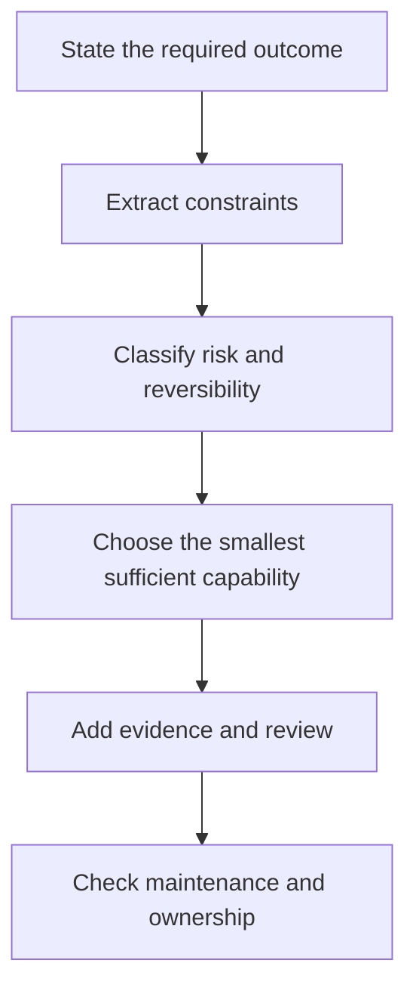

# Study the Decisions, Not the Vocabulary | 学决策，不是学术语

> A certification blueprint is a map of decisions a competent practitioner can defend. Treat it as a list of terms and you will study the least useful part of the exam.

> **【中文解读】** 本课是全部四条认证路线的共享起点，回答"怎么学才学得会、考得上"。核心论断：认证考试大纲（blueprint）是一张"合格从业者能够辩护的决策地图"，把它当术语表来背，学的恰恰是考试里最不值钱的部分。全课给出四个可操作工具：按知识域（domain）权重分配学习时间、区分稳定原则与易变事实、建立证据台账（evidence ledger）、用多条件就绪门（readiness gate）取代单次模拟分。

> **【拓展：四项认证→本课位置】** 本课程覆盖 CCAO-F（助理级）、CCDV-F（开发者基础级）、CCAR-F（架构师基础级）、CCAR-P（架构师专业级）四条路线，全部采用 100-1000 分制的 720 分换算及格线，证书有效期 12 个月。第 00 课不教任何产品知识，只教"如何学"——决策栈、证据台账、错误分类法这些方法论地基都在这里铺好，后面 32 课都在其上展开。

**Type:** Learn | **类型:** 学习
**Languages:** Python | **语言:** Python
**Prerequisites:** None | **前置知识:** 无
**Time:** ~75 minutes | **时间:** 约 75 分钟

## Learning Objectives | 学习目标

- Convert a certification blueprint into a weighted study plan.
  中文翻译：把认证考试大纲转换成一份带权重的学习计划。
- Separate stable engineering principles from product details that can change.
  中文翻译：把稳定的工程原则与可能变化的产品细节区分开。
- Build an evidence ledger that records decisions, reasons, and official sources.
  中文翻译：建立一个记录决策、理由和官方来源的证据台账。
- Practice scenario judgment without using dumps or reconstructing live questions.
  中文翻译：不用题库 dump、不试图还原真题地练习场景判断。
- Define a readiness gate based on domain performance, not one flattering mock score.
  中文翻译：定义基于知识域表现的就绪门，而不是一次讨喜的模拟分。

## The Problem | 问题引入

> **【中文解读】** 本节用 Maya 的故事点出典型失败模式：背了两周功能名词，遇到场景题却答不上——因为场景题考的是"在约束下做选择"，不是"复述定义"。四个选项（贴进新聊天、塞进旧 Project、接实时源、自建应用）都能产出摘要，只有一个同时满足更新节奏、审查要求、数据策略与维护负担。这一区分统御整套课程。

Maya has spent two weeks memorizing feature names. She can define a Project, a context window, and a connector. Then she meets a scenario.

> Maya 花了两周背功能名词。她能定义 Project、上下文窗口和连接器。然后她遇到了一个场景题。

A team wants to summarize a confidential weekly report. The source file changes every Friday. The final summary goes to executives. The options include pasting the report into a new chat, adding it to an old Project, connecting the live source, and building a custom application. Every option can produce a summary. Only one fits the update cadence, review requirement, data policy, and maintenance burden.

> 一个团队想汇总一份机密的周报。源文件每周五更新。最终摘要要呈交高管。选项包括：把报告贴进新聊天、加进旧 Project、连接实时源、自建应用。每个选项都能产出摘要，但只有一个同时满足更新节奏、审查要求、数据策略和维护负担。

Maya searches her memory for the definition of a connector. The scenario is asking for a decision.

> Maya 在记忆里搜索"连接器"的定义。而场景题要的是一个决策。

That distinction controls this entire curriculum. The official guides describe tasks such as selecting a product, validating an output, managing knowledge, and escalating risk. A definition can support those tasks. It cannot perform them for you.

> 这一区分统御整套课程。官方指南描述的是任务：选产品、验证输出、管理知识、升级风险。定义可以支撑这些任务，却不能替你完成它们。

The exams also use a scaled score. A practice percentage is not an official score, and no community mock can predict the result. Your job is to build enough judgment that unfamiliar scenarios still feel structured.

> 考试还采用换算分（scaled score）。练习百分比不是官方分数，任何社区模拟题都无法预测结果。你的任务是积累足够的判断力，让陌生场景也显得有章法。

## The Concept | 核心概念

### The blueprint is a job model

> **【中文解读】** 知识域（domain）代表目标角色的部分实际工作；权重估计计分题目里有多大比例取自该域。权重不是难度——小域照样能出难题，权重只告诉你如何分配练习。助理级考试最大的域是"输出评估与验证"，这是个信号：这个角色不是"会问 Claude 要答案的人"，而是"能判定答案是否可用的人"。读每个考试目标时打三个标签：Know（要记的事实）、Do（要做的过程）、Decide（要在约束下裁决的权衡）——弱的学习计划总在 Know 上投入过多，而场景题集中在 Do 和 Decide。

Each domain represents part of the work expected from the target role. The weight estimates how much of the scored exam is drawn from that domain. Weight is not difficulty. A small domain can still contain difficult questions. Weight tells you how to allocate practice.

> 每个知识域代表目标角色应承担工作的一个部分。权重估计计分考试中有多大比例的题目取自该域。权重不是难度。小域仍可能包含难题。权重告诉你的是如何分配练习。

For Associate Foundations, the largest domain is output evaluation and validation. That is a signal. The role is not merely someone who can ask Claude for an answer. It is someone who can decide whether the answer is fit to use.

> 对助理基础级（Associate Foundations）而言，最大的知识域是输出评估与验证。这是一个信号。这个角色不只是会向 Claude 要答案的人，而是能判定答案是否适合使用的人。

Use three labels while reading every objective:

> 读每个考试目标时使用三个标签：

1. **Know:** facts or vocabulary you must recall.
   中文翻译：**Know（知道）：**必须能回忆的事实或词汇。
2. **Do:** a procedure you must perform.
   中文翻译：**Do（会做）：**必须能执行的过程。
3. **Decide:** a tradeoff you must resolve from constraints.
   中文翻译：**Decide（会判断）：**必须依据约束解决的权衡。

Most weak study plans overinvest in Know. Most scenario questions concentrate on Do and Decide.

> 大多数薄弱的学习计划在 Know 上投入过多。大多数场景题集中在 Do 和 Decide。

### Stable principles and changeable facts

> **【中文解读】** 把知识分成两摞。变化慢的一摞（敏感数据走批准通道、论断进重要交付物前要有证据、持久指令要精简有主、不可逆动作比可逆草稿审查更严、小模型够用就别用大模型）是工程判断的地基；随时会变的一摞（模型名与价格、套餐资格、界面标签、连接器行为、认证费用政策）必须带核实日期和官方来源。本课程对照 2026 年 7 月的 1.0 版指南核实过；预约考试前请再开一次当前官方指南和认证 FAQ。

Some knowledge changes slowly:

> 有些知识变化很慢：

- Sensitive data needs an approved handling path.
  中文翻译：敏感数据需要一条经过批准的处理通道。
- A claim needs evidence before it enters a consequential deliverable.
  中文翻译：一个论断在进入重要交付物之前需要证据。
- Persistent instructions should be concise, scoped, and maintained.
  中文翻译：持久指令应当精简、有范围边界、且有人维护。
- Irreversible actions deserve stronger review than reversible drafts.
  中文翻译：不可逆动作应比可逆草稿经受更强的审查。
- A larger model is wasteful when a smaller model meets the measured requirement.
  中文翻译：当较小的模型满足实测需求时，用大模型就是浪费。

Other knowledge can change between the day this lesson is written and the day you study:

> 另一些知识可能在写这课的那天到你学习的那天之间就变了：

- Model names, prices, and context limits.
  中文翻译：模型名称、价格和上下文上限。
- Plan eligibility and feature availability.
  中文翻译：套餐资格与功能可用性。
- Product navigation and interface labels.
  中文翻译：产品导航与界面标签。
- Connector capabilities and approval behavior.
  中文翻译：连接器能力与审批行为。
- Certification fees, policies, and access rules.
  中文翻译：认证费用、政策与报考规则。

The second group must carry a verification date and an official source. This curriculum was checked against the July 2026 version 1.0 guides. Before scheduling an exam, open the current official guide and certification FAQ again.

> 第二组知识必须带核实日期和官方来源。本课程对照 2026 年 7 月的 1.0 版指南核实过。预约考试之前，请再打开当前的官方指南和认证 FAQ。

### The scenario decision stack

> 💡 **【类比】** 决策栈像医院的分诊流程：先问"要什么结果"（救治目标），再问"有什么约束"（药物过敏、转运时间），然后按"风险与可逆性"分级（擦伤还是胸痛），选"够用的最小处置"（不是一进门就进手术室），最后补"证据与复核"（化验单、第二诊断）并确认"后续谁负责"（复诊归属）。跳步的代价都一样：要么过度医疗，要么延误病情。

When several answers sound reasonable, inspect the scenario in this order:

> 当几个答案听起来都合理时，按以下顺序检视场景：



The smallest sufficient capability matters. If a direct chat produces a one-time draft safely, a managed Project may be unnecessary. If a source changes every day, a pasted copy may be too stale. If the workflow performs a consequential action, convenience does not outrank approval.

> "最小的充分能力"很关键。如果直接聊天就能安全地产出一次性草稿，托管的 Project 可能是多余的。如果源每天变化，粘贴的副本可能太陈旧。如果工作流要执行有后果的动作，便利性不能凌驾于审批之上。

### Wrong answers are usually locally correct

> **【中文解读】** 好的干扰项（distractor）很少是胡话——它们解错问题、漏掉一条约束、或添了不必要的机器。六种常见形态要背下来：能力不合身（功能能干但违反隐私/新鲜度要求）、默认最大火力（没实测就上最强模型）、只会改提示词（病根在知识过期或缺源）、自动化无主人（没有审查者/升级路径/维护人）、先执行后定密（敏感材料先处理再分类）、孤例当证据（一次漂亮输出就当可靠性）。"错误答案局部正确"正是场景题的命题原理。

Good distractors are rarely nonsense. They solve the wrong problem, ignore one constraint, or add unnecessary machinery.

> 好的干扰项很少是胡话。它们解的是错的问题、忽略一条约束、或添加不必要的机器。

Common shapes include:

> 常见形态包括：

- **Capability without fit:** The feature can do the task, but not under the stated privacy or freshness requirement.
  中文翻译：**能力不合身：**功能能完成该任务，但在题目声明的隐私或新鲜度要求下不行。
- **Maximum power by default:** The largest model is selected without a measured need.
  中文翻译：**默认最大火力：**没有实测需求就选了最大的模型。
- **Prompt-only repair:** A prompt is rewritten when the failure actually comes from stale knowledge or a missing source.
  中文翻译：**只会改提示词：**失败其实源于知识过期或缺源，却去重写提示词。
- **Automation without ownership:** A workflow has no reviewer, escalation route, or maintenance owner.
  中文翻译：**自动化无主人：**工作流没有审查者、升级路径或维护负责人。
- **Policy after execution:** Sensitive material is processed first and classified later.
  中文翻译：**先执行后定密：**敏感材料先处理、后分类。
- **One successful example:** A single polished output is treated as evidence of reliability.
  中文翻译：**孤例当证据：**一次漂亮的输出被当作可靠性的证据。

### Build an evidence ledger

> **【中文解读】** 笔记要记决策而不是抄段落：每个考试目标一条，含决策规则、反例、产物、官方来源（URL + 核实日期）和置信度。反例是灵魂——说不出一条规则何时不适用，你背的多半是口号而不是边界。这就是贯穿全课程的"证据台账"（evidence ledger）。

Your notes should record decisions, not copied paragraphs. Use one entry per objective:

> 你的笔记应当记录决策，而不是抄写的段落。每个目标一条：

```json
{
  "objective": "Choose when human verification is required",
  "decision_rule": "Require independent review when an error could create material harm or the claim lacks authoritative evidence",
  "counterexample": "A low-risk brainstorming list can be reviewed by the author during normal editing",
  "artifact": "claim-evidence matrix",
  "official_source": "URL and verification date",
  "confidence": "practiced"
}
```

The counterexample is essential. If you cannot name when a rule should not apply, you probably memorized a slogan rather than learned a boundary.

> 反例是必不可少的。如果你说不出一条规则何时不该适用，你记住的多半是一句口号，而不是一条边界。

## Build It | 动手构建

> **【中文解读】** 动手部分产出三样东西：(1) 一份七行的助理级台账——每个知识域一行，记权重、两个预期决策、一个证明能力的产物、一个要快速识别的失败模式、一个官方来源、当前置信度；(2) 按权重 × 薄弱系数分配十个学习小时（公式见下），归一化后加回可用时间；(3) 一份错题日志，记录"我做了什么决策、漏了什么约束、错误选项为何诱人、什么规则能选出更好答案"。复习错题日志比反复刷同一套模拟题更有价值。

Create a seven-row Associate Foundations ledger, one row per domain. For each row, write:

> 创建一份七行的助理基础级台账，每个知识域一行。每行写下：

- The domain weight.
  中文翻译：知识域权重。
- Two decisions you expect to make.
  中文翻译：你预期要做的两个决策。
- One artifact that proves you can perform the work.
  中文翻译：一个能证明你胜任该工作的产物。
- One failure mode you want to recognize quickly.
  中文翻译：一个你想快速识别的失败模式。
- One official source.
  中文翻译：一个官方来源。
- Your current confidence: unseen, understood, practiced, or timed.
  中文翻译：你当前的置信度：unseen（未接触）、understood（已理解）、practiced（已练习）或 timed（已限时）。

Then allocate ten study hours proportionally. Start with the mathematical allocation, but adjust for weakness. A 21 percent domain where you already perform strongly may need less remediation than a 12 percent domain you have never used.

> 然后按比例分配十个学习小时。从数学分配开始，再按薄弱程度调整。一个你已表现强势的 21% 知识域，需要的补救可能少于一个你从未用过的 12% 知识域。

Use this formula:

> 使用这个公式：

```text
domain hours = total hours x domain weight x weakness multiplier
```

Normalize the final numbers so they add back to your available time. A weakness multiplier of 1.5 is reasonable for an unfamiliar domain. Do not use a multiplier to avoid high-weight work you dislike.

> 把最终数字归一化，使它们加回你的可用时间。对不熟悉的域，1.5 的薄弱系数是合理的。不要用系数来逃避你不喜欢的高权重工作。

Finally, build an error log for practice questions. Record:

> 最后，为练习题建一份错题日志。记录：

- The decision you made.
  中文翻译：你做的决策。
- The constraint you missed.
  中文翻译：你漏掉的约束。
- Why the selected option looked attractive.
  中文翻译：所选选项为何显得诱人。
- The rule that would have produced a better answer.
  中文翻译：本可产生更好答案的规则。
- A new scenario where the same rule applies.
  中文翻译：同一规则适用的一个新场景。

Reviewing the error log is more valuable than repeatedly taking the same mock.

> 复习错题日志比反复做同一套模拟题更有价值。

### Use a cadence, not a cram pile

Use this four-stage cadence as a curriculum heuristic. Stretch it across four
weeks or compress it into the time you actually have:

> 把这个四阶段节奏当作课程学习的启发式。把它拉长到四周，或压缩进你实际拥有的时间：

1. **Orient:** Read the current guide, take one untouched diagnostic, and map
   every miss to an objective and a confidence level.
   中文翻译：**定向（Orient）：**读当前指南，做一份未接触过的诊断题，把每个错题映射到考试目标与置信度。
2. **Build:** Complete the required lessons and learner-owned artifacts. Run the
   tests rather than treating code, policy, or architecture examples as prose.
   中文翻译：**构建（Build）：**完成必修课程和学习者自有的产物。运行测试，而不是把代码、政策或架构示例当散文读。
3. **Transfer:** Solve new scenarios, defend why each plausible alternative
   loses, and repair weak domains using the error log.
   中文翻译：**迁移（Transfer）：**解决新场景，论证每个看似可行的替代方案为何落败，并用错题日志修补薄弱域。
4. **Simulate:** Take fresh timed sets under the published closed-book rules,
   review correct guesses, and stop adding new material immediately before the
   assessment.
   中文翻译：**模拟（Simulate）：**按公布的闭卷规则做全新的限时套题，复查猜对的题，并在评估之前立即停止加入新内容。

Classify every miss before choosing remediation:

> 在选择补救措施之前，先给每个错题分类：

- **Recall gap:** You did not know a stable fact or definition.
  中文翻译：**记忆缺口：**你不知道某个稳定的事实或定义。
- **Stale fact:** You remembered a product detail that needs current official verification.
  中文翻译：**过期事实：**你记住的产品细节需要对照当前官方材料核实。
- **Missed constraint:** You ignored privacy, freshness, latency, cost, authority, or reversibility.
  中文翻译：**漏约束：**你忽略了隐私、新鲜度、延迟、成本、权限或可逆性。
- **Sequence error:** You chose a valid action at the wrong lifecycle stage.
  中文翻译：**时序错误：**你在错误的生命周期阶段选择了一个本身有效的动作。
- **Surface confusion:** You selected a capable product or tool that was not the smallest maintainable fit.
  中文翻译：**界面混淆：**你选了一个能力很强但不是最小可维护适配的产品或工具。
- **Evidence failure:** You accepted confidence, citation presence, or one successful run as proof.
  中文翻译：**证据失误：**你把自信、引用存在或一次成功运行当作了证明。
- **Overengineering:** You added architecture before the scenario required it.
  中文翻译：**过度工程：**场景还没要求，你就加了架构。

The category determines the repair. A stale fact needs documentation lookup. A
missed constraint needs new scenarios. A sequence error needs a lifecycle map.
Rereading the same explanation is not a universal study strategy.

> 类别决定修复方式。过期事实需要查文档；漏约束需要新场景；时序错误需要生命周期图。重读同一段解释不是万能的学习策略。

## Interactive Lab | 交互实验室

Use the route-map figure to change domain confidence and available hours. Watch how a weak, high-weight domain changes the study sequence instead of treating every objective equally.

> 用路线图 figure 改变知识域置信度和可用小时数。观察一个薄弱的高权重域如何改变学习顺序，而不是对所有目标一视同仁。

```figure
00-certification-route-map
```

## Practice Lab | 练习实验室

Run the local scenario scorer, then change one confidence label and observe the weighted study order. Break the domain weights or allocated hours and confirm that the runner refuses an invalid plan.

> 运行本地场景评分器，然后改变一个置信度标签，观察加权后的学习顺序。破坏知识域权重或分配学时，确认运行器会拒绝无效计划。

## Shipped Artifact | 交付产物

The filled artifact in `outputs/readiness-plan.json` is a complete ten-hour Associate Foundations plan. It includes all seven blueprint domains, current confidence, two decisions per domain, a failure mode, an official source, a concrete artifact to produce, a four-stage practice cadence, and a wrong-answer taxonomy.

> `outputs/readiness-plan.json` 中的已填写产物是一份完整的十小时助理基础级计划。它包含全部七个大纲知识域、当前置信度、每域两个决策、一个失败模式、一个官方来源、一个要产出的具体产物、四阶段练习节奏和一套错误答案分类法。

## Verify It | 验证

Validate the packet and its tests without an API key:

> 无需 API 密钥即可验证产物包及其测试：

```bash
cd certifications/claude/lessons/00-certification-strategy/code
python3 main.py
python3 -m unittest discover tests -v
```

The validator proves that domain weights and allocated hours reconcile, every source is dated and official, every domain has practice evidence, and remediation covers distinct failure classes. Replace the filled values with your own after the example passes.

> 校验器证明：知识域权重与分配学时对得上账、每个来源都带日期且官方、每个域都有练习证据、补救覆盖了不同的失败类别。示例通过后，用你自己的值替换已填好的值。

## Capstone Connection | 毕业设计衔接

The six-question quiz checks whether you can reason from weights, dated facts, constraints, and error evidence. Carry the validated plan into the capstone for your chosen route. In the Associate route, it becomes the coverage and readiness record for lesson 29.

> 六题测验检查你能否从权重、带日期的事实、约束和错误证据出发推理。把验证过的计划带进所选路线的毕业设计。在助理路线中，它成为第 29 课的覆盖与就绪记录。

## Use It | 运行验证

> **【中文解读】** 本节给出"四遍学习法"和保守就绪门。四遍：定向→构建→解释→限时。就绪门五条：两套全新限时练习达到目标分、任何知识域原始分不低于 75%、每个毕业产物完成、每道错题都能用"漏掉的约束"解释、完整模拟结束时至少剩十分钟。记住红线：这是学习门，不是对 Anthropic 换算分的预测。

Use the curriculum in four passes.

> 分四遍使用本课程。

**Pass one: orient.** Read the current guide, take the diagnostic once, and mark weak domains. Do not study the diagnostic answers until you finish it.

> **第一遍：定向。** 读当前指南，做一次诊断题，标记薄弱域。做完之前不要看诊断题的答案。

**Pass two: build.** Complete the lessons and their artifacts. Run the workweek capstone without notes. The capstone forces product selection, knowledge maintenance, prompting, validation, governance, and handoff into one workflow.

> **第二遍：构建。** 完成各课及其产物。不带笔记完成工作周毕业设计。毕业设计把产品选择、知识维护、提示词、验证、治理和交接压进同一条工作流。

**Pass three: explain.** For each decision, explain why the best alternative loses under the stated constraints. Explanation exposes shallow confidence.

> **第三遍：解释。** 对每个决策，解释最佳替代方案为何在给定约束下落败。解释会暴露浅层自信。

**Pass four: time.** Take the full mock under closed-book conditions. Review every answer, including correct guesses. A guessed correct answer is not mastered.

> **第四遍：限时。** 在闭卷条件下做完整模拟题。复查每一道题，包括猜对的。猜对的题不等于已掌握。

A conservative readiness gate is:

> 一个保守的就绪门是：

- Two fresh, timed practice sets at or above your target.
  中文翻译：两套全新的限时练习达到或超过你的目标分。
- No domain below 75 percent on raw practice scoring.
  中文翻译：原始练习计分下没有任何知识域低于 75%。
- Every capstone artifact complete.
  中文翻译：每个毕业设计产物都已完成。
- Every missed question explained in terms of a missed constraint.
  中文翻译：每道错题都能用"漏掉的约束"来解释。
- At least ten minutes remaining on a full mock.
  中文翻译：完整模拟结束时至少剩余十分钟。

This is a study gate, not a prediction of Anthropic's scaled score.

> 这是学习门，不是对 Anthropic 换算分的预测。

## Exam Decision Patterns | 考试决策模式

- Prefer the option that satisfies all explicit constraints over the option with the most features.
  中文翻译：优先选满足全部显式约束的选项，而不是功能最多的选项。
- Treat words such as current, confidential, recurring, approved, auditable, and executive as architectural inputs.
  中文翻译：把 current（最新）、confidential（机密）、recurring（周期性）、approved（已批准）、auditable（可审计）、executive（高管级）这类词当作架构输入。
- Separate content quality from workflow quality. A good answer produced through an unapproved data path is still the wrong solution.
  中文翻译：把内容质量与工作流质量分开。经未批准数据路径产出的好答案仍然是错误解。
- Prefer a maintained source over a copied snapshot when freshness matters.
  中文翻译：当新鲜度重要时，优先选被维护的源而不是复制的快照。
- Add human review where consequence, uncertainty, or irreversibility is high.
  中文翻译：在后果、不确定性或不可逆性高的地方增加人工审查。
- Verify product facts against current official material instead of trusting a remembered interface.
  中文翻译：对照当前官方材料核实产品事实，不要相信记忆中的界面。

## Common Traps | 常见陷阱

- Using live-question dumps. They violate program rules and train recognition instead of judgment.
  中文翻译：使用真题 dump。这违反考试规则，训练的是识别而不是判断。
- Treating a longer answer as more likely to be correct.
  中文翻译：以为更长的答案更可能是对的。
- Memorizing exact prices without a date.
  中文翻译：背精确价格却不带日期。
- Equating the biggest model with the safest choice.
  中文翻译：把最大的模型等同于最安全的选择。
- Taking many low-quality mocks instead of studying explanations.
  中文翻译：刷大量低质模拟题而不研究解析。
- Counting a familiar scenario as proof you can handle an unfamiliar one.
  中文翻译：把熟悉场景当作能应对陌生场景的证据。
- Confusing a raw practice percentage with the official scaled score.
  中文翻译：把原始练习百分比与官方换算分混为一谈。

## Exercises | 练习

1. Take one objective from each domain and label it Know, Do, or Decide. Defend each label.
   中文翻译：从每个知识域各取一个目标，标注为 Know、Do 或 Decide，并为每个标签辩护。
2. Write a scenario where a Project is unnecessary and another where a Project is the simplest maintainable choice.
   中文翻译：写一个 Project 多余的场景，再写一个 Project 是最简可维护选择的场景。
3. Find one product fact in this curriculum that could change. Verify it in an official source and record the date.
   中文翻译：在本课程中找一个可能变化的产品事实。在官方来源中核实它并记录日期。
4. Rewrite a weak error-log entry, "I forgot the answer," into a missed-constraint explanation.
   中文翻译：把一条薄弱的错题日志——"我忘了答案"——改写成"漏掉约束"的解释。
5. Design a personal readiness gate that is stricter than one mock score but achievable inside your available time.
   中文翻译：设计一个比单次模拟分更严、但在你可用时间内可达到的个人就绪门。

## Key Terms | 关键术语

| Term | Meaning | 中文术语 |
|---|---|---|
| Blueprint | The official domain and objective map used to define exam scope | 考试大纲 |
| Scaled score | A transformed exam score that is not equal to raw percentage correct | 换算分 |
| Distractor | An incorrect option designed to be plausible under an incomplete reading | 干扰项 |
| Decision rule | A reusable way to choose from alternatives under known constraints | 决策规则 |
| Evidence ledger | A dated record connecting an objective to a rule, artifact, and official source | 证据台账 |
| Readiness gate | A set of conditions required before attempting the next assessment stage | 就绪门 |

## Further Reading | 延伸阅读

- [Anthropic Partner certification catalog](https://anthropic-partners.skilljar.com/page/partner-certifications)
  中文翻译：Anthropic 伙伴认证目录——四项认证的官方入口
- [Anthropic certification FAQ](https://anthropic-partners.skilljar.com/page/faq-certifications)
  中文翻译：官方认证 FAQ——换算分、报考资格与费用政策的权威来源
- [Claude Certified Associate Foundations exam guide](https://everpath-course-content.s3-accelerate.amazonaws.com/instructor%2F6nizmqk8tpzpfjvt6qmmav7rh%2Fpublic%2F1783542847%2FClaude+Certified+Associate+%E2%80%93+Foundations+Exam+Guide.pdf)
  中文翻译：助理基础级官方考试指南——七个知识域与权重的原始出处
- [CCAR-F Exact Mechanics Review](../../../references/ccar-f-exact-mechanics.md)
  中文翻译：本仓库的 CCAR-F 机制评审——考试机制的事实核查记录
- [Prompt Engineering: Techniques and Patterns](../../../../../phases/11-llm-engineering/01-prompt-engineering/)
  中文翻译：主课程的提示词工程课——Do/Decide 类目标的知识支撑
- [Evaluation and Testing LLM Applications](../../../../../phases/11-llm-engineering/10-evaluation/)
  中文翻译：主课程的 LLM 评估课——"验证输出"知识域的深潜
