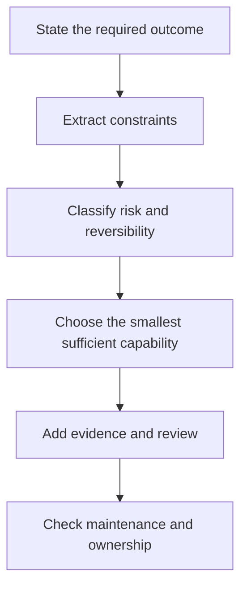

# 学决策，不是学术语

> 认证考试大纲是一张"合格从业者能够辩护的决策地图"。把它当术语表来背，你学到的将是考试里最不值钱的部分。

> **【中文解读】** 本课是全部四条认证路线的共享起点，回答"怎么学才学得会、考得上"。核心论断：认证考试大纲（blueprint）是一张"合格从业者能够辩护的决策地图"，把它当术语表来背，学的恰恰是考试里最不值钱的部分。全课给出四个可操作工具：按知识域（domain）权重分配学习时间、区分稳定原则与易变事实、建立证据台账（evidence ledger）、用多条件就绪门（readiness gate）取代单次模拟分。

> **【拓展：四项认证→本课位置】** 本课程覆盖 CCAO-F（助理级）、CCDV-F（开发者基础级）、CCAR-F（架构师基础级）、CCAR-P（架构师专业级）四条路线，全部采用 100-1000 分制的 720 分换算及格线，证书有效期 12 个月。第 00 课不教任何产品知识，只教"如何学"——决策栈、证据台账、错误分类法这些方法论地基都在这里铺好，后面 32 课都在其上展开。

> 🔗 **【前置】** 本课是认证路线的起点，无前置课程。开始前只需读过 `certifications/claude/README.zh.md` 的考试总览（题数、时长、费用、换算分），并大致确定你要走哪条路线。

**类型：** 学习
**语言：** Python
**前置条件：** 无
**预计用时：** 约 75 分钟

## 学习目标

- 把认证考试大纲转换成一份带权重的学习计划。
- 把稳定的工程原则与可能变化的产品细节区分开。
- 建立一个记录决策、理由和官方来源的证据台账。
- 不用题库 dump、不试图还原真题地练习场景判断。
- 定义基于知识域表现的就绪门，而不是一次讨喜的模拟分。

## 问题引入

> **【中文解读】** 本节用 Maya 的故事点出典型失败模式：背了两周功能名词，遇到场景题却答不上——因为场景题考的是"在约束下做选择"，不是"复述定义"。四个选项都能产出摘要，只有一个同时满足全部约束。这一区分统御整套课程。

Maya 花了两周背功能名词。她能定义 Project、上下文窗口和连接器。然后她遇到了一个场景题。

一个团队想汇总一份机密的周报。源文件每周五更新。最终摘要要呈交高管。选项包括：把报告贴进新聊天、加进旧 Project、连接实时源、自建应用。每个选项都能产出摘要，但只有一个同时满足更新节奏、审查要求、数据策略和维护负担。

Maya 在记忆里搜索"连接器"的定义。而场景题要的是一个决策。

这一区分统御整套课程。官方指南描述的是任务：选产品、验证输出、管理知识、升级风险。定义可以支撑这些任务，却不能替你完成它们。

考试还采用换算分（scaled score）。练习百分比不是官方分数，任何社区模拟题都无法预测结果。你的任务是积累足够的判断力，让陌生场景也显得有章法。

## 核心概念

### 考试大纲是一份工作模型

> **【中文解读】** 知识域代表目标角色的部分实际工作；权重估计计分题目里有多大比例取自该域。权重不是难度——小域照样能出难题。读目标时打三个标签（Know/Do/Decide），把练习精力从"背名词"挪到"做过程、断权衡"上。

每个知识域代表目标角色应承担工作的一个部分。权重估计计分考试中有多大比例的题目取自该域。权重不是难度。小域仍可能包含难题。权重告诉你的是如何分配练习。

对助理基础级（Associate Foundations）而言，最大的知识域是输出评估与验证。这是一个信号。这个角色不只是会向 Claude 要答案的人，而是能判定答案是否适合使用的人。

读每个考试目标时使用三个标签：

1. **Know（知道）：**必须能回忆的事实或词汇。
2. **Do（会做）：**必须能执行的过程。
3. **Decide（会判断）：**必须依据约束解决的权衡。

大多数薄弱的学习计划在 Know 上投入过多。大多数场景题集中在 Do 和 Decide。

### 稳定原则与易变事实

> **【中文解读】** 知识分两摞：工程判断的地基（慢变）和产品事实（快变）。快变的事实必须带核实日期和官方来源——这是本课程反复出现的红线。

有些知识变化很慢：

- 敏感数据需要一条经过批准的处理通道。
- 一个论断在进入重要交付物之前需要证据。
- 持久指令应当精简、有范围边界、且有人维护。
- 不可逆动作应比可逆草稿经受更强的审查。
- 当较小的模型满足实测需求时，用大模型就是浪费。

另一些知识可能在写这课的那天到你学习的那天之间就变了：

- 模型名称、价格和上下文上限。
- 套餐资格与功能可用性。
- 产品导航与界面标签。
- 连接器能力与审批行为。
- 认证费用、政策与报考规则。

第二组知识必须带核实日期和官方来源。本课程对照 2026 年 7 月的 1.0 版指南核实过。预约考试之前，请再打开当前的官方指南和认证 FAQ。

### 场景决策栈

> 💡 **【类比】** 决策栈像医院的分诊流程：先问"要什么结果"（救治目标），再问"有什么约束"（药物过敏、转运时间），然后按"风险与可逆性"分级（擦伤还是胸痛），选"够用的最小处置"（不是一进门就进手术室），最后补"证据与复核"（化验单、第二诊断）并确认"后续谁负责"（复诊归属）。跳步的代价都一样：要么过度医疗，要么延误病情。

当几个答案听起来都合理时，按以下顺序检视场景：



（决策栈六步：陈述所需结果 → 提取约束 → 分类风险与可逆性 → 选择最小的充分能力 → 补充证据与审查 → 检查维护与归属。）

"最小的充分能力"很关键。如果直接聊天就能安全地产出一次性草稿，托管的 Project 可能是多余的。如果源每天变化，粘贴的副本可能太陈旧。如果工作流要执行有后果的动作，便利性不能凌驾于审批之上。

### 错误答案通常是"局部正确"

> **【中文解读】** 好的干扰项很少是胡话——它们解错问题、漏掉一条约束、或添了不必要的机器。六种常见形态（能力不合身、默认最大火力、只会改提示词、自动化无主人、先执行后定密、孤例当证据）就是场景题的命题原理，值得背下来。

好的干扰项很少是胡话。它们解的是错的问题、忽略一条约束、或添加不必要的机器。

常见形态包括：

- **能力不合身：**功能能完成该任务，但在题目声明的隐私或新鲜度要求下不行。
- **默认最大火力：**没有实测需求就选了最大的模型。
- **只会改提示词：**失败其实源于知识过期或缺源，却去重写提示词。
- **自动化无主人：**工作流没有审查者、升级路径或维护负责人。
- **先执行后定密：**敏感材料先处理、后分类。
- **孤例当证据：**一次漂亮的输出被当作可靠性的证据。

### 建立证据台账

> **【中文解读】** 笔记要记决策而不是抄段落：每个考试目标一条，含决策规则、反例、产物、官方来源和置信度。反例是灵魂——说不出一条规则何时不适用，你背的多半是口号而不是边界。

你的笔记应当记录决策，而不是抄写的段落。每个目标一条：

```json
{
  "objective": "Choose when human verification is required",
  "decision_rule": "Require independent review when an error could create material harm or the claim lacks authoritative evidence",
  "counterexample": "A low-risk brainstorming list can be reviewed by the author during normal editing",
  "artifact": "claim-evidence matrix",
  "official_source": "URL and verification date",
  "confidence": "practiced"
}
```

（字段含义：objective=考试目标；decision_rule=决策规则；counterexample=反例；artifact=产物；official_source=官方来源（URL 与核实日期）；confidence=置信度。）

反例是必不可少的。如果你说不出一条规则何时不该适用，你记住的多半是一句口号，而不是一条边界。

## 动手构建

> **【中文解读】** 动手部分产出三样东西：七行助理级台账、按权重 × 薄弱系数分配的十小时计划、一份错题日志。复习错题日志比反复刷同一套模拟题更有价值。

创建一份七行的助理基础级台账，每个知识域一行。每行写下：

- 知识域权重。
- 你预期要做的两个决策。
- 一个能证明你胜任该工作的产物。
- 一个你想快速识别的失败模式。
- 一个官方来源。
- 你当前的置信度：unseen（未接触）、understood（已理解）、practiced（已练习）或 timed（已限时）。

然后按比例分配十个学习小时。从数学分配开始，再按薄弱程度调整。一个你已表现强势的 21% 知识域，需要的补救可能少于一个你从未用过的 12% 知识域。

使用这个公式：

```text
domain hours = total hours x domain weight x weakness multiplier
```

（知识域学时 = 总学时 × 知识域权重 × 薄弱系数。）

把最终数字归一化，使它们加回你的可用时间。对不熟悉的域，1.5 的薄弱系数是合理的。不要用系数来逃避你不喜欢的高权重工作。

最后，为练习题建一份错题日志。记录：

- 你做的决策。
- 你漏掉的约束。
- 所选选项为何显得诱人。
- 本可产生更好答案的规则。
- 同一规则适用的一个新场景。

复习错题日志比反复做同一套模拟题更有价值。

### 用节奏学习，不要考前突击

> **【中文解读】** 四阶段节奏（定向→构建→迁移→模拟）配合七类错题分类法，让"补什么"由错因决定，而不是靠重读同一段解释。

把这个四阶段节奏当作课程学习的启发式。把它拉长到四周，或压缩进你实际拥有的时间：

1. **定向（Orient）：**读当前指南，做一份未接触过的诊断题，把每个错题映射到考试目标与置信度。
2. **构建（Build）：**完成必修课程和学习者自有的产物。运行测试，而不是把代码、政策或架构示例当散文读。
3. **迁移（Transfer）：**解决新场景，论证每个看似可行的替代方案为何落败，并用错题日志修补薄弱域。
4. **模拟（Simulate）：**按公布的闭卷规则做全新的限时套题，复查猜对的题，并在评估之前立即停止加入新内容。

在选择补救措施之前，先给每个错题分类：

- **记忆缺口：**你不知道某个稳定的事实或定义。
- **过期事实：**你记住的产品细节需要对照当前官方材料核实。
- **漏约束：**你忽略了隐私、新鲜度、延迟、成本、权限或可逆性。
- **时序错误：**你在错误的生命周期阶段选择了一个本身有效的动作。
- **界面混淆：**你选了一个能力很强但不是最小可维护适配的产品或工具。
- **证据失误：**你把自信、引用存在或一次成功运行当作了证明。
- **过度工程：**场景还没要求，你就加了架构。

类别决定修复方式。过期事实需要查文档；漏约束需要新场景；时序错误需要生命周期图。重读同一段解释不是万能的学习策略。

## 交互实验室

> **【中文解读】** 交互实验室用路线图把抽象方法变成可操作的沙盘：调高某个知识域的置信度或减少可用小时，观察学习顺序如何重排。

用路线图 figure 改变知识域置信度和可用小时数。观察一个薄弱的高权重域如何改变学习顺序，而不是对所有目标一视同仁。

```figure
00-certification-route-map
```

## 练习实验室

> **【中文解读】** 练习实验室跑本地场景评分器，并故意做坏数据（破坏权重或学时）来验证校验器会拒绝无效计划——先学会"什么算无效"，再谈优化。

运行本地场景评分器，然后改变一个置信度标签，观察加权后的学习顺序。破坏知识域权重或分配学时，确认运行器会拒绝无效计划。

## 交付产物

> **【中文解读】** 交付产物是一份可直接改造的模板：十小时助理级计划，覆盖七个知识域、置信度、决策、失败模式、官方来源、四阶段节奏和错误答案分类法。

`outputs/readiness-plan.json` 中的已填写产物是一份完整的十小时助理基础级计划。它包含全部七个大纲知识域、当前置信度、每域两个决策、一个失败模式、一个官方来源、一个要产出的具体产物、四阶段练习节奏和一套错误答案分类法。

## 验证

> **【中文解读】** 验证不需要 API 密钥：跑 main.py 和单元测试，校验器会证明权重与学时对账、来源带日期且官方、每个域有练习证据、补救覆盖不同失败类别。

无需 API 密钥即可验证产物包及其测试：

```bash
cd certifications/claude/lessons/00-certification-strategy/code
python3 main.py
python3 -m unittest discover tests -v
```

校验器证明：知识域权重与分配学时对得上账、每个来源都带日期且官方、每个域都有练习证据、补救覆盖了不同的失败类别。示例通过后，用你自己的值替换已填好的值。

## 毕业设计衔接

> **【中文解读】** 本课产物直接进入所选路线的毕业设计：助理路线的第 29 课会把它当作覆盖度与就绪记录使用。

六题测验检查你能否从权重、带日期的事实、约束和错误证据出发推理。把验证过的计划带进所选路线的毕业设计。在助理路线中，它成为第 29 课的覆盖与就绪记录。

## 运行验证

> **【中文解读】** "四遍学习法"（定向→构建→解释→限时）加五条保守就绪门。红线：这是学习门，不是对 Anthropic 换算分的预测。

分四遍使用本课程。

**第一遍：定向。** 读当前指南，做一次诊断题，标记薄弱域。做完之前不要看诊断题的答案。

**第二遍：构建。** 完成各课及其产物。不带笔记完成工作周毕业设计。毕业设计把产品选择、知识维护、提示词、验证、治理和交接压进同一条工作流。

**第三遍：解释。** 对每个决策，解释最佳替代方案为何在给定约束下落败。解释会暴露浅层自信。

**第四遍：限时。** 在闭卷条件下做完整模拟题。复查每一道题，包括猜对的。猜对的题不等于已掌握。

一个保守的就绪门是：

- 两套全新的限时练习达到或超过你的目标分。
- 原始练习计分下没有任何知识域低于 75%。
- 每个毕业设计产物都已完成。
- 每道错题都能用"漏掉的约束"来解释。
- 完整模拟结束时至少剩余十分钟。

这是学习门，不是对 Anthropic 换算分的预测。

## 考试决策模式

- 优先选满足全部显式约束的选项，而不是功能最多的选项。
- 把 current（最新）、confidential（机密）、recurring（周期性）、approved（已批准）、auditable（可审计）、executive（高管级）这类词当作架构输入。
- 把内容质量与工作流质量分开。经未批准数据路径产出的好答案仍然是错误解。
- 当新鲜度重要时，优先选被维护的源而不是复制的快照。
- 在后果、不确定性或不可逆性高的地方增加人工审查。
- 对照当前官方材料核实产品事实，不要相信记忆中的界面。

## 常见陷阱

- 使用真题 dump。这违反考试规则，训练的是识别而不是判断。
- 以为更长的答案更可能是对的。
- 背精确价格却不带日期。
- 把最大的模型等同于最安全的选择。
- 刷大量低质模拟题而不研究解析。
- 把熟悉场景当作能应对陌生场景的证据。
- 把原始练习百分比与官方换算分混为一谈。

## 练习

1. 从每个知识域各取一个目标，标注为 Know、Do 或 Decide，并为每个标签辩护。
2. 写一个 Project 多余的场景，再写一个 Project 是最简可维护选择的场景。
3. 在本课程中找一个可能变化的产品事实。在官方来源中核实它并记录日期。
4. 把一条薄弱的错题日志——"我忘了答案"——改写成"漏掉约束"的解释。
5. 设计一个比单次模拟分更严、但在你可用时间内可达到的个人就绪门。

## 关键术语

| 术语 | 含义 |
|---|---|
| 考试大纲（Blueprint） | 定义考试范围的官方知识域与目标地图 |
| 换算分（Scaled score） | 经过换算的考试分数，不等于原始答对百分比 |
| 干扰项（Distractor） | 为在读题不全时显得合理而设计的错误选项 |
| 决策规则（Decision rule） | 在已知约束下从备选项中做选择的可复用方法 |
| 证据台账（Evidence ledger） | 把目标与规则、产物、官方来源关联起来的带日期记录 |
| 就绪门（Readiness gate） | 进入下一评估阶段前必须满足的一组条件 |

## 延伸阅读

- [Anthropic Partner certification catalog](https://anthropic-partners.skilljar.com/page/partner-certifications) — 四项认证的官方入口
- [Anthropic certification FAQ](https://anthropic-partners.skilljar.com/page/faq-certifications) — 换算分、报考资格与费用政策的权威来源
- [Claude Certified Associate Foundations exam guide](https://everpath-course-content.s3-accelerate.amazonaws.com/instructor%2F6nizmqk8tpzpfjvt6qmmav7rh%2Fpublic%2F1783542847%2FClaude+Certified+Associate+%E2%80%93+Foundations+Exam+Guide.pdf) — 七个知识域与权重的原始出处
- [CCAR-F Exact Mechanics Review](../../../references/ccar-f-exact-mechanics.md) — 本仓库的考试机制事实核查记录
- [Prompt Engineering: Techniques and Patterns](../../../../../phases/11-llm-engineering/01-prompt-engineering/) — 主课程的提示词工程课
- [Evaluation and Testing LLM Applications](../../../../../phases/11-llm-engineering/10-evaluation/) — 主课程的 LLM 评估课，"验证输出"知识域的深潜
