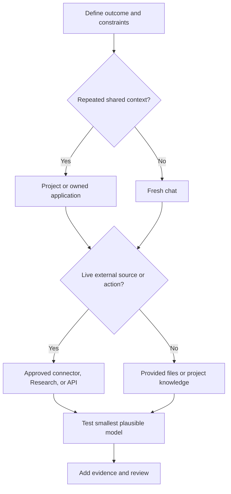

# Choose the Smallest Surface That Can Carry the Work | 选择能承载工作的最小接口面

> Product selection is architecture at knowledge-work scale. The wrong surface can make correct output stale, unreviewable, or needlessly expensive.

> **【中文解读】** 本课把"选产品"提升为"做架构"：产品选择就是知识工作尺度上的架构设计，选错接口面（surface）会让正确的输出变得过期、不可审查或无谓地昂贵。核心方法：先沿六个维度描述工作（重复性、知识、新鲜度、输出、后果、协作），再选界面；模型家族（Haiku/Sonnet/Opus）是角色不是等级；部署是控制面决策，四条路径各有所长。判断标准始终是"最小的充分能力"。

> 🔗 **【前置】** 学本课前请先掌握：(1) 第 00 课"学决策，不是学术语"——场景决策栈、稳定原则与易变事实的区分是本课的地基；(2) Phase 17·01"托管 LLM 平台"——了解托管平台的基本形态，有助于理解本课的部署路径对比。

**Type:** Learn | **类型:** 学习
**Languages:** Python | **语言:** Python
**Prerequisites:** [Study the Decisions, Not the Vocabulary](../../00-certification-strategy/), [Managed LLM Platforms](../../../../../phases/17-infrastructure-and-production/01-managed-llm-platforms/) | **前置知识:** [学决策，不是学术语](../../00-certification-strategy/)、[托管 LLM 平台](../../../../../phases/17-infrastructure-and-production/01-managed-llm-platforms/)
**Time:** ~90 minutes | **时间:** 约 90 分钟

## Learning Objectives | 学习目标

- Choose among chat, Projects, Research, files and Artifacts, connectors, and programmatic surfaces.
  中文翻译：在聊天、Projects、Research、文件与 Artifacts、连接器和编程接口之间做选择。
- Explain the durable role of Haiku, Sonnet, and Opus without depending on a specific model version.
  中文翻译：不依赖具体模型版本地解释 Haiku、Sonnet、Opus 的持久角色分工。
- Match a surface and model to quality, speed, cost, freshness, and governance constraints.
  中文翻译：让接口面和模型匹配质量、速度、成本、新鲜度和治理约束。
- Compare direct Anthropic, Amazon Bedrock, Google Vertex AI, and Microsoft Foundry deployment paths with an architecture decision record.
  中文翻译：用架构决策记录比较 Anthropic 直连、Amazon Bedrock、Google Vertex AI 和 Microsoft Foundry 四条部署路径。
- Identify when memory, project knowledge, or a new conversation is the correct continuity mechanism.
  中文翻译：识别何时该用记忆、项目知识或新会话作为正确的连续性机制。
- Mark changeable product facts with an official source and verification date.
  中文翻译：给易变的产品事实标注官方来源与核实日期。

## The Problem | 问题引入

> **【中文解读】** 本节的周报案例说明：失败不是从措辞开始的，而是从选错工作界面开始的。旧聊天带着过期上下文（旧价格）、粘贴链接不保证全面调研、内部政策不在可用知识里、工作流没有论断验证步骤——四个问题全是"边界设计"问题。考试目标名叫"产品与模型选择"，真本事是边界设计：你能让 Claude 看到什么、记住什么、检索什么、创建什么、配多强的推理能力。

An operations lead prepares a weekly competitor brief. She opens last week's chat, pastes three new links, asks for an update, and forwards the result.

> 一位运营负责人准备每周竞品简报。她打开上周的聊天，粘贴三个新链接，要求更新，然后转发结果。

The output is polished. It also cites an old product price from the previous conversation, misses a policy change in an internal document, and contains a competitor claim with no source. The failure did not begin with wording. It began with the chosen work surface.

> 产出的内容很漂亮。但它引用了前一段对话里的旧产品价格，漏掉一份内部文档中的政策变化，还包含一条没有来源的竞品论断。失败不是从措辞开始的，而是从所选的工作界面开始的。

An old chat carried stale context. Pasted links did not guarantee comprehensive research. The internal policy was not part of the available knowledge. The workflow had no claim-verification step.

> 旧聊天带着过期上下文。粘贴的链接不保证全面调研。内部政策不在可用知识之内。工作流没有论断验证步骤。

The exam objective is called product and model selection, but the real skill is boundary design. You decide what Claude can see, what it can remember, what it can retrieve, what it can create, and how much reasoning capacity the task deserves.

> 考试目标名叫"产品与模型选择"，但真正的技能是边界设计。你决定 Claude 能看到什么、记住什么、检索什么、创建什么，以及这个任务配得上多少推理能力。

## The Concept | 核心概念

> 💡 **【类比】** 选接口面像选通勤方式：一次性取件就步行（新聊天）；每天同一条线就坐班车（Project，固定路线、有班次表）；多站接送要包车（Cowork，可中途调整路线）；全市摸底就请调研公司（Research，多源带引用）；要长期自营就买车队（API，自己定规矩）。错误不在工具，而在"用步行送一批货"或"为取个快递买车队"。

### Start with the work, not the feature menu

> **【中文解读】** 先用六个维度给工作画像——重复性（一次性/重复/持续）、知识（源是小是大、私有还是变化）、新鲜度（昨天的副本今天会不会错）、输出（回复/报告/文件/分析/可复用工作流）、后果（结果错误或动作失误会怎样）、协作（单人还是团队共享维护）——然后再选界面。顺序不能反：从功能菜单出发的选型，是被功能牵着走而不是被工作牵着走。

Describe the task along six dimensions:

> 沿六个维度描述任务：

| Dimension | Question |
|---|---|
| Recurrence | Is this one-time, repeated, or continuous? |
| Knowledge | Is the required source small, large, private, or changing? |
| Freshness | Can yesterday's copy be wrong today? |
| Output | Is the result a reply, report, file, analysis, or reusable workflow? |
| Consequence | What happens if the result is wrong or the action is unintended? |
| Collaboration | Does one person use it, or must a team share and maintain it? |

> （表格汉译：维度/问题——重复性：一次性、重复还是持续？知识：所需源是小、大、私有还是常变？新鲜度：昨天的副本今天会不会错？输出：结果是回复、报告、文件、分析还是可复用工作流？后果：结果错误或动作失误会怎样？协作：单人使用，还是团队共享维护？）

Only then choose the surface.

> 然后才选界面。

### Chat is for bounded conversational work

A new chat is often the correct default for a one-time task with a clear input. It gives you a clean context boundary. Use it for drafting, brainstorming, explaining, transforming supplied text, and short analysis.

> 新聊天往往是"输入明确的一次性任务"的正确默认选择。它给你一条干净的上下文边界。用它做起草、头脑风暴、解释、转换给定文本和短分析。

A long-running chat becomes dangerous when old assumptions quietly influence new work. Restart when the objective changes, the context contains conflicting instructions, or you cannot explain which earlier messages still matter. Before restarting, extract a short, verified handoff if continuity is needed.

> 当旧假设悄悄影响新工作时，长期运行的聊天就变得危险。目标变了、上下文里有相互冲突的指令、或你解释不清哪些早期消息仍然重要时，就重启。需要连续性时，重启前先提取一段简短、经过核实的交接信息。

Chat search and memory can recover prior context, but they are not substitutes for an approved source of truth. Memory is useful for preferences and durable working context. A policy, price list, or customer record belongs in a maintained system with ownership and dates.

> 聊天搜索和记忆能找回先前的上下文，但它们不是"经批准的事实源"的替代品。记忆适合存偏好和持久的工作背景；政策、价目表或客户记录应放进有人维护、带归属和日期的系统。

### Projects are maintained context boundaries

> **【中文解读】** Project 把聚焦的聊天与项目指令、知识库打包在一起，价值不是存储而是可重复性——每次新会话都从有意的边界内开始。风险是配置过期：装着上季度政策的 Project 会稳定地做出同一个错误决策，所以每个 Project 都要有主人、源清单、审查节奏和移除流程。官方产品行为会变：2026 年 8 月 8 日核实时，帮助材料说 Project 可含指令和上传知识、知识接近上下文上限时可使用检索；可用性、限额和套餐要求须在当前帮助中心再核实。

A Project groups focused chats with project instructions and a knowledge base. It is a better fit when the same stable context supports repeated work, such as a brand guide, research program, operating procedure, or client engagement.

> Project 把聚焦的聊天与项目指令、知识库编成一组。当同一套稳定上下文支撑重复性工作时——比如品牌指南、研究项目、操作规程或客户事务——它是更合适的选择。

The advantage is not merely storage. It is repeatability. Each new conversation starts inside an intentional boundary.

> 优势不只是存储，而是可重复性。每个新会话都从一条有意的边界之内开始。

The risk is stale configuration. A Project that contains last quarter's policy can make the same wrong decision consistently. Every Project needs an owner, source inventory, review cadence, and removal process.

> 风险是配置过期。装着上季度政策的 Project 会持续做出同一个错误决策。每个 Project 都需要主人、源清单、审查节奏和移除流程。

Official product behavior changes. As checked on August 8, 2026, Anthropic's help material says Projects can contain instructions and uploaded knowledge, and can use retrieval when knowledge approaches context limits. Availability, limits, and plan requirements must be verified again in the current help center.

> 官方产品行为会变。截至 2026 年 8 月 8 日核实，Anthropic 的帮助材料称 Project 可包含指令和上传的知识，并在知识接近上下文上限时可使用检索。可用性、限额和套餐要求必须在当前帮助中心重新核实。

### Cowork is a steerable task loop

Cowork is a product surface for multi-step knowledge work, not a separate deployment path and not an exam objective in this lesson. As verified on August 9, 2026, Anthropic's current help material describes an outcome-driven task loop: you describe the result, review the approach, watch progress, and steer or redirect the work while it runs. Projects can provide standing files, links, instructions, and memory for related tasks. Skills provide reusable workflows, while plugins can package skills, connectors, agents, and hooks.

> Cowork 是面向多步知识工作的产品界面，不是独立部署路径，也不是本课的考试目标。截至 2026 年 8 月 9 日核实，Anthropic 当前帮助材料描述的是一个结果驱动的任务循环：你描述想要的成果、审查做法、观看进度，并在运行中引导或改向。Projects 可为相关任务提供常备文件、链接、指令和记忆；Skills 提供可复用工作流；plugins 可打包 skills、连接器、agent 和 hooks。

Use Cowork when the result is a real file or coordinated task across approved sources and the work benefits from human steering. Keep the file boundary narrow: current documentation says local access is limited to connected folders, file operations pass through permissions, and permanent deletion requires explicit approval. For sensitive files, unfamiliar plugins, consequential actions, or broad computer access, use manual approval, stay close to the task, and review the resulting files. A long-running loop does not transfer accountability to the model.

> 当结果是真实文件、或跨经批准源的协同任务、且工作受益于人工引导时，使用 Cowork。把文件边界收窄：当前文档称本地访问限于已连接的文件夹、文件操作要过权限、永久删除需要显式批准。对敏感文件、不熟悉的 plugins、有后果的动作或宽泛的计算机访问，使用手动批准、贴近任务、并审查产出的文件。长时间运行的任务循环不会把责任转移给模型。

### Research is for multi-source investigation

Use Research when the task requires broad information gathering, several searches, synthesis, and citations. A direct web search is better for a narrow current fact. Research is better for questions such as comparing markets, reviewing several papers, or reconciling public sources with connected internal material.

> 当任务需要广泛的信息收集、多次搜索、综合与引用时，使用 Research。查一个窄的最新事实，直接 web search 更好。比较市场、评审多篇论文、或把公开来源与连接的内部材料对账，Research 更合适。

Research does not remove the need to judge sources. A long report can still cite weak evidence, combine claims from different dates, or miss a private constraint. Treat citations as navigation to evidence, not automatic proof.

> Research 不能免除对来源的判断。一份长报告仍可能引用弱证据、混合不同日期的论断、或漏掉一条私有约束。把引用当作通往证据的导航，而不是自动的证明。

### Files and Artifacts make the output inspectable

Choose an output form based on what happens next. Inline text is appropriate when the answer will be read and discarded. A structured table is better when fields must be compared. A downloadable document or spreadsheet is better when the result enters a business process.

> 依据"接下来会发生什么"选择输出形态。答案会被读完即弃时，行内文本合适；字段需要比对时，结构化表格更好；结果要进入业务流程时，可下载的文档或电子表格更好。

The artifact should expose assumptions, sources, dates, and unresolved items. A beautiful file that hides uncertainty is harder to review than a plain table with a clear evidence column.

> 产物应当暴露假设、来源、日期和未决事项。一个隐藏不确定性的漂亮文件，比一张带清晰证据列的朴素表格更难审查。

File creation and editing capabilities can change by surface, plan, file type, and size. Verify current limits before designing a recurring workflow around them.

> 文件创建与编辑能力会随界面、套餐、文件类型和大小变化。围绕它们设计周期性工作流之前，先核实当前限额。

### Connectors trade copying for live, permissioned access

Connectors let Claude retrieve from or act within external services. They are useful when source freshness matters and manual copy-paste would drift.

> 连接器让 Claude 从外部服务检索或在其中执行动作。当源的新鲜度重要、手工复制粘贴会漂移时，它们很有用。

Do not select a connector merely because one exists. Check:

> 不要仅因为存在某个连接器就选它。检查：

- Whether it is read-only or can mutate data.
  中文翻译：它是只读的，还是能改写数据。
- Which permissions it inherits from the connected account.
  中文翻译：它从被连接账户继承了哪些权限。
- Whether every action requires approval.
  中文翻译：是否每个动作都需要批准。
- What data is retained with the conversation.
  中文翻译：哪些数据会随对话留存。
- Whether organization administrators must enable it.
  中文翻译：是否需要组织管理员启用。
- Whether the connector exposes the exact content type you need.
  中文翻译：该连接器是否暴露你需要的准确内容类型。

As checked on August 8, 2026, official documentation says Google Workspace connectors can search Gmail, work with Calendar and Drive, and require explicit approval for actions. It also documents limitations, including content that may not be visible. Those details are changeable product facts.

> 截至 2026 年 8 月 8 日核实，官方文档称 Google Workspace 连接器可以搜索 Gmail、配合 Calendar 和 Drive 工作，且动作需要显式批准。文档还记录了限制，包括可能不可见的内容。这些细节都是易变的产品事实。

### API and coding surfaces are for owned software behavior

Move to an API, Claude Code, or an agent runtime when you need deterministic integration, custom interfaces, automated tests, versioned configuration, or repeated execution inside a software system.

> 当你需要确定性集成、自定义界面、自动化测试、版本化配置或在软件系统内重复执行时，转向 API、Claude Code 或 agent 运行时。

Do not build an application to avoid learning how to configure a Project. Do build one when the workflow needs a contract that the chat product cannot express, such as a typed output schema, application-owned authorization, or automated evaluation on every release.

> 不要为了逃避学习配置 Project 而去构建应用。但当工作流需要聊天产品表达不了的契约——比如类型化输出 schema、应用自有授权或每次发布的自动化评估——就该构建。

### Deployment is a control-plane decision

> **【中文解读】** 选工作界面和选"Claude 跑在哪"是两个决策：Project 可以是员工侧的正确界面，而另一个应用同时用云端托管的 API——别把两个选择都藏在"Claude"一个词后面。四条路径（Anthropic 直连与企业版、Amazon Bedrock、Google Vertex AI、Microsoft Foundry）不是排名而是所有权地图：最优路径是用最少新控制面满足组织约束的那条。直连要区分两种形态——企业版管理"具名的人和共享工作"，直连 API 管理"应用工作负载"，席位不等于 API 容量。数据处理器也不同：截至 2026 年 8 月 9 日核实，第一方 Claude API 和 Microsoft Foundry 由 Anthropic 担任数据处理者，Amazon Bedrock 和 Google Cloud 由云厂商担任。写"Azure"或"AWS"不够，要记录确切的 offerings、区域和托管选项。

Choosing a work surface and choosing where Claude runs are different decisions. A Project can be the right employee surface while a separate application uses a cloud-hosted API. Do not hide both choices behind the word "Claude."

> 选工作界面和选 Claude 在哪里运行是不同的决策。Project 可以是正确的员工侧界面，同时另一个应用使用云端托管的 API。不要把两个选择都藏在"Claude"这个词后面。

As verified on August 9, 2026, official Anthropic documentation describes four deployment paths that an enterprise architecture review should compare:

> 截至 2026 年 8 月 9 日核实，Anthropic 官方文档描述了企业架构评审应比较的四条部署路径：

| Path | Control plane and procurement | Strong fit when | Recheck before approval |
|---|---|---|---|
| Claude for Enterprise and direct Claude API | Anthropic administers the human product and first-party API services. Enterprise seats and direct API workspaces are separate usage shapes. | Direct Anthropic procurement is acceptable, first-party product access matters, and no cloud marketplace is mandatory. | Enterprise identity and seat policy, API authentication, workspace budgets, data terms, available features, and model lifecycle. |
| Amazon Bedrock | AWS-native authentication, billing, regions, quotas, and AWS-managed inference boundaries. | The organization already governs production AI through AWS IAM, AWS procurement, and AWS compliance controls. | Model access, regional endpoint, feature differences, AWS data handling, quotas, and the exact Bedrock API generation. |
| Google Vertex AI | Google Cloud project identity, billing, and global, multi-region, or regional endpoints. | The workload belongs in an existing Google Cloud landing zone and its IAM, billing, logging, and residency controls. | Model and feature support, endpoint geography, provisioned versus pay-as-you-go capacity, and Google Cloud data handling. |
| Microsoft Foundry | Azure-native endpoints and authentication with Azure Marketplace billing. Current documentation describes Azure-hosted and Anthropic-hosted choices. | Azure procurement, Entra identity, Azure RBAC, and Foundry operations are already the approved path. | Hosting option, deployment type, region or data zone, model and feature support, and current processor terms. |

> （表格汉译要点：四行分别是 Claude for Enterprise 与直连 Claude API、Amazon Bedrock、Google Vertex AI、Microsoft Foundry。列为：路径、控制面与采购、何时强匹配、批准前复查——复查项涵盖身份与席位策略、认证、区域端点、配额、数据处理条款、托管选项与模型生命周期。）

These rows are not a ranking. They are a map of ownership. The best path is the one that satisfies the organization's constraints with the fewest new control planes.

> 这些行不是排名，而是一张所有权地图。最优路径是用最少的新控制面满足组织约束的那条。

Treat direct Anthropic access as one procurement family, but keep its controls explicit. Claude for Enterprise governs named people and shared work. The direct Claude API governs application workloads through API organizations and workspaces. A seat is not API capacity, and an API spend limit is not a seat policy.

> 把 Anthropic 直连当作一个采购家族，但要让它的控制显式化。Claude for Enterprise 管理"具名的人和共享工作"；直连 Claude API 通过 API 组织和工作区管理"应用工作负载"。席位不是 API 容量，API 支出限额也不是席位政策。

The partner clouds also differ in who operates and processes each layer. As verified on August 9, 2026, Anthropic's data-retention documentation says Anthropic is the data processor for the first-party Claude API and Microsoft Foundry, while the cloud provider is the data processor for Amazon Bedrock and Google Cloud. Foundry additionally has hosting choices whose boundaries must be read from the current Foundry page. Record the exact offering, region, and hosting option instead of writing only "Azure" or "AWS."

> 各伙伴云在"谁来运营和处理每一层"上也不同。截至 2026 年 8 月 9 日核实，Anthropic 的数据保留文档称：第一方 Claude API 和 Microsoft Foundry 的数据处理者是 Anthropic，而 Amazon Bedrock 和 Google Cloud 的数据处理者是云厂商。Foundry 还有托管选项，其边界必须从当前 Foundry 页面读取。记录确切的 offerings、区域和托管选项，而不是只写"Azure"或"AWS"。

### Score the requirement, not the provider

Write the decision criteria before meeting a vendor:

> 在见供应商之前先写下决策标准：

| Criterion | Architecture question |
|---|---|
| Cloud commitment | Which landing zones, network controls, logging systems, and support teams already exist? |
| Procurement | Must consumption flow through a cloud marketplace or a direct Anthropic agreement? |
| Compliance and data boundary | Who is the processor, where does inference run, what may leave the boundary, and which retention terms apply? |
| Identity | Will humans use enterprise SSO and SCIM, or will workloads use cloud identity, federation, or scoped API credentials? |
| Seats and budgets | Are you buying named-user access, application tokens, provisioned capacity, or more than one of these? Where are limits enforced? |
| Operational control | Who owns model enablement, quotas, regions, logs, incident response, deprecation work, and feature verification? |

> （表格汉译要点：六条标准——云承诺：已有哪些登陆区、网络控制、日志系统和支持团队？采购：消耗必须走云市场还是 Anthropic 直签协议？合规与数据边界：谁是处理者、推理在哪运行、什么可以出边界、适用哪些保留条款？身份：人用企业 SSO/SCIM，还是工作负载用云身份、联合身份或限定范围的 API 凭证？席位与预算：买的是具名用户、应用令牌、预留容量还是几者兼有？限额在哪里执行？运营控制：谁拥有模型启用、配额、区域、日志、事件响应、弃用工作和特性核实？）

Weight each criterion for the actual workload, score every path with a short reason, and compute the result. A score without a reason is decoration. A score copied to a different organization is misinformation.

> 为实际工作负载给每条标准加权，给每条路径打分并附一句理由，然后计算结果。没有理由的分数是装饰；复制到另一个组织的分数是误导。

Finish with an architecture decision record. State the chosen path, rejected alternatives, consequences, and review triggers. Cloud commitment, processor terms, required features, or procurement can change, so an accepted decision still needs a review date.

> 最后写一份架构决策记录（ADR）：写明所选路径、被否决的替代方案、后果和复审触发条件。云承诺、处理者条款、所需特性或采购都可能变，所以已接受的决策仍需要一个复审日期。

### Model families are roles, not status levels

> **【中文解读】** 持久的家族分工：Haiku 为窄而明确的高频工作优先速度与低成本；Sonnet 为多数专业工作平衡能力、延迟与成本；Opus 为最难的推理、综合与 agentic 工作优先能力——前提是实测质量值得多付的成本或延迟。具体的代际、别名、价格、上下文上限、输出上限、thinking 模式和平台可用性都会变，永远不要把版本表当永久知识教。选型要有证据：先在最小可能模型上跑代表性样本，只有修复提示词、上下文和验证设计之后失败仍在，才升级。

The durable family pattern is:

> 持久的家族模式是：

- **Haiku:** prioritize speed and low cost for narrow, well-specified, high-volume work.
  中文翻译：**Haiku：**为窄而明确的高频工作优先速度与低成本。
- **Sonnet:** balance capability, latency, and cost for most professional workflows.
  中文翻译：**Sonnet：**为多数专业工作流平衡能力、延迟与成本。
- **Opus:** prioritize capability for the hardest reasoning, synthesis, and agentic work where measured quality earns the additional cost or latency.
  中文翻译：**Opus：**为最难的推理、综合与 agentic 工作优先能力——前提是实测质量值得多付的成本或延迟。

Exact generations, aliases, prices, context limits, output limits, thinking modes, and platform availability change. Never teach a version table as permanent knowledge. Use the live models overview and pricing page.

> 具体的代际、别名、价格、上下文上限、输出上限、thinking 模式和平台可用性都会变。永远不要把版本表当作永久知识来教。使用实时的模型总览页和定价页。

Selection requires evidence. Run representative examples on the smallest plausible model. Escalate only when measured failures remain after fixing the prompt, context, and validation design.

> 选型需要证据。在最小可能满足的模型上跑代表性样本。只有在修复提示词、上下文和验证设计之后实测失败仍然存在时，才升级。



（决策树汉译：定义结果与约束 → 是否重复的共享上下文？是则走 Project 或自有应用，否则走全新聊天 → 是否实时外部源或外部动作？是则走经批准的连接器、Research 或 API，否则走提供的文件或项目知识 → 测试最小可能模型 → 补充证据与审查。）

## Build It | 动手构建

> **【中文解读】** 动手部分做两个联动决策：一是为"每周竞品简报"选工作界面（声明输出与新鲜度 → 公开面用 Research、内部面用经批准的连接器或维护的 Project 源 → 在两个家族档位上测代表性样本 → 比较事实覆盖、无源论断、延迟与审查时间 → 人类主人批准最终论断 → 给每个易变事实记录文档与日期）；二是为应用工作负载做部署决策矩阵（先写六条标准再打分、四条路径全比、每分带理由、易变主张链接当前官方文档、选最高加权匹配并写 ADR 后果与复审触发）。红线：不要为了逼出心仪供应商而操纵权重；硬性合规规则应作为门槛在打分前声明。

Create a product-selection record with two linked decisions.

> 创建一份包含两个联动决策的产品选型记录。

First, choose the work surface for the weekly competitor brief.

> 第一，为每周竞品简报选择工作界面。

1. State the output: a two-page executive brief with a source appendix.
   中文翻译：声明输出：一份两页的高管简报，附来源附录。
2. Set freshness: public claims no older than seven days; internal product facts from the current approved roadmap.
   中文翻译：设定新鲜度：公开论断不超过七天；内部产品事实取自当前已批准的路线图。
3. Choose Research for broad public collection and an approved connector or maintained Project source for internal documents.
   中文翻译：公开面的广泛收集选 Research；内部文档选经批准的连接器或维护中的 Project 源。
4. Choose a model by testing a representative five-source brief on two family tiers.
   中文翻译：在两个家族档位上测试一份代表性的五源简报来选模型。
5. Compare factual coverage, unsupported claims, latency, and review time.
   中文翻译：比较事实覆盖、无来源论断、延迟和审查时间。
6. Require a human owner to approve the final claims.
   中文翻译：要求一位人类主人批准最终论断。
7. Record the product documentation and date used for each changeable fact.
   中文翻译：为每个易变事实记录所用产品文档与日期。

Your decision record should include rejected alternatives. Explain why reusing the old chat loses on stale context, and why a custom application is premature if the native workflow meets the requirement.

> 你的决策记录应包含被否决的替代方案。解释为什么复用旧聊天输在过期上下文上，以及如果原生工作流已满足需求，为什么自建应用为时过早。

Second, complete a deployment decision matrix for an application workload:

> 第二，为应用工作负载完成一份部署决策矩阵：

1. Write a concrete workload and the six deployment criteria before assigning scores.
   中文翻译：在打分之前写下一个具体工作负载和六条部署标准。
2. Compare Claude for Enterprise and direct API access, Amazon Bedrock, Google Vertex AI, and Microsoft Foundry.
   中文翻译：比较 Claude for Enterprise 与直连 API、Amazon Bedrock、Google Vertex AI 和 Microsoft Foundry。
3. Weight each criterion from one to five for this workload.
   中文翻译：针对该工作负载给每条标准从一到五加权。
4. Give every candidate a one-to-five fit score and a reason for every criterion.
   中文翻译：给每个候选一到五的匹配分，且每条标准都附理由。
5. Link every changeable platform claim to current official documentation and record the verification date.
   中文翻译：把每条易变的平台主张链接到当前官方文档并记录核实日期。
6. Select the highest weighted fit, then write the ADR consequences and review triggers.
   中文翻译：选出最高加权匹配，然后写出 ADR 的后果与复审触发条件。

Do not manipulate weights to force a preferred provider. If a hard compliance rule disqualifies a path, state it as a gate before scoring.

> 不要操纵权重来强行得出心仪的供应商。如果一条硬性合规规则淘汰了某条路径，把它作为门槛在打分之前声明。

## Interactive Lab | 交互实验室

Use the model-fit figure to change recurrence, freshness, consequence, collaboration, and output constraints. The point is not to find one universally best surface. It is to observe which constraint makes a simpler surface stop fitting.

> 用模型匹配 figure 改变重复性、新鲜度、后果、协作和输出约束。重点不是找到唯一最优界面，而是观察哪条约束让更简单的界面不再合适。

```figure
01-claude-model-fit
```

## Practice Lab | 练习实验室

Run the local fit scorer, then make the cheaper model fail one gate or make a simpler surface satisfy every constraint. Change the deployment weights, break a candidate score, or remove dated evidence. The recommendation must change from evidence, not from a product or cloud preference.

> 运行本地匹配评分器，然后让更便宜的模型挂掉一道门槛，或让更简单的界面满足全部约束。改变部署权重、破坏某个候选分数、或移除带日期的证据。推荐必须因证据而变，而不是因产品或云偏好而变。

## Shipped Artifact | 交付产物

`outputs/product-selection-record.json` contains a filled work-surface decision for the weekly competitor brief plus a deployment matrix and ADR for a regulated Azure-based application. The deployment section covers all four current paths, six weighted criteria, scenario-specific reasons, dated official evidence, consequences, and review triggers.

> `outputs/product-selection-record.json` 包含已填写的每周竞品简报工作界面决策，外加一份面向受监管 Azure 应用的部署矩阵和 ADR。部署部分覆盖当前全部四条路径、六条加权标准、场景化理由、带日期的官方证据、后果和复审触发条件。

## Verify It | 验证

Run the deterministic validator and its tests:

> 运行确定性校验器及其测试：

```bash
cd certifications/claude/lessons/01-claude-product-and-model-landscape/code
python3 main.py
python3 -m unittest discover tests -v
```

The validator rejects undated product facts, a model choice absent from the benchmark, missing human ownership, decisions with no rejected alternative, incomplete deployment paths, arithmetic drift, an ADR that ignores the highest weighted fit, and missing official evidence. Adapt the filled record to one recurring workflow you own.

> 校验器会拒绝：无日期的产品事实、基准里不存在的模型选择、缺失的人类主人、没有落选替代方案的决策、不完整的部署路径、算术漂移、无视最高加权匹配的 ADR、缺失的官方证据。把已填记录改造成一个你自己的周期性工作流。

## Capstone Connection | 毕业设计衔接

The lesson quiz tests product and model fit under changing constraints. The artifact feeds product selection and source-boundary decisions into capstones 29 through 32, where you must defend why a smaller or more native surface loses.

> 本课测验考察约束变化下的产品与模型匹配。该产物把产品选择与源边界决策输入第 29 至 32 课的毕业设计——在那里你必须论证"更小或更原生的界面为何落败"。

## Use It | 运行验证

> **【中文解读】** 开工前用这张决策卡自查：结果、重复性、所需来源与新鲜度、敏感度、输出形态、人类主人、所选界面/模型家族/部署路径、云承诺与采购路线、数据边界与处理者、人类席位与应用预算、更小或更简单方案为何落败、易变事实核实日期。填不出"来源"和"主人"两栏，就还没到写提示词的时候。模型选型保持小对照集：十个代表性任务胜过一个英雄案例，涵盖容易、平常、模糊和易错四类，度量小模型是否达标，不要只比文风。

Use this compact decision card before starting work:

> 开工前使用这张紧凑决策卡：

```text
Outcome:
Recurrence:
Required sources and freshness:
Sensitivity:
Output form:
Human owner:
Chosen surface:
Chosen model family:
Chosen deployment path:
Cloud commitment and procurement route:
Data boundary and processor:
Human seats versus application budget:
Why smaller or simpler alternatives fail:
Changeable facts verified on:
```

（决策卡字段：结果 / 重复性 / 所需来源与新鲜度 / 敏感度 / 输出形态 / 人类主人 / 所选界面 / 所选模型家族 / 所选部署路径 / 云承诺与采购路线 / 数据边界与处理者 / 人类席位对比应用预算 / 更小或更简单方案为何落败 / 易变事实核实日期。）

If you cannot fill the source and owner fields, you are not ready to prompt.

> 如果"来源"和"主人"两栏填不出来，你就还没到写提示词的时候。

For model selection, keep a tiny comparison set. Ten representative tasks are more useful than one heroic example. Include easy, ordinary, ambiguous, and failure-prone cases. Measure whether the smaller model clears the requirement. Do not compare prose style alone.

> 模型选型保持一个很小的对照集。十个代表性任务比一个英雄案例有用。纳入容易、平常、模糊和易错的案例。度量小模型是否达标，不要只比较文字风格。

## Exam Decision Patterns | 考试决策模式

- One-time bounded transformation usually starts in a fresh chat.
  中文翻译：一次性有界转换通常从全新聊天开始。
- Repeated work with shared stable context points toward a maintained Project.
  中文翻译：共享稳定上下文的重复性工作指向维护中的 Project。
- Broad, current, multi-source investigation points toward Research.
  中文翻译：广泛、最新、多源的调查指向 Research。
- Fresh external data or external action points toward an approved connector or owned integration.
  中文翻译：新鲜外部数据或外部动作指向经批准的连接器或自有集成。
- Structured, automated, testable behavior points toward an API or coding surface.
  中文翻译：结构化、自动化、可测试的行为指向 API 或编程界面。
- Existing AWS governance and procurement can make Bedrock the smallest operational change.
  中文翻译：既有的 AWS 治理与采购可以让 Bedrock 成为最小的运营变更。
- Existing Google Cloud governance and endpoint requirements can make Vertex AI the smallest operational change.
  中文翻译：既有的 Google Cloud 治理与端点要求可以让 Vertex AI 成为最小的运营变更。
- Existing Azure procurement, identity, and Foundry operations can make Microsoft Foundry the smallest operational change.
  中文翻译：既有的 Azure 采购、身份和 Foundry 运营可以让 Microsoft Foundry 成为最小的运营变更。
- Direct Anthropic access can fit when direct procurement and first-party controls are acceptable, but enterprise seats and API workloads remain separate decisions.
  中文翻译：当直连采购和第一方控制可接受时，Anthropic 直连可以胜任，但企业席位与 API 工作负载仍是两个独立决策。
- Select the smallest model that meets measured quality, not the model with the strongest reputation.
  中文翻译：选满足实测质量的最小模型，而不是名声最响的模型。
- Restart when old context is more likely to contaminate than help.
  中文翻译：当旧上下文更可能污染而不是帮助时，重启。

## Common Traps | 常见陷阱

- Reusing an old chat because it feels convenient.
  中文翻译：因为顺手而复用旧聊天。
- Treating memory as an authoritative database.
  中文翻译：把记忆当成权威数据库。
- Uploading a file once and assuming it will remain current.
  中文翻译：上传一次文件就以为它会一直最新。
- Selecting Research for a simple fact lookup.
  中文翻译：为简单的查实选择 Research。
- Giving a connector more authority than the task requires.
  中文翻译：给连接器超过任务所需的权限。
- Hardcoding current model prices into a permanent decision rule.
  中文翻译：把当前模型价格硬编码进永久决策规则。
- Choosing Opus before testing whether Sonnet or Haiku meets the target.
  中文翻译：还没测 Sonnet 或 Haiku 是否达标就选 Opus。
- Building a custom application when a maintained native surface is sufficient.
  中文翻译：当维护中的原生界面已足够时仍自建应用。
- Choosing a cloud from a feature headline while ignoring procurement, identity, and incident ownership.
  中文翻译：只看功能标题选云，忽略采购、身份和事件归属。
- Treating a named-user seat as application capacity or an API budget as a seat policy.
  中文翻译：把具名用户席位当应用容量，或把 API 预算当席位政策。
- Writing "runs in our cloud" without recording the exact offering, hosting option, endpoint geography, and processor.
  中文翻译：写"跑在我们的云里"却不记录确切的 offerings、托管选项、端点地理和处理者。
- Freezing today's model and feature support into a permanent provider matrix.
  中文翻译：把今天的模型与特性支持冻结成永久的供应商矩阵。

## Exercises | 练习

1. Choose a surface for a one-time rewrite, a recurring policy Q&A workflow, a five-source market report, and an automated ticket classifier. Defend each choice.
   中文翻译：为一次性改写、周期性政策问答工作流、五源市场报告和自动工单分类器各选一个界面，并为每个选择辩护。
2. Create two cases where a connector is worse than a file upload.
   中文翻译：构造两个"连接器不如文件上传"的案例。
3. Compare a small and large model on five representative tasks. Define success before running them.
   中文翻译：在五个代表性任务上比较大模型和小模型。运行之前先定义成功标准。
4. Audit one Project you use. List its owner, stale sources, persistent instructions, and review date.
   中文翻译：审计一个你在用的 Project。列出它的主人、过期来源、持久指令和复审日期。
5. Find one current product limit in the official help center and record it as a dated fact rather than a permanent rule.
   中文翻译：在官方帮助中心找一个当前产品限额，把它记录为带日期的事实而不是永久规则。
6. Score the four deployment paths for one application in your organization, then change the cloud-commitment weight and explain whether the ADR should change.
   中文翻译：为你组织中的一个应用给四条部署路径打分，然后改变云承诺权重并解释 ADR 是否应该变。

## Key Terms | 关键术语

| Term | Meaning | 中文术语 |
|---|---|---|
| Work surface | The product boundary through which inputs, context, tools, and outputs are managed | 工作界面 |
| Project knowledge | Files or sources maintained for conversations inside a Project | 项目知识 |
| Memory | User-controlled continuity derived from prior work, separate from authoritative source data | 记忆 |
| Connector | A permissioned link to an external service or data source | 连接器 |
| Research | A multi-step information-gathering and synthesis capability | Research 多源调研 |
| Smallest sufficient capability | The least complex surface and model that meets all measured requirements | 最小充分能力 |
| Deployment path | The commercial and operational route through which people or applications access Claude | 部署路径 |
| Control plane | The system that owns identity, policy, billing, quotas, deployment, and operational configuration | 控制面 |
| Architecture decision record | A dated record of a decision, its context, alternatives, consequences, and review triggers | 架构决策记录 |

## Further Reading | 延伸阅读

- [Models overview](https://platform.claude.com/docs/en/about-claude/models/overview)
  中文翻译：模型总览——家族分工与当前模型 ID 的官方入口
- [Authentication](https://platform.claude.com/docs/en/manage-claude/authentication)
  中文翻译：API 认证方式官方文档
- [Workspaces](https://platform.claude.com/docs/en/manage-claude/workspaces)
  中文翻译：API 工作区——应用工作负载的组织单元
- [Set up single sign-on](https://support.claude.com/en/articles/13132885-set-up-single-sign-on-sso)
  中文翻译：企业版单点登录设置
- [Claude Enterprise spend limits](https://platform.claude.com/docs/en/manage-claude/spend-limits-api)
  中文翻译：企业支出限额——席位与 API 预算的区别
- [API and data retention](https://platform.claude.com/docs/en/manage-claude/api-and-data-retention)
  中文翻译：API 与数据保留——数据处理者边界的官方说明
- [Claude in Amazon Bedrock](https://platform.claude.com/docs/en/build-with-claude/claude-in-amazon-bedrock)
  中文翻译：Bedrock 路径的官方说明
- [Claude on Google Cloud](https://platform.claude.com/docs/en/build-with-claude/claude-on-vertex-ai)
  中文翻译：Vertex AI 路径的官方说明
- [Claude in Microsoft Foundry](https://platform.claude.com/docs/en/build-with-claude/claude-in-microsoft-foundry)
  中文翻译：Foundry 路径的官方说明
- [What are Projects?](https://support.claude.com/en/articles/9517075-what-are-projects)
  中文翻译：Projects 功能的官方帮助文档
- [Get started with Claude Cowork](https://support.claude.com/en/articles/13345190-get-started-with-claude-cowork)
  中文翻译：Cowork 入门官方文档
- [Use Claude Cowork safely](https://support.claude.com/en/articles/13364135-use-claude-cowork-safely)
  中文翻译：Cowork 安全使用官方文档
- [Use Skills in Claude](https://support.claude.com/en/articles/12512180-use-skills-in-claude)
  中文翻译：Skills 可复用工作流官方文档
- [Install Cowork plugins](https://claude.com/docs/cowork/guide/plugins)
  中文翻译：Cowork plugins 安装指南
- [When to use web search, extended thinking, and Research](https://support.claude.com/en/articles/11095361-when-should-i-use-web-search-extended-thinking-and-research)
  中文翻译：web search、extended thinking 与 Research 的选用时机
- [Use connectors to extend Claude](https://support.claude.com/en/articles/11176164-use-connectors-to-extend-claude-s-capabilities)
  中文翻译：连接器能力与审批行为官方文档
- [Use Google Workspace connectors](https://support.claude.com/en/articles/10166901-use-google-workspace-connectors)
  中文翻译：Google Workspace 连接器的官方限制说明
- [Context Engineering](../../../../../phases/11-llm-engineering/05-context-engineering/)
  中文翻译：主课程的上下文工程课
- [Model Routing](../../../../../phases/17-infrastructure-and-production/16-model-routing/)
  中文翻译：主课程的模型路由课
