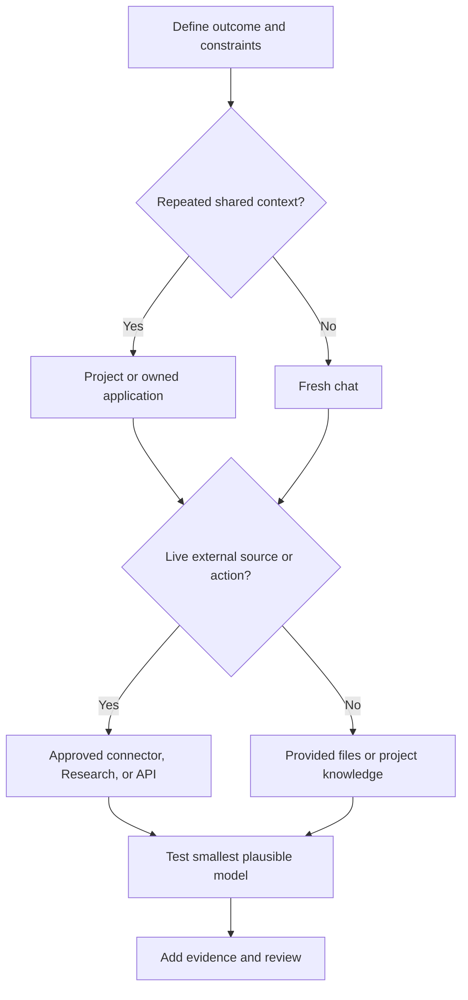

# 选择能承载工作的最小接口面

> 产品选择就是知识工作尺度上的架构设计。选错接口面会让正确的输出变得过期、不可审查或无谓地昂贵。

> **【中文解读】** 本课把"选产品"提升为"做架构"。核心方法：先沿六个维度（重复性、知识、新鲜度、输出、后果、协作）描述工作，再选界面；模型家族（Haiku/Sonnet/Opus）是角色不是等级；部署是控制面决策，四条路径（Anthropic 直连、Bedrock、Vertex AI、Foundry）是所有权地图而不是排名。判断标准始终是"最小的充分能力"。

> 🔗 **【前置】** 学本课前请先掌握：(1) 第 00 课"学决策，不是学术语"——场景决策栈、稳定原则与易变事实的区分是本课的地基；(2) Phase 17·01"托管 LLM 平台"——托管平台的基本形态有助于理解部署路径对比。

**类型：** 学习
**语言：** Python
**前置条件：** [学决策，不是学术语](../../00-certification-strategy/)、[托管 LLM 平台](../../../../../phases/17-infrastructure-and-production/01-managed-llm-platforms/)
**预计用时：** 约 90 分钟

## 学习目标

- 在聊天、Projects、Research、文件与 Artifacts、连接器和编程接口之间做选择。
- 不依赖具体模型版本地解释 Haiku、Sonnet、Opus 的持久角色分工。
- 让接口面和模型匹配质量、速度、成本、新鲜度和治理约束。
- 用架构决策记录比较 Anthropic 直连、Amazon Bedrock、Google Vertex AI 和 Microsoft Foundry 四条部署路径。
- 识别何时该用记忆、项目知识或新会话作为正确的连续性机制。
- 给易变的产品事实标注官方来源与核实日期。

## 问题引入

> **【中文解读】** 失败不是从措辞开始的，而是从选错工作界面开始的。考试目标名叫"产品与模型选择"，真本事是边界设计：你能让 Claude 看到什么、记住什么、检索什么、创建什么、配多强的推理能力。

一位运营负责人准备每周竞品简报。她打开上周的聊天，粘贴三个新链接，要求更新，然后转发结果。

产出的内容很漂亮。但它引用了前一段对话里的旧产品价格，漏掉一份内部文档中的政策变化，还包含一条没有来源的竞品论断。失败不是从措辞开始的，而是从所选的工作界面开始的。

旧聊天带着过期上下文。粘贴的链接不保证全面调研。内部政策不在可用知识之内。工作流没有论断验证步骤。

考试目标名叫"产品与模型选择"，但真正的技能是边界设计。你决定 Claude 能看到什么、记住什么、检索什么、创建什么，以及这个任务配得上多少推理能力。

## 核心概念

> 💡 **【类比】** 选接口面像选通勤方式：一次性取件就步行（新聊天）；每天同一条线就坐班车（Project，固定路线、有班次表）；多站接送要包车（Cowork，可中途调整路线）；全市摸底就请调研公司（Research，多源带引用）；要长期自营就买车队（API，自己定规矩）。错误不在工具，而在"用步行送一批货"或"为取个快递买车队"。

### 从工作出发，而不是从功能菜单出发

> **【中文解读】** 先画像后选型，顺序不能反。六个维度缺一不可——尤其"后果"和"协作"最容易被忽略，却直接决定要不要治理和归属机制。

沿六个维度描述任务：

| 维度 | 问题 |
|---|---|
| 重复性 | 这是一次性、重复还是持续的工作？ |
| 知识 | 所需的源是小、大、私有还是常变？ |
| 新鲜度 | 昨天的副本今天会不会错？ |
| 输出 | 结果是回复、报告、文件、分析还是可复用工作流？ |
| 后果 | 结果错误或动作失误会怎样？ |
| 协作 | 单人使用，还是团队必须共享维护？ |

然后才选界面。

### 聊天适合有边界的会话式工作

> **【中文解读】** 新聊天 = 干净的上下文边界，是一次性任务的正解；旧聊天的危险在于"旧假设悄悄影响新工作"。记忆不是权威数据库——政策和客户记录要放有主有日期的系统。

新聊天往往是"输入明确的一次性任务"的正确默认选择。它给你一条干净的上下文边界。用它做起草、头脑风暴、解释、转换给定文本和短分析。

当旧假设悄悄影响新工作时，长期运行的聊天就变得危险。目标变了、上下文里有相互冲突的指令、或你解释不清哪些早期消息仍然重要时，就重启。需要连续性时，重启前先提取一段简短、经过核实的交接信息。

聊天搜索和记忆能找回先前的上下文，但它们不是"经批准的事实源"的替代品。记忆适合存偏好和持久的工作背景；政策、价目表或客户记录应放进有人维护、带归属和日期的系统。

### Project 是被维护的上下文边界

> **【中文解读】** Project 的价值不是存储而是可重复性；风险是配置过期——装着上季度政策的 Project 会稳定地做出同一个错误决策。每个 Project 都要有主人、源清单、审查节奏和移除流程。

Project 把聚焦的聊天与项目指令、知识库编成一组。当同一套稳定上下文支撑重复性工作时——比如品牌指南、研究项目、操作规程或客户事务——它是更合适的选择。

优势不只是存储，而是可重复性。每个新会话都从一条有意的边界之内开始。

风险是配置过期。装着上季度政策的 Project 会持续做出同一个错误决策。每个 Project 都需要主人、源清单、审查节奏和移除流程。

官方产品行为会变。截至 2026 年 8 月 8 日核实，Anthropic 的帮助材料称 Project 可包含指令和上传的知识，并在知识接近上下文上限时可使用检索。可用性、限额和套餐要求必须在当前帮助中心重新核实。

### Cowork 是可引导的任务循环

> **【中文解读】** Cowork 是结果驱动的任务循环：描述成果、审查做法、看进度、随时改向。关键红线：长时间运行的任务循环不会把责任转移给模型——敏感文件、陌生 plugins、有后果的动作要走手动批准。

Cowork 是面向多步知识工作的产品界面，不是独立部署路径，也不是本课的考试目标。截至 2026 年 8 月 9 日核实，Anthropic 当前帮助材料描述的是一个结果驱动的任务循环：你描述想要的成果、审查做法、观看进度，并在运行中引导或改向。Projects 可为相关任务提供常备文件、链接、指令和记忆；Skills 提供可复用工作流；plugins 可打包 skills、连接器、agent 和 hooks。

当结果是真实文件、或跨经批准源的协同任务、且工作受益于人工引导时，使用 Cowork。把文件边界收窄：当前文档称本地访问限于已连接的文件夹、文件操作要过权限、永久删除需要显式批准。对敏感文件、不熟悉的 plugins、有后果的动作或宽泛的计算机访问，使用手动批准、贴近任务、并审查产出的文件。长时间运行的任务循环不会把责任转移给模型。

### Research 用于多源调查

> **【中文解读】** Research 覆盖"广撒网 + 多次搜索 + 综合 + 引用"；窄的最新事实用 web search 即可。引用是通往证据的导航，不是自动的证明。

当任务需要广泛的信息收集、多次搜索、综合与引用时，使用 Research。查一个窄的最新事实，直接 web search 更好。比较市场、评审多篇论文、或把公开来源与连接的内部材料对账，Research 更合适。

Research 不能免除对来源的判断。一份长报告仍可能引用弱证据、混合不同日期的论断、或漏掉一条私有约束。把引用当作通往证据的导航，而不是自动的证明。

### 文件与 Artifacts 让输出可审查

> **【中文解读】** 输出形态跟着"下一步"走：读完即弃用行内文本，要比对用表格，进业务流程用可下载文档。产物必须暴露假设、来源、日期和未决事项。

依据"接下来会发生什么"选择输出形态。答案会被读完即弃时，行内文本合适；字段需要比对时，结构化表格更好；结果要进入业务流程时，可下载的文档或电子表格更好。

产物应当暴露假设、来源、日期和未决事项。一个隐藏不确定性的漂亮文件，比一张带清晰证据列的朴素表格更难审查。

文件创建与编辑能力会随界面、套餐、文件类型和大小变化。围绕它们设计周期性工作流之前，先核实当前限额。

### 连接器用实时受权访问取代复制

> **【中文解读】** 连接器解决"新鲜度 + 手工复制漂移"。但选它之前要过六项检查：只读还是可写、继承了什么权限、动作是否逐一审批、什么数据随对话留存、是否需要管理员启用、是否暴露你需要的内容类型。

连接器让 Claude 从外部服务检索或在其中执行动作。当源的新鲜度重要、手工复制粘贴会漂移时，它们很有用。

不要仅因为存在某个连接器就选它。检查：

- 它是只读的，还是能改写数据。
- 它从被连接账户继承了哪些权限。
- 是否每个动作都需要批准。
- 哪些数据会随对话留存。
- 是否需要组织管理员启用。
- 该连接器是否暴露你需要的准确内容类型。

截至 2026 年 8 月 8 日核实，官方文档称 Google Workspace 连接器可以搜索 Gmail、配合 Calendar 和 Drive 工作，且动作需要显式批准。文档还记录了限制，包括可能不可见的内容。这些细节都是易变的产品事实。

### API 与编程界面服务于自有软件行为

> **【中文解读】** 分界线：需要确定性集成、自定义界面、自动化测试、版本化配置或软件系统内重复执行时才上 API。不要为了逃避配置 Project 而自建应用。

当你需要确定性集成、自定义界面、自动化测试、版本化配置或在软件系统内重复执行时，转向 API、Claude Code 或 agent 运行时。

不要为了逃避学习配置 Project 而去构建应用。但当工作流需要聊天产品表达不了的契约——比如类型化输出 schema、应用自有授权或每次发布的自动化评估——就该构建。

### 部署是一个控制面决策

> **【中文解读】** 选界面和选"Claude 跑在哪"是两个决策。四条路径不是排名而是所有权地图：最优路径 = 用最少新控制面满足组织约束。直连家族里，企业席位 ≠ API 容量；数据处理者也因路径而异。写"Azure"或"AWS"不够，要记录确切 offerings、区域和托管选项。

选工作界面和选 Claude 在哪里运行是不同的决策。Project 可以是正确的员工侧界面，同时另一个应用使用云端托管的 API。不要把两个选择都藏在"Claude"这个词后面。

截至 2026 年 8 月 9 日核实，Anthropic 官方文档描述了企业架构评审应比较的四条部署路径：

| 路径 | 控制面与采购 | 何时强匹配 | 批准前复查 |
|---|---|---|---|
| Claude for Enterprise 与直连 Claude API | Anthropic 管理人类产品和第一方 API 服务。企业席位与直连 API 工作区是两种不同的用量形态。 | 直连 Anthropic 采购可接受、第一方产品访问重要、且没有强制的云市场。 | 企业身份与席位策略、API 认证、工作区预算、数据条款、可用特性与模型生命周期。 |
| Amazon Bedrock | AWS 原生认证、计费、区域、配额和 AWS 管理的推理边界。 | 组织已通过 AWS IAM、AWS 采购和 AWS 合规控制治理生产 AI。 | 模型可用性、区域端点、特性差异、AWS 数据处理、配额和确切的 Bedrock API 代际。 |
| Google Vertex AI | Google Cloud 项目身份、计费，以及全球、多区域或区域端点。 | 工作负载属于既有 Google Cloud 登陆区及其 IAM、计费、日志和驻留控制。 | 模型与特性支持、端点地理、预留与按量容量、Google Cloud 数据处理。 |
| Microsoft Foundry | Azure 原生端点与认证，Azure Market 计费。当前文档描述 Azure 托管与 Anthropic 托管两种选择。 | Azure 采购、Entra 身份、Azure RBAC 和 Foundry 运营已是既定批准路径。 | 托管选项、部署类型、区域或数据区、模型与特性支持、当前处理者条款。 |

这些行不是排名，而是一张所有权地图。最优路径是用最少的新控制面满足组织约束的那条。

把 Anthropic 直连当作一个采购家族，但要让它的控制显式化。Claude for Enterprise 管理"具名的人和共享工作"；直连 Claude API 通过 API 组织和工作区管理"应用工作负载"。席位不是 API 容量，API 支出限额也不是席位政策。

各伙伴云在"谁来运营和处理每一层"上也不同。截至 2026 年 8 月 9 日核实，Anthropic 的数据保留文档称：第一方 Claude API 和 Microsoft Foundry 的数据处理者是 Anthropic，而 Amazon Bedrock 和 Google Cloud 的数据处理者是云厂商。Foundry 还有托管选项，其边界必须从当前 Foundry 页面读取。记录确切的 offerings、区域和托管选项，而不是只写"Azure"或"AWS"。

### 为需求打分，而不是为供应商打分

> **【中文解读】** 六条标准（云承诺、采购、合规与数据边界、身份、席位与预算、运营控制）先于供应商存在。每个分数都要带理由，最后落在 ADR 上——已接受的决策仍要复审日期。

在见供应商之前先写下决策标准：

| 标准 | 架构问题 |
|---|---|
| 云承诺 | 已有哪些登陆区、网络控制、日志系统和支持团队？ |
| 采购 | 消耗必须走云市场还是 Anthropic 直签协议？ |
| 合规与数据边界 | 谁是处理者、推理在哪运行、什么可以出边界、适用哪些保留条款？ |
| 身份 | 人用企业 SSO 和 SCIM，还是工作负载用云身份、联合身份或限定范围的 API 凭证？ |
| 席位与预算 | 买的是具名用户访问、应用令牌、预留容量还是几者兼有？限额在哪里执行？ |
| 运营控制 | 谁拥有模型启用、配额、区域、日志、事件响应、弃用工作和特性核实？ |

为实际工作负载给每条标准加权，给每条路径打分并附一句理由，然后计算结果。没有理由的分数是装饰；复制到另一个组织的分数是误导。

最后写一份架构决策记录（ADR）：写明所选路径、被否决的替代方案、后果和复审触发条件。云承诺、处理者条款、所需特性或采购都可能变，所以已接受的决策仍需要一个复审日期。

### 模型家族是角色，不是等级

> **【中文解读】** Haiku=速度与成本，Sonnet=平衡，Opus=最难工作的能力（前提是实测值得）。版本表是易变事实，选型要证据：先跑最小可能模型，修完提示词/上下文/验证仍失败才升级。

持久的家族模式是：

- **Haiku：**为窄而明确的高频工作优先速度与低成本。
- **Sonnet：**为多数专业工作流平衡能力、延迟与成本。
- **Opus：**为最难的推理、综合与 agentic 工作优先能力——前提是实测质量值得多付的成本或延迟。

具体的代际、别名、价格、上下文上限、输出上限、thinking 模式和平台可用性都会变。永远不要把版本表当作永久知识来教。使用实时的模型总览页和定价页。

选型需要证据。在最小可能满足的模型上跑代表性样本。只有在修复提示词、上下文和验证设计之后实测失败仍然存在时，才升级。



（决策树：定义结果与约束 → 是否重复的共享上下文？→ 是否实时外部源或动作？→ 测试最小可能模型 → 补充证据与审查。）

## 动手构建

> **【中文解读】** 两个联动决策：为竞品简报选界面（含落选方案与理由），为应用工作负载做部署矩阵（六标准加权、四路径打分、ADR 收尾）。红线：不操纵权重逼出心仪供应商；硬性合规规则在打分前声明为门槛。

创建一份包含两个联动决策的产品选型记录。

第一，为每周竞品简报选择工作界面。

1. 声明输出：一份两页的高管简报，附来源附录。
2. 设定新鲜度：公开论断不超过七天；内部产品事实取自当前已批准的路线图。
3. 公开面的广泛收集选 Research；内部文档选经批准的连接器或维护中的 Project 源。
4. 在两个家族档位上测试一份代表性的五源简报来选模型。
5. 比较事实覆盖、无来源论断、延迟和审查时间。
6. 要求一位人类主人批准最终论断。
7. 为每个易变事实记录所用产品文档与日期。

你的决策记录应包含被否决的替代方案。解释为什么复用旧聊天输在过期上下文上，以及如果原生工作流已满足需求，为什么自建应用为时过早。

第二，为应用工作负载完成一份部署决策矩阵：

1. 在打分之前写下一个具体工作负载和六条部署标准。
2. 比较 Claude for Enterprise 与直连 API、Amazon Bedrock、Google Vertex AI 和 Microsoft Foundry。
3. 针对该工作负载给每条标准从一到五加权。
4. 给每个候选一到五的匹配分，且每条标准都附理由。
5. 把每条易变的平台主张链接到当前官方文档并记录核实日期。
6. 选出最高加权匹配，然后写出 ADR 的后果与复审触发条件。

不要操纵权重来强行得出心仪的供应商。如果一条硬性合规规则淘汰了某条路径，把它作为门槛在打分之前声明。

## 交互实验室

> **【中文解读】** 交互实验室的重点不是找"唯一最优界面"，而是观察哪条约束让更简单的界面停止合适。

用模型匹配 figure 改变重复性、新鲜度、后果、协作和输出约束。重点不是找到唯一最优界面，而是观察哪条约束让更简单的界面不再合适。

```figure
01-claude-model-fit
```

## 练习实验室

> **【中文解读】** 故意做坏数据（让便宜模型挂门槛、改部署权重、破坏分数、删带日期证据），验证推荐随证据而不是偏好改变。

运行本地匹配评分器，然后让更便宜的模型挂掉一道门槛，或让更简单的界面满足全部约束。改变部署权重、破坏某个候选分数、或移除带日期的证据。推荐必须因证据而变，而不是因产品或云偏好而变。

## 交付产物

> **【中文解读】** 交付产物是一份已填好的记录模板：简报界面决策 + 受监管 Azure 应用的部署矩阵和 ADR，可作为你自己工作流的改造起点。

`outputs/product-selection-record.json` 包含已填写的每周竞品简报工作界面决策，外加一份面向受监管 Azure 应用的部署矩阵和 ADR。部署部分覆盖当前全部四条路径、六条加权标准、场景化理由、带日期的官方证据、后果和复审触发条件。

## 验证

> **【中文解读】** 校验器把"好决策"变成可执行断言：无日期事实、无主人、无落选方案、算术漂移都会被拒。

运行确定性校验器及其测试：

```bash
cd certifications/claude/lessons/01-claude-product-and-model-landscape/code
python3 main.py
python3 -m unittest discover tests -v
```

校验器会拒绝：无日期的产品事实、基准里不存在的模型选择、缺失的人类主人、没有落选替代方案的决策、不完整的部署路径、算术漂移、无视最高加权匹配的 ADR、缺失的官方证据。把已填记录改造成一个你自己的周期性工作流。

## 毕业设计衔接

> **【中文解读】** 本课产物直接输入第 29-32 课毕业设计的产品选择与源边界决策。

本课测验考察约束变化下的产品与模型匹配。该产物把产品选择与源边界决策输入第 29 至 32 课的毕业设计——在那里你必须论证"更小或更原生的界面为何落败"。

## 运行验证

> **【中文解读】** 决策卡是开工前的自查表。填不出"来源"和"主人"两栏，就还没到写提示词的时候。

开工前使用这张紧凑决策卡：

```text
Outcome:
Recurrence:
Required sources and freshness:
Sensitivity:
Output form:
Human owner:
Chosen surface:
Chosen model family:
Chosen deployment path:
Cloud commitment and procurement route:
Data boundary and processor:
Human seats versus application budget:
Why smaller or simpler alternatives fail:
Changeable facts verified on:
```

（决策卡字段：结果 / 重复性 / 所需来源与新鲜度 / 敏感度 / 输出形态 / 人类主人 / 所选界面 / 所选模型家族 / 所选部署路径 / 云承诺与采购路线 / 数据边界与处理者 / 人类席位对比应用预算 / 更小或更简单方案为何落败 / 易变事实核实日期。）

如果"来源"和"主人"两栏填不出来，你就还没到写提示词的时候。

模型选型保持一个很小的对照集。十个代表性任务比一个英雄案例有用。纳入容易、平常、模糊和易错的案例。度量小模型是否达标，不要只比较文字风格。

## 考试决策模式

- 一次性有界转换通常从全新聊天开始。
- 共享稳定上下文的重复性工作指向维护中的 Project。
- 广泛、最新、多源的调查指向 Research。
- 新鲜外部数据或外部动作指向经批准的连接器或自有集成。
- 结构化、自动化、可测试的行为指向 API 或编程界面。
- 既有的 AWS 治理与采购可以让 Bedrock 成为最小的运营变更。
- 既有的 Google Cloud 治理与端点要求可以让 Vertex AI 成为最小的运营变更。
- 既有的 Azure 采购、身份和 Foundry 运营可以让 Microsoft Foundry 成为最小的运营变更。
- 当直连采购和第一方控制可接受时，Anthropic 直连可以胜任，但企业席位与 API 工作负载仍是两个独立决策。
- 选满足实测质量的最小模型，而不是名声最响的模型。
- 当旧上下文更可能污染而不是帮助时，重启。

## 常见陷阱

- 因为顺手而复用旧聊天。
- 把记忆当成权威数据库。
- 上传一次文件就以为它会一直最新。
- 为简单的查实选择 Research。
- 给连接器超过任务所需的权限。
- 把当前模型价格硬编码进永久决策规则。
- 还没测 Sonnet 或 Haiku 是否达标就选 Opus。
- 当维护中的原生界面已足够时仍自建应用。
- 只看功能标题选云，忽略采购、身份和事件归属。
- 把具名用户席位当应用容量，或把 API 预算当席位政策。
- 写"跑在我们的云里"却不记录确切的 offerings、托管选项、端点地理和处理者。
- 把今天的模型与特性支持冻结成永久的供应商矩阵。

## 练习

1. 为一次性改写、周期性政策问答工作流、五源市场报告和自动工单分类器各选一个界面，并为每个选择辩护。
2. 构造两个"连接器不如文件上传"的案例。
3. 在五个代表性任务上比较大模型和小模型。运行之前先定义成功标准。
4. 审计一个你在用的 Project。列出它的主人、过期来源、持久指令和复审日期。
5. 在官方帮助中心找一个当前产品限额，把它记录为带日期的事实而不是永久规则。
6. 为你组织中的一个应用给四条部署路径打分，然后改变云承诺权重并解释 ADR 是否应该变。

## 关键术语

| 术语 | 含义 |
|---|---|
| 工作界面（Work surface） | 管理输入、上下文、工具和输出的产品边界 |
| 项目知识（Project knowledge） | 为 Project 内对话维护的文件或来源 |
| 记忆（Memory） | 从先前工作派生的用户可控连续性，独立于权威源数据 |
| 连接器（Connector) | 指向外部服务或数据源的经授权链接 |
| Research | 多步信息收集与综合能力 |
| 最小充分能力（Smallest sufficient capability） | 满足全部实测需求的最不复杂的界面与模型 |
| 部署路径（Deployment path） | 人或应用访问 Claude 的商业与运营路线 |
| 控制面（Control plane） | 拥有身份、策略、计费、配额、部署和运营配置的系统 |
| 架构决策记录（ADR） | 记录决策及其背景、替代方案、后果和复审触发条件的带日期文档 |

## 延伸阅读

- [Models overview](https://platform.claude.com/docs/en/about-claude/models/overview) — 家族分工与当前模型 ID 的官方入口
- [Authentication](https://platform.claude.com/docs/en/manage-claude/authentication) — API 认证方式官方文档
- [Workspaces](https://platform.claude.com/docs/en/manage-claude/workspaces) — API 工作区：应用工作负载的组织单元
- [Set up single sign-on](https://support.claude.com/en/articles/13132885-set-up-single-sign-on-sso) — 企业版单点登录设置
- [Claude Enterprise spend limits](https://platform.claude.com/docs/en/manage-claude/spend-limits-api) — 席位与 API 预算的区别
- [API and data retention](https://platform.claude.com/docs/en/manage-claude/api-and-data-retention) — 数据处理者边界的官方说明
- [Claude in Amazon Bedrock](https://platform.claude.com/docs/en/build-with-claude/claude-in-amazon-bedrock) — Bedrock 路径的官方说明
- [Claude on Google Cloud](https://platform.claude.com/docs/en/build-with-claude/claude-on-vertex-ai) — Vertex AI 路径的官方说明
- [Claude in Microsoft Foundry](https://platform.claude.com/docs/en/build-with-claude/claude-in-microsoft-foundry) — Foundry 路径的官方说明
- [What are Projects?](https://support.claude.com/en/articles/9517075-what-are-projects) — Projects 功能官方帮助文档
- [Get started with Claude Cowork](https://support.claude.com/en/articles/13345190-get-started-with-claude-cowork) — Cowork 入门官方文档
- [Use Claude Cowork safely](https://support.claude.com/en/articles/13364135-use-claude-cowork-safely) — Cowork 安全使用官方文档
- [Use Skills in Claude](https://support.claude.com/en/articles/12512180-use-skills-in-claude) — Skills 可复用工作流官方文档
- [Install Cowork plugins](https://claude.com/docs/cowork/guide/plugins) — Cowork plugins 安装指南
- [When to use web search, extended thinking, and Research](https://support.claude.com/en/articles/11095361-when-should-i-use-web-search-extended-thinking-and-research) — 三种能力的选用时机
- [Use connectors to extend Claude](https://support.claude.com/en/articles/11176164-use-connectors-to-extend-claude-s-capabilities) — 连接器能力与审批行为
- [Use Google Workspace connectors](https://support.claude.com/en/articles/10166901-use-google-workspace-connectors) — Google Workspace 连接器的官方限制
- [Context Engineering](../../../../../phases/11-llm-engineering/05-context-engineering/) — 主课程的上下文工程课
- [Model Routing](../../../../../phases/17-infrastructure-and-production/16-model-routing/) — 主课程的模型路由课
