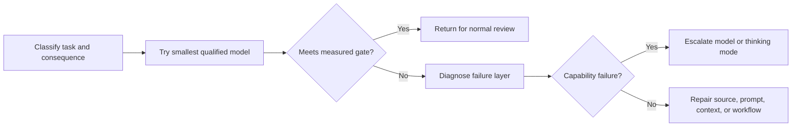

# Spend Capability Where Failure Is Expensive | 把能力花在失败代价高的地方

> Model selection is not a ranking exercise. It is an allocation problem across quality, latency, context, and cost.

> **【中文解读】** 本课纠正两个极端：全路由到最强模型（质量高但延迟不稳、账单爆表）和全路由到最快模型（成本降但复杂案例拿到自信却不完整的建议）。模型选型不是排名题，而是跨质量、延迟、上下文、成本的分配题。工具箱：token 四桶估成本（用变量不用现价）、质量门而非感觉、六层失败诊断（只有第五层是模型问题）、按可观察信号路由、缓存/批处理/限额各治一病、配置是带日期的捆绑包。红线：720 是换算分（scaled score），永远不是 72% 原始正确率。

> 🔗 **【前置】** 学本课前请先掌握：(1) 第 01 课"选择能承载工作的最小接口面"——模型家族角色与"最小充分能力"原则；(2) Phase 11·11"缓存、限流与成本优化"——prompt caching、语义缓存和批处理的基本机制，本课把它们当作不同的优化杠杆来调度。

**Type:** Learn | **类型:** 学习
**Languages:** Python | **语言:** Python
**Prerequisites:** [Choose the Smallest Surface That Can Carry the Work](../../01-claude-product-and-model-landscape/), [Caching, Rate Limiting and Cost Optimization](../../../../../phases/11-llm-engineering/11-caching-cost/) | **前置知识:** [选择能承载工作的最小接口面](../../01-claude-product-and-model-landscape/)、[缓存、限流与成本优化](../../../../../phases/11-llm-engineering/11-caching-cost/)
**Time:** ~90 minutes | **时间:** 约 90 分钟

## Learning Objectives | 学习目标

- Estimate token and workflow cost without relying on a memorized price table.
  中文翻译：不依赖背诵的价格表来估算 token 成本和工作流成本。
- Select a model using measured quality, latency, and consequence.
  中文翻译：用实测质量、延迟和后果来选择模型。
- Explain sampling non-determinism and why a release claim needs repeated evaluation.
  中文翻译：解释采样非确定性，以及为什么发布论断需要重复评估。
- Choose speed, effort, and thinking settings only after current model and platform verification.
  中文翻译：只有在核实当前模型与平台之后才选择 speed、effort 和 thinking 设置。
- Distinguish model failure from prompt, context, source, and workflow failure.
  中文翻译：把模型失败与提示词、上下文、来源和工作流失败区分开。
- Use routing, caching, batching, and output limits as separate optimization levers.
  中文翻译：把路由、缓存、批处理和输出限额当作各自独立的优化杠杆。

## The Problem | 问题引入

> **【中文解读】** 本节的客服团队先全押最强模型（首月质量高，但响应时间不稳、账单是预测的四倍），再矫枉过正全押最快模型（成本降了，升级摘要开始漏例外，复杂退款案拿到自信但不完整的建议）。两种设计都把"模型名"当"策略"，都没有描述工作。生产决策从失败成本出发：内部头脑风暴里的错别字很便宜，退款决策里漏掉的例外很贵——模型、提示词、上下文、源质量和审查流程都应反映这个差异。

A support team routes every request to the most capable model. The first month looks successful. Quality is high, but response time is inconsistent and the bill is four times the forecast.

> 一个客服团队把每个请求都路由到最强模型。第一个月看起来很成功。质量很高，但响应时间不稳定，账单是预测的四倍。

The manager responds by moving everything to the fastest model. Cost falls. Escalation summaries now omit exceptions, and complex refund cases receive confident but incomplete recommendations.

> 经理的应对是把所有请求改到最快的模型。成本降了。但升级摘要开始漏掉例外情况，复杂的退款案件拿到自信却不完整的建议。

Both designs use model names as policy. Neither describes the work.

> 两种设计都把模型名当策略。两种都没有描述工作本身。

A production decision starts with the cost of failure. A typo in an internal brainstorm is cheap. A missing exception in a refund decision is more expensive. The model, prompt, context, source quality, and review process should reflect that difference.

> 生产决策从失败成本出发。内部头脑风暴里的错别字很便宜；退款决策里漏掉的例外则贵得多。模型、提示词、上下文、源质量和审查流程都应反映这个差异。

## The Concept | 核心概念

### Tokens are a workload measure

> **【中文解读】** 模型按 token 计量而非页数或字数。规划时把输入拆四桶（稳定指令/任务输入/检索知识/历史轮次）、输出拆两桶（请求的答案/结构化元数据），因为各桶的优化手段不同：稳定指令可缓存、检索知识可裁剪、历史轮次可摘要或丢弃，任务输入通常动不了。输出侧按当前定价文档确认计费单元（含推理相关计算）。隐藏在单一数字里的成本是无法优化的成本。

Models process tokens, not pages or words. Input tokens include instructions, conversation history, supplied documents, tool definitions, and retrieved content. Output tokens include the response and, depending on the product or API, reasoning-related computation or other billed units described by current pricing.

> 模型处理的是 token，不是页数或字数。输入 token 包括指令、对话历史、提供的文档、工具定义和检索内容。输出 token 包括回复，以及（视产品或 API 而定）推理相关计算或当前定价文档描述的其他计费单元。

For planning, separate four buckets:

> 规划时，把四个桶分开：

```text
total input = stable instructions + task input + retrieved knowledge + prior turns
total output = requested answer + structured metadata
```

（输入四桶：稳定指令 + 任务输入 + 检索知识 + 历史轮次；输出两桶：请求的答案 + 结构化元数据。）

Do not hide all input inside one number. Stable instructions may benefit from caching. Retrieved knowledge may be pruned. Prior turns may be summarized or discarded. Task input usually cannot be removed.

> 不要把所有输入藏进一个数字。稳定指令可能受益于缓存；检索知识可以裁剪；历史轮次可以摘要或丢弃；任务输入通常无法移除。

### Use variables before live prices

Prices change. The durable equation does not:

> 价格会变。持久的方程不变：

```text
request cost = input_tokens / 1,000,000 x input_rate
             + output_tokens / 1,000,000 x output_rate
             + tool or feature charges
```

（请求成本 = 输入 token / 1,000,000 × 输入单价 + 输出 token / 1,000,000 × 输出单价 + 工具或功能费用。）

For a workflow:

> 对一个工作流：

```text
workflow cost = request cost x requests per case x cases per month
              + review cost
              + failure and rework cost
```

（工作流成本 = 请求成本 × 每案件请求数 × 每月案件数 + 审查成本 + 失败与返工成本。）

Review and rework matter. A cheaper model that creates twice as much human correction may be the expensive choice.

> 审查与返工很重要。一个造成双倍人工修正的便宜模型，可能是更贵的选择。

Consider an illustrative, not current, rate card. Model A costs 1 unit for input and 5 for output. Model B costs 3 and 15. A case uses 20,000 input tokens and 2,000 output tokens. Model B costs three times as much per call. If Model A passes 98 percent of triage cases and hard cases can be detected, route the ordinary work to A and escalate the uncertain remainder. If hard cases cannot be detected safely, the routing design is incomplete.

> 考虑一张示意性的（非当前的）价目卡。模型 A 输入 1 单位、输出 5 单位；模型 B 分别是 3 和 15。一个案件用 20,000 输入 token 和 2,000 输出 token，模型 B 每次调用贵三倍。如果模型 A 能通过 98% 的分诊案件、且难案可被检测出来，就把常规工作路由给 A、把不确定的余量升级处理。如果难案无法被安全检测，这个路由设计就是不完整的。

### Quality needs a threshold, not a vibe

Define the minimum acceptable result before testing models. Useful dimensions include:

> 在测试模型之前定义最低可接受结果。有用的维度包括：

- Required facts present.
  中文翻译：必需的事实齐备。
- Unsupported claims absent.
  中文翻译：无来源的论断不存在。
- Instructions followed.
  中文翻译：指令被遵循。
- Output schema valid.
  中文翻译：输出 schema 合法。
- Latency below the workflow limit.
  中文翻译：延迟低于工作流上限。
- Human correction time below a threshold.
  中文翻译：人工修正时间低于阈值。
- Safety and privacy controls preserved.
  中文翻译：安全与隐私控制保持完好。

The best model is the least expensive option that clears every required threshold with adequate margin. Average quality alone is not enough. A model can score well overall while failing every high-consequence edge case.

> 最好的模型是以足够余量通过每条必需阈值的最便宜选项。平均质量本身不够——一个模型可以总分很好，却挂掉每一个高后果的边缘案例。

### Sampling produces a distribution, not a replay

> **【中文解读】** 采样是从概率分布中抽取，不是重放：官方文档说即使 temperature 为零也不是完全确定——相同请求经第一方 API 和伙伴云可能得到不同结果；固定模型 ID 稳定的是权重，路由、安全分类器和采样逻辑等服务基础设施仍可能变。这改写了"什么算证据"：一次通过只证明一次通过；单一均值藏住尾部失败和运行间波动；确定性校验器能查 schema 和算术，但无法让生成变确定；同一版本化任务的重复试验才能揭示最低质量、方差、严重失败和尾延迟。学习练习每配置至少三次独立运行；生产的样本量由你观察到的风险和方差决定。采样控制本身是易变产品事实：截至 2026 年 8 月 9 日核实，当前 Anthropic Messages 指引称 Claude 4.7 及之后版本拒绝非默认 `temperature`、`top_p`、`top_k` 值——不要从旧请求照抄采样设置。

At each generated token, a language model has a distribution over possible continuations. Sampling selects from that distribution. A temperature setting, on models that accept it, changes how concentrated the distribution is. It does not turn model inference into a deterministic function.

> 在每个生成的 token 处，语言模型都有一个关于可能续写的分布。采样从这个分布中抽取。temperature 设置（在接受它的模型上）改变分布的集中程度，但不会把模型推理变成确定性函数。

Official Anthropic API documentation states that even temperature zero is not fully deterministic. Identical requests can produce different results through the first-party API and partner clouds. A pinned model ID stabilizes the model weights, but Anthropic's model-versioning documentation also says serving infrastructure such as routing, safety classifiers, and sampling logic can change.

> Anthropic 官方 API 文档指出：即使 temperature 为零也不是完全确定的。相同请求经第一方 API 和伙伴云可能产生不同结果。固定的模型 ID 稳定的是模型权重，但 Anthropic 的模型版本化文档也说，路由、安全分类器、采样逻辑等服务基础设施可能变化。

This changes what counts as evidence:

> 这改写了什么才算证据：

- One passing response proves one response passed.
  中文翻译：一次通过的响应只证明那一次响应通过了。
- A single average hides tail failures and run-to-run variation.
  中文翻译：单一均值会藏住尾部失败和运行之间的波动。
- Deterministic validators can check schema and arithmetic, but they cannot make generation deterministic.
  中文翻译：确定性校验器能检查 schema 和算术，但它们无法让生成变确定。
- Repeated trials on the same versioned task reveal minimum quality, variance, severe failures, and tail latency.
  中文翻译：同一版本化任务上的重复试验才能揭示最低质量、方差、严重失败和尾延迟。
- A model, prompt, tool, platform, or serving-mode change requires a fresh comparison.
  中文翻译：模型、提示词、工具、平台或服务模式的任何变化都要求重新对比。

Use at least three independent runs per configuration for a small learning exercise. Production sample size must come from the risk and variance you observe, not from this minimum. Compare risk slices separately and prefer gates such as minimum critical-case quality and p95 latency over one flattering mean.

> 小型学习练习中，每个配置至少用三次独立运行。生产的样本量必须来自你观察到的风险和方差，而不是这个下限。分开比较各风险切片，优先用"关键案例最低质量"和"p95 延迟"这类门槛，而不是一个讨喜的均值。

Sampling controls themselves are changeable product facts. As verified on August 9, 2026, current Anthropic Messages guidance says Claude 4.7 and later reject non-default `temperature`, `top_p`, or `top_k` values. Older supported models may still accept some of them. Never copy a sampling setting from an older request without checking the current model and platform documentation.

> 采样控制本身是易变的产品事实。截至 2026 年 8 月 9 日核实，当前 Anthropic Messages 指引称 Claude 4.7 及之后的版本拒绝非默认的 `temperature`、`top_p` 或 `top_k` 值；较旧的仍受支持模型可能仍接受其中一些。不核对当前模型与平台文档，绝不从旧请求照抄采样设置。

### Diagnose the failure layer

> **【中文解读】** 输出变弱时先问失败源于哪一层：(1) 需求失败——成功从未被定义；(2) 来源失败——必要事实缺失或过期；(3) 上下文失败——相关证据被淹没、截断或与冲突材料混杂；(4) 提示词失败——指令或输出标准不清；(5) 模型失败——输入和标准都好但能力不够；(6) 工作流失败——审查、升级或工具行为缺失。升级模型主要只救第五层，还可能暂时掩盖其他层，让系统更难调试——"换个强模型"常常是把病因诊断偷换成止痛药。

When output is weak, ask where the failure originated:

> 输出变弱时，先问失败源自哪里：

1. **Requirement failure:** Success was never defined.
   中文翻译：**需求失败：**成功从未被定义。
2. **Source failure:** The necessary fact was absent or stale.
   中文翻译：**来源失败：**必要的事实缺失或过期。
3. **Context failure:** Relevant evidence was buried, truncated, or mixed with conflicting material.
   中文翻译：**上下文失败：**相关证据被淹没、截断或与冲突材料混杂。
4. **Prompt failure:** Instructions or output criteria were unclear.
   中文翻译：**提示词失败：**指令或输出标准不清。
5. **Model failure:** The model lacked the capability despite good inputs and criteria.
   中文翻译：**模型失败：**输入和标准都好，模型能力仍不够。
6. **Workflow failure:** Review, escalation, or tool behavior was missing.
   中文翻译：**工作流失败：**审查、升级或工具行为缺失。

Upgrading the model helps mainly with layer five. It may conceal the others for a while, which makes the system harder to debug.

> 升级模型主要对第五层有帮助。它可能暂时掩盖其他层，让系统更难调试。

### Latency has several components

Users experience more than total wall-clock time:

> 用户体验到的不只是总耗时：

- Time before the first visible output.
  中文翻译：首个可见输出之前的时间。
- Time between streamed chunks.
  中文翻译：流式分块之间的间隔。
- Total generation time.
  中文翻译：总生成时间。
- Tool and retrieval time.
  中文翻译：工具与检索时间。
- Human approval time.
  中文翻译：人工批准时间。

A more capable model may reduce the number of retries while taking longer per call. A smaller model may respond quickly but create more loops. Measure the complete workflow.

> 更强的模型可能减少重试次数但单次调用更久；更小的模型响应快但可能制造更多循环。度量完整的工作流。

### Route by observable constraints

> 💡 **【类比】** 路由像医院分诊台：常规换药走快诊窗口（快速模型 + 固定模板），症状模糊去全科会诊（均衡模型 + 来源要求），危重病人直达 ICU 并强制主治医师复核（强模型 + 强制人工审查）。分诊依据是可观察信号（体温、主诉、意识状态），不是直觉；分诊台本身也会出错，所以要留审计记录。

A simple routing policy might classify work into three lanes:

> 一个简单的路由策略可以把工作分进三条泳道：

| Lane | Example | Policy |
|---|---|---|
| Routine | Format a supplied update | Fast model, strict template |
| Ambiguous | Compare conflicting notes | Balanced model, source requirements |
| Consequential | Recommend an exception | Capable model plus mandatory review |

> （表格汉译：泳道/示例/策略——常规：格式化一份给定的更新，快速模型 + 严格模板；模糊：比对相互冲突的笔记，均衡模型 + 来源要求；有后果：建议一项例外，强模型 + 强制审查。）

The classifier itself can fail. Use deterministic signals where possible: document length, task type, sensitivity label, requested action, or explicit user selection. Log route decisions and audit misroutes.

> 分类器本身也可能失败。尽可能用确定性信号：文档长度、任务类型、敏感度标签、请求的动作或显式的用户选择。记录路由决策并审计误路由。



（流程图汉译：分类任务与后果 → 试最小合格模型 → 是否达到实测门槛？达到则返回常规审查；否则诊断失败层 → 是否能力失败？是则升级模型或 thinking 模式；否则修复来源、提示词、上下文或工作流。）

### Caching, batching, and limits solve different problems

**Prompt caching** reduces the cost and latency of repeatedly processing stable prompt prefixes when the current model and platform support it. It does not make stale instructions correct.

> **提示词缓存（prompt caching）**在当前模型和平台支持时，降低重复处理稳定提示词前缀的成本和延迟。它不能让过期的指令变正确。

**Semantic caching** reuses a prior result for a sufficiently similar request. It needs a freshness policy and is risky for personalized, rapidly changing, or consequential work.

> **语义缓存（semantic caching）**为足够相似的请求复用先前的结果。它需要新鲜度策略，对个性化、快速变化或有后果的工作有风险。

**Batch processing** trades response time for cost and throughput. It fits offline work such as nightly classification or bulk extraction, not interactive work with a user waiting.

> **批处理（batch processing）**用响应时间换成本和吞吐。它适合夜间分类、批量抽取等离线工作，不适合有用户在等的交互式工作。

**Output limits** prevent unnecessarily long responses. They also truncate work if set below the task's requirement. Ask for the smallest useful output and validate completeness.

> **输出限额（output limits）**防止不必要的长回复；但若设得低于任务需求也会截断工作。请求最小有用输出并验证完整性。

**Context pruning** removes irrelevant input before it is billed and before it distracts the model. More context is not automatically more knowledge.

> **上下文裁剪（context pruning）**在输入被计费、并干扰模型之前移除无关输入。更多上下文不自动等于更多知识。

### A configuration is a dated bundle

> **【中文解读】** 模型只是配置的一个杠杆，整排杠杆包括 speed（服务速度，常有溢价）、effort（模型投入的工作量与 token 花费）、thinking（显式推理的分配）、提示词与输出契约、采样（仍接受的模型上的随机性控制）。各杠杆的支持矩阵是易变事实：截至 2026 年 8 月 9 日核实，官方模型总览把 `claude-sonnet-5` 和 `claude-opus-5` 列为准确的 Claude API ID；Sonnet 5 默认开启自适应 thinking、接受禁用 thinking、支持 low/high effort；Opus 5 接受自适应 thinking 和 medium effort。fast mode 更窄：当前官方文档只列 Opus 5 和 Opus 4.8（不含 Sonnet 5），限于 Claude API（含 Managed Agents）而非伙伴平台，是需申请的 research preview，要 `speed: "fast"` 和 `anthropic-beta: fast-mode-2026-02-01` 头——同一模型更快推理、溢价定价，不承诺更高智能。所以每次实验前：记录确切模型 ID 与平台、打开当前官方页面、把每个候选配置标成带日期的 `docs-supported` / `docs-unsupported`、不试不支持的组合、对同一任务集和门槛重复运行。平台允许时一次只动一个杠杆；被迫同时改模型和 speed 时，那是一个路由替代方案，不是"speed 单独造成结果"的证明。

Model choice is only one configuration lever:

> 模型选择只是配置的一个杠杆：

| Lever | What it changes | What to measure |
|---|---|---|
| Model | Baseline capability, price, supported features, and lifecycle | Quality by risk slice, cost, latency, compatibility |
| Speed | Serving speed where a fast mode is supported, often at a price premium | Output tokens per second, time to first token, p95 latency, accepted-outcome cost |
| Effort | How much work and token spend the model applies across text, thinking, and tool use where supported | Quality, tool-call count, output tokens, latency, cost |
| Thinking | Whether and how the model allocates explicit reasoning where supported | Hard-case quality, thinking tokens, total output, latency, cost |
| Prompt and output contract | Instructions, evidence boundaries, format, and requested length | Instruction following, schema validity, correction time |
| Sampling | Randomness controls on model generations that still accept them | Outcome variation, severe failures, style diversity |

> （表格汉译要点：六行杠杆——模型/速度/努力/思考/提示词与输出契约/采样；"改变什么"和"度量什么"两列分别对应基线能力与按风险切片的质量、每秒输出 token 与 p95 延迟、工具调用次数与 token 花费、难案质量与 thinking token、指令遵循与 schema 合法性、结果波动与严重失败。）

As verified on August 9, 2026, the official models overview lists `claude-sonnet-5` and `claude-opus-5` as the exact Claude API IDs. Sonnet 5 has adaptive thinking on by default, accepts disabled thinking, and supports the low and high effort values used in the artifact. Opus 5 accepts adaptive thinking and the medium effort value used in the artifact.

> 截至 2026 年 8 月 9 日核实，官方模型总览把 `claude-sonnet-5` 和 `claude-opus-5` 列为准确的 Claude API ID。Sonnet 5 默认开启自适应 thinking、接受禁用 thinking、并支持产物中使用的 low 和 high effort 值。Opus 5 接受自适应 thinking 和产物中使用的 medium effort 值。

Fast mode is narrower. Current official documentation lists Opus 5 and Opus 4.8, not Sonnet 5, and limits the feature to the Claude API, including Managed Agents rather than partner platforms. It is a research preview that requires access, `speed: "fast"`, and the `anthropic-beta: fast-mode-2026-02-01` header. It uses the same model with faster inference and premium pricing; it does not promise higher intelligence. Availability, support, and pricing can change independently.

> fast mode 更窄。当前官方文档只列出 Opus 5 和 Opus 4.8（不含 Sonnet 5），并把该特性限于 Claude API（包括 Managed Agents）而非伙伴平台。它是一个需要申请的 research preview：需要访问权限、`speed: "fast"` 和 `anthropic-beta: fast-mode-2026-02-01` 头。它用同一个模型做更快的推理并收溢价定价；它不承诺更高的智能。可用性、支持和定价可能各自独立变化。

Do not build a permanent compatibility matrix into routing code or study notes. Before every experiment:

> 不要把永久兼容性矩阵建进路由代码或学习笔记。每次实验之前：

1. Record the exact model ID and platform.
   中文翻译：记录确切的模型 ID 和平台。
2. Open the current official pages for model support, thinking, effort, speed, and pricing.
   中文翻译：打开当前的官方页面，核实模型支持、thinking、effort、speed 和定价。
3. Mark each proposed configuration as `docs-supported` or `docs-unsupported` with a date and source. Documentation support does not prove that your account has preview access.
   中文翻译：把每个候选配置标为带日期和来源的 `docs-supported` 或 `docs-unsupported`。文档支持并不证明你的账户拥有 preview 访问权。
4. Do not trial an unsupported combination or assume it will silently fall back.
   中文翻译：不要试不支持的组合，也不要假设它会静默回退。
5. Run supported configurations repeatedly against the same task set and gate.
   中文翻译：对同一任务集和门槛重复运行受支持的配置。

Change one lever at a time when the platform permits it. If support forces you to change both model and speed, call that a routing alternative, not proof that speed alone caused the outcome.

> 平台允许时，一次只改一个杠杆。如果支持情况迫使你同时改模型和 speed，那就把它称为一个路由替代方案，而不是"speed 单独造成了结果"的证明。

### A scaled exam score is not a percentage

As verified on August 9, 2026, Anthropic's certification FAQ reports results on a scaled score from 100 to 1,000 with a minimum passing score of 720. Scaling equates exam forms that can have different difficulty.

> 截至 2026 年 8 月 9 日核实，Anthropic 的认证 FAQ 报告的成绩采用 100 到 1,000 的换算分制，最低及格分为 720。换算用来等化难度可能不同的考卷形式。

Therefore, 720 is never evidence that 72 percent correct is the raw pass line. This curriculum's quiz and mock percentages are raw practice scores. They are not convertible to the official scaled score and cannot predict an exam result.

> 因此，720 绝不是"72% 正确率即原始及格线"的证据。本课程的测验和模拟百分比是原始练习分。它们不能换算成官方换算分，也不能预测考试结果。

## Build It | 动手构建

> **【中文解读】** 动手做两件事。第一，为周度运营工作流建十个案例的选型基准：4 个常规格式化/分类、3 个模糊综合、2 个冲突源、1 个必须升级给人类的后果案；先写评分量规（必需事实数、允许的无来源论断数、格式、延迟上限、人工修正分钟上限、后果案必须升级），先测最小可能模型族，只升级失败案例，再对比"路由工作流 vs 全送大模型"。第二，为一个模糊或后果案做 mode-trials 产物：预先定义最低质量、p95 上限、平均成本上限和最少重复次数；至少三个变 speed/effort/thinking 的配置；每个确切模型+平台组合先查当前官方文档、保留一个有文档记载的不支持组合作为被拒选项；每个受支持配置至少跑三次并记录质量、延迟、成本和结果指纹；从原始运行对账出最低质量、p95 和平均成本；选通过全部门槛的最低成本受支持配置。

Create a ten-case model selection benchmark for a weekly operations workflow.

> 为一个周度运营工作流创建十个案例的模型选型基准。

- Four routine formatting and classification cases.
  中文翻译：四个常规的格式化与分类案例。
- Three ambiguous synthesis cases.
  中文翻译：三个模糊的综合案例。
- Two cases with conflicting source material.
  中文翻译：两个含冲突源材料的案例。
- One consequential case that must escalate to a human.
  中文翻译：一个必须升级给人类的后果案。

Define a rubric before running any model:

> 运行任何模型之前先定义评分量规：

```json
{
  "required_facts": 4,
  "unsupported_claims_allowed": 0,
  "format_valid": true,
  "latency_seconds_max": 20,
  "human_correction_minutes_max": 3,
  "consequential_case_must_escalate": true
}
```

（量规字段：必需事实数 = 4；允许的无来源论断数 = 0；格式必须合法；延迟上限 20 秒；人工修正上限 3 分钟；后果案必须升级。）

Test the smallest plausible model family first. Record input and output tokens, latency, rubric score, and correction time. Escalate only the failing cases. Compare the routed workflow against sending all ten cases to the larger model.

> 先测最小可能满足的模型族。记录输入输出 token、延迟、量规得分和修正时间。只升级失败的案例。把路由工作流与"十个案例全送大模型"做对比。

Your report must answer:

> 你的报告必须回答：

- Which cases can safely use the smaller model?
  中文翻译：哪些案例可以安全地用较小的模型？
- Which observable signal routes a case upward?
  中文翻译：哪个可观察信号把案例向上路由？
- Which failures were not model failures?
  中文翻译：哪些失败不是模型失败？
- How much cost does routing save under an illustrative volume?
  中文翻译：在示意性用量下路由省了多少成本？
- What happens when the router is uncertain?
  中文翻译：路由器不确定时会发生什么？

Then create a mode-trials artifact for one ambiguous or consequential case:

> 然后为一个模糊或后果案创建一份 mode-trials 产物：

1. Define minimum quality, maximum p95 latency, maximum mean cost, and a minimum repeated-run count before seeing results.
   中文翻译：在看结果之前定义最低质量、p95 延迟上限、平均成本上限和最少重复运行次数。
2. Propose at least three configurations that vary speed, effort, or thinking.
   中文翻译：提出至少三个变化 speed、effort 或 thinking 的配置。
3. Verify each exact model and platform combination in current official documentation. Preserve one documented unsupported combination as a rejected option.
   中文翻译：在当前官方文档中核实每个确切的模型与平台组合。保留一个有文档记载的不支持组合作为被拒选项。
4. Run every supported configuration at least three times with the same prompt, sources, tools, and grading rubric.
   中文翻译：用相同的提示词、来源、工具和评分量规，把每个受支持配置至少运行三次。
5. Record quality, latency, cost, and an outcome fingerprint for every run.
   中文翻译：为每次运行记录质量、延迟、成本和结果指纹。
6. Reconcile minimum quality, p95 latency, and mean cost from raw runs.
   中文翻译：从原始运行对账出最低质量、p95 延迟和平均成本。
7. Select the least costly supported configuration that clears every gate.
   中文翻译：选择通过每道门槛的最低成本受支持配置。

The provided artifact compares low and high effort, adaptive and disabled thinking, standard and fast serving on one model, and an unsupported fast combination. Its `standard` speed is a normalized experiment label for omitting the request field. Its fast configuration separately records the required preview access, request field, and beta header. It is a dated example, not a reusable compatibility table or proof of account entitlement.

> 提供的产物比较了 low 与 high effort、自适应与禁用 thinking、同一模型的标准与 fast 服务，以及一个不支持的 fast 组合。它的 `standard` speed 是"省略请求字段"的规范化实验标签。它的 fast 配置单独记录了所需的 preview 访问权、请求字段和 beta 头。它是一个带日期的示例，不是可复用的兼容性表，也不是账户权利的证明。

## Interactive Lab | 交互实验室

Use the risk figure to change consequence, uncertainty, reversibility, and review strength. It makes the hidden cost of a false pass visible before you optimize token spend.

> 用风险 figure 改变后果、不确定性、可逆性和审查强度。它让你在优化 token 开销之前，先看见"错误通过"的隐藏成本。

```figure
02-responsible-ai-risk
```

## Practice Lab | 练习实验室

Run the ten-case routing benchmark. Change a consequential case to skip review, duplicate a case ID, or misstate the routed cost and watch deterministic validation fail. Then remove a repeated mode run, change a reconciled p95 value, attempt the documented unsupported mode, or select a configuration that fails cost. Repair the evidence instead of weakening the gate.

> 运行十个案例的路由基准。把一个后果案改成跳过审查、复制案例 ID、或虚报路由成本，看确定性校验失败。然后删除一次重复的模式运行、改动对账后的 p95 值、尝试有文档记载的不支持模式、或选择一个成本不达标的配置。修复证据，而不是放宽门槛。

## Shipped Artifact | 交付产物

`outputs/model-routing-benchmark.json` preserves the ten-case routing contract across routine, ambiguous, conflicting-source, and consequential work. It includes measured gates, chosen lanes, token estimates, review time, and a comparison between routing and using the larger model for every case.

> `outputs/model-routing-benchmark.json` 保存了覆盖常规、模糊、冲突源和后果工作的十案例路由契约。它包括实测门槛、所选泳道、token 估算、审查时间，以及"逐案例对比路由与大模型"的比较。

`outputs/mode-trials.json` is the applied configuration artifact. It records current-doc evidence, speed, effort, thinking, fast-mode request prerequisites, repeated quality, p95 latency, mean cost, unsupported combinations, the selected mode, and rerun triggers.

> `outputs/mode-trials.json` 是应用配置产物。它记录当前文档证据、speed、effort、thinking、fast 模式请求前提、重复质量、p95 延迟、平均成本、不支持的组合、所选模式和重跑触发条件。

The support statements are dated from official documentation and use `docs-supported`, not live-request-verified, as their status. The quality, latency, and cost values are illustrative exercise data, not provider runs or benchmark results. Replace them with repeated results from your own task set and account.

> 支持性陈述带日期、来自官方文档，状态用的是 `docs-supported` 而非"实发请求验证"。质量、延迟和成本数值是示意性练习数据，不是供应商运行或基准结果。用你自己的任务集和账户的重复结果替换它们。

## Verify It | 验证

Verify the benchmark without calling a provider:

> 不调用供应商即可验证基准：

```bash
cd certifications/claude/lessons/02-model-selection-and-token-economics/code
python3 main.py
python3 -m unittest discover tests -v
```

The validator preserves the original benchmark checks and separately validates the mode trials. It requires current official support evidence, an explicit illustrative-measurement label, fast-mode request prerequisites, at least three repeated runs per docs-supported mode, observed outcome fingerprints, reconciled summaries, an unattempted docs-unsupported option, and selection of the least costly passing configuration. It makes no hardcoded claim about which future model supports which mode.

> 校验器保留原有的基准检查并单独校验模式试验。它要求：当前官方支持证据、显式的示意性测量标签、fast 模式请求前提、每个 docs-supported 模式至少三次重复运行、观察到的结果指纹、对账后的摘要、一个未尝试的 docs-unsupported 选项、以及选择成本最低的通过配置。它不对"未来哪个模型支持哪个模式"做任何硬编码断言。

## Capstone Connection | 毕业设计衔接

The quiz tests routing, failure-layer diagnosis, and cost reasoning. Use the validated benchmark as model-selection evidence in capstones 29 through 32, then replace the illustrative measurements with results from your own representative cases.

> 测验考察路由、失败层诊断和成本推理。在第 29 至 32 课的毕业设计中，把验证过的基准用作模型选型证据，然后用你自己代表性案例的结果替换示意性测量值。

## Use It | 运行验证

> **【中文解读】** 用这句决策句收尾："对 [任务类]，选 [模型族或模式]，因为它在 [重复运行] 中以 [p95 延迟和平均成本上限] 之内的代价通过 [质量门]；当 [可观察条件] 时升级，当 [后果阈值] 时要求 [审查规则]；模型、平台、speed、effort、thinking 支持已于 [日期] 在官方文档核实。"只有"它更聪明"不算完成决策。运行基准前先看实时模型总览与定价页；把确切模型标识存进基准结果而不是永久策略；不支持的配置留在决策记录里而不是生产请求里。

Use this decision sentence:

> 使用这句决策句：

```text
For [task class], choose [model family or mode] because it clears [quality gate]
across [repeated runs] within [p95 latency and mean cost limit]. Escalate when
[observable condition], and require [review rule] when [consequence threshold].
Model, platform, speed, effort, and thinking support checked in official docs on [date].
```

（决策句式：对 [任务类] 选 [模型族或模式]，因为它在 [重复运行] 中以 [p95 延迟和平均成本上限] 之内的代价通过 [质量门]；当 [可观察条件] 时升级，当 [后果阈值] 时要求 [审查规则]；模型、平台、speed、effort、thinking 支持已于 [日期] 在官方文档核实。）

If your justification is only "it is smarter," you have not finished the decision.

> 如果你的理由只是"它更聪明"，这个决策还没有完成。

Review the live models overview and pricing pages before running the benchmark. Save the exact model identifiers in the benchmark results, not in the timeless policy. This prevents a model alias change from silently invalidating your evidence.

> 运行基准之前先查看实时模型总览和定价页。把确切的模型标识存进基准结果，而不是写进恒久策略。这能防止模型别名变更悄悄作废你的证据。

Keep unsupported configurations in the decision record, not in production requests. Their rejection explains why a tempting mode was not tested and creates a clear trigger for future verification.

> 把不支持的配置留在决策记录里，而不是生产请求里。对它们的拒绝解释了为什么一个诱人的模式没有被测试，并为未来的核实留下明确触发条件。

## Exam Decision Patterns | 考试决策模式

- Fix missing criteria, sources, and context before paying for more capability.
  中文翻译：在为更强能力付费之前，先修好缺失的标准、来源和上下文。
- Use the smallest model that clears a representative quality gate.
  中文翻译：使用通过代表性质量门的最小模型。
- Include human correction and failure cost, not only token price.
  中文翻译：把人工修正和失败成本算进去，而不只是 token 价格。
- Route consequential or ambiguous work upward using observable signals.
  中文翻译：用可观察信号把有后果或模糊的工作向上路由。
- Batch only when the workflow tolerates delayed completion.
  中文翻译：只在工作流容忍延迟完成时使用批处理。
- Cache stable, reusable material only when freshness and isolation permit it.
  中文翻译：只在新鲜度和隔离性允许时缓存稳定的可复用材料。
- Treat model features, pricing, and limits as dated facts.
  中文翻译：把模型特性、定价和限额当作带日期的事实。
- Repeat probabilistic evaluations; a low temperature or pinned model ID does not guarantee identical output.
  中文翻译：重复概率性评估；低 temperature 或固定模型 ID 都不保证相同输出。
- Compare speed, effort, and thinking as measured configuration choices, not status levels.
  中文翻译：把 speed、effort 和 thinking 当作实测的配置选择来比较，而不是等级。
- Treat 720 as a scaled certification score, never as a raw percentage.
  中文翻译：把 720 当作换算认证分，永远不要当作原始百分比。

## Common Traps | 常见陷阱

- Choosing by family reputation instead of a task benchmark.
  中文翻译：按家族名声而不是任务基准来选。
- Comparing models on one easy example.
  中文翻译：只用一个简单例子比较模型。
- Reporting average quality while hiding critical-case failures.
  中文翻译：报告平均质量却藏住关键案例失败。
- Calling every poor output a model limitation.
  中文翻译：把每个差输出都称作模型局限。
- Adding context until cost and distraction rise together.
  中文翻译：不断加上下文，直到成本和干扰一起上升。
- Reusing cached output after the underlying source changes.
  中文翻译：底层源变了之后还复用缓存输出。
- Omitting review time from the cost model.
  中文翻译：把审查时间从成本模型里漏掉。
- Routing with an opaque classifier and no audit trail.
  中文翻译：用黑盒分类器路由且没有审计记录。
- Declaring a prompt deterministic because one run passed or temperature was low.
  中文翻译：因为一次通过或 temperature 低就宣称提示词是确定性的。
- Copying a speed, effort, thinking, or sampling setting from a different model or platform.
  中文翻译：从不同的模型或平台照抄 speed、effort、thinking 或采样设置。
- Silently downgrading an unsupported mode instead of failing closed and recording the incompatibility.
  中文翻译：对不支持的模式静默降级，而不是安全失败并记录不兼容。
- Comparing mean latency while hiding a tail that violates the user-facing objective.
  中文翻译：比较平均延迟却藏住违反用户侧目标的尾部。
- Converting the 720 scaled exam threshold into a raw 72 percent target.
  中文翻译：把 720 换算及格线换算成 72% 的原始目标。

## Exercises | 练习

1. Calculate monthly cost symbolically for a workflow with 50,000 cases and two model tiers.
   中文翻译：为一个 50,000 案件、两个模型档位的工作流符号化地计算月成本。
2. Write three deterministic routing signals for a support workflow.
   中文翻译：为客服工作流写三个确定性路由信号。
3. Diagnose five failures as requirement, source, context, prompt, model, or workflow problems.
   中文翻译：把五个失败诊断为需求、来源、上下文、提示词、模型或工作流问题。
4. Identify a task that should use batch processing and one that must remain interactive.
   中文翻译：找出一个该用批处理的任务和一个必须保持交互的任务。
5. Verify one current thinking feature in official documentation and record model, platform, and date.
   中文翻译：在官方文档中核实一个当前的 thinking 特性，并记录模型、平台和日期。
6. Run one configuration three times, preserve outcome fingerprints, and explain what a single run would have hidden.
   中文翻译：把一个配置运行三次，保留结果指纹，并解释单次运行会隐藏什么。
7. Find one currently unsupported mode combination in official documentation and record it without sending a request.
   中文翻译：在官方文档中找一个当前不支持的模式组合，不发请求地把它记录下来。

## Key Terms | 关键术语

| Term | Meaning | 中文术语 |
|---|---|---|
| Token economics | The relationship between input, output, request volume, model rates, and workflow cost | token 经济学 |
| Quality gate | A measurable threshold a candidate configuration must clear | 质量门 |
| Routing | Selecting a model or execution lane from task signals | 路由 |
| Escalation | Moving uncertain or consequential work to greater capability or human review | 升级 |
| Prompt caching | Reusing provider-side computation for stable prompt material | 提示词缓存 |
| Rework cost | Human or machine effort required to correct an inadequate output | 返工成本 |
| Sampling | Selecting generated tokens from model probability distributions | 采样 |
| Mode trial | A repeated, dated evaluation of one exact model, platform, speed, effort, and thinking configuration | 模式试验 |
| Tail latency | A high-percentile latency measure such as p95 that exposes slow requests hidden by an average | 尾延迟 |
| Scaled score | A transformed exam result used to equate forms, not a raw percentage correct | 换算分 |

## Further Reading | 延伸阅读

- [Models overview](https://platform.claude.com/docs/en/about-claude/models/overview)
  中文翻译：模型总览——确切模型 ID 与家族支持矩阵的官方入口
- [Create a Message API reference](https://platform.claude.com/docs/en/api/messages/create)
  中文翻译：Messages API 官方参考
- [Working with Messages](https://platform.claude.com/docs/en/build-with-claude/working-with-messages)
  中文翻译：Messages 使用指南——采样参数的当前行为
- [Model IDs and versioning](https://platform.claude.com/docs/en/about-claude/models/model-ids-and-versions)
  中文翻译：模型 ID 与版本化——固定 ID 稳定什么、不稳定什么
- [What's new in Claude Sonnet 5](https://platform.claude.com/docs/en/about-claude/models/whats-new-sonnet-5)
  中文翻译：Sonnet 5 的新特性官方说明
- [What's new in Claude Opus 5](https://platform.claude.com/docs/en/about-claude/models/whats-new-opus-5)
  中文翻译：Opus 5 的新特性官方说明
- [Claude pricing](https://platform.claude.com/docs/en/about-claude/pricing)
  中文翻译：官方定价页——实验前必查
- [Thinking](https://platform.claude.com/docs/en/build-with-claude/thinking)
  中文翻译：thinking 显式推理官方文档
- [Effort](https://platform.claude.com/docs/en/build-with-claude/effort)
  中文翻译：effort 努力档位官方文档
- [Fast mode](https://platform.claude.com/docs/en/build-with-claude/fast-mode)
  中文翻译：fast 模式官方文档——research preview 的前提与限制
- [Prompt caching](https://platform.claude.com/docs/en/build-with-claude/prompt-caching)
  中文翻译：提示词缓存官方文档
- [Batch processing](https://platform.claude.com/docs/en/build-with-claude/batch-processing)
  中文翻译：批处理官方文档
- [Anthropic certification FAQ](https://anthropic-partners.skilljar.com/page/faq-certifications)
  中文翻译：官方认证 FAQ——100-1000 换算分与 720 及格线的出处
- [Caching, Rate Limiting and Cost Optimization](../../../../../phases/11-llm-engineering/11-caching-cost/)
  中文翻译：主课程的缓存与成本优化课
- [Prompt and Semantic Caching Economics](../../../../../phases/17-infrastructure-and-production/14-prompt-semantic-caching/)
  中文翻译：主课程的缓存经济学课
- [Model Routing as a Cost-Reduction Primitive](../../../../../phases/17-infrastructure-and-production/16-model-routing/)
  中文翻译：主课程的模型路由课
