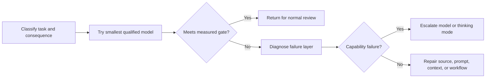

# 把能力花在失败代价高的地方

> 模型选型不是排名练习，而是跨质量、延迟、上下文和成本的分配问题。

> **【中文解读】** 本课纠正两个极端：全路由到最强模型（账单爆表）和全路由到最快模型（复杂案例拿到自信但不完整的建议）。工具箱：token 四桶估成本（用变量不用现价）、质量门而非感觉、六层失败诊断（只有第五层是模型问题）、按可观察信号路由、缓存/批处理/限额各治一病、配置是带日期的捆绑包。红线：720 是换算分，永远不是 72% 原始正确率。

> 🔗 **【前置】** 学本课前请先掌握：(1) 第 01 课"选择能承载工作的最小接口面"——模型家族角色与"最小充分能力"原则；(2) Phase 11·11"缓存、限流与成本优化"——prompt caching、语义缓存和批处理的基本机制。

**类型：** 学习
**语言：** Python
**前置条件：** [选择能承载工作的最小接口面](../../01-claude-product-and-model-landscape/)、[缓存、限流与成本优化](../../../../../phases/11-llm-engineering/11-caching-cost/)
**预计用时：** 约 90 分钟

## 学习目标

- 不依赖背诵的价格表来估算 token 成本和工作流成本。
- 用实测质量、延迟和后果来选择模型。
- 解释采样非确定性，以及为什么发布论断需要重复评估。
- 只有在核实当前模型与平台之后才选择 speed、effort 和 thinking 设置。
- 把模型失败与提示词、上下文、来源和工作流失败区分开。
- 把路由、缓存、批处理和输出限额当作各自独立的优化杠杆。

## 问题引入

> **【中文解读】** 两种极端都把"模型名"当"策略"，都没有描述工作。生产决策从失败成本出发：内部头脑风暴里的错别字很便宜，退款决策里漏掉的例外很贵。

一个客服团队把每个请求都路由到最强模型。第一个月看起来很成功。质量很高，但响应时间不稳定，账单是预测的四倍。

经理的应对是把所有请求改到最快的模型。成本降了。但升级摘要开始漏掉例外情况，复杂的退款案件拿到自信却不完整的建议。

两种设计都把模型名当策略。两种都没有描述工作本身。

生产决策从失败成本出发。内部头脑风暴里的错别字很便宜；退款决策里漏掉的例外则贵得多。模型、提示词、上下文、源质量和审查流程都应反映这个差异。

## 核心概念

### token 是工作量度量

> **【中文解读】** 把输入拆四桶、输出拆两桶，因为各桶的优化手段不同：稳定指令可缓存、检索知识可裁剪、历史轮次可摘要，任务输入通常动不了。隐藏在单一数字里的成本是无法优化的成本。

模型处理的是 token，不是页数或字数。输入 token 包括指令、对话历史、提供的文档、工具定义和检索内容。输出 token 包括回复，以及（视产品或 API 而定）推理相关计算或当前定价文档描述的其他计费单元。

规划时，把四个桶分开：

```text
total input = stable instructions + task input + retrieved knowledge + prior turns
total output = requested answer + structured metadata
```

（输入四桶：稳定指令 + 任务输入 + 检索知识 + 历史轮次；输出两桶：请求的答案 + 结构化元数据。）

不要把所有输入藏进一个数字。稳定指令可能受益于缓存；检索知识可以裁剪；历史轮次可以摘要或丢弃；任务输入通常无法移除。

### 先用变量，后用现价

> **【中文解读】** 价格会变、方程不变。把审查成本和返工成本算进去——造成双倍人工修正的便宜模型可能是更贵的选择。

价格会变。持久的方程不变：

```text
request cost = input_tokens / 1,000,000 x input_rate
             + output_tokens / 1,000,000 x output_rate
             + tool or feature charges
```

（请求成本 = 输入 token / 1,000,000 × 输入单价 + 输出 token / 1,000,000 × 输出单价 + 工具或功能费用。）

对一个工作流：

```text
workflow cost = request cost x requests per case x cases per month
              + review cost
              + failure and rework cost
```

（工作流成本 = 请求成本 × 每案件请求数 × 每月案件数 + 审查成本 + 失败与返工成本。）

审查与返工很重要。一个造成双倍人工修正的便宜模型，可能是更贵的选择。

考虑一张示意性的（非当前的）价目卡。模型 A 输入 1 单位、输出 5 单位；模型 B 分别是 3 和 15。一个案件用 20,000 输入 token 和 2,000 输出 token，模型 B 每次调用贵三倍。如果模型 A 能通过 98% 的分诊案件、且难案可被检测出来，就把常规工作路由给 A、把不确定的余量升级处理。如果难案无法被安全检测，这个路由设计就是不完整的。

### 质量需要阈值，不是感觉

> **【中文解读】** 最好的模型 = 以足够余量通过每条必需阈值的最便宜选项。平均质量本身不够——总分很好却挂掉每个高后果边缘案例的模型不能用。

在测试模型之前定义最低可接受结果。有用的维度包括：

- 必需的事实齐备。
- 无来源的论断不存在。
- 指令被遵循。
- 输出 schema 合法。
- 延迟低于工作流上限。
- 人工修正时间低于阈值。
- 安全与隐私控制保持完好。

最好的模型是以足够余量通过每条必需阈值的最便宜选项。平均质量本身不够——一个模型可以总分很好，却挂掉每一个高后果的边缘案例。

### 采样产生分布，不是重放

> **【中文解读】** 官方文档说 temperature 为零也不是完全确定；固定模型 ID 稳定的是权重，服务基础设施仍可能变。这改写了"什么算证据"：重复试验才揭示最低质量、方差、严重失败和尾延迟。采样控制本身是易变事实——Claude 4.7 及之后版本拒绝非默认 `temperature`/`top_p`/`top_k`（2026-08-09 核实）。

在每个生成的 token 处，语言模型都有一个关于可能续写的分布。采样从这个分布中抽取。temperature 设置（在接受它的模型上）改变分布的集中程度，但不会把模型推理变成确定性函数。

Anthropic 官方 API 文档指出：即使 temperature 为零也不是完全确定的。相同请求经第一方 API 和伙伴云可能产生不同结果。固定的模型 ID 稳定的是模型权重，但 Anthropic 的模型版本化文档也说，路由、安全分类器、采样逻辑等服务基础设施可能变化。

这改写了什么才算证据：

- 一次通过的响应只证明那一次响应通过了。
- 单一均值会藏住尾部失败和运行之间的波动。
- 确定性校验器能检查 schema 和算术，但它们无法让生成变确定。
- 同一版本化任务上的重复试验才能揭示最低质量、方差、严重失败和尾延迟。
- 模型、提示词、工具、平台或服务模式的任何变化都要求重新对比。

小型学习练习中，每个配置至少用三次独立运行。生产的样本量必须来自你观察到的风险和方差，而不是这个下限。分开比较各风险切片，优先用"关键案例最低质量"和"p95 延迟"这类门槛，而不是一个讨喜的均值。

采样控制本身是易变的产品事实。截至 2026 年 8 月 9 日核实，当前 Anthropic Messages 指引称 Claude 4.7 及之后的版本拒绝非默认的 `temperature`、`top_p` 或 `top_k` 值；较旧的仍受支持模型可能仍接受其中一些。不核对当前模型与平台文档，绝不从旧请求照抄采样设置。

### 诊断失败层

> **【中文解读】** 六层失败：需求（成功没定义）、来源（事实缺失或过期）、上下文（证据被淹没/截断/混杂）、提示词（指令不清）、模型（能力不够）、工作流（审查/升级/工具缺失）。升级模型主要只救第五层，还可能掩盖其他层——"换个强模型"常常是把病因诊断偷换成止痛药。

输出变弱时，先问失败源自哪里：

1. **需求失败：**成功从未被定义。
2. **来源失败：**必要的事实缺失或过期。
3. **上下文失败：**相关证据被淹没、截断或与冲突材料混杂。
4. **提示词失败：**指令或输出标准不清。
5. **模型失败：**输入和标准都好，模型能力仍不够。
6. **工作流失败：**审查、升级或工具行为缺失。

升级模型主要对第五层有帮助。它可能暂时掩盖其他层，让系统更难调试。

### 延迟有多个组成部分

> **【中文解读】** 用户体验的不只是总耗时：首输出时间、分块间隔、总生成时间、工具与检索时间、人工批准时间都要量。更强的模型可能少重试但单次更久；更小的模型快但循环多——量完整工作流。

用户体验到的不只是总耗时：

- 首个可见输出之前的时间。
- 流式分块之间的间隔。
- 总生成时间。
- 工具与检索时间。
- 人工批准时间。

更强的模型可能减少重试次数但单次调用更久；更小的模型响应快但可能制造更多循环。度量完整的工作流。

### 按可观察的约束路由

> 💡 **【类比】** 路由像医院分诊台：常规换药走快诊窗口（快速模型 + 固定模板），症状模糊去全科会诊（均衡模型 + 来源要求），危重病人直达 ICU 并强制主治医师复核（强模型 + 强制人工审查）。分诊依据是可观察信号，不是直觉；分诊台本身也会出错，所以要留审计记录。

一个简单的路由策略可以把工作分进三条泳道：

| 泳道 | 示例 | 策略 |
|---|---|---|
| 常规 | 格式化一份给定的更新 | 快速模型，严格模板 |
| 模糊 | 比对相互冲突的笔记 | 均衡模型，来源要求 |
| 有后果 | 建议一项例外 | 强模型加强制审查 |

分类器本身也可能失败。尽可能用确定性信号：文档长度、任务类型、敏感度标签、请求的动作或显式的用户选择。记录路由决策并审计误路由。



（流程：分类任务与后果 → 试最小合格模型 → 达到实测门槛则返回常规审查；否则诊断失败层 → 能力失败则升级模型或 thinking；否则修复来源、提示词、上下文或工作流。）

### 缓存、批处理与限额解决不同问题

> **【中文解读】** 五个工具各治一病：prompt caching 治稳定前缀的重复成本（不治过期指令）；语义缓存治相似请求（要新鲜度策略）；批处理治离线吞吐（不治交互）；输出限额治冗长（设低了会截断）；上下文裁剪治计费前的干扰。更多上下文不自动等于更多知识。

**提示词缓存（prompt caching）**在当前模型和平台支持时，降低重复处理稳定提示词前缀的成本和延迟。它不能让过期的指令变正确。

**语义缓存（semantic caching）**为足够相似的请求复用先前的结果。它需要新鲜度策略，对个性化、快速变化或有后果的工作有风险。

**批处理（batch processing）**用响应时间换成本和吞吐。它适合夜间分类、批量抽取等离线工作，不适合有用户在等的交互式工作。

**输出限额（output limits）**防止不必要的长回复；但若设得低于任务需求也会截断工作。请求最小有用输出并验证完整性。

**上下文裁剪（context pruning）**在输入被计费、并干扰模型之前移除无关输入。更多上下文不自动等于更多知识。

### 配置是一个带日期的捆绑包

> **【中文解读】** 模型只是六杠杆之一（模型/速度/努力/思考/提示词与输出契约/采样），各杠杆的支持矩阵是易变事实。fast mode 更窄：只列 Opus 5 和 Opus 4.8、限于 Claude API、是需申请的 research preview、要 beta 头——同一模型更快推理、溢价定价，不承诺更高智能。每次实验前把候选配置标成带日期的 docs-supported / docs-unsupported；一次只动一个杠杆。

模型选择只是配置的一个杠杆：

| 杠杆 | 改变什么 | 度量什么 |
|---|---|---|
| 模型 | 基线能力、价格、受支持特性与生命周期 | 按风险切片的质量、成本、延迟、兼容性 |
| 速度（Speed） | 支持 fast 模式处的服务速度，常带溢价 | 每秒输出 token、首 token 时间、p95 延迟、按接受结果计的成本 |
| 努力（Effort） | 模型在文本、thinking 和工具使用上投入的工作量与 token 花费 | 质量、工具调用次数、输出 token、延迟、成本 |
| 思考（Thinking） | 是否以及如何分配显式推理 | 难案质量、thinking token、总输出、延迟、成本 |
| 提示词与输出契约 | 指令、证据边界、格式和请求长度 | 指令遵循、schema 合法性、修正时间 |
| 采样（Sampling） | 仍接受随机性控制的模型上的生成控制 | 结果波动、严重失败、风格多样性 |

截至 2026 年 8 月 9 日核实，官方模型总览把 `claude-sonnet-5` 和 `claude-opus-5` 列为准确的 Claude API ID。Sonnet 5 默认开启自适应 thinking、接受禁用 thinking、并支持产物中使用的 low 和 high effort 值。Opus 5 接受自适应 thinking 和产物中使用的 medium effort 值。

fast mode 更窄。当前官方文档只列出 Opus 5 和 Opus 4.8（不含 Sonnet 5），并把该特性限于 Claude API（包括 Managed Agents）而非伙伴平台。它是一个需要申请的 research preview：需要访问权限、`speed: "fast"` 和 `anthropic-beta: fast-mode-2026-02-01` 头。它用同一个模型做更快的推理并收溢价定价；它不承诺更高的智能。可用性、支持和定价可能各自独立变化。

不要把永久兼容性矩阵建进路由代码或学习笔记。每次实验之前：

1. 记录确切的模型 ID 和平台。
2. 打开当前的官方页面，核实模型支持、thinking、effort、speed 和定价。
3. 把每个候选配置标为带日期和来源的 `docs-supported` 或 `docs-unsupported`。文档支持并不证明你的账户拥有 preview 访问权。
4. 不要试不支持的组合，也不要假设它会静默回退。
5. 对同一任务集和门槛重复运行受支持的配置。

平台允许时，一次只改一个杠杆。如果支持情况迫使你同时改模型和 speed，那就把它称为一个路由替代方案，而不是"speed 单独造成了结果"的证明。

### 换算分不是百分比

> **【中文解读】** 720 是 100-1000 换算分制的及格线，用来等化不同难度的考卷形式。它绝不等价于 72% 原始正确率；本课程的练习百分比是原始分，不能换算、不能预测。

截至 2026 年 8 月 9 日核实，Anthropic 的认证 FAQ 报告的成绩采用 100 到 1,000 的换算分制，最低及格分为 720。换算用来等化难度可能不同的考卷形式。

因此，720 绝不是"72% 正确率即原始及格线"的证据。本课程的测验和模拟百分比是原始练习分。它们不能换算成官方换算分，也不能预测考试结果。

## 动手构建

> **【中文解读】** 两件事：十案例选型基准（先写量规、先测小模型、只升级失败案例、对比全送大模型）+ mode-trials 产物（门槛先行、配置先查文档、每配置至少三跑、从原始运行对账、选最低成本通过配置）。

为一个周度运营工作流创建十个案例的模型选型基准。

- 四个常规的格式化与分类案例。
- 三个模糊的综合案例。
- 两个含冲突源材料的案例。
- 一个必须升级给人类的后果案。

运行任何模型之前先定义评分量规：

```json
{
  "required_facts": 4,
  "unsupported_claims_allowed": 0,
  "format_valid": true,
  "latency_seconds_max": 20,
  "human_correction_minutes_max": 3,
  "consequential_case_must_escalate": true
}
```

（量规字段：必需事实数 = 4；允许的无来源论断数 = 0；格式必须合法；延迟上限 20 秒；人工修正上限 3 分钟；后果案必须升级。）

先测最小可能满足的模型族。记录输入输出 token、延迟、量规得分和修正时间。只升级失败的案例。把路由工作流与"十个案例全送大模型"做对比。

你的报告必须回答：

- 哪些案例可以安全地用较小的模型？
- 哪个可观察信号把案例向上路由？
- 哪些失败不是模型失败？
- 在示意性用量下路由省了多少成本？
- 路由器不确定时会发生什么？

然后为一个模糊或后果案创建一份 mode-trials 产物：

1. 在看结果之前定义最低质量、p95 延迟上限、平均成本上限和最少重复运行次数。
2. 提出至少三个变化 speed、effort 或 thinking 的配置。
3. 在当前官方文档中核实每个确切的模型与平台组合。保留一个有文档记载的不支持组合作为被拒选项。
4. 用相同的提示词、来源、工具和评分量规，把每个受支持配置至少运行三次。
5. 为每次运行记录质量、延迟、成本和结果指纹。
6. 从原始运行对账出最低质量、p95 延迟和平均成本。
7. 选择通过每道门槛的最低成本受支持配置。

提供的产物比较了 low 与 high effort、自适应与禁用 thinking、同一模型的标准与 fast 服务，以及一个不支持的 fast 组合。它的 `standard` speed 是"省略请求字段"的规范化实验标签。它的 fast 配置单独记录了所需的 preview 访问权、请求字段和 beta 头。它是一个带日期的示例，不是可复用的兼容性表，也不是账户权利的证明。

## 交互实验室

> **【中文解读】** 风险 figure 让你在优化 token 开销之前，先看见"错误通过"的隐藏成本。

用风险 figure 改变后果、不确定性、可逆性和审查强度。它让你在优化 token 开销之前，先看见"错误通过"的隐藏成本。

```figure
02-responsible-ai-risk
```

## 练习实验室

> **【中文解读】** 故意做坏（跳过后果案审查、复制案例 ID、虚报成本、删重复运行、改 p95、试不支持模式），看校验失败——然后修复证据而不是放宽门槛。

运行十个案例的路由基准。把一个后果案改成跳过审查、复制案例 ID、或虚报路由成本，看确定性校验失败。然后删除一次重复的模式运行、改动对账后的 p95 值、尝试有文档记载的不支持模式、或选择一个成本不达标的配置。修复证据，而不是放宽门槛。

## 交付产物

> **【中文解读】** 两份产物：路由基准（契约 + 门槛 + 泳道 + 对比）和 mode-trials（配置证据 + 重复测量 + 重跑触发）。数值是示意数据，用你自己的重复结果替换。

`outputs/model-routing-benchmark.json` 保存了覆盖常规、模糊、冲突源和后果工作的十案例路由契约。它包括实测门槛、所选泳道、token 估算、审查时间，以及"逐案例对比路由与大模型"的比较。

`outputs/mode-trials.json` 是应用配置产物。它记录当前文档证据、speed、effort、thinking、fast 模式请求前提、重复质量、p95 延迟、平均成本、不支持的组合、所选模式和重跑触发条件。

支持性陈述带日期、来自官方文档，状态用的是 `docs-supported` 而非"实发请求验证"。质量、延迟和成本数值是示意性练习数据，不是供应商运行或基准结果。用你自己的任务集和账户的重复结果替换它们。

## 验证

> **【中文解读】** 校验器把"证据纪律"变成断言：官方支持证据、示意标签、fast 前提、三次重复、结果指纹、对账摘要、未尝试的不支持选项、最低成本选择，缺一不可。

不调用供应商即可验证基准：

```bash
cd certifications/claude/lessons/02-model-selection-and-token-economics/code
python3 main.py
python3 -m unittest discover tests -v
```

校验器保留原有的基准检查并单独校验模式试验。它要求：当前官方支持证据、显式的示意性测量标签、fast 模式请求前提、每个 docs-supported 模式至少三次重复运行、观察到的结果指纹、对账后的摘要、一个未尝试的 docs-unsupported 选项、以及选择成本最低的通过配置。它不对"未来哪个模型支持哪个模式"做任何硬编码断言。

## 毕业设计衔接

> **【中文解读】** 本课产物是第 29-32 课毕业设计的模型选型证据来源。

测验考察路由、失败层诊断和成本推理。在第 29 至 32 课的毕业设计中，把验证过的基准用作模型选型证据，然后用你自己代表性案例的结果替换示意性测量值。

## 运行验证

> **【中文解读】** 决策句是本课的收口工具："对某任务类选某模型族或模式，因为它在某门槛内通过；何时升级、何时强制审查、何时核实的文档支持"——只有"它更聪明"不算完成决策。

使用这句决策句：

```text
For [task class], choose [model family or mode] because it clears [quality gate]
across [repeated runs] within [p95 latency and mean cost limit]. Escalate when
[observable condition], and require [review rule] when [consequence threshold].
Model, platform, speed, effort, and thinking support checked in official docs on [date].
```

（决策句式：对 [任务类] 选 [模型族或模式]，因为它在 [重复运行] 中以 [p95 延迟和平均成本上限] 之内的代价通过 [质量门]；当 [可观察条件] 时升级，当 [后果阈值] 时要求 [审查规则]；模型、平台、speed、effort、thinking 支持已于 [日期] 在官方文档核实。）

如果你的理由只是"它更聪明"，这个决策还没有完成。

运行基准之前先查看实时模型总览和定价页。把确切的模型标识存进基准结果，而不是写进恒久策略。这能防止模型别名变更悄悄作废你的证据。

把不支持的配置留在决策记录里，而不是生产请求里。对它们的拒绝解释了为什么一个诱人的模式没有被测试，并为未来的核实留下明确触发条件。

## 考试决策模式

- 在为更强能力付费之前，先修好缺失的标准、来源和上下文。
- 使用通过代表性质量门的最小模型。
- 把人工修正和失败成本算进去，而不只是 token 价格。
- 用可观察信号把有后果或模糊的工作向上路由。
- 只在工作流容忍延迟完成时使用批处理。
- 只在新鲜度和隔离性允许时缓存稳定的可复用材料。
- 把模型特性、定价和限额当作带日期的事实。
- 重复概率性评估；低 temperature 或固定模型 ID 都不保证相同输出。
- 把 speed、effort 和 thinking 当作实测的配置选择来比较，而不是等级。
- 把 720 当作换算认证分，永远不要当作原始百分比。

## 常见陷阱

- 按家族名声而不是任务基准来选。
- 只用一个简单例子比较模型。
- 报告平均质量却藏住关键案例失败。
- 把每个差输出都称作模型局限。
- 不断加上下文，直到成本和干扰一起上升。
- 底层源变了之后还复用缓存输出。
- 把审查时间从成本模型里漏掉。
- 用黑盒分类器路由且没有审计记录。
- 因为一次通过或 temperature 低就宣称提示词是确定性的。
- 从不同的模型或平台照抄 speed、effort、thinking 或采样设置。
- 对不支持的模式静默降级，而不是安全失败并记录不兼容。
- 比较平均延迟却藏住违反用户侧目标的尾部。
- 把 720 换算及格线换算成 72% 的原始目标。

## 练习

1. 为一个 50,000 案件、两个模型档位的工作流符号化地计算月成本。
2. 为客服工作流写三个确定性路由信号。
3. 把五个失败诊断为需求、来源、上下文、提示词、模型或工作流问题。
4. 找出一个该用批处理的任务和一个必须保持交互的任务。
5. 在官方文档中核实一个当前的 thinking 特性，并记录模型、平台和日期。
6. 把一个配置运行三次，保留结果指纹，并解释单次运行会隐藏什么。
7. 在官方文档中找一个当前不支持的模式组合，不发请求地把它记录下来。

## 关键术语

| 术语 | 含义 |
|---|---|
| token 经济学（Token economics） | 输入、输出、请求量、模型费率与工作流成本之间的关系 |
| 质量门（Quality gate） | 候选配置必须通过的可测量阈值 |
| 路由（Routing） | 依据任务信号选择模型或执行泳道 |
| 升级（Escalation） | 把不确定或有后果的工作移交给更强能力或人工审查 |
| 提示词缓存（Prompt caching） | 为稳定提示词材料复用供应商侧计算 |
| 返工成本（Rework cost） | 纠正不合格输出所需的人工或机器投入 |
| 采样（Sampling） | 从模型概率分布中选择生成的 token |
| 模式试验（Mode trial） | 对一个确切模型、平台、speed、effort、thinking 配置的带日期重复评估 |
| 尾延迟（Tail latency） | p95 等高百分位延迟度量，暴露被均值掩盖的慢请求 |
| 换算分（Scaled score） | 用于等化考卷形式的换算考试结果，不是原始答对百分比 |

## 延伸阅读

- [Models overview](https://platform.claude.com/docs/en/about-claude/models/overview) — 确切模型 ID 与家族支持矩阵的官方入口
- [Create a Message API reference](https://platform.claude.com/docs/en/api/messages/create) — Messages API 官方参考
- [Working with Messages](https://platform.claude.com/docs/en/build-with-claude/working-with-messages) — 采样参数的当前行为
- [Model IDs and versioning](https://platform.claude.com/docs/en/about-claude/models/model-ids-and-versions) — 固定 ID 稳定什么、不稳定什么
- [What's new in Claude Sonnet 5](https://platform.claude.com/docs/en/about-claude/models/whats-new-sonnet-5) — Sonnet 5 新特性官方说明
- [What's new in Claude Opus 5](https://platform.claude.com/docs/en/about-claude/models/whats-new-opus-5) — Opus 5 新特性官方说明
- [Claude pricing](https://platform.claude.com/docs/en/about-claude/pricing) — 官方定价页，实验前必查
- [Thinking](https://platform.claude.com/docs/en/build-with-claude/thinking) — thinking 显式推理官方文档
- [Effort](https://platform.claude.com/docs/en/build-with-claude/effort) — effort 努力档位官方文档
- [Fast mode](https://platform.claude.com/docs/en/build-with-claude/fast-mode) — fast 模式的官方前提与限制
- [Prompt caching](https://platform.claude.com/docs/en/build-with-claude/prompt-caching) — 提示词缓存官方文档
- [Batch processing](https://platform.claude.com/docs/en/build-with-claude/batch-processing) — 批处理官方文档
- [Anthropic certification FAQ](https://anthropic-partners.skilljar.com/page/faq-certifications) — 100-1000 换算分与 720 及格线的出处
- [Caching, Rate Limiting and Cost Optimization](../../../../../phases/11-llm-engineering/11-caching-cost/) — 主课程的缓存与成本优化课
- [Prompt and Semantic Caching Economics](../../../../../phases/17-infrastructure-and-production/14-prompt-semantic-caching/) — 主课程的缓存经济学课
- [Model Routing as a Cost-Reduction Primitive](../../../../../phases/17-infrastructure-and-production/16-model-routing/) — 主课程的模型路由课
