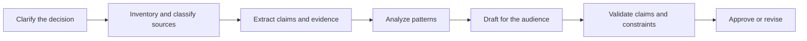

# Turn a Request Into a Testable Contract | 把请求变成可测试的契约

> A strong prompt does not merely describe what to write. It makes success observable before generation begins.

> **【中文解读】** 本课把提示工程（prompting）从"写得好听"升级为"可测试的契约"：强提示词不止描述要写什么，而是在生成开始之前就让"成功"变得可观察。核心方法是先用七要素契约（结果、上下文、任务、证据、约束、格式、验收检查）转写一句模糊请求，再沿可验证边界做任务分解（task decomposition），让每个阶段都产出可独立检查的中间产物。这是认证考试各条路线共享的第一块方法论基石。

> **【拓展：提示工程→契约化的提示工程】** 本课处在 Phase 11 提示工程与认证毕业设计的衔接点上：Phase 11 教的是提示技术的机理（few-shot、思维链），本课教的是工程化用法——先定验收标准再打磨措辞，正对应 Anthropic 官方文档"先定义成功标准、再建评估"的流程。课程 05（输出评估与验证）直接消费本课的产物：验收检查就是评估器的雏形；毕业设计 29 至 32 会把这份提示词包当作带版本的工件复用。

> 🔗 **【前置】** 学本课前请先掌握：(1) 认证课 00《学决策，不是学术语》——理解考试考判断而非术语；(2) Phase 11·01 提示工程——基本提示结构与 few-shot 概念。本课是认证路线的方法论入口，课程 04、05 都以本课的"契约"与"验收检查"为前提。

**Type:** Learn | **类型:** 学习
**Languages:** Python | **语言:** Python
**Prerequisites:** [Study the Decisions, Not the Vocabulary](../../00-certification-strategy/), [Prompt Engineering](../../../../../phases/11-llm-engineering/01-prompt-engineering/) | **前置知识:** 认证课 00《学决策，不是学术语》、Phase 11·01《提示工程》
**Time:** ~100 minutes | **时间:** 约 100 分钟

## Learning Objectives | 学习目标

- Translate an ambiguous request into an outcome, evidence standard, constraints, and acceptance checks.
  中文翻译：把模糊请求转写为结果、证据标准、约束与验收检查。
- Decompose complex work into stages that can be inspected and corrected independently.
  中文翻译：把复杂工作分解为可独立检查与纠正的阶段。
- Choose between direct prompting, examples, structured sections, iteration, and workflow redesign.
  中文翻译：在直接提示、示例、结构化分节、迭代与工作流重设计之间做出选择。
- Diagnose prompt failures without treating every bad output as a model failure.
  中文翻译：诊断提示词层面的失败，而不是把每个坏输出都归咎于模型。
- Build reusable prompt packets for high-value Claude workflows.
  中文翻译：为高价值 Claude 工作流构建可复用的提示词包。

## The Problem | 问题引入

> **【中文解读】** 本节的失败案例值得逐句拆解：输出流畅、有建议、有表格，却完全不可用——建议违反政策、表格混用两个日期区间、漏掉区域例外、无法追溯证据。团队的三次修复（加"要准确"、要求"想深一点"、换更强模型）全部无效，因为问题不在文风也不在能力，而在请求从未定义决策、许可来源、覆盖范围、受众与"建议算被支持"的判定标准。当"看起来可信"是唯一可见目标时，模型就会去优化可信度。

An operations manager asks Claude to "research our customer complaints and create a persuasive executive report with recommendations." The result is fluent. It includes four recommendations, two trends, and a clean table.

> 运营经理让 Claude"调研我们的客户投诉，写一份有说服力、带建议的高管报告"。结果很流畅：四条建议、两个趋势、一张干净的表格。

It is also unusable. One recommendation conflicts with policy. The table combines two date ranges. A regional exception is missing. Nobody can tell which complaint supports which claim.

> 它同样不可用。一条建议与政策冲突。表格混用了两个日期区间。一个区域例外被漏掉。没人能说清哪条投诉支持哪个论断。

The team tries three repairs. They add "be accurate." They ask Claude to "think harder." Then they paste the same request into a more capable model. The prose improves, but the evidence problem remains.

> 团队尝试了三种修复：加上"要准确"；让 Claude"再想想"；然后把同样的请求贴给更强的模型。文风改善了，证据问题原封不动。

The request never defined the decision, the permitted sources, the required coverage, the audience, or the test for a supported recommendation. Claude optimized for a plausible report because plausibility was the only visible target.

> 这个请求从未定义决策、许可的来源、必需的覆盖范围、受众，以及"一条建议算被支持"的检验标准。Claude 优化出一份"看似可信"的报告，因为可信度是唯一可见的目标。

## The Concept | 核心概念

### Prompting is interface design

> **【中文解读】** 提示词是人的意图与模型行为之间的接口。好接口显式暴露输入、约束、输出与失败状态；弱提示词把这四样全藏进"优秀""全面""专业"这类形容词。七要素契约就是接口的规格说明——顺序不重要，缺一不可。分节（Markdown 标题或 XML 风格标签）帮模型区分数据与指令，也帮评审者定位假设。

> 💡 **【类比】** 提示契约像装修合同。只说"给我装好看点"（形容词式提示词），工人只能按自己的品味发挥；合同写明房间用途（结果）、品牌限定的材料清单（证据来源）、不许动承重墙（约束）、交付时的验收单（验收检查），双方才对"完工"有共同标准。之前争议靠扯皮，之后争议对照验收单逐条核对。

A prompt is an interface between human intent and model behavior. Good interfaces expose inputs, constraints, outputs, and failure states. Weak prompts hide all four inside adjectives such as "great," "comprehensive," or "professional."

> 提示词是人的意图与模型行为之间的接口。好接口暴露输入、约束、输出和失败状态。弱提示词把这四样全部藏进诸如"很棒""全面""专业"的形容词里。

Use this contract:

> 使用这份契约：

1. **Outcome:** What decision or action will this output support?
   中文翻译：**结果：** 这份输出将支持什么决策或行动？
2. **Context:** What background is necessary, and what is irrelevant?
   中文翻译：**上下文：** 哪些背景是必要的，哪些无关？
3. **Task:** What transformation should Claude perform?
   中文翻译：**任务：** Claude 应执行什么转换？
4. **Evidence:** Which sources may support claims, and how should gaps be handled?
   中文翻译：**证据：** 哪些来源可以为论断提供支持，缺口应如何处理？
5. **Constraints:** What must not happen?
   中文翻译：**约束：** 什么绝不允许发生？
6. **Format:** What exact shape should the result take?
   中文翻译：**格式：** 结果应呈现什么确切形状？
7. **Acceptance checks:** How will a person or program decide whether it passes?
   中文翻译：**验收检查：** 人或程序如何判定它是否通过？

The order matters less than the presence of each part. You can label sections with Markdown headings, XML-style tags, or another consistent delimiter. Structure helps the model distinguish data from instructions and helps reviewers locate assumptions.

> 各部分是否齐全比顺序更重要。你可以用 Markdown 标题、XML 风格标签或其它一致的分隔符来标注分节。结构帮助模型区分数据与指令，也帮助评审者定位假设。

```text
<outcome>
Prepare the weekly support review so the director can choose two process fixes.
</outcome>

<sources>
Use only the attached tickets and policy handbook. Treat the handbook as authoritative.
</sources>

<task>
Group complaints by root cause, quantify each group, and propose no more than three fixes.
</task>

<constraints>
Do not infer customer intent. Mark missing dates as unknown. Do not include names.
</constraints>

<output>
Return: executive summary, evidence table, recommendations, uncertainties.
</output>

<checks>
Every recommendation must cite at least two ticket IDs and one policy section.
</checks>
```

### Criteria come before wording

Prompt optimization is impossible without a target. Define criteria first, then improve the prompt against representative cases.

> 没有目标就无法优化提示词。先定义标准，再针对代表性案例改进提示词。

For the complaint report, criteria might be:

> 对投诉报告来说，标准可以是：

- Every complaint is assigned once or explicitly marked unclassified.
  中文翻译：每条投诉恰好归入一类，或被显式标记为"未分类"。
- Counts reconcile with the input total.
  中文翻译：各计数与输入总数对得上账。
- Policy claims cite a supplied section.
  中文翻译：政策类论断引用所提供的章节。
- Recommendations do not exceed the team's authority.
  中文翻译：建议不超出团队的权限。
- Personally identifying information is absent.
  中文翻译：不出现个人可识别信息。
- Uncertainty is visible instead of converted into a guess.
  中文翻译：不确定性保持可见，而不是被换算成一个猜测。

"Make it better" gives no diagnostic signal. "The counts must reconcile" tells you what failed and what to change.

> "让它更好"给不出任何诊断信号。"计数必须对得上账"才能告诉你什么失败了、该改什么。

### Decompose along verification boundaries

> **【中文解读】** 任务分解的安全感来自"每个阶段都产出可检查的中间产物"。分解不是按页数任意切分，而是沿验证边界切：分析前能否先验证来源集合？解读前能否先验证抽取事实？发布前能否先验证建议？相互独立的阶段可以并行（分类投诉、抽取政策约束），有依赖的必须等待（写建议要等两者）。顺序阶段既减少隐藏耦合，又提供恢复点——抽取错了就修抽取，而不是重生成整份报告。

Long tasks become safer when each stage produces an artifact that can be inspected. A useful decomposition is:

> 当每个阶段都产出可检查的中间产物时，长任务变得更安全。一种有用的分解是：



This is not the same as splitting by arbitrary page count. Each boundary should answer a question:

> 这与按任意页数切分不是一回事。每个边界都应能回答一个问题：

- Can we verify the source set before analysis?
  中文翻译：能否在分析前验证来源集合？
- Can we verify extracted facts before interpretation?
  中文翻译：能否在解读前验证抽取出的事实？
- Can we verify recommendations before publishing?
  中文翻译：能否在发布前验证建议？

Run independent tasks in parallel only when they do not depend on one another. Classifying complaint categories and extracting policy constraints can run in parallel. Writing recommendations must wait for both.

> 只有当任务互不依赖时才并行运行。分类投诉类别与抽取政策约束可以并行；写建议必须等两者完成。

Sequential stages reduce hidden coupling. They also create a recovery point. If extraction is wrong, you repair extraction rather than regenerating the entire report.

> 顺序阶段减少隐藏耦合，还创造了恢复点。如果抽取错了，你修复抽取，而不是重新生成整份报告。

### Examples teach boundaries

> **【中文解读】** Few-shot 示例的价值在于教边界，不是教中心：给情感标签配示例时，三个"明显正面"的例子什么也没教；要放一条模糊投诉、一条混合陈述、一个"未知"案例，并解释每个标签为何成立。示例也会制造隐性规则——如果每条示例都提到零售客户，模型可能把零售用语当成任务的一部分，所以要保持示例多样、精简、与成文标准一致。角色提示同理：它给视角（合规审查者会怎么看），不给知识、权限或访问；"充当合规审查员"替代不了政策原文、来源证据和人工审批步骤。

Few-shot examples are useful when the rule is difficult to state or when formatting must be exact. A good example shows the decision boundary, not just the easy center.

> 当规则难以表述或格式必须精确时，few-shot 示例很有用。好示例展示决策边界，而不只是容易的样本中心。

For sentiment labels, do not provide three obviously positive examples. Include an ambiguous complaint, a mixed statement, and an "unknown" case. Explain why each label applies. The model learns what separates categories.

> 做情感标签时，不要只给三个明显正面的示例。放一条模糊的投诉、一条混合陈述和一个"未知"案例，并解释每个标签为何适用。模型由此学会区分类别靠的是什么。

Examples can also create accidental rules. If every demonstration mentions retail customers, the model may treat retail language as part of the task. Keep examples diverse, minimal, and consistent with the written criteria.

> 示例也会制造意外的规则。如果每条示范都提到零售客户，模型可能把零售用语当作任务的一部分。让示例保持多样、精简，并与成文标准一致。

### Assign roles carefully

Role prompts can supply perspective, such as "act as a compliance reviewer." They do not grant knowledge, authority, or access. A role cannot replace policy text, source evidence, or a human approval step.

> 角色提示可以提供视角，比如"充当合规审查员"。它不授予知识、权限或访问。角色替代不了政策文本、来源证据或人工审批步骤。

Prefer a concrete perspective:

> 优先选择具体的视角：

```text
Review the draft from the perspective of the privacy owner.
Identify each sentence that exposes personal data, cite the applicable supplied policy,
and propose the smallest compliant revision.
```

This is testable. "You are the world's best privacy expert" is not.

> 这样写是可测试的。"你是世界上最棒的隐私专家"则不可测试。

### Iteration needs a hypothesis

Useful iteration changes one meaningful variable and measures the effect across a small evaluation set. Examples:

> 有效的迭代只改变一个有意义的变量，并在一个小评估集上度量效果。示例：

- Hypothesis: requiring a claim-evidence table will reduce unsupported recommendations.
  中文翻译：假设：要求"论断-证据表"将减少无依据的建议。
- Hypothesis: placing the policy before the tickets will improve exception handling.
  中文翻译：假设：把政策放在工单之前将改善例外处理。
- Hypothesis: one counterexample will improve classification of mixed cases.
  中文翻译：假设：一个反例将改善混合案例的分类。

Keep the evaluation cases stable while comparing prompt variants. Otherwise you cannot distinguish a better prompt from an easier input.

> 比较提示词变体时保持评估案例不变。否则你分不清是提示词变好了，还是输入变容易了。

When repeated changes fail, stop polishing sentences. The problem may be missing evidence, conflicting requirements, too much context, insufficient capability, or an unsafe workflow.

> 当反复修改仍然失败时，停止打磨句子。问题可能出在证据缺失、需求冲突、上下文过多、能力不足或工作流不安全。

## Build It | 动手构建

> **【中文解读】** 五步把契约落地：先写验收卡（决策、读者、权威来源、必需事实、禁区、结构、通过条件、升级条件），再建来源层级（冲突时谁赢），然后按"输入-输出-门禁"设计阶段表，接着显式定义证据缺失时的行为（拒答是设计出来的输出，不是模型缺陷），最后用五类对抗案例（正常、缺源、冲突、注入、越权）检验。要点：每个通过条件都必须可观察——"专业"不可观察，"无未解释缩写、以三句话摘要开头"可观察。

### Step 1: Write the acceptance card

Choose one recurring work task. Write a short acceptance card before a prompt:

> 选一个重复出现的工作任务。在写提示词之前先写一张简短的验收卡：

```text
Decision supported:
Primary reader:
Authoritative sources:
Required facts:
Forbidden content or actions:
Output structure:
Pass conditions:
Escalation conditions:
```

Make every pass condition observable. "Professional" is not observable. "Uses no unexplained acronym and begins with a three-sentence summary" is.

> 让每个通过条件都可观察。"专业"不可观察。"不使用未解释的缩写、并以三句话摘要开头"可观察。

### Step 2: Create a source hierarchy

Conflicting sources are normal. Tell Claude which source wins.

> 来源冲突是常态。明确告诉 Claude 哪个来源优先。

```text
Authority order:
1. Approved policy handbook dated 2026-07-01
2. Current operating procedure
3. Ticket notes

If sources conflict, report the conflict. Do not silently choose the newer or longer text.
```

Recency and authority are different. A recent chat message does not automatically override an approved policy.

> 时效性与权威性是两回事。一条最近的聊天消息不会自动覆盖已批准的政策。

### Step 3: Design the stages

For each stage, define input, output, and gate:

> 为每个阶段定义输入、输出与门禁：

| Stage | Input | Output | Gate |
|---|---|---|---|
| Intake | Request and source inventory | Scope card | Owner confirms decision and deadline |
| Extraction | Approved sources | Claim-evidence rows | Required fields complete |
| Analysis | Verified rows | Patterns and exceptions | Counts reconcile |
| Draft | Approved analysis | Audience-ready report | Format and scope pass |
| Validation | Draft plus sources | Findings and corrections | High-risk findings resolved |

This table is a workflow specification. The prompt for each stage can stay smaller and more precise than one giant prompt.

> 这张表就是一份工作流规格说明。每个阶段的提示词可以比一个巨型提示词更小、更精确。

### Step 4: Add uncertainty behavior

Tell Claude what to do when evidence is missing:

> 告诉 Claude 证据缺失时该怎么办：

```text
If a required fact is unavailable, write "Not established from supplied sources."
List the missing source and explain which conclusion cannot be made.
Do not estimate a number unless the task explicitly permits estimation.
```

Abstention is a designed output, not a model defect.

> 拒答（abstention）是一种被设计出来的输出，不是模型缺陷。

### Step 5: Test adversarial cases

Create at least five cases:

> 创建至少五个案例：

- A normal request with complete evidence.
  中文翻译：一个证据完整的正常请求。
- A request missing one required source.
  中文翻译：一个缺少某个必需来源的请求。
- Two sources that conflict.
  中文翻译：两个相互冲突的来源。
- An instruction hidden inside source content.
  中文翻译：一条藏在来源内容里的指令。
- A request that exceeds the user's authority.
  中文翻译：一个超出用户权限的请求。

Record pass or fail against the acceptance card. Do not rely on one impressive demonstration.

> 对照验收卡记录通过或失败。不要依赖一次令人惊艳的演示。

## Interactive Lab | 交互实验室

Use the prompt-contract figure to edit the outcome, evidence, constraints, output shape, and checks as separate components. Follow the stage gates to see why a missing source should stop analysis instead of producing better formatted uncertainty.

> 用提示契约图把结果、证据、约束、输出形状与检查当作独立组件分别编辑。沿阶段门禁走一遍，理解为什么缺一个来源应当叫停分析，而不是产出格式更漂亮的确定性假象。

```figure
03-prompt-contract
```

## Practice Lab | 练习实验室

Run the contract scorer and remove one acceptance check, source rank, stage gate, or adversarial case. Repair the exact failure instead of adding vague prompt wording.

> 运行契约评分器，删掉一个验收检查、来源排序、阶段门禁或对抗案例。修复确切的失败，而不是添加模糊的提示措辞。

## Shipped Artifact | 交付产物

`outputs/prompt-contract-packet.json` is a filled complaint-analysis contract. It contains all seven contract parts, an authority order, five adversarial evaluation cases, explicit abstention behavior, and stage-level gates.

> `outputs/prompt-contract-packet.json` 是一份填好的投诉分析契约。它包含全部七个契约部分、一条权威顺序、五个对抗评估案例、显式的拒答行为和阶段级门禁。

## Verify It | 验证

Validate it locally:

> 本地验证：

```bash
cd certifications/claude/lessons/03-prompting-and-task-decomposition/code
python3 main.py
python3 -m unittest discover tests -v
```

The validator rejects vague pass criteria, missing authority order, absent escalation behavior, or an evaluation set that omits normal, missing-source, conflict, injection, and unauthorized cases.

> 验证器会拒绝模糊的通过标准、缺失的权威顺序、缺席的升级行为，或缺少正常、缺源、冲突、注入与越权案例的评估集。

## Capstone Connection | 毕业设计衔接

The quiz checks contract design, decomposition, evidence hierarchy, and abstention. Carry the validated packet into capstones 29 through 32 as the versioned prompt and acceptance contract for the workflow you build.

> 测验考查契约设计、任务分解、证据层级与拒答。把通过验证的提示词包带入毕业设计 29 至 32，作为你所构建工作流的带版本提示词与验收契约。

## Use It | 运行验证

> **【中文解读】** 考试场景题按固定顺序作答：先找结果，再找缺失的需求或证据，优先选择"让失败变得可观察"的修复，后果严重时保留显式的人工或政策边界，只有排除了提示、上下文与工作流层面的原因之后才升级模型能力。最强答案通常改进契约或工作流，极少是加一个模糊形容词。常见陷阱清单（整个项目一个提示词、只加细节不加层级、把角色当权威、示例缺边界案例、依赖隐藏思维链、第一反应就换模型、无止境会话式修补）每一条都对应一个可命题的反模式。

### Exam decision pattern | 考试决策模式

For scenario questions, use this order:

> 场景题按以下顺序作答：

1. Identify the requested outcome.
   中文翻译：识别所要求的结果。
2. Find the missing requirement or evidence.
   中文翻译：找出缺失的需求或证据。
3. Prefer a repair that makes the failure observable.
   中文翻译：优先选择让失败可观察的修复。
4. Preserve an explicit human or policy boundary when consequences are high.
   中文翻译：后果严重时，保留显式的人工或政策边界。
5. Escalate model capability only after prompt, context, and workflow causes are addressed.
   中文翻译：只有处理完提示、上下文与工作流层面的原因之后，才升级模型能力。

The strongest answer usually improves the contract or the workflow. It rarely adds a vague adjective.

> 最强的答案通常改进契约或工作流，极少是添加一个模糊的形容词。

### Common traps | 常见陷阱

- **One prompt for the entire project:** Complex work has no inspection points.
  中文翻译：**整个项目一个提示词：** 复杂工作没有检查点。
- **More detail without hierarchy:** A longer prompt can contain more contradictions.
  中文翻译：**只有细节没有层级：** 更长的提示词可能装下更多矛盾。
- **Role as authority:** A persona does not create reliable facts or permissions.
  中文翻译：**把角色当权威：** 人设创造不出可靠的事实或权限。
- **Examples without edge cases:** The model learns the easy pattern but misses the boundary.
  中文翻译：**示例没有边界案例：** 模型学会了容易的模式，却错过边界。
- **Chain-of-thought dependency:** Requiring hidden reasoning text is not a substitute for verifiable intermediate artifacts.
  中文翻译：**依赖思维链：** 要求隐藏的推理文本替代不了可验证的中间产物。
- **Model upgrade as first response:** Better capability cannot recover an absent policy.
  中文翻译：**第一反应就换模型：** 更强的能力救不回缺失的政策。
- **Endless conversational correction:** A reusable task needs versioned instructions and evaluation cases.
  中文翻译：**无止境的会话式修补：** 可复用任务需要带版本的指令和评估案例。

### Exercises | 练习

1. Rewrite "Summarize this for leadership" as a seven-part prompt contract.
   中文翻译：把"给领导层总结这份材料"改写成七要素提示契约。
2. Take a five-step task and identify which steps can run in parallel. Explain every dependency.
   中文翻译：取一个五步任务，指出哪些步骤可以并行。解释每一个依赖。
3. Create three examples for a category label: one clear, one boundary case, and one abstention.
   中文翻译：为一个类别标签创建三个示例：一个清晰例、一个边界例、一个拒答例。
4. Design five evaluation cases for your prompt, including conflicting evidence and an unauthorized request.
   中文翻译：为你的提示词设计五个评估案例，包含冲突证据与越权请求。
5. Review a recent weak output and classify the failure as requirement, source, context, prompt, model, or workflow.
   中文翻译：复盘最近一次弱输出，把失败归类为需求、来源、上下文、提示词、模型或工作流。

## Key Terms | 关键术语

- **Acceptance criterion:** An observable condition an output must satisfy.
  中文翻译：**验收标准：** 输出必须满足的可观察条件。
- **Decomposition:** Splitting work into stages with explicit dependencies and outputs.
  中文翻译：**任务分解：** 把工作拆成有显式依赖与产出的阶段。
- **Few-shot prompting:** Supplying examples that demonstrate the desired task or boundary.
  中文翻译：**少样本提示：** 提供展示期望任务或边界的示例。
- **Prompt contract:** A structured statement of outcome, context, task, evidence, constraints, format, and checks.
  中文翻译：**提示契约：** 对结果、上下文、任务、证据、约束、格式与检查的结构化陈述。
- **Source hierarchy:** The rule that determines which evidence is authoritative when sources conflict.
  中文翻译：**来源层级：** 来源冲突时判定哪份证据具有权威性的规则。
- **Abstention:** An explicit refusal to infer when evidence or permission is insufficient.
  中文翻译：**拒答：** 证据或权限不足时明确拒绝推断。
- **Verification boundary:** A point where an intermediate artifact can be tested before work continues.
  中文翻译：**验证边界：** 工作继续之前可以检验中间产物的关卡。

## Further Reading | 延伸阅读

- [Anthropic: Prompt engineering overview](https://platform.claude.com/docs/en/build-with-claude/prompt-engineering/overview)
  中文翻译：Anthropic 提示工程总览——官方方法入口
- [Anthropic: Prompting best practices](https://platform.claude.com/docs/en/build-with-claude/prompt-engineering/claude-4-best-practices)
  中文翻译：Anthropic 提示最佳实践——当前模型版本的官方建议
- [Anthropic: Define success criteria and build evaluations](https://platform.claude.com/docs/en/test-and-evaluate/develop-tests)
  中文翻译：定义成功标准并构建评估——本课"先定标准再写措辞"的官方出处
- [AI Engineering from Scratch: Few-Shot Prompting and Chain of Thought](../../../../../phases/11-llm-engineering/02-few-shot-cot/)
  中文翻译：本课程 Phase 11 的少样本提示与思维链课
- [AI Engineering from Scratch: Anthropic Workflow Patterns](../../../../../phases/14-agent-engineering/12-anthropic-workflow-patterns/)
  中文翻译：本课程 Phase 14 的 Anthropic 工作流模式课

Official product behavior and model-specific prompting advice can change. The links above were checked on 2026-08-08. Recheck the current Anthropic documentation before freezing a production prompt or studying a release-specific feature.

> 官方产品行为与针对特定模型的提示建议可能变化。以上链接于 2026-08-08 核查。冻结生产提示词或研究特定版本特性之前，请重新查阅当前的 Anthropic 官方文档。
