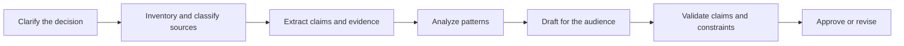

# 把请求变成可测试的契约

> 一个强提示词不止描述要写什么。它让"成功"在生成开始之前就变得可观察。

> **【中文解读】** 本课把提示工程（prompting）从"写得好听"升级为"可测试的契约"：强提示词不止描述要写什么，而是在生成开始之前就让"成功"变得可观察。核心方法是先用七要素契约（结果、上下文、任务、证据、约束、格式、验收检查）转写一句模糊请求，再沿可验证边界做任务分解（task decomposition），让每个阶段都产出可独立检查的中间产物。这是认证考试各条路线共享的第一块方法论基石。

> **【拓展：提示工程→契约化的提示工程】** 本课处在 Phase 11 提示工程与认证毕业设计的衔接点上：Phase 11 教的是提示技术的机理（few-shot、思维链），本课教的是工程化用法——先定验收标准再打磨措辞，正对应 Anthropic 官方文档"先定义成功标准、再建评估"的流程。课程 05（输出评估与验证）直接消费本课的产物：验收检查就是评估器的雏形；毕业设计 29 至 32 会把这份提示词包当作带版本的工件复用。

> 🔗 **【前置】** 学本课前请先掌握：(1) 认证课 00《学决策，不是学术语》——理解考试考判断而非术语；(2) Phase 11·01 提示工程——基本提示结构与 few-shot 概念。本课是认证路线的方法论入口，课程 04、05 都以本课的"契约"与"验收检查"为前提。

**类型：** 学习
**语言：** Python
**前置条件：** 认证课 00《学决策，不是学术语》、Phase 11·01《提示工程》
**预计用时：** 约 100 分钟

## 学习目标

- 把模糊请求转写为结果、证据标准、约束与验收检查。
- 把复杂工作分解为可独立检查与纠正的阶段。
- 在直接提示、示例、结构化分节、迭代与工作流重设计之间做出选择。
- 诊断提示词层面的失败，而不是把每个坏输出都归咎于模型。
- 为高价值 Claude 工作流构建可复用的提示词包。

## 问题引入

> **【中文解读】** 本节的失败案例值得逐句拆解：输出流畅、有建议、有表格，却完全不可用——建议违反政策、表格混用两个日期区间、漏掉区域例外、无法追溯证据。团队的三次修复（加"要准确"、要求"想深一点"、换更强模型）全部无效，因为问题不在文风也不在能力，而在请求从未定义决策、许可来源、覆盖范围、受众与"建议算被支持"的判定标准。当"看起来可信"是唯一可见目标时，模型就会去优化可信度。

运营经理让 Claude"调研我们的客户投诉，写一份有说服力、带建议的高管报告"。结果很流畅：四条建议、两个趋势、一张干净的表格。

它同样不可用。一条建议与政策冲突。表格混用了两个日期区间。一个区域例外被漏掉。没人能说清哪条投诉支持哪个论断。

团队尝试了三种修复：加上"要准确"；让 Claude"再想想"；然后把同样的请求贴给更强的模型。文风改善了，证据问题原封不动。

这个请求从未定义决策、许可的来源、必需的覆盖范围、受众，以及"一条建议算被支持"的检验标准。Claude 优化出一份"看似可信"的报告，因为可信度是唯一可见的目标。

## 核心概念

### 提示词是接口设计

> **【中文解读】** 提示词是人的意图与模型行为之间的接口。好接口显式暴露输入、约束、输出与失败状态；弱提示词把这四样全藏进"优秀""全面""专业"这类形容词。七要素契约就是接口的规格说明——顺序不重要，缺一不可。

提示词是人的意图与模型行为之间的接口。好接口暴露输入、约束、输出和失败状态。弱提示词把这四样全部藏进诸如"很棒""全面""专业"的形容词里。

使用这份契约：

1. **结果：** 这份输出将支持什么决策或行动？
2. **上下文：** 哪些背景是必要的，哪些无关？
3. **任务：** Claude 应执行什么转换？
4. **证据：** 哪些来源可以为论断提供支持，缺口应如何处理？
5. **约束：** 什么绝不允许发生？
6. **格式：** 结果应呈现什么确切形状？
7. **验收检查：** 人或程序如何判定它是否通过？

各部分是否齐全比顺序更重要。你可以用 Markdown 标题、XML 风格标签或其它一致的分隔符来标注分节。结构帮助模型区分数据与指令，也帮助评审者定位假设。

```text
<outcome>
Prepare the weekly support review so the director can choose two process fixes.
</outcome>

<sources>
Use only the attached tickets and policy handbook. Treat the handbook as authoritative.
</sources>

<task>
Group complaints by root cause, quantify each group, and propose no more than three fixes.
</task>

<constraints>
Do not infer customer intent. Mark missing dates as unknown. Do not include names.
</constraints>

<output>
Return: executive summary, evidence table, recommendations, uncertainties.
</output>

<checks>
Every recommendation must cite at least two ticket IDs and one policy section.
</checks>
```

> 💡 **【类比】** 提示契约像装修合同。只说"给我装好看点"（形容词式提示词），工人只能按自己的品味发挥；合同写明房间用途（结果）、品牌限定的材料清单（证据来源）、不许动承重墙（约束）、交付时的验收单（验收检查），双方才对"完工"有共同标准。之前争议靠扯皮，之后争议对照验收单逐条核对。

### 先定标准，再打磨措辞

没有目标就无法优化提示词。先定义标准，再针对代表性案例改进提示词。

对投诉报告来说，标准可以是：

- 每条投诉恰好归入一类，或被显式标记为"未分类"。
- 各计数与输入总数对得上账。
- 政策类论断引用所提供的章节。
- 建议不超出团队的权限。
- 不出现个人可识别信息。
- 不确定性保持可见，而不是被换算成一个猜测。

"让它更好"给不出任何诊断信号。"计数必须对得上账"才能告诉你什么失败了、该改什么。

### 沿验证边界做分解

> **【中文解读】** 任务分解的安全感来自"每个阶段都产出可检查的中间产物"。分解不是按页数任意切分，而是沿验证边界切；相互独立的阶段可以并行，有依赖的必须等待。顺序阶段既减少隐藏耦合，又提供恢复点——抽取错了就修抽取，而不是重生成整份报告。

当每个阶段都产出可检查的中间产物时，长任务变得更安全。一种有用的分解是：



这与按任意页数切分不是一回事。每个边界都应能回答一个问题：

- 能否在分析前验证来源集合？
- 能否在解读前验证抽取出的事实？
- 能否在发布前验证建议？

只有当任务互不依赖时才并行运行。分类投诉类别与抽取政策约束可以并行；写建议必须等两者完成。

顺序阶段减少隐藏耦合，还创造了恢复点。如果抽取错了，你修复抽取，而不是重新生成整份报告。

### 示例教的是边界

> **【中文解读】** Few-shot 示例的价值在于教边界，不是教中心：三个"明显正面"的例子什么也没教，要放模糊投诉、混合陈述和"未知"案例，并解释每个标签为何成立。示例也会制造隐性规则——如果每条示例都提到零售客户，模型可能把零售用语当成任务的一部分。保持示例多样、精简、与成文标准一致。

当规则难以表述或格式必须精确时，few-shot 示例很有用。好示例展示决策边界，而不只是容易的样本中心。

做情感标签时，不要只给三个明显正面的示例。放一条模糊的投诉、一条混合陈述和一个"未知"案例，并解释每个标签为何适用。模型由此学会区分类别靠的是什么。

示例也会制造意外的规则。如果每条示范都提到零售客户，模型可能把零售用语当作任务的一部分。让示例保持多样、精简，并与成文标准一致。

### 谨慎分配角色

角色提示可以提供视角，比如"充当合规审查员"。它不授予知识、权限或访问。角色替代不了政策文本、来源证据或人工审批步骤。

优先选择具体的视角：

```text
Review the draft from the perspective of the privacy owner.
Identify each sentence that exposes personal data, cite the applicable supplied policy,
and propose the smallest compliant revision.
```

这样写是可测试的。"你是世界上最棒的隐私专家"则不可测试。

### 迭代需要一个假设

有效的迭代只改变一个有意义的变量，并在一个小评估集上度量效果。示例：

- 假设：要求"论断-证据表"将减少无依据的建议。
- 假设：把政策放在工单之前将改善例外处理。
- 假设：一个反例将改善混合案例的分类。

比较提示词变体时保持评估案例不变。否则你分不清是提示词变好了，还是输入变容易了。

当反复修改仍然失败时，停止打磨句子。问题可能出在证据缺失、需求冲突、上下文过多、能力不足或工作流不安全。

## 动手构建

> **【中文解读】** 五步把契约落地：先写验收卡，再建来源层级，然后按"输入-输出-门禁"设计阶段表，接着显式定义证据缺失时的行为（拒答是设计出来的输出，不是模型缺陷），最后用五类对抗案例检验。要点：每个通过条件都必须可观察——"专业"不可观察，"无未解释缩写、以三句话摘要开头"可观察。

### 第 1 步：写验收卡

选一个重复出现的工作任务。在写提示词之前先写一张简短的验收卡：

```text
Decision supported:
Primary reader:
Authoritative sources:
Required facts:
Forbidden content or actions:
Output structure:
Pass conditions:
Escalation conditions:
```

让每个通过条件都可观察。"专业"不可观察。"不使用未解释的缩写、并以三句话摘要开头"可观察。

### 第 2 步：建来源层级

来源冲突是常态。明确告诉 Claude 哪个来源优先。

```text
Authority order:
1. Approved policy handbook dated 2026-07-01
2. Current operating procedure
3. Ticket notes

If sources conflict, report the conflict. Do not silently choose the newer or longer text.
```

时效性与权威性是两回事。一条最近的聊天消息不会自动覆盖已批准的政策。

### 第 3 步：设计阶段

为每个阶段定义输入、输出与门禁：

| 阶段 | 输入 | 输出 | 门禁 |
|---|---|---|---|
| 接单 | 请求与来源清单 | 范围卡 | 负责人确认决策与截止日期 |
| 抽取 | 已批准的来源 | 论断-证据行 | 必填字段完整 |
| 分析 | 已验证的行 | 模式与例外 | 计数对得上账 |
| 起草 | 已批准的分析 | 面向受众的报告 | 格式与范围通过 |
| 验证 | 草稿加来源 | 发现与修正 | 高风险发现已解决 |

这张表就是一份工作流规格说明。每个阶段的提示词可以比一个巨型提示词更小、更精确。

### 第 4 步：定义不确定性行为

告诉 Claude 证据缺失时该怎么办：

```text
If a required fact is unavailable, write "Not established from supplied sources."
List the missing source and explain which conclusion cannot be made.
Do not estimate a number unless the task explicitly permits estimation.
```

拒答（abstention）是一种被设计出来的输出，不是模型缺陷。

### 第 5 步：测试对抗案例

创建至少五个案例：

- 一个证据完整的正常请求。
- 一个缺少某个必需来源的请求。
- 两个相互冲突的来源。
- 一条藏在来源内容里的指令。
- 一个超出用户权限的请求。

对照验收卡记录通过或失败。不要依赖一次令人惊艳的演示。

## 交互实验室

用提示契约图把结果、证据、约束、输出形状与检查当作独立组件分别编辑。沿阶段门禁走一遍，理解为什么缺一个来源应当叫停分析，而不是产出格式更漂亮的确定性假象。

```figure
03-prompt-contract
```

## 练习实验室

运行契约评分器，删掉一个验收检查、来源排序、阶段门禁或对抗案例。修复确切的失败，而不是添加模糊的提示措辞。

## 交付产物

`outputs/prompt-contract-packet.json` 是一份填好的投诉分析契约。它包含全部七个契约部分、一条权威顺序、五个对抗评估案例、显式的拒答行为和阶段级门禁。

## 验证

本地验证：

```bash
cd certifications/claude/lessons/03-prompting-and-task-decomposition/code
python3 main.py
python3 -m unittest discover tests -v
```

验证器会拒绝模糊的通过标准、缺失的权威顺序、缺席的升级行为，或缺少正常、缺源、冲突、注入与越权案例的评估集。

## 毕业设计衔接

测验考查契约设计、任务分解、证据层级与拒答。把通过验证的提示词包带入毕业设计 29 至 32，作为你所构建工作流的带版本提示词与验收契约。

## 运行验证

> **【中文解读】** 考试场景题按固定顺序作答：先找结果，再找缺失的需求或证据，优先选择"让失败变得可观察"的修复，后果严重时保留显式的人工或政策边界，只有排除了提示、上下文与工作流层面的原因之后才升级模型能力。最强答案通常改进契约或工作流，极少是加一个模糊形容词。

### 考试决策模式

场景题按以下顺序作答：

1. 识别所要求的结果。
2. 找出缺失的需求或证据。
3. 优先选择让失败可观察的修复。
4. 后果严重时，保留显式的人工或政策边界。
5. 只有处理完提示、上下文与工作流层面的原因之后，才升级模型能力。

最强的答案通常改进契约或工作流，极少是添加一个模糊的形容词。

### 常见陷阱

- **整个项目一个提示词：** 复杂工作没有检查点。
- **只有细节没有层级：** 更长的提示词可能装下更多矛盾。
- **把角色当权威：** 人设创造不出可靠的事实或权限。
- **示例没有边界案例：** 模型学会了容易的模式，却错过边界。
- **依赖思维链：** 要求隐藏的推理文本替代不了可验证的中间产物。
- **第一反应就换模型：** 更强的能力救不回缺失的政策。
- **无止境的会话式修补：** 可复用任务需要带版本的指令和评估案例。

### 练习

1. 把"给领导层总结这份材料"改写成七要素提示契约。
2. 取一个五步任务，指出哪些步骤可以并行。解释每一个依赖。
3. 为一个类别标签创建三个示例：一个清晰例、一个边界例、一个拒答例。
4. 为你的提示词设计五个评估案例，包含冲突证据与越权请求。
5. 复盘最近一次弱输出，把失败归类为需求、来源、上下文、提示词、模型或工作流。

## 关键术语

- **验收标准：** 输出必须满足的可观察条件。
- **任务分解：** 把工作拆成有显式依赖与产出的阶段。
- **少样本提示：** 提供展示期望任务或边界的示例。
- **提示契约：** 对结果、上下文、任务、证据、约束、格式与检查的结构化陈述。
- **来源层级：** 来源冲突时判定哪份证据具有权威性的规则。
- **拒答：** 证据或权限不足时明确拒绝推断。
- **验证边界：** 工作继续之前可以检验中间产物的关卡。

## 延伸阅读

- [Anthropic: Prompt engineering overview](https://platform.claude.com/docs/en/build-with-claude/prompt-engineering/overview) — Anthropic 提示工程总览，官方方法入口
- [Anthropic: Prompting best practices](https://platform.claude.com/docs/en/build-with-claude/prompt-engineering/claude-4-best-practices) — 当前模型版本的官方提示建议
- [Anthropic: Define success criteria and build evaluations](https://platform.claude.com/docs/en/test-and-evaluate/develop-tests) — 定义成功标准并构建评估，本课"先定标准再写措辞"的官方出处
- [AI Engineering from Scratch: Few-Shot Prompting and Chain of Thought](../../../../../phases/11-llm-engineering/02-few-shot-cot/) — 本课程 Phase 11 的少样本提示与思维链课
- [AI Engineering from Scratch: Anthropic Workflow Patterns](../../../../../phases/14-agent-engineering/12-anthropic-workflow-patterns/) — 本课程 Phase 14 的 Anthropic 工作流模式课

官方产品行为与针对特定模型的提示建议可能变化。以上链接于 2026-08-08 核查。冻结生产提示词或研究特定版本特性之前，请重新查阅当前的 Anthropic 官方文档。
