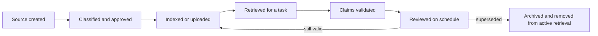

# Put Each Fact in the Right Kind of Context | 把每类事实放进正确类型的上下文

> Context is temporary attention. Knowledge is maintained evidence. Memory is continuity. Caching is reuse. Mixing them creates confident stale answers.

> **【中文解读】** 本课处理"事实放错了地方"这一整类失败：上下文（context）是临时注意力，知识（knowledge）是被维护的证据，记忆（memory）是连续性，缓存（caching）是复用——四者混用就会产出"自信的过时答案"。核心工具是七种机制各司其职的分工表、带权威/归属/敏感度/时效元数据的来源注册表，以及"治理指令 + 任务输入 + 权威证据 + 最小连续性"的上下文四层包。这是认证路线里从提示工程走向知识管理（knowledge management）的一课。

> **【拓展：上下文工程→知识管理】** Phase 11·05 上下文工程讲"往上下文窗口（context window）里放什么"，本课讲"每类事实该住在哪个机制里"——这是从提示层到数据治理层的跨越。真实产品中 Claude 的 Project 指令、Project 知识、memory、connectors 各有职责边界，而它们的名称、限额与定价属于可变的官方事实，备考与生产都要以当前官方文档为准。课程 03 的"来源层级"在本课升级为完整注册表，课程 05 的论断验证又依赖本课定义的"权威来源"。

> 🔗 **【前置】** 学本课前请先掌握：(1) 认证课 03《把请求变成可测试的契约》——来源层级与验收检查的概念；(2) Phase 11·05 上下文工程——上下文窗口与注意力竞争的基本模型。本课的注册表与缓存策略会被毕业设计 29 至 32 直接复用。

**Type:** Learn | **类型:** 学习
**Languages:** Python | **语言:** Python
**Prerequisites:** [Turn a Request Into a Testable Contract](../../03-prompting-and-task-decomposition/), [Context Engineering](../../../../../phases/11-llm-engineering/05-context-engineering/) | **前置知识:** 认证课 03《把请求变成可测试的契约》、Phase 11·05《上下文工程》
**Time:** ~105 minutes | **时间:** 约 105 分钟

## Learning Objectives | 学习目标

- Distinguish chat context, Project instructions, Project knowledge, memory, connectors, retrieval, and API prompt caching.
  中文翻译：区分会话上下文、Project 指令、Project 知识、记忆、connectors、检索与 API 提示缓存。
- Choose what to persist, retrieve, summarize, refresh, or discard.
  中文翻译：决定哪些内容该持久化、检索、摘要、刷新或丢弃。
- Build a source registry with authority, ownership, sensitivity, and freshness metadata.
  中文翻译：构建带权威性、归属、敏感度与时效元数据的来源注册表。
- Reduce context overload without deleting required evidence.
  中文翻译：在不删除必需证据的前提下削减上下文过载。
- Explain which Claude product behaviors are changeable and must be verified in current documentation.
  中文翻译：说明哪些 Claude 产品行为是可变的、必须以当前官方文档核实。

## The Problem | 问题引入

> **【中文解读】** 本节案例的三个月报错很典型：旧路线图里的发布日期同时存在于 Project 知识和多份历史会议纪要中，而更新的决策存在 connector 里——错误答案在上下文里"证据重复"，于是响应听起来无比确定。团队把它叫作幻觉，其实是知识管理失败：把 Project 当文档仓库、把记忆当权威来源、把检索当真实性保证。更多的上下文不等于更好的上下文；可信的系统知道哪些事实是临时的、哪些是权威的、谁负责让它们保持最新。

A team creates a Claude Project for quarterly planning. They upload policy files, meeting notes, sales exports, and an old product roadmap. They also add Project instructions that say, "Use the latest approved plan."

> 一个团队为季度规划创建了 Claude Project。他们上传了政策文件、会议纪要、销售导出数据和一份旧产品路线图，还加了 Project 指令："使用最新的已批准计划。"

Three months later, Claude recommends a launch date from the old roadmap. The date is present in Project knowledge, appears in several historical meeting notes, and conflicts with a newer decision stored in a connector. The response sounds certain because the context contains repeated evidence for the wrong answer.

> 三个月后，Claude 给出了旧路线图里的发布日期。这个日期存在于 Project 知识中、出现在多份历史会议纪要里，并与存放在 connector 里的更新决策相冲突。响应听起来很确定，因为上下文里装满了支持错误答案的重复证据。

The team calls this a hallucination. It is mostly a knowledge-management failure. They treated a Project as a document warehouse, memory as an authority source, and retrieval as a guarantee of truth.

> 团队称之为幻觉。这多半是知识管理失败。他们把 Project 当作文档仓库、把记忆当作权威来源、把检索当作真实性保证。

More context is not the same as better context. A trustworthy system knows which facts are temporary, which are authoritative, and who is responsible for keeping them current.

> 更多的上下文不等于更好的上下文。一个可信的系统知道哪些事实是临时的、哪些是权威的、以及谁负责让它们保持最新。

## The Concept | 核心概念

### Seven mechanisms, seven jobs

> **【中文解读】** 七种机制的精确名称、可用性与限额会随套餐和产品变化（官方事实，须查当前文档），但它们的"职责"是稳定的：会话上下文承载当下对话，Project 指令设定可复用行为，Project 知识供给被维护的参考材料，记忆保留跨会话连续性，connectors 在当前权限下访问外部系统，检索从大语料中选取相关片段，提示缓存高效复用稳定的 API 提示前缀。分类的价值在于防"类别错误"：记忆可以提醒"你喜欢简洁报告"，但不该悄悄变成当前退款政策的出处；connector 能拿到最新文件，但不能证明文件已被批准。

Claude can receive or reuse information through several mechanisms. Their exact availability, limits, and names can change by plan and product. The durable distinction is their job.

> Claude 可以通过多种机制接收或复用信息。它们确切的可用性、限额与名称会随套餐和产品变化。持久的区分标准是它们的职责。

| Mechanism | Primary job | Main risk |
|---|---|---|
| Current chat context | Carry the present conversation | Old turns consume attention or conflict |
| Project instructions | Set reusable behavior and constraints | Broad instructions become stale or ambiguous |
| Project knowledge | Supply a maintained body of reference material | Files lack ownership or freshness controls |
| Memory | Preserve useful continuity across conversations | Remembered preference is mistaken for approved fact |
| Connectors | Access an external system under current permissions | Source permissions, sync, or freshness are misunderstood |
| Retrieval | Select relevant chunks from a larger corpus | Relevant-looking text is incomplete or low authority |
| Prompt caching | Reuse stable API prompt prefixes efficiently | Dynamic content is cached or invalidation is ignored |

A feature can support more than one job, but the distinctions prevent category errors. Memory can remind Claude that you prefer concise reports. It should not silently become the source of the current refund policy. A connector can expose the latest file. It does not prove that the file is approved.

> 一个功能可以兼任多职，但这些区分能防止类别错误。记忆可以提醒 Claude 你偏好简洁的报告，但它不该悄悄变成当前退款政策的出处。Connector 可以暴露最新文件，却不能证明该文件已被批准。

### Context has an attention budget

> **【中文解读】** 大上下文窗口增加的是容量，不是确定性：每多一份文档，就多一分注意力竞争、多一个自相矛盾的机会。按四层打包——治理指令 + 任务专用输入 + 检索到的权威证据 + 最小连续性；稳定的指令保持稳定，只为当前决策添加所需输入，检索走元数据与权威规则，旧对话只在影响当前任务时才携带。长会话会积累被放弃的方案、被更正的事实和排版实验，带着一份核验过的简报开新会话往往比无限续聊更安全；先分清"决策"与"讨论"再做摘要。

A large context window increases capacity, not certainty. Every extra document creates competition for attention and another opportunity for contradiction.

> 大上下文窗口增加的是容量，不是确定性。每多一份文档，就多一分注意力竞争，也多一个自相矛盾的机会。

Think in four layers:

> 按四层来思考：

```text
context package = governing instructions
                + task-specific input
                + retrieved authoritative evidence
                + minimal continuity
```

Keep stable instructions stable. Add only the task input required for the current decision. Retrieve evidence using metadata and authority rules. Carry prior conversation only when it changes the current task.

> 让稳定的指令保持稳定。只添加当前决策所需的任务输入。用元数据和权威规则检索证据。只有当先前的对话会改变当前任务时才携带它。

Long conversations often accumulate abandoned plans, corrected facts, and formatting experiments. Starting a fresh conversation with a verified brief can be safer than continuing indefinitely. Summarize only after separating decisions from discussion.

> 长会话常常积累被放弃的方案、被更正的事实和排版实验。带着一份核验过的简报开启新会话，可能比无限续聊更安全。先把决策从讨论中分离出来，再做摘要。

### Retrieval is selection, not verification

> **【中文解读】** 检索系统按相关性排序，而相关性回答不了：来源被批准了吗？是最新的吗？覆盖整条规则还是只有节选？有没有更高权威的来源与之冲突？该用户有权访问吗？做法是给每个来源挂元数据，在语义相关性之前或 alongside 做过滤——最小注册表包含来源 ID、归属人、权威级别、生效日期、复审日期、敏感度、被取代关系和检索标签。没有归属人或复审日期的文档应进隔离区，而不是被自动摄入。

Retrieval systems usually rank chunks by relevance. Relevance does not answer:

> 检索系统通常按相关性给片段排序。相关性回答不了：

- Is this source approved?
  中文翻译：这个来源被批准了吗？
- Is it current?
  中文翻译：它是最新的吗？
- Does it cover the entire rule or only an excerpt?
  中文翻译：它覆盖整条规则，还是只有一段节选？
- Does a higher-authority source conflict?
  中文翻译：是否有更高权威的来源与之冲突？
- May this user access the source?
  中文翻译：该用户有权访问这个来源吗？

Attach metadata to each source and filter before or alongside semantic relevance. A minimal registry includes:

> 给每个来源挂上元数据，在语义相关性之前或与之并行地过滤。一个最小注册表包括：

| Field | Question |
|---|---|
| Source ID | Can a claim point back to it? |
| Owner | Who is accountable for accuracy? |
| Authority | Is it policy, procedure, note, or draft? |
| Effective date | When did it become valid? |
| Review date | When must it be checked again? |
| Sensitivity | Who may process or view it? |
| Supersedes | Which earlier source is no longer authoritative? |
| Retrieval tags | Which tasks and regions does it cover? |

Documents without an owner or review date are candidates for quarantine, not automatic ingestion.

> 没有归属人或复审日期的文档是隔离候选，不该被自动摄入。

### Instructions and knowledge are different

Instructions describe behavior. Knowledge supplies evidence.

> 指令描述行为。知识提供证据。

An instruction might say:

> 一条指令可能这样写：

```text
For refund questions, cite the governing section and expose regional conflicts.
```

Knowledge should contain the actual approved refund policy. Putting policy prose into behavioral instructions can make maintenance harder. Putting behavioral rules in random knowledge files can make them easy to miss.

> 知识应当包含实际被批准的退款政策。把政策正文塞进行为指令会让维护更困难；把行为规则散落在随机知识文件里则容易被人漏看。

When Project instructions conflict with a user's request or a supplied source, the resolution depends on the product's instruction hierarchy and organizational policy. Do not invent a hierarchy. Test the actual surface and document the expected precedence.

> 当 Project 指令与用户请求或所提供的来源冲突时，如何解决取决于产品的指令层级和组织政策。不要臆造一个层级。在真实的界面上测试，并记录预期的优先顺序。

### Memory is continuity, not a database of record

> **【中文解读】** 记忆适合放稳定偏好与进行中的背景（语气偏好、长期目标、"这个项目存在"这件事），危险在于把"被记住的说法"当成当前运营事实。依赖记忆前先问三句：这个事实可能变了吗？有没有便宜的权威来源可查？记错了后果多大？漂移可信且后果重要就先验证；工作流里给记忆来源的上下文打标签，引用仍指向真正的记录源。同理，指令与知识是两类东西：指令写行为，知识供证据，混放两头都受害。

Memory is useful for stable preferences and ongoing context: preferred tone, recurring goals, or the fact that a project exists. It becomes dangerous when a remembered claim is treated as current operational truth.

> 记忆适合稳定偏好与进行中的背景：偏好的语气、反复出现的目标、或"某个项目存在"这件事。当一条被记住的说法被当作当前运营事实时，它就变得危险。

Use three questions before relying on memory:

> 依赖记忆前先问三个问题：

1. Could this fact have changed?
   中文翻译：这个事实可能已经变了吗？
2. Is there an authoritative source that is cheap to check?
   中文翻译：有没有一个便宜就能查到的权威来源？
3. What is the consequence if the remembered fact is wrong?
   中文翻译：如果记住的事实是错的，后果是什么？

If drift is plausible and the consequence matters, verify. In a workflow, label memory-derived context and keep citations to the actual source of record.

> 如果漂移可信且后果重要，就先验证。在工作流里，给来自记忆的上下文打上标签，引用始终指向真正的记录源。

### Prompt caching is an economic mechanism

> **【中文解读】** API 提示缓存降低的是稳定前缀的重复处理成本——它不提升真实性，也不创造长期记忆。当缓存行为支持时，把可复用内容放在动态内容之前：稳定前缀（系统规则 + 工具定义 + 已批准参考语料）在前，动态后缀（用户请求 + 新检索 + 当前状态）在后。适合缓存的内容要"大、重复、稳定"；逐请求变化或不应越出批准边界的数据不是候选。缓存寿命、最小尺寸、定价与失效行为是可变的产品事实（原样保留、查当前文档）；设计的正确性绝不能依赖一份过期缓存。

API prompt caching can reduce repeated processing of a stable prefix. It does not improve truth and does not create long-term memory.

> API 提示缓存可以减少稳定前缀的重复处理。它不提升真实性，也不创造长期记忆。

Place reusable content before dynamic content when the current API's caching behavior supports that pattern:

> 当当前 API 的缓存行为支持该模式时，把可复用内容放在动态内容之前：

```text
stable prefix: system rules + tool definitions + approved reference corpus
dynamic suffix: user request + fresh retrieval + current state
```

Candidates for caching are large, repeated, and stable. Poor candidates change per request or contain data that should not persist beyond its approved boundary.

> 缓存的候选对象是大的、重复的、稳定的。糟糕的候选逐请求变化，或包含不应越出其批准边界而留存的数据。

Cache lifetime, minimum sizes, pricing, model support, and invalidation behavior are changeable product facts. Verify them in the current official documentation. Design correctness must not depend on a stale cache.

> 缓存寿命、最小尺寸、定价、模型支持与失效行为都是可变的产品事实。请在当前官方文档中核实。设计正确性绝不能依赖一份过期缓存。

### Context quality needs lifecycle ownership

Knowledge has a lifecycle:

> 知识有生命周期：



The hard work is not uploading. It is approving, refreshing, and retiring.

> 难的不是上传，而是批准、刷新与退役。

## Build It | 动手构建

### Step 1: Inventory the context

For one recurring workflow, list every information source and classify it:

> 为一个重复出现的工作流，列出每个信息来源并分类：

```text
Behavioral instruction:
Task input:
Authoritative knowledge:
Reference knowledge:
Conversation continuity:
External connected data:
Temporary calculation:
```

If one item appears in several categories, decide which copy is authoritative and how duplicates will be removed.

> 如果同一项出现在多个类别里，决定哪一份是权威副本、重复项将如何清除。

### Step 2: Create a source registry

Build a simple table or JSON record for each source:

> 为每个来源建一条简单的表格记录或 JSON 记录：

```json
{
  "source_id": "refund-policy-uk",
  "owner": "customer-operations",
  "authority": "approved-policy",
  "effective_date": "2026-07-01",
  "review_date": "2026-10-01",
  "sensitivity": "internal",
  "supersedes": "refund-policy-uk-2025"
}
```

Dates here are illustrative. Use your actual records. Reject or flag sources with a past review date.

> 这里的日期只是示例。请使用你的真实记录。复审日期已过的来源应被拒绝或标记。

### Step 3: Design retrieval with abstention

Define the retrieval contract:

> 定义检索契约：

- Filter by user permission, region, product, and active status.
  中文翻译：按用户权限、地区、产品与激活状态过滤。
- Prefer approved policy over discussion notes.
  中文翻译：已批准政策优先于讨论笔记。
- Retrieve enough surrounding text to preserve exceptions.
  中文翻译：检索足够的上下文文本以保留例外条款。
- Return source IDs and effective dates with chunks.
  中文翻译：片段随附来源 ID 与生效日期。
- Abstain when required authority is absent.
  中文翻译：所需权威缺失时拒答。
- Expose conflicts instead of merging them invisibly.
  中文翻译：暴露冲突，而不是不可见地合并它们。

Test a normal case, a stale source, a permissions mismatch, a conflict, and an out-of-scope question.

> 测试一个正常案例、一个过期来源、一个权限不匹配、一个冲突和一个超出范围的问题。

### Step 4: Budget the prompt

Measure or estimate each context bucket. If the prompt is overloaded, reduce it in this order:

> 度量或估算每个上下文桶。如果提示过载，按以下顺序削减：

1. Remove duplicate and superseded material.
   中文翻译：移除重复与已被取代的材料。
2. Exclude unrelated conversation turns.
   中文翻译：排除无关的对话轮次。
3. Retrieve narrower authoritative sections with adequate surrounding context.
   中文翻译：检索更窄的权威章节，同时保留足够的周边文本。
4. Replace discussion history with a verified decision record.
   中文翻译：用一份核验过的决策记录替换讨论历史。
5. Split the task at a verification boundary.
   中文翻译：在验证边界处拆分任务。

Do not begin by deleting safety constraints or required evidence.

> 不要一开始就删除安全约束或必需证据。

### Step 5: Establish maintenance

Assign an owner and cadence:

> 指定归属人与节奏：

| Asset | Owner | Review trigger | Retirement rule |
|---|---|---|---|
| Project instructions | Workflow owner | Process change | Replace old version |
| Policy knowledge | Policy owner | Approval or review date | Remove superseded copy |
| Retrieval index | Platform owner | Source update | Reindex and verify |
| Evaluation set | Quality owner | New failure class | Add representative case |

Knowledge management is part of the product, not post-launch housekeeping.

> 知识管理是产品的一部分，不是上线后的打扫卫生。

## Interactive Lab | 交互实验室

Use the context-cache figure to change stable-prefix size, request volume, cache hit rate, source freshness, and invalidation behavior. Compare cost savings with the correctness boundary: a cache hit is useful only while the reused prefix remains approved.

> 用上下文-缓存图调整稳定前缀大小、请求量、缓存命中率、来源新鲜度与失效行为。把省下的成本与正确性边界对照看：缓存命中只有在被复用的前缀仍处于已批准状态时才有价值。

```figure
04-context-cache
```

## Practice Lab | 练习实验室

Run the context planner. Try to cache the dynamic account source, reactivate the superseded policy without a new approval, or overflow the prompt budget. The runner must keep correctness and lifecycle rules ahead of cache savings.

> 运行上下文规划器。试着把动态账户来源放进缓存、不经新批准就重新激活被取代的政策，或者撑爆提示预算。运行器必须让正确性与生命周期规则优先于缓存节省。

## Shipped Artifact | 交付产物

`outputs/context-registry.json` is a filled source registry for a refund workflow. It separates behavioral instructions, approved policy, a superseded draft, conversation continuity, and dynamic connected data. It also contains a prompt budget and an explicit caching policy.

> `outputs/context-registry.json` 是一份退款工作流的填好版来源注册表。它把行为指令、已批准政策、一份被取代的草稿、会话连续性与动态连接数据分开存放，还包含一份提示预算和一条显式缓存策略。

## Verify It | 验证

Validate the registry:

> 验证注册表：

```bash
cd certifications/claude/lessons/04-context-knowledge-memory-and-caching/code
python3 main.py
python3 -m unittest discover tests -v
```

The validator checks unique source IDs, ISO dates, ownership, authority, active versus superseded state, budget totals, and that only stable non-secret sources enter the cached prefix.

> 验证器检查来源 ID 唯一、ISO 日期、归属、权威级别、激活与被取代状态、预算总额，以及只有稳定的非机密来源才能进入缓存前缀。

## Capstone Connection | 毕业设计衔接

The quiz checks source authority, retrieval limits, caching fit, and context reset decisions. Use the registry and cache policy in capstones 29 through 32 as the provenance and context-budget artifact.

> 测验考查来源权威性、检索限度、缓存适配与上下文重置决策。把注册表与缓存策略用于毕业设计 29 至 32，作为溯源与上下文预算工件。

## Use It | 运行验证

> **【中文解读】** 考试遇到"重复劳动、过时答案或缺上下文"的情境题时的作答顺序：先判断缺的是行为、证据、连续性还是外部数据；把它放进为该职责设计的机制；加上权威、时效、敏感度与归属控制；测试检索与权限失败；正确性确立之后才谈缓存。常见陷阱（全部上传、记忆当真相、connector 当批准、检索当证据、一场无限会话、缓存当记忆、没有退役路径）都是"机制错配"的变体。

### Exam decision pattern | 考试决策模式

When a scenario mentions repeated work, stale answers, or missing context:

> 当情境提到重复工作、过时答案或缺上下文时：

1. Identify whether the missing item is behavior, evidence, continuity, or external data.
   中文翻译：判断缺失项是行为、证据、连续性还是外部数据。
2. Put it in the mechanism designed for that job.
   中文翻译：把它放进为该职责设计的机制。
3. Add authority, freshness, sensitivity, and ownership controls.
   中文翻译：加上权威、时效、敏感度与归属控制。
4. Test retrieval and permission failures.
   中文翻译：测试检索失败与权限失败。
5. Use caching only after correctness is established.
   中文翻译：正确性确立之后才使用缓存。

### Common traps | 常见陷阱

- **Upload everything:** Volume increases contradiction and maintenance cost.
  中文翻译：**什么都上传：** 数量推高矛盾与维护成本。
- **Memory as truth:** Continuity is mistaken for a source of record.
  中文翻译：**记忆当真相：** 连续性被误当成记录源。
- **Connector as approval:** Access to a file is mistaken for authority.
  中文翻译：**connector 当批准：** 能访问文件被误当成有权威。
- **Retrieval as proof:** A relevant chunk is accepted without provenance or completeness checks.
  中文翻译：**检索当证据：** 一个相关片段未经溯源与完整性检查就被接受。
- **One endless chat:** Corrected and abandoned context remains active.
  中文翻译：**一场无限会话：** 已更正与已放弃的上下文一直保持活跃。
- **Cache as memory:** An API optimization is expected to preserve durable user state.
  中文翻译：**缓存当记忆：** 指望一个 API 优化保住持久的用户状态。
- **No retirement path:** Superseded files remain retrievable forever.
  中文翻译：**没有退役路径：** 被取代的文件永远可被检索。

### Exercises | 练习

1. Classify ten items from a real workflow across the seven mechanisms.
   中文翻译：把一个真实工作流中的十项内容归类到七种机制。
2. Create a registry for five sources and identify which should not enter active retrieval.
   中文翻译：为五个来源建注册表，并指出哪些不应进入活跃检索。
3. Rewrite an overloaded prompt using the four-layer context package.
   中文翻译：用四层上下文包重写一个过载的提示词。
4. Design five retrieval failure tests, including stale evidence and unauthorized access.
   中文翻译：设计五个检索失败测试，包含过期证据与未授权访问。
5. Decide what to persist, summarize, or discard at the end of a project week. Explain each decision.
   中文翻译：在项目周结束时决定哪些该持久化、摘要或丢弃。解释每个决定。

## Key Terms | 关键术语

- **Context:** Information available to the model for the current request.
  中文翻译：**上下文：** 当前请求下模型可获得的信息。
- **Project instructions:** Reusable behavioral guidance associated with a Claude Project.
  中文翻译：**Project 指令：** 与 Claude Project 关联的可复用行为指引。
- **Project knowledge:** Reference material associated with a Project.
  中文翻译：**Project 知识：** 与 Project 关联的参考材料。
- **Memory:** Product-supported continuity across conversations, subject to current feature behavior.
  中文翻译：**记忆：** 产品支持的跨会话连续性，受当前功能行为约束。
- **Connector:** An integration that exposes external data or capabilities under configured permissions.
  中文翻译：**Connector：** 在配置权限下暴露外部数据或能力的集成。
- **Retrieval:** Selecting relevant material from a larger corpus for a request.
  中文翻译：**检索：** 为一个请求从更大语料中选取相关材料。
- **Prompt caching:** Reusing eligible prompt content to reduce repeated API processing.
  中文翻译：**提示缓存：** 复用符合条件的提示内容以减少重复的 API 处理。
- **Source of record:** The authoritative system or document for a fact.
  中文翻译：**记录源：** 某事实的权威系统或文档。
- **Freshness:** Whether information is current enough for its intended use.
  中文翻译：**时效性：** 信息是否足够新，能满足其预期用途。

## Further Reading | 延伸阅读

- [Anthropic Help Center: What are Projects?](https://support.claude.com/en/articles/9517075-what-are-projects)
  中文翻译：Anthropic 帮助中心——什么是 Projects
- [Anthropic Help Center: Use Claude's chat search and memory](https://support.claude.com/en/articles/11817273-use-claude-s-chat-search-and-memory-to-build-on-previous-context)
  中文翻译：Anthropic 帮助中心——用聊天搜索与记忆延续之前的上下文
- [Anthropic Help Center: Use connectors to extend Claude's capabilities](https://support.claude.com/en/articles/11176164-use-connectors-to-extend-claude-s-capabilities)
  中文翻译：Anthropic 帮助中心——用 connectors 扩展 Claude 的能力
- [Anthropic: Prompt caching](https://platform.claude.com/docs/en/build-with-claude/prompt-caching)
  中文翻译：Anthropic 官方文档——提示缓存
- [AI Engineering from Scratch: Retrieval-Augmented Generation](../../../../../phases/11-llm-engineering/06-rag/)
  中文翻译：本课程 Phase 11 的检索增强生成课
- [AI Engineering from Scratch: Repository Memory and State](../../../../../phases/14-agent-engineering/34-repo-memory-and-state/)
  中文翻译：本课程 Phase 14 的仓库记忆与状态课

The names, availability, limits, retention behavior, and pricing of Projects, memory, connectors, retrieval modes, and prompt caching can change. These sources were checked on 2026-08-08. Verify current official product and privacy documentation before deployment or exam study.

> Projects、记忆、connectors、检索模式与提示缓存的名称、可用性、限额、留存行为和定价都可能变化。以上来源于 2026-08-08 核查。部署或备考之前，请核实当前的官方产品与隐私文档。
