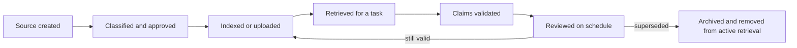

# 把每类事实放进正确类型的上下文

> 上下文是临时注意力。知识是被维护的证据。记忆是连续性。缓存是复用。混用它们会产出自信的过时答案。

> **【中文解读】** 本课处理"事实放错了地方"这一整类失败：上下文是临时注意力，知识是被维护的证据，记忆是连续性，缓存是复用——四者混用就会产出"自信的过时答案"。核心工具是七种机制各司其职的分工表、带权威/归属/敏感度/时效元数据的来源注册表，以及"治理指令 + 任务输入 + 权威证据 + 最小连续性"的上下文四层包。这是认证路线里从提示工程走向知识管理的一课。

> **【拓展：上下文工程→知识管理】** Phase 11·05 上下文工程讲"往上下文窗口里放什么"，本课讲"每类事实该住在哪个机制里"——这是从提示层到数据治理层的跨越。真实产品中 Claude 的 Project 指令、Project 知识、memory、connectors 各有职责边界，而它们的名称、限额与定价属于可变的官方事实，备考与生产都要以当前官方文档为准。课程 03 的"来源层级"在本课升级为完整注册表，课程 05 的论断验证又依赖本课定义的"权威来源"。

> 🔗 **【前置】** 学本课前请先掌握：(1) 认证课 03《把请求变成可测试的契约》——来源层级与验收检查的概念；(2) Phase 11·05 上下文工程——上下文窗口与注意力竞争的基本模型。本课的注册表与缓存策略会被毕业设计 29 至 32 直接复用。

**类型：** 学习
**语言：** Python
**前置条件：** 认证课 03《把请求变成可测试的契约》、Phase 11·05《上下文工程》
**预计用时：** 约 105 分钟

## 学习目标

- 区分会话上下文、Project 指令、Project 知识、记忆、connectors、检索与 API 提示缓存。
- 决定哪些内容该持久化、检索、摘要、刷新或丢弃。
- 构建带权威性、归属、敏感度与时效元数据的来源注册表。
- 在不删除必需证据的前提下削减上下文过载。
- 说明哪些 Claude 产品行为是可变的、必须以当前官方文档核实。

## 问题引入

> **【中文解读】** 本节案例的三个月报错很典型：旧路线图里的发布日期同时存在于 Project 知识和多份历史会议纪要中，而更新的决策存在 connector 里——错误答案在上下文里"证据重复"，于是响应听起来无比确定。团队把它叫作幻觉，其实是知识管理失败：把 Project 当文档仓库、把记忆当权威来源、把检索当真实性保证。

一个团队为季度规划创建了 Claude Project。他们上传了政策文件、会议纪要、销售导出数据和一份旧产品路线图，还加了 Project 指令："使用最新的已批准计划。"

三个月后，Claude 给出了旧路线图里的发布日期。这个日期存在于 Project 知识中、出现在多份历史会议纪要里，并与存放在 connector 里的更新决策相冲突。响应听起来很确定，因为上下文里装满了支持错误答案的重复证据。

团队称之为幻觉。这多半是知识管理失败。他们把 Project 当作文档仓库、把记忆当作权威来源、把检索当作真实性保证。

更多的上下文不等于更好的上下文。一个可信的系统知道哪些事实是临时的、哪些是权威的、以及谁负责让它们保持最新。

## 核心概念

### 七种机制，七种职责

> **【中文解读】** 七种机制的精确名称、可用性与限额会随套餐和产品变化（官方事实，须查当前文档），但它们的"职责"是稳定的。分类的价值在于防"类别错误"：记忆可以提醒"你喜欢简洁报告"，但不该悄悄变成当前退款政策的出处；connector 能拿到最新文件，但不能证明文件已被批准。

Claude 可以通过多种机制接收或复用信息。它们确切的可用性、限额与名称会随套餐和产品变化。持久的区分标准是它们的职责。

| 机制 | 主要职责 | 主要风险 |
|---|---|---|
| 当前会话上下文 | 承载当下对话 | 旧轮次消耗注意力或产生冲突 |
| Project 指令 | 设定可复用的行为与约束 | 宽泛的指令会过时或含混 |
| Project 知识 | 供给被维护的参考材料库 | 文件缺少归属或时效控制 |
| 记忆 | 保留跨会话的有用连续性 | 被记住的偏好被误当成已批准的事实 |
| Connectors | 在当前权限下访问外部系统 | 来源权限、同步或时效被误解 |
| 检索 | 从更大语料中选取相关片段 | 看起来相关的文本不完整或权威性低 |
| 提示缓存 | 高效复用稳定的 API 提示前缀 | 动态内容被缓存或失效被忽略 |

一个功能可以兼任多职，但这些区分能防止类别错误。记忆可以提醒 Claude 你偏好简洁的报告，但它不该悄悄变成当前退款政策的出处。Connector 可以暴露最新文件，却不能证明该文件已被批准。

### 上下文有注意力预算

> **【中文解读】** 大上下文窗口增加的是容量，不是确定性：每多一份文档，就多一分注意力竞争、多一个自相矛盾的机会。按四层打包，稳定的指令保持稳定，只为当前决策添加所需输入。长会话会积累被放弃的方案、被更正的事实和排版实验，带着一份核验过的简报开新会话往往比无限续聊更安全。

大上下文窗口增加的是容量，不是确定性。每多一份文档，就多一分注意力竞争，也多一个自相矛盾的机会。

按四层来思考：

```text
context package = governing instructions
                + task-specific input
                + retrieved authoritative evidence
                + minimal continuity
```

让稳定的指令保持稳定。只添加当前决策所需的任务输入。用元数据和权威规则检索证据。只有当先前的对话会改变当前任务时才携带它。

长会话常常积累被放弃的方案、被更正的事实和排版实验。带着一份核验过的简报开启新会话，可能比无限续聊更安全。先把决策从讨论中分离出来，再做摘要。

### 检索是选择，不是验证

> **【中文解读】** 检索系统按相关性排序，而相关性回答不了"被批准了吗、最新吗、完整吗、有没有更高权威的冲突、有权访问吗"。做法是给每个来源挂元数据，在语义相关性之前或与之并行地过滤。没有归属人或复审日期的文档应进隔离区，而不是被自动摄入。

检索系统通常按相关性给片段排序。相关性回答不了：

- 这个来源被批准了吗？
- 它是最新的吗？
- 它覆盖整条规则，还是只有一段节选？
- 是否有更高权威的来源与之冲突？
- 该用户有权访问这个来源吗？

给每个来源挂上元数据，在语义相关性之前或与之并行地过滤。一个最小注册表包括：

| 字段 | 回答的问题 |
|---|---|
| 来源 ID | 论断能否指回它？ |
| 归属人 | 谁对准确性负责？ |
| 权威级别 | 它是政策、程序、笔记还是草稿？ |
| 生效日期 | 它何时开始有效？ |
| 复审日期 | 何时必须再检查一次？ |
| 敏感度 | 谁可以处理或查看它？ |
| 被取代关系 | 哪个更早的来源不再具有权威性？ |
| 检索标签 | 它覆盖哪些任务与地区？ |

没有归属人或复审日期的文档是隔离候选，不该被自动摄入。

### 指令与知识是两回事

指令描述行为。知识提供证据。

一条指令可能这样写：

```text
For refund questions, cite the governing section and expose regional conflicts.
```

知识应当包含实际被批准的退款政策。把政策正文塞进行为指令会让维护更困难；把行为规则散落在随机知识文件里则容易被人漏看。

当 Project 指令与用户请求或所提供的来源冲突时，如何解决取决于产品的指令层级和组织政策。不要臆造一个层级。在真实的界面上测试，并记录预期的优先顺序。

### 记忆是连续性，不是记录数据库

> **【中文解读】** 记忆适合放稳定偏好与进行中的背景，危险在于把"被记住的说法"当成当前运营事实。依赖记忆前先问三句：这个事实可能变了吗？有没有便宜的权威来源可查？记错了后果多大？漂移可信且后果重要就先验证；工作流里给记忆来源的上下文打标签，引用仍指向真正的记录源。

记忆适合稳定偏好与进行中的背景：偏好的语气、反复出现的目标、或"某个项目存在"这件事。当一条被记住的说法被当作当前运营事实时，它就变得危险。

依赖记忆前先问三个问题：

1. 这个事实可能已经变了吗？
2. 有没有一个便宜就能查到的权威来源？
3. 如果记住的事实是错的，后果是什么？

如果漂移可信且后果重要，就先验证。在工作流里，给来自记忆的上下文打上标签，引用始终指向真正的记录源。

### 提示缓存是一种经济机制

> **【中文解读】** API 提示缓存降低的是稳定前缀的重复处理成本——它不提升真实性，也不创造长期记忆。适合缓存的内容要"大、重复、稳定"；逐请求变化或不应越出批准边界的数据不是候选。缓存寿命、最小尺寸、定价与失效行为是可变的产品事实（原样保留、查当前文档）；设计的正确性绝不能依赖一份过期缓存。

API 提示缓存可以减少稳定前缀的重复处理。它不提升真实性，也不创造长期记忆。

当当前 API 的缓存行为支持该模式时，把可复用内容放在动态内容之前：

```text
stable prefix: system rules + tool definitions + approved reference corpus
dynamic suffix: user request + fresh retrieval + current state
```

缓存的候选对象是大的、重复的、稳定的。糟糕的候选逐请求变化，或包含不应越出其批准边界而留存的数据。

缓存寿命、最小尺寸、定价、模型支持与失效行为都是可变的产品事实。请在当前官方文档中核实。设计正确性绝不能依赖一份过期缓存。

### 上下文质量需要生命周期归属

知识有生命周期：



难的不是上传，而是批准、刷新与退役。

## 动手构建

> **【中文解读】** 五步落地：先盘点工作流的全部信息来源并归类，再为每个来源建注册表记录，然后设计带拒答行为的检索契约，接着按固定顺序削减过载提示，最后为每类资产指定归属人、复审触发器与退役规则。核心思想：知识管理是产品的一部分，不是上线后的打扫卫生。

### 第 1 步：盘点上下文

为一个重复出现的工作流，列出每个信息来源并分类：

```text
Behavioral instruction:
Task input:
Authoritative knowledge:
Reference knowledge:
Conversation continuity:
External connected data:
Temporary calculation:
```

如果同一项出现在多个类别里，决定哪一份是权威副本、重复项将如何清除。

### 第 2 步：建来源注册表

为每个来源建一条简单的表格记录或 JSON 记录：

```json
{
  "source_id": "refund-policy-uk",
  "owner": "customer-operations",
  "authority": "approved-policy",
  "effective_date": "2026-07-01",
  "review_date": "2026-10-01",
  "sensitivity": "internal",
  "supersedes": "refund-policy-uk-2025"
}
```

这里的日期只是示例。请使用你的真实记录。复审日期已过的来源应被拒绝或标记。

### 第 3 步：设计带拒答的检索

定义检索契约：

- 按用户权限、地区、产品与激活状态过滤。
- 已批准政策优先于讨论笔记。
- 检索足够的上下文文本以保留例外条款。
- 片段随附来源 ID 与生效日期。
- 所需权威缺失时拒答。
- 暴露冲突，而不是不可见地合并它们。

测试一个正常案例、一个过期来源、一个权限不匹配、一个冲突和一个超出范围的问题。

### 第 4 步：给提示做预算

度量或估算每个上下文桶。如果提示过载，按以下顺序削减：

1. 移除重复与已被取代的材料。
2. 排除无关的对话轮次。
3. 检索更窄的权威章节，同时保留足够的周边文本。
4. 用一份核验过的决策记录替换讨论历史。
5. 在验证边界处拆分任务。

不要一开始就删除安全约束或必需证据。

### 第 5 步：建立维护机制

指定归属人与节奏：

| 资产 | 归属人 | 复审触发器 | 退役规则 |
|---|---|---|---|
| Project 指令 | 工作流负责人 | 流程变更 | 替换旧版本 |
| 政策知识 | 政策负责人 | 批准或复审日期 | 移除被取代的副本 |
| 检索索引 | 平台负责人 | 来源更新 | 重建索引并验证 |
| 评估集 | 质量负责人 | 新失败类别 | 添加代表性案例 |

知识管理是产品的一部分，不是上线后的打扫卫生。

## 交互实验室

用上下文-缓存图调整稳定前缀大小、请求量、缓存命中率、来源新鲜度与失效行为。把省下的成本与正确性边界对照看：缓存命中只有在被复用的前缀仍处于已批准状态时才有价值。

```figure
04-context-cache
```

## 练习实验室

运行上下文规划器。试着把动态账户来源放进缓存、不经新批准就重新激活被取代的政策，或者撑爆提示预算。运行器必须让正确性与生命周期规则优先于缓存节省。

## 交付产物

`outputs/context-registry.json` 是一份退款工作流的填好版来源注册表。它把行为指令、已批准政策、一份被取代的草稿、会话连续性与动态连接数据分开存放，还包含一份提示预算和一条显式缓存策略。

## 验证

验证注册表：

```bash
cd certifications/claude/lessons/04-context-knowledge-memory-and-caching/code
python3 main.py
python3 -m unittest discover tests -v
```

验证器检查来源 ID 唯一、ISO 日期、归属、权威级别、激活与被取代状态、预算总额，以及只有稳定的非机密来源才能进入缓存前缀。

## 毕业设计衔接

测验考查来源权威性、检索限度、缓存适配与上下文重置决策。把注册表与缓存策略用于毕业设计 29 至 32，作为溯源与上下文预算工件。

## 运行验证

> **【中文解读】** 考试遇到"重复劳动、过时答案或缺上下文"的情境题时的作答顺序：先判断缺的是行为、证据、连续性还是外部数据；把它放进为该职责设计的机制；加上权威、时效、敏感度与归属控制；测试检索与权限失败；正确性确立之后才谈缓存。常见陷阱都是"机制错配"的变体。

### 考试决策模式

当情境提到重复工作、过时答案或缺上下文时：

1. 判断缺失项是行为、证据、连续性还是外部数据。
2. 把它放进为该职责设计的机制。
3. 加上权威、时效、敏感度与归属控制。
4. 测试检索失败与权限失败。
5. 正确性确立之后才使用缓存。

### 常见陷阱

- **什么都上传：** 数量推高矛盾与维护成本。
- **记忆当真相：** 连续性被误当成记录源。
- **connector 当批准：** 能访问文件被误当成有权威。
- **检索当证据：** 一个相关片段未经溯源与完整性检查就被接受。
- **一场无限会话：** 已更正与已放弃的上下文一直保持活跃。
- **缓存当记忆：** 指望一个 API 优化保住持久的用户状态。
- **没有退役路径：** 被取代的文件永远可被检索。

### 练习

1. 把一个真实工作流中的十项内容归类到七种机制。
2. 为五个来源建注册表，并指出哪些不应进入活跃检索。
3. 用四层上下文包重写一个过载的提示词。
4. 设计五个检索失败测试，包含过期证据与未授权访问。
5. 在项目周结束时决定哪些该持久化、摘要或丢弃。解释每个决定。

## 关键术语

- **上下文：** 当前请求下模型可获得的信息。
- **Project 指令：** 与 Claude Project 关联的可复用行为指引。
- **Project 知识：** 与 Project 关联的参考材料。
- **记忆：** 产品支持的跨会话连续性，受当前功能行为约束。
- **Connector：** 在配置权限下暴露外部数据或能力的集成。
- **检索：** 为一个请求从更大语料中选取相关材料。
- **提示缓存：** 复用符合条件的提示内容以减少重复的 API 处理。
- **记录源：** 某事实的权威系统或文档。
- **时效性：** 信息是否足够新，能满足其预期用途。

## 延伸阅读

- [Anthropic Help Center: What are Projects?](https://support.claude.com/en/articles/9517075-what-are-projects) — Projects 的官方说明
- [Anthropic Help Center: Use Claude's chat search and memory](https://support.claude.com/en/articles/11817273-use-claude-s-chat-search-and-memory-to-build-on-previous-context) — 聊天搜索与记忆的官方用法
- [Anthropic Help Center: Use connectors to extend Claude's capabilities](https://support.claude.com/en/articles/11176164-use-connectors-to-extend-claude-s-capabilities) — connectors 的官方用法
- [Anthropic: Prompt caching](https://platform.claude.com/docs/en/build-with-claude/prompt-caching) — 提示缓存的官方文档
- [AI Engineering from Scratch: Retrieval-Augmented Generation](../../../../../phases/11-llm-engineering/06-rag/) — 本课程 Phase 11 的检索增强生成课
- [AI Engineering from Scratch: Repository Memory and State](../../../../../phases/14-agent-engineering/34-repo-memory-and-state/) — 本课程 Phase 14 的仓库记忆与状态课

Projects、记忆、connectors、检索模式与提示缓存的名称、可用性、限额、留存行为和定价都可能变化。以上来源于 2026-08-08 核查。部署或备考之前，请核实当前的官方产品与隐私文档。
