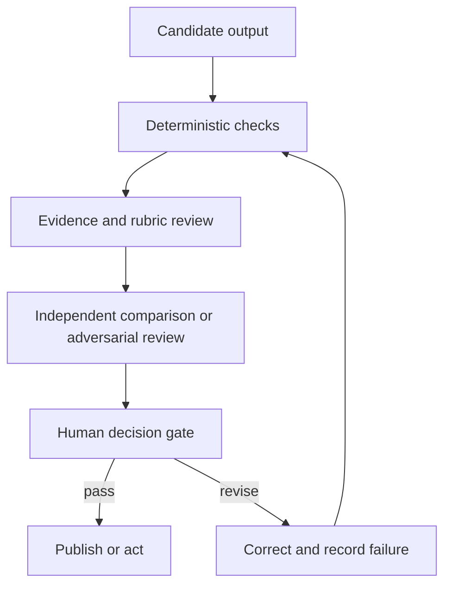

# Validate the Claim, Not the Confidence | 验证的是论断，不是自信

> Fluency is presentation quality. Validation is evidence that the output can safely do its job.

> **【中文解读】** 本课对应考试大纲中占比最大的领域：输出评估与验证（validation）。核心命题是标题本身——流畅度只是呈现质量，验证是"输出能安全履职"的证据。方法链条：从输出的用途出发制定可观察的六维标准；把关键论断追溯到权威证据（论断-证据矩阵，检查有据可依 / grounded）；用分层验证（确定性检查→量表评审→独立评审→人工决策门）把每类性质交给最便宜且可靠的评估器；先诊断四类模型能力性质再选修复。课程 03 的验收检查与课程 04 的权威来源在这里汇合成完整闭环。

> **【拓展：评估科学→有据可依的发布流水线】** 本课把 Phase 11·10 的评估理论与 Anthropic 入门能力课程的四性质框架（next-token prediction、knowledge、working memory、steerability）以及 AI Fluency 4D 的人类侧判断（委托、描述、辨别、勤勉）接在一起。工程界的对应物是"发布门禁 + 验证记录"：每个重大生产失败都应沉淀为评估案例、确定性检查或监控信号，而不是只修那一份报告。毕业设计 29 至 32 会复用本课的论断-证据矩阵作为评审证据。

> 🔗 **【前置】** 学本课前请先掌握：(1) 认证课 03《把请求变成可测试的契约》——验收标准与来源层级；(2) 认证课 04《把每类事实放进正确类型的上下文》——权威来源与记录源的概念；(3) Phase 11·10 评估与测试——评估集与回归的基础。本课是四条认证路线共同的最大考区，务必吃透。

**Type:** Learn | **类型:** 学习
**Languages:** Python | **语言:** Python
**Prerequisites:** [Turn a Request Into a Testable Contract](../../03-prompting-and-task-decomposition/), [Put Each Fact in the Right Kind of Context](../../04-context-knowledge-memory-and-caching/), [Evaluation and Testing](../../../../../phases/11-llm-engineering/10-evaluation/) | **前置知识:** 认证课 03《把请求变成可测试的契约》、04《把每类事实放进正确类型的上下文》、Phase 11·10《评估与测试》
**Time:** ~115 minutes | **时间:** 约 115 分钟

## Learning Objectives | 学习目标

- Build task-specific criteria for accuracy, completeness, consistency, audience fit, bias, and format.
  中文翻译：为准确性、完整性、一致性、受众适配、偏见与格式构建面向任务的标准。
- Trace consequential claims to authoritative evidence.
  中文翻译：把有后果的论断追溯到权威证据。
- Combine deterministic checks, rubric graders, independent review, and human judgment.
  中文翻译：组合确定性检查、量表评分器、独立评审与人工判断。
- Diagnose hallucination, omission, contradiction, scope, and citation failures.
  中文翻译：诊断幻觉、遗漏、矛盾、越界与引用失败。
- Diagnose unexpected output through model capability limits before choosing a repair.
  中文翻译：先从模型能力极限诊断意外输出，再选择修复手段。
- Turn production failures into durable evaluation cases.
  中文翻译：把生产失败转化为持久的评估案例。

## The Problem | 问题引入

> **【中文解读】** 本节案例的教训是"看起来被验证过"不等于被验证：文档有引用、语气专业，领导据此批准了政策变更，事后却发现引用只是"提到了主题"并不支持论断、聚合时丢了一个客户群、建议超出了团队权限。没有人测过覆盖、蕴含与行动范围。这就是为什么输出评估是 Claude Certified Associate 大纲中最大的领域——有用的 Claude 工作流不在"文字出现"时停止，而在"结果通过与后果相称的检查"时停止。

Claude produces a weekly executive brief from customer data and internal policy. The brief has a strong opening, concise recommendations, and citations in every section. Leadership approves a policy change based on it.

> Claude 用客户数据和内部政策生成一份每周高管简报。简报开头有力、建议简洁、每个小节都有引用。领导层据此批准了一项政策变更。

Later, an analyst discovers three problems. One citation points to a document that mentions the topic but does not support the claim. A small customer segment disappeared during aggregation. A recommendation exceeds the team's authority.

> 后来一位分析师发现了三个问题：一条引用指向的文档只是提到了主题、并不支持该论断；一个小客户群在聚合过程中消失；一条建议超出了团队的权限。

The document looked validated because it had citations and a professional tone. Nobody tested coverage, entailment, or action scope.

> 这份文档"看起来"被验证过，因为它有引用、有专业语气。没有人测试过覆盖范围、蕴含关系或行动范围。

This is why output evaluation is the largest domain in the Claude Certified Associate blueprint. A useful Claude workflow does not stop when text appears. It stops when the result passes checks proportional to its consequence.

> 这就是输出评估成为 Claude Certified Associate 大纲中最大领域的原因。一个有用的 Claude 工作流不会在文字出现时停止；它在结果通过与后果相称的检查时才停止。

## The Concept | 核心概念

### Start from the job of the output

> **【中文解读】** 评估标准要跟着"输出支持的决策"走：头脑风暴清单和监管申报需要的证据与评审完全不同。六个起始维度——准确性、完整性、一致性、受众适配、公平与安全、格式合规——是类别不是分数，必须转成可观察的测试。"报告准确且完整"是弱标准；"每个定量论断与所给数据集对账、每条建议至少引用一个支持发现和一个管辖约束、全部七个运营区域必须出现或标注'无数据'"才是可测试的标准。

Evaluation criteria should follow the decision the output supports. A brainstorming list and a regulatory filing need different evidence and review.

> 评估标准应当跟随输出所支持的决策。头脑风暴清单和监管申报需要不同的证据与评审。

Use six dimensions as a starting point:

> 以六个维度作为起点：

1. **Accuracy:** Are factual claims supported and calculations correct?
   中文翻译：**准确性：** 事实性论断有依据吗，计算正确吗？
2. **Completeness:** Are required items, populations, exceptions, and caveats present?
   中文翻译：**完整性：** 必需项、群体、例外与注意事项都在吗？
3. **Consistency:** Do sections, numbers, labels, and recommendations agree?
   中文翻译：**一致性：** 各小节、数字、标签与建议相互一致吗？
4. **Audience fit:** Can the intended reader understand and act on it?
   中文翻译：**受众适配：** 目标读者能理解并据其行动吗？
5. **Fairness and safety:** Does the output introduce unjustified bias, expose data, or exceed policy?
   中文翻译：**公平与安全：** 输出是否引入无据偏见、暴露数据或越出政策？
6. **Format compliance:** Does it satisfy structural requirements for people and systems?
   中文翻译：**格式合规：** 它满足面向人和系统的结构性要求吗？

These are categories, not scores. Convert them into observable tests.

> 这些是类别，不是分数。把它们转换成可观察的测试。

Weak criterion:

> 弱标准：

```text
The report is accurate and complete.
```

Testable criteria:

> 可测试的标准：

```text
Every quantitative claim must reconcile with the supplied dataset.
Every recommendation must cite at least one supporting finding and one governing constraint.
All seven operating regions must appear or be marked "no data."
The summary must state the two largest uncertainties.
```

### Trace claims to evidence

> **【中文解读】** 引用只是指针；验证（validation）问的是"被指向的证据是否支持这条确切的论断"。论断-证据矩阵把四类问题分开：来源存在吗？它对这条论断有权威性吗？它是"蕴含"该论断还是仅仅"讨论"了这个主题？论断是否比证据更强？注意矩阵里的 C-02：访谈笔记撑不起因果论断——"发生在之后"证明不了"由它导致"。一份报告可以引用全对、却仍然夸大因果。

Citations are pointers. Validation asks whether the pointed evidence supports the exact claim.

> 引用是指针。验证问的是：被指向的证据是否支持这条确切的论断。

Create a claim-evidence matrix:

> 建一张论断-证据矩阵：

| Claim ID | Claim | Source | Support type | Authority | Reviewer result |
|---|---|---|---|---|---|
| C-01 | Returns rose in the North region | dataset rows 120-184 | direct calculation | primary data | pass |
| C-02 | Training caused the change | interview note 7 | speculative | anecdotal | fail |
| C-03 | A refund requires approval | policy 4.2 | direct quotation | approved policy | pass |

The matrix separates four common questions:

> 这张矩阵把四个常见问题分开：

- Does the source exist?
  中文翻译：来源存在吗？
- Is it authoritative for this claim?
  中文翻译：它对这条论断有权威性吗？
- Does it entail the claim rather than merely discuss the topic?
  中文翻译：它蕴含该论断，还是仅仅讨论了这个主题？
- Is the claim stronger than the evidence?
  中文翻译：论断是否强于证据？

A report can contain correct citations and still overstate causation. "Occurred after" does not prove "caused by."

> 一份报告可以引用全部正确，却仍然夸大因果。"发生在之后"证明不了"由它导致"。

### Diagnose the property before retrying

> **【中文解读】** "输出不对"不是诊断；不带诊断的盲目重试往往复现同一失败，因为原因没变。把 Anthropic 入门能力课程的四个模型性质当故障树用：答案流畅却无支撑→next-token prediction（用所给证据做 grounding、要求拒答、验证蕴含）；依赖最近/稀有/私有/有争议事实→knowledge（补权威来源、显式暴露不确定性）；关键上下文被淹没或缺失→working memory（只检索相关上下文、拆任务、摘要状态、验证覆盖）；指令含混冲突过长→steerability（改写成带优先级、示例、约束与验收测试的简洁契约）。多个性质可以同时失灵——记录一个主性质、若干贡献性质、诊断证据和逐因修复。AI Fluency 4D（委托、描述、辨别、勤勉）补上人类侧的同一决策。

An unexpected output is not a useful diagnosis. A generic retry often reproduces the same failure because it leaves the cause unchanged.

> "意外输出"本身不是有用的诊断。盲目的重试往往复现同一失败，因为原因没有改变。

Anthropic's introductory capabilities course organizes diagnosis around four model properties. Use them as a practical fault tree, not as four isolated labels:

> Anthropic 的入门能力课程围绕四个模型性质组织诊断。把它们当作实用的故障树，而不是四个孤立的标签：

| Property | Failure signal | Targeted response |
|---|---|---|
| Next-token prediction | The answer is fluent and plausible, but unsupported | Ground consequential claims in supplied evidence, require abstention, and validate entailment |
| Knowledge | The task depends on recent, rare, private, or disputed facts | Add current authoritative sources and expose uncertainty instead of relying on parametric recall |
| Working memory | Important context is buried, absent from the current session, or competing with too much material | Retrieve only relevant context, split the task, summarize state, and verify coverage |
| Steerability | Instructions are vague, conflicting, overly long, or impossible to check | Rewrite the request as a concise contract with priorities, examples, constraints, and acceptance tests |

Several properties can fail together. A long policy question can exceed useful working memory while also asking for facts outside model knowledge. Record one primary property, any contributing properties, the evidence for that diagnosis, and a repair aimed at each cause.

> 多个性质可能同时失灵。一个很长的政策问题既可能超出有效工作记忆，又可能要求模型知识之外的事实。记录一个主性质、任何贡献性质、该诊断的证据，以及针对每个原因的修复。

The optional AI Fluency 4D check adds the human side of the same decision:

> 可选的 AI Fluency 4D 检查补上同一决策的人类侧：

- **Delegation:** Decide what work should be delegated and what judgment must remain human.
  中文翻译：**委托：** 决定哪些工作可以委托、哪些判断必须留在人这里。
- **Description:** Supply the context, goal, constraints, and success criteria the system needs.
  中文翻译：**描述：** 提供系统所需的上下文、目标、约束与成功标准。
- **Discernment:** Evaluate whether the result is accurate, useful, and appropriate.
  中文翻译：**辨别：** 评估结果是否准确、有用且得当。
- **Diligence:** Apply privacy, attribution, policy, and accountability throughout the workflow.
  中文翻译：**勤勉：** 在整个工作流中贯彻隐私、署名、政策与问责。

These checks do not replace task-specific evaluation. They help you choose the right evaluator and repair instead of treating every failure as "bad prompting."

> 这些检查不替代面向任务的评估。它们帮你选对评估器与修复手段，而不是把每个失败都当成"提示词写得差"。

### Use layered validation

> **【中文解读】** 没有单一评估器够用，要分层叠加：确定性检查（代码能精确判定的：schema、必填字段、行合计、范围、引用 ID 存在性、禁用词、权限标志）→量表评审（需要解释的品质，如摘要是否保留了核心例外；模型可以按量表打分，但评分器本身也要被测试）→独立或对抗评审（另一个视角找无支撑论断、缺失群体、冲突与危险建议；独立性很关键——让同一次生成自证正确只会制造相关盲区）→人工评审（owns 后果、含糊权衡与组织权限；人不该重复机械检查，而应拿到证据、不确定性、失败检查清单与需要判断的决策）。配套原则：每类性质用最便宜且可靠的评估器——别让 LLM 判断代码能精确判定的事，也别强迫代码裁决依赖情境的伦理权衡。

No single evaluator is sufficient. Combine layers:

> 没有任何一个评估器是足够的。叠加多层：



**Deterministic checks** are code or exact rules. Use them for schema validity, required fields, row totals, ranges, citation ID existence, banned terms, and permission flags.

> **确定性检查**是代码或精确规则。用于 schema 有效性、必填字段、行合计、取值范围、引用 ID 存在性、禁用词与权限标志。

**Rubric review** handles qualities that require interpretation, such as whether a summary preserves the central exception. A model can grade with a rubric, but the grader also needs testing.

> **量表评审**处理需要解释的品质，比如一份摘要是否保留了核心例外。模型可以按量表打分，但评分器本身也需要被测试。

**Independent or adversarial review** asks a separate pass to find unsupported claims, missing populations, conflicts, and unsafe recommendations. Independence matters. Asking the same generation to declare itself correct creates correlated blind spots.

> **独立或对抗评审**要求一次独立的通过来找出无支撑论断、缺失群体、冲突与不安全的建议。独立性很关键。让同一次生成自证正确只会制造相关的盲区。

**Human review** owns consequences, ambiguous tradeoffs, and organizational authority. A person should not repeat every mechanical check. They should receive the evidence, uncertainties, failed checks, and decision requiring judgment.

> **人工评审**对后果、含糊的权衡与组织权限负责。人不应该重复每一项机械检查。他们应拿到证据、不确定性、失败的检查清单，以及需要判断的决策。

### Match the evaluator to the property

Use the cheapest reliable evaluator for each property:

> 为每类性质使用最便宜且可靠的评估器：

| Property | Strong first evaluator |
|---|---|
| Valid JSON | Parser or schema validator |
| Arithmetic total | Deterministic calculation |
| Exact required fields | Programmatic assertion |
| Meaning preserved | Rubric-based comparison |
| Claim supported by passage | Evidence review with quoted span |
| Appropriate executive tone | Human or tested rubric grader |
| High-impact fairness decision | Qualified human review with policy |

Do not ask an LLM to judge something code can establish exactly. Do not force code to decide a context-dependent ethical tradeoff.

> 不要让 LLM 去判断代码能精确判定的事。也不要强迫代码去裁决依赖情境的伦理权衡。

### Hallucination is not one failure

> **【中文解读】** 修幻觉前先分类缺陷：捏造（事实或来源是编的）、错误归属（真实论断安错了来源）、过度推断（结论强于证据）、遗漏（必需事实/群体/例外缺失）、矛盾（两处输出不可能同真）、越界（回答超出请求或权限）、过时（曾经正确、已不current）、格式失败（下游系统无法消费）。不同缺陷用不同修复：捏造要约束来源与拒答；遗漏要覆盖清单；矛盾要对账环节；格式失败要结构化输出加解析器验证。评估集要代表风险：除了正常案例，还要放边界、历史失败、缺失与冲突证据、藏在来源里的对抗指令、隐私/公平/越权案例、接近长度与格式极限的输入；按风险组追踪成绩——95% 的总分可能掩盖最重要案例上 40% 的通过率；为重大变更保留保留集，防止把测试形状背下来。

Classify the defect before fixing it:

> 修复之前先给缺陷分类：

- **Fabrication:** A fact or source was invented.
  中文翻译：**捏造：** 某个事实或来源是编造的。
- **Misattribution:** A real claim was assigned to the wrong source.
  中文翻译：**错误归属：** 真实的论断被安到了错误的来源上。
- **Overreach:** The conclusion is stronger than the evidence.
  中文翻译：**过度推断：** 结论强于证据。
- **Omission:** A required fact, segment, or exception is absent.
  中文翻译：**遗漏：** 必需的事实、群体或例外缺失。
- **Contradiction:** Two parts of the output cannot both be true.
  中文翻译：**矛盾：** 输出的两个部分不可能同时为真。
- **Scope violation:** The response answers beyond the request or authority.
  中文翻译：**越界：** 回答超出了请求或权限范围。
- **Staleness:** A once-valid fact is no longer current.
  中文翻译：**过时：** 曾经有效的事实已不再最新。
- **Format failure:** The content cannot be consumed by the next system.
  中文翻译：**格式失败：** 内容无法被下游系统消费。

Different defects require different repairs. Fabrication may need constrained sources and abstention. Omission may need a coverage checklist. Contradiction may need a reconciliation pass. Format failure may need structured output and parser validation.

> 不同缺陷需要不同修复。捏造可能需要约束来源与拒答；遗漏可能需要覆盖清单；矛盾可能需要对账环节；格式失败可能需要结构化输出加解析器验证。

### Evaluation sets represent risk

A useful evaluation set contains more than normal examples. Include:

> 一个有用的评估集包含的不只是正常示例。要包括：

- Common representative tasks.
  中文翻译：常见的代表性任务。
- Important edge cases.
  中文翻译：重要的边界案例。
- Previously observed failures.
  中文翻译：此前观察到的失败。
- Missing and conflicting evidence.
  中文翻译：缺失与冲突的证据。
- Adversarial instructions inside source text.
  中文翻译：藏在来源文本中的对抗指令。
- Cases involving privacy, fairness, or unauthorized action.
  中文翻译：涉及隐私、公平或越权行动的案例。
- Inputs near length and formatting limits.
  中文翻译：接近长度与格式极限的输入。

Track performance by risk group. A 95 percent aggregate score can hide a 40 percent pass rate for the cases that matter most.

> 按风险组追踪成绩。95% 的总分可能掩盖最重要案例上 40% 的通过率。

Keep a held-out set for major prompt or model changes. If you tune repeatedly on every case, the workflow can memorize the test shape without generalizing.

> 为重大的提示词或模型变更保留一个保留集。如果你在每个案例上反复调优，工作流可能把测试的形状背下来而不能泛化。

### Compare outputs without brand bias

When comparing prompt or model variants:

> 比较提示词或模型变体时：

1. Use the same cases and criteria.
   中文翻译：使用相同的案例与标准。
2. Hide which system produced each result when practical.
   中文翻译：可行时隐藏每个结果出自哪个系统。
3. Randomize display order.
   中文翻译：随机化展示顺序。
4. Score individual dimensions before an overall preference.
   中文翻译：先给各维度打分，再给整体偏好。
5. Investigate disagreements between reviewers.
   中文翻译：调查评审者之间的分歧。
6. Re-run enough times to observe instability.
   中文翻译：重复运行足够多次以观察不稳定性。

One preferred output is an anecdote. A deployment decision needs a distribution of results across representative risk.

> 一个更受偏好的输出只是一则轶事。部署决策需要跨代表性风险的结果分布。

## Build It | 动手构建

### Step 1: Define release gates

Write gates in three levels:

> 把门禁写成三级：

```text
Blocker: unsupported high-impact claim, exposed restricted data, invalid total
Required: all regions covered, citations resolvable, recommendation within authority
Quality: concise summary, readable headings, minimal repetition
```

A blocker prevents publication. A quality issue may permit publication with a repair ticket, depending on policy. This keeps cosmetic preferences from competing with safety failures.

> 阻断项阻止发布。质量问题视政策可能允许带修复工单发布。这让外观偏好不再与安全失败同台竞争。

### Step 2: Build a validation record

For each run, capture:

> 为每次运行记录：

```json
{
  "workflow_version": "brief-v3",
  "source_snapshot": "2026-W31",
  "checks": {
    "schema": "pass",
    "totals_reconcile": "pass",
    "claim_support": "fail",
    "privacy": "pass"
  },
  "failed_claims": ["C-08"],
  "uncertainties": ["West region sample incomplete"],
  "reviewer_decision": "revise"
}
```

The values are illustrative. In production, apply your retention and privacy policy to validation logs.

> 这些值只是示例。生产环境中，请对你的验证日志执行留存与隐私政策。

For an unexpected result, attach a short diagnostic:

> 对意外结果，附上一段简短诊断：

```json
{
  "primaryProperty": "knowledge",
  "contributingProperties": ["next-token-prediction"],
  "evidence": "The cited policy was published after the model's supplied source snapshot.",
  "targetedFix": "Retrieve the approved current policy and rerun claim-support checks.",
  "humanCompetency": "discernment"
}
```

The label alone is not useful. Evidence and a targeted fix make the diagnosis testable.

> 只有标签没有用。证据与针对性修复才能让诊断可测试。

### Step 3: Separate generation and review

Give the reviewer the draft, criteria, and source evidence. Do not give it permission to rewrite silently.

> 给评审者草稿、标准与来源证据。不要给它悄悄重写的权限。

```text
Return one row per finding:
claim_id | severity | evidence | criterion | proposed correction

If no supplied source supports a claim, mark it unsupported.
Do not invent replacement evidence.
```

The generator can then revise against an explicit finding list. Keep the original finding and the correction for auditability.

> 生成者随后可以对照一份显式的发现清单做修订。保留原始发现与修正以便审计。

### Step 4: Calibrate graders

Create examples of pass, borderline, and fail outputs. Have qualified reviewers label them. Compare automated grader decisions with the human reference.

> 创建通过、边缘与失败三类输出示例，让合格评审者打标签。把自动评分器的决定与人类参照对比。

Inspect false passes first because they release bad output. Then inspect false failures because they waste review capacity. Record where human judgment legitimately differs instead of forcing false agreement.

> 先检查误放行，因为它们会放出坏输出；再检查误拒，因为它们浪费评审产能。记录人类判断合理分歧之处，而不是强求虚假一致。

### Step 5: Close the loop

Every material production failure should produce at least one durable artifact:

> 每个重大生产失败都应产出至少一件持久工件：

- A new evaluation case.
  中文翻译：一个新的评估案例。
- A sharper criterion.
  中文翻译：一条更锋利的标准。
- A deterministic check.
  中文翻译：一个确定性检查。
- A source-management repair.
  中文翻译：一项来源管理修复。
- A prompt or workflow change.
  中文翻译：一次提示词或工作流变更。
- A monitoring signal or escalation rule.
  中文翻译：一条监控信号或升级规则。

Do not merely fix the individual report. Improve the system that admitted it.

> 不要只修那份报告。改进放它过关的系统。

## Interactive Lab | 交互实验室

Use the document and vision pipeline to inspect each transformation from input evidence to extracted fields, claims, validation findings, and release decision. Toggle a failed visual extraction or unsupported claim and observe which gate must block release.

> 用文档与视觉流水线逐一检查从输入证据到抽取字段、论断、验证发现与发布决策的每次转换。切换"视觉抽取失败"或"无支撑论断"，观察哪道门禁必须阻止发布。

```figure
05-document-vision-pipeline
```

## Practice Lab | 练习实验室

Run the release scorer on the filled claim matrix. Change the blocker decision to publish, point a claim at a missing source, assign exact totals to a model judge, or remove one capability property from the unexpected-output diagnostic and confirm that release validation fails.

> 在填好的论断矩阵上运行发布评分器。把阻断决策改成发布、把某条论断指向缺失来源、把精确合计交给模型评委，或从意外输出诊断中删掉一个能力性质——确认发布验证会失败。

## Shipped Artifact | 交付产物

`outputs/claim-validation-record.json` is a filled review packet with a claim-evidence matrix, a four-property capability diagnostic, release gates, evaluator assignments, uncertainties, and a final `revise` decision. It intentionally contains one failed causal claim so the blocker path is visible.

> `outputs/claim-validation-record.json` 是一份填好的评审包：论断-证据矩阵、四性质能力诊断、发布门禁、评估器分配、不确定性与最终的 `revise` 决定。它有意包含一条失败的因果论断，让阻断路径可见。

## Verify It | 验证

Run the deterministic checks:

> 运行确定性检查：

```bash
cd certifications/claude/lessons/05-output-evaluation-and-validation/code
python3 main.py
python3 -m unittest discover tests -v
```

The validator proves claim IDs are unique, every source reference resolves, the capability diagnostic contains all four properties and a targeted repair, exact properties use deterministic evaluators, and a blocker failure cannot produce a publish decision.

> 验证器证明：论断 ID 唯一、每个来源引用可解析、能力诊断包含全部四个性质与一条针对性修复、精确性质使用确定性评估器、阻断失败不可能产出发布决策。

## Capstone Connection | 毕业设计衔接

The quiz tests entailment, evaluator selection, slice failures, and regression learning. Use this packet as the validation and reviewer evidence for capstones 29 through 32.

> 测验考查蕴含、评估器选择、切片失败与回归学习。把这个评审包用作毕业设计 29 至 32 的验证与评审证据。

## Use It | 运行验证

> **【中文解读】** 考试问"如何改进输出质量"时的作答顺序：先定输出的用途与后果；选显式的、面向任务的标准；精确性质用精确检查；把重要论断追溯到权威证据；为含糊与高影响场景保留独立与人工评审；把观察到的失败回馈进评估集。常见陷阱（把流畅当正确、把"有引用"当"有支撑"、单一总分、只做自评、用 LLM 算算术、人工评审没有证据包、只测快乐路径、只修症状）每一条都能对应一道情境题。

### Exam decision pattern | 考试决策模式

When asked how to improve output quality:

> 被问到如何改进输出质量时：

1. Define the output's purpose and consequence.
   中文翻译：定义输出的用途与后果。
2. Select explicit, task-specific criteria.
   中文翻译：选择显式的、面向任务的标准。
3. Use exact checks for exact properties.
   中文翻译：精确的性质用精确检查。
4. Trace important claims to authoritative evidence.
   中文翻译：把重要论断追溯到权威证据。
5. Preserve independent and human review for ambiguity or high impact.
   中文翻译：为含糊或高影响场景保留独立评审与人工评审。
6. Feed observed failures back into the evaluation set.
   中文翻译：把观察到的失败回馈进评估集。

### Common traps | 常见陷阱

- **Fluency as correctness:** A polished answer can be wrong.
  中文翻译：**把流畅当正确：** 打磨得再漂亮的答案也可能是错的。
- **Citation presence as support:** A link may not entail the claim.
  中文翻译：**把"有引用"当"有支撑"：** 链接未必蕴含论断。
- **Single aggregate score:** Critical risk segments disappear in the average.
  中文翻译：**单一总分：** 关键风险切片在平均数里消失。
- **Self-review only:** Generator and reviewer share assumptions and omissions.
  中文翻译：**只做自评：** 生成者与评审者共享假设与遗漏。
- **LLM for exact arithmetic:** A deterministic check is cheaper and more reliable.
  中文翻译：**用 LLM 做精确算术：** 确定性检查更便宜也更可靠。
- **Human review without a packet:** The reviewer receives prose but no claims, evidence, or failed checks.
  中文翻译：**没有证据包的人工评审：** 评审者拿到的是散文，没有论断、证据或失败清单。
- **Testing only happy paths:** Missing, conflicting, stale, and adversarial inputs remain invisible.
  中文翻译：**只测快乐路径：** 缺失、冲突、过时与对抗输入始终不可见。
- **Fixing symptoms:** The report is edited but the failed case never enters the test suite.
  中文翻译：**只修症状：** 报告被改了，但失败案例从未进入测试套件。

### Exercises | 练习

1. Convert five subjective quality goals into observable criteria.
   中文翻译：把五个主观质量目标转换成可观察标准。
2. Build a claim-evidence matrix for a one-page report and mark overreach.
   中文翻译：为一页纸报告建论断-证据矩阵并标出过度推断。
3. Assign deterministic, rubric, independent, or human evaluators to ten checks.
   中文翻译：为十项检查分配确定性、量表、独立或人工评估器。
4. Create an evaluation set with four normal, three edge, and three high-risk cases.
   中文翻译：创建一个含四个正常、三个边界、三个高风险案例的评估集。
5. Blind-compare two outputs and document where reviewers disagree.
   中文翻译：盲测比较两份输出，并记录评审者分歧之处。

## Key Terms | 关键术语

- **Entailment:** Whether evidence actually supports the stated claim.
  中文翻译：**蕴含：** 证据是否真正支持所述论断。
- **Evaluation set:** A collection of representative and risk-focused cases used to measure behavior.
  中文翻译：**评估集：** 用于度量行为的代表性案例与风险聚焦案例集合。
- **Deterministic check:** A repeatable programmatic test with an exact expected property.
  中文翻译：**确定性检查：** 有精确预期性质的可重复程序化测试。
- **Rubric grader:** A human or model evaluator applying defined qualitative criteria.
  中文翻译：**量表评分器：** 按既定质性标准打分的人类或模型评估器。
- **Independent review:** A separate assessment pass that does not rely on the generator's self-judgment.
  中文翻译：**独立评审：** 不依赖生成者自评的独立评估环节。
- **Release gate:** A condition that must pass before an output can be published or acted upon.
  中文翻译：**发布门禁：** 输出被发布或执行前必须通过的条件。
- **False pass:** An invalid output incorrectly accepted by an evaluator.
  中文翻译：**误放行：** 无效输出被评估器错误接受。
- **Regression:** A previously passing behavior that fails after a change.
  中文翻译：**回归：** 之前通过的行为在变更后失败。

## Further Reading | 延伸阅读

- [Anthropic: Define success criteria and build evaluations](https://platform.claude.com/docs/en/test-and-evaluate/develop-tests)
  中文翻译：定义成功标准并构建评估——评估体系的官方入口
- [Anthropic: Evaluation tool](https://platform.claude.com/docs/en/test-and-evaluate/eval-tool)
  中文翻译：Anthropic 评估工具的官方文档
- [Anthropic: Reduce hallucinations](https://platform.claude.com/docs/en/test-and-evaluate/strengthen-guardrails/reduce-hallucinations)
  中文翻译：减少幻觉——官方防护栏指南
- [Anthropic Academy: AI Capabilities and Limitations](https://anthropic.skilljar.com/ai-capabilities-and-limitations)
  中文翻译：Anthropic 学院——AI 能力与极限（四性质诊断的出处）
- [Anthropic Academy: AI Fluency Framework and Foundations](https://anthropic.skilljar.com/ai-fluency-framework-foundations)
  中文翻译：Anthropic 学院——AI Fluency 框架与基础（4D 的出处）
- [AI Engineering from Scratch: Advanced RAG and Evaluation](../../../../../phases/11-llm-engineering/07-advanced-rag/)
  中文翻译：本课程 Phase 11 的高级 RAG 与评估课
- [AI Engineering from Scratch: Reviewer Agent](../../../../../phases/14-agent-engineering/39-reviewer-agent/)
  中文翻译：本课程 Phase 14 的评审者 Agent 课
- [AI Engineering from Scratch: Fairness Criteria](../../../../../phases/18-ethics-safety-alignment/21-fairness-criteria-group-individual-counterfactual/)
  中文翻译：本课程 Phase 18 的公平性标准课

Evaluation tools, model behavior, and product interfaces can change. These official references were checked on 2026-08-08. Revalidate graders and thresholds whenever models, prompts, sources, tools, or workflow policy change.

> 评估工具、模型行为与产品界面都可能变化。以上官方参考于 2026-08-08 核查。每当模型、提示词、来源、工具或工作流政策发生变化，都应重新校准评分器与阈值。
