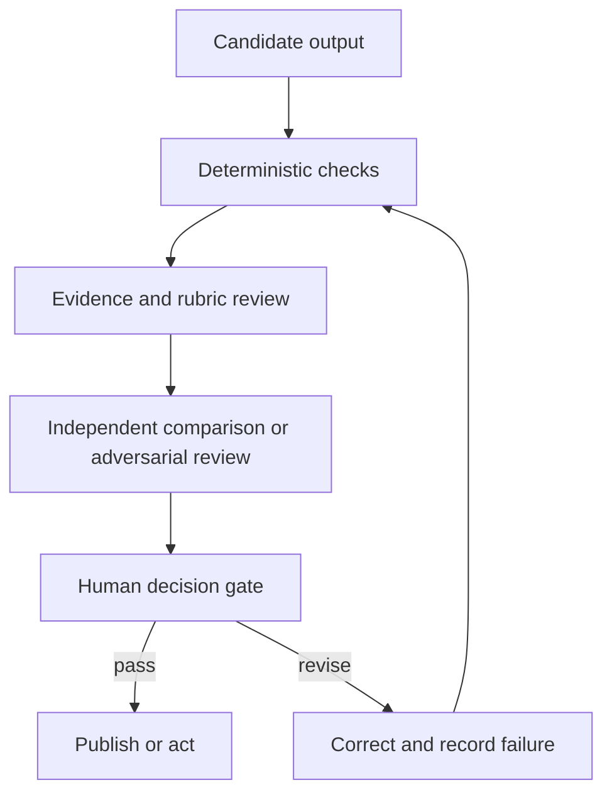

# 验证的是论断，不是自信

> 流畅度是呈现质量。验证（validation）是"输出能安全履职"的证据。

> **【中文解读】** 本课对应考试大纲中占比最大的领域：输出评估与验证。核心命题是标题本身——流畅度只是呈现质量，验证是"输出能安全履职"的证据。方法链条：从输出的用途出发制定可观察的六维标准；把关键论断追溯到权威证据（论断-证据矩阵，检查有据可依 / grounded）；用分层验证（确定性检查→量表评审→独立评审→人工决策门）把每类性质交给最便宜且可靠的评估器；先诊断四类模型能力性质再选修复。课程 03 的验收检查与课程 04 的权威来源在这里汇合成完整闭环。

> **【拓展：评估科学→有据可依的发布流水线】** 本课把 Phase 11·10 的评估理论与 Anthropic 入门能力课程的四性质框架（next-token prediction、knowledge、working memory、steerability）以及 AI Fluency 4D 的人类侧判断（委托、描述、辨别、勤勉）接在一起。工程界的对应物是"发布门禁 + 验证记录"：每个重大生产失败都应沉淀为评估案例、确定性检查或监控信号，而不是只修那一份报告。毕业设计 29 至 32 会复用本课的论断-证据矩阵作为评审证据。

> 🔗 **【前置】** 学本课前请先掌握：(1) 认证课 03《把请求变成可测试的契约》——验收标准与来源层级；(2) 认证课 04《把每类事实放进正确类型的上下文》——权威来源与记录源的概念；(3) Phase 11·10 评估与测试——评估集与回归的基础。本课是四条认证路线共同的最大考区，务必吃透。

**类型：** 学习
**语言：** Python
**前置条件：** 认证课 03《把请求变成可测试的契约》、04《把每类事实放进正确类型的上下文》、Phase 11·10《评估与测试》
**预计用时：** 约 115 分钟

## 学习目标

- 为准确性、完整性、一致性、受众适配、偏见与格式构建面向任务的标准。
- 把有后果的论断追溯到权威证据。
- 组合确定性检查、量表评分器、独立评审与人工判断。
- 诊断幻觉、遗漏、矛盾、越界与引用失败。
- 先从模型能力极限诊断意外输出，再选择修复手段。
- 把生产失败转化为持久的评估案例。

## 问题引入

> **【中文解读】** 本节案例的教训是"看起来被验证过"不等于被验证：文档有引用、语气专业，领导据此批准了政策变更，事后却发现引用只是"提到了主题"并不支持论断、聚合时丢了一个客户群、建议超出了团队权限。没有人测过覆盖、蕴含与行动范围。有用的 Claude 工作流不在"文字出现"时停止，而在"结果通过与后果相称的检查"时停止。

Claude 用客户数据和内部政策生成一份每周高管简报。简报开头有力、建议简洁、每个小节都有引用。领导层据此批准了一项政策变更。

后来一位分析师发现了三个问题：一条引用指向的文档只是提到了主题、并不支持该论断；一个小客户群在聚合过程中消失；一条建议超出了团队的权限。

这份文档"看起来"被验证过，因为它有引用、有专业语气。没有人测试过覆盖范围、蕴含关系或行动范围。

这就是输出评估成为 Claude Certified Associate 大纲中最大领域的原因。一个有用的 Claude 工作流不会在文字出现时停止；它在结果通过与后果相称的检查时才停止。

## 核心概念

### 从输出的用途出发

> **【中文解读】** 评估标准要跟着"输出支持的决策"走：头脑风暴清单和监管申报需要的证据与评审完全不同。六个起始维度是类别不是分数，必须转成可观察的测试。"报告准确且完整"是弱标准；"每个定量论断与所给数据集对账、每条建议至少引用一个支持发现和一个管辖约束"才是可测试的标准。

评估标准应当跟随输出所支持的决策。头脑风暴清单和监管申报需要不同的证据与评审。

以六个维度作为起点：

1. **准确性：** 事实性论断有依据吗，计算正确吗？
2. **完整性：** 必需项、群体、例外与注意事项都在吗？
3. **一致性：** 各小节、数字、标签与建议相互一致吗？
4. **受众适配：** 目标读者能理解并据其行动吗？
5. **公平与安全：** 输出是否引入无据偏见、暴露数据或越出政策？
6. **格式合规：** 它满足面向人和系统的结构性要求吗？

这些是类别，不是分数。把它们转换成可观察的测试。

弱标准：

```text
The report is accurate and complete.
```

可测试的标准：

```text
Every quantitative claim must reconcile with the supplied dataset.
Every recommendation must cite at least one supporting finding and one governing constraint.
All seven operating regions must appear or be marked "no data."
The summary must state the two largest uncertainties.
```

### 把论断追溯到证据

> **【中文解读】** 引用只是指针；验证问的是"被指向的证据是否支持这条确切的论断"。论断-证据矩阵把四类问题分开：来源存在吗？有权威性吗？是"蕴含"该论断还是仅仅"讨论"了主题？论断是否比证据更强？一份报告可以引用全对、却仍然夸大因果——"发生在之后"证明不了"由它导致"。

引用是指针。验证问的是：被指向的证据是否支持这条确切的论断。

建一张论断-证据矩阵：

| 论断 ID | 论断 | 来源 | 支持类型 | 权威性 | 评审结果 |
|---|---|---|---|---|---|
| C-01 | 北区退货上升 | 数据集 120-184 行 | 直接计算 | 一手数据 | 通过 |
| C-02 | 培训导致了变化 | 访谈笔记 7 | 推测性 | 轶事 | 失败 |
| C-03 | 退款需要审批 | 政策 4.2 | 直接引用 | 已批准政策 | 通过 |

这张矩阵把四个常见问题分开：

- 来源存在吗？
- 它对这条论断有权威性吗？
- 它蕴含该论断，还是仅仅讨论了这个主题？
- 论断是否强于证据？

一份报告可以引用全部正确，却仍然夸大因果。"发生在之后"证明不了"由它导致"。

### 重试之前先诊断性质

> **【中文解读】** "输出不对"不是诊断；不带诊断的盲目重试往往复现同一失败，因为原因没变。把 Anthropic 入门能力课程的四个模型性质当故障树用：答案流畅却无支撑→next-token prediction（用所给证据做 grounding、要求拒答、验证蕴含）；依赖最近/稀有/私有/有争议事实→knowledge（补权威来源、暴露不确定性）；关键上下文被淹没或缺失→working memory（只检索相关上下文、拆任务、摘要状态、验证覆盖）；指令含混冲突过长→steerability（改写成带优先级、示例、约束与验收测试的简洁契约）。多个性质可以同时失灵——记录一个主性质、若干贡献性质、诊断证据和逐因修复。AI Fluency 4D 补上人类侧的同一决策。

"意外输出"本身不是有用的诊断。盲目的重试往往复现同一失败，因为原因没有改变。

Anthropic 的入门能力课程围绕四个模型性质组织诊断。把它们当作实用的故障树，而不是四个孤立的标签：

| 性质 | 失败信号 | 针对性响应 |
|---|---|---|
| Next-token prediction | 答案流畅且可信，但无支撑 | 用所给证据锚定有后果的论断、要求拒答、验证蕴含 |
| Knowledge | 任务依赖最近、稀有、私有或有争议的事实 | 补充当前权威来源并暴露不确定性，而不是依赖参数化记忆 |
| Working memory | 重要上下文被埋没、不在当前会话中、或与过多材料竞争 | 只检索相关上下文、拆分任务、摘要状态、验证覆盖 |
| Steerability | 指令含混、冲突、过长或无法检查 | 把请求改写成带优先级、示例、约束与验收测试的简洁契约 |

多个性质可能同时失灵。一个很长的政策问题既可能超出有效工作记忆，又可能要求模型知识之外的事实。记录一个主性质、任何贡献性质、该诊断的证据，以及针对每个原因的修复。

可选的 AI Fluency 4D 检查补上同一决策的人类侧：

- **委托（Delegation）：** 决定哪些工作可以委托、哪些判断必须留在人这里。
- **描述（Description）：** 提供系统所需的上下文、目标、约束与成功标准。
- **辨别（Discernment）：** 评估结果是否准确、有用且得当。
- **勤勉（Diligence）：** 在整个工作流中贯彻隐私、署名、政策与问责。

这些检查不替代面向任务的评估。它们帮你选对评估器与修复手段，而不是把每个失败都当成"提示词写得差"。

### 分层验证

> **【中文解读】** 没有单一评估器够用，要分层叠加：确定性检查（代码能精确判定的）→量表评审（需要解释的品质）→独立或对抗评审（独立性很关键——让同一次生成自证正确只会制造相关盲区）→人工评审（对后果、含糊权衡与组织权限负责）。配套原则：每类性质用最便宜且可靠的评估器——别让 LLM 判断代码能精确判定的事，也别强迫代码裁决依赖情境的伦理权衡。

没有任何一个评估器是足够的。叠加多层：



**确定性检查**是代码或精确规则。用于 schema 有效性、必填字段、行合计、取值范围、引用 ID 存在性、禁用词与权限标志。

**量表评审**处理需要解释的品质，比如一份摘要是否保留了核心例外。模型可以按量表打分，但评分器本身也需要被测试。

**独立或对抗评审**要求一次独立的通过来找出无支撑论断、缺失群体、冲突与不安全的建议。独立性很关键。让同一次生成自证正确只会制造相关的盲区。

**人工评审**对后果、含糊的权衡与组织权限负责。人不应该重复每一项机械检查。他们应拿到证据、不确定性、失败的检查清单，以及需要判断的决策。

### 为性质匹配评估器

为每类性质使用最便宜且可靠的评估器：

| 性质 | 首选强评估器 |
|---|---|
| JSON 合法 | 解析器或 schema 验证器 |
| 算术合计 | 确定性计算 |
| 精确必填字段 | 程序化断言 |
| 语义保留 | 基于量表的比对 |
| 论断被段落支持 | 带引文的证据评审 |
| 高管语气得当 | 人工或经过测试的量表评分器 |
| 高影响公平性决策 | 具备资质的人工评审加政策 |

不要让 LLM 去判断代码能精确判定的事。也不要强迫代码去裁决依赖情境的伦理权衡。

### 幻觉不是一种失败

> **【中文解读】** 修幻觉前先分类缺陷：捏造、错误归属、过度推断、遗漏、矛盾、越界、过时、格式失败。不同缺陷用不同修复：捏造要约束来源与拒答；遗漏要覆盖清单；矛盾要对账环节；格式失败要结构化输出加解析器验证。评估集要代表风险：除了正常案例，还要放边界、历史失败、缺失与冲突证据、对抗指令、隐私/公平/越权案例、接近极限的输入；按风险组追踪成绩——95% 的总分可能掩盖最重要案例上 40% 的通过率。

修复之前先给缺陷分类：

- **捏造：** 某个事实或来源是编造的。
- **错误归属：** 真实的论断被安到了错误的来源上。
- **过度推断：** 结论强于证据。
- **遗漏：** 必需的事实、群体或例外缺失。
- **矛盾：** 输出的两个部分不可能同时为真。
- **越界：** 回答超出了请求或权限范围。
- **过时：** 曾经有效的事实已不再最新。
- **格式失败：** 内容无法被下游系统消费。

不同缺陷需要不同修复。捏造可能需要约束来源与拒答；遗漏可能需要覆盖清单；矛盾可能需要对账环节；格式失败可能需要结构化输出加解析器验证。

### 评估集代表风险

一个有用的评估集包含的不只是正常示例。要包括：

- 常见的代表性任务。
- 重要的边界案例。
- 此前观察到的失败。
- 缺失与冲突的证据。
- 藏在来源文本中的对抗指令。
- 涉及隐私、公平或越权行动的案例。
- 接近长度与格式极限的输入。

按风险组追踪成绩。95% 的总分可能掩盖最重要案例上 40% 的通过率。

为重大的提示词或模型变更保留一个保留集。如果你在每个案例上反复调优，工作流可能把测试的形状背下来而不能泛化。

### 不带品牌偏见地比较输出

比较提示词或模型变体时：

1. 使用相同的案例与标准。
2. 可行时隐藏每个结果出自哪个系统。
3. 随机化展示顺序。
4. 先给各维度打分，再给整体偏好。
5. 调查评审者之间的分歧。
6. 重复运行足够多次以观察不稳定性。

一个更受偏好的输出只是一则轶事。部署决策需要跨代表性风险的结果分布。

## 动手构建

> **【中文解读】** 五步落地：把门禁写成阻断/必需/质量三级；为每次运行建验证记录（含四性质诊断）；把生成与评审分开（评审者只报发现清单，不许悄悄重写）；校准评分器（先查误放行，再查误拒）；闭环——每个重大生产失败都沉淀为至少一件持久工件。核心思想：不要只修报告，要改进放它过关的系统。

### 第 1 步：定义发布门禁

把门禁写成三级：

```text
Blocker: unsupported high-impact claim, exposed restricted data, invalid total
Required: all regions covered, citations resolvable, recommendation within authority
Quality: concise summary, readable headings, minimal repetition
```

阻断项阻止发布。质量问题视政策可能允许带修复工单发布。这让外观偏好不再与安全失败同台竞争。

### 第 2 步：建验证记录

为每次运行记录：

```json
{
  "workflow_version": "brief-v3",
  "source_snapshot": "2026-W31",
  "checks": {
    "schema": "pass",
    "totals_reconcile": "pass",
    "claim_support": "fail",
    "privacy": "pass"
  },
  "failed_claims": ["C-08"],
  "uncertainties": ["West region sample incomplete"],
  "reviewer_decision": "revise"
}
```

这些值只是示例。生产环境中，请对你的验证日志执行留存与隐私政策。

对意外结果，附上一段简短诊断：

```json
{
  "primaryProperty": "knowledge",
  "contributingProperties": ["next-token-prediction"],
  "evidence": "The cited policy was published after the model's supplied source snapshot.",
  "targetedFix": "Retrieve the approved current policy and rerun claim-support checks.",
  "humanCompetency": "discernment"
}
```

只有标签没有用。证据与针对性修复才能让诊断可测试。

### 第 3 步：把生成与评审分开

给评审者草稿、标准与来源证据。不要给它悄悄重写的权限。

```text
Return one row per finding:
claim_id | severity | evidence | criterion | proposed correction

If no supplied source supports a claim, mark it unsupported.
Do not invent replacement evidence.
```

生成者随后可以对照一份显式的发现清单做修订。保留原始发现与修正以便审计。

### 第 4 步：校准评分器

创建通过、边缘与失败三类输出示例，让合格评审者打标签。把自动评分器的决定与人类参照对比。

先检查误放行，因为它们会放出坏输出；再检查误拒，因为它们浪费评审产能。记录人类判断合理分歧之处，而不是强求虚假一致。

### 第 5 步：闭环

每个重大生产失败都应产出至少一件持久工件：

- 一个新的评估案例。
- 一条更锋利的标准。
- 一个确定性检查。
- 一项来源管理修复。
- 一次提示词或工作流变更。
- 一条监控信号或升级规则。

不要只修那份报告。改进放它过关的系统。

## 交互实验室

用文档与视觉流水线逐一检查从输入证据到抽取字段、论断、验证发现与发布决策的每次转换。切换"视觉抽取失败"或"无支撑论断"，观察哪道门禁必须阻止发布。

```figure
05-document-vision-pipeline
```

## 练习实验室

在填好的论断矩阵上运行发布评分器。把阻断决策改成发布、把某条论断指向缺失来源、把精确合计交给模型评委，或从意外输出诊断中删掉一个能力性质——确认发布验证会失败。

## 交付产物

`outputs/claim-validation-record.json` 是一份填好的评审包：论断-证据矩阵、四性质能力诊断、发布门禁、评估器分配、不确定性与最终的 `revise` 决定。它有意包含一条失败的因果论断，让阻断路径可见。

## 验证

运行确定性检查：

```bash
cd certifications/claude/lessons/05-output-evaluation-and-validation/code
python3 main.py
python3 -m unittest discover tests -v
```

验证器证明：论断 ID 唯一、每个来源引用可解析、能力诊断包含全部四个性质与一条针对性修复、精确性质使用确定性评估器、阻断失败不可能产出发布决策。

## 毕业设计衔接

测验考查蕴含、评估器选择、切片失败与回归学习。把这个评审包用作毕业设计 29 至 32 的验证与评审证据。

## 运行验证

> **【中文解读】** 考试问"如何改进输出质量"时的作答顺序：先定输出的用途与后果；选显式的、面向任务的标准；精确性质用精确检查；把重要论断追溯到权威证据；为含糊与高影响场景保留独立与人工评审；把观察到的失败回馈进评估集。常见陷阱每一条都能对应一道情境题。

### 考试决策模式

被问到如何改进输出质量时：

1. 定义输出的用途与后果。
2. 选择显式的、面向任务的标准。
3. 精确的性质用精确检查。
4. 把重要论断追溯到权威证据。
5. 为含糊或高影响场景保留独立评审与人工评审。
6. 把观察到的失败回馈进评估集。

### 常见陷阱

- **把流畅当正确：** 打磨得再漂亮的答案也可能是错的。
- **把"有引用"当"有支撑"：** 链接未必蕴含论断。
- **单一总分：** 关键风险切片在平均数里消失。
- **只做自评：** 生成者与评审者共享假设与遗漏。
- **用 LLM 做精确算术：** 确定性检查更便宜也更可靠。
- **没有证据包的人工评审：** 评审者拿到的是散文，没有论断、证据或失败清单。
- **只测快乐路径：** 缺失、冲突、过时与对抗输入始终不可见。
- **只修症状：** 报告被改了，但失败案例从未进入测试套件。

### 练习

1. 把五个主观质量目标转换成可观察标准。
2. 为一页纸报告建论断-证据矩阵并标出过度推断。
3. 为十项检查分配确定性、量表、独立或人工评估器。
4. 创建一个含四个正常、三个边界、三个高风险案例的评估集。
5. 盲测比较两份输出，并记录评审者分歧之处。

## 关键术语

- **蕴含：** 证据是否真正支持所述论断。
- **评估集：** 用于度量行为的代表性案例与风险聚焦案例集合。
- **确定性检查：** 有精确预期性质的可重复程序化测试。
- **量表评分器：** 按既定质性标准打分的人类或模型评估器。
- **独立评审：** 不依赖生成者自评的独立评估环节。
- **发布门禁：** 输出被发布或执行前必须通过的条件。
- **误放行：** 无效输出被评估器错误接受。
- **回归：** 之前通过的行为在变更后失败。

## 延伸阅读

- [Anthropic: Define success criteria and build evaluations](https://platform.claude.com/docs/en/test-and-evaluate/develop-tests) — 定义成功标准并构建评估，评估体系的官方入口
- [Anthropic: Evaluation tool](https://platform.claude.com/docs/en/test-and-evaluate/eval-tool) — Anthropic 评估工具的官方文档
- [Anthropic: Reduce hallucinations](https://platform.claude.com/docs/en/test-and-evaluate/strengthen-guardrails/reduce-hallucinations) — 减少幻觉的官方防护栏指南
- [Anthropic Academy: AI Capabilities and Limitations](https://anthropic.skilljar.com/ai-capabilities-and-limitations) — 四性质诊断框架的出处
- [Anthropic Academy: AI Fluency Framework and Foundations](https://anthropic.skilljar.com/ai-fluency-framework-foundations) — AI Fluency 4D 的出处
- [AI Engineering from Scratch: Advanced RAG and Evaluation](../../../../../phases/11-llm-engineering/07-advanced-rag/) — 本课程 Phase 11 的高级 RAG 与评估课
- [AI Engineering from Scratch: Reviewer Agent](../../../../../phases/14-agent-engineering/39-reviewer-agent/) — 本课程 Phase 14 的评审者 Agent 课
- [AI Engineering from Scratch: Fairness Criteria](../../../../../phases/18-ethics-safety-alignment/21-fairness-criteria-group-individual-counterfactual/) — 本课程 Phase 18 的公平性标准课

评估工具、模型行为与产品界面都可能变化。以上官方参考于 2026-08-08 核查。每当模型、提示词、来源、工具或工作流政策发生变化，都应重新校准评分器与阈值。
