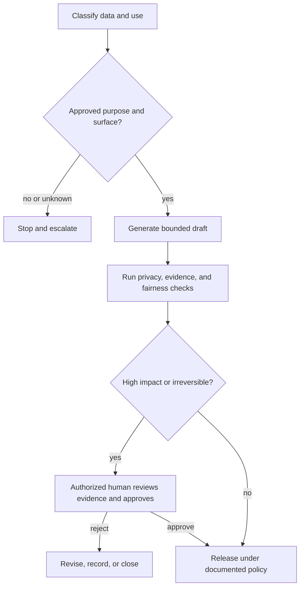

# Put Authority Around Capability | 把权限围绕能力来设计

> A model can produce an answer without having permission to see the data, make the decision, or take the action.

> **【中文解读】** 本课讲治理（governance）的核心判断：模型能生成答案，不等于它有权限查看这些数据、做出这个决定或执行这个动作。课程把能力（capability）、许可（permission）、授权（authority）拆成三道独立的门，然后依次讲：先对数据和用途分类、再做数据与用途最小化、核对可变的产品条款、把人工审查放在决策边界上、给护栏做纵深防御、为事件预备处置路径。这套判断是四条认证路线共同的治理基础，也是考试治理类情境题的答题骨架。

> **【拓展：从提示词防护到组织治理】** 新手常把治理误解为往提示词里加一句"注意隐私"。本课的立场是：治理定义的是谁可以为哪个目的、在哪个产品面（surface）上、带着哪些控制使用哪些数据，以及由谁负责；这些是组织与合同层面的事实，不是模型行为。主课程的 Phase 17 安全审计与合规框架课、Phase 18 公平性标准课是本课的延伸；认证课程的 13 课（应用安全）和 27 课（企业治理与人工审查）会继续深化同一套框架。

> 🔗 **【前置】** 学本课前请先掌握：(1) 04 课（上下文的类型），不同事实要放进不同类型的上下文；(2) 05 课（输出验证），验证的是论断不是自信，本课的审批包直接复用这个思路；(3) Phase 11·12（Guardrails 护栏），护栏是分层控制而不是一句提示词。

**Type:** Learn | **类型:** 学习
**Languages:** Python | **语言:** Python
**Prerequisites:** [Put Each Fact in the Right Kind of Context](../../04-context-knowledge-memory-and-caching/), [Validate the Claim, Not the Confidence](../../05-output-evaluation-and-validation/), [Guardrails](../../../../../phases/11-llm-engineering/12-guardrails/) | **前置知识:** 04 上下文类型、05 输出验证、Phase 11·12 护栏
**Time:** ~110 minutes | **时间:** 约 110 分钟

## Learning Objectives

**学习目标**

- Classify information and use cases before selecting a Claude surface or workflow.
  中文翻译：在选择 Claude 产品面或工作流之前，先对信息和使用场景做分类。
- Separate technical capability from organizational permission and human authority.
  中文翻译：把技术能力与组织许可、人工授权区分开来。
- Design controls for privacy, security, bias, transparency, retention, and misuse.
  中文翻译：为隐私、安全、偏见、透明度、保留期和滥用设计控制措施。
- Place human review according to consequence, reversibility, and ambiguity.
  中文翻译：按后果、可逆性与模糊度来安排人工审查的位置。
- Build an incident and escalation path for unsafe or noncompliant behavior.
  中文翻译：为不安全或不合规的行为建立事件与升级（escalation）路径。

## The Problem | 问题引入

> **【中文解读】** 开场案例是一次"聪明的违规"：客户成功经理为了加快账户复盘，把工单记录、合同摘录和续约笔记贴进未经批准的个人 AI 账号；摘要很有用，于是进一步让 Claude 按续约风险给客户排序并自动发送专属优惠。输出质量还轮不到被讨论，工作流已经在数据敏感度、产品条款、公平性、职权、留痕五个层面失败。往提示词里加一句"保护隐私"修复不了其中任何一层：治理先于生成。

A customer-success manager wants faster account reviews. They paste support transcripts, contract excerpts, and renewal notes into an unapproved personal AI account. Claude produces useful summaries, so the manager asks it to rank customers by renewal risk and automatically send special offers.

> 一位客户成功经理想要更快的账户复盘。此人把工单记录、合同摘录和续约笔记粘贴进一个未经批准的个人 AI 账号。Claude 给出了有用的摘要，于是这位经理进一步要求它按续约风险给客户排序，并自动发送专属优惠。

The workflow has several failures before output quality is considered:

> 在还没轮到讨论输出质量之前，这个工作流已经有好几处失败：

- The transcripts contain personal and commercially sensitive data.
  中文翻译：工单记录包含个人数据和商业敏感数据。
- Nobody checked which product terms and retention controls apply.
  中文翻译：没有人核对适用哪些产品条款和保留控制。
- The ranking may create uneven treatment across customer groups.
  中文翻译：这个排名可能在客户群体之间造成差别对待。
- The manager has no authority to approve discounts automatically.
  中文翻译：这位经理没有自动批准折扣的授权。
- There is no record of sources, review, or sent messages.
  中文翻译：没有对来源、审查或已发消息的任何记录。

Adding "protect privacy" to the prompt does not repair the system. Governance defines who may use which data, for which purpose, on which surface, with which controls, and who remains accountable.

> 往提示词里加一句"保护隐私"修复不了这个系统。治理定义的是：谁可以为哪个目的、在哪个产品面上、带着哪些控制使用哪些数据，以及由谁负责。

## The Concept | 核心概念

### Classify before processing | 先分类，再处理

Start with the data and the decision, not the model.

> 从数据和决定入手，而不是从模型入手。

A simple organizational classification might be:

> 一个简单的组织级分类可以是：

| Class | Example | Typical control direction |
|---|---|---|
| Public | Published documentation | Verify integrity and attribution |
| Internal | Nonpublic process notes | Approved account and access control |
| Confidential | Contracts, customer details | Minimum necessary data, strict permissions, retention review |
| Restricted | Secrets, regulated records, highly sensitive identifiers | Prohibit or require a specifically approved controlled workflow |

These labels are examples, not universal law. Use your organization's actual policy and legal guidance.

> 这些标签只是示例，不是普适法律。请使用你所在组织的实际政策和法律意见。

Classify the use case too. Summarizing text for a human reviewer differs from deciding eligibility or sending a binding communication. A low-sensitivity input can still support a high-impact decision.

> 使用场景也要分类。给人工审查者做文本摘要，与裁定资格或发送有约束力的通知，是两回事。低敏感度的输入仍然可能支撑一个高影响的决定。

Ask five questions at intake:

> 在受理时问五个问题：

1. What data enters the workflow?
   中文翻译：什么数据进入这个工作流？
2. What purpose is approved?
   中文翻译：批准了什么用途？
3. Who may access the input and output?
   中文翻译：谁可以访问输入和输出？
4. What decision or action could follow?
   中文翻译：随后可能做出什么决定或行动？
5. How long may records be retained?
   中文翻译：记录可以保留多久？

If one answer is unknown, the correct next step may be policy clarification, not generation.

> 只要有一个答案未知，正确的下一步可能是先澄清政策，而不是先生成内容。

### Capability, permission, and authority are separate | 能力、许可与授权相互独立

> 💡 **【类比】** 三道门像医院手术的三个前提。能力（capability）是"你的手会做这台手术"：技术上办得到；许可（permission）是"你的工卡刷得开这间手术室"：这个身份被允许接触这些数据和工具；授权（authority）是"排班表上今天主刀的是你"：这个角色有权做这个决定。三者缺一不可：会做手术、刷得开门、但今天不轮到你主刀，动刀就是越权。

Claude may be technically capable of drafting an offer. A connector may have permission to access a customer record. Neither means the workflow is authorized to approve a discount or send a message.

> Claude 在技术上可能有能力起草优惠方案；某个连接器可能有访问客户记录的许可。但这两条都不意味着这个工作流被授权去批准折扣或发送消息。

Use three gates:

> 使用三道门：

```text
Capability: Can the system perform the operation?
Permission: May this identity access the required data or tool?
Authority: May this role make or execute the decision?
```

All three must pass. Tool permissions should follow least privilege. Give the workflow only the data and actions required for its approved purpose. Separate read, draft, approve, and execute roles where consequence is meaningful.

> 三道门必须全部通过。工具权限应遵循最小权限（least privilege）：只给工作流完成其已批准用途所需的数据和动作。在后果有意义的地方，把读取、起草、批准、执行四种角色分开。

### Minimize data and purpose | 数据与用途最小化

Purpose limitation means data approved for one job is not automatically approved for another. Support transcripts collected to resolve incidents may not be approved for customer profiling.

> 用途限制（purpose limitation）指的是：为一个用途批准的数据，不会自动为另一个用途获批。为解决事件而收集的工单记录，未必被批准用于客户画像。

Data minimization asks for the smallest sufficient input:

> 数据最小化（data minimization）要求使用最小充分输入：

- Remove names when identity is not needed.
  中文翻译：不需要身份时去掉姓名。
- Replace exact identifiers with scoped references.
  中文翻译：把精确标识符换成限定范围的引用。
- Retrieve relevant sections rather than entire records.
  中文翻译：只检索相关片段，而不是整份记录。
- Avoid putting secrets into prompts or logs.
  中文翻译：不要把密钥放进提示词或日志。
- Limit outputs to the fields required by the next step.
  中文翻译：把输出限制在下一步所需的字段内。

Minimization reduces exposure, prompt size, and accidental secondary use. It does not remove the need for an approved surface and documented policy.

> 最小化能减少暴露面、提示词长度和意外的二次使用，但它不能替代"已批准的产品面 + 成文政策"。

### Product terms are changeable facts | 产品条款是可变的事实

Data usage, retention, regional processing, administrative controls, and feature availability can differ across consumer products, commercial offerings, API usage, plans, and configured settings. These facts can change.

> 数据使用、保留、区域化处理、管理控制与功能可用性，在消费级产品、商业版、API 用量、套餐和配置项之间都可能不同。而且这些事实会变。

Do not transfer an assumption from one Claude surface to another. Before deployment, verify current official terms and your organization's contract for:

> 不要把对一个 Claude 产品面的假设直接搬到另一个上。部署前，请对照现行官方条款和你所在组织的合同核实以下各项：

- Whether and how submitted data may be used.
  中文翻译：提交的数据是否可能被使用、以及如何被使用。
- Default and configurable retention.
  中文翻译：默认与可配置的保留期。
- Deletion behavior and legal exceptions.
  中文翻译：删除行为与法律例外。
- Administrative access and audit capabilities.
  中文翻译：管理访问与审计能力。
- Regional or residency options.
  中文翻译：区域或数据驻留选项。
- Connector and third-party data handling.
  中文翻译：连接器与第三方数据处理。

Record the source and verification date in the workflow decision log.

> 把来源和核实日期记进工作流决策日志。

### Human review belongs at decision boundaries | 人工审查属于决策边界

> **【中文解读】** "人在回路"（human in the loop）这个说法太含糊，必须定义清楚：这个人看到什么、决定什么、能拦下什么。审查强度应对应五个维度：后果、不可逆性、政策或证据的模糊度、案例新颖度、事后发现错误的难度。给审查者的材料应是来源证据、模型输出、不确定性、政策约束和拟采取行动；一个光秃秃的批准按钮只能制造仪式性监督。

"Human in the loop" is too vague. Define what the person sees, decides, and can stop.

> "人在回路"太含糊。要定义这个人看到什么、决定什么、能拦下什么。

Place stronger review where one or more are high:

> 在以下一项或多项偏高的地方放置更强的审查：

- Consequence to people, finances, rights, safety, or reputation.
  中文翻译：对人、财务、权利、安全或声誉的后果。
- Irreversibility of the action.
  中文翻译：动作的不可逆程度。
- Ambiguity in policy or evidence.
  中文翻译：政策或证据的模糊度。
- Novelty of the case.
  中文翻译：案例的新颖程度。
- Difficulty detecting an error after action.
  中文翻译：事后发现错误的难度。



A reviewer needs the source evidence, model output, uncertainty, policy constraints, and proposed action. A bare approve button creates ceremonial oversight.

> 审查者需要来源证据、模型输出、不确定性、政策约束和拟采取的行动。一个光秃秃的批准按钮只会造成仪式性监督。

### Fairness requires a defined population and outcome | 公平性需要明确的群体与结果

Bias is not solved by asking the model to be unbiased. Define:

> 偏见不是让模型"保持公正"就能解决的。要先定义：

- Who is affected?
  中文翻译：谁受到影响？
- What outcome is allocated or withheld?
  中文翻译：分配或扣留的是什么结果？
- Which attributes or proxies could create unjustified disparity?
  中文翻译：哪些属性或代理变量可能造成无正当理由的差距？
- What comparison and threshold will be used?
  中文翻译：用什么对照和阈值？
- Who is qualified to interpret the result?
  中文翻译：谁有资格解读结果？
- What appeal or correction path exists?
  中文翻译：存在什么申诉或纠正路径？

Test by relevant segments where lawful and appropriate. Investigate both data imbalance and workflow design. Human review can reproduce the same bias if reviewers see the same misleading evidence.

> 在合法且适当的范围内按相关分组做测试。同时排查数据失衡和工作流设计。如果审查者看到的是同一份误导性证据，人工审查也会复现同样的偏见。

For decisions involving employment, credit, housing, healthcare, education, public services, or legal rights, involve qualified policy, legal, and domain owners. This course is not legal advice.

> 涉及就业、信贷、住房、医疗、教育、公共服务或法律权利的决定，要请具备资格的政策、法务和领域负责人参与。本课程不构成法律意见。

### Transparency should serve the affected person | 透明度应服务于受影响的人

Useful transparency explains:

> 有用的透明度要解释清楚：

- That AI materially assisted, when policy requires disclosure.
  中文翻译：在政策要求披露时，说明 AI 实质性参与了。
- What information influenced the result.
  中文翻译：哪些信息影响了结果。
- What uncertainty or limitations remain.
  中文翻译：还剩哪些不确定性与局限。
- Who made the final decision.
  中文翻译：最终决定是谁做的。
- How to request correction or appeal.
  中文翻译：如何申请更正或申诉。

Do not expose hidden system instructions, security controls, personal data, or proprietary reasoning to satisfy a vague demand for transparency. Explain the process and evidence at the level needed for accountability.

> 不要为了满足一句含糊的"要透明"，就暴露隐藏的系统指令、安全控制、个人数据或专有推理。按问责所需的程度解释过程和证据即可。

### Guardrails need defense in depth | 护栏需要纵深防御

> **【中文解读】** 提示词里的指令只是护栏的一层。稳健的工作流是纵深防御（defense in depth）：从输入分类与访问控制、密钥与个人数据检测、可信来源过滤、工具白名单与作用域凭证、结构化输出与确定性校验、内容与政策检查、后果性动作前的审批、速率与花费限额，到审计日志、监控回滚和事件响应。默认立场是：来源内容可能携带恶意指令，检索到的文档是数据不是命令，工具授权永远留在模型文本之外。

Prompt instructions are one layer. A robust workflow can include:

> 提示词指令只是其中一层。稳健的工作流可以包括：

- Input classification and access control.
  中文翻译：输入分类与访问控制。
- Secret and personal-data detection.
  中文翻译：密钥与个人数据检测。
- Trusted-source retrieval filters.
  中文翻译：可信来源检索过滤。
- Tool allowlists and scoped credentials.
  中文翻译：工具白名单与限定作用域的凭证。
- Structured outputs and deterministic validation.
  中文翻译：结构化输出与确定性校验。
- Content and policy checks.
  中文翻译：内容与政策检查。
- Approval before consequential actions.
  中文翻译：后果性动作之前的审批。
- Rate and spend limits.
  中文翻译：速率与花费限额。
- Audit logs with appropriate retention.
  中文翻译：带合适保留期的审计日志。
- Monitoring, rollback, and incident response.
  中文翻译：监控、回滚与事件响应。

Assume source content can contain malicious instructions. Treat retrieved documents as data, not commands. Clearly delimit them and keep tool authorization outside model text.

> 假设来源内容可能包含恶意指令。把检索到的文档当作数据而不是命令：明确划定边界，并让工具授权独立于模型文本之外。

### Incidents need a prepared path | 事件需要预先备好的路径

> **【中文解读】** 事件不只是隐私泄露：不安全的建议、未授权的工具使用、系统性偏见、提示注入（prompt injection）、反复出现的无依据输出，都是事件。上线前就要备好六步：检测、遏制、保全、通知、纠正、学习。在没核对实际政策和司法辖区之前，不要承诺删除效果、通知时限或法律结论。

An incident can be privacy exposure, unsafe advice, unauthorized tool use, systematic bias, prompt injection, or repeated unsupported output.

> 一次事件可以是隐私暴露、不安全的建议、未授权的工具使用、系统性偏见、提示注入，或反复出现的无依据输出。

Prepare before launch:

> 上线前先准备好：

1. **Detect:** Define signals and reporting channels.
   中文翻译：检测：定义信号与上报渠道。
2. **Contain:** Pause the workflow, revoke credentials, or disable an action path.
   中文翻译：遏制：暂停工作流、吊销凭证或停用某条行动路径。
3. **Preserve:** Retain approved evidence without spreading sensitive data.
   中文翻译：保全：保留获批的证据，同时不扩散敏感数据。
4. **Notify:** Follow organizational and legal escalation rules.
   中文翻译：通知：遵循组织与法律层面的升级规则。
5. **Correct:** Repair data, permissions, prompt, model, or workflow controls.
   中文翻译：纠正：修复数据、权限、提示词、模型或工作流控制。
6. **Learn:** Add evaluation cases and monitoring to prevent recurrence.
   中文翻译：学习：补充评估用例与监控以防复发。

Do not promise deletion, notification timing, or legal conclusions without checking the actual policy and jurisdiction.

> 在核对实际政策与司法辖区之前，不要对删除、通知时限或法律结论做任何承诺。

## Build It | 动手构建

> **【中文解读】** 构建环节产出的不是代码，而是一套治理文书：用例卡（谁批准、什么数据、禁止什么）、控制映射表（每类风险配预防、检测、纠正三层控制）、审批包（给审查者的证据与选项）、威胁演练（六种必测场景）。这四份文书合起来就是 27 课企业治理和毕业设计要引用的治理证据。

### Step 1: Write a use-case card | 第 1 步：写一张用例卡

```text
Purpose:
Data classes:
Affected people:
Allowed sources:
Approved Claude surface:
Allowed outputs:
Prohibited actions:
Human decision owner:
Retention rule:
Incident owner:
```

Require explicit approval for changes in purpose, data class, or action authority.

> 用途、数据等级或行动授权发生任何变化，都必须重新获得显式批准。

### Step 2: Create a control map | 第 2 步：创建控制映射表

Map each risk to preventive, detective, and corrective controls:

> 把每类风险映射到预防、检测、纠正三层控制：

| Risk | Prevent | Detect | Correct |
|---|---|---|---|
| Personal data exposure | Minimize and redact input | Scan prompts and outputs | Contain, notify, rotate access |
| Unsupported recommendation | Constrain sources | Claim-evidence validation | Block and revise |
| Unauthorized action | Read-only tools and approval | Audit attempted actions | Revoke credential and investigate |
| Uneven treatment | Define criteria and representative tests | Segment evaluation | Rework data, policy, or workflow |

One control rarely covers the full failure path.

> 单一控制很少能覆盖完整的失败路径。

### Step 3: Design the approval packet | 第 3 步：设计审批包

The reviewer should receive:

> 审查者应收到：

- Proposed decision or action.
  中文翻译：拟议的决定或行动。
- Supporting and conflicting evidence.
  中文翻译：支持性与相冲突的证据。
- Data and policy classification.
  中文翻译：数据与政策分级。
- Automated check results.
  中文翻译：自动化检查结果。
- Known uncertainty.
  中文翻译：已知的不确定性。
- Reversibility and affected population.
  中文翻译：可逆性与受影响人群。
- Explicit approve, revise, reject, and escalate options.
  中文翻译：显式的批准、修订、驳回、升级选项。

Track the human decision separately from the model recommendation.

> 人工决定要与模型建议分开留痕。

### Step 4: Run a threat workshop | 第 4 步：跑一次威胁演练

Test at least these cases:

> 至少测试以下场景：

- Restricted data appears unexpectedly.
  中文翻译：受限数据意外出现。
- A connected document contains instructions to ignore policy.
  中文翻译：某个接入的文档里含有"无视政策"的指令。
- A user requests a purpose outside approval.
  中文翻译：用户请求批准范围之外的用途。
- The model proposes an action beyond role authority.
  中文翻译：模型提议超出角色授权的行动。
- Evaluation shows a disparity for an affected segment.
  中文翻译：评估显示某个受影响分组存在差距。
- A third-party connector becomes unavailable or changes behavior.
  中文翻译：第三方连接器不可用或行为变化。

Record which control detects the issue and who acts next.

> 记录哪一层控制检测到了问题、下一步由谁行动。

## Interactive Lab

**交互实验室**

Use the confidence-risk figure to vary evidence confidence, consequence, reversibility, and affected population. The interaction demonstrates why a high-confidence output can still require review when authority or impact is high.

> 用置信度-风险图调整证据置信度、后果、可逆性和受影响人群。这个交互演示了为什么高置信度的输出在授权或影响偏高时仍然需要审查。

```figure
06-data-analysis-confidence
```

## Practice Lab

**练习实验室**

Run the governance scorer. Raise analysis confidence to 1.0, remove the human gate, or allow untrusted content to authorize mutation. The result should show that confidence never replaces authority or consequence controls.

> 运行治理评分器。把分析置信度调到 1.0、移除人工门，或允许不可信内容授权数据变更。结果应当表明：置信度永远替代不了授权与后果控制。

## Shipped Artifact

**交付产物**

`outputs/responsible-use-control-map.json` is a filled governance packet for customer-renewal assistance. It includes the approved purpose, data classes, prohibited actions, preventive, detective, and corrective controls, a human approval packet, and an incident owner.

> `outputs/responsible-use-control-map.json` 是一份填好的客户续约辅助治理包，包含已批准的用途、数据等级、禁止行为、预防/检测/纠正三层控制、一个人工审批包和事件负责人。

## Verify It

**验证**

Validate the controls:

> 验证这些控制：

```bash
cd certifications/claude/lessons/06-governance-safety-and-responsible-use/code
python3 main.py
python3 -m unittest discover tests -v
```

The validator rejects missing control layers, unowned incidents, high-impact actions without an authorized human gate, and any design that lets untrusted content authorize mutation.

> 校验器会拒绝：缺少控制层、事件没有负责人、高影响动作没有授权人工门，以及任何让不可信内容授权数据变更的设计。

## Capstone Connection

**毕业设计衔接**

The quiz checks capability versus authority, minimization, surface-specific terms, review quality, injection boundaries, and fairness response. Carry this packet into Associate capstone 29 and Professional Architect capstone 32 as the governance and approval evidence.

> 测验考察能力与授权的区分、最小化、按产品面区分的条款、审查质量、注入边界和公平性应对。把这份治理包带进助理级毕业设计 29 和架构师专业级毕业设计 32，作为治理与审批证据。

## Use It | 运行验证

> **【中文解读】** 考试决策模式是一张六步答题骨架：分类数据、用途与后果；核对现行产品条款与组织政策；最小化输入与权限；把生成与决定、行动的授权分开；在高影响或不可逆动作前设真正的人工门；保住证据、可审计性、申诉与事件响应。下面的八个常见陷阱各自对应骨架上被偷懒的一步："只靠提示词做治理"输在第二层，"把技术访问当授权"输在第四步，"橡皮图章式审查"输在第五步。

### Exam decision pattern | 考试决策模式

In governance scenarios:

> 在治理类情境中：

1. Classify data, purpose, and consequence.
   中文翻译：分类数据、用途与后果。
2. Check the current approved product terms and organizational policy.
   中文翻译：核对现行已批准的产品条款与组织政策。
3. Minimize input and permissions.
   中文翻译：最小化输入与权限。
4. Separate generation from authority to decide or act.
   中文翻译：把生成与决定、行动的授权分开。
5. Put a meaningful human gate before high-impact or irreversible action.
   中文翻译：在高影响或不可逆动作之前设一个有意义的人工门。
6. Preserve evidence, auditability, appeal, and incident response.
   中文翻译：保住证据、可审计性、申诉与事件响应。

### Common traps | 常见陷阱

- **Prompt-only governance:** A sentence cannot enforce access or retention.
  中文翻译：只靠提示词做治理：一句话强制不了访问控制或保留期。
- **Technical access as authority:** A connector permission is mistaken for business approval.
  中文翻译：把技术访问当授权：连接器许可被误当成业务批准。
- **One privacy rule for every surface:** Product and contract behavior differs.
  中文翻译：一套隐私规则走遍所有产品面：产品与合同行为并不相同。
- **Collect now, find a use later:** Secondary purpose lacks approval.
  中文翻译：先收集后找用途：二次用途缺少批准。
- **Human rubber stamp:** The reviewer lacks evidence or power to reject.
  中文翻译：橡皮图章式人工审查：审查者缺少证据或驳回权。
- **Fairness by instruction:** No population, measure, or appeal path is defined.
  中文翻译：靠指令实现公平：没有定义群体、度量或申诉路径。
- **Maximum logging:** Audit data creates new privacy and security risk.
  中文翻译：日志最大化：审计数据本身制造新的隐私与安全风险。
- **Compliance certainty:** The workflow makes legal claims without qualified review.
  中文翻译：合规确定性：工作流在没有资质审查的情况下下法律结论。

### Exercises | 练习

1. Classify the data and action in three workflows from your organization.
   中文翻译：对你所在组织的三个工作流做数据与行动分类。
2. Create a use-case card for one Claude-assisted process.
   中文翻译：为一个 Claude 辅助的流程创建用例卡。
3. Build a control map with preventive, detective, and corrective controls.
   中文翻译：构建一份含预防、检测、纠正三层控制的控制映射表。
4. Redesign a broad connector permission using least privilege.
   中文翻译：用最小权限原则重新设计一个过宽的连接器权限。
5. Write an approval packet for a high-consequence recommendation.
   中文翻译：为一条高后果建议写一份审批包。
6. Tabletop an incident and identify the first containment action.
   中文翻译：桌面演练一次事件，并确定第一个遏制动作。

## Key Terms | 关键术语

- **Purpose limitation:** Using data only for the approved objective.
  中文翻译：用途限制：只为已批准的目标使用数据。
- **Data minimization:** Processing only the information necessary for that objective.
  中文翻译：数据最小化：只处理该目标所必需的信息。
- **Least privilege:** Granting the smallest access and action scope required.
  中文翻译：最小权限：只授予所需的最小访问与行动范围。
- **Human decision gate:** A defined point where an authorized person can inspect, reject, revise, or approve.
  中文翻译：人工决策门：一个明确定义的位置，被授权的人可以在此时检查、驳回、修订或批准。
- **Defense in depth:** Multiple controls across the failure path.
  中文翻译：纵深防御：沿失败路径布置多层控制。
- **Prompt injection:** Untrusted content attempting to alter model or tool behavior.
  中文翻译：提示注入：不可信内容试图改变模型或工具行为。
- **Appeal path:** A process for an affected person to challenge or correct a result.
  中文翻译：申诉路径：受影响者质疑或更正结果的流程。
- **Incident response:** Prepared detection, containment, notification, correction, and learning actions.
  中文翻译：事件响应：预先准备好的检测、遏制、通知、纠正与学习动作。

## Further Reading | 延伸阅读

- [Anthropic: API and data retention](https://platform.claude.com/docs/en/manage-claude/api-and-data-retention)
  中文翻译：Anthropic 官方对 API 数据使用与保留的现行说明。
- [Anthropic Privacy Center](https://privacy.anthropic.com/)
  中文翻译：Anthropic 隐私中心。
- [Anthropic Trust Center](https://trust.anthropic.com/)
  中文翻译：Anthropic 信任中心。
- [Anthropic: Responsible Scaling Policy](https://www.anthropic.com/responsible-scaling-policy)
  中文翻译：Anthropic 负责任扩展政策。
- [Anthropic: Reduce prompt leak](https://platform.claude.com/docs/en/test-and-evaluate/strengthen-guardrails/reduce-prompt-leak)
  中文翻译：官方减少提示词泄漏的护栏做法。
- [AI Engineering from Scratch: Security, Secrets, and Audit](../../../../../phases/17-infrastructure-and-production/25-security-secrets-audit/)
  中文翻译：主课程的安全、密钥与审计课。
- [AI Engineering from Scratch: Compliance Frameworks](../../../../../phases/17-infrastructure-and-production/26-compliance-frameworks/)
  中文翻译：主课程的合规框架课。
- [AI Engineering from Scratch: Fairness Criteria](../../../../../phases/18-ethics-safety-alignment/21-fairness-criteria-group-individual-counterfactual/)
  中文翻译：主课程的公平性标准课。

Privacy, retention, administrative controls, product terms, and regulatory obligations change and can differ by surface, plan, contract, location, and settings. These official sources were checked on 2026-08-08. Verify the current terms and obtain qualified organizational guidance before processing sensitive data or automating consequential decisions.

> 隐私、保留、管理控制、产品条款和监管义务都会变化，并因产品面、套餐、合同、地点和设置而异。这些官方来源核实于 2026-08-08。在处理敏感数据或自动化高后果决定之前，请核实现行条款并取得有资质的组织内指导。
