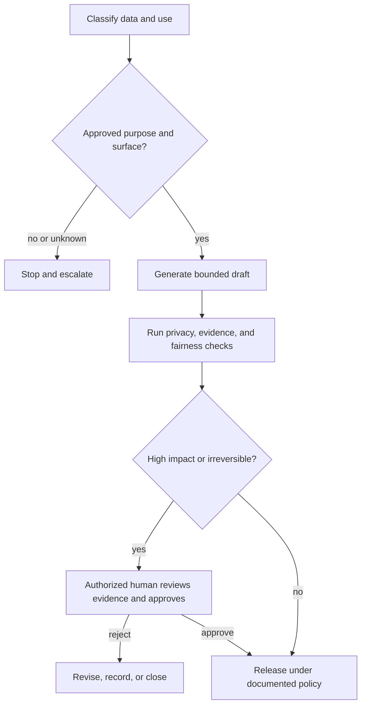

# 把权限围绕能力来设计

> 模型可以产出一个答案，但它未必有权限查看这些数据、做出这个决定或执行这个动作。

> **【中文解读】** 本课讲治理（governance）的核心判断：能力、许可、授权是三道独立的门。课程依次讲：先对数据和用途分类、再做数据与用途最小化、核对可变的产品条款、把人工审查放在决策边界上、给护栏做纵深防御、为事件预备处置路径。这套判断是四条认证路线共同的治理基础，也是考试治理类情境题的答题骨架。

> **【拓展：从提示词防护到组织治理】** 新手常把治理误解为往提示词里加一句"注意隐私"。本课的立场是：治理定义的是谁可以为哪个目的、在哪个产品面（surface）上、带着哪些控制使用哪些数据，以及由谁负责；这些是组织与合同层面的事实，不是模型行为。主课程的 Phase 17 安全审计与合规框架课、Phase 18 公平性标准课是本课的延伸；认证课程的 13 课（应用安全）和 27 课（企业治理与人工审查）会继续深化同一套框架。

> 🔗 **【前置】** 学本课前请先掌握：(1) 04 课（上下文的类型），不同事实要放进不同类型的上下文；(2) 05 课（输出验证），验证的是论断不是自信，本课的审批包直接复用这个思路；(3) Phase 11·12（Guardrails 护栏），护栏是分层控制而不是一句提示词。

**类型：** 学习
**语言：** Python
**前置条件：** 04 上下文类型、05 输出验证、Phase 11·12 护栏
**预计用时：** 约 110 分钟

## 学习目标

- 在选择 Claude 产品面或工作流之前，先对信息和使用场景做分类。
- 把技术能力与组织许可、人工授权区分开来。
- 为隐私、安全、偏见、透明度、保留期和滥用设计控制措施。
- 按后果、可逆性与模糊度来安排人工审查的位置。
- 为不安全或不合规的行为建立事件与升级（escalation）路径。

## 问题引入

> **【中文解读】** 开场案例是一次"聪明的违规"：客户成功经理为了加快账户复盘，把工单记录、合同摘录和续约笔记贴进未经批准的个人 AI 账号；摘要很有用，于是进一步让 Claude 按续约风险给客户排序并自动发送专属优惠。输出质量还轮不到被讨论，工作流已经在数据敏感度、产品条款、公平性、职权、留痕五个层面失败。往提示词里加一句"保护隐私"修复不了其中任何一层：治理先于生成。

一位客户成功经理想要更快的账户复盘。此人把工单记录、合同摘录和续约笔记粘贴进一个未经批准的个人 AI 账号。Claude 给出了有用的摘要，于是这位经理进一步要求它按续约风险给客户排序，并自动发送专属优惠。

在还没轮到讨论输出质量之前，这个工作流已经有好几处失败：

- 工单记录包含个人数据和商业敏感数据。
- 没有人核对适用哪些产品条款和保留控制。
- 这个排名可能在客户群体之间造成差别对待。
- 这位经理没有自动批准折扣的授权。
- 没有对来源、审查或已发消息的任何记录。

往提示词里加一句"保护隐私"修复不了这个系统。治理定义的是：谁可以为哪个目的、在哪个产品面上、带着哪些控制使用哪些数据，以及由谁负责。

## 核心概念

### 先分类，再处理

从数据和决定入手，而不是从模型入手。

一个简单的组织级分类可以是：

| 等级 | 示例 | 典型控制方向 |
|---|---|---|
| 公开（Public） | 已发布的文档 | 校验完整性与署名 |
| 内部（Internal） | 未公开的过程笔记 | 批准的账号与访问控制 |
| 机密（Confidential） | 合同、客户明细 | 最小必要数据、严格权限、保留期审查 |
| 受限（Restricted） | 密钥、受监管记录、高度敏感标识符 | 禁止，或要求专项批准的受控工作流 |

这些标签只是示例，不是普适法律。请使用你所在组织的实际政策和法律意见。

使用场景也要分类。给人工审查者做文本摘要，与裁定资格或发送有约束力的通知，是两回事。低敏感度的输入仍然可能支撑一个高影响的决定。

在受理时问五个问题：

1. 什么数据进入这个工作流？
2. 批准了什么用途？
3. 谁可以访问输入和输出？
4. 随后可能做出什么决定或行动？
5. 记录可以保留多久？

只要有一个答案未知，正确的下一步可能是先澄清政策，而不是先生成内容。

### 能力、许可与授权相互独立

> 💡 **【类比】** 三道门像医院手术的三个前提。能力（capability）是"你的手会做这台手术"：技术上办得到；许可（permission）是"你的工卡刷得开这间手术室"：这个身份被允许接触这些数据和工具；授权（authority）是"排班表上今天主刀的是你"：这个角色有权做这个决定。三者缺一不可：会做手术、刷得开门、但今天不轮到你主刀，动刀就是越权。

Claude 在技术上可能有能力起草优惠方案；某个连接器可能有访问客户记录的许可。但这两条都不意味着这个工作流被授权去批准折扣或发送消息。

使用三道门：

```text
Capability: Can the system perform the operation?
Permission: May this identity access the required data or tool?
Authority: May this role make or execute the decision?
```

三道门必须全部通过。工具权限应遵循最小权限（least privilege）：只给工作流完成其已批准用途所需的数据和动作。在后果有意义的地方，把读取、起草、批准、执行四种角色分开。

### 数据与用途最小化

用途限制（purpose limitation）指的是：为一个用途批准的数据，不会自动为另一个用途获批。为解决事件而收集的工单记录，未必被批准用于客户画像。

数据最小化（data minimization）要求使用最小充分输入：

- 不需要身份时去掉姓名。
- 把精确标识符换成限定范围的引用。
- 只检索相关片段，而不是整份记录。
- 不要把密钥放进提示词或日志。
- 把输出限制在下一步所需的字段内。

最小化能减少暴露面、提示词长度和意外的二次使用，但它不能替代"已批准的产品面 + 成文政策"。

### 产品条款是可变的事实

数据使用、保留、区域化处理、管理控制与功能可用性，在消费级产品、商业版、API 用量、套餐和配置项之间都可能不同。而且这些事实会变。

不要把对一个 Claude 产品面的假设直接搬到另一个上。部署前，请对照现行官方条款和你所在组织的合同核实以下各项：

- 提交的数据是否可能被使用、以及如何被使用。
- 默认与可配置的保留期。
- 删除行为与法律例外。
- 管理访问与审计能力。
- 区域或数据驻留选项。
- 连接器与第三方数据处理。

把来源和核实日期记进工作流决策日志。

### 人工审查属于决策边界

> **【中文解读】** "人在回路"（human in the loop）这个说法太含糊，必须定义清楚：这个人看到什么、决定什么、能拦下什么。审查强度应对应五个维度：后果、不可逆性、政策或证据的模糊度、案例新颖度、事后发现错误的难度。给审查者的材料应是来源证据、模型输出、不确定性、政策约束和拟采取行动；一个光秃秃的批准按钮只能制造仪式性监督。

"人在回路"太含糊。要定义这个人看到什么、决定什么、能拦下什么。

在以下一项或多项偏高的地方放置更强的审查：

- 对人、财务、权利、安全或声誉的后果。
- 动作的不可逆程度。
- 政策或证据的模糊度。
- 案例的新颖程度。
- 事后发现错误的难度。



审查者需要来源证据、模型输出、不确定性、政策约束和拟采取的行动。一个光秃秃的批准按钮只会造成仪式性监督。

### 公平性需要明确的群体与结果

偏见不是让模型"保持公正"就能解决的。要先定义：

- 谁受到影响？
- 分配或扣留的是什么结果？
- 哪些属性或代理变量可能造成无正当理由的差距？
- 用什么对照和阈值？
- 谁有资格解读结果？
- 存在什么申诉或纠正路径？

在合法且适当的范围内按相关分组做测试。同时排查数据失衡和工作流设计。如果审查者看到的是同一份误导性证据，人工审查也会复现同样的偏见。

涉及就业、信贷、住房、医疗、教育、公共服务或法律权利的决定，要请具备资格的政策、法务和领域负责人参与。本课程不构成法律意见。

### 透明度应服务于受影响的人

有用的透明度要解释清楚：

- 在政策要求披露时，说明 AI 实质性参与了。
- 哪些信息影响了结果。
- 还剩哪些不确定性与局限。
- 最终决定是谁做的。
- 如何申请更正或申诉。

不要为了满足一句含糊的"要透明"，就暴露隐藏的系统指令、安全控制、个人数据或专有推理。按问责所需的程度解释过程和证据即可。

### 护栏需要纵深防御

> **【中文解读】** 提示词里的指令只是护栏的一层。稳健的工作流是纵深防御（defense in depth）：从输入分类与访问控制、密钥与个人数据检测、可信来源过滤、工具白名单与作用域凭证、结构化输出与确定性校验、内容与政策检查、后果性动作前的审批、速率与花费限额，到审计日志、监控回滚和事件响应。默认立场是：来源内容可能携带恶意指令，检索到的文档是数据不是命令，工具授权永远留在模型文本之外。

提示词指令只是其中一层。稳健的工作流可以包括：

- 输入分类与访问控制。
- 密钥与个人数据检测。
- 可信来源检索过滤。
- 工具白名单与限定作用域的凭证。
- 结构化输出与确定性校验。
- 内容与政策检查。
- 后果性动作之前的审批。
- 速率与花费限额。
- 带合适保留期的审计日志。
- 监控、回滚与事件响应。

假设来源内容可能包含恶意指令。把检索到的文档当作数据而不是命令：明确划定边界，并让工具授权独立于模型文本之外。

### 事件需要预先备好的路径

> **【中文解读】** 事件不只是隐私泄露：不安全的建议、未授权的工具使用、系统性偏见、提示注入（prompt injection）、反复出现的无依据输出，都是事件。上线前就要备好六步：检测、遏制、保全、通知、纠正、学习。在没核对实际政策和司法辖区之前，不要承诺删除效果、通知时限或法律结论。

一次事件可以是隐私暴露、不安全的建议、未授权的工具使用、系统性偏见、提示注入，或反复出现的无依据输出。

上线前先准备好：

1. **检测：** 定义信号与上报渠道。
2. **遏制：** 暂停工作流、吊销凭证或停用某条行动路径。
3. **保全：** 保留获批的证据，同时不扩散敏感数据。
4. **通知：** 遵循组织与法律层面的升级规则。
5. **纠正：** 修复数据、权限、提示词、模型或工作流控制。
6. **学习：** 补充评估用例与监控以防复发。

在核对实际政策与司法辖区之前，不要对删除、通知时限或法律结论做任何承诺。

## 动手构建

> **【中文解读】** 构建环节产出的不是代码，而是一套治理文书：用例卡（谁批准、什么数据、禁止什么）、控制映射表（每类风险配预防、检测、纠正三层控制）、审批包（给审查者的证据与选项）、威胁演练（六种必测场景）。这四份文书合起来就是 27 课企业治理和毕业设计要引用的治理证据。

### 第 1 步：写一张用例卡

```text
Purpose:
Data classes:
Affected people:
Allowed sources:
Approved Claude surface:
Allowed outputs:
Prohibited actions:
Human decision owner:
Retention rule:
Incident owner:
```

用途、数据等级或行动授权发生任何变化，都必须重新获得显式批准。

### 第 2 步：创建控制映射表

把每类风险映射到预防、检测、纠正三层控制：

| 风险 | 预防 | 检测 | 纠正 |
|---|---|---|---|
| 个人数据暴露 | 最小化并脱敏输入 | 扫描提示词与输出 | 遏制、通知、轮换访问权 |
| 无依据的推荐 | 约束来源 | 论断-证据校验 | 拦截并修订 |
| 未授权行动 | 只读工具与审批 | 审计被尝试的动作 | 吊销凭证并调查 |
| 差别对待 | 定义标准与代表性测试 | 分组评估 | 返工数据、政策或工作流 |

单一控制很少能覆盖完整的失败路径。

### 第 3 步：设计审批包

审查者应收到：

- 拟议的决定或行动。
- 支持性与相冲突的证据。
- 数据与政策分级。
- 自动化检查结果。
- 已知的不确定性。
- 可逆性与受影响人群。
- 显式的批准、修订、驳回、升级选项。

人工决定要与模型建议分开留痕。

### 第 4 步：跑一次威胁演练

至少测试以下场景：

- 受限数据意外出现。
- 某个接入的文档里含有"无视政策"的指令。
- 用户请求批准范围之外的用途。
- 模型提议超出角色授权的行动。
- 评估显示某个受影响分组存在差距。
- 第三方连接器不可用或行为变化。

记录哪一层控制检测到了问题、下一步由谁行动。

## 交互实验室

用置信度-风险图调整证据置信度、后果、可逆性和受影响人群。这个交互演示了为什么高置信度的输出在授权或影响偏高时仍然需要审查。

```figure
06-data-analysis-confidence
```

## 练习实验室

运行治理评分器。把分析置信度调到 1.0、移除人工门，或允许不可信内容授权数据变更。结果应当表明：置信度永远替代不了授权与后果控制。

## 交付产物

`outputs/responsible-use-control-map.json` 是一份填好的客户续约辅助治理包，包含已批准的用途、数据等级、禁止行为、预防/检测/纠正三层控制、一个人工审批包和事件负责人。

## 验证

验证这些控制：

```bash
cd certifications/claude/lessons/06-governance-safety-and-responsible-use/code
python3 main.py
python3 -m unittest discover tests -v
```

校验器会拒绝：缺少控制层、事件没有负责人、高影响动作没有授权人工门，以及任何让不可信内容授权数据变更的设计。

## 毕业设计衔接

测验考察能力与授权的区分、最小化、按产品面区分的条款、审查质量、注入边界和公平性应对。把这份治理包带进助理级毕业设计 29 和架构师专业级毕业设计 32，作为治理与审批证据。

## 运行验证

> **【中文解读】** 考试决策模式是一张六步答题骨架：分类数据、用途与后果；核对现行产品条款与组织政策；最小化输入与权限；把生成与决定、行动的授权分开；在高影响或不可逆动作前设真正的人工门；保住证据、可审计性、申诉与事件响应。下面的八个常见陷阱各自对应骨架上被偷懒的一步。

### 考试决策模式

在治理类情境中：

1. 分类数据、用途与后果。
2. 核对现行已批准的产品条款与组织政策。
3. 最小化输入与权限。
4. 把生成与决定、行动的授权分开。
5. 在高影响或不可逆动作之前设一个有意义的人工门。
6. 保住证据、可审计性、申诉与事件响应。

### 常见陷阱

- **只靠提示词做治理：** 一句话强制不了访问控制或保留期。
- **把技术访问当授权：** 连接器许可被误当成业务批准。
- **一套隐私规则走遍所有产品面：** 产品与合同行为并不相同。
- **先收集后找用途：** 二次用途缺少批准。
- **橡皮图章式人工审查：** 审查者缺少证据或驳回权。
- **靠指令实现公平：** 没有定义群体、度量或申诉路径。
- **日志最大化：** 审计数据本身制造新的隐私与安全风险。
- **合规确定性：** 工作流在没有资质审查的情况下下法律结论。

### 练习

1. 对你所在组织的三个工作流做数据与行动分类。
2. 为一个 Claude 辅助的流程创建用例卡。
3. 构建一份含预防、检测、纠正三层控制的控制映射表。
4. 用最小权限原则重新设计一个过宽的连接器权限。
5. 为一条高后果建议写一份审批包。
6. 桌面演练一次事件，并确定第一个遏制动作。

## 关键术语

- **用途限制（purpose limitation）：** 只为已批准的目标使用数据。
- **数据最小化（data minimization）：** 只处理该目标所必需的信息。
- **最小权限（least privilege）：** 只授予所需的最小访问与行动范围。
- **人工决策门（human decision gate）：** 一个明确定义的位置，被授权的人可以在此时检查、驳回、修订或批准。
- **纵深防御（defense in depth）：** 沿失败路径布置多层控制。
- **提示注入（prompt injection）：** 不可信内容试图改变模型或工具行为。
- **申诉路径（appeal path）：** 受影响者质疑或更正结果的流程。
- **事件响应（incident response）：** 预先准备好的检测、遏制、通知、纠正与学习动作。

## 延伸阅读

- [Anthropic: API and data retention](https://platform.claude.com/docs/en/manage-claude/api-and-data-retention) — Anthropic 官方对 API 数据使用与保留的现行说明
- [Anthropic Privacy Center](https://privacy.anthropic.com/) — Anthropic 隐私中心
- [Anthropic Trust Center](https://trust.anthropic.com/) — Anthropic 信任中心
- [Anthropic: Responsible Scaling Policy](https://www.anthropic.com/responsible-scaling-policy) — Anthropic 负责任扩展政策
- [Anthropic: Reduce prompt leak](https://platform.claude.com/docs/en/test-and-evaluate/strengthen-guardrails/reduce-prompt-leak) — 官方减少提示词泄漏的护栏做法
- [AI Engineering from Scratch: Security, Secrets, and Audit](../../../../../phases/17-infrastructure-and-production/25-security-secrets-audit/) — 主课程的安全、密钥与审计课
- [AI Engineering from Scratch: Compliance Frameworks](../../../../../phases/17-infrastructure-and-production/26-compliance-frameworks/) — 主课程的合规框架课
- [AI Engineering from Scratch: Fairness Criteria](../../../../../phases/18-ethics-safety-alignment/21-fairness-criteria-group-individual-counterfactual/) — 主课程的公平性标准课

隐私、保留、管理控制、产品条款和监管义务都会变化，并因产品面、套餐、合同、地点和设置而异。这些官方来源核实于 2026-08-08。在处理敏感数据或自动化高后果决定之前，请核实现行条款并取得有资质的组织内指导。
