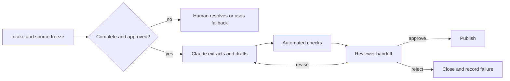

# Design the Handoff Before the Automation | 先设计交接，再设计自动化

> A workflow is not complete when Claude finishes. It is complete when the next person can verify, decide, act, and recover.

> **【中文解读】** 本课讲工作流设计与人工交接（human handoff）。核心命题是：工作流不是在 Claude 做完时完成，而是在下一个人能够验证、决策、行动、恢复时才算完成。课程依次讲：先画现状图、在辅助/自动化/重构/拒绝四种干预中做选择、把每一步写成契约、用后果与可逆性决定控制位置、选对工作流模式、把交接包当产品设计、让状态在故障中存活、按净值度量工作流。这条主线贯穿四条认证路线的情境题。

> **【拓展：从"自动化文本"到"自动化责任链"】** 多数团队的第一反应是把"生成文本"这一步自动化；本课的立场恰好相反：先搞清楚谁批准、谁审查、失败时谁恢复。Anthropic 的 Building effective agents 一文把 prompt chaining、routing、parallelization、orchestrator-workers、evaluator-optimizer 列为五种基本模式，本课把它们放回"责任链"的语境：模式选错，责任就会消失在系统之间。主课程 Phase 14 的 scope contracts、verification gates、multi-session handoff 是同一主题的工程化延伸。

> 🔗 **【前置】** 学本课前请先掌握：(1) 05 课（输出验证），验证的是论断不是自信；(2) 06 课（治理与授权），本课人工门的位置直接来自上一课的后果与可逆性判断；(3) Phase 14·12（Anthropic 工作流模式），五种模式的定义与适用条件。

**Type:** Learn | **类型:** 学习
**Languages:** Python | **语言:** Python
**Prerequisites:** [Validate the Claim, Not the Confidence](../../05-output-evaluation-and-validation/), [Put Authority Around Capability](../../06-governance-safety-and-responsible-use/), [Anthropic Workflow Patterns](../../../../../phases/14-agent-engineering/12-anthropic-workflow-patterns/) | **前置知识:** 05 输出验证、06 治理与授权、Phase 14·12 工作流模式
**Time:** ~105 minutes | **时间:** 约 105 分钟

## Learning Objectives

**学习目标**

- Map a current workflow before choosing where Claude should participate.
  中文翻译：在选择 Claude 参与哪里之前，先画出当前的工作流。
- Decide whether to assist, automate, redesign, or reject a workflow step.
  中文翻译：对一个工作流步骤，决定是辅助、自动化、重构还是拒绝。
- Specify step inputs, outputs, owners, gates, fallback, and service expectations.
  中文翻译：写清每个步骤的输入、输出、负责人、门禁、回退和服务预期。
- Build human handoff packets that preserve evidence, uncertainty, and authority.
  中文翻译：构建能保留证据、不确定性与授权的人工交接包。
- Measure workflow value without ignoring review, failure, and maintenance cost.
  中文翻译：度量工作流价值时不忽略审查、失败和维护成本。

## The Problem | 问题引入

> **【中文解读】** 案例是每周发布简报的自动化：前两期省时间，第三期混进已砍掉的功能，第四期漏掉未解决的安全问题；原来拼简报的工程师以为产品经理现在负责审查，产品经理以为自动发出的帖子早已获批。团队自动化了文本生产，却删掉了所有权模型：没有来源截止（source cutoff）、审批门、升级路径，也没有数据不完整时的回退。成功的工作流不是一串模型调用，而是一条带显式证据、可恢复状态的责任链。

A product team automates its weekly release briefing. Claude reads issue summaries, drafts the brief, and posts it to a shared channel every Friday.

> 一个产品团队把它每周的发布简报自动化了。Claude 读问题摘要、起草简报，并在每周五发到一个共享频道。

The first two briefs save time. The third includes a feature that was removed from scope. The fourth omits an unresolved security concern. The engineer who used to assemble the brief assumes the product manager now owns review. The product manager assumes the automated post was already approved.

> 前两期简报省了时间。第三期混入了一个已从范围中移除的功能。第四期漏掉了一个未解决的安全问题。过去负责拼简报的工程师以为产品经理现在掌管审查；产品经理则以为那条自动发出的帖子早已获批。

The team automated text production but deleted the ownership model. There is no source cutoff, approval gate, escalation path, or fallback when data is incomplete.

> 团队自动化了文本生产，却删掉了所有权模型。没有来源截止、审批门、升级路径，也没有数据不完整时的回退方案。

A successful workflow is not a chain of model calls. It is a chain of responsibilities with explicit evidence and recoverable state.

> 成功的工作流不是一串模型调用，而是一条责任链：证据显式、状态可恢复。

## The Concept | 核心概念

### Map the current state first | 先画现状图

> **【中文解读】** 加 Claude 之前先观察工作真实如何流动，包括那些不写进流程图的非正式检查。只记录理想流程是常见错误：老师傅顺手做的一个核对往往承载着关键知识，直接删掉它而不编码或指派，质量会下滑，而新工作流看起来却更"高效"。八个问题从触发事件一路问到失败恢复。

Before adding Claude, observe how the work really moves:

> 在加入 Claude 之前，先观察工作实际如何流动：

- What event starts it?
  中文翻译：什么事件触发它？
- Who supplies each input?
  中文翻译：每个输入由谁提供？
- Which systems are sources of record?
  中文翻译：哪些系统是权威记录源？
- Where do people use judgment?
  中文翻译：哪些地方依赖人的判断？
- Which exceptions consume most time?
  中文翻译：哪些例外情况最耗时间？
- Who approves the result?
  中文翻译：谁批准结果？
- What downstream action follows?
  中文翻译：随后是什么下游行动？
- How is failure detected and recovered?
  中文翻译：失败如何被发现和恢复？

Do not document only the ideal process. Shadow a few real cases. Informal checks often carry critical knowledge. If you remove them without encoding or assigning them, quality falls while the new workflow appears efficient.

> 不要只记录理想流程。跟踪几个真实案例。非正式检查往往承载关键知识：如果不加编码或指派就直接删掉，质量会下滑，而新工作流看起来却很高效。

### Choose the intervention, not just the tool | 选的是干预方式，不只是工具

For each step, choose among four interventions:

> 对每个步骤，在四种干预中做选择：

1. **Assist:** Claude proposes, summarizes, extracts, or drafts while a person remains the operator.
   中文翻译：辅助：Claude 提议、总结、抽取或起草，人仍然是操作者。
2. **Automate:** The system performs a bounded, well-tested, reversible step under policy.
   中文翻译：自动化：系统在政策约束下执行一个有边界、经过充分测试、可回退的步骤。
3. **Redesign:** The current step is waste caused by poor inputs or duplicate systems, so remove or restructure it.
   中文翻译：重构：当前步骤是劣质输入或重复系统造成的浪费，应移除或重组。
4. **Reject:** The step should not use Claude because data, consequence, ambiguity, or policy makes the risk unacceptable.
   中文翻译：拒绝：该步骤不该用 Claude，因为数据、后果、模糊性或政策使风险不可接受。

Automation is not always the highest maturity. If analysts spend hours reconciling two conflicting spreadsheets, generating reconciliation prose faster does not solve the source conflict.

> 自动化并不总是最高的成熟度。如果分析师要花几小时调和两份互相冲突的表格，更快地生成调和文案并不能解决源头冲突。

### Specify every step as a contract | 把每一步定义为契约

Each step should have:

> 每个步骤都应有：

```text
Trigger:
Owner:
Allowed inputs and sources:
Transformation:
Output schema:
Pass criteria:
Timeout or service expectation:
Escalation condition:
Fallback:
Next owner:
```

The contract lets you test a step independently and prevents responsibility from dissolving between systems.

> 契约让你能独立测试一个步骤，也防止责任在系统之间消散。

For a release brief extraction step:

> 以发布简报的抽取步骤为例：

```text
Trigger: Thursday 15:00 source freeze
Owner: release coordinator
Inputs: approved tracker view and signed security status
Output: structured candidate items with source IDs and status
Pass: all required teams represented; unresolved fields marked
Escalate: missing security status or conflicting launch state
Fallback: coordinator uses the manual template
Next owner: product manager validates inclusion decisions
```

### Use consequence and reversibility to place control | 用后果与可逆性决定控制位置

Two questions shape automation depth:

> 两个问题决定自动化的深度：

1. If the result is wrong, how serious is the consequence?
   中文翻译：如果结果是错的，后果有多严重？
2. Can the action be reversed cheaply before harm occurs?
   中文翻译：在伤害发生之前，这个动作能否低成本撤销？

| Consequence | Reversible | Design direction |
|---|---|---|
| Low | Yes | Bounded automation with monitoring may fit |
| High | Yes | Generate or stage, then require review before release |
| Low | No | Add confirmation, audit, and narrow scope |
| High | No | Keep an authorized human decision gate and strong fallback |

> 表格对照（zh.md 有全译）：后果低且可逆，可以有边界地带监控的自动化；后果高但可逆，先生成或暂存、发布前强制审查；后果低但不可逆，加确认、审计并收窄范围；后果高且不可逆，保留授权人工决策门和强回退。

A draft stored for review is different from a message sent to thousands of customers. Treat action authority as a separate capability.

> 一份存起来待审的草稿，和一条发给几千名客户的消息，是两回事。把行动授权当作一种单独的能力来管理。

### Choose a workflow pattern that matches dependencies | 选择匹配依赖关系的工作流模式

> **【中文解读】** 五种常见模式各有适用面：prompt chaining 适合每阶段可检查的固定序列；routing 先分类再走专用路径；parallelization 跑独立分析后调和；orchestrator-workers 由协调者拆分可变工作再综合；evaluator-optimizer 生成后按标准评审、修订，直到过门或到限。选型原则是"能表示这项工作的最简模式"：固定五段报告不需要开放式 agent，routing 必须有可观测的路由信号和对模糊案例的回退。

Claude workflows often use a small number of patterns:

> Claude 工作流常用少数几种模式：

- **Prompt chaining:** A fixed sequence where each stage can be checked.
  中文翻译：提示链：固定序列，每个阶段都可检查。
- **Routing:** Classify work and send it to a specialized path.
  中文翻译：路由：先分类，再送往专用路径。
- **Parallelization:** Run independent analysis and reconcile the results.
  中文翻译：并行化：跑独立分析，再调和结果。
- **Orchestrator-workers:** A coordinator breaks variable work into subtasks and synthesizes it.
  中文翻译：编排者-工作者：协调者把可变工作拆成子任务再综合。
- **Evaluator-optimizer:** Generate, review against criteria, and revise until a gate or limit is reached.
  中文翻译：评估者-优化器：生成、按标准评审、修订，直到过门或到达上限。

Prefer the simplest pattern that represents the work. A fixed five-stage report does not need an open-ended agent. A routing workflow needs observable routing signals and a fallback for ambiguous cases.

> 优先选择能表示这项工作的最简模式。固定的五段式报告不需要开放式 agent。路由式工作流需要可观测的路由信号，并为模糊案例准备回退。



### Handoffs are products | 交接包是产品

> 💡 **【类比】** 交接包像医院的交班单。护士换班时不念整段监护仪流水账，而是按固定格式交出：现在管的是谁、还有什么没做完、哪条医嘱待执行、出状况先找谁。交接包也按固定结构交付：要做的决定和截止时间、来源版本、候选结果、通过和失败的检查、已知不确定性、可选动作、回退办法。关键差别在于：交班单的接收者必须清楚"哪些事仍然归我"，"请过目"不算交接。

A handoff should minimize rediscovery. Give the next owner:

> 交接应把"重新摸索"降到最低。给下一位负责人：

- The decision required and deadline.
  中文翻译：需要做的决定和截止时间。
- Scope and version of the workflow.
  中文翻译：工作流的范围与版本。
- Source IDs and freshness status.
  中文翻译：来源 ID 与新鲜度状态。
- Candidate output.
  中文翻译：候选输出。
- Passed and failed checks.
  中文翻译：通过和未通过的检查。
- Known uncertainty and conflicts.
  中文翻译：已知的不确定性与冲突。
- Actions already taken.
  中文翻译：已采取的行动。
- Options: approve, revise, reject, escalate.
  中文翻译：可选项：批准、修订、驳回、升级。
- Fallback and recovery instructions.
  中文翻译：回退与恢复指引。

Do not bury a critical caveat at the end of a long transcript. Structure the handoff around the decision.

> 不要把关键警告埋在长转录的末尾。围绕"要做的决定"来组织交接包。

The receiving person must know what remains theirs. "Please review" is incomplete. "Confirm that items R-14 and R-19 are authorized for external publication; all other checks passed" is actionable.

> 接收者必须知道哪些事仍然归自己负责。"请过目"是不完整的；"确认 R-14 和 R-19 两项获得对外发布授权，其余检查已全部通过"才可执行。

### Preserve state across failures | 让状态在故障中存活

> **【中文解读】** 长工作流一定会失败：API 超时、连接器返回部分数据、审查者错过截止时间、生成之后输入又变了。对策是在有意义的边界上打检查点（checkpoint），让重试尽量幂等（idempotent），并在上线前定义好人工回退。注意不对称性：重试草稿生成通常安全；没有幂等键就重试发送或资金动作，可能让伤害翻倍。"没有现任员工能执行的回退"只是虚构的韧性。

Long workflows fail. APIs time out, connectors return partial data, reviewers miss deadlines, and inputs change after generation.

> 长工作流会失败。API 超时、连接器返回部分数据、审查者错过截止时间、输入在生成之后又发生变化。

Checkpoint at meaningful boundaries:

> 在有意义的边界打检查点：

- Source snapshot accepted.
  中文翻译：来源快照被接受。
- Extraction validated.
  中文翻译：抽取通过校验。
- Draft version produced.
  中文翻译：草稿版本已产出。
- Review findings recorded.
  中文翻译：审查发现已记录。
- Approval recorded.
  中文翻译：批准已记录。
- External action completed.
  中文翻译：对外行动已完成。

Make retries idempotent where possible. Retrying a draft generation is usually safe. Retrying a send or financial action without an idempotency key can duplicate harm.

> 尽可能让重试幂等。重试草稿生成通常是安全的；没有幂等键就重试发送或资金动作，可能让伤害翻倍。

Define a manual fallback before launch. A fallback that no current employee can execute is fictional resilience.

> 上线前先定义人工回退。没有现任员工能执行的回退，只是虚构的韧性。

### Measure the workflow, not the demo | 度量工作流，不是演示

Track value and risk together:

> 把价值和风险放在一起度量：

```text
net value = time saved
          - human review time
          - correction and incident cost
          - platform and model cost
          - maintenance cost
```

Useful operational measures include:

> 有用的运营度量包括：

- End-to-end completion time.
  中文翻译：端到端完成时间。
- Queue and review time.
  中文翻译：排队与审查时间。
- First-pass acceptance rate.
  中文翻译：首过接受率。
- High-severity false-pass rate.
  中文翻译：高严重度漏放率。
- Escalation and fallback rate.
  中文翻译：升级与回退率。
- Rework per case.
  中文翻译：单案返工量。
- Cost per accepted outcome.
  中文翻译：每个被接受产出的成本。
- Source freshness failures.
  中文翻译：来源新鲜度失败。
- User correction and appeal outcomes.
  中文翻译：用户更正与申诉结果。

A faster generation stage may not reduce end-to-end time if review becomes harder.

> 如果审查变得更难，更快的生成阶段未必缩短端到端时间。

### Communicate limits by stakeholder | 按干系人沟通边界

Executives need expected value, risk boundaries, and evidence of readiness. Operators need exact inputs, failure signals, and fallback steps. Reviewers need criteria and authority. Security and policy owners need data flows, permissions, retention, and incident controls.

> 高管需要期望价值、风险边界和就绪证据；操作者需要精确的输入、失败信号和回退步骤；审查者需要标准与授权；安全与政策负责人需要数据流、权限、保留期和事件控制。

Do not present a capability demo as production evidence. State what was tested, on which cases, what remains human-owned, and which current product facts need revalidation.

> 不要把能力演示当成生产证据。要说清：测了什么、在哪些案例上测的、哪些环节仍由人负责、哪些现行为产品事实需要重新核实。

## Build It | 动手构建

> **【中文解读】** 构建环节把上面的原则落成五步文书：映射一个真实案例（标出等待、返工、判断点、外部行动）、按五个因子给候选干预打分、写未来状态契约、用稳定模板构建交接包、再以影子模式试点。核心输出是一份能通过校验器的工作流包，直接作为 29 课助理级毕业设计的运营与审查交接材料。

### Step 1: Map one real case | 第 1 步：映射一个真实案例

Draw the current process with roles and systems. Mark:

> 画出带角色和系统的当前流程。标记：

- Wait time.
  中文翻译：等待时间。
- Rework loops.
  中文翻译：返工循环。
- Judgment points.
  中文翻译：判断点。
- Source-of-record lookups.
  中文翻译：权威记录源查询。
- External actions.
  中文翻译：对外行动。
- Known exceptions.
  中文翻译：已知例外。

Ask the operator which unofficial check prevents the worst mistake.

> 问一问操作者：哪个非正式检查防住了最严重的错误。

### Step 2: Score candidate interventions | 第 2 步：给候选干预打分

For each step, rate from 1 to 5:

> 对每个步骤按 1 到 5 打分：

| Factor | Question |
|---|---|
| Repetition | Does the same transformation recur? |
| Clarity | Can pass criteria be written? |
| Data approval | Is the input approved and controlled? |
| Reversibility | Can a wrong action be stopped or undone? |
| Detectability | Will failure be visible before harm? |

> 表格对照（zh.md 有全译）：重复度问同样的转换是否反复出现；清晰度问通过标准能否写出来；数据批准问输入是否受控获批；可逆性问错误动作能否被拦下或撤销；可检测性问失败是否在伤害前可见。

Low scores suggest assistance, redesign, or rejection rather than automation.

> 低分意味着应考虑辅助、重构或拒绝，而不是自动化。

### Step 3: Write the future-state contract | 第 3 步：写未来状态契约

Define each step, owner, gate, checkpoint, fallback, and service expectation. Make the manual path explicit. Then ask an operator, reviewer, and policy owner to walk through a normal case and an exception.

> 定义每个步骤、负责人、门禁、检查点、回退和服务预期。把人工路径写明白。然后请一位操作者、一位审查者和一位政策负责人分别走一遍正常案例和一个例外案例。

### Step 4: Build the handoff packet | 第 4 步：构建交接包

Use a stable template:

> 使用稳定的模板：

```text
Decision required:
Deadline and owner:
Workflow and source versions:
Candidate result:
Evidence:
Checks passed:
Checks failed:
Uncertainty:
Actions available:
Fallback:
```

Reject packets that omit a required blocker or source version.

> 拒绝任何缺少必需阻塞项或来源版本的交接包。

### Step 5: Pilot in shadow mode | 第 5 步：以影子模式试点

Run Claude beside the existing process without letting it take the external action. Compare results and review effort. Include exceptions, not only easy cases. Move to a limited release only after gates pass and incident owners are ready.

> 让 Claude 在现有流程旁运行，但不允许它执行对外行动。对比结果和审查工作量。要包含例外案例，而不只是简单案例。只有门禁通过、事件负责人就绪后，才推进到小范围发布。

## Interactive Lab

**交互实验室**

Use the review-threshold figure to change consequence, reversibility, ambiguity, and evidence completeness. The control should move from bounded automation to mandatory review before it reaches an irreversible state.

> 用审查阈值图调整后果、可逆性、模糊度和证据完整度。控制应当在到达不可逆状态之前，从有边界的自动化移动到强制审查。

```figure
07-human-review-threshold
```

## Practice Lab

**练习实验室**

Run the handoff scorer. Remove an owner, checkpoint, fallback, or approval from the publish step and observe the failed contract. Then clear the unresolved review check and compare the recommended next action.

> 运行交接评分器。从发布步骤中移除负责人、检查点、回退或审批，观察契约如何失败。然后清除未解决的审查检查，对比推荐的下一步动作。

## Shipped Artifact

**交付产物**

`outputs/workflow-handoff-packet.json` is a filled release-brief workflow with step owners, gates, checkpoints, fallback, service expectations, and an actionable reviewer packet.

> `outputs/workflow-handoff-packet.json` 是一份填好的发布简报工作流，包含步骤负责人、门禁、检查点、回退、服务预期，以及一份可执行的审查者交接包。

## Verify It

**验证**

Validate the workflow locally:

> 在本地验证这个工作流：

```bash
cd certifications/claude/lessons/07-workflow-design-and-human-handoffs/code
python3 main.py
python3 -m unittest discover tests -v
```

The validator checks that every step has an owner, gate, escalation, fallback, and next owner; that irreversible publication has human approval; and that the handoff names failed checks and available decisions.

> 校验器检查：每个步骤都有负责人、门禁、升级路径、回退和下一任负责人；不可逆的发布动作带人工审批；交接包写明未通过的检查和可做的决定。

## Capstone Connection

**毕业设计衔接**

The quiz tests current-state mapping, redesign, handoff contents, retry safety, ownership, and shadow-mode readiness. Submit the validated packet as the operating and reviewer handoff for Associate capstone 29.

> 测验考察现状映射、重构、交接包内容、重试安全、所有权归属和影子模式就绪度。把通过校验的工作流包作为 29 课助理级毕业设计的运营与审查交接材料提交。

## Use It | 运行验证

> **【中文解读】** 考试决策模式是一张六步答题骨架：先画现状（决定、证据、角色、例外路径）；先删流程浪费再谈自动化；按依赖选最简模式；在高后果或不可逆边界保留人的授权；发结构化交接包（带证据和未通过检查）；上线前定好检查点、回退、监控和所有权。八个常见陷阱里，"自动化了文本却删掉负责人"和"把演示当部署证据"是最高频的两个。

### Exam decision pattern | 考试决策模式

For workflow scenarios:

> 对工作流类情境：

1. Map the current decision, evidence, roles, and exception path.
   中文翻译：画出当前的决定、证据、角色和例外路径。
2. Remove process waste before automating it.
   中文翻译：先移除流程浪费，再自动化。
3. Choose the simplest pattern that fits dependencies.
   中文翻译：选择匹配依赖关系的最简模式。
4. Preserve human authority at high-consequence or irreversible boundaries.
   中文翻译：在高后果或不可逆边界保留人的授权。
5. Send a structured handoff with evidence and failed checks.
   中文翻译：发出带证据和未通过检查的结构化交接包。
6. Define checkpoint, fallback, monitoring, and ownership before launch.
   中文翻译：上线前定义检查点、回退、监控和所有权。

### Common traps | 常见陷阱

- **Automate the prose, delete the owner:** Nobody knows who approves.
  中文翻译：自动化了文本，删掉了负责人：没人知道谁批准。
- **Demo as deployment proof:** Normal examples hide exceptions and operations.
  中文翻译：把演示当部署证据：正常样例掩盖了例外和运维。
- **Open-ended agent for a fixed process:** Complexity increases without value.
  中文翻译：给固定流程上开放式 agent：复杂度增加却没带来价值。
- **Parallelize dependent work:** Synthesis begins before evidence is verified.
  中文翻译：并行化有依赖的工作：证据还没核实就开始综合。
- **Human in the loop as a slogan:** No review packet or reject authority exists.
  中文翻译：人在回路只是口号：没有审查包，也没有驳回权。
- **No source cutoff:** Inputs change while the output is being approved.
  中文翻译：没有来源截止：输出还在审批中，输入已经变了。
- **Retry everything:** Irreversible actions can execute twice.
  中文翻译：什么都重试：不可逆动作可能执行两次。
- **Time saved as the only metric:** Review, correction, failure, and maintenance disappear.
  中文翻译：只看省下的时间：审查、纠正、失败和维护成本全都消失。

### Exercises | 练习

1. Map a recurring workflow and identify one unofficial quality check.
   中文翻译：映射一个周期性工作流，并找出一个非正式的质量检查。
2. Classify each step as assist, automate, redesign, or reject.
   中文翻译：把每个步骤分类为辅助、自动化、重构或拒绝。
3. Write a step contract for the highest-value candidate.
   中文翻译：为价值最高的候选步骤写一份步骤契约。
4. Design a handoff packet for a reviewer who has five minutes.
   中文翻译：为只有五分钟的审查者设计一份交接包。
5. Run a tabletop failure: the source changes after approval but before publication.
   中文翻译：做一次桌面失败演练：批准之后、发布之前，来源发生了变化。
6. Define five metrics that would reveal whether the workflow creates net value.
   中文翻译：定义五个能揭示工作流是否创造净价值的度量。

## Key Terms | 关键术语

- **Current-state map:** A representation of how work actually moves today.
  中文翻译：现状图：工作今天实际如何流动的表示。
- **Step contract:** The trigger, owner, inputs, transformation, output, gate, escalation, fallback, and next owner for a workflow step.
  中文翻译：步骤契约：一个工作流步骤的触发条件、负责人、输入、转换、输出、门禁、升级、回退和下一任负责人。
- **Handoff packet:** Structured state and evidence prepared for the next responsible person.
  中文翻译：交接包：为下一位负责人准备的结构化状态与证据。
- **Checkpoint:** A durable recovery point after a verified stage.
  中文翻译：检查点：一个已验证阶段之后的持久恢复点。
- **Idempotency:** The property that repeating an operation does not duplicate its effect.
  中文翻译：幂等性：重复执行一个操作不会复制其效果的性质。
- **Shadow mode:** Running a new workflow without allowing it to control the live outcome.
  中文翻译：影子模式：运行新工作流，但不让它控制线上结果。
- **Fallback:** The tested alternate path used when the automated path is unsafe or unavailable.
  中文翻译：回退：当自动化路径不安全或不可用时，经过测试的替代路径。
- **Source cutoff:** The version boundary that fixes which inputs an output represents.
  中文翻译：来源截止：固定"输出代表哪些输入"的版本边界。

## Further Reading | 延伸阅读

- [Anthropic: Building effective agents](https://www.anthropic.com/research/building-effective-agents)
  中文翻译：Anthropic 官方的构建有效 agent 文章，五种工作流模式的出处。
- [Anthropic: Define success criteria and build evaluations](https://platform.claude.com/docs/en/test-and-evaluate/develop-tests)
  中文翻译：官方对定义成功标准并构建评估的指引。
- [AI Engineering from Scratch: Scope Contracts](../../../../../phases/14-agent-engineering/36-scope-contracts/)
  中文翻译：主课程的范围契约课。
- [AI Engineering from Scratch: Verification Gates](../../../../../phases/14-agent-engineering/38-verification-gates/)
  中文翻译：主课程的验证门课。
- [AI Engineering from Scratch: Multi-Session Handoff](../../../../../phases/14-agent-engineering/40-multi-session-handoff/)
  中文翻译：主课程的多会话交接课。
- [AI Engineering from Scratch: Propose Then Commit](../../../../../phases/15-autonomous-systems/15-propose-then-commit/)
  中文翻译：主课程的"先提议后提交"课。

Claude product features, connector behavior, model capabilities, limits, and costs can change. These sources were checked on 2026-08-08. Reverify current official documentation and organizational controls before moving a workflow from shadow mode to production.

> Claude 的产品功能、连接器行为、模型能力、限制和成本都可能变化。这些来源核实于 2026-08-08。把工作流从影子模式推进到生产之前，请重新核实现行官方文档与组织控制。
