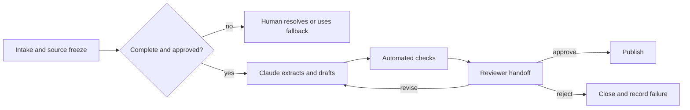

# 先设计交接，再设计自动化

> 工作流不是在 Claude 做完时完成。它是在下一个人能够验证、决策、行动、恢复时才算完成。

> **【中文解读】** 本课讲工作流设计与人工交接（human handoff）。核心命题是：先设计交接，再设计自动化。课程依次讲：先画现状图、在辅助/自动化/重构/拒绝四种干预中做选择、把每一步写成契约、用后果与可逆性决定控制位置、选对工作流模式、把交接包当产品设计、让状态在故障中存活、按净值度量工作流。这条主线贯穿四条认证路线的情境题。

> **【拓展：从"自动化文本"到"自动化责任链"】** 多数团队的第一反应是把"生成文本"这一步自动化；本课的立场恰好相反：先搞清楚谁批准、谁审查、失败时谁恢复。Anthropic 的 Building effective agents 一文把 prompt chaining、routing、parallelization、orchestrator-workers、evaluator-optimizer 列为五种基本模式，本课把它们放回"责任链"的语境：模式选错，责任就会消失在系统之间。主课程 Phase 14 的 scope contracts、verification gates、multi-session handoff 是同一主题的工程化延伸。

> 🔗 **【前置】** 学本课前请先掌握：(1) 05 课（输出验证），验证的是论断不是自信；(2) 06 课（治理与授权），本课人工门的位置直接来自上一课的后果与可逆性判断；(3) Phase 14·12（Anthropic 工作流模式），五种模式的定义与适用条件。

**类型：** 学习
**语言：** Python
**前置条件：** 05 输出验证、06 治理与授权、Phase 14·12 工作流模式
**预计用时：** 约 105 分钟

## 学习目标

- 在选择 Claude 参与哪里之前，先画出当前的工作流。
- 对一个工作流步骤，决定是辅助、自动化、重构还是拒绝。
- 写清每个步骤的输入、输出、负责人、门禁、回退和服务预期。
- 构建能保留证据、不确定性与授权的人工交接包。
- 度量工作流价值时不忽略审查、失败和维护成本。

## 问题引入

> **【中文解读】** 案例是每周发布简报的自动化：前两期省时间，第三期混进已砍掉的功能，第四期漏掉未解决的安全问题；原来拼简报的工程师以为产品经理现在负责审查，产品经理以为自动发出的帖子早已获批。团队自动化了文本生产，却删掉了所有权模型。成功的工作流不是一串模型调用，而是一条带显式证据、可恢复状态的责任链。

一个产品团队把它每周的发布简报自动化了。Claude 读问题摘要、起草简报，并在每周五发到一个共享频道。

前两期简报省了时间。第三期混入了一个已从范围中移除的功能。第四期漏掉了一个未解决的安全问题。过去负责拼简报的工程师以为产品经理现在掌管审查；产品经理则以为那条自动发出的帖子早已获批。

团队自动化了文本生产，却删掉了所有权模型。没有来源截止（source cutoff）、审批门、升级路径，也没有数据不完整时的回退方案。

成功的工作流不是一串模型调用，而是一条责任链：证据显式、状态可恢复。

## 核心概念

### 先画现状图

> **【中文解读】** 加 Claude 之前先观察工作真实如何流动，包括那些不写进流程图的非正式检查。只记录理想流程是常见错误：老师傅顺手做的一个核对往往承载着关键知识，直接删掉它而不编码或指派，质量会下滑，而新工作流看起来却更"高效"。

在加入 Claude 之前，先观察工作实际如何流动：

- 什么事件触发它？
- 每个输入由谁提供？
- 哪些系统是权威记录源？
- 哪些地方依赖人的判断？
- 哪些例外情况最耗时间？
- 谁批准结果？
- 随后是什么下游行动？
- 失败如何被发现和恢复？

不要只记录理想流程。跟踪几个真实案例。非正式检查往往承载关键知识：如果不加编码或指派就直接删掉，质量会下滑，而新工作流看起来却很高效。

### 选的是干预方式，不只是工具

对每个步骤，在四种干预中做选择：

1. **辅助（Assist）：** Claude 提议、总结、抽取或起草，人仍然是操作者。
2. **自动化（Automate）：** 系统在政策约束下执行一个有边界、经过充分测试、可回退的步骤。
3. **重构（Redesign）：** 当前步骤是劣质输入或重复系统造成的浪费，应移除或重组。
4. **拒绝（Reject）：** 该步骤不该用 Claude，因为数据、后果、模糊性或政策使风险不可接受。

自动化并不总是最高的成熟度。如果分析师要花几小时调和两份互相冲突的表格，更快地生成调和文案并不能解决源头冲突。

### 把每一步定义为契约

每个步骤都应有：

```text
Trigger:
Owner:
Allowed inputs and sources:
Transformation:
Output schema:
Pass criteria:
Timeout or service expectation:
Escalation condition:
Fallback:
Next owner:
```

契约让你能独立测试一个步骤，也防止责任在系统之间消散。

以发布简报的抽取步骤为例：

```text
Trigger: Thursday 15:00 source freeze
Owner: release coordinator
Inputs: approved tracker view and signed security status
Output: structured candidate items with source IDs and status
Pass: all required teams represented; unresolved fields marked
Escalate: missing security status or conflicting launch state
Fallback: coordinator uses the manual template
Next owner: product manager validates inclusion decisions
```

### 用后果与可逆性决定控制位置

> **【中文解读】** 两个问题决定自动化的深度：结果错了后果多严重；伤害发生前动作能否低成本撤销。四象限给出演进方向，高后果加不可逆的象限永远保留授权人工决策门。

两个问题决定自动化的深度：

1. 如果结果是错的，后果有多严重？
2. 在伤害发生之前，这个动作能否低成本撤销？

| 后果 | 可逆 | 设计方向 |
|---|---|---|
| 低 | 是 | 可以采用带监控的有边界自动化 |
| 高 | 是 | 先生成或暂存，发布前强制审查 |
| 低 | 否 | 增加确认、审计，并收窄范围 |
| 高 | 否 | 保留授权人工决策门和强回退 |

一份存起来待审的草稿，和一条发给几千名客户的消息，是两回事。把行动授权当作一种单独的能力来管理。

### 选择匹配依赖关系的工作流模式

> **【中文解读】** 五种常见模式各有适用面。选型原则是"能表示这项工作的最简模式"：固定五段报告不需要开放式 agent，routing 必须有可观测的路由信号和对模糊案例的回退。

Claude 工作流常用少数几种模式：

- **提示链（Prompt chaining）：** 固定序列，每个阶段都可检查。
- **路由（Routing）：** 先分类，再送往专用路径。
- **并行化（Parallelization）：** 跑独立分析，再调和结果。
- **编排者-工作者（Orchestrator-workers）：** 协调者把可变工作拆成子任务再综合。
- **评估者-优化器（Evaluator-optimizer）：** 生成、按标准评审、修订，直到过门或到达上限。

优先选择能表示这项工作的最简模式。固定的五段式报告不需要开放式 agent。路由式工作流需要可观测的路由信号，并为模糊案例准备回退。



### 交接包是产品

> 💡 **【类比】** 交接包像医院的交班单。护士换班时不念整段监护仪流水账，而是按固定格式交出：现在管的是谁、还有什么没做完、哪条医嘱待执行、出状况先找谁。关键差别在于：交班单的接收者必须清楚"哪些事仍然归我"，"请过目"不算交接。

交接应把"重新摸索"降到最低。给下一位负责人：

- 需要做的决定和截止时间。
- 工作流的范围与版本。
- 来源 ID 与新鲜度状态。
- 候选输出。
- 通过和未通过的检查。
- 已知的不确定性与冲突。
- 已采取的行动。
- 可选项：批准、修订、驳回、升级。
- 回退与恢复指引。

不要把关键警告埋在长转录的末尾。围绕"要做的决定"来组织交接包。

接收者必须知道哪些事仍然归自己负责。"请过目"是不完整的；"确认 R-14 和 R-19 两项获得对外发布授权，其余检查已全部通过"才可执行。

### 让状态在故障中存活

> **【中文解读】** 长工作流一定会失败。对策是在有意义的边界上打检查点（checkpoint），让重试尽量幂等（idempotent），并在上线前定义好人工回退。注意不对称性：重试草稿生成通常安全；没有幂等键就重试发送或资金动作，可能让伤害翻倍。"没有现任员工能执行的回退"只是虚构的韧性。

长工作流会失败。API 超时、连接器返回部分数据、审查者错过截止时间、输入在生成之后又发生变化。

在有意义的边界打检查点：

- 来源快照被接受。
- 抽取通过校验。
- 草稿版本已产出。
- 审查发现已记录。
- 批准已记录。
- 对外行动已完成。

尽可能让重试幂等。重试草稿生成通常是安全的；没有幂等键就重试发送或资金动作，可能让伤害翻倍。

上线前先定义人工回退。没有现任员工能执行的回退，只是虚构的韧性。

### 度量工作流，不是演示

把价值和风险放在一起度量：

```text
net value = time saved
          - human review time
          - correction and incident cost
          - platform and model cost
          - maintenance cost
```

有用的运营度量包括：

- 端到端完成时间。
- 排队与审查时间。
- 首过接受率。
- 高严重度漏放率。
- 升级与回退率。
- 单案返工量。
- 每个被接受产出的成本。
- 来源新鲜度失败。
- 用户更正与申诉结果。

如果审查变得更难，更快的生成阶段未必缩短端到端时间。

### 按干系人沟通边界

高管需要期望价值、风险边界和就绪证据；操作者需要精确的输入、失败信号和回退步骤；审查者需要标准与授权；安全与政策负责人需要数据流、权限、保留期和事件控制。

不要把能力演示当成生产证据。要说清：测了什么、在哪些案例上测的、哪些环节仍由人负责、哪些现行为产品事实需要重新核实。

## 动手构建

> **【中文解读】** 构建环节把上面的原则落成五步文书：映射一个真实案例、按五个因子给候选干预打分、写未来状态契约、用稳定模板构建交接包、再以影子模式试点。核心输出是一份能通过校验器的工作流包，直接作为 29 课助理级毕业设计的运营与审查交接材料。

### 第 1 步：映射一个真实案例

画出带角色和系统的当前流程。标记：

- 等待时间。
- 返工循环。
- 判断点。
- 权威记录源查询。
- 对外行动。
- 已知例外。

问一问操作者：哪个非正式检查防住了最严重的错误。

### 第 2 步：给候选干预打分

对每个步骤按 1 到 5 打分：

| 因子 | 问题 |
|---|---|
| 重复度 | 同样的转换是否反复出现？ |
| 清晰度 | 通过标准能否写出来？ |
| 数据批准 | 输入是否受控获批？ |
| 可逆性 | 错误动作能否被拦下或撤销？ |
| 可检测性 | 失败是否在伤害前可见？ |

低分意味着应考虑辅助、重构或拒绝，而不是自动化。

### 第 3 步：写未来状态契约

定义每个步骤、负责人、门禁、检查点、回退和服务预期。把人工路径写明白。然后请一位操作者、一位审查者和一位政策负责人分别走一遍正常案例和一个例外案例。

### 第 4 步：构建交接包

使用稳定的模板：

```text
Decision required:
Deadline and owner:
Workflow and source versions:
Candidate result:
Evidence:
Checks passed:
Checks failed:
Uncertainty:
Actions available:
Fallback:
```

拒绝任何缺少必需阻塞项或来源版本的交接包。

### 第 5 步：以影子模式试点

让 Claude 在现有流程旁运行，但不允许它执行对外行动。对比结果和审查工作量。要包含例外案例，而不只是简单案例。只有门禁通过、事件负责人就绪后，才推进到小范围发布。

## 交互实验室

用审查阈值图调整后果、可逆性、模糊度和证据完整度。控制应当在到达不可逆状态之前，从有边界的自动化移动到强制审查。

```figure
07-human-review-threshold
```

## 练习实验室

运行交接评分器。从发布步骤中移除负责人、检查点、回退或审批，观察契约如何失败。然后清除未解决的审查检查，对比推荐的下一步动作。

## 交付产物

`outputs/workflow-handoff-packet.json` 是一份填好的发布简报工作流，包含步骤负责人、门禁、检查点、回退、服务预期，以及一份可执行的审查者交接包。

## 验证

在本地验证这个工作流：

```bash
cd certifications/claude/lessons/07-workflow-design-and-human-handoffs/code
python3 main.py
python3 -m unittest discover tests -v
```

校验器检查：每个步骤都有负责人、门禁、升级路径、回退和下一任负责人；不可逆的发布动作带人工审批；交接包写明未通过的检查和可做的决定。

## 毕业设计衔接

测验考察现状映射、重构、交接包内容、重试安全、所有权归属和影子模式就绪度。把通过校验的工作流包作为 29 课助理级毕业设计的运营与审查交接材料提交。

## 运行验证

> **【中文解读】** 考试决策模式是一张六步答题骨架：先画现状；先删流程浪费再谈自动化；按依赖选最简模式；在高后果或不可逆边界保留人的授权；发结构化交接包；上线前定好检查点、回退、监控和所有权。八个常见陷阱里，"自动化了文本却删掉负责人"和"把演示当部署证据"是最高频的两个。

### 考试决策模式

对工作流类情境：

1. 画出当前的决定、证据、角色和例外路径。
2. 先移除流程浪费，再自动化。
3. 选择匹配依赖关系的最简模式。
4. 在高后果或不可逆边界保留人的授权。
5. 发出带证据和未通过检查的结构化交接包。
6. 上线前定义检查点、回退、监控和所有权。

### 常见陷阱

- **自动化了文本，删掉了负责人：** 没人知道谁批准。
- **把演示当部署证据：** 正常样例掩盖了例外和运维。
- **给固定流程上开放式 agent：** 复杂度增加却没带来价值。
- **并行化有依赖的工作：** 证据还没核实就开始综合。
- **人在回路只是口号：** 没有审查包，也没有驳回权。
- **没有来源截止：** 输出还在审批中，输入已经变了。
- **什么都重试：** 不可逆动作可能执行两次。
- **只看省下的时间：** 审查、纠正、失败和维护成本全都消失。

### 练习

1. 映射一个周期性工作流，并找出一个非正式的质量检查。
2. 把每个步骤分类为辅助、自动化、重构或拒绝。
3. 为价值最高的候选步骤写一份步骤契约。
4. 为只有五分钟的审查者设计一份交接包。
5. 做一次桌面失败演练：批准之后、发布之前，来源发生了变化。
6. 定义五个能揭示工作流是否创造净价值的度量。

## 关键术语

- **现状图（current-state map）：** 工作今天实际如何流动的表示。
- **步骤契约（step contract）：** 一个工作流步骤的触发条件、负责人、输入、转换、输出、门禁、升级、回退和下一任负责人。
- **交接包（handoff packet）：** 为下一位负责人准备的结构化状态与证据。
- **检查点（checkpoint）：** 一个已验证阶段之后的持久恢复点。
- **幂等性（idempotency）：** 重复执行一个操作不会复制其效果的性质。
- **影子模式（shadow mode）：** 运行新工作流，但不让它控制线上结果。
- **回退（fallback）：** 当自动化路径不安全或不可用时，经过测试的替代路径。
- **来源截止（source cutoff）：** 固定"输出代表哪些输入"的版本边界。

## 延伸阅读

- [Anthropic: Building effective agents](https://www.anthropic.com/research/building-effective-agents) — 官方构建有效 agent 文章，五种工作流模式的出处
- [Anthropic: Define success criteria and build evaluations](https://platform.claude.com/docs/en/test-and-evaluate/develop-tests) — 官方对定义成功标准并构建评估的指引
- [AI Engineering from Scratch: Scope Contracts](../../../../../phases/14-agent-engineering/36-scope-contracts/) — 主课程的范围契约课
- [AI Engineering from Scratch: Verification Gates](../../../../../phases/14-agent-engineering/38-verification-gates/) — 主课程的验证门课
- [AI Engineering from Scratch: Multi-Session Handoff](../../../../../phases/14-agent-engineering/40-multi-session-handoff/) — 主课程的多会话交接课
- [AI Engineering from Scratch: Propose Then Commit](../../../../../phases/15-autonomous-systems/15-propose-then-commit/) — 主课程的"先提议后提交"课

Claude 的产品功能、连接器行为、模型能力、限制和成本都可能变化。这些来源核实于 2026-08-08。把工作流从影子模式推进到生产之前，请重新核实现行官方文档与组织控制。
