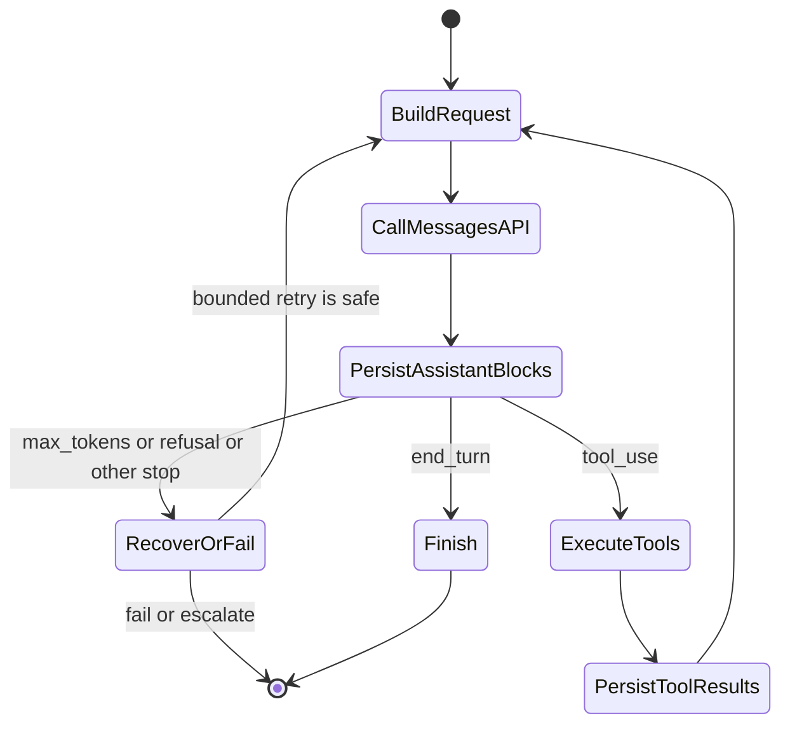

# Messages API 是一台状态机

> API 不记得你的对话。你的应用才记得，而一个放错位置的内容块就能打断整个循环。

> **【中文解读】** 本课是开发者路线的协议基石：Messages API 是无状态的，会话状态由你的应用持有。课程把一次请求建模为显式的应用状态迁移：请求进、类型化内容块出、按 stop_reason 分支、工具结果回填、再进入下一轮。框架会替你维护 messages 数组，但认证要求你在便利层之下推理：亲手把裸状态机搭一遍，之后每个 SDK、agent 框架和托管运行时都更好调试。

> **【拓展：无状态 API 的设计哲学】** Messages API 是"纯函数式"的对话接口：请求自带全部上下文，服务端不保存隐藏的聊天对象，把状态管理的责任交回应用层。考试反复考三件事：tool_result 必须连同原始 tool_use 一起回传完整对话序列；stop_reason 是控制信号而不是装饰；SDK 的便利层下面就是这台状态机。后续的 09 课（结构化输出与防御性解析）和 10 课（工具循环与受控委托）都直接建立在本课的迁移图上。

> 🔗 **【前置】** 学本课前请先掌握：(1) 02 课（模型选择与 token 经济），理解 max_tokens 与上下文预算；(2) 03 课（提示与任务分解），把请求当成可测试的契约；(3) 04 课（上下文类型），messages 数组就是你的上下文预算账本。

**类型：** 动手构建
**语言：** Python
**前置条件：** 02 模型选择与 token 经济、03 提示与任务分解、04 上下文类型
**预计用时：** 约 120 分钟

## 学习目标

- 把一次 Claude 请求建模为显式的应用状态迁移。
- 把 SDK 与裸 REST 的选择，与同步、流式、批处理交付分开独立决定。
- 用显式的资产边界构造图像与文档内容块。
- 保留有类型的响应块，并按 `stop_reason` 分支。
- 落实会话、重试、超时、保留期和上下文预算的卫生规范。
- 不依赖线上 API 密钥，测试完整生命周期。

## 教会你协议的那个失败

> **【中文解读】** 这段失败是全课的钩子：工程师只把工具结果放进一个全新请求，没有回传包含原始 tool_use 的 assistant 消息，于是第二次请求失败。原因一点都不神秘：Messages API 是无状态的，tool_result 不是独立的事实，它按 ID 回应一次特定的工具请求，而且必须在由你的代码持有的对话序列里。

一位工程师发出这样的序列：

1. 用户问："订单 A-17 在哪里？"
2. Claude 返回一个 ID 为 `toolu_01` 的 `tool_use` 块。
3. 应用执行 `lookup_order`。
4. 应用在一个全新请求中只发送了工具结果。

第二次请求失败，或者 Claude 的回答表现得像它从未请求过工具。

没有任何神秘的事情发生。Messages API 是无状态的。客户端没有回传包含原始 `tool_use` 块的那条 assistant 消息。`tool_result` 不是一个独立存在的事实：它在一个由你的代码持有的对话序列里，按 ID 回应一次特定的工具请求。

框架替你维护数组，所以这种错误很容易被漏掉。认证期望你在这一便利层之下推理。把裸状态机亲手搭一次，之后每个 SDK、agent 框架和托管运行时都变得更好调试。

## 一次请求，一次状态迁移

> 💡 **【类比】** Messages API 像自动寄存柜而不是酒店前台。酒店前台（有状态服务）记得你是谁、住几天、行李在哪；寄存柜（无状态 API）每次凭你手里的凭条（messages 数组）完整恢复"你是谁"，柜子本身不留记忆。所以凭条上少贴一张单据（漏掉 tool_use 块），柜门就打不开；而每张凭条都要从头复印全部内容（上下文随请求重发），这就是为什么要做上下文预算。

一个请求提供模型、系统指令、messages、token 控制和可选能力。一个响应提供内容块、用量元数据和生成停止的原因。接下来发生什么，由你的应用决定。

```json
{
  "model": "<current-model-id>",
  "max_tokens": 800,
  "system": "Answer from verified order data only.",
  "messages": [
    {
      "role": "user",
      "content": "Where is order A-17?"
    }
  ]
}
```

具体的模型标识符和可选请求字段会变化。把它们当作配置项：在平台允许的地方锁定明确的版本，并在现行 [Models overview](https://platform.claude.com/docs/en/about-claude/models/overview) 中核对。持久的契约是：你的客户端提交上下文，收到一个有类型的响应。



这张图比背一个 SDK 方法有用。每条箭头都是一项应用职责：你可以记录它、测试它、重试它或拒绝它。

## 选择两个相互独立的访问模式

> **【中文解读】** 客户端库（SDK 还是裸 REST）和补全模式（同步、流式、批处理）回答的是不同的问题，要独立选择。SDK 省掉的是协议管道，不是应用生命周期；裸 REST 只在额外控制配得上额外测试负担时才合适。异步 SDK 客户端不是 Message Batches：前者只是并发等待 HTTP，后者是服务端异步工作负载。

客户端库和补全模式回答的是不同的问题，要独立选择。

| 客户端 | 适合场景 | 你仍然要负责 |
|---|---|---|
| 官方 SDK | 语言受支持，想要类型化请求响应模型、类型化错误、头管理、重试默认值、分页和流累积助手 | 应用状态、`stop_reason` 策略、重试安全、工具授权、日志和最终校验 |
| 裸 REST | 运行时没有受支持的 SDK、受限环境禁用该依赖，或需要自定义 HTTP 传输或协议级 fixture | 认证与版本头、JSON 类型、SSE 分帧、超时、重试、错误映射、前向兼容和连接清理 |

在受支持的生产语言里，SDK 是更安全的默认选择，因为它省掉的是协议管道，而不是因为它接管了应用生命周期。裸 REST 只在它带来的额外控制配得上额外测试负担时才合适。[Python SDK guide](https://platform.claude.com/docs/en/cli-sdks-libraries/sdks/python) 记录了同步与异步客户端、类型化模型、流式助手、重试默认值和原始响应访问；[API overview](https://platform.claude.com/docs/en/api/overview) 是直接的 HTTP 契约。

然后选择结果如何送达（单个或多个）：

| 补全模式 | 最佳适配 | 完成证据 | 不适合 |
|---|---|---|---|
| 同步 Message | 需要完整响应才能继续的单个交互请求 | 一条已解析、已处理 `stop_reason` 的 `Message` | 渐进渲染或大型离线队列 |
| 流式 Message | 部分展示或首 token 时间重要的单个交互或长响应 | 累积内容加终止 `message_stop` 和最终消息元数据 | 基于部分增量的不可逆工作 |
| Message Batch | 许多可以稍后完成的独立请求 | 异步处理后按稳定 `custom_id` 逐项对账的结果 | 会话式工具循环或逐 token 用户反馈 |

异步 SDK 客户端不是 Message Batches。它只是让你的进程并发等待普通的 HTTP 工作。Message Batch 是服务端异步工作负载：输入和结果被存储、逐项给出结果、稍后对账。现行 [batch processing guide](https://platform.claude.com/docs/en/build-with-claude/batch-processing) 还指出结果不按提交顺序返回，所以身份来自 `custom_id`。

## 内容是有类型的块序列

> **【中文解读】** 不要把响应化简成 `response.content[0].text`。防御性代码按 `type` 分支：显式处理已支持的块，把未知块记录下来，而不是默默当成文本。假设每个块都有 `text` 属性的解析器，会把一个合法的工具请求变成空答案。

不要把响应化简成 `response.content[0].text`。Claude 可以在一条消息里返回多个块：

- `text` 包含面向用户或中间过程的语言。
- `tool_use` 指名工具、给出结构化输入，并携带唯一的请求 ID。
- `thinking` 在该功能启用时可携带扩展推理数据。
- 随着功能演进，提供方还可能引入更多块类型。

防御性代码按 `type` 分支：显式处理已支持的块，把未知块记录下来，而不是默默当成文本。这在版本变更时很重要。假设每个块都有 `text` 属性的解析器，会把一个合法的工具请求变成空答案。

一次工具往返有严格的顺序：

```json
[
  {
    "role": "user",
    "content": "Where is order A-17?"
  },
  {
    "role": "assistant",
    "content": [
      {
        "type": "tool_use",
        "id": "toolu_01",
        "name": "lookup_order",
        "input": {"id": "A-17"}
      }
    ]
  },
  {
    "role": "user",
    "content": [
      {
        "type": "tool_result",
        "tool_use_id": "toolu_01",
        "content": "{\"status\":\"ready\"}"
      }
    ]
  }
]
```

assistant 的请求在前，user 角色的结果在后。`tool_use_id` 与原始 ID 精确匹配。多个工具调用一起到来时，为每一个返回结果，并保持它们的对应关系。

## 停止原因是控制信号

> **【中文解读】** 文本会说"我现在就去查"，而响应实际是因为工具请求而停的；文本看起来完整，而生成其实是撞到 token 上限停的。所以要按协议信号分支，不要按文本语气分支。铁律：绝不写 `while stop_reason != "end_turn"`，要写穷举分支，外加最大轮数、墙钟截止时间和每工具预算。

文本可能说"我现在就去查"，而响应实际是因为工具而停的；文本可能看起来完整，而生成停在了 token 上限。按协议信号分支。

| 信号 | 应用侧解读 | 安全响应 |
|---|---|---|
| `end_turn` | Claude 完成了本轮 | 验证并呈现答案 |
| `tool_use` | 请求了一个或多个客户端工具 | 验证、授权、执行、追加结果、继续 |
| `max_tokens` | 配置的输出预算结束了生成 | 视为可能不完整；只在有计划时重试 |
| `stop_sequence` | 一个配置的序列结束了生成 | 确认该边界对你的契约有效 |
| `pause_turn` | 服务端操作可能需要延续 | 按现行功能专属延续契约处理 |
| `refusal` | 模型拒绝了请求 | 保留拒答并走批准的回退或升级 |
| `model_context_window_exceeded` | 生成填满了模型上下文窗口 | 视为截断并重做上下文预算 |

产品注记（核实于 2026-08-08）：受支持的停止原因及其延续要求可能变化。现行权威来源是 [Handling stop reasons](https://platform.claude.com/docs/en/build-with-claude/handling-stop-reasons)。代码对未知值应失效关闭（fail closed），并捕获足以诊断它的元数据。

绝不要写 `while stop_reason != "end_turn"`。那会把每个陌生状态都变成又一次请求，造成失控循环。要写穷举分支，并配最大轮数、墙钟截止时间和每工具预算。

## 客户端拥有会话状态

> **【中文解读】** 服务端不为 Messages API 保留隐藏的聊天对象，每次调用收到的都是你选择发送的上下文。这给了你控制权，也让会话卫生变成你的活：用户隔离、系统分离、规范存储、上下文预算、保留政策、幂等性，六条边界缺一不可。压缩长会话时，丢掉"不要发送"这句话的流利摘要，在运营上就是错的。

服务端不为 Messages API 保留隐藏的聊天对象。每次调用收到的是你选择发送的上下文。这给了你控制权，但也让会话卫生成了你的工作。

维持这些边界：

1. **用户隔离。** 绝不把一个租户的 message 数组复用给另一个租户。
2. **系统分离。** 把可信指令放在不可信文档内容之外。
3. **规范存储。** 持久化类型化的块，而不是无法重建工具 ID 的拍平转录。
4. **上下文预算。** 度量输入增长，在上限之前压缩，同时保住事实与未了义务。
5. **保留政策。** 只存产品所需的内容，日志前对密钥和敏感字段脱敏。
6. **幂等性。** 没有稳定的操作键，网络重试不得重复一次付款、邮件或部署。

如果你压缩一段长会话，请保住活跃的工具请求、用户约束、已验证事实、未决问题、批准状态和来源引用。一份丢掉了"不要发送"的流利摘要，在运营上就是错的。

## 多模态请求是有类型的资产传输

文本、图像和文档放在同一个有序 content 数组里。先陈述任务再给资产，使用与媒体匹配的块类型，并保持来源显式。

```json
{
  "model": "<current-model-id>",
  "max_tokens": 400,
  "messages": [
    {
      "role": "user",
      "content": [
        {
          "type": "text",
          "text": "Compare the chart with the approved policy document."
        },
        {
          "type": "image",
          "source": {
            "type": "base64",
            "media_type": "image/png",
            "data": "<base64-image-bytes>"
          }
        },
        {
          "type": "document",
          "source": {
            "type": "file",
            "file_id": "<application-owned-file-id>"
          }
        }
      ]
    }
  ]
}
```

图像可以使用 `base64`、`url` 或 Files API 的 `file` 来源。PDF 可以在 `document` 块内使用 URL、base64 或 Files API 来源。块顺序是提示词的一部分：把指令和信任上下文放在它所管理的资产附近。请在 [Vision](https://platform.claude.com/docs/en/build-with-claude/vision) 和 [PDF support](https://platform.claude.com/docs/en/build-with-claude/pdf-support) 核对现行的媒体与模型约束。

Files API 改变的是复用与保留方式，而不是内容块的含义。上传一次，收到一个不透明的 `file_id`，之后在 Messages 请求里引用它，而不是重发字节。它适合跨大量请求复用的政策 PDF 或图像。

产品注记（核实于 2026-08-09）：[Files API](https://platform.claude.com/docs/en/build-with-claude/files) 处于 beta，Message 引用文件时当前使用 `files-api-2025-04-14` beta 头。文件按工作区限定作用域、上传后不可变、一直保留直到删除；该工作区内的任何 API 密钥都可以引用它们。把现行头、平台可用性、限额和下载规则当作易变内容，实现前先查指南。

| 来源 | 过界的数据 | 复用与保留责任 |
|---|---|---|
| 内联 base64 | 编码字节随每个请求过界 | 不要记录载荷；显式限制请求保留与大小 |
| URL | 提供方从远端来源取资产 | 授权来源、避免带密钥的 URL、计入来源方日志与可用性 |
| Files API `file_id` | 用标识符引用存在 API 工作区里的字节 | 允许列表应用自有的 ID、记录归属与用途、强制工作区隔离、到期即删 |

一个 `file_id` 并不能证明当前租户有权使用这个文件。要把它绑定到一条应用记录上：租户、工作区、媒体类型、敏感度、内容哈希、上传时间和删除截止。绝不接受任意的模型或用户提供的 ID 并直接转发。原始图像字节、PDF 文本、签名 URL 和不透明文件 ID 都不要进常规 trace；改记内容哈希和策略决定。

## 流式改变交付方式，不改变语义

> **【中文解读】** 流式让用户提前看到输出，但不免除组装并校验最终响应的责任。不要从部分流触发不可逆工作；工具输入先缓冲到块完整再解析授权；掉线后跟踪是否收到完整终止事件，变更型操作先查幂等记录。

流式让用户在完整消息到达之前就能看到输出。它并不免除组装并校验最终响应的责任。

典型的事件处理长这个样子：

```python
text_parts = []

for event in stream:
    if event.type == "content_block_delta" and event.delta.type == "text_delta":
        text_parts.append(event.delta.text)
    elif event.type == "message_delta":
        final_stop_reason = event.delta.stop_reason
    elif event.type == "message_stop":
        complete = True
```

如果体验上有收益，可以渲染临时文本，但不要从一条部分流触发不可逆的工作。工具输入也可能增量到达：先缓冲到块完整，解析一次，校验，然后授权。

掉线会制造歧义。跟踪是否收到了完整的终止事件；没有就标记这次尝试未完成。只读请求在安全时可以重试；变更型操作在做任何事之前，先查幂等记录。

现行事件类型与 SDK 助手见 [Streaming Messages](https://platform.claude.com/docs/en/build-with-claude/streaming)。

## 批处理、缓存与思考解决不同的问题

> **【中文解读】** 这三个功能经常被混为一谈，因为它们都会改变成本或延迟，但目的各不相同。考试逻辑一句话：按工作负载选机制。离线独立任务指向批处理；重复的稳定前缀指向缓存；有实测质量收益的困难推理指向思考；快速出 token 指向流式。

这些功能经常被混在一起，因为它们各自都会改变成本或延迟。它们的目的并不相同。

**Message Batches** 异步处理大量独立请求，用即时响应延迟换吞吐和更优的批价。适合离线分类、抽取、评估或迁移；不要用于"现在就要下一个答案"的交互式工具循环。用你的自定义 ID 跟踪每个请求，并处理部分批次失败。见 [Batch processing](https://platform.claude.com/docs/en/build-with-claude/batch-processing)。

**提示缓存（prompt caching）** 复用稳定的提示前缀。把持久系统指令、工具定义和共享参考资料放在易变的用户内容之前。缓存前缀内改动一个字节都可能让下游复用失效。缓存命中改善首 token 时间和输入成本，但不会扩大上下文窗口，也不会把过期事实变对。见 [Prompt caching](https://platform.claude.com/docs/en/build-with-claude/prompt-caching)。

**扩展思考（extended thinking）** 为受益的任务分配推理工作量。它消耗预算、改变响应块，并且跨工具轮保留 thinking 块有功能专属规则。不要编辑或伪造带签名的 thinking 内容；不要为简单抽取反射式开启。请在评估集上对比质量、延迟和成本。见 [Extended thinking](https://platform.claude.com/docs/en/build-with-claude/extended-thinking)。

考试逻辑很简单：按工作负载选机制。离线独立任务指向批处理；重复的稳定前缀指向缓存；有实测质量收益的困难推理指向思考；快速出 token 指向流式。

## 离线构建生命周期与资产边界

`code/main.py` 里的可运行模拟器接受脚本化的提供方响应，把隐藏的客户端工作变得可见：

- 存储每一个 assistant 内容块。
- 执行被请求的工具。
- 返回匹配的 `tool_result` 块。
- 重发完整状态。
- 拒绝未知的停止原因。
- 拦停失控循环。
- 只在 `message_stop` 之后收集模拟流。
- SDK 与 REST 的选择独立于同步、流式或批处理。
- 构建并校验图像与可复用文件的内容块。
- 拒绝应用自有允许列表之外的文件 ID。
- 产出带哈希的边界台账，不含资产字节或文件 ID。

运行：

```bash
cd certifications/claude/lessons/08-messages-api-and-application-lifecycle/code
python3 main.py
python3 -m unittest discover tests -v
```

本课代码不导入 SDK、不读凭证、不上传文件、不抓 URL、不调用模型。`multimodal_lab_fixture()` 用一张单像素合成图像和一个离线占位文件 ID。在私有实验里，把 `ScriptedTransport.create()` 换成真实的 SDK 调用，并只在完成经过认证的上传之后再替换占位符。状态机、允许列表和台账保持不变。

## 交互实验室

用生命周期图逐步走一遍：用户输入、assistant 内容块、工具执行、相关联的结果、终止停止原因。故意打乱顺序，看哪个状态迁移变得非法。

```figure
08-messages-lifecycle
```

## 练习实验室

运行脚本化生命周期，然后移除 assistant 的 `tool_use` 消息、改动关联 ID，或让一条流在没有 `message_stop` 的情况下结束。接着把可复用文件 ID 换成允许列表之外的一个、破坏图像 base64，或让访问选择器同时要批处理和渐进式 token。每种失败都应映射到一个有名字的协议或数据边界错误，而不是"再改改提示词"。

## 交付产物

`outputs/messages-lifecycle-transcript.json` 仍是完整的、不依赖提供方的工具往返。`outputs/multimodal-request-fixture.json` 增加了四条访问决策、一个图像与文档混合请求、一份应用自有的文件允许列表，以及一份脱敏的资产边界台账。运行 `python3 main.py` 会打印这两个产物；单元测试套件在无网络的情况下校验每个检入产物。

## 验证

```bash
cd certifications/claude/lessons/08-messages-api-and-application-lifecycle/code
python3 main.py
python3 -m unittest discover tests -v
```

## 毕业设计衔接

测验在陌生情境下考察同一批协议决策。把验证过的转录作为生命周期证据，用于开发者毕业设计 30 和架构师毕业设计 31、32。

## 超越单轮的应用生命周期

一个生产级 Claude 应用的状态远不止"请求"和"响应"两个。

```mermaid
flowchart LR
    Intake[Validate intake] --> Authorize[Authorize capabilities]
    Authorize --> Invoke[Invoke model]
    Invoke --> Parse[Parse typed blocks]
    Parse --> Act[Execute approved tools]
    Act --> Verify[Verify result and final state]
    Verify --> Deliver[Deliver or escalate]
    Deliver --> Observe[Record trace and metrics]
    Observe --> Evaluate[Run regression evals]
    Evaluate --> Improve[Version prompt, model, tools, or code]
    Improve --> Intake
```



模型错误只是一类失败。还有传输超时、限流、畸形的应用状态、schema 不匹配、授权拒绝、工具失败、过期缓存、用户取消和部署回退。给它们分别打标签：能救超时的重试，可能让授权失败变得更糟。

在每条 trace 里给系统指令、模型选择、工具目录、输出 schema 和应用代码标版本。没有这些标识符，你就无法复现一次回退，也无法公平比较两次评估运行。

## 考试决策规则

> **【中文解读】** 这十二条规则就是本课的考点清单：丢消息先怀疑客户端状态；工具结果被拒先查角色顺序和 tool-use ID；输出像被截断先看 stop_reason 和用量；要渐进展示选流式；独立离线任务选批处理；SDK 满足传输就用、生命周期策略留在应用代码；裸 REST 要预算显式测试；资产重复就对比内联与 Files API；file_id 未绑定租户就拒绝；长前缀重复就评估缓存；重试可能重复副作用就先幂等；新 stop_reason 就失效关闭。

- 如果情境中早先的消息丢了，先怀疑客户端持有的状态，再怀疑模型记忆。
- 如果工具结果被拒绝，检查角色顺序和匹配的 tool-use ID。
- 如果输出看起来被截断，先看 `stop_reason` 和用量，再改提示词。
- 如果用户需要即时渐进显示，选流式，不选批处理。
- 如果成千上万个独立任务可以稍后完成，选 Message Batches。
- 如果受支持的 SDK 能满足传输需求，优先用它的类型化模型与助手；生命周期策略留在应用代码里。
- 如果受限运行时需要裸 REST，就为头、错误、SSE、重试和未知字段预算显式测试。
- 如果一项资产反复出现，对比内联传输与 Files API 复用外加显式删除政策。
- 如果 `file_id` 没有绑定到已认证租户和工作区，在请求前拒绝它。
- 如果长共享前缀反复出现，评估提示缓存。
- 如果重试可能重复一个副作用，先要求幂等或对账。
- 如果出现新的停止原因，失效关闭，并对照现行文档更新。

## 练习

1. 加一个包含两个 `tool_use` 块的脚本化响应。断言两个结果带着正确的 ID 出现在同一条后续 user 消息里。
2. 为 `max_tokens` 加显式处理。返回有类型的"不完整"结果，而不是把部分文本当最终答案展示。
3. 模拟一条在 `message_stop` 之前断开的流。记录一次未完成尝试，并证明没有不可逆动作运行。
4. 给 trace 加租户和提示词版本元数据，但不存原始用户消息。
5. 用 URL 来源的图像扩展多模态 fixture。不发网络请求，记录它的来源、授权、保留和失败边界。

## 延伸阅读

- [Messages API reference](https://platform.claude.com/docs/en/api/messages) — Messages API 参考
- [Messages examples](https://platform.claude.com/docs/en/api/messages-examples) — Messages 官方示例
- [Python SDK](https://platform.claude.com/docs/en/cli-sdks-libraries/sdks/python) — Python SDK 指南
- [Vision](https://platform.claude.com/docs/en/build-with-claude/vision) — 图像输入（Vision）支持
- [PDF support](https://platform.claude.com/docs/en/build-with-claude/pdf-support) — PDF 支持说明
- [Files API](https://platform.claude.com/docs/en/build-with-claude/files) — Files API 指南
- [Handling stop reasons](https://platform.claude.com/docs/en/build-with-claude/handling-stop-reasons) — 停止原因处理的权威来源
- [Streaming Messages](https://platform.claude.com/docs/en/build-with-claude/streaming) — 流式 Messages 的事件类型与助手
- [Batch processing](https://platform.claude.com/docs/en/build-with-claude/batch-processing) — 批处理指南
- [Prompt caching](https://platform.claude.com/docs/en/build-with-claude/prompt-caching) — 提示缓存指南
- [Extended thinking](https://platform.claude.com/docs/en/build-with-claude/extended-thinking) — 扩展思考指南
