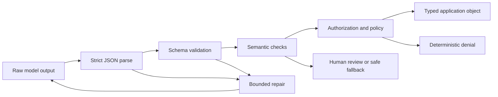

# Structured Output Is an Untrusted Contract | 结构化输出是不受信任的契约

> Valid JSON is not a valid business decision. Parse the bytes, validate the shape, verify the meaning, then permit the action.

> **【中文解读】** 本课把"结构化输出（structured output）"从格式问题升级为信任问题：能解析的 JSON 不等于能执行的决策。一个语法合法、字段齐全的对象仍可能数值越界（`priority: 9`）、语义虚构（引用不存在的发票）、越权提议（`"approved": true`）。课程给出防御性解析（defensive parsing）的完整工程做法——四道门（语法、形状、语义、授权）、严格解析不做乐观清洗、带预算的有界修复、流式缓冲、schema 版本化迁移。考试与实战的共同考点：每类失败必须归到唯一的责任门。

> 🔗 **【前置】** 学本课前请先掌握：(1) 05 课《验证的是论断，不是自信》——区分"模型说得自信"与"论断被验证"；(2) 08 课《Messages API 是一台状态机》——理解响应生命周期与内容块，本课的流式解析建立在它之上。

**Type:** Build | **类型:** 动手构建
**Languages:** Python | **语言:** Python
**Prerequisites:** [Validate the Claim, Not the Confidence](../../05-output-evaluation-and-validation/), [The Messages API Is a State Machine](../../08-messages-api-and-application-lifecycle/) | **前置知识:** 05 验证的是论断，不是自信；08 Messages API 是一台状态机
**Time:** ~95 minutes | **时间:** 约 95 分钟

## Learning Objectives | 学习目标

- Distinguish JSON syntax, schema validity, semantic validity, and authorization
  中文翻译：区分 JSON 语法、schema 有效性、语义有效性和授权。
- Design narrow schemas that make invalid states difficult to express
  中文翻译：设计让非法状态难以表达的窄 schema。
- Parse Claude output without unsafe cleanup or optimistic coercion
  中文翻译：解析 Claude 输出时不做不安全的清洗或乐观的类型转换。
- Repair invalid responses with bounded, evidence-rich retries
  中文翻译：用有界的、富含证据的重试修复非法响应。
- Evolve output contracts without silently breaking consumers
  中文翻译：演进输出契约而不悄悄破坏消费方。
- Test structured output at adversarial and streaming boundaries
  中文翻译：在对抗边界和流式边界测试结构化输出。

## The JSON That Should Have Failed | 本应失败的 JSON

> **【中文解读】** 开场案例是全课的锚点：模型返回 `priority: 9`——超出 1 到 5 的业务范围，但 JSON 解析成功、四个键齐全，应用照单全收，按最高紧急度路由、跳过人工审查、叫醒值班工程师。失败不在模型（它没违反 JSON），而在应用没有执行契约。由此引出的"四道门"分类法是全课和考试的判定框架：每个失败必须归到唯一的责任层，通过前一道门绝不意味着通过后一道。

Your support application requests a priority from 1 to 5. The response is:

```json
{
  "category": "billing",
  "priority": 9,
  "summary": "Customer reports a duplicate charge",
  "needs_human": false
}
```

The JSON parser succeeds. The object has every expected key. The application routes it as the highest emergency priority, skips human review, and pages an on-call engineer.

> JSON 解析器成功了。对象拥有每一个预期的键。应用把它按最高紧急度路由，跳过人工审查，并呼叫了值班工程师。

The model did not violate JSON. Your application failed to enforce the contract.

> 模型没有违反 JSON。是您的应用没有执行契约。

Structured output has four gates:

> 结构化输出有四道门：

1. **Syntax:** Is there exactly one parseable JSON value?
  中文翻译：语法——是否恰好存在一个可解析的 JSON 值？
2. **Shape:** Does the value match types, required fields, enums, bounds, and additional-property rules?
  中文翻译：形状——值是否匹配类型、必填字段、枚举、边界和附加属性规则？
3. **Semantics:** Do the fields agree with domain facts and each other?
  中文翻译：语义——字段是否与领域事实和彼此一致？
4. **Authority:** Is the requested downstream action permitted?
  中文翻译：授权——所请求的下游动作是否被允许？

Passing an earlier gate never implies passing a later one.

> 通过更早的门绝不意味着通过更晚的门。



## Prompting for JSON Is Not a Contract | "请输出 JSON"不是契约

> **【中文解读】** 提示词是概率手段，不是契约。平台的结构化输出（提供 JSON Schema 约束生成）能压低语法和形状失败率，但证明不了引用的订单存在、退款被授权、分类正确。关键立场有两条：schema 归应用所有，要像 API 一样做版本管理；即使启用了约束解码，应用侧校验也必须保留。

"Return JSON only" is an instruction. It improves probability. It does not make invalid output impossible, protect against schema drift, or validate the business meaning.

> "只返回 JSON"是一条指令。它改善概率。它不能让非法输出变为不可能，不能防御 schema 漂移，也不能验证业务含义。

When the current model and API support structured outputs, you can provide a JSON Schema and ask the platform to constrain generation. This reduces syntax and shape failures. It still does not prove that a cited order exists, that a refund is authorized, or that the category is correct.

> 当前的模型和 API 支持结构化输出时，你可以提供一份 JSON Schema 并让平台约束生成。这会减少语法和形状失败。它仍然证明不了所引用的订单存在、退款被授权、或分类正确。

Product note, verified 2026-08-09: structured-output availability, supported schema keywords, incompatibilities with other features, and model support can change. Check [Structured outputs](https://platform.claude.com/docs/en/build-with-claude/structured-outputs) before shipping. Keep application-side validation even when constrained decoding is enabled.

> 产品说明（2026-08-09 核实）：结构化输出的可用性、支持的 schema 关键字、与其他特性的不兼容、以及模型支持都可能变化。发布前请查阅 [Structured outputs](https://platform.claude.com/docs/en/build-with-claude/structured-outputs)。即使启用了约束解码，也要保留应用侧校验。

The application owns the schema. Version it like an API.

> 应用拥有 schema。要像管理 API 一样给它做版本管理。

```json
{
  "$id": "support-triage-v1",
  "type": "object",
  "required": ["category", "priority", "summary", "needs_human"],
  "additionalProperties": false,
  "properties": {
    "category": {
      "type": "string",
      "enum": ["billing", "bug", "account", "other"]
    },
    "priority": {
      "type": "integer",
      "minimum": 1,
      "maximum": 5
    },
    "summary": {
      "type": "string",
      "minLength": 1,
      "maxLength": 240
    },
    "needs_human": {
      "type": "boolean"
    }
  }
}
```

This schema earns its strictness. The consumer expects exactly four fields. An unexpected `debug_context` field could carry private text into logs. An integer bound prevents `9`. An enum prevents category spellings from fragmenting analytics.

> 这份 schema 的严格是挣来的。消费方预期恰好四个字段。一个意外的 `debug_context` 字段可能把隐私文本带进日志。整数边界挡住 `9`。枚举防止类别拼写碎片化，让分析不被拆散。

## Design Schemas From Consumer Decisions | 从消费方决策出发设计 Schema

Do not begin with "What can Claude generate?" Begin with "What must the next deterministic component decide?"

> 不要从"Claude 能生成什么"开始，而要从"下一个确定性组件必须决定什么"开始。

If the consumer chooses a queue, give it an enum. If it sorts priority, give it a bounded integer. If uncertainty changes routing, represent uncertainty explicitly instead of hoping it appears in prose.

> 如果消费方要选队列，就给它枚举；如果它要按优先级排序，就给它有界整数；如果不确定性会改变路由，就显式表示不确定性，而不是指望它出现在散文里。

Compare these contracts:

```json
{"answer": "Probably a billing issue. It seems urgent."}
```

```json
{
  "category": "billing",
  "priority": 4,
  "evidence_ids": ["invoice-483", "message-12"],
  "uncertainty": "medium",
  "needs_human": true
}
```

The second object makes routing and verification possible. It can still be wrong, but it is inspectable.

> 第二个对象让路由和验证成为可能。它仍然可能出错，但它是可检视的。

Use these design rules:

> 使用这些设计规则：

- Prefer enums over free-form labels.
  中文翻译：优先用枚举而不是自由文本标签。
- Use required fields only when every valid response can supply them.
  中文翻译：只有当每个合法响应都能提供该字段时才设为必填。
- Use `null` deliberately for "known absence," not as a general escape hatch.
  中文翻译：有意识地用 `null` 表示"已知缺席"，而不是当作万能逃生门。
- Reject additional properties unless consumers intentionally support extension.
  中文翻译：拒绝附加属性，除非消费方有意支持扩展。
- Bound strings and arrays to control cost and storage.
  中文翻译：给字符串和数组设边界，以控制成本和存储。
- Include evidence identifiers when facts must be traceable.
  中文翻译：当事实必须可追溯时，包含证据标识符。
- Encode actions as proposals, not proof of authorization.
  中文翻译：把动作编码为提案，而不是授权证明。
- Give schemas stable names and versions.
  中文翻译：给 schema 起稳定的名字和版本号。

Avoid one giant schema that represents unrelated modes through dozens of optional fields. Use a tagged union or separate endpoint contracts. Invalid states multiply when every field is optional.

> 避免用一个巨型 schema、靠几十个可选字段表示互不相关的模式。改用带标签的联合类型或分开的端点契约。当每个字段都可选时，非法状态会成倍增加。

## Parse Strictly | 严格解析

> **【中文解读】** 解析层的纪律只有一条：先严格解析、再校验，不做"友好"清洗。剥掉 markdown 围栏、把两段 JSON 拼成一段，都是在生成之后偷偷改契约——模型从未真正返回过那个值。静默类型转换同样被禁："4" 不是整数，1 不是布尔值；Python 里 `bool` 是 `int` 的子类这个陷阱必须显式拒绝。修复回路只应收到带字段路径的精确错误类别。

Optimistic cleanup hides failures. Consider this pattern:

> 乐观清洗掩盖失败。考虑这个模式：

```python
raw = raw.replace("```json", "").replace("```", "")
payload = json.loads(raw)
```

It appears friendly, but it changes the contract after generation. A response containing commentary, two JSON objects, or user-controlled fence text may be transformed into something the model never actually returned as a single value.

> 它看起来友好，但它在生成之后改动了契约。一个包含注释、两个 JSON 对象或用户可控围栏文本的响应，可能被变换成模型从未真正作为单一值返回过的东西。

Prefer strict parsing:

```python
payload = json.loads(raw)
validate_against_schema(payload)
```

If the contract says one JSON object, reject markdown fences and trailing prose. Record the failure class. A repair attempt can then receive precise errors.

> 如果契约说一个 JSON 对象，就拒绝 markdown 围栏和尾随散文。记录失败类别。修复尝试就能收到精确的错误。

Do not silently coerce:

> 不要静默转换：

- `"4"` is not an integer.
  中文翻译：`"4"` 不是整数。
- `1` is not a boolean.
  中文翻译：`1` 不是布尔值。
- `"false"` is not false.
  中文翻译：`"false"` 不等于 false。
- A comma-separated string is not an array.
  中文翻译：逗号分隔的字符串不是数组。
- A missing field is not equivalent to a safe default unless the schema declares that default and the application applies it deliberately.
  中文翻译：缺失的字段不等于安全默认值——除非 schema 声明了该默认值且应用有意识地应用它。

Python makes one case especially subtle: `bool` is a subclass of `int`. A naive `isinstance(True, int)` check accepts a boolean where an integer is required. The runnable validator rejects it explicitly.

> Python 让其中一种情况特别隐蔽：`bool` 是 `int` 的子类。一个天真的 `isinstance(True, int)` 检查会在需要整数的地方接受布尔值。可运行的校验器会显式拒绝它。

## Validate Meaning After Shape | 形状之后，验证语义

> **【中文解读】** schema 能证明 `invoice_id` 是字符串，证明不了发票存在或属于当前认证用户。语义校验用可信的应用数据（而不是模型输出）说话：发票是否对该用户可见、退款是否超过已核实金额。跨字段规则也在这一层——`uncertainty: high` 时 `needs_human: false` 可能非法。分工铁律：模型产出提案，确定性代码核实身份、所有权、金额边界、权限与状态转移。

A schema can prove that `invoice_id` is a string. It cannot prove that the invoice exists or belongs to the authenticated user.

> schema 能证明 `invoice_id` 是一个字符串。它不能证明发票存在，也不能证明它属于该认证用户。

Semantic checks use trusted application data:

> 语义校验使用可信的应用数据：

```python
if payload["invoice_id"] not in invoices_for(authenticated_user):
    raise SemanticError("invoice is not visible to this user")

if payload["refund_amount"] > verified_charge_amount:
    raise SemanticError("refund exceeds verified charge")
```

Cross-field rules matter too. `needs_human: false` may be invalid when `uncertainty: high`. A proposed `action: close_account` may require an approval token. A citation ID must resolve to a source that actually supports the claim.

> 跨字段规则同样重要。`uncertainty: high` 时 `needs_human: false` 可能非法。一个提议的 `action: close_account` 可能需要批准令牌。引用 ID 必须解析到一个真正支持该论断的来源。

The model may help produce a proposal. Deterministic code verifies identity, ownership, monetary bounds, permissions, and state transitions.

> 模型可以帮助产出提案。确定性代码核实身份、所有权、金额边界、权限和状态转移。

## Repair With a Budget | 带预算的修复

> **【中文解读】** 修复是有预算、有边界的选择题：语法或 schema 错误、低风险任务、且修正不发明缺失的证据，才值得修。修复回路五要素：原任务与不变的可信上下文、schema 或精确契约摘要、带字段路径的机器生成错误、次数硬上限、终局回退或升级。校验反馈是数据——要定界处理，不把原始异常、密钥、数据库记录粘进高信任指令区。证据缺失时修 JSON 是错误的操作：返回显式不完整状态或升级人工。

An invalid output does not always require failure. A syntax or schema error may be repairable if the task is low risk and the correction does not invent missing evidence.

> 非法输出不一定意味着失败。语法或 schema 错误可能是可修复的——前提是任务低风险，且修正不会发明缺失的证据。

A repair loop should include:

1. The original task and unchanged trusted context.
  中文翻译：原始任务与保持不变的可信上下文。
2. The schema or a precise contract summary.
  中文翻译：schema 或一份精确的契约摘要。
3. Machine-generated validation errors with field paths.
  中文翻译：带字段路径的机器生成校验错误。
4. A strict maximum number of attempts.
  中文翻译：严格的尝试次数上限。
5. A terminal fallback or escalation.
  中文翻译：终局回退或升级路径。

```text
Repair the previous output.
Return one JSON object and no surrounding text.
Validation errors:
- $.priority: expected integer from 1 through 5
- $.needs_human: required field is missing
Do not invent evidence that was not present in the source.
```

Do not paste raw exception dumps, secrets, database records, or arbitrary untrusted strings into a higher-trust instruction area. Validation feedback is data. Delimit it and keep trusted repair instructions separate.

> 不要把原始异常堆栈、密钥、数据库记录或任意不可信字符串粘贴进更高信任级别的指令区。校验反馈是数据。给它定界，并让可信的修复指令与它分开。

Two attempts often reveal whether the failure is stochastic formatting or a deeper contract mismatch. Infinite retries burn budget and can amplify a prompt-injection payload. Count attempts, tokens, latency, and repeated error fingerprints.

> 两次尝试通常足以判断失败是随机格式问题还是更深的契约不匹配。无限重试烧掉预算，还可能放大提示注入载荷。统计尝试次数、token、延迟和重复出现的错误指纹。

If the source lacks required evidence, repairing the JSON is the wrong operation. Return an explicit incomplete state or escalate.

> 如果来源缺少必需的证据，修 JSON 就是错误的操作。返回显式的不完整状态，或升级处理。

## Tool Inputs and Final Outputs Are Different Contracts | 工具输入与最终输出是不同的契约

> **【中文解读】** 四种结构化契约各管一段边界：工具输入 schema 帮模型构造调用，工具 handler 仍要校验并授权；来自远程服务的工具结果是不可信外部数据；面向消费方的最终输出有自己的 schema。不要把宽泛的内部工具 schema 复用为公共响应契约——内部字段可能泄露实现细节或密钥；也绝不能因为最终 JSON 里有 `"approved": true` 就执行动作，批准来自已认证的应用状态。`tool_choice` 三选项（`auto`/`any`/指定工具）是 CCAR-F 指南的公开考点。

Claude tool use also supplies structured input, but it serves a different boundary.

> Claude 工具调用也提供结构化输入，但它服务的是另一段边界。

- A tool input schema helps the model construct a call.
  中文翻译：工具输入 schema 帮助模型构造一次调用。
- The tool handler still validates values and authorizes the caller.
  中文翻译：工具 handler 仍然要校验值并为调用方授权。
- A tool result is untrusted external data when it comes from a remote service.
  中文翻译：来自远程服务的工具结果是不可信的外部数据。
- The final application output has its own consumer-facing schema.
  中文翻译：应用的最终输出有自己面向消费方的 schema。

Do not reuse a broad internal tool schema as a public response contract. Internal fields may expose implementation details or secrets. Map verified tool results into a minimal final object.

> 不要把宽泛的内部工具 schema 复用为公共响应契约。内部字段可能暴露实现细节或密钥。把已核实的工具结果映射进一个最小的最终对象。

Similarly, never execute an action because the final JSON contains `"approved": true`. Approval comes from authenticated application state, not model output.

> 同样，绝不要因为最终 JSON 里有 `"approved": true` 就执行动作。批准来自已认证的应用状态，而不是模型输出。

When tool use is the structured-output mechanism, know the three public
`tool_choice` decisions used by the CCAR-F guide:

> 当工具调用作为结构化输出机制时，记住 CCAR-F 指南使用的三个公开 `tool_choice` 决策：

| Choice | Model behavior | Use when |
|---|---|---|
| `auto` | The model may call a tool or return conversational text | Either path is valid |
| `any` | The model must call one of the supplied tools | A typed tool result is required but several schemas are valid |
| `{"type":"tool","name":"extract_metadata"}` | The named tool must be selected | One known extraction must happen before later work |

For a final machine-readable response, prefer the current native structured
output surface when it supports the required schema and feature combination.
Use a tool schema when the workflow is genuinely selecting or invoking a tool.
In both cases, semantic checks and authorization remain application work.

> 对于最终机器可读响应：当平台的结构化输出能力支持所需 schema 和特性组合时优先用它；当工作流确实是在选择或调用工具时用工具 schema。两种情况下，语义校验和授权都仍是应用的活。

## Pydantic Is a Validator Implementation, Not the Contract | Pydantic 是校验器实现，不是契约本身

The public CCAR-F guide names Pydantic alongside JSON Schema validation and
validation-retry loops. In Python, a Pydantic model can generate a schema,
coerce or reject input according to its configuration, and express cross-field
validation. It does not make model claims true or grant downstream authority.

> 公开的 CCAR-F 指南把 Pydantic 与 JSON Schema 校验、校验-重试回路并列提及。在 Python 里，Pydantic 模型可以生成 schema、按配置转换或拒绝输入、表达跨字段校验。它不能让模型的论断变真，也不能授予下游权限。

This repository stays stdlib-first, so the runnable lab implements the relevant
checks directly. If your production application already uses Pydantic, map the
same four gates explicitly:

> 本仓库坚持标准库优先，所以可运行实验直接实现了相关检查。如果你的生产应用已经使用 Pydantic，请显式映射同样的四道门：

```text
JSON parse -> Pydantic shape validation -> domain validation -> authorization
```

Inspect coercion behavior. A validator that silently turns `"4"` into `4` may
be appropriate at one external boundary and unacceptable at another. Feed
bounded, field-level validation errors into repair, and escalate when the source
lacks the required evidence.

> 审查类型转换行为。一个把 `"4"` 静默转成 `4` 的校验器，在一个外部边界可能合适，在另一个边界可能不可接受。把有界的、字段级的校验错误喂给修复回路；当来源缺少必需证据时升级处理。

## Streaming Produces Partial Syntax | 流式传输产生不完整语法

> **【中文解读】** 流式收到的 JSON 在相关内容块结束前都是"未写完"而非"非法"——前缀 `{"category":"bill` 还不构成失败。正确姿势：缓冲整个结构块，别每字符重解析（除非用增量 JSON 解析器并理解其部分状态语义），也别因为某个必填字段提前出现就触发下游动作。块完成后的五步：确认合法终局事件、恰好解析一次、校验 schema、校验语义与策略、原子提交下游状态转移。流断开就丢弃或隔离部分对象——UI 可以显示临时文本，但应用契约未完成。

JSON received through a stream is incomplete until the relevant content block ends. The prefix `{"category":"bill` is not invalid yet. It is unfinished.

> 通过流接收的 JSON 在相关内容块结束前是不完整的。前缀 `{"category":"bill` 还不是非法——它是未写完。

Buffer the structured block. Do not repeatedly parse every character unless you use a parser designed for incremental JSON and understand its partial-state semantics. Do not trigger downstream actions when one required field happens to appear early.

> 缓冲整个结构块。不要反复解析每个字符，除非你使用为增量 JSON 设计的解析器并理解其部分状态语义。不要因为某个必填字段碰巧提前出现就触发下游动作。

When the block completes:

1. Confirm the stream reached a valid terminal event.
  中文翻译：确认流到达了合法的终局事件。
2. Parse exactly once.
  中文翻译：恰好解析一次。
3. Validate the schema.
  中文翻译：校验 schema。
4. Validate semantics and policy.
  中文翻译：校验语义与策略。
5. Commit the downstream state transition atomically.
  中文翻译：原子地提交下游状态转移。

If the stream disconnects, discard or quarantine the partial object. A UI may show provisional text, but the application contract is not complete.

> 如果流断开，丢弃或隔离这个部分对象。UI 可以显示临时文本，但应用契约尚未完成。

## Schema Evolution Is an API Migration | Schema 演进就是一次 API 迁移

Suppose version 1 returns `priority` as an integer. Version 2 replaces it with `severity: "low" | "medium" | "high"`. Deploying the prompt first breaks old consumers. Deploying the consumer first may reject old output.

> 假设版本 1 返回整数 `priority`。版本 2 把它换成 `severity: "low" | "medium" | "high"`。先部署提示词会破坏旧消费方；先部署消费方又可能拒绝旧输出。

Use one of these strategies:

- Add a contract version field and support both during migration.
  中文翻译：加一个契约版本字段，迁移期同时支持两者。
- Deploy a tolerant reader for a narrowly planned compatibility window.
  中文翻译：在一个严格规划的兼容窗口内部署一个宽容读取器。
- Run parallel generation and compare results before switching.
  中文翻译：并行运行两套生成，对比结果后再切换。
- Translate new output into the old internal type at an adapter boundary.
  中文翻译：在适配器边界把新输出翻译成旧的内部类型。

Never change a schema silently. Record schema version, prompt version, model version, and validator version in traces. Regression evals must cover old and new examples, edge values, omitted fields, unexpected fields, hostile strings, and large inputs.

> 绝不悄悄改 schema。在 trace 里记录 schema 版本、提示词版本、模型版本和校验器版本。回归评估必须覆盖新旧示例、边界值、缺失字段、意外字段、恶意字符串和超大输入。

## Build the Validator and Repair Loop | 构建校验器与修复回路

`code/main.py` implements a useful subset of JSON Schema with no external dependency. It validates objects, required fields, additional properties, primitive types, enums, numeric bounds, string bounds, arrays, and nested paths. It then wraps the validator in a bounded extractor.

> `code/main.py` 用零外部依赖实现了一个够用的 JSON Schema 子集。它校验对象、必填字段、附加属性、基本类型、枚举、数值边界、字符串边界、数组和嵌套路径，然后把校验器包进一个有界的抽取器。

Run it:

```bash
cd certifications/claude/lessons/09-structured-output-and-defensive-parsing/code
python3 main.py
python3 -m unittest discover tests -v
```

The first scripted response uses `"high"` where an integer is required. The second repairs the field. Tests prove that markdown fences, missing fields, Boolean-as-integer values, unexpected fields, and exhausted retries fail explicitly.

> 第一个脚本化响应用 `"high"` 填了需要整数的位置，第二次修复了该字段。测试证明：markdown 围栏、缺失字段、布尔当整数、意外字段和耗尽重试都会显式失败。

In production, prefer a mature validator supported by your application stack. The point of the handwritten subset is to expose the checks a library performs, not to replace a complete JSON Schema implementation.

> 生产环境请优先选择你的应用技术栈所支持的成熟校验器。手写子集的意义在于暴露一个库到底执行了哪些检查，而不是替代完整的 JSON Schema 实现。

## Interactive Lab | 交互实验室

Use the recovery figure to send candidate outputs through syntax, schema, semantic, and authorization gates. Spend the repair budget on a structural error, then compare that result with a missing-evidence failure that must escalate.

> 用恢复图把候选输出依次送过语法、schema、语义和授权四道门。把修复预算花在一个结构性错误上，再把结果与一个必须升级的缺证据失败做对比。

```figure
09-structured-output-recovery
```

## Practice Lab | 练习实验室

Run the bounded extractor, then submit fenced JSON, a Boolean integer, an unexpected field, and two invalid attempts. Identify whether syntax, shape, meaning, or authorization owns each failure.

> 运行有界抽取器，然后依次提交带围栏的 JSON、布尔整数、意外字段和两次非法尝试。判断每个失败归语法、形状、语义还是授权所有。

## Shipped Artifact | 交付产物

`outputs/validated-triage.json` is the filled contract produced by the provider-free repair demo. Run `python3 main.py` to reproduce it, then run the unit suite. A test compares the checked-in artifact with `demo()` and the remaining tests cover fences, missing fields, Boolean integers, additional properties, bounded repair, and exhausted retries.

> `outputs/validated-triage.json` 是不依赖真实服务商的修复演示产出的已填充契约。运行 `python3 main.py` 复现它，再跑单元测试套件。一个测试把检入的产物与 `demo()` 比对，其余测试覆盖围栏、缺失字段、布尔整数、附加属性、有界修复和耗尽重试。

## Verify It | 验证

```bash
cd certifications/claude/lessons/09-structured-output-and-defensive-parsing/code
python3 main.py
python3 -m unittest discover tests -v
```

## Capstone Connection | 毕业设计衔接

The quiz checks which gate owns each failure. Use the validated object and repair evidence in Developer capstone 30 and Architect capstones 31 and 32.

> 测验考的是每个失败归哪道门所有。把已验证对象和修复证据带进开发者毕业设计 30 和架构师毕业设计 31、32。

## Exam Decision Rules | 考试决策规则

- If output parses but violates a range or enum, choose schema validation, not prompt cleanup.
  中文翻译：如果输出能解析但违反范围或枚举，选 schema 校验，不是提示词清洗。
- If output matches the schema but conflicts with trusted records, choose semantic verification.
  中文翻译：如果输出匹配 schema 但与可信记录冲突，选语义验证。
- If the object proposes a privileged action, authorize from application identity and policy.
  中文翻译：如果对象提议一个特权动作，从应用身份和策略出发授权。
- If formatting fails transiently, use a bounded repair with exact validation feedback.
  中文翻译：如果格式化瞬时失败，用带精确校验反馈的有界修复。
- If evidence is missing, escalate or return an explicit incomplete state instead of repairing facts.
  中文翻译：如果证据缺失，升级或返回显式不完整状态，而不是修复事实。
- If streaming is incomplete, do not parse or act as though the contract finished.
  中文翻译：如果流式输出未完成，不要当作契约已完成去解析或行动。
- If a schema changes, version and migrate it like any public API.
  中文翻译：如果 schema 变了，像对待任何公共 API 一样做版本化和迁移。
- If constrained generation is available, use it to reduce errors but keep downstream validation.
  中文翻译：如果约束生成可用，用它减少错误，但保留下游校验。

## Exercises | 练习

1. Add `evidence_ids` as an array of bounded strings. Write tests for a valid list, an integer item, and a list that exceeds your chosen limit.
   中文翻译：把 `evidence_ids` 加成有界字符串数组。为合法列表、整数项和超限列表写测试。
2. Add the cross-field rule that `uncertainty: high` requires `needs_human: true`.
   中文翻译：加跨字段规则：`uncertainty: high` 要求 `needs_human: true`。
3. Create a semantic validator that confirms an invoice belongs to the authenticated user without exposing the complete invoice record to the model.
   中文翻译：写一个语义校验器：确认发票属于认证用户，且不把完整发票记录暴露给模型。
4. Add a `contract_version` field and implement a version 1 to version 2 adapter.
   中文翻译：加 `contract_version` 字段并实现版本 1 到版本 2 的适配器。
5. Feed the validator ten adversarial strings: fences, duplicate objects, unexpected fields, escaped control text, huge summaries, Boolean integers, and nested prompt-injection language.
   中文翻译：喂给校验器十个对抗字符串：围栏、重复对象、意外字段、转义控制文本、超长摘要、布尔整数和嵌套提示注入语言。
6. Recreate the triage contract as a Pydantic model in a separate production sandbox. Compare strict and coercing behavior without adding Pydantic as a dependency to this lesson.
   中文翻译：在独立的生产沙箱里把分诊契约重建为 Pydantic 模型。比较严格与转换行为，但不给本课添加 Pydantic 依赖。

## Further Reading | 延伸阅读

- [Structured outputs](https://platform.claude.com/docs/en/build-with-claude/structured-outputs)
  中文翻译：结构化输出官方文档——约束生成的可用性与限制
- [Messages API reference](https://platform.claude.com/docs/en/api/messages)
  中文翻译：Messages API 参考——响应与内容块的生命周期
- [Tool use overview](https://platform.claude.com/docs/en/agents-and-tools/tool-use/overview)
  中文翻译：工具调用总览——工具输入契约与 tool_choice
- [Increase output consistency](https://platform.claude.com/docs/en/test-and-evaluate/strengthen-guardrails/increase-consistency)
  中文翻译：提升输出一致性——官方护栏技巧
- [JSON Schema specification](https://json-schema.org/specification)
  中文翻译：JSON Schema 规范——校验关键字的标准来源
- [Claude Certified Architect Foundations exam guide](https://everpath-course-content.s3-accelerate.amazonaws.com/instructor%2F6nizmqk8tpzpfjvt6qmmav7rh%2Fpublic%2F1783542750%2FClaude+Certified+Architect+%E2%80%93+Foundations+Exam+Guide.pdf)
  中文翻译：CCAR-F 官方考试指南——本课考试要点的原始出处
