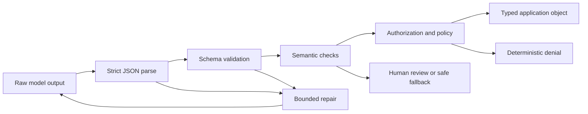

# 结构化输出是不受信任的契约

> 合法的 JSON 不等于合法的业务决策。先解析字节，再校验形状，然后核实含义，最后才允许动作。

> **【中文解读】** 本课把"结构化输出（structured output）"从格式问题升级为信任问题：能解析的 JSON 不等于能执行的决策。一个语法合法、字段齐全的对象仍可能数值越界（`priority: 9`）、语义虚构（引用不存在的发票）、越权提议（`"approved": true`）。课程给出防御性解析（defensive parsing）的完整工程做法——四道门（语法、形状、语义、授权）、严格解析不做乐观清洗、带预算的有界修复、流式缓冲、schema 版本化迁移。考试与实战的共同考点：每类失败必须归到唯一的责任门。

> 🔗 **【前置】** 学本课前请先掌握：(1) 05 课《验证的是论断，不是自信》——区分"模型说得自信"与"论断被验证"；(2) 08 课《Messages API 是一台状态机》——理解响应生命周期与内容块，本课的流式解析建立在它之上。

**类型：** 动手构建
**语言：** Python
**前置条件：** 05 验证的是论断，不是自信；08 Messages API 是一台状态机
**预计用时：** 约 95 分钟

## 学习目标

- 区分 JSON 语法、schema 有效性、语义有效性和授权。
- 设计让非法状态难以表达的窄 schema。
- 解析 Claude 输出时不做不安全的清洗或乐观的类型转换。
- 用有界的、富含证据的重试修复非法响应。
- 演进输出契约而不悄悄破坏消费方。
- 在对抗边界和流式边界测试结构化输出。

## 本应失败的 JSON

> **【中文解读】** 开场案例是全课的锚点：模型返回 `priority: 9`——超出 1 到 5 的业务范围，但 JSON 解析成功、四个键齐全，应用照单全收。失败不在模型（它没违反 JSON），而在应用没有执行契约。由此引出的"四道门"分类法是全课和考试的判定框架：每个失败必须归到唯一的责任层，通过前一道门绝不意味着通过后一道。

你的客服支持应用请求一个 1 到 5 的优先级。响应是：

```json
{
  "category": "billing",
  "priority": 9,
  "summary": "Customer reports a duplicate charge",
  "needs_human": false
}
```

JSON 解析器成功了。对象拥有每一个预期的键。应用把它按最高紧急度路由，跳过人工审查，并呼叫了值班工程师。

模型没有违反 JSON。是您的应用没有执行契约。

结构化输出有四道门：

1. **语法：** 是否恰好存在一个可解析的 JSON 值？
2. **形状：** 值是否匹配类型、必填字段、枚举、边界和附加属性规则？
3. **语义：** 字段是否与领域事实和彼此一致？
4. **授权：** 所请求的下游动作是否被允许？

通过更早的门绝不意味着通过更晚的门。



## "请输出 JSON"不是契约

> **【中文解读】** 提示词是概率手段，不是契约。平台的结构化输出（提供 JSON Schema 约束生成）能压低语法和形状失败率，但证明不了引用的订单存在、退款被授权、分类正确。关键立场有两条：schema 归应用所有，要像 API 一样做版本管理；即使启用了约束解码，应用侧校验也必须保留。

"只返回 JSON"是一条指令。它改善概率。它不能让非法输出变为不可能，不能防御 schema 漂移，也不能验证业务含义。

当前的模型和 API 支持结构化输出时，你可以提供一份 JSON Schema 并让平台约束生成。这会减少语法和形状失败。它仍然证明不了所引用的订单存在、退款被授权、或分类正确。

产品说明（2026-08-09 核实）：结构化输出的可用性、支持的 schema 关键字、与其他特性的不兼容、以及模型支持都可能变化。发布前请查阅 [Structured outputs](https://platform.claude.com/docs/en/build-with-claude/structured-outputs)。即使启用了约束解码，也要保留应用侧校验。

应用拥有 schema。要像管理 API 一样给它做版本管理。

```json
{
  "$id": "support-triage-v1",
  "type": "object",
  "required": ["category", "priority", "summary", "needs_human"],
  "additionalProperties": false,
  "properties": {
    "category": {
      "type": "string",
      "enum": ["billing", "bug", "account", "other"]
    },
    "priority": {
      "type": "integer",
      "minimum": 1,
      "maximum": 5
    },
    "summary": {
      "type": "string",
      "minLength": 1,
      "maxLength": 240
    },
    "needs_human": {
      "type": "boolean"
    }
  }
}
```

这份 schema 的严格是挣来的。消费方预期恰好四个字段。一个意外的 `debug_context` 字段可能把隐私文本带进日志。整数边界挡住 `9`。枚举防止类别拼写碎片化，让分析不被拆散。

## 从消费方决策出发设计 Schema

不要从"Claude 能生成什么"开始，而要从"下一个确定性组件必须决定什么"开始。

如果消费方要选队列，就给它枚举；如果它要按优先级排序，就给它有界整数；如果不确定性会改变路由，就显式表示不确定性，而不是指望它出现在散文里。

对比这两份契约：

```json
{"answer": "Probably a billing issue. It seems urgent."}
```

```json
{
  "category": "billing",
  "priority": 4,
  "evidence_ids": ["invoice-483", "message-12"],
  "uncertainty": "medium",
  "needs_human": true
}
```

第二个对象让路由和验证成为可能。它仍然可能出错，但它是可检视的。

使用这些设计规则：

- 优先用枚举而不是自由文本标签。
- 只有当每个合法响应都能提供该字段时才设为必填。
- 有意识地用 `null` 表示"已知缺席"，而不是当作万能逃生门。
- 拒绝附加属性，除非消费方有意支持扩展。
- 给字符串和数组设边界，以控制成本和存储。
- 当事实必须可追溯时，包含证据标识符。
- 把动作编码为提案，而不是授权证明。
- 给 schema 起稳定的名字和版本号。

避免用一个巨型 schema、靠几十个可选字段表示互不相关的模式。改用带标签的联合类型或分开的端点契约。当每个字段都可选时，非法状态会成倍增加。

## 严格解析

> **【中文解读】** 解析层的纪律只有一条：先严格解析、再校验，不做"友好"清洗。剥掉 markdown 围栏、把两段 JSON 拼成一段，都是在生成之后偷偷改契约——模型从未真正返回过那个值。静默类型转换同样被禁："4" 不是整数，1 不是布尔值；Python 里 `bool` 是 `int` 的子类这个陷阱必须显式拒绝。修复回路只应收到带字段路径的精确错误类别。

乐观清洗掩盖失败。考虑这个模式：

```python
raw = raw.replace("```json", "").replace("```", "")
payload = json.loads(raw)
```

它看起来友好，但它在生成之后改动了契约。一个包含注释、两个 JSON 对象或用户可控围栏文本的响应，可能被变换成模型从未真正作为单一值返回过的东西。

改用严格解析：

```python
payload = json.loads(raw)
validate_against_schema(payload)
```

如果契约说一个 JSON 对象，就拒绝 markdown 围栏和尾随散文。记录失败类别。修复尝试就能收到精确的错误。

不要静默转换：

- `"4"` 不是整数。
- `1` 不是布尔值。
- `"false"` 不等于 false。
- 逗号分隔的字符串不是数组。
- 缺失的字段不等于安全默认值——除非 schema 声明了该默认值且应用有意识地应用它。

Python 让其中一种情况特别隐蔽：`bool` 是 `int` 的子类。一个天真的 `isinstance(True, int)` 检查会在需要整数的地方接受布尔值。可运行的校验器会显式拒绝它。

## 形状之后，验证语义

> **【中文解读】** schema 能证明 `invoice_id` 是字符串，证明不了发票存在或属于当前认证用户。语义校验用可信的应用数据（而不是模型输出）说话。跨字段规则也在这一层。分工铁律：模型产出提案，确定性代码核实身份、所有权、金额边界、权限与状态转移。

schema 能证明 `invoice_id` 是一个字符串。它不能证明发票存在，也不能证明它属于该认证用户。

语义校验使用可信的应用数据：

```python
if payload["invoice_id"] not in invoices_for(authenticated_user):
    raise SemanticError("invoice is not visible to this user")

if payload["refund_amount"] > verified_charge_amount:
    raise SemanticError("refund exceeds verified charge")
```

跨字段规则同样重要。`uncertainty: high` 时 `needs_human: false` 可能非法。一个提议的 `action: close_account` 可能需要批准令牌。引用 ID 必须解析到一个真正支持该论断的来源。

模型可以帮助产出提案。确定性代码核实身份、所有权、金额边界、权限和状态转移。

## 带预算的修复

> **【中文解读】** 修复是有预算、有边界的选择题：语法或 schema 错误、低风险任务、且修正不发明缺失的证据，才值得修。修复回路五要素：原任务与不变的可信上下文、schema 或精确契约摘要、带字段路径的机器生成错误、次数硬上限、终局回退或升级。校验反馈是数据——要定界处理，不把原始异常、密钥、数据库记录粘进高信任指令区。证据缺失时修 JSON 是错误的操作：返回显式不完整状态或升级人工。

非法输出不一定意味着失败。语法或 schema 错误可能是可修复的——前提是任务低风险，且修正不会发明缺失的证据。

一个修复回路应包含：

1. 原始任务与保持不变的可信上下文。
2. schema 或一份精确的契约摘要。
3. 带字段路径的机器生成校验错误。
4. 严格的尝试次数上限。
5. 终局回退或升级路径。

```text
Repair the previous output.
Return one JSON object and no surrounding text.
Validation errors:
- $.priority: expected integer from 1 through 5
- $.needs_human: required field is missing
Do not invent evidence that was not present in the source.
```

不要把原始异常堆栈、密钥、数据库记录或任意不可信字符串粘贴进更高信任级别的指令区。校验反馈是数据。给它定界，并让可信的修复指令与它分开。

两次尝试通常足以判断失败是随机格式问题还是更深的契约不匹配。无限重试烧掉预算，还可能放大提示注入载荷。统计尝试次数、token、延迟和重复出现的错误指纹。

如果来源缺少必需的证据，修 JSON 就是错误的操作。返回显式的不完整状态，或升级处理。

## 工具输入与最终输出是不同的契约

> **【中文解读】** 四种结构化契约各管一段边界：工具输入 schema 帮模型构造调用，工具 handler 仍要校验并授权；来自远程服务的工具结果是不可信外部数据；面向消费方的最终输出有自己的 schema。不要把宽泛的内部工具 schema 复用为公共响应契约；也绝不能因为最终 JSON 里有 `"approved": true` 就执行动作——批准来自已认证的应用状态。`tool_choice` 三选项是 CCAR-F 指南的公开考点。

Claude 工具调用也提供结构化输入，但它服务的是另一段边界。

- 工具输入 schema 帮助模型构造一次调用。
- 工具 handler 仍然要校验值并为调用方授权。
- 来自远程服务的工具结果是不可信的外部数据。
- 应用的最终输出有自己面向消费方的 schema。

不要把宽泛的内部工具 schema 复用为公共响应契约。内部字段可能暴露实现细节或密钥。把已核实的工具结果映射进一个最小的最终对象。

同样，绝不要因为最终 JSON 里有 `"approved": true` 就执行动作。批准来自已认证的应用状态，而不是模型输出。

当工具调用作为结构化输出机制时，记住 CCAR-F 指南使用的三个公开 `tool_choice` 决策：

| 选项 | 模型行为 | 适用时机 |
|---|---|---|
| `auto` | 模型可以调用工具或返回对话文本 | 两条路径都合法 |
| `any` | 模型必须调用所提供的工具之一 | 需要类型化的工具结果但有多个合法 schema |
| `{"type":"tool","name":"extract_metadata"}` | 必须选中指定工具 | 已知必须先做一次提取再做后续工作 |

对于最终机器可读响应：当平台的结构化输出能力支持所需 schema 和特性组合时优先用它；当工作流确实是在选择或调用工具时用工具 schema。两种情况下，语义校验和授权都仍是应用的活。

## Pydantic 是校验器实现，不是契约本身

公开的 CCAR-F 指南把 Pydantic 与 JSON Schema 校验、校验-重试回路并列提及。在 Python 里，Pydantic 模型可以生成 schema、按配置转换或拒绝输入、表达跨字段校验。它不能让模型的论断变真，也不能授予下游权限。

本仓库坚持标准库优先，所以可运行实验直接实现了相关检查。如果你的生产应用已经使用 Pydantic，请显式映射同样的四道门：

```text
JSON parse -> Pydantic shape validation -> domain validation -> authorization
```

审查类型转换行为。一个把 `"4"` 静默转成 `4` 的校验器，在一个外部边界可能合适，在另一个边界可能不可接受。把有界的、字段级的校验错误喂给修复回路；当来源缺少必需证据时升级处理。

## 流式传输产生不完整语法

> **【中文解读】** 流式收到的 JSON 在相关内容块结束前都是"未写完"而非"非法"。正确姿势：缓冲整个结构块，别每字符重解析，也别因为某个必填字段提前出现就触发下游动作。块完成后五步：确认合法终局事件、恰好解析一次、校验 schema、校验语义与策略、原子提交下游状态转移。流断开就丢弃或隔离部分对象。

通过流接收的 JSON 在相关内容块结束前是不完整的。前缀 `{"category":"bill` 还不是非法——它是未写完。

缓冲整个结构块。不要反复解析每个字符，除非你使用为增量 JSON 设计的解析器并理解其部分状态语义。不要因为某个必填字段碰巧提前出现就触发下游动作。

块完成时：

1. 确认流到达了合法的终局事件。
2. 恰好解析一次。
3. 校验 schema。
4. 校验语义与策略。
5. 原子地提交下游状态转移。

如果流断开，丢弃或隔离这个部分对象。UI 可以显示临时文本，但应用契约尚未完成。

## Schema 演进就是一次 API 迁移

假设版本 1 返回整数 `priority`。版本 2 把它换成 `severity: "low" | "medium" | "high"`。先部署提示词会破坏旧消费方；先部署消费方又可能拒绝旧输出。

使用以下策略之一：

- 加一个契约版本字段，迁移期同时支持两者。
- 在一个严格规划的兼容窗口内部署一个宽容读取器。
- 并行运行两套生成，对比结果后再切换。
- 在适配器边界把新输出翻译成旧的内部类型。

绝不悄悄改 schema。在 trace 里记录 schema 版本、提示词版本、模型版本和校验器版本。回归评估必须覆盖新旧示例、边界值、缺失字段、意外字段、恶意字符串和超大输入。

## 构建校验器与修复回路

`code/main.py` 用零外部依赖实现了一个够用的 JSON Schema 子集。它校验对象、必填字段、附加属性、基本类型、枚举、数值边界、字符串边界、数组和嵌套路径，然后把校验器包进一个有界的抽取器。

运行它：

```bash
cd certifications/claude/lessons/09-structured-output-and-defensive-parsing/code
python3 main.py
python3 -m unittest discover tests -v
```

第一个脚本化响应用 `"high"` 填了需要整数的位置，第二次修复了该字段。测试证明：markdown 围栏、缺失字段、布尔当整数、意外字段和耗尽重试都会显式失败。

生产环境请优先选择你的应用技术栈所支持的成熟校验器。手写子集的意义在于暴露一个库到底执行了哪些检查，而不是替代完整的 JSON Schema 实现。

## 交互实验室

用恢复图把候选输出依次送过语法、schema、语义和授权四道门。把修复预算花在一个结构性错误上，再把结果与一个必须升级的缺证据失败做对比。

```figure
09-structured-output-recovery
```

## 练习实验室

运行有界抽取器，然后依次提交带围栏的 JSON、布尔整数、意外字段和两次非法尝试。判断每个失败归语法、形状、语义还是授权所有。

## 交付产物

`outputs/validated-triage.json` 是不依赖真实服务商的修复演示产出的已填充契约。运行 `python3 main.py` 复现它，再跑单元测试套件。一个测试把检入的产物与 `demo()` 比对，其余测试覆盖围栏、缺失字段、布尔整数、附加属性、有界修复和耗尽重试。

## 验证

```bash
cd certifications/claude/lessons/09-structured-output-and-defensive-parsing/code
python3 main.py
python3 -m unittest discover tests -v
```

## 毕业设计衔接

测验考的是每个失败归哪道门所有。把已验证对象和修复证据带进开发者毕业设计 30 和架构师毕业设计 31、32。

## 考试决策规则

- 如果输出能解析但违反范围或枚举，选 schema 校验，不是提示词清洗。
- 如果输出匹配 schema 但与可信记录冲突，选语义验证。
- 如果对象提议一个特权动作，从应用身份和策略出发授权。
- 如果格式化瞬时失败，用带精确校验反馈的有界修复。
- 如果证据缺失，升级或返回显式不完整状态，而不是修复事实。
- 如果流式输出未完成，不要当作契约已完成去解析或行动。
- 如果 schema 变了，像对待任何公共 API 一样做版本化和迁移。
- 如果约束生成可用，用它减少错误，但保留下游校验。

## 练习

1. 把 `evidence_ids` 加成有界字符串数组。为合法列表、整数项和超限列表写测试。
2. 加跨字段规则：`uncertainty: high` 要求 `needs_human: true`。
3. 写一个语义校验器：确认发票属于认证用户，且不把完整发票记录暴露给模型。
4. 加 `contract_version` 字段并实现版本 1 到版本 2 的适配器。
5. 喂给校验器十个对抗字符串：围栏、重复对象、意外字段、转义控制文本、超长摘要、布尔整数和嵌套提示注入语言。
6. 在独立的生产沙箱里把分诊契约重建为 Pydantic 模型。比较严格与转换行为，但不给本课添加 Pydantic 依赖。

## 延伸阅读

- [Structured outputs](https://platform.claude.com/docs/en/build-with-claude/structured-outputs) — 结构化输出官方文档：约束生成的可用性与限制
- [Messages API reference](https://platform.claude.com/docs/en/api/messages) — Messages API 参考：响应与内容块的生命周期
- [Tool use overview](https://platform.claude.com/docs/en/agents-and-tools/tool-use/overview) — 工具调用总览：工具输入契约与 tool_choice
- [Increase output consistency](https://platform.claude.com/docs/en/test-and-evaluate/strengthen-guardrails/increase-consistency) — 提升输出一致性：官方护栏技巧
- [JSON Schema specification](https://json-schema.org/specification) — JSON Schema 规范：校验关键字的标准来源
- [Claude Certified Architect Foundations exam guide](https://everpath-course-content.s3-accelerate.amazonaws.com/instructor%2F6nizmqk8tpzpfjvt6qmmav7rh%2Fpublic%2F1783542750%2FClaude+Certified+Architect+%E2%80%93+Foundations+Exam+Guide.pdf) — CCAR-F 官方考试指南：本课考试要点的原始出处
