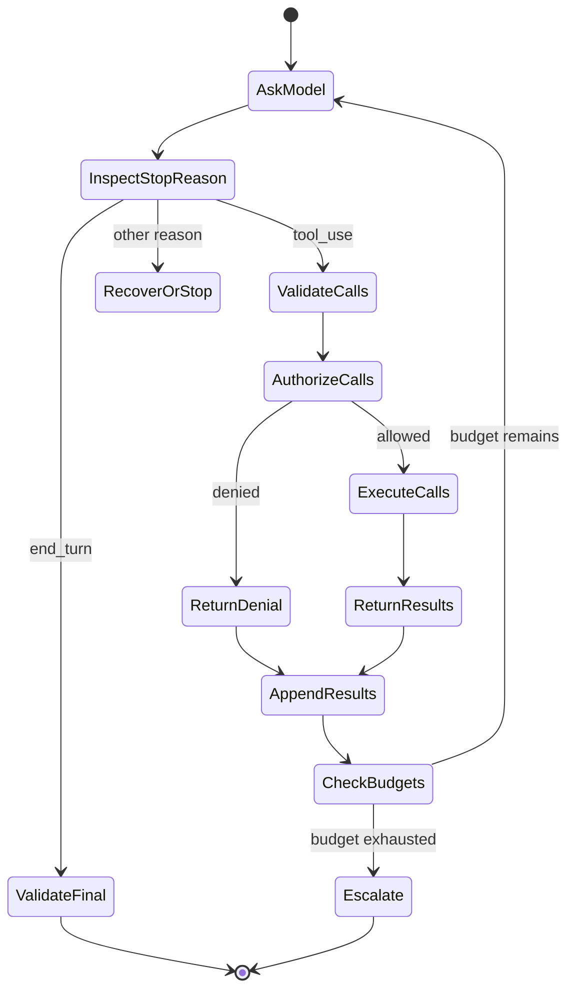

# 工具循环是受控的委托

> Claude 可以提议一个动作。你的应用校验请求、授予能力、观察结果，并决定循环是否继续。

> **【中文解读】** 本课把工具调用（tool use）与 Agent 循环（agentic loop）的核心定性为一句话：工具给 Claude 触达世界的能力，不给它执行世界的权力。模型提议（propose）一个具名能力并附结构化参数；确定性应用代码决定是否执行、如何执行、至多执行几次。课程覆盖完整的 `tool_use`/`tool_result` 协议回路、工具契约设计、校验之后才授权的执行边界、并行调用约束、终止条件预算，以及"手写循环 / SDK Tool Runner / 托管 Agent"三种拥有量的选择框架。考试高频点：提议与授权的分离、失败按类别恢复、终局判据看状态不看 prose。

> 🔗 **【前置】** 学本课前请先掌握：(1) 08 课《Messages API 是一台状态机》——stop reason 与内容块是循环的驱动信号；(2) 09 课《结构化输出是不受信任的契约》——工具输入 schema 同样是"帮模型构造调用"的契约，handler 仍须自行校验授权。

**类型：** 动手构建
**语言：** Python
**前置条件：** 08 Messages API 是一台状态机；09 结构化输出是不受信任的契约
**预计用时：** 约 130 分钟

## 学习目标

- 实现完整的 `tool_use` 与 `tool_result` 协议回路。
- 设计聚焦的工具契约并选择它们的执行边界。
- 把模型的工具选择与确定性授权分开。
- 比较手写循环、SDK Tool Runner 与托管 Agent。
- 把失败作为类型化结果返回，并消费可行动的运行时事件。
- 给自主性设边界；当路径已知时选择固定工作流。

## 重复付款的 Agent

> **【中文解读】** 开场事故把"语言生成"与"事务控制"混为一谈的代价具象化：连接在最终文本到达前断开，应用重试整轮，Claude 再次请求 `issue_refund`，客户收到两笔退款。问题不在模型用了工具，而在应用把"模型说了"当成"事务提交了"。由此立下本课的两契约框架：模型可以提议带结构化参数的具名能力；是否、如何、至多几次执行，由确定性代码决定。

一个账单助手收到"给重复扣款退款"。Claude 请求 `issue_refund`。应用执行了它。响应连接在最终文本到达之前断开。应用重试了整轮，Claude 再次请求该工具，客户收到了两笔退款。

问题不在模型使用了工具。是应用把语言生成当成了事务控制。

一个可靠的工具循环有两份契约：

1. 模型可以用结构化参数提议一个具名能力。
2. 确定性应用代码决定该能力是否执行、如何执行、以及至多执行多少次。

工具调用给 Claude 触达能力。它不给 Claude 权力。

## 先看线格式契约，再谈框架

> **【中文解读】** 在碰任何 SDK 之前先看裸协议：客户端在请求里声明工具（名字、描述、JSON Schema 输入契约）；模型返回 `stop_reason: "tool_use"` 和带 id 的 `tool_use` 内容块；你的客户端原样保留整段 assistant 内容、校验并执行工具，再以 user 角色追加 `tool_result` 并回指同一 id。配对 id 不是装饰——它把结果与唯一一次请求关联；协议还要求 assistant 消息在历史中紧邻结果序列。

客户端工具在请求中声明。每个声明给模型一个名字、一段描述和一份 JSON Schema 输入契约。

```json
{
  "name": "lookup_order",
  "description": "Look up one order by its exact public order ID. Returns status and last update. This tool never changes an order.",
  "input_schema": {
    "type": "object",
    "required": ["order_id"],
    "additionalProperties": false,
    "properties": {
      "order_id": {
        "type": "string",
        "description": "Order ID in the form A-12345"
      }
    }
  }
}
```

Claude 可能返回：

```json
{
  "stop_reason": "tool_use",
  "content": [
    {
      "type": "tool_use",
      "id": "toolu_7f3",
      "name": "lookup_order",
      "input": {"order_id": "A-12345"}
    }
  ]
}
```

你的客户端原样保留整段 assistant 内容，校验并运行该工具，然后追加：

```json
{
  "role": "user",
  "content": [
    {
      "type": "tool_result",
      "tool_use_id": "toolu_7f3",
      "content": "{\"found\":true,\"status\":\"in_transit\"}"
    }
  ]
}
```

配对的 ID 不是装饰。它把一个结果与一次请求关联。assistant 消息在协议期望的会话历史中必须保持在结果序列之前紧邻的位置。

当前 SDK 与 API 形状参见 [Implement client tools](https://platform.claude.com/docs/en/agents-and-tools/tool-use/implement-tool-use)。

## 循环有显式状态

> **【中文解读】** 状态机图把循环拆成可命名、可测试的转移：检查 stop reason → 校验调用 → 授权 → 执行 → 追加结果 → 检查预算 → 回到提问模型或升级。每一步都可能失败。考试要点：不要用一个宽泛的 `try/except` 加通用重试把这些状态藏起来——按失败类别分类，按类别选恢复策略。



每个转移都可能失败。响应可能缺少工具 ID。工具名可能未知。参数可能违反 schema。授权可能拒绝调用。handler 可能超时。结果可能过大。Claude 可能再请求一个工具。最终答案仍可能不满足它的输出契约。

不要把这些状态藏在一个宽泛的 `try/except` 和通用重试后面。给它们分类，按失败类别选择恢复策略。

## 工具设计就是接口设计

Claude 依据接口选择工具。一个人应该能不看 handler 就推断出每个工具何时使用。

### 一个工具只做一件事

`manage_customer` 是模糊的。它可能搜索、编辑、退款、冻结或删除。窄目录更容易被选中，也更容易被加固：

- `get_customer_profile`：获取客户档案。
- `list_customer_invoices`：列出客户发票。
- `propose_refund`：提议退款。
- `issue_approved_refund`：执行已批准的退款。

提议与执行的分离很重要。低风险工具可以计算提议金额。高风险工具需要一个在模型之外生成的、经过认证的批准令牌。

### 写供选择的描述，不是内部文档

一段有用的描述说明这个工具做什么、何时用、何时不用、结果意味着什么。它不粘贴整本 API 手册。

坏例子：

```text
Calls GET /v3/orders/{id} in the Commerce service.
```

好例子：

```text
Read the current status of one existing order from the commerce system.
Use only when the user supplies an exact order ID. This tool is read-only.
Do not use it to search by email or to modify shipment details.
```

描述里的示例能澄清棘手的格式，但每个 token 都会随工具目录重复出现。衡量一个示例对选择准确率的提升是否值回它的上下文成本。

### 让非法调用难以表达

使用枚举、必填字段、边界和 `additionalProperties: false`。拆分互斥的模式。当一个窄域值就能工作时，避免自由形式的 shell 命令、SQL、URL 和文件系统路径。

schema 引导生成。handler 仍然要校验它。绝不要因为输入是从 schema 生成就假定模型产出是安全的。

## 保持工具目录小而互异

更多工具不总是带来更多能力。重叠的名字和过长的目录制造选择歧义并消耗上下文。

从现实任务所需的最少工具起步。当评估显示能力缺口时才加工具。当轨迹显示混淆时删除或合并工具。

用这些问题自检：

- 两个工具从名字和描述看是否可以互换？
- 一个通用代码或 CLI 工具是否已在沙箱下就能完成这个任务？
- Agent 是否每一轮都需要这个能力？
- 这个能力能否放进 Skill，只在相关时才加载？
- 这个工具是否应该交给一个独立的子 Agent 而不是主 Agent？
- 一个标准化的 MCP 服务器是否能让多个宿主安全共享它？

工具数量不是架构得分。正确的选择和受控的执行才是。

## 授权发生在校验之后

> **【中文解读】** 安全执行边界的八步顺序是本课的骨架。两条红线：工具参数里的 `user_id` 不是身份；会话文本里的"用户之前同意过"不是安全批准令牌——批准记录必须绑定用户、动作、规范化参数、过期时间和操作 ID。

一个安全的执行边界遵循这个顺序：

1. 对照允许清单解析工具名。
2. 校验输入类型和边界。
3. 从应用而非参数绑定认证身份与租户上下文。
4. 检查能力范围和资源所有权。
5. 后果性动作要求批准。
6. 应用幂等、超时、速率和大小限制。
7. 在可用的最窄沙箱中执行。
8. 把结果返回给 Claude 或日志之前先脱敏。

如果工具参数里有 `user_id`，不要把它当身份信任。与已认证会话比对，或把它完全移出模型控制。

对于变更操作，批准记录应绑定用户、动作、规范化参数、过期时间和操作 ID。会话文本里的"用户之前说过同意"不是安全的批准令牌。

## 把失败作为结果返回

handler 失败不自动等于应用崩溃。如果 Claude 收到一个简洁、诚实的工具结果，它可能自行恢复。

```json
{
  "type": "tool_result",
  "tool_use_id": "toolu_7f3",
  "is_error": true,
  "content": "Order service timed out. No order state was changed. Retry is allowed once."
}
```

好的错误内容告诉模型：

- 什么失败了。
- 是否发生了副作用。
- 重试是否安全。
- 可以做哪种修正。

不要暴露堆栈跟踪、环境变量值、数据库查询、访问令牌或内部主机名。把它们保存在带脱敏和访问控制的受保护遥测里。

校验失败可以包含字段路径。策略拒绝不应引导模型去找绕行方案。"这个 Agent 不能发起退款"这样的拒绝，比枚举每条安全规则更安全。

按你的设计，未知工具应变成一个关联的错误结果或一个终局协议错误。绝不动态导入并运行一个由模型命名的 handler。

## 多工具调用与并行调用

Claude 可以在一个响应里请求多个工具。只有当它们相互独立、只读、且重排安全时才并行执行。

两个搜索通常可以并发。"创建发票"接"发送发票"存在依赖，必须保持顺序。对同一条记录的两次写入可能冲突。一次付款和一封邮件可能需要事务或补偿工作流。

为每个被请求的 `tool_use` ID 返回一个 `tool_result`。保留足够的顺序信息以重建轨迹。如果一个并行调用失败，逐个报告结果，而不是假装整批一致成功。

产品说明（2026-08-08 核实）：自动工具执行与并行调用的辅助 API 因 SDK 而异。它们不免除应用的授权职责。查阅当前的 [Tool use overview](https://platform.claude.com/docs/en/agents-and-tools/tool-use/overview)。

## 给 Agent 设边界

> **【中文解读】** Agent 循环需要 `end_turn` 之外的终止条件清单，其中"已验证的终局谓词"最强——部署 Agent 的成功标准是预期版本健康，不是它说"部署完了"。轨迹要完整记录，敏感值脱敏。

Agent 循环需要 `end_turn` 之外的终止条件：

- 最大模型轮数。
- 最大工具调用数（全局与单工具）。
- 墙上时钟截止时间。
- token 与金钱预算。
- 最大连续错误数。
- 最大相同重复调用数。
- 用户取消。
- 必需的人工批准。
- 已验证的终局谓词。

终局谓词比"响应听起来是否完整"更强。部署 Agent 的成功标准是预期版本健康，而不是它说"已部署"。研究 Agent 的成功标准是必需论断有可解析的来源，而不是它产出一份长报告。

记录轨迹：提示词版本、模型、stop reason、工具名、规范化参数指纹、决策、延迟、结果类别和状态变更。敏感值脱敏。

## 工作流还是 Agent

步骤和分支已知时用固定工作流。路径取决于观察、且模型必须在工具间做选择时才用 Agent。

| 任务 | 更优默认 | 原因 |
|---|---|---|
| 抽取字段、校验、存储 | 工作流 | 序列已知、契约清晰 |
| 分类后路由到一个队列 | 工作流 | 分支集合有限 |
| 调查陌生仓库缺陷 | Agent | 搜索路径取决于发现 |
| 核实重复扣款后退款 | 带批准的工作流 | 后果性动作、控制已知 |
| 跨变动内部系统收集证据 | 有界 Agent | 工具选择取决于缺失的证据 |

当任务有价值、环境可被工具触达、错误可检测、恢复有可能时，自主性才站得住。如果错误无法被检测，增加更多 Agent 轮次只是在隐藏风险。

## 选择拥有多少循环

> **【中文解读】** 这是全课的架构决策核心：过了"工作流还是 Agent"的门之后，再选满足运维要求的最小执行框架。换框架永远换不掉安全责任。

过了工作流这道门之后，选择满足运维要求的最小执行框架。

| 运行时 | 它接管什么 | 你的应用仍要处理什么 | 适用时机 |
|---|---|---|---|
| 手写 Messages 循环 | 只有你实现的协议工作 | 完整历史、stop reason、schema 与策略、执行、重试、预算、trace 与恢复 | 需要线级控制、受限运行时、自定义状态机，或协议教学与测试 |
| SDK Tool Runner | 工具声明辅助、`tool_use`/`tool_result` 序列、消息状态更新、可选的每轮流式 | 授权、沙箱、幂等、错误披露、迭代上限、可观测性、终局证明 | 有受支持的 SDK 且客户端工具仍在应用控制下运行 |
| Claude 托管 Agent | 带配置沙箱、内置工具和事件驱动执行的远程 Agent/会话/环境框架 | Agent 配置、数据边界批准、自定义工具执行、确认决策、事件持久化、业务授权、结果核实 | 需要托管会话与沙箱边界，且接受其当前的测试版、平台与事件契约 |

本课代码刻意选择第一种。它暴露每一个转移。把它迁移到 [Tool Runner](https://platform.claude.com/docs/en/agents-and-tools/tool-use/tool-runner) 能省去重复的循环管道，但不会让一笔退款变安全。设置迭代上限、拦截或包装工具执行、保留应用批准、验证最终状态。

产品说明（2026-08-09 核实）：[Claude Managed Agents](https://platform.claude.com/docs/en/managed-agents/overview) 目前是公开测试版，使用带版本的测试契约。它提供托管 Agent、环境、会话、内置工具和服务器发送事件流。把请求头、资源、事件类型、工具集、限制和可用供应商都当作易变项对待。不要仅仅因为任务被叫作"Agent"就选它。

托管 Agent 集成是一个事件消费者，不是一次"拿最终文本"的调用。应用发送用户事件、消费已持久化的会话与 Agent 事件、跟踪状态。自定义工具调用或权限门控工具可以用 `requires_action` 暂停会话；应用用结果或确认决策解析被引用的事件 ID。SSE 连接关闭不等于成功。要对账已持久化事件与终局状态。12 课会针对离线事件夹具实现这条边界；当前来源是 [Session event stream](https://platform.claude.com/docs/en/managed-agents/events-and-streaming)。

## 第一方不等于只有一条执行边界

> **【中文解读】** 按"代码和数据在哪执行、谁授权、如何被发现"给能力分类，而不是按"是不是第一方"。考试要点：Skill 和工具常常互补而非二选一；任何一层 schema 合法都不等于身份、授权或幂等证据。

按"代码和数据在哪执行、谁授权它、它如何被发现"给能力分类。

| 表面 | 执行与数据边界 | 用它做什么 | 不要假设 |
|---|---|---|---|
| Messages 服务器工具 | Anthropic 执行受支持的工具，如 web 搜索、web 抓取、代码执行、工具搜索 | 供应商侧执行与数据策略都合适的第一方能力 | 你的应用会收到客户端 `tool_use` 去执行（普通情况下不会） |
| Anthropic-schema 客户端工具 | Anthropic 定义训练过的 schema；你的应用执行 bash、文本编辑器、memory、计算机使用等工具 | 标准 schema 能提升模型熟悉度、但客户端必须拥有执行的常见操作 | 第一方 schema 等于供应商执行或自动授权 |
| 托管 Agent 内置工具 | 配置的托管或自托管 Agent 环境执行其工具集 | 适配该运行时沙箱与权限策略的仓库与网络工作 | 启用工具集就授予业务权力或免掉确认工作 |
| 自定义客户端工具 | 你的应用校验并执行你的 JSON Schema 契约 | 私有业务操作、窄域 API、精确的应用策略 | schema 合法的输入就是身份、授权或幂等证据 |
| Skill | 受支持的运行时加载可复用指令、参考、脚本或资产 | 只应在相关时才披露的流程 | Skill 本身是执行或授权边界 |
| MCP | MCP 客户端或连接器调用标准化的外部服务器 | 跨兼容宿主共享的能力或上下文，带显式的服务器、身份与传输边界 | 服务器发现让每个返回的工具都安全或相关 |

Skill 和工具常常互补，而不是二选一。一个退款审查 Skill 可以教流程，同时一个自定义客户端工具暴露已批准的操作。当多个宿主需要同一标准接口时，MCP 可以承载该操作。只有当供应商执行的服务器工具的网络、留存和结果语义适合该数据时才选它；只有当你的沙箱和动作校验器准备好执行时才选 Anthropic-schema 客户端工具。

当前的执行类别见 [How tool use works](https://platform.claude.com/docs/en/agents-and-tools/tool-use/how-tool-use-works)，托管框架另有单独的[工具配置](https://platform.claude.com/docs/en/managed-agents/tools)。版本和模型兼容性会变化，所以要把选定的工具类型和版本持久化进 trace。

## 构建工具循环

`code/main.py` 实现了一个工具注册表和一个裸循环。它支持多调用、schema 检查、变更类工具批准、handler 错误、未知工具、关联 ID 和轮次预算。它的离线决策实验从显式需求出发，单独在工作流、手写循环、SDK Tool Runner 和托管 Agent 之间做选择；还会把可选 Skill 组合进执行面，而不是假装 Skill 是工具。

```bash
cd certifications/claude/lessons/10-tool-use-and-agentic-loops/code
python3 main.py
python3 -m unittest discover tests -v
```

阅读演示打印的转录。找到 assistant 的 `tool_use` 块和紧随其后的 user `tool_result`。再检查其后打印的决策夹具。把托管 Agent 案例改成不接受测试版，让决策在任何运行时启动之前就失败。协议和架构正确性应该是看得见的，不是被假定的。

## 交互实验室

用工具循环图为轮次、工具调用、时间和批准分配预算。触发重复调用或被拒绝的变更，观察哪条确定性终止条件停下了循环。

```figure
10-tool-loop-budget
```

## 练习实验室

运行工具循环，然后依次测试未知工具、非法参数、被拒绝的变更、多调用、handler 错误和耗尽的轮次预算。确认每个结果都保留其 tool-use ID。接着按执行边界和授权所有者，对供应商服务器工具、Anthropic-schema 客户端工具、私有自定义工具、Skill 支撑的流程和 MCP 服务做分类。

## 交付产物

`outputs/tool-loop-transcript.json` 是 `demo()` 产出的已填充、带关联的执行转录。`outputs/runtime-and-tool-surface-decisions.json` 是带日期、不依赖真实服务商的四种运行时与四种能力组合的对比。运行 `python3 main.py` 检查两者，并执行单元套件验证产物、schema 边界、批准拒绝、运行时门控、执行边界、handler 失败和失控防护。

## 验证

```bash
cd certifications/claude/lessons/10-tool-use-and-agentic-loops/code
python3 main.py
python3 -m unittest discover tests -v
```

## 毕业设计衔接

测验考的是提议与授权之分、工具描述、幂等、并行性、终局检查和工作流选择。把已验证的转录带进开发者毕业设计 30 和架构师毕业设计 31、32，作为工具边界证据。

## 考试决策规则

- Claude 的工具选择是提案，永远不是授权。
- 先校验 schema，再查策略，最后才执行。
- 用能区分适用时机的窄名字和描述。
- 当恢复安全时，返回简洁、带关联的错误。
- 对可重试的副作用要求幂等或对账。
- 只并行化顺序无关的独立调用。
- 在预算耗尽、重复调用、用户取消或无法识别的控制状态时停止。
- 路径已知时优先用确定性工作流。
- 客户端执行合适且自定义线控制没有价值时，优先用 SDK Tool Runner。
- 只有存在具体的托管运行时需求且接受了测试版与数据边界时，才选托管 Agent。
- 把托管会话当作事件状态机；按事件 ID 解析 `requires_action`，绝不从断开的流推断成功。
- 按执行位置区分服务器执行工具、Anthropic-schema 客户端工具、托管内置工具和自定义客户端工具。
- 把 Skill 当流程、把 MCP 当连接边界；两者都不授予授权。
- 评估工具轨迹和最终状态，而不只是最终的文字。

## 练习

1. 加一个带必填批准令牌的 `issue_refund`。证明会话文本代替不了令牌。
2. 在一个响应里加两个只读调用并并发执行。保留确定性的结果关联。
3. 让一个工具在副作用之后超时。重试前加幂等键和对账检查。
4. 加一个重复调用检测器：同一规范化工具请求出现两次即停止。
5. 把一个私有自定义工具改造成由两个宿主共享的 MCP 能力。指出哪些认证、同意、结果过滤和可用性职责移到服务器边界，哪些留在各宿主。

## 延伸阅读

- [Tool use overview](https://platform.claude.com/docs/en/agents-and-tools/tool-use/overview) — 工具调用总览：入口文档
- [Implement client tools](https://platform.claude.com/docs/en/agents-and-tools/tool-use/implement-tool-use) — 实现客户端工具：线格式契约与序列要求
- [Handle tool errors](https://platform.claude.com/docs/en/agents-and-tools/tool-use/implement-tool-use#handling-tool-use-and-tool-result-content-blocks) — 处理工具错误：`is_error` 结果的构造
- [Tool Runner](https://platform.claude.com/docs/en/agents-and-tools/tool-use/tool-runner) — Tool Runner：SDK 层的循环管道
- [How tool use works](https://platform.claude.com/docs/en/agents-and-tools/tool-use/how-tool-use-works) — 工具调用如何工作：执行类别划分
- [Claude Managed Agents](https://platform.claude.com/docs/en/managed-agents/overview) — Claude 托管 Agent：公开测试版框架
- [Session event stream](https://platform.claude.com/docs/en/managed-agents/events-and-streaming) — 会话事件流：`requires_action` 与事件对账
- [Managed-agent tools](https://platform.claude.com/docs/en/managed-agents/tools) — 托管 Agent 工具配置
- [Building effective agents](https://www.anthropic.com/research/building-effective-agents) — 构建有效的 Agent：Anthropic 的模式论文
- [Handling stop reasons](https://platform.claude.com/docs/en/build-with-claude/handling-stop-reasons) — 处理 stop reason：循环的驱动信号
