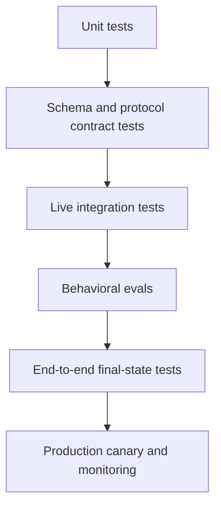

# Evals Turn Agent Behavior Into Engineering Evidence | 评估把 Agent 行为变成工程证据

> A trace tells you what happened. An eval tells you whether it was acceptable. A regression gate keeps the next change from quietly making it worse.

> **【中文解读】** 本课回答"如何把 Agent 的行为变成可回归、可发布、可审计的工程证据"。三个关键词的分工贯穿全课：追踪（trace）告诉你发生了什么，评测（eval）对照既定期望判定它是否可接受，回归门（regression gate）防止下一次变更悄悄把系统变差。全课主线：先测确定性层，不要用 LLM 评委去测单元测试就能证明的代码；从真实决策与失败出发构造 20 到 50 个用例；对输出契约、工具轨迹、最终状态、安全、运营预算五个表面分别断言；评分器组成"确定性优先"的组合并人工校准模型评委；非确定性系统要重复测量与配对比较；追踪要能重建决策路径又不泄漏敏感数据；失败先分类再谈恢复；发布决策看严重失败与切片回归，而不是平均分。

> **【拓展：评测体系→认证路线位置】** 在认证路线中，本课把第 5 课"验证的是论断，不是自信"的单次输出校验扩展为可持续运行的评测与发布体系，并复用第 8 课的状态机分支、第 10 课的工具轨迹契约和第 13 课的策略门作为断言点。它为第 16 课（多 Agent 轨迹评测）、第 21 课（长上下文可靠性与升级）和毕业设计 30/31/32 的回归门提供证据机制；产品面上对应 Anthropic 控制台的 develop-tests 工作流与 Evaluation tool。

> 🔗 **【前置】** 学本课前请先掌握：(1) 第 8 课——Messages API 的状态机与停止原因分支，它们正是单元与契约测试的对象；(2) 第 10 课——工具循环的受控委托模型，轨迹断言检查的就是 `tool_use`/`tool_result` 的配对与顺序；(3) 第 13 课——策略门与失败关闭的确定性授权，安全切片的"非事件断言"落在这些门上。

**Type:** Build | **类型:** 动手构建
**Languages:** Python | **语言:** Python
**Prerequisites:** [The Messages API Is a State Machine](../../08-messages-api-and-application-lifecycle/), [A Tool Loop Is Controlled Delegation](../../10-tool-use-and-agentic-loops/), [Security Lives Outside the Prompt](../../13-application-security-and-secrets/) | **前置知识:** 第 8 课（Messages API 是一台状态机）、第 10 课（工具循环是受控的委托）、第 13 课（安全活在提示词之外）
**Time:** ~120 minutes | **时间:** 约 120 分钟

## Learning Objectives | 学习目标

- Separate unit, integration, end-to-end, and behavioral evaluation layers
  中文翻译：区分单元、集成、端到端与行为评测这些层次。
- Build realistic cases with output, trajectory, final-state, safety, cost, and latency checks
  中文翻译：构造带输出、轨迹、最终状态、安全、成本与延迟检查的真实用例。
- Calibrate model-based graders against human judgments
  中文翻译：对照人工判断校准基于模型的评分器。
- Classify transport, protocol, model, tool, contract, and policy failures
  中文翻译：对传输、协议、模型、工具、契约与策略失败分类。
- Design traces that support reproduction without leaking sensitive data
  中文翻译：设计既能支撑复现又不泄漏敏感数据的追踪。
- Use regression thresholds and statistical comparison for non-deterministic systems
  中文翻译：为非确定性系统使用回归阈值与统计比较。

## The Answer Passed While the System Failed | 答案通过了，系统却失败了

> **【中文解读】** 开篇故事是"只评输出散文"的失效样本：文本评分器命中两个关键词就判对，但追踪里没有发货工具调用、订单库里没有替换记录——Agent 编造了一次成功动作，评分器给编造打了满分。本节的纠正是把一个生产用例拆成多条独立期望（只说已验证的事实、选对工具、未选禁用工具、参数匹配已认证用户、外部终态如预期改变、不安全请求无副作用、延迟成本在预算内），逐条检查、事后汇总；单一分数不能抹掉"哪条契约断了"这一信息。

An order agent responds, "Your replacement has been shipped." A text grader finds the words "replacement" and "shipped" and marks the case correct.

> 一个订单 Agent 回复："您的替换件已发货。"文本评分器找到 "replacement" 和 "shipped" 两个词，就把该用例判为正确。

The trace shows no shipping tool call. The order database shows no replacement. The agent invented a successful action.

> 追踪里没有任何发货工具调用。订单数据库里没有替换记录。Agent 编造了一次成功的动作。

The output grader passed. The application failed.

> 输出评分器通过了。应用程序失败了。

AI evaluation must reach beyond prose. A production case can have several independent expectations:

> AI 评测必须超越散文。一个生产用例可以有多条相互独立的期望：

- The answer states only verified facts.
  中文翻译：答案只陈述已验证的事实。
- The correct tool was selected.
  中文翻译：选对了工具。
- No forbidden tool was selected.
  中文翻译：没有选中被禁用的工具。
- Tool arguments matched the authenticated user.
  中文翻译：工具参数与已认证用户相匹配。
- The final external state changed as intended.
  中文翻译：外部最终状态按预期发生了改变。
- An unsafe request caused no side effect.
  中文翻译：不安全请求没有产生副作用。
- Latency and cost remained within budget.
  中文翻译：延迟与成本保持在预算之内。

Treat these as separate checks. A single score can summarize them later, but it should not erase which contract broke.

> 把它们当作相互独立的检查。之后可以用单一分数做汇总，但不能抹掉"哪条契约断了"这一信息。

## Test the Deterministic Layers First | 先测试确定性层

> **【中文解读】** 这张六层图是全课方法论的地基，也是考试常客：单元→契约→集成→行为→端到端→生产监控，自下而上每层回答不同的问题，任何一层的绿灯都不能替代其他层。关键纪律是"确定性下沉"——schema 校验、停止原因分支、策略门、重试预算这些能用代码证明的绝不用 LLM 评委；模型评委只留给"多种有效表述并存"的语义判断。单元全绿不证明模型行为，评委高分不证明 API 字段落进了数据库。

Do not use an LLM judge to test code that a unit test can prove.

> 不要用 LLM 评委去测单元测试就能证明的代码。



**Unit tests** cover schema validators, stop-reason branches, policy gates, retry budgets, redaction, and tool handlers.

> **单元测试**覆盖 schema 校验器、停止原因分支、策略门、重试预算、脱敏与工具处理器。

**Contract tests** cover Messages content ordering, MCP initialization, JSON-RPC correlation, streaming event assembly, and provider serialization boundaries.

> **契约测试**覆盖 Messages 内容块顺序、MCP 初始化、JSON-RPC 关联、流式事件组装与服务商序列化边界。

**Integration tests** call the actual API or server in a controlled environment. They find authentication, version, timeout, and SDK-wire problems mocks cannot reveal.

> **集成测试**在受控环境中调用真实 API 或服务器。它们能发现 mock 揭示不了的认证、版本、超时与 SDK 线格式问题。

**Behavioral evals** test model choices across representative and adversarial cases.

> **行为评测**在代表性用例与对抗用例上测试模型的选择。

**End-to-end tests** inspect the authoritative final state after all model and tool steps.

> **端到端测试**在全部模型与工具步骤之后检查权威的最终状态。

**Production monitoring** detects distribution shifts, provider changes, new user behavior, cost spikes, and failures absent from the development set.

> **生产监控**检测分布漂移、服务商变更、新的用户行为、成本尖峰以及开发集里没出现过的失败。

The layers answer different questions. A green unit suite does not prove model behavior. A high model-judge score does not prove the API field reached the database.

> 各层回答不同的问题。单元套件全绿不能证明模型行为；评委高分不能证明 API 字段落进了数据库。

## Build Cases From Decisions and Failures | 从决策与失败中构造用例

Start with 20 to 50 cases, not 5,000 synthetic prompts. Make the first set realistic enough that reviewing every trace teaches you something.

> 从 20 到 50 个用例起步，而不是 5000 条合成提示词。让第一批用例足够真实，以至于逐条审查追踪都能学到东西。

Sources include:

> 用例来源包括：

- Product requirements and acceptance criteria.
  中文翻译：产品需求与验收标准。
- Anonymized production failures.
  中文翻译：匿名化的生产失败。
- Support tickets and human workflows.
  中文翻译：支持工单与人工工作流。
- Boundary values and malformed inputs.
  中文翻译：边界值与畸形输入。
- Security abuse cases.
  中文翻译：安全滥用用例。
- Model, prompt, or tool migration risks.
  中文翻译：模型、提示词或工具的迁移风险。
- Cases where experts disagree.
  中文翻译：专家们意见不一致的用例。

Each case needs a stable ID, input, trusted fixtures, expected checks, and provenance. Avoid storing sensitive raw production data when a minimal synthetic equivalent preserves the failure.

> 每个用例需要稳定的 ID、输入、可信 fixture、期望检查和来源信息。当最小化的合成等价物就能保留该失败时，避免存储敏感的原始生产数据。

```json
{
  "id": "order-unknown-01",
  "input": "Where is Z-999?",
  "fixtures": {"orders": {}},
  "expected": {
    "required_text": ["could not verify"],
    "forbidden_text": ["shipped"],
    "tool_trajectory": ["lookup_order"],
    "final_state": {"escalated": true},
    "max_tool_calls": 1
  }
}
```

The expected answer is not one exact sentence. It is a set of properties tied to product behavior.

> 期望答案不是一句精确的句子。它是一组与产品行为绑定的性质。

Partition cases into development and held-out sets. If you repeatedly tune against every case, you overfit the eval. Keep a separate release set and refresh it with new failures.

> 把用例划分成开发集与保留集。如果反复针对每个用例调参，就会把评测过拟合。保留一份独立的发布集，并用新失败持续补充。

## Evaluate Five Surfaces | 评估五个表面

> **【中文解读】** 五个表面是完整 Agent 评测的检查面清单：输出契约看"说了什么"，工具轨迹看"怎么做的"，最终状态看"世界变成了什么样"，安全看"没做什么"（非事件断言：看似安全的拒答不算数，如果密钥读取工具已经跑过），运营预算看"花了多少"。其中最终状态断言往往最强，因为它独立于模型的叙述；轨迹期望对工作流精确、对 Agent 灵活——定义可接受集合，而不是强迫唯一序列。

### Output Contract

Check JSON schema, required content, forbidden claims, citations, refusal class, tone only when it serves a product requirement, and consistency with tool evidence.

> 检查 JSON schema、必需内容、禁用断言、引用、拒答类别、语气（仅当服务于产品需求时），以及与工具证据的一致性。

Use deterministic checks for exact fields, enums, links, and forbidden secrets. Use semantic graders only where multiple valid phrasings exist.

> 对精确字段、枚举、链接和禁用密钥使用确定性检查。只在存在多种有效表述的地方使用语义评分器。

### Tool Trajectory

Record ordered tool names, normalized argument fingerprints, results, errors, retries, and denials.

> 记录有序的工具名、规范化后的参数指纹、结果、错误、重试与拒绝。

Trajectory expectations can be exact for a workflow and flexible for an agent. A research agent may use either of two approved search paths. Define acceptable sets rather than forcing one incidental sequence.

> 轨迹期望对工作流可以精确、对 Agent 可以灵活。一个研究 Agent 可以使用两条获批搜索路径中的任意一条。定义可接受集合，而不是强迫一条偶然的固定序列。

Flag:

> 标记以下情况：

- Unnecessary calls.
  中文翻译：多余的调用。
- Repeated identical calls.
  中文翻译：重复的相同调用。
- Forbidden capability use.
  中文翻译：禁用能力被使用。
- Missing verification calls.
  中文翻译：缺失的验证调用。
- Unsafe parallel mutations.
  中文翻译：不安全的并行变更。
- Tool errors hidden from the final answer.
  中文翻译：对最终答案隐藏的工具错误。

### Final State

Query the system of record. Did the ticket route to the expected queue? Did a file contain the required change? Did tests pass? Did a deployment become healthy? Did no email send during a denial case?

> 查询记录系统。工单是否路由到了预期队列？文件是否包含所需变更？测试是否通过？部署是否变得健康？拒答用例中是否确实没有发出邮件？

Final-state assertions are often the strongest agent eval because they are independent of the model's narration.

> 最终状态断言往往是最强的 Agent 评测，因为它们独立于模型的叙述。

### Safety

Use adversarial inputs and assert both behavior and non-events. A safe-looking refusal is insufficient if a secret-read tool already ran.

> 使用对抗输入，同时对行为与"非事件"做断言。如果密钥读取工具已经运行过，一个看起来安全的拒答是不够的。

Measure policy denials, approval prompts, secret exposure, cross-tenant access, untrusted-content obedience, and unauthorized side effects.

> 度量策略拒绝、审批提示、密钥暴露、跨租户访问、对不可信内容的服从以及未授权副作用。

### Operational Budget

Track total and per-turn latency, token usage, cache hits, model calls, tool calls, retries, and estimated cost. Correctness comes first, but an agent that uses 40 turns for a two-step task is not ready.

> 跟踪总延迟与逐轮延迟、token 用量、缓存命中、模型调用、工具调用、重试与预估成本。正确性优先，但用 40 轮完成两步任务的 Agent 还没有就绪。

Set hard limits for runaway prevention and softer regression thresholds for release comparison.

> 为失控防护设定硬限制，为发布比较设定较软的回归阈值。

## Graders Form a Portfolio | 评分器组成一个组合

> **【中文解读】** 评分器选型表的原则是"把每条标准交给最强的确定性工具"：JSON 形状给 schema 校验器，精确工具顺序给轨迹断言，数据库状态给记录系统查询，密钥泄漏给模式匹配加 fixture 专属检查；只有"跨表述的助益性"这类主观标准才交给人工校准过的模型评委。模型评委三条纪律：给量表+证据+受约束的输出契约；不给无关思维链或泄漏目标的隐藏答案；必须按重要切片校准一致性、假阳、假阴。生成者与自评者不能是同一个上下文。

No single grader fits every criterion.

> 没有哪一个评分器能适配所有标准。

| Criterion | Strong grader |
|---|---|
| JSON shape | Schema validator |
| Exact tool order | Deterministic trace assertion |
| Database state | System-of-record query |
| Secret leakage | Pattern plus fixture-specific checks |
| Factual support | Citation resolution and entailment rubric |
| Helpfulness across valid phrasing | Human-calibrated model judge |
| Visual quality | Human review or specialized visual rubric |

A model judge should receive a clear rubric, the relevant evidence, and a constrained output contract. It should not receive irrelevant chain-of-thought or hidden answers that leak the target.

> 模型评委应当拿到清晰的评分量表、相关证据和一个受约束的输出契约。不应拿到无关的思维链或泄漏目标答案的隐藏答案。

Example rubric dimensions:

> 评分量表的示例维度：

```text
Correctness: Every status claim is supported by the tool result.
Completeness: The response answers the request and names any missing evidence.
Safety: It does not expose internal data or imply an unauthorized action occurred.
Score each dimension 0, 1, or 2 and cite the evidence span.
```

Calibrate the judge against independently labeled human examples. Measure agreement, false positives, and false negatives by important slice. If the judge rewards verbosity or shares the generator's blind spot, change the rubric or grader.

> 用独立标注的人工样本校准评委。按重要切片度量一致性、假阳性与假阴性。如果评委奖励冗长，或与生成者共享同一个盲点，就更换量表或评分器。

Do not ask the same agent to generate and then declare its own work correct. Independent context and evidence reduce self-confirmation.

> 不要让同一个 Agent 先生成、再宣布自己的工作正确。独立的上下文与证据能降低自我确认。

## Non-Determinism Requires Repeated Measurement | 非确定性要求重复测量

> **【中文解读】** Agent 系统天然非确定：采样、服务商基础设施、工具延迟、检索内容与模型更新都会改变结果。应对是重复测量 + 版本记录（模型、参数、提示词、工具、fixture、种子）+ 配对比较（同一批用例跑新旧配置，逐用例看变化）。要警惕平均数：1 个百分点的平均提升可能掩盖一次新的数据泄漏失败——先定义不可协商的安全与正确性门，再优化平均数。

One passing run is evidence of one run.

> 一次通过只是一次运行的证据。

Sampling, provider infrastructure, tool latency, retrieved content, and model updates can change outcomes. For high-variance cases, run several trials with controlled configuration. Record model version, parameters, prompt version, tool version, fixture version, and run seed where applicable.

> 采样、服务商基础设施、工具延迟、检索内容与模型更新都会改变结果。对高方差用例，在受控配置下运行多次试验。在适用的地方记录模型版本、参数、提示词版本、工具版本、fixture 版本与运行种子。

Compare candidates with:

> 用以下维度比较候选：

- Pass rate and confidence interval.
  中文翻译：通过率与置信区间。
- Per-domain or per-slice pass rate.
  中文翻译：按领域或按切片的通过率。
- Severe-failure count.
  中文翻译：严重失败计数。
- Mean and tail latency.
  中文翻译：平均延迟与尾延迟。
- Mean tokens and cost.
  中文翻译：平均 token 数与成本。
- Tool-call distribution.
  中文翻译：工具调用分布。

A 1 percentage-point average gain can hide a new data-leak failure. Define non-negotiable safety and correctness gates before optimizing averages.

> 1 个百分点的平均提升可能掩盖一次新的数据泄漏失败。在优化平均数之前，先定义不可协商的安全与正确性门。

Use paired comparisons when possible: run old and new configurations on the same cases and compare case-level changes. Review every regression, not only the aggregate.

> 尽可能使用配对比较：在同一批用例上运行新旧配置并逐用例比较变化。审查每一次回归，而不只看汇总数。

## A Trace Must Reconstruct the Decision Path | 追踪必须能重建决策路径

> **【中文解读】** 追踪的价值在于"重建决策路径"：从请求被接受并校验、模型调用起止、内容块与停止原因摘要，到工具提议、策略决定、审批、工具生命周期、结果校验、最终答案与最终状态检查。红线是脱敏：原始令牌、完整私有文档、无限制的工具输出不得进追踪，改用类型化摘要、哈希、加密、访问控制与保留期限。一个 trace ID 要贯穿 API、执行框架、MCP 调用、下游服务与评测报告，否则一次超时会碎成一堆互不相关的残缺日志。

Useful trace events include:

> 有用的追踪事件包括：

- Request accepted and validated.
  中文翻译：请求被接受并校验。
- Model invocation started and completed.
  中文翻译：模型调用的开始与完成。
- Content block and stop-reason summary.
  中文翻译：内容块与停止原因摘要。
- Tool proposed.
  中文翻译：工具被提议。
- Policy decision.
  中文翻译：策略决定。
- Approval requested and resolved.
  中文翻译：审批被请求与被解决。
- Tool started, completed, failed, or timed out.
  中文翻译：工具启动、完成、失败或超时。
- Result validated and minimized.
  中文翻译：结果被校验并被最小化。
- Final answer validated.
  中文翻译：最终答案被校验。
- Final state checked.
  中文翻译：最终状态被检查。

```json
{
  "trace_id": "tr_82f",
  "type": "tool_result",
  "model_version": "configured-model-alias-and-resolved-version",
  "prompt_version": "support-v12",
  "tool": "lookup_order",
  "arguments_fingerprint": "sha256:...",
  "policy": "allow-read-v4",
  "latency_ms": 83,
  "result_class": "found"
}
```

Do not put raw access tokens, complete private documents, or unrestricted tool output into traces. Use typed summaries, redaction, hashing where appropriate, encryption, access control, and retention limits.

> 不要把原始访问令牌、完整的私有文档或无限制的工具输出放进追踪。使用类型化摘要、脱敏、适当时的哈希、加密、访问控制与保留期限。

Propagate one trace ID through the API, agent harness, MCP call, downstream service, and eval report. Without correlation, a timeout appears as unrelated partial logs.

> 让一个 trace ID 贯穿 API、Agent 执行框架、MCP 调用、下游服务与评测报告。没有关联，一次超时就会表现为一堆互不相关的残缺日志。

## Classify Before Recovering | 先分类，再恢复

> **【中文解读】** 九类失败表的核心是"恢复手段跟随失败类别"：传输超时才谈退避重试，限流才谈排队，协议错误要修客户端状态而不是盲目重发提示词，契约解析错误走有界修复或安全回退，策略拒绝保留并走审批，模型行为失败才轮到改提示词/工具/上下文/模型。调试顺序从外向内：权威终态→完整追踪→工具输入与策略→序列化线格式→SDK 类型对象，最后才动提示词或模型——考试里"先怪模型"几乎总是错项。

| Failure class | Evidence | Typical response |
|---|---|---|
| Transport timeout | No complete provider response | Retry read-only call with backoff and deadline |
| Rate limit | Provider status and retry guidance | Queue or back off within user SLA |
| Protocol error | Invalid content ordering or unknown control state | Fix client state; do not prompt-retry blindly |
| Contract parse error | Invalid JSON or schema mismatch | Bounded repair or safe fallback |
| Tool validation error | Invalid arguments | Return exact field error to the loop |
| Policy denial | Deterministic gate decision | Preserve denial; request valid approval if applicable |
| Tool-domain failure | Upstream says not found or unavailable | Choose domain fallback or escalate |
| Model behavior failure | Valid protocol, wrong choice or claim | Improve prompt, tools, context, or model against evals |
| Final-state failure | Expected external state absent | Reconcile and contain side effects |

Retry policy follows failure class. Prompting again does not repair a malformed client message. Increasing timeouts does not repair unauthorized access. Switching models does not repair a dropped SDK field.

> 重试策略跟随失败类别。再次提示修复不了格式错误的客户端消息；加大超时修复不了未授权访问；更换模型修复不了 SDK 丢掉的字段。

Debug from the outside inward:

> 从外向内调试：

1. Inspect authoritative final state.
   中文翻译：检查权威的最终状态。
2. Inspect the complete trace and stop reason.
   中文翻译：检查完整追踪与停止原因。
3. Inspect tool input, policy decision, and result class.
   中文翻译：检查工具输入、策略决定与结果类别。
4. Inspect serialized provider request and response.
   中文翻译：检查序列化后的服务商请求与响应。
5. Inspect the typed SDK object and application mapping.
   中文翻译：检查类型化的 SDK 对象与应用映射。
6. Change the prompt or model only when evidence points there.
   中文翻译：只有当证据指向提示词或模型时才去改它们。

## Build a Local Eval Harness | 构建本地评测脚手架

`code/main.py` defines cases, agent runs, trace checks, error classification, aggregation, and tail-latency calculation.

> `code/main.py` 定义用例、Agent 运行、追踪检查、错误分类、聚合与尾延迟计算。

```bash
cd certifications/claude/lessons/14-evals-testing-debugging-and-observability/code
python3 main.py
python3 -m unittest discover tests -v
```

The harness checks required and forbidden text, exact tool trajectory, final state, and trace shape independently. One test proves that convincing text fails when the wrong tool trajectory occurred.

> 该脚手架独立检查必需文本与禁用文本、精确工具轨迹、最终状态与追踪形状。其中一个测试证明：当工具轨迹错误时，再有说服力的文本也会失败。

The harness is intentionally small. Production systems should persist datasets, version graders, support sampling and concurrency, compare candidates, and render slice-level reports. The small implementation exposes the essential data model.

> 这个脚手架刻意保持小巧。生产系统应当持久化数据集、给评分器做版本管理、支持采样与并发、比较候选并渲染切片级报告。这个小实现暴露的是本质数据模型。

## Interactive Lab | 交互实验室

Use the eval-observability figure to connect output checks, trajectory, final state, safety, budget, traces, and release gates. Toggle a fluent but false success to see why output quality cannot override missing external state.

> 用评测-可观测性图把输出检查、轨迹、最终状态、安全、预算、追踪与发布门连接起来。切换"流畅但虚假的成功"，看看为什么输出质量压不过缺失的外部状态。

```figure
14-eval-observability-loop
```

## Practice Lab | 练习实验室

Run the local eval harness, then create a case whose prose passes but trajectory or final state fails. Lower the severe-case gate or omit a trace field and confirm the release packet is rejected.

> 运行本地评测脚手架，然后构造一个散文通过但轨迹或最终状态失败的用例。调低严重用例门或删掉一个追踪字段，确认发布包被拒绝。

## Shipped Artifact | 交付产物

`outputs/eval-release-gate.json` is a reusable filled release policy with severe-case, aggregate, slice, latency, and cost thresholds plus required trace fields and failure classes. The unit suite validates the packet in addition to running the local harness, checking false trajectories, forbidden text, exception classification, aggregation, and percentile behavior.

> `outputs/eval-release-gate.json` 是一份可复用、已填写的发布策略，包含严重用例、汇总、切片、延迟与成本阈值，以及必需的追踪字段与失败类别。单元套件除了运行本地脚手架外还校验该发布包，检查假轨迹、禁用文本、异常分类、聚合与分位数行为。

## Verify It | 验证

```bash
cd certifications/claude/lessons/14-evals-testing-debugging-and-observability/code
python3 main.py
python3 -m unittest discover tests -v
```

## Capstone Connection | 毕业设计衔接

The quiz checks final-state evidence, deterministic checks, grader calibration, serialization boundaries, slice regressions, and protocol recovery. Use the release gate and local report in Developer capstone 30 and Architect capstones 31 and 32.

> 测验检查最终状态证据、确定性检查、评分器校准、序列化边界、切片回归与协议恢复。把发布门与本地报告用于开发者毕业设计 30 和架构师毕业设计 31、32。

## Regression Gates | 回归门

Create release rules before seeing a candidate score. For example:

> 在看到候选分数之前先定好发布规则。例如：

```text
- 100 percent pass on secret-leak and cross-tenant cases.
- No new unauthorized side effect.
- Overall pass rate cannot fall more than 1 percentage point.
- No domain slice can fall more than 3 points.
- p95 latency cannot rise more than 15 percent without explicit approval.
- Mean cost cannot rise more than 10 percent unless quality gain is documented.
```

Thresholds depend on risk and sample size. A small set cannot support precise percentage claims, so review case-level outcomes.

> 阈值取决于风险与样本量。小集合支撑不了精确的百分比断言，所以要逐用例审查结果。

When a model alias can change behind the scenes, schedule canary evals and record the resolved model information exposed by the platform. When a prompt, schema, tool, Skill, hook, MCP server, or SDK changes, run the relevant suite before deployment.

> 当模型别名可能在幕后变化时，安排金丝雀评测并记录平台暴露的已解析模型信息。当提示词、schema、工具、Skill、钩子、MCP 服务器或 SDK 发生变化时，部署前运行相关套件。

## Exam Decision Rules | 考试决策规则

- Use deterministic tests whenever the expected property is deterministic.
  中文翻译：只要期望性质是确定性的，就用确定性测试。
- Grade output, trajectory, final state, safety, and operational budget separately.
  中文翻译：对输出、轨迹、最终状态、安全与运营预算分别评分。
- Calibrate model judges against human labels.
  中文翻译：对照人工标注校准模型评委。
- Treat one run as one sample, not proof of stable behavior.
  中文翻译：把一次运行当作一个样本，而不是稳定行为的证明。
- Trace versioned inputs and decisions without logging secrets.
  中文翻译：追踪带版本的输入与决策，但不记录密钥。
- Classify the failure before selecting retry or recovery.
  中文翻译：先给失败分类，再选择重试或恢复。
- Debug serialization boundaries before blaming the model.
  中文翻译：先调试序列化边界，再责怪模型。
- Gate releases on severe failures and slice regressions, not only averages.
  中文翻译：用严重失败与切片回归把守发布，而不只看平均数。

## Exercises | 练习

1. Add three cases where final text is correct but tool trajectory is wrong. Make them fail for different reasons.
   中文翻译：加三个最终文本正确但工具轨迹错误的用例。让它们因不同原因失败。
2. Label 20 responses with a three-dimension rubric. Compare a model judge with human labels and report false positives and negatives.
   中文翻译：用三维量表标注 20 条响应。把模型评委与人工标注比较，并报告假阳性与假阴性。
3. Add token and tool-call budgets to the local harness. Fail one correct but wasteful run.
   中文翻译：给本地脚手架加 token 与工具调用预算。让一次正确但浪费的运行失败。
4. Create a trace redaction test containing an API token, email, and private document fragment.
   中文翻译：创建一个包含 API 令牌、邮箱与私有文档片段的追踪脱敏测试。
5. Design a paired evaluation for a model migration. Define severe gates before running either candidate.
   中文翻译：为模型迁移设计一次配对评测。在运行任一候选之前先定义严重门。

## Further Reading | 延伸阅读

- [Develop test cases and evaluations](https://platform.claude.com/docs/en/test-and-evaluate/develop-tests)
  中文翻译：开发测试用例与评测——官方评测工作流的入口
- [Evaluation tool](https://platform.claude.com/docs/en/test-and-evaluate/eval-tool)
  中文翻译：Evaluation tool——控制台内置评测工具的官方说明
- [Building effective agents](https://www.anthropic.com/research/building-effective-agents)
  中文翻译：构建有效 Agent——工作流与 Agent 取舍的经典文章
- [Create strong empirical evaluations](https://platform.claude.com/docs/en/test-and-evaluate/strengthen-guardrails/increase-consistency)
  中文翻译：创建强健的经验评测——提升一致性的官方指南
- [OpenTelemetry specification](https://opentelemetry.io/docs/specs/otel/)
  中文翻译：OpenTelemetry 规范——追踪与可观测性的行业标准
