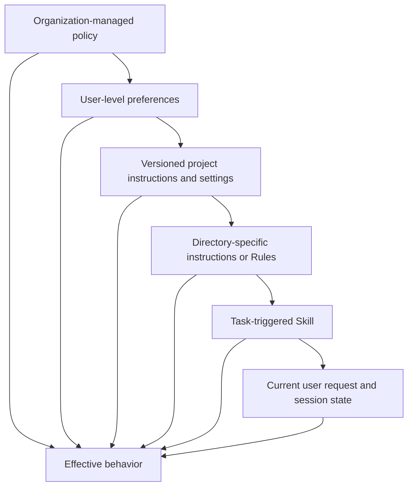
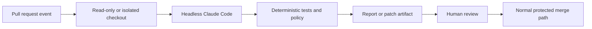

# Claude Code Scales Through Shared Constraints | Claude Code 靠共享约束实现规模化

> A team does not need one giant prompt. It needs a small project contract, reusable procedures, deterministic checks, and versioned configuration.

> **【中文解读】** 本课回答"一个团队如何与 Claude Code 一起规模化"：答案不是写一个巨大的提示词，而是建立四类共享约束——精简的项目契约（`CLAUDE.md`）、按最窄持久作用域放置的 Rules/Skills/Commands/Agents、像生产代码一样评审的 settings 与权限模式、以及可版本化的 hook 与 CI 集成。全课主线是把"靠提示词记住纪律"换成"靠作用域 + 确定性检查 + 版本化配置"，让一百个开发者得到一致且可审计的行为。考试高频点：作用域选择、权限模式的真实边界、hook 退出码语义、worktree 隔离能隔离什么不能隔离什么、CI 中无头运行的最小授权。

> 🔗 **【前置】** 学本课前请先掌握：(1) 12 课《Agent SDK 是执行框架，不是许可》——理解 harness 与 hook 生命周期，本课的 hook 章节直接建立在它之上；(2) 14 课《评估把 Agent 行为变成工程证据》——理解为什么模型或配置变更必须跑代表性工作流 eval。

**Type:** Learn | **类型:** 学习
**Languages:** Python | **语言:** Python
**Prerequisites:** [The Agent SDK Is a Harness, Not Permission](../../12-claude-agent-sdk-and-hooks/), [Evals Turn Agent Behavior Into Engineering Evidence](../../14-evals-testing-debugging-and-observability/) | **前置知识:** 12 Agent SDK 是执行框架，不是许可；14 评估把 Agent 行为变成工程证据
**Time:** ~170 minutes | **时间:** 约 170 分钟

## Learning Objectives | 学习目标

- Design a compact `CLAUDE.md` that functions as project onboarding
  中文翻译：设计一份精简的 `CLAUDE.md`，让它承担项目入职引导的职能。
- Place instructions, settings, Rules, Skills, agents, hooks, and MCP configuration at the correct scope
  中文翻译：把指令、设置、Rules、Skills、agents、hooks 和 MCP 配置放到正确的作用域。
- Operate permission modes, context recovery, goals, loops, worktrees, and schedules without losing approval boundaries
  中文翻译：操作权限模式、上下文恢复、goal、loop、worktree 与定时任务，同时不丢掉审批边界。
- Version model, prompt, plugin, and team configuration changes
  中文翻译：对模型、提示词、插件和团队配置的变更做版本化管理。
- Integrate Claude Code into CI as a bounded contributor rather than an unreviewed deployer
  中文翻译：把 Claude Code 集成进 CI 时让它做受约束的贡献者，而不是无人评审的部署者。
- Evaluate team workflows through artifacts, tests, traces, and recovery points
  中文翻译：通过产物、测试、轨迹和恢复点评估团队工作流。

## The 900-Line Instruction File | 900 行指令文件

> **【中文解读】** 本节是全课的反面案例：团队把每一次纠错都追加进 `CLAUDE.md`，文件膨胀到 900 行——架构历史、API 文档、风格意见、发布步骤、安全规则混在一起，Claude 每次会话都要全文读取，重要命令与过时叙述互相竞争注意力。结果是开发者不再评审变更，一条"用已废弃测试命令"的旧指令让 Agent 反复误报成功。关键概念是 **context debt（上下文债务）**：文件越来越大不等于记忆越来越好，只等于利息越来越贵。`CLAUDE.md` 应该是一份精确的入职脚本，而不是一本百科全书。

A team adds every correction to `CLAUDE.md`. It contains architecture history, API documentation, style opinions, release steps, security rules, examples, troubleshooting, and task-specific playbooks.

> 一个团队把每一次纠错都追加进 `CLAUDE.md`。它包含架构历史、API 文档、风格意见、发布步骤、安全规则、示例、故障排查和任务专属手册。

Claude reads it every session. Important commands compete with obsolete prose. Developers stop reviewing changes because the file is too large. One old line says to use a retired test command, and the agent repeatedly reports success after running the wrong suite.

> Claude 每次会话都要读它。重要命令与过时的散文互相竞争注意力。因为文件太大，开发者不再评审变更。一行旧指令说要用已退役的测试命令，于是 Agent 反复运行错误的测试套件并报告成功。

The team has not created memory. It has created context debt.

> 这个团队创造的不是记忆，而是上下文债务（context debt）。

`CLAUDE.md` should act like a precise onboarding script: what this repository is, how to navigate it, how to build and test it, which constraints are non-obvious, and where deeper documentation lives.

> `CLAUDE.md` 应该像一份精确的入职脚本：这个仓库是什么、如何浏览它、如何构建和测试它、哪些约束不是显而易见的、更深入的文档在哪里。

## Put Information at Its Narrowest Durable Scope | 把信息放到最窄的持久作用域

> **【中文解读】** 本节给出全课最重要的设计规则：**宽策略放宽作用域，项目事实放进仓库，任务流程只在被用到时加载**。Claude Code 可以从组织托管策略、用户偏好、项目指令、目录级 Rules、按需触发的 Skill 一直到当前会话状态等多个作用域加载配置；精确的层级和文件名是产品细节，但这条设计规则稳定不变。两条反模式：宽控制不应轻易被一个项目任务削弱；窄指令不应被复制到全局。当多个来源冲突时，要让优先级显式可见，而不是留下两句矛盾的话然后指望模型选更安全的那句。

Claude Code can load configuration and instructions from several scopes. The exact hierarchy and filenames are product details, but the design rule is stable: broad policy belongs at broad scope, project facts belong in the repository, and task procedure should load only when relevant.

> Claude Code 可以从多个作用域加载配置和指令。确切的层级和文件名是产品细节，但设计规则是稳定的：宽策略属于宽作用域，项目事实属于仓库，任务流程只应在被用到时加载。



Broad controls should not be easy for a project task to weaken. Narrow instructions should not be copied globally. Check current [Claude Code settings](https://code.claude.com/docs/en/settings) and [Memory](https://code.claude.com/docs/en/memory) documentation for the precise precedence, managed-policy locations, imports, and discovery behavior in the installed version.

> 宽控制不应该容易被一个项目任务削弱。窄指令不应该被复制到全局。请查阅当前的 [Claude Code 设置](https://code.claude.com/docs/en/settings)与[记忆](https://code.claude.com/docs/en/memory)文档，确认你所装版本中确切的优先级、托管策略位置、导入与发现行为。

When sources conflict, make precedence visible. Do not rely on two contradictory sentences and hope the model chooses the safer one.

> 当多个来源冲突时，让优先级显式可见。不要指望模型在两句矛盾的话里碰巧选中更安全的那句。

## Write a Lean CLAUDE.md | 写一份精简的 CLAUDE.md

> **【中文解读】** 本节给出 `CLAUDE.md` 的正反清单。要写进去的只有六类：目的与技术栈、规范的构建/测试/lint/运行命令、重要目录地图、仓库特有的风格或架构规则、安全与外部动作边界、指向权威深层文档的链接。必须排除的包括：Claude 本来就知道的通用建议、整本 API 参考、临时任务状态、机密与环境值、只有某个专门工作流用到的指令、没人执行也没人评审的规则。收尾金句值得背下来："每次都跑格式化工具"的最强修复可能是一个 post-edit hook 加 CI 检查，而不是再加一句话——**能用确定性检查解决的，不要用提示词解决**。

Start with facts Claude repeatedly needs:

> 从 Claude 反复需要的事实开始：

```markdown
# Repository guide

## Purpose
This repository is a Python service that routes support tickets.

## Commands
- Install: `python3 -m venv .venv && .venv/bin/pip install -r requirements.txt`
- Focused tests: `python3 -m unittest discover tests -v`
- Full validation: `./scripts/validate.sh`

## Layout
- `src/`: application code
- `tests/`: unit and integration tests
- `docs/architecture.md`: boundaries and decision records

## Constraints
- Never commit credentials or `.env` files.
- Preserve public API compatibility unless the task explicitly changes it.
- Require explicit approval before deployment or external messages.
```

Include:

> 应该包含：

- Purpose and stack.
  中文翻译：目的与技术栈。
- Canonical build, test, lint, and run commands.
  中文翻译：规范的构建、测试、lint 和运行命令。
- Important directory map.
  中文翻译：重要目录地图。
- Repository-specific style or architecture rules.
  中文翻译：仓库特有的风格或架构规则。
- Safety and public-action boundaries.
  中文翻译：安全与公开动作的边界。
- Links to authoritative deeper documents.
  中文翻译：指向权威深层文档的链接。

Exclude:

> 必须排除：

- Generic advice Claude already knows.
  中文翻译：Claude 本来就知道的通用建议。
- Entire API references.
  中文翻译：整本 API 参考。
- Temporary task status.
  中文翻译：临时任务状态。
- Secrets or environment values.
  中文翻译：机密或环境变量值。
- Instructions used only by one specialized workflow.
  中文翻译：只有某个专门工作流会用到的指令。
- Rules that are not enforced or reviewed.
  中文翻译：没人执行也没人评审的规则。

Begin small. When the same correction occurs across several sessions, decide whether it belongs in `CLAUDE.md`, a Rule, a Skill, a hook, a test, or actual code. The strongest fix for "always run the formatter" may be a post-edit hook and CI check, not another sentence.

> 从小处开始。当同一条纠错在多个会话里反复出现时，判断它应该进 `CLAUDE.md`、一条 Rule、一个 Skill、一个 hook、一个测试，还是真正的代码。"每次都跑格式化工具"的最强修复可能是一个 post-edit hook 加 CI 检查，而不是再加一句话。

## Rules, Skills, Commands, and Agents | Rules、Skills、命令与 Agents

> **【中文解读】** 本节把四个扩展面按"解决什么问题"分开：**Rules** 承载面向文件族或仓库区域的约束，用目录作用域避免在改数据库迁移时白白消耗前端规则；**Skills** 打包可复用的流程、参考资料、脚本与资产，靠"短描述 + 按需加载全文"实现渐进披露（progressive disclosure）——永远全量加载的手册型 Skill 只是又一个系统提示词；**Commands** 是用户显式调用的工作流，参数要当不可信输入处理，命令不能绕过工具授权；**Agents/子 Agent** 定义隔离的角色、工具集与指令，只读评审者不应继承编辑与部署工具，生成者与评审者不应共享隐藏推理。产品细节（文件位置、frontmatter 字段）随版本演进，要以当前官方文档为准并给仓库示例标注目标版本。

These surfaces solve different problems.

> 这些扩展面解决的是不同的问题。

### Rules

Use Rules or directory-scoped instructions for constraints that apply to a file family or area of the repository. A frontend rule should not consume context while editing database migrations.

> 用 Rules 或目录作用域指令来承载只适用于某个文件族或仓库区域的约束。前端规则不应该在编辑数据库迁移时消耗上下文。

Keep each rule coherent and testable. State the mechanism and source of truth. Avoid duplicating the same instruction across root and directory files because drift becomes inevitable.

> 让每条规则自洽且可测试。写明机制与事实来源。避免在根文件和目录文件里重复同一条指令，因为漂移不可避免。

### Skills

A Skill packages reusable procedure, references, scripts, and assets. Its short description helps Claude decide when to load the full material.

> Skill 打包可复用的流程、参考资料、脚本和资产。它的简短描述帮助 Claude 决定何时加载完整材料。

Use a Skill for work such as database migration review, release-note generation, security threat modeling, or a house documentation style. Keep the core session prompt small. Version the Skill with the repository or an approved distribution mechanism.

> 把 Skill 用于数据库迁移评审、发布说明生成、安全威胁建模或团队文档风格这类工作。保持核心会话提示词精简。让 Skill 随仓库或经批准的分发机制一起版本化。

Progressive disclosure is the benefit. A Skill that is always loaded and contains the whole handbook is another system prompt.

> 渐进披露（progressive disclosure）才是收益所在。一个永远全量加载、装着整本手册的 Skill 只是又一个系统提示词。

### Commands

Commands provide an explicit user-invoked workflow. They work well when a developer should deliberately start an operation such as `/release-check` or `/review-migration`.

> 命令提供用户显式调用的工作流。当开发者应当有意识地启动某个操作（如 `/release-check` 或 `/review-migration`）时它们最合适。

Treat command arguments as untrusted input. A command does not bypass tool authorization or approval.

> 把命令参数当作不可信输入。命令不能绕过工具授权或审批。

### Agents

Custom agents or subagents define isolated roles, tool sets, and instructions. Use them for independent review, narrow expertise, or parallel work with separate ownership.

> 自定义 agents 或子 agents 定义隔离的角色、工具集和指令。把它们用于独立评审、狭窄的专业领域，或所有权分开的并行工作。

A read-only reviewer should not inherit edit and deployment tools. A generator and evaluator should not share hidden reasoning if independence matters.

> 只读评审者不应继承编辑与部署工具。当独立性重要时，生成者和评估者不应共享隐藏推理。

Product note, verified 2026-08-09: exact filesystem locations, frontmatter fields, command behavior, and agent configuration evolve. Use current [Claude Code documentation](https://code.claude.com/docs/en/overview) and label repository examples with the version they target.

> 产品说明（2026-08-09 核实）：确切的文件系统位置、frontmatter 字段、命令行为和 agent 配置会持续演进。请使用当前的 [Claude Code 文档](https://code.claude.com/docs/en/overview)，并为仓库中的示例标注它们面向的版本。

## Settings Are Code | 设置即代码

> **【中文解读】** 本节的核心口号是 **"settings 是代码"**：团队设置控制权限、环境、hooks、模型行为、MCP 服务器与插件，必须像生产代码一样评审。作用域分四层：组织策略放不可协商的限制、项目设置提交进仓库作为共享安全默认值、本地设置放不该提交的机器特定实验、环境变量放机密名称与部署特定值。红线：绝不把令牌提交进 settings；绝不假设一条 deny 规则就是沙箱；用无害 fixture 实测权限行为。金句："一个能通过解析的 settings 文件，不能证明已安装的版本认得每一个键。"

Team settings control permissions, environment, hooks, model behavior, MCP servers, plugins, and other product capabilities. Review them like production code.

> 团队设置控制权限、环境、hooks、模型行为、MCP 服务器、插件和其他产品能力。要像评审生产代码一样评审它们。

Separate scopes:

> 分开作用域：

- Organization policy for non-negotiable restrictions.
  中文翻译：组织策略承载不可协商的限制。
- Project settings committed for shared safe defaults.
  中文翻译：项目设置提交进仓库，作为共享的安全默认值。
- Local settings for machine-specific paths or experiments that should not be committed.
  中文翻译：本地设置承载不该提交的机器特定路径或实验。
- Environment variables for secret names and deployment-specific values.
  中文翻译：环境变量承载机密名称和部署特定的值。

Never commit tokens inside settings. Never assume a deny pattern is a sandbox. Test permission behavior with harmless fixtures.

> 绝不把令牌提交进 settings。绝不假设一条 deny 模式就是沙箱。用无害的 fixture 测试权限行为。

When changing settings:

> 修改 settings 时：

1. State the intended behavior.
  中文翻译：写明预期行为。
2. Pin or record the relevant Claude Code version.
  中文翻译：锁定或记录相关的 Claude Code 版本。
3. Add a focused acceptance test or manual verification script.
  中文翻译：加一个聚焦的验收测试或手工验证脚本。
4. Run a denied action and an allowed action.
  中文翻译：各跑一次被拒绝的动作和被允许的动作。
5. Review the effective merged configuration.
  中文翻译：评审最终生效的合并配置。
6. Provide rollback instructions.
  中文翻译：提供回滚说明。

A settings file that parses is not proof the installed version honors every key.

> 一个能通过解析的 settings 文件，并不能证明已安装的版本认得每一个键。

## Permission Modes Set a Baseline | 权限模式设定基线

> **【中文解读】** 本节是考试重灾区。权限模式只控制"Claude 提议工具调用时发生什么"，它不改仓库策略、不授予凭据、也不让外部动作变得可逆。六个模式的边界要逐个记：`default` 读取继续、编辑与命令可能提示；`acceptEdits` 只放宽文件编辑与常见文件系统操作；`plan` 只读探索、源码编辑仍被阻止；`auto` 是研究预览，由独立分类器评估动作但显式 ask 控件仍可提示；`dontAsk` 把一切会提示的动作直接拒绝，只放行预先批准的工作；`bypassPermissions` 绕过内置权限检查，但 deny/ask 规则、组织连接器控制与必需的用户交互**在每个模式（含 bypassPermissions）都会求值**。硬边界属于 deny 规则、沙箱、凭据范围、分支保护或 hook——不属于一句可能被 auto 模式转录压缩掉的提示词。

Permission mode controls what happens when Claude proposes a tool call. It does
not change repository policy, grant a credential, or make an external action
reversible.

> 权限模式控制 Claude 提议工具调用时发生什么。它不改变仓库策略、不授予凭据，也不让外部动作变得可逆。

Product note, verified 2026-08-09: current Claude Code documents these exact
modes. Their availability and UI labels vary by product surface, plan, provider,
model, administrator policy, and installed version.

> 产品说明（2026-08-09 核实）：当前 Claude Code 文档记载了这些确切的模式。它们的可用性与 UI 标签因产品界面、套餐、提供商、模型、管理员策略和已安装版本而异。

| Mode | Practical boundary | Appropriate use |
|---|---|---|
| `default` | Reads proceed; edits and commands may prompt | First use, sensitive repositories |
| `acceptEdits` | File edits and common filesystem operations proceed; other commands still prompt | Local code iteration with diff review |
| `plan` | Reads and exploration proceed; classifier-approved commands may run when auto mode is available, but source edits remain blocked | Approve scope and approach first |
| `auto` | A separate classifier evaluates actions; explicit ask controls can still prompt | Research-preview autonomy in a trusted direction |
| `dontAsk` | Anything that would prompt is denied; only pre-approved work proceeds | Locked-down CI and scripts |
| `bypassPermissions` | Built-in permission checks are bypassed; configured deny, ask, and user-interaction controls still apply | An isolated container or VM with no valuable credentials |

Use `--permission-mode <mode>` for a session or the `permissions.defaultMode`
setting where supported. Permission rules then narrow calls through `deny`,
`ask`, and `allow` patterns. Explicit deny and ask rules, organization connector
controls, and required user interaction are evaluated in every mode, including
`bypassPermissions`. A hard boundary belongs in a deny rule, sandbox, credential
scope, branch protection, or hook, not in a sentence that an auto-mode
transcript may later compact away.

> 在支持的场合，为会话使用 `--permission-mode <mode>`，或使用 `permissions.defaultMode` 设置。权限规则随后通过 `deny`、`ask` 和 `allow` 模式收窄调用。显式的 deny 与 ask 规则、组织连接器控制以及必需的用户交互在**每个模式**中都会被求值，包括 `bypassPermissions`。硬边界应该放在 deny 规则、沙箱、凭据范围、分支保护或 hook 里，而不是放在一句可能随后被 auto 模式转录压缩掉的话里。

`acceptEdits` means exactly that edits need less ceremony. It does not auto-accept
publishing, deployment, arbitrary shell commands, or messages. `auto` is a
research preview, not a proof of safety. `bypassPermissions` is not appropriate
on a normal laptop or merely because the session is in a Git worktree.

> `acceptEdits` 的含义仅仅是编辑不再需要繁琐确认。它不会自动接受发布、部署、任意 shell 命令或消息。`auto` 是研究预览，不是安全证明。`bypassPermissions` 不适合在普通笔记本电脑上使用，也不因为"会话在 Git worktree 里"就变得合适。

## Hooks Turn Advice Into Checks | Hook 把建议变成检查

> **【中文解读】** 本节把 hook 定位为"把口头建议变成确定性检查"的机制，典型用途：机密路径读取前置拦截、保护分支提交拦截、外部写入强制审批、编辑后格式化、变更后跑聚焦测试、工具输出脱敏、审计事件记录、检查有证据前阻止完成。工程约束：hook 必须快（慢 hook 反复运行会毁掉交互延迟）、要有超时与明确的失败行为、安全 hook 在无法评估请求时必须 fail closed。**退出码语义是必考点**：exit `0` + stdout 一个 JSON 对象 = 结构化控制；exit `2` + stderr 原因 = 事件专属阻断；exit `1` 对多数事件只是非阻断错误——所以策略 hook 不能依赖普通 Unix 失败语义。`PreToolUse` 与 `PermissionRequest` 的输出形状不同，allow 决定不能覆盖匹配的 deny/ask 规则。

Use hooks for deterministic lifecycle actions:

> 用 hook 承载确定性的生命周期动作：

- Block secret-path reads before the tool executes.
  中文翻译：在工具执行前拦截对机密路径的读取。
- Block commits to protected branches.
  中文翻译：拦截向保护分支的提交。
- Require approval for external writes.
  中文翻译：外部写入前强制审批。
- Format changed files after edits.
  中文翻译：编辑后格式化变更的文件。
- Run focused tests after a code change.
  中文翻译：代码变更后运行聚焦测试。
- Redact tool output.
  中文翻译：对工具输出脱敏。
- Record audit events.
  中文翻译：记录审计事件。
- Prevent completion until required checks have evidence.
  中文翻译：在必需检查拿到证据之前阻止宣告完成。

Keep hooks fast. A slow hook runs repeatedly and destroys interactive latency. Use timeouts and clear failure behavior. A security hook should fail closed when it cannot evaluate the request.

> 保持 hook 快速。慢 hook 会反复运行并毁掉交互延迟。使用超时和明确的失败行为。安全 hook 在无法评估请求时应当 fail closed（拒绝放行）。

Claude Code passes hook input as JSON. A command hook has two different control
paths:

> Claude Code 以 JSON 传入 hook 输入。命令 hook 有两条不同的控制路径：

- Exit `0` and print one JSON object to stdout for structured control.
  中文翻译：exit `0` 并向 stdout 打印一个 JSON 对象，用于结构化控制。
- Exit `2` and print a reason to stderr for the event-specific blocking action.
  中文翻译：exit `2` 并向 stderr 打印原因，用于事件专属的阻断动作。

Do not combine them. Claude Code processes structured JSON only on exit `0`;
JSON printed with exit `2` is ignored. Exit `1` is a non-blocking error for most
events, so a policy hook must not rely on ordinary Unix failure semantics.

> 不要混用两者。Claude Code 只在 exit `0` 时处理结构化 JSON；exit `2` 时打印的 JSON 会被忽略。对多数事件而言 exit `1` 是非阻断错误，所以策略 hook 绝不能依赖普通的 Unix 失败语义。

`PreToolUse` and `PermissionRequest` also use different output shapes. A
`PreToolUse` hook can allow, deny, ask, or defer with
`hookSpecificOutput.permissionDecision`:

> `PreToolUse` 与 `PermissionRequest` 也使用不同的输出形状。`PreToolUse` hook 可以通过 `hookSpecificOutput.permissionDecision` 给出 allow、deny、ask 或 defer：

```json
{
  "hookSpecificOutput": {
    "hookEventName": "PreToolUse",
    "permissionDecision": "deny",
    "permissionDecisionReason": "Publishing requires a human-controlled workflow"
  }
}
```

A `PermissionRequest` hook runs only when Claude Code is about to prompt, or
would have to deny because it cannot prompt. It uses a nested decision object:

> `PermissionRequest` hook 只在 Claude Code 即将弹出提示、或因无法提示而不得不拒绝时运行。它使用一个嵌套的 decision 对象：

```json
{
  "hookSpecificOutput": {
    "hookEventName": "PermissionRequest",
    "decision": {
      "behavior": "deny",
      "message": "External publishing requires interactive human approval",
      "interrupt": false
    }
  }
}
```

An allow decision cannot override a matching deny or ask rule. Exit `2` blocks a
`PreToolUse` call and denies a `PermissionRequest`, but event behavior differs:
for example, a `PostToolUse` hook runs after the action and cannot undo it. Read
the event table before treating any hook as enforcement.

> allow 决定不能覆盖匹配的 deny 或 ask 规则。exit `2` 会阻断 `PreToolUse` 调用并拒绝 `PermissionRequest`，但各事件行为不同：例如 `PostToolUse` hook 在动作之后运行，无法撤销它。把任何 hook 当作强制手段之前，先读事件表。

Store shared hooks in reviewed project code when appropriate, but ensure the constrained agent cannot silently rewrite the policy and then run the prohibited action. Organization controls, repository permissions, and sandbox boundaries must protect the hook layer.

> 在合适的场合把共享 hook 存放在经过评审的项目代码里，但要确保受约束的 agent 无法悄悄改写策略、再运行被禁止的动作。组织控制、仓库权限和沙箱边界必须保护 hook 这一层。

## MCP and Plugins Are Installed Capability | MCP 与插件是安装进来的能力

> 本节提醒：MCP 服务器或插件一旦安装，就同时改变了**攻击面**和**上下文面**——它们能带来工具、提示词、hooks、agents、Skills、命令或语言智能。团队评审清单八条：发布者与源仓库、确切版本与更新策略、安装的组件、工具与文件系统权限、网络目的地、请求的机密与环境变量、在无头/CI 环境中的行为、卸载与回滚步骤。三个机制的分工不要混淆：MCP 标准化外部能力连接，插件打包 Claude Code 扩展，Skill 承载流程与配套材料——按需求选择，不按机制的热度选择。

An MCP server or plugin can add tools, prompts, hooks, agents, Skills, commands, or language intelligence. Installation changes the attack surface and context surface.

> 一个 MCP 服务器或插件可以添加工具、提示词、hooks、agents、Skills、命令或语言智能。安装会同时改变攻击面和上下文面。

Team review should cover:

> 团队评审应覆盖：

- Publisher and source repository.
  中文翻译：发布者与源仓库。
- Exact version and update policy.
  中文翻译：确切版本与更新策略。
- Components installed.
  中文翻译：安装了哪些组件。
- Tool and filesystem permissions.
  中文翻译：工具与文件系统权限。
- Network destinations.
  中文翻译：网络目的地。
- Secrets and environment variables requested.
  中文翻译：请求了哪些机密与环境变量。
- Behavior in headless or CI environments.
  中文翻译：在无头或 CI 环境中的行为。
- Uninstall and rollback steps.
  中文翻译：卸载与回滚步骤。

Prefer a small approved catalog. Pin versions where supported. Test upgrades on a representative repository and eval set. Do not install a large plugin only to use one small procedure that could be a reviewed local Skill.

> 优先维护一份小而经批准的目录。在支持的场合锁定版本。在有代表性的仓库和 eval 集上测试升级。不要为了一个小流程安装一个大插件——那个流程本可以做成一个经过评审的本地 Skill。

Plugins and MCP are not interchangeable. MCP standardizes external capability connections. A plugin packages Claude Code extensions. A Skill carries procedure and supporting material. Choose from the need, not the popularity of the mechanism.

> 插件和 MCP 不能互换。MCP 标准化外部能力连接；插件打包 Claude Code 扩展；Skill 承载流程与配套材料。按需求选择，而不是按机制的热度选择。

## Sessions Need Recovery Discipline | 会话需要恢复纪律

> **【中文解读】** 本节的底线：**会话历史不是系统的记录源（system of record）**。恢复重要工作前的六步清单：查看当前 Git 状态与 diff、重跑相关测试、核对外部副作用、确认分支与仓库根、检查待处理的审批、确认指令/工具/模型配置是否变了。五条会话命令各司其职：`/context` 诊断上下文窗口被什么占用；`/compact [focus]` 把之前的对话替换为聚焦摘要；自动压缩在接近上限时清理旧工具输出；`/clear` 开一个全新对话（旧的仍可恢复），用于切换到无关工作或新的信任边界；`/rewind`（或双击 `Esc`）从检查点恢复代码、对话或做摘要。压缩会丢失普通转录里的指令——项目根 `CLAUDE.md` 与自动记忆会重新加载，路径作用域规则要在再次读到匹配文件时才重载；因此持久约束必须放进版本化配置，并在压缩后重申当前验收边界。

Claude Code sessions help developers resume work, fork an investigation, and retain local context. Session history is not the system of record.

> Claude Code 会话帮助开发者恢复工作、分叉调查线、保留本地上下文。会话历史不是系统的记录源。

Before resuming consequential work:

> 在恢复有后果的工作之前：

- Inspect the current Git status and diff.
  中文翻译：查看当前 Git 状态与 diff。
- Re-run the relevant tests.
  中文翻译：重新运行相关测试。
- Reconcile external side effects.
  中文翻译：核对外部副作用。
- Confirm the branch and repository root.
  中文翻译：确认分支与仓库根。
- Review pending approvals.
  中文翻译：检查待处理的审批。
- Check whether instructions, tools, or model configuration changed.
  中文翻译：确认指令、工具或模型配置是否发生了变化。

Clear or start a new session when accumulated context creates drift or when crossing a tenant or confidentiality boundary. Use compaction for continuity, not as proof that every constraint survived.

> 当累积的上下文造成漂移，或跨越租户/保密边界时，清除或新开会话。把压缩用于保持连续性，而不是当作"每条约束都活了下来"的证明。

Commit small recovery points when repository policy allows. A session summary cannot replace source control.

> 在仓库策略允许时提交小的恢复点。会话摘要不能替代版本控制。

Use the session commands for different jobs:

| Mechanism | Effect | Use when |
|---|---|---|
| `/context` | Shows what consumes the context window | Diagnose memory, skills, tools, and message bloat |
| `/compact [focus]` | Replaces prior conversation with a focused summary | Continue the same task with less history |
| Automatic compaction | Clears old tool output, then summarizes near the limit | Normal long-session continuity |
| `/clear` | Starts an empty conversation; the old one remains resumable | Switch to unrelated work or a new trust boundary |
| `/rewind` or double `Esc` | Restores code, conversation, or summarizes from a checkpoint | Recover a tracked edit or remove a bad conversational branch |

Compaction can lose ordinary transcript instructions. Project-root `CLAUDE.md`
and auto memory reload, while path-scoped rules reload when a matching file is
read again. Put durable constraints in versioned configuration and restate the
current acceptance boundary after compaction.

> 压缩可能丢失普通转录里的指令。项目根 `CLAUDE.md` 与自动记忆会重新加载，而路径作用域的规则要在再次读到匹配文件时才重载。把持久约束放进版本化配置，并在压缩后重申当前的验收边界。

Rewind is a convenience layer, not source control. It tracks direct Claude Code
file edits, but not changes made by shell commands, external systems, or most
subagents. Foreground Skills that run with `context: fork` are an exception:
their direct edits are tracked. Inspect Git and external state before retrying
an operation.

> Rewind 是便利层，不是版本控制。它跟踪 Claude Code 的直接文件编辑，但不跟踪 shell 命令、外部系统或大多数子 agents 所做的变更。例外：以 `context: fork` 运行的前台 Skills，其直接编辑会被跟踪。重试操作之前先检查 Git 与外部状态。

## Autonomy Has Different Stop Conditions | 自主运行有不同的停止条件

> 本节区分三种"自动化"，它们的停止条件完全不同。**Goal 会话**：`/goal <condition>` 让上一轮结束后自动开启下一轮，直到一个独立的小模型评估器判定条件满足——评估器只读对话证据，不会独立跑测试或检查文件，所以条件必须写成可度量的结果 + 证明命令 + 必须保持为真的约束；时间/轮数条款对评估器可见但不是硬性运行时限制，硬限制要在 goal 会话之外强制。一个会话只能有一个活跃 goal，`/goal clear` 停止它。**会话内 loop 与定时提示**：`/loop 5m ...` 在当前 CLI 会话保持打开期间定时投递提示，继承会话的工具与权限，不是持久任务基础设施。**持久调度器**按边界选——云端 Routine（研究预览，自主运行无审批提示，所以必须移除未用连接器、收窄分支权限）、桌面定时任务（机器与本地未提交文件是边界的一部分时）、GitHub Actions（触发器与权限应放进经过评审的仓库工作流配置时）。

Do not treat every repeated workflow as the same loop.

> 不要把每个重复性工作流都当成同一种循环。

### Goal Sessions

`/goal <condition>` starts another turn whenever the prior turn ends until a
separate small-model evaluator decides that the condition is satisfied. The
evaluator reads conversation evidence; it does not independently run tests or
inspect files. State a measurable result, the command that proves it, and
constraints that must remain true. A time or turn clause is visible to the
evaluator, but it is not a hard runtime limit; enforce hard limits outside the
goal session.

> `/goal <condition>` 在上一轮结束后就开启新的一轮，直到一个独立的小模型评估器判定条件已满足。评估器读取的是对话证据；它不会独立运行测试或检查文件。所以要写明可度量的结果、证明它的命令、以及必须保持为真的约束。时间或轮数条款对评估器可见，但不是硬性运行时限制；硬限制要在 goal 会话之外强制执行。

```text
/goal tests/auth exits 0 and lint is clean, without changing fixtures, or stop after 15 turns
```

One goal can be active in a session. `/goal clear` stops it. A goal does not
change permissions, so default mode may still prompt. Pairing a goal with auto
mode reduces ordinary prompts, but explicit ask controls can still prompt. It
also increases the need for an isolated environment, deny rules, budgets, and
observable evidence.

> 一个会话中只能有一个活跃 goal。`/goal clear` 停止它。goal 不改变权限，所以 default 模式仍可能弹提示。goal 与 auto 模式搭配能减少普通提示，但显式 ask 控件仍可能弹提示。这同时也提高了对隔离环境、deny 规则、预算和可观察证据的需求。

### In-Session Loops and Scheduled Prompts

`/loop 5m check whether CI finished` schedules a prompt while the current CLI
session stays open. With no fixed interval, Claude may choose the next delay.
These tasks inherit the session's tools and permissions, run between turns, and
are not durable job infrastructure.

> `/loop 5m check whether CI finished` 会在当前 CLI 会话保持打开期间定时投递提示。若无固定间隔，Claude 可以自行选择下一次延迟。这类任务继承会话的工具与权限、在轮次之间运行，并且不是持久的作业基础设施。

Use the right persistent scheduler:

> 选用正确的持久调度器：

- A cloud Routine for a saved prompt, selected repositories, connectors, and
  schedule, API, or GitHub trigger. Routines are a research preview and run
  autonomously without approval prompts, so remove every unused connector and
  keep branch authority narrow.
  中文翻译：云端 Routine——保存的提示词、选定的仓库、连接器，以及定时/API/GitHub 触发器。Routine 是研究预览，会在没有审批提示的情况下自主运行，所以要移除每一个未使用的连接器，并把分支权限收窄。
- A Desktop scheduled task when the machine and local uncommitted files are part
  of the intended boundary.
  中文翻译：桌面定时任务——当机器本身和本地未提交文件属于预期边界的一部分时使用。
- GitHub Actions when the trigger and permissions should live in reviewed
  repository workflow configuration.
  中文翻译：GitHub Actions——当触发器与权限应当放进经过评审的仓库工作流配置时使用。

`/schedule` creates or manages cloud Routines where available. Product flags,
limits, account eligibility, and exact scheduling behavior are version-sensitive;
the durable design is a self-contained prompt, explicit success condition,
minimum identity, and an auditable result.

> `/schedule` 在可用的地方创建或管理云端 Routine。产品开关、限额、账户资格和确切的调度行为都对版本敏感；持久的设计是：自包含的提示词、显式的成功条件、最小身份、可审计的结果。

## Parallel Work Needs Isolated Files | 并行工作需要隔离的文件

> 本节讲并行协作的正确单位：两个 agent 在同一个 checkout 里编辑，即使提示词写着不同任务也会互相覆盖——所以独立会话要用 worktree：`claude --worktree <name>` 默认在 `.claude/worktrees/<name>/`、独立的 `worktree-<name>` 分支上工作。**注意 worktree 的边界**：它隔离工作文件与分支，但**共享**仓库 Git 元数据、项目插件和已保存的权限批准，也**不隔离**网络、凭据、数据库或其他副作用。共享面要检查过才能说这次运行是隔离的。集成走正常 Git 评审，不要在活跃 checkout 之间复制文件。

Two agents editing one checkout can overwrite each other even when their prompts
name different tasks. Start independent Claude Code sessions in worktrees:

> 两个 agent 在同一个 checkout 里编辑会互相覆盖，即使它们的提示词写着不同的任务。让独立的 Claude Code 会话在 worktree 中启动：

```bash
claude --worktree auth-hardening
claude --worktree docs-refresh
```

Current Claude Code creates `.claude/worktrees/<name>/` on a separate
`worktree-<name>` branch by default. Give each session an owner, file boundary,
acceptance test, and integration contract. A custom subagent can declare
`isolation: worktree` when it must edit in parallel.

> 当前 Claude Code 默认在独立的 `worktree-<name>` 分支上创建 `.claude/worktrees/<name>/`。给每个会话指定所有者、文件边界、验收测试和集成契约。当自定义子 Agent 必须并行编辑时，可以声明 `isolation: worktree`。

Worktrees isolate working files and branches. They share repository Git metadata,
project plugins, and saved permission approvals, and they do not isolate network,
credentials, databases, or other side effects. Review those shared surfaces
before calling the run isolated. Integrate through normal Git review rather than
copying files between active checkouts.

> Worktree 隔离工作文件和分支。它们共享仓库 Git 元数据、项目插件和已保存的权限批准，而且不隔离网络、凭据、数据库或其他副作用。把这些共享面检查过之后，才能说这次运行是隔离的。通过正常的 Git 评审做集成，而不是在活跃 checkout 之间复制文件。

## Managed Review and the GitHub Action Are Different | 托管 Code Review 与 GitHub Action 是两回事

> 本节对比两个容易混淆的机制。**Anthropic 托管的 Code Review GitHub 集成**（产品说明 2026-08-09 核实）：面向 Team 和 Enterprise 套餐的研究预览，在 PR 上运行一队专门 agents、可放置带严重性标签的行内发现，可读取 `CLAUDE.md` 和 `REVIEW.md` 作为评审指引；其发现**不批准也不阻断** PR——合并门禁仍由分支保护和确定性检查决定。**官方 `anthropics/claude-code-action@v1`** 则在你自己的 GitHub Actions 工作流里运行 Claude Code：可响应授权的 `@claude` 提及，或对仓库事件与 cron 运行固定提示词；checkout 深度、token 权限、机密来源、工具、设置、模型与轮数限制都由你的工作流控制。共同红线：凭据放 GitHub Secrets 或工作负载身份、只授予必需的工作流权限、合并前人工评审所有变更；需要更强供应链固定的组织可以把 action 钉到经过评审的 commit SHA。

Product note, verified 2026-08-09: Anthropic's managed Code Review GitHub
integration is a research preview for Team and Enterprise plans. It runs a fleet
of specialized agents against pull requests and can place severity-tagged inline
findings. It can read `CLAUDE.md` and `REVIEW.md` for review guidance. Its
findings do not approve or block a pull request; branch protection and
deterministic checks still decide the merge gate.

> 产品说明（2026-08-09 核实）：Anthropic 托管的 Code Review GitHub 集成是面向 Team 与 Enterprise 套餐的研究预览。它针对 PR 运行一队专门 agents，并能放置带严重性标签的行内发现。它可以读取 `CLAUDE.md` 与 `REVIEW.md` 作为评审指引。它的发现不批准也不阻断 PR；合并门禁仍由分支保护和确定性检查决定。

The official `anthropics/claude-code-action@v1` runs Claude Code inside your own
GitHub Actions workflow. It can respond to an authorized `@claude` mention or run
a fixed prompt on repository events and cron schedules. The workflow controls
checkout depth, GitHub token permissions, secret source, tools, settings, model,
and turn limits.

> 官方的 `anthropics/claude-code-action@v1` 在你自己的 GitHub Actions 工作流内运行 Claude Code。它可以响应经授权的 `@claude` 提及，或对仓库事件与 cron 计划运行固定提示词。工作流控制 checkout 深度、GitHub token 权限、机密来源、工具、设置、模型和轮数限制。

```yaml
name: bounded-claude-review
on:
  pull_request:
    types: [opened, synchronize]
permissions:
  contents: read
  pull-requests: read
  id-token: write
jobs:
  review:
    runs-on: ubuntu-latest
    steps:
      - uses: actions/checkout@v6
      - uses: anthropics/claude-code-action@v1
        with:
          anthropic_api_key: ${{ secrets.ANTHROPIC_API_KEY }}
          prompt: "Review this pull request and emit evidence-backed findings only."
          claude_args: "--max-turns 6 --allowedTools Read,Grep,Glob"
```

Keep credentials in GitHub Secrets or workload identity, grant only required
workflow permissions, and review all changes before merge. Organizations that
need stronger supply-chain pinning can pin actions to reviewed commit SHAs while
tracking the documented major release.

> 把凭据放在 GitHub Secrets 或工作负载身份里，只授予必需的工作流权限，并在合并前评审所有变更。需要更强供应链固定的组织可以把 action 钉到经过评审的 commit SHA，同时跟踪文档记载的主版本。

## Headless Claude Code in CI | CI 中的无头 Claude Code

> 无头执行能自动分析代码、生成结构化输出、提出补丁，但也移走了平时能拦住危险请求的那个交互式人类。所以 CI 用法要设计成**有界作业**：最小仓库与 token 权限、不接触无关机密、钉住依赖与配置、网络允许清单、轮数/时间/成本限额、结构化输出 schema、产物与轨迹留存、不直接推送保护分支、合并/部署/消息/issue 评论前必须人工评审。红线：用短命的自动化凭据；把 PR 文本和仓库文件当不可信输入；绝不让评估不可信贡献的作业接触特权 token。

Headless execution can analyze code, generate structured output, or propose patches in automation. It also removes the interactive human who normally catches a dangerous request.

> 无头执行可以在自动化中分析代码、生成结构化输出或提出补丁。但它也移走了平时能拦住危险请求的那个交互式人类。

Design CI use as a bounded job:

> 把 CI 用法设计成一个有界作业：



Controls include:

> 控制项包括：

- Minimal repository and token permissions.
  中文翻译：最小的仓库与 token 权限。
- No access to unrelated secrets.
  中文翻译：不接触无关的机密。
- Pinned dependencies and configuration.
  中文翻译：钉住依赖与配置。
- Network allowlist.
  中文翻译：网络允许清单。
- Turn, time, and cost limits.
  中文翻译：轮数、时间与成本限额。
- Structured output schema.
  中文翻译：结构化输出 schema。
- Artifact and trace retention.
  中文翻译：产物与轨迹留存。
- No direct protected-branch push.
  中文翻译：禁止直接推送保护分支。
- Human review before merge, deployment, messages, or issue comments.
  中文翻译：合并、部署、消息或 issue 评论之前必须人工评审。

Use short-lived automation credentials. Treat pull request text and repository files as untrusted. Do not expose a privileged token to a job that evaluates untrusted contributions.

> 使用短命的自动化凭据。把 PR 文本和仓库文件当作不可信输入。绝不要让一个评估不可信贡献的作业接触特权 token。

Current headless flags, structured streaming modes, and permission options change. Verify the installed CLI's official [Headless mode](https://code.claude.com/docs/en/headless) documentation. Keep command examples version-labeled in your own repository.

> 无头标志、结构化流模式与权限选项都在变化。请核对所装 CLI 的官方[无头模式](https://code.claude.com/docs/en/headless)文档。在自己的仓库里为命令示例保留版本标注。

## Team Workflow From Plan to Proof | 从计划到证明的团队工作流

> 本节把全课串成九步开发循环：读精简项目契约 → 检查相关代码并先写计划 → 有外部影响的选择由开发者确认范围 → 做一次小的连贯变更 → hooks 格式化并跑聚焦检查 → 检查失败并修复原因 → 构建产物端到端运行 → 独立评审检查 diff 与证据 → 正常的源码保护接管合并与部署。证据要求按产物类型区分：视觉变更要看真实构建的截图、API 要检查线上线格式与序列化、CLI 要运行构建产物——团队指令应把这些证据要求写成仓库特有的规则。

A strong development loop looks like this:

> 一个强健的开发循环是这样的：

1. Claude reads the lean project contract.
  中文翻译：Claude 阅读精简的项目契约。
2. It inspects relevant code and writes a plan before broad edits.
  中文翻译：它检查相关代码，在大量编辑之前先写计划。
3. A developer confirms scope when choices have external impact.
  中文翻译：当选择有外部影响时，由开发者确认范围。
4. Claude makes a small coherent change.
  中文翻译：Claude 做一次小的连贯变更。
5. Hooks format and run focused checks.
  中文翻译：hooks 做格式化并运行聚焦检查。
6. Claude inspects failures and fixes causes.
  中文翻译：Claude 检查失败并修复原因。
7. The built artifact runs end to end.
  中文翻译：构建出的产物端到端运行。
8. An independent review checks the diff and evidence.
  中文翻译：独立评审检查 diff 与证据。
9. Normal source-control protections govern merge and deployment.
  中文翻译：正常的源码控制保护接管合并与部署。

For visual changes, serve the real build and inspect screenshots. For APIs, inspect the live wire and serialization. For CLIs, run the built artifact. Team instructions should state these evidence requirements when they are repository-specific.

> 视觉变更：serve 真实构建并检查截图。API：检查线上线格式与序列化。CLI：运行构建产物。当这些证据要求是仓库特有时，团队指令应把它们写明。

## Version Everything That Changes Behavior | 版本化一切会改变行为的东西

> 版本化清单六项：Claude Code 版本、模型配置或别名、根与目录指令、设置与 hooks、Skills/命令/agents/插件/MCP 服务器、自动化使用的提示词与输出 schema 版本。任何一项变化都要跑代表性工作流 eval，比较正确性、安全、轮数、延迟与成本——模型升级可能改善通用推理的同时改变某个关键工作流的工具选择。结论要辩证地记：**永远钉死不是答案，受控升级才是**——用兼容窗口、金丝雀仓库、回归套件和回滚路径。

Record:

> 记录：

- Claude Code version.
  中文翻译：Claude Code 版本。
- Model configuration or alias.
  中文翻译：模型配置或别名。
- Root and directory instructions.
  中文翻译：根指令与目录指令。
- Settings and hooks.
  中文翻译：设置与 hooks。
- Skills, commands, agents, plugins, and MCP servers.
  中文翻译：Skills、命令、agents、插件与 MCP 服务器。
- Prompt and output-schema versions used by automation.
  中文翻译：自动化使用的提示词与输出 schema 版本。

Run a representative workflow eval when any of them changes. Compare correctness, safety, turns, latency, and cost. A model upgrade can improve general reasoning while changing tool selection in one critical workflow.

> 其中任何一项变化时都运行一次代表性工作流 eval。比较正确性、安全性、轮数、延迟和成本。一次模型升级可能在改善通用推理的同时，改变了某个关键工作流的工具选择。

Pinning forever is not the answer. Controlled upgrades are. Use a compatibility window, canary repositories, regression suite, and rollback path.

> 永远钉死不是答案，受控的升级才是。使用兼容窗口、金丝雀仓库、回归套件和回滚路径。

## A Team Configuration Review | 一次团队配置评审

> 本节用一个反例 JSON 收拢全课：`"allow": ["Bash(*)", "Read(**)"]` 给了宽到失控的 shell 与文件系统权限；MCP 服务器用 `npx latest-company-server` 拉未钉版本的包，来源不明、没有网络边界、没有机密方案、没有审批策略。评审者的正确动作：索要能力清单，把每条权限收窄到实际工作流，然后用真实安装的版本各测一次允许操作和一次拒绝操作。结论金句：**更强的配置不自动等于更好的团队配置**。

Review the following hypothetical change:

> 评审下面这个假设的变更：

```json
{
  "permissions": {
    "allow": ["Bash(*)", "Read(**)"]
  },
  "mcpServers": {
    "company": {
      "command": "npx",
      "args": ["latest-company-server"]
    }
  }
}
```

Problems include broad shell and filesystem access, an unpinned package, unclear server provenance, no network boundary, no secret plan, and no approval policy. A more capable configuration is not automatically a better team configuration.

> 问题包括：宽到失控的 shell 与文件系统访问、未钉版本的包、不明的服务器来源、没有网络边界、没有机密方案、没有审批策略。更强的配置并不自动等于更好的团队配置。

The reviewer should request a capability inventory and narrow each permission to the actual workflow. Then test one allowed and one denied operation using the real installed version.

> 评审者应当索要能力清单，把每条权限收窄到实际工作流。然后用真实安装的版本各测试一次允许操作和一次拒绝操作。

## Interactive Lab | 交互实验室

```figure
15-team-agent-loop
```

Use the interactive loop to move one proposed team change through instruction,
execution, deterministic verification, review, and recovery. Change the scope
and enforcement controls and observe where a prompt-only rule stops being a
reliable team boundary.

> 用交互循环把一项提议的团队变更依次推进过指令、执行、确定性验证、评审与恢复。改变作用域与强制控制，观察"只写在提示词里的规则"在哪里不再是一条可靠的团队边界。

## Practice Lab | 练习实验室

Audit the hypothetical change above, narrow the shell and filesystem surface,
and define one allowed and one denied fixture plus a rollback condition.

> 审计上面的假设变更，收窄 shell 与文件系统面，并定义一个允许 fixture、一个拒绝 fixture 和一条回滚条件。

## Shipped Artifact | 交付产物

The filled [`outputs/team-configuration-review.md`](../outputs/team-configuration-review.md)
turns the review into a reusable capability, permission, context, autonomy,
isolation, scheduling, enforcement, and recovery record.
[`outputs/permission-request-decision.json`](../outputs/permission-request-decision.json)
is a validated `PermissionRequest` hook decision that denies external publishing.

> 填写好的 [`outputs/team-configuration-review.md`](../outputs/team-configuration-review.md) 把这次评审变成可复用的能力、权限、上下文、自主边界、隔离、调度、强制与恢复记录。[`outputs/permission-request-decision.json`](../outputs/permission-request-decision.json) 是一条经过验证的 `PermissionRequest` hook 决策——拒绝外部发布。

## Verify It | 验证

Edit a copy for your repository, then run the deterministic verifier:

> 为你的仓库编辑一份副本，然后运行确定性验证器：

```bash
cd certifications/claude/lessons/15-claude-code-for-development-teams
python3 code/main.py
python3 -m unittest discover -s code/tests -v
```

The verifier checks required ownership, allowed and denied fixtures, versioned
configuration, and rollback evidence. The six-question lesson quiz checks the
decision rules after you have produced evidence.

> 验证器检查必需的所有权、允许与拒绝 fixture、版本化配置和回滚证据。六题课堂测验在你产出证据之后再检查决策规则。

## Capstone Connection | 毕业设计衔接

Carry the completed review into the Developer capstone as the team-configuration
and CI control appendix.

> 把完成的评审带进 Developer 毕业设计，作为团队配置与 CI 控制附录。

## Exam Decision Rules | 考试决策规则

> **【中文解读】** 这一组规则是全课的可背版本，每条都对应一个高频考法：`CLAUDE.md` 要精简且项目特有；信息放最窄持久作用域；可复用流程用 Skill、确定性生命周期检查用 hook；settings、插件、MCP 服务器都按"被评审的代码与能力"对待；`acceptEdits` 换编辑速度、`dontAsk` 用于预批准自动化、bypass 只用于一次性隔离运行时；`/context`、聚焦 `/compact`、`/clear`、`/rewind` 各有不同恢复职责；`/goal`、`/loop`、Routine 和定时作业要用证据、权限、时间、成本四方面设界；并行写者给独立 worktree 和显式所有权；机密留在受保护环境或密钥管理边界内；恢复会话前先核对 Git 与外部状态；无头 CI 给最小 token、工具、网络、时间与权限；agent 自动化之后仍走正常评审与保护合并路径；配置变更要版本化并评估。

- Keep `CLAUDE.md` compact and project-specific.
  中文翻译：保持 `CLAUDE.md` 精简且项目特有。
- Put information at the narrowest durable scope.
  中文翻译：把信息放到最窄的持久作用域。
- Use Skills for reusable task procedure and hooks for deterministic lifecycle checks.
  中文翻译：可复用任务流程用 Skill，确定性生命周期检查用 hook。
- Treat settings, plugins, and MCP servers as reviewed code and capability.
  中文翻译：把 settings、插件和 MCP 服务器当作被评审的代码与能力。
- Use `acceptEdits` for edit speed, `dontAsk` for pre-approved automation, and bypass only in a disposable isolated runtime.
  中文翻译：`acceptEdits` 换编辑速度，`dontAsk` 用于预批准的自动化，bypass 只用于一次性隔离运行时。
- Use `/context`, focused `/compact`, `/clear`, and `/rewind` for their distinct recovery jobs.
  中文翻译：`/context`、聚焦的 `/compact`、`/clear`、`/rewind` 各自承担不同的恢复职责。
- Bound `/goal`, `/loop`, Routines, and scheduled jobs by evidence, authority, time, and cost.
  中文翻译：用证据、权限、时间和成本为 `/goal`、`/loop`、Routine 和定时作业设界。
- Give parallel writers separate worktrees and explicit ownership.
  中文翻译：给并行写者分配独立 worktree 和显式所有权。
- Keep secrets in protected environment or secret-manager boundaries.
  中文翻译：机密留在受保护环境或密钥管理边界之内。
- Reconcile Git and external state before resuming a session.
  中文翻译：恢复会话前先核对 Git 与外部状态。
- Give headless CI minimal tokens, tools, network, time, and authority.
  中文翻译：给无头 CI 最小的 token、工具、网络、时间与权限。
- Require normal review and protected merge paths after agent automation.
  中文翻译：agent 自动化之后仍要求正常评审与保护合并路径。
- Version and evaluate configuration changes.
  中文翻译：对配置变更做版本化管理并评估。

## Exercises | 练习

1. Run the same harmless edit under `default`, `acceptEdits`, `plan`, and `dontAsk`; record which boundary changes.
   中文翻译：在 `default`、`acceptEdits`、plan 和 `dontAsk` 下运行同一个无害编辑；记录哪个边界发生了变化。
2. Compact a fixture session, then verify which project, path, and Skill instructions reload.
   中文翻译：压缩一个 fixture 会话，然后验证哪些项目级、路径级和 Skill 指令会重新加载。
3. Write a bounded `/goal` condition and a separate `/loop` prompt for the same CI task. Explain their different stop conditions.
   中文翻译：为同一个 CI 任务分别写一个有界的 `/goal` 条件和一条 `/loop` 提示。解释它们不同的停止条件。
4. Start two disposable worktree sessions with non-overlapping owners, then integrate through a reviewed diff.
   中文翻译：启动两个所有者不重叠的一次性 worktree 会话，然后通过经过评审的 diff 做集成。
5. Implement both a `PreToolUse` JSON denial and a `PermissionRequest` denial. Prove exit `0` and exit `2` behavior separately.
   中文翻译：同时实现 `PreToolUse` JSON 拒绝和 `PermissionRequest` 拒绝。分别验证 exit `0` 与 exit `2` 的行为。
6. Compare managed Code Review with a read-only `anthropics/claude-code-action@v1` workflow for the same pull request.
   中文翻译：对同一个 PR，比较托管 Code Review 与只读的 `anthropics/claude-code-action@v1` 工作流。

## Further Reading | 延伸阅读

- [Claude Code overview](https://code.claude.com/docs/en/overview)
  中文翻译：Claude Code 总览——所有产品细节的权威入口
- [Claude Code memory](https://code.claude.com/docs/en/memory)
  中文翻译：记忆与 `CLAUDE.md` 的层级、发现与加载行为
- [Claude Code settings](https://code.claude.com/docs/en/settings)
  中文翻译：settings 作用域与优先级的当前定义
- [Claude Code hooks guide](https://code.claude.com/docs/en/hooks-guide)
  中文翻译：hook 事件表与退出码语义的官方指南
- [Claude Code permission modes](https://code.claude.com/docs/en/permission-modes)
  中文翻译：六种权限模式的官方边界说明
- [Claude Code commands](https://code.claude.com/docs/en/commands)
  中文翻译：自定义斜杠命令的当前行为
- [Claude Code checkpointing](https://code.claude.com/docs/en/checkpointing)
  中文翻译：rewind/检查点能跟踪什么、不能跟踪什么
- [Claude Code goals](https://code.claude.com/docs/en/goal)
  中文翻译：goal 会话与评估器的官方说明
- [Claude Code scheduled tasks](https://code.claude.com/docs/en/scheduled-tasks)
  中文翻译：桌面与云端定时任务的边界
- [Claude Code Routines](https://code.claude.com/docs/en/routines)
  中文翻译：云端 Routine 的自主运行与权限模型
- [Claude Code worktrees](https://code.claude.com/docs/en/worktrees)
  中文翻译：worktree 默认路径、分支与共享面
- [Claude Code managed Code Review](https://code.claude.com/docs/en/code-review)
  中文翻译：托管 Code Review 研究预览的官方文档
- [Claude Code GitHub Actions](https://code.claude.com/docs/en/github-actions)
  中文翻译：官方 `claude-code-action` 的配置与权限
- [Claude Code headless mode](https://code.claude.com/docs/en/headless)
  中文翻译：无头模式的当前标志与流模式
- [Claude Code security](https://code.claude.com/docs/en/security)
  中文翻译：威胁模型与安全红线
- [Agent Skills](https://platform.claude.com/docs/en/agents-and-tools/agent-skills/overview)
  中文翻译：Agent Skills 的结构与渐进披露
