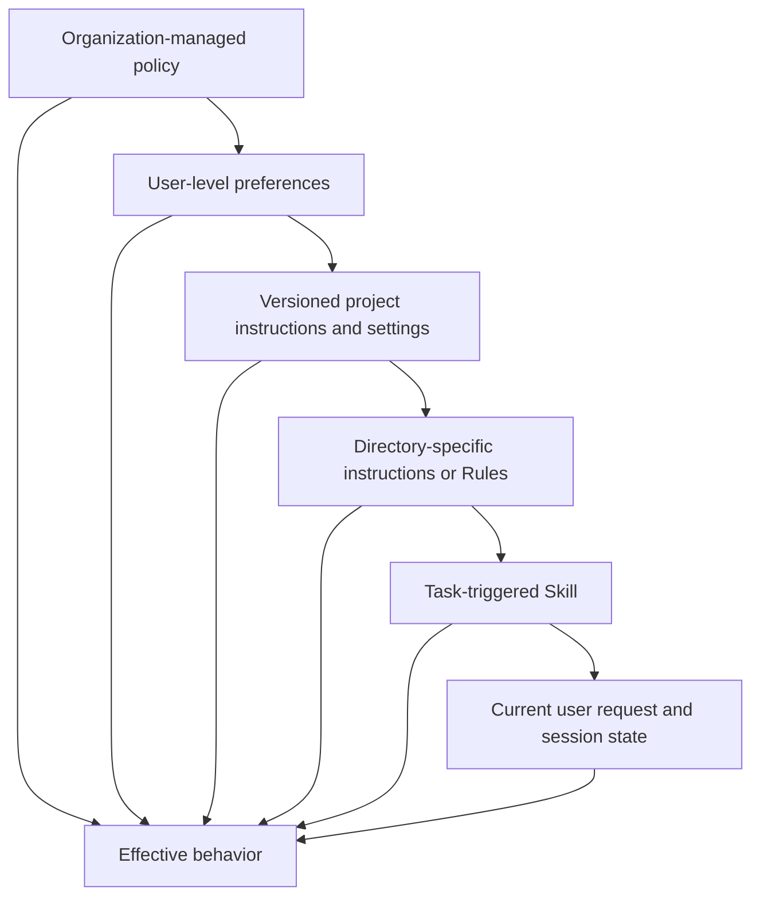
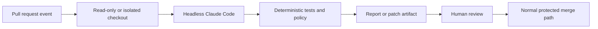

# Claude Code 靠共享约束实现规模化

> 一个团队不需要一个巨大的提示词。它需要的是一份小型的项目契约、可复用的流程、确定性检查和版本化配置。

> **【中文解读】** 本课回答"一个团队如何与 Claude Code 一起规模化"：答案不是写一个巨大的提示词，而是建立四类共享约束——精简的项目契约（`CLAUDE.md`）、按最窄持久作用域放置的 Rules/Skills/Commands/Agents、像生产代码一样评审的 settings 与权限模式、以及可版本化的 hook 与 CI 集成。全课主线是把"靠提示词记住纪律"换成"靠作用域 + 确定性检查 + 版本化配置"，让一百个开发者得到一致且可审计的行为。考试高频点：作用域选择、权限模式的真实边界、hook 退出码语义、worktree 隔离能隔离什么不能隔离什么、CI 中无头运行的最小授权。

> 🔗 **【前置】** 学本课前请先掌握：(1) 12 课《Agent SDK 是执行框架，不是许可》——理解 harness 与 hook 生命周期，本课的 hook 章节直接建立在它之上；(2) 14 课《评估把 Agent 行为变成工程证据》——理解为什么模型或配置变更必须跑代表性工作流 eval。

**类型：** 学习
**语言：** Python
**前置条件：** 12 Agent SDK 是执行框架，不是许可；14 评估把 Agent 行为变成工程证据
**预计用时：** 约 170 分钟

## 学习目标

- 设计一份精简的 `CLAUDE.md`，让它承担项目入职引导的职能。
- 把指令、设置、Rules、Skills、agents、hooks 和 MCP 配置放到正确的作用域。
- 操作权限模式、上下文恢复、goal、loop、worktree 与定时任务，同时不丢掉审批边界。
- 对模型、提示词、插件和团队配置的变更做版本化管理。
- 把 Claude Code 集成进 CI 时让它做受约束的贡献者，而不是无人评审的部署者。
- 通过产物、测试、轨迹和恢复点评估团队工作流。

## 900 行指令文件

> **【中文解读】** 本节是全课的反面案例：团队把每一次纠错都追加进 `CLAUDE.md`，文件膨胀到 900 行——架构历史、API 文档、风格意见、发布步骤、安全规则混在一起，Claude 每次会话都要全文读取，重要命令与过时叙述互相竞争注意力。结果是开发者不再评审变更，一条"用已废弃测试命令"的旧指令让 Agent 反复误报成功。关键概念是 **context debt（上下文债务）**：文件越来越大不等于记忆越来越好，只等于利息越来越贵。`CLAUDE.md` 应该是一份精确的入职脚本，而不是一本百科全书。

一个团队把每一次纠错都追加进 `CLAUDE.md`。它包含架构历史、API 文档、风格意见、发布步骤、安全规则、示例、故障排查和任务专属手册。

Claude 每次会话都要读它。重要命令与过时的散文互相竞争注意力。因为文件太大，开发者不再评审变更。一行旧指令说要用已退役的测试命令，于是 Agent 反复运行错误的测试套件并报告成功。

这个团队创造的不是记忆，而是上下文债务（context debt）。

`CLAUDE.md` 应该像一份精确的入职脚本：这个仓库是什么、如何浏览它、如何构建和测试它、哪些约束不是显而易见的、更深入的文档在哪里。

## 把信息放到最窄的持久作用域

> **【中文解读】** 本节给出全课最重要的设计规则：**宽策略放宽作用域，项目事实放进仓库，任务流程只在被用到时加载**。Claude Code 可以从组织托管策略、用户偏好、项目指令、目录级 Rules、按需触发的 Skill 一直到当前会话状态等多个作用域加载配置；精确的层级和文件名是产品细节，但这条设计规则稳定不变。两条反模式：宽控制不应轻易被一个项目任务削弱；窄指令不应被复制到全局。当多个来源冲突时，要让优先级显式可见，而不是留下两句矛盾的话然后指望模型选更安全的那句。

Claude Code 可以从多个作用域加载配置和指令。确切的层级和文件名是产品细节，但设计规则是稳定的：宽策略属于宽作用域，项目事实属于仓库，任务流程只应在被用到时加载。



宽控制不应该容易被一个项目任务削弱。窄指令不应该被复制到全局。请查阅当前的 [Claude Code 设置](https://code.claude.com/docs/en/settings)与[记忆](https://code.claude.com/docs/en/memory)文档，确认你所装版本中确切的优先级、托管策略位置、导入与发现行为。

当多个来源冲突时，让优先级显式可见。不要指望模型在两句矛盾的话里碰巧选中更安全的那句。

## 写一份精简的 CLAUDE.md

> **【中文解读】** 本节给出 `CLAUDE.md` 的正反清单。要写进去的只有六类：目的与技术栈、规范的构建/测试/lint/运行命令、重要目录地图、仓库特有的风格或架构规则、安全与外部动作边界、指向权威深层文档的链接。必须排除的包括：Claude 本来就知道的通用建议、整本 API 参考、临时任务状态、机密与环境值、只有某个专门工作流用到的指令、没人执行也没人评审的规则。收尾金句值得背下来："每次都跑格式化工具"的最强修复可能是一个 post-edit hook 加 CI 检查，而不是再加一句话——**能用确定性检查解决的，不要用提示词解决**。

从 Claude 反复需要的事实开始：

```markdown
# Repository guide

## Purpose
This repository is a Python service that routes support tickets.

## Commands
- Install: `python3 -m venv .venv && .venv/bin/pip install -r requirements.txt`
- Focused tests: `python3 -m unittest discover tests -v`
- Full validation: `./scripts/validate.sh`

## Layout
- `src/`: application code
- `tests/`: unit and integration tests
- `docs/architecture.md`: boundaries and decision records

## Constraints
- Never commit credentials or `.env` files.
- Preserve public API compatibility unless the task explicitly changes it.
- Require explicit approval before deployment or external messages.
```

应该包含：

- 目的与技术栈。
- 规范的构建、测试、lint 和运行命令。
- 重要目录地图。
- 仓库特有的风格或架构规则。
- 安全与公开动作的边界。
- 指向权威深层文档的链接。

必须排除：

- Claude 本来就知道的通用建议。
- 整本 API 参考。
- 临时任务状态。
- 机密或环境变量值。
- 只有某个专门工作流会用到的指令。
- 没人执行也没人评审的规则。

从小处开始。当同一条纠错在多个会话里反复出现时，判断它应该进 `CLAUDE.md`、一条 Rule、一个 Skill、一个 hook、一个测试，还是真正的代码。"每次都跑格式化工具"的最强修复可能是一个 post-edit hook 加 CI 检查，而不是再加一句话。

## Rules、Skills、命令与 Agents

> **【中文解读】** 本节把四个扩展面按"解决什么问题"分开：**Rules** 承载面向文件族或仓库区域的约束；**Skills** 打包可复用的流程与资产，靠渐进披露省上下文；**Commands** 是用户显式调用的工作流，参数要当不可信输入；**Agents/子 Agent** 定义隔离的角色、工具集与指令，只读评审者不应继承编辑与部署工具。产品细节（文件位置、frontmatter 字段）随版本演进，要以当前官方文档为准并给仓库示例标注目标版本。

这些扩展面解决的是不同的问题。

### Rules

用 Rules 或目录作用域指令来承载只适用于某个文件族或仓库区域的约束。前端规则不应该在编辑数据库迁移时消耗上下文。

让每条规则自洽且可测试。写明机制与事实来源。避免在根文件和目录文件里重复同一条指令，因为漂移不可避免。

### Skills

Skill 打包可复用的流程、参考资料、脚本和资产。它的简短描述帮助 Claude 决定何时加载完整材料。

把 Skill 用于数据库迁移评审、发布说明生成、安全威胁建模或团队文档风格这类工作。保持核心会话提示词精简。让 Skill 随仓库或经批准的分发机制一起版本化。

渐进披露（progressive disclosure）才是收益所在。一个永远全量加载、装着整本手册的 Skill 只是又一个系统提示词。

### 命令

命令提供用户显式调用的工作流。当开发者应当有意识地启动某个操作（如 `/release-check` 或 `/review-migration`）时它们最合适。

把命令参数当作不可信输入。命令不能绕过工具授权或审批。

### Agents

自定义 agents 或子 agents 定义隔离的角色、工具集和指令。把它们用于独立评审、狭窄的专业领域，或所有权分开的并行工作。

只读评审者不应继承编辑与部署工具。当独立性重要时，生成者和评估者不应共享隐藏推理。

产品说明（2026-08-09 核实）：确切的文件系统位置、frontmatter 字段、命令行为和 agent 配置会持续演进。请使用当前的 [Claude Code 文档](https://code.claude.com/docs/en/overview)，并为仓库中的示例标注它们面向的版本。

## 设置即代码

> **【中文解读】** 本节的核心口号是 **"settings 是代码"**：团队设置控制权限、环境、hooks、模型行为、MCP 服务器与插件，必须像生产代码一样评审。作用域分四层：组织策略放不可协商的限制、项目设置提交进仓库作为共享安全默认值、本地设置放不该提交的机器特定实验、环境变量放机密名称与部署特定值。红线：绝不把令牌提交进 settings；绝不假设一条 deny 规则就是沙箱；用无害 fixture 实测权限行为。金句："一个能通过解析的 settings 文件，不能证明已安装的版本认得每一个键。"

团队设置控制权限、环境、hooks、模型行为、MCP 服务器、插件和其他产品能力。要像评审生产代码一样评审它们。

分开作用域：

- 组织策略承载不可协商的限制。
- 项目设置提交进仓库，作为共享的安全默认值。
- 本地设置承载不该提交的机器特定路径或实验。
- 环境变量承载机密名称和部署特定的值。

绝不把令牌提交进 settings。绝不假设一条 deny 模式就是沙箱。用无害的 fixture 测试权限行为。

修改 settings 时：

1. 写明预期行为。
2. 锁定或记录相关的 Claude Code 版本。
3. 加一个聚焦的验收测试或手工验证脚本。
4. 各跑一次被拒绝的动作和被允许的动作。
5. 评审最终生效的合并配置。
6. 提供回滚说明。

一个能通过解析的 settings 文件，并不能证明已安装的版本认得每一个键。

## 权限模式设定基线

> **【中文解读】** 本节是考试重灾区。权限模式只控制"Claude 提议工具调用时发生什么"，它不改仓库策略、不授予凭据、也不让外部动作变得可逆。六个模式的边界要逐个记，并记住一条总规则：显式 deny/ask 规则、组织连接器控制与必需的用户交互**在每个模式（含 bypassPermissions）都会求值**。硬边界属于 deny 规则、沙箱、凭据范围、分支保护或 hook——不属于一句可能被 auto 模式转录压缩掉的提示词。

权限模式控制 Claude 提议工具调用时发生什么。它不改变仓库策略、不授予凭据，也不让外部动作变得可逆。

产品说明（2026-08-09 核实）：当前 Claude Code 文档记载了这些确切的模式。它们的可用性与 UI 标签因产品界面、套餐、提供商、模型、管理员策略和已安装版本而异。

| 模式 | 实际边界 | 适用场景 |
|---|---|---|
| `default` | 读取继续；编辑与命令可能提示 | 首次使用、敏感仓库 |
| `acceptEdits` | 文件编辑与常见文件系统操作直接放行；其他命令仍提示 | 本地代码迭代 + diff 评审 |
| `plan` | 读取与探索继续；auto 模式可用时分类器批准的命令可运行，但源码编辑仍被阻止 | 先批准范围与方案 |
| `auto` | 由独立分类器评估动作；显式 ask 控件仍可提示 | 信任方向上的研究预览自主性 |
| `dontAsk` | 一切会提示的动作直接拒绝；只放行预先批准的工作 | 锁定的 CI 与脚本 |
| `bypassPermissions` | 绕过内置权限检查；配置的 deny、ask 与用户交互控制仍然生效 | 没有有价值凭据的隔离容器或 VM |

在支持的场合，为会话使用 `--permission-mode <mode>`，或使用 `permissions.defaultMode` 设置。权限规则随后通过 `deny`、`ask` 和 `allow` 模式收窄调用。显式的 deny 与 ask 规则、组织连接器控制以及必需的用户交互在**每个模式**中都会被求值，包括 `bypassPermissions`。硬边界应该放在 deny 规则、沙箱、凭据范围、分支保护或 hook 里，而不是放在一句可能随后被 auto 模式转录压缩掉的话里。

`acceptEdits` 的含义仅仅是编辑不再需要繁琐确认。它不会自动接受发布、部署、任意 shell 命令或消息。`auto` 是研究预览，不是安全证明。`bypassPermissions` 不适合在普通笔记本电脑上使用，也不因为"会话在 Git worktree 里"就变得合适。

## Hook 把建议变成检查

> **【中文解读】** 本节把 hook 定位为"把口头建议变成确定性检查"的机制。工程约束：hook 必须快、要有超时与明确的失败行为、安全 hook 在无法评估请求时必须 fail closed。**退出码语义是必考点**：exit `0` + stdout 一个 JSON 对象 = 结构化控制；exit `2` + stderr 原因 = 事件专属阻断；exit `1` 对多数事件只是非阻断错误——所以策略 hook 不能依赖普通 Unix 失败语义。`PreToolUse` 与 `PermissionRequest` 的输出形状不同，allow 决定不能覆盖匹配的 deny/ask 规则。

用 hook 承载确定性的生命周期动作：

- 在工具执行前拦截对机密路径的读取。
- 拦截向保护分支的提交。
- 外部写入前强制审批。
- 编辑后格式化变更的文件。
- 代码变更后运行聚焦测试。
- 对工具输出脱敏。
- 记录审计事件。
- 在必需检查拿到证据之前阻止宣告完成。

保持 hook 快速。慢 hook 会反复运行并毁掉交互延迟。使用超时和明确的失败行为。安全 hook 在无法评估请求时应当 fail closed（拒绝放行）。

Claude Code 以 JSON 传入 hook 输入。命令 hook 有两条不同的控制路径：

- exit `0` 并向 stdout 打印一个 JSON 对象，用于结构化控制。
- exit `2` 并向 stderr 打印原因，用于事件专属的阻断动作。

不要混用两者。Claude Code 只在 exit `0` 时处理结构化 JSON；exit `2` 时打印的 JSON 会被忽略。对多数事件而言 exit `1` 是非阻断错误，所以策略 hook 绝不能依赖普通的 Unix 失败语义。

`PreToolUse` 与 `PermissionRequest` 也使用不同的输出形状。`PreToolUse` hook 可以通过 `hookSpecificOutput.permissionDecision` 给出 allow、deny、ask 或 defer：

```json
{
  "hookSpecificOutput": {
    "hookEventName": "PreToolUse",
    "permissionDecision": "deny",
    "permissionDecisionReason": "Publishing requires a human-controlled workflow"
  }
}
```

`PermissionRequest` hook 只在 Claude Code 即将弹出提示、或因无法提示而不得不拒绝时运行。它使用一个嵌套的 decision 对象：

```json
{
  "hookSpecificOutput": {
    "hookEventName": "PermissionRequest",
    "decision": {
      "behavior": "deny",
      "message": "External publishing requires interactive human approval",
      "interrupt": false
    }
  }
}
```

allow 决定不能覆盖匹配的 deny 或 ask 规则。exit `2` 会阻断 `PreToolUse` 调用并拒绝 `PermissionRequest`，但各事件行为不同：例如 `PostToolUse` hook 在动作之后运行，无法撤销它。把任何 hook 当作强制手段之前，先读事件表。

在合适的场合把共享 hook 存放在经过评审的项目代码里，但要确保受约束的 agent 无法悄悄改写策略、再运行被禁止的动作。组织控制、仓库权限和沙箱边界必须保护 hook 这一层。

## MCP 与插件是安装进来的能力

一个 MCP 服务器或插件可以添加工具、提示词、hooks、agents、Skills、命令或语言智能。安装会同时改变攻击面和上下文面。

团队评审应覆盖：

- 发布者与源仓库。
- 确切版本与更新策略。
- 安装了哪些组件。
- 工具与文件系统权限。
- 网络目的地。
- 请求了哪些机密与环境变量。
- 在无头或 CI 环境中的行为。
- 卸载与回滚步骤。

优先维护一份小而经批准的目录。在支持的场合锁定版本。在有代表性的仓库和 eval 集上测试升级。不要为了一个小流程安装一个大插件——那个流程本可以做成一个经过评审的本地 Skill。

插件和 MCP 不能互换。MCP 标准化外部能力连接；插件打包 Claude Code 扩展；Skill 承载流程与配套材料。按需求选择，而不是按机制的热度选择。

## 会话需要恢复纪律

> **【中文解读】** 本节的底线：**会话历史不是系统的记录源（system of record）**。恢复重要工作前有六步清单，五条会话命令各司其职。压缩会丢失普通转录里的指令——项目根 `CLAUDE.md` 与自动记忆会重新加载，路径作用域规则要在再次读到匹配文件时才重载；因此持久约束必须放进版本化配置，并在压缩后重申当前验收边界。

Claude Code 会话帮助开发者恢复工作、分叉调查线、保留本地上下文。会话历史不是系统的记录源。

在恢复有后果的工作之前：

- 查看当前 Git 状态与 diff。
- 重新运行相关测试。
- 核对外部副作用。
- 确认分支与仓库根。
- 检查待处理的审批。
- 确认指令、工具或模型配置是否发生了变化。

当累积的上下文造成漂移，或跨越租户/保密边界时，清除或新开会话。把压缩用于保持连续性，而不是当作"每条约束都活了下来"的证明。

在仓库策略允许时提交小的恢复点。会话摘要不能替代版本控制。

用会话命令做不同的工作：

| 机制 | 效果 | 使用时机 |
|---|---|---|
| `/context` | 显示什么占用了上下文窗口 | 诊断记忆、skills、工具与消息膨胀 |
| `/compact [focus]` | 把之前的对话替换为聚焦摘要 | 带着更少历史继续同一任务 |
| 自动压缩 | 接近上限时先清理旧工具输出，再摘要 | 普通长会话的连续性 |
| `/clear` | 开一个空对话；旧的仍可恢复 | 切换到无关工作或新的信任边界 |
| `/rewind` 或双击 `Esc` | 从检查点恢复代码、对话或做摘要 | 找回一次被跟踪的编辑或删掉糟糕的对话分支 |

压缩可能丢失普通转录里的指令。项目根 `CLAUDE.md` 与自动记忆会重新加载，而路径作用域的规则要在再次读到匹配文件时才重载。把持久约束放进版本化配置，并在压缩后重申当前的验收边界。

Rewind 是便利层，不是版本控制。它跟踪 Claude Code 的直接文件编辑，但不跟踪 shell 命令、外部系统或大多数子 agents 所做的变更。例外：以 `context: fork` 运行的前台 Skills，其直接编辑会被跟踪。重试操作之前先检查 Git 与外部状态。

## 自主运行有不同的停止条件

> **【中文解读】** 三种"自动化"的停止条件完全不同：goal 靠小模型评估器判定条件满足；会话内 loop 只在 CLI 会话打开期间定时投递提示；持久调度要在云端 Routine、桌面定时任务和 GitHub Actions 之间按边界选择。

不要把每个重复性工作流都当成同一种循环。

### Goal 会话

`/goal <condition>` 在上一轮结束后就开启新的一轮，直到一个独立的小模型评估器判定条件已满足。评估器读取的是对话证据；它不会独立运行测试或检查文件。所以要写明可度量的结果、证明它的命令、以及必须保持为真的约束。时间或轮数条款对评估器可见，但不是硬性运行时限制；硬限制要在 goal 会话之外强制执行。

```text
/goal tests/auth exits 0 and lint is clean, without changing fixtures, or stop after 15 turns
```

一个会话中只能有一个活跃 goal。`/goal clear` 停止它。goal 不改变权限，所以 default 模式仍可能弹提示。goal 与 auto 模式搭配能减少普通提示，但显式 ask 控件仍可能弹提示。这同时也提高了对隔离环境、deny 规则、预算和可观察证据的需求。

### 会话内循环与定时提示

`/loop 5m check whether CI finished` 会在当前 CLI 会话保持打开期间定时投递提示。若无固定间隔，Claude 可以自行选择下一次延迟。这类任务继承会话的工具与权限、在轮次之间运行，并且不是持久的作业基础设施。

选用正确的持久调度器：

- 云端 Routine——保存的提示词、选定的仓库、连接器，以及定时/API/GitHub 触发器。Routine 是研究预览，会在没有审批提示的情况下自主运行，所以要移除每一个未使用的连接器，并把分支权限收窄。
- 桌面定时任务——当机器本身和本地未提交文件属于预期边界的一部分时使用。
- GitHub Actions——当触发器与权限应当放进经过评审的仓库工作流配置时使用。

`/schedule` 在可用的地方创建或管理云端 Routine。产品开关、限额、账户资格和确切的调度行为都对版本敏感；持久的设计是：自包含的提示词、显式的成功条件、最小身份、可审计的结果。

## 并行工作需要隔离的文件

> **【中文解读】** 两个 agent 在同一个 checkout 里编辑会互相覆盖，即使提示词写着不同任务——所以独立会话要用 worktree。**注意 worktree 的边界**：它隔离工作文件与分支，但**共享**仓库 Git 元数据、项目插件和已保存的权限批准，也**不隔离**网络、凭据、数据库或其他副作用。

两个 agent 在同一个 checkout 里编辑会互相覆盖，即使它们的提示词写着不同的任务。让独立的 Claude Code 会话在 worktree 中启动：

```bash
claude --worktree auth-hardening
claude --worktree docs-refresh
```

当前 Claude Code 默认在独立的 `worktree-<name>` 分支上创建 `.claude/worktrees/<name>/`。给每个会话指定所有者、文件边界、验收测试和集成契约。当自定义子 Agent 必须并行编辑时，可以声明 `isolation: worktree`。

Worktree 隔离工作文件和分支。它们共享仓库 Git 元数据、项目插件和已保存的权限批准，而且不隔离网络、凭据、数据库或其他副作用。把这些共享面检查过之后，才能说这次运行是隔离的。通过正常的 Git 评审做集成，而不是在活跃 checkout 之间复制文件。

## 托管 Code Review 与 GitHub Action 是两回事

> **【中文解读】** 两个机制不要混淆：托管 Code Review 的发现**不批准也不阻断** PR——合并门禁仍由分支保护和确定性检查决定；官方 action 则在你自己的工作流里运行，权限边界由你控制。

产品说明（2026-08-09 核实）：Anthropic 托管的 Code Review GitHub 集成是面向 Team 与 Enterprise 套餐的研究预览。它针对 PR 运行一队专门 agents，并能放置带严重性标签的行内发现。它可以读取 `CLAUDE.md` 与 `REVIEW.md` 作为评审指引。它的发现不批准也不阻断 PR；合并门禁仍由分支保护和确定性检查决定。

官方的 `anthropics/claude-code-action@v1` 在你自己的 GitHub Actions 工作流内运行 Claude Code。它可以响应经授权的 `@claude` 提及，或对仓库事件与 cron 计划运行固定提示词。工作流控制 checkout 深度、GitHub token 权限、机密来源、工具、设置、模型和轮数限制。

```yaml
name: bounded-claude-review
on:
  pull_request:
    types: [opened, synchronize]
permissions:
  contents: read
  pull-requests: read
  id-token: write
jobs:
  review:
    runs-on: ubuntu-latest
    steps:
      - uses: actions/checkout@v6
      - uses: anthropics/claude-code-action@v1
        with:
          anthropic_api_key: ${{ secrets.ANTHROPIC_API_KEY }}
          prompt: "Review this pull request and emit evidence-backed findings only."
          claude_args: "--max-turns 6 --allowedTools Read,Grep,Glob"
```

把凭据放在 GitHub Secrets 或工作负载身份里，只授予必需的工作流权限，并在合并前评审所有变更。需要更强供应链固定的组织可以把 action 钉到经过评审的 commit SHA，同时跟踪文档记载的主版本。

## CI 中的无头 Claude Code

> **【中文解读】** 无头执行移走了平时能拦住危险请求的那个交互式人类，所以 CI 用法要设计成**有界作业**：最小权限、钉住的依赖、网络允许清单、轮数/时间/成本限额、结构化输出、人工评审兜底。

无头执行可以在自动化中分析代码、生成结构化输出或提出补丁。但它也移走了平时能拦住危险请求的那个交互式人类。

把 CI 用法设计成一个有界作业：



控制项包括：

- 最小的仓库与 token 权限。
- 不接触无关的机密。
- 钉住依赖与配置。
- 网络允许清单。
- 轮数、时间与成本限额。
- 结构化输出 schema。
- 产物与轨迹留存。
- 禁止直接推送保护分支。
- 合并、部署、消息或 issue 评论之前必须人工评审。

使用短命的自动化凭据。把 PR 文本和仓库文件当作不可信输入。绝不要让一个评估不可信贡献的作业接触特权 token。

无头标志、结构化流模式与权限选项都在变化。请核对所装 CLI 的官方[无头模式](https://code.claude.com/docs/en/headless)文档。在自己的仓库里为命令示例保留版本标注。

## 从计划到证明的团队工作流

> **【中文解读】** 九步循环把全课串起来：契约 → 计划 → 确认范围 → 小变更 → hook 检查 → 修因 → 端到端运行 → 独立评审 → 保护合并。证据要求按产物类型区分：视觉看截图、API 看线格式、CLI 跑构建产物。

一个强健的开发循环是这样的：

1. Claude 阅读精简的项目契约。
2. 它检查相关代码，在大量编辑之前先写计划。
3. 当选择有外部影响时，由开发者确认范围。
4. Claude 做一次小的连贯变更。
5. hooks 做格式化并运行聚焦检查。
6. Claude 检查失败并修复原因。
7. 构建出的产物端到端运行。
8. 独立评审检查 diff 与证据。
9. 正常的源码控制保护接管合并与部署。

视觉变更：serve 真实构建并检查截图。API：检查线上线格式与序列化。CLI：运行构建产物。当这些证据要求是仓库特有时，团队指令应把它们写明。

## 版本化一切会改变行为的东西

> **【中文解读】** 版本化清单六项，任何一项变化都要跑代表性工作流 eval。**永远钉死不是答案，受控升级才是**——用兼容窗口、金丝雀仓库、回归套件和回滚路径。

记录：

- Claude Code 版本。
- 模型配置或别名。
- 根指令与目录指令。
- 设置与 hooks。
- Skills、命令、agents、插件与 MCP 服务器。
- 自动化使用的提示词与输出 schema 版本。

其中任何一项变化时都运行一次代表性工作流 eval。比较正确性、安全性、轮数、延迟和成本。一次模型升级可能在改善通用推理的同时，改变了某个关键工作流的工具选择。

永远钉死不是答案，受控的升级才是。使用兼容窗口、金丝雀仓库、回归套件和回滚路径。

## 一次团队配置评审

> **【中文解读】** 反例 JSON 收拢全课：`"allow": ["Bash(*)", "Read(**)"]` 权限宽到失控、`npx latest-company-server` 未钉版本且来源不明。结论金句：**更强的配置不自动等于更好的团队配置**。

评审下面这个假设的变更：

```json
{
  "permissions": {
    "allow": ["Bash(*)", "Read(**)"]
  },
  "mcpServers": {
    "company": {
      "command": "npx",
      "args": ["latest-company-server"]
    }
  }
}
```

问题包括：宽到失控的 shell 与文件系统访问、未钉版本的包、不明的服务器来源、没有网络边界、没有机密方案、没有审批策略。更强的配置并不自动等于更好的团队配置。

评审者应当索要能力清单，把每条权限收窄到实际工作流。然后用真实安装的版本各测试一次允许操作和一次拒绝操作。

## 交互实验室

```figure
15-team-agent-loop
```

用交互循环把一项提议的团队变更依次推进过指令、执行、确定性验证、评审与恢复。改变作用域与强制控制，观察"只写在提示词里的规则"在哪里不再是一条可靠的团队边界。

## 练习实验室

审计上面的假设变更，收窄 shell 与文件系统面，并定义一个允许 fixture、一个拒绝 fixture 和一条回滚条件。

## 交付产物

填写好的 [`outputs/team-configuration-review.md`](../outputs/team-configuration-review.md) 把这次评审变成可复用的能力、权限、上下文、自主边界、隔离、调度、强制与恢复记录。[`outputs/permission-request-decision.json`](../outputs/permission-request-decision.json) 是一条经过验证的 `PermissionRequest` hook 决策——拒绝外部发布。

## 验证

为你的仓库编辑一份副本，然后运行确定性验证器：

```bash
cd certifications/claude/lessons/15-claude-code-for-development-teams
python3 code/main.py
python3 -m unittest discover -s code/tests -v
```

验证器检查必需的所有权、允许与拒绝 fixture、版本化配置和回滚证据。六题课堂测验在你产出证据之后再检查决策规则。

## 毕业设计衔接

把完成的评审带进 Developer 毕业设计，作为团队配置与 CI 控制附录。

## 考试决策规则

> **【中文解读】** 这一组规则是全课的可背版本，每条都对应一个高频考法：`CLAUDE.md` 要精简且项目特有；信息放最窄持久作用域；可复用流程用 Skill、确定性生命周期检查用 hook；settings、插件、MCP 服务器都按"被评审的代码与能力"对待；`acceptEdits` 换编辑速度、`dontAsk` 用于预批准自动化、bypass 只用于一次性隔离运行时；`/context`、聚焦 `/compact`、`/clear`、`/rewind` 各有不同恢复职责；`/goal`、`/loop`、Routine 和定时作业要用证据、权限、时间、成本四方面设界；并行写者给独立 worktree 和显式所有权；机密留在受保护环境或密钥管理边界内；恢复会话前先核对 Git 与外部状态；无头 CI 给最小 token、工具、网络、时间与权限；agent 自动化之后仍走正常评审与保护合并路径；配置变更要版本化并评估。

- 保持 `CLAUDE.md` 精简且项目特有。
- 把信息放到最窄的持久作用域。
- 可复用任务流程用 Skill，确定性生命周期检查用 hook。
- 把 settings、插件和 MCP 服务器当作被评审的代码与能力。
- `acceptEdits` 换编辑速度，`dontAsk` 用于预批准的自动化，bypass 只用于一次性隔离运行时。
- `/context`、聚焦的 `/compact`、`/clear`、`/rewind` 各自承担不同的恢复职责。
- 用证据、权限、时间和成本为 `/goal`、`/loop`、Routine 和定时作业设界。
- 给并行写者分配独立 worktree 和显式所有权。
- 机密留在受保护环境或密钥管理边界之内。
- 恢复会话前先核对 Git 与外部状态。
- 给无头 CI 最小的 token、工具、网络、时间与权限。
- agent 自动化之后仍要求正常评审与保护合并路径。
- 对配置变更做版本化管理并评估。

## 练习

1. 在 `default`、`acceptEdits`、plan 和 `dontAsk` 下运行同一个无害编辑；记录哪个边界发生了变化。
2. 压缩一个 fixture 会话，然后验证哪些项目级、路径级和 Skill 指令会重新加载。
3. 为同一个 CI 任务分别写一个有界的 `/goal` 条件和一条 `/loop` 提示。解释它们不同的停止条件。
4. 启动两个所有者不重叠的一次性 worktree 会话，然后通过经过评审的 diff 做集成。
5. 同时实现 `PreToolUse` JSON 拒绝和 `PermissionRequest` 拒绝。分别验证 exit `0` 与 exit `2` 的行为。
6. 对同一个 PR，比较托管 Code Review 与只读的 `anthropics/claude-code-action@v1` 工作流。

## 延伸阅读

- [Claude Code overview](https://code.claude.com/docs/en/overview) — 所有产品细节的权威入口
- [Claude Code memory](https://code.claude.com/docs/en/memory) — 记忆与 `CLAUDE.md` 的层级、发现与加载行为
- [Claude Code settings](https://code.claude.com/docs/en/settings) — settings 作用域与优先级的当前定义
- [Claude Code hooks guide](https://code.claude.com/docs/en/hooks-guide) — hook 事件表与退出码语义的官方指南
- [Claude Code permission modes](https://code.claude.com/docs/en/permission-modes) — 六种权限模式的官方边界说明
- [Claude Code commands](https://code.claude.com/docs/en/commands) — 自定义斜杠命令的当前行为
- [Claude Code checkpointing](https://code.claude.com/docs/en/checkpointing) — rewind/检查点能跟踪什么、不能跟踪什么
- [Claude Code goals](https://code.claude.com/docs/en/goal) — goal 会话与评估器的官方说明
- [Claude Code scheduled tasks](https://code.claude.com/docs/en/scheduled-tasks) — 桌面与云端定时任务的边界
- [Claude Code Routines](https://code.claude.com/docs/en/routines) — 云端 Routine 的自主运行与权限模型
- [Claude Code worktrees](https://code.claude.com/docs/en/worktrees) — worktree 默认路径、分支与共享面
- [Claude Code managed Code Review](https://code.claude.com/docs/en/code-review) — 托管 Code Review 研究预览的官方文档
- [Claude Code GitHub Actions](https://code.claude.com/docs/en/github-actions) — 官方 `claude-code-action` 的配置与权限
- [Claude Code headless mode](https://code.claude.com/docs/en/headless) — 无头模式的当前标志与流模式
- [Claude Code security](https://code.claude.com/docs/en/security) — 威胁模型与安全红线
- [Agent Skills](https://platform.claude.com/docs/en/agents-and-tools/agent-skills/overview) — Agent Skills 的结构与渐进披露
