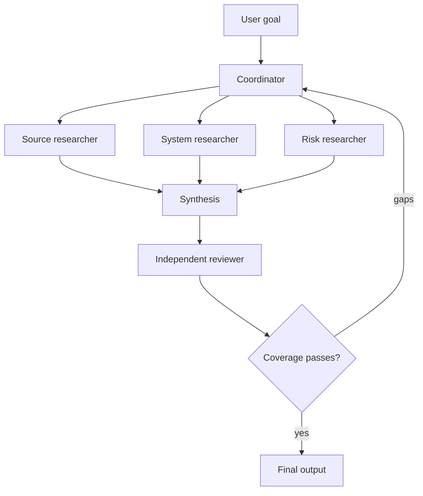

# Multi-Agent Orchestration and Delegation | 多 Agent 编排与委托

> Delegate a bounded question, not your entire uncertainty.

> **【中文解读】** 本课回答"什么时候值得把一个任务拆进多个 Agent 上下文，以及怎么拆才不失控"。核心论断：多 Agent 架构本身不解决分解问题——它只是把缺失的契约变得更贵；真正的收益只有五个来源（边界清晰的上下文隔离、独立工作的并行执行、专用工具或指令、不受生成者污染的独立评审、保护协调者的上下文预算）。全课依次给出：五类编排模式（单 Agent、顺序流水线、并行扇出-归并、协调者-专家、生成者-独立评审者）、委托任务契约的写法、确定性前置条件必须放在模型之外的代码里、任务边界的持久设计原则、complete/partial/blocked 三种结果状态、按身份与来源合并结果、以及"评轨迹而不仅是评最终输出"的评测方法。

> **【拓展：编排生态位→认证路线位置】** 在认证路线中，本课是第 10 课"工具循环是受控的委托"从单 Agent 到多 Agent 的延伸：单课讲一次委托的授权模型，本课讲委托链的拓扑与契约。它向下衔接第 12 课（Agent SDK 提供的子 Agent 与任务边界原语），向上为第 17 课（会话、子 Agent 与上下文的恢复语义）、第 20 课（批处理与独立评审者）和架构师毕业设计 31 提供编排蓝图；思路与 Anthropic《Building effective agents》中"编排者-工作者"与"评估者-优化者"模式一脉相承。

> 🔗 **【前置】** 学本课前请先掌握：(1) 第 10 课——工具循环是受控的委托：模型提议、代码授权，本课的每一条委托链都要落回这个模型；(2) Phase 14 第 12、28 课——编排模式对比与工作流设计，本课在认证语境下重述并收紧这些模式的选择条件。

**Type:** Reference | **类型:** 参考
**Languages:** Python | **语言:** Python
**Prerequisites:** [A Tool Loop Is Controlled Delegation](../../10-tool-use-and-agentic-loops/); Phase 14, Lessons 12 and 28 | **前置知识:** 第 10 课（工具循环是受控的委托）；Phase 14 第 12、28 课
**Time:** ~135 minutes | **时间:** 约 135 分钟

## Learning Objectives | 学习目标

- Choose single-agent, coordinator, pipeline, parallel, and reviewer patterns
  中文翻译：会选择单 Agent、协调者、流水线、并行与评审者这几类编排模式。
- Write delegated tasks with scope, tools, outputs, and completion criteria
  中文翻译：写出带范围、工具、输出与完成标准的委托任务。
- Use context isolation to reduce bloat and protect independent judgment
  中文翻译：用上下文隔离削减膨胀并保护独立判断。
- Distinguish deterministic prerequisites from adaptive model decisions
  中文翻译：区分确定性前置条件与自适应模型决策。
- Merge partial results without losing provenance, errors, or unresolved gaps
  中文翻译：合并部分结果而不丢失来源、错误或未解决的缺口。

## The Problem | 问题引入

> **【中文解读】** 开篇是两个对称的反面案例：一个巨型单 Agent（一个提示词装下搜索、比对、置信度、写作、引用评审、"要不要继续研究"六件事）在任务变长后遗忘早期约束、重复搜索；团队把它拆成五个"宽工具+笼统指令"的 Agent，结果成本更高、更难调试——重复研究同一论断、散文对 JSON 的接口错配、评审者复读生成者的假设、静默失败被当作阴性证据。结论：多 Agent 架构没有解决分解，只是让缺失的契约变得更贵。这就是全课要补的那份契约。

A research agent has one enormous prompt. It searches six sources, compares
claims, calculates confidence, writes a report, reviews citations, and decides
whether more research is needed. As the task grows, it forgets early constraints
and repeats searches. The team splits it into five agents with broad tools and
the instruction "collaborate until the report is excellent."

> 一个研究 Agent 背着一份巨型提示词。它搜索六个来源、比对论断、计算置信度、写报告、评审引用，还要决定是否需要更多研究。随着任务变长，它遗忘早期约束并重复搜索。团队把它拆成五个 Agent，配上一组宽泛工具和一句"协作到报告优秀为止"的指令。

The new system costs more and is harder to debug. Two agents research the same
claim. One returns prose where the coordinator expects JSON. The reviewer sees
the generator's reasoning and repeats its assumptions. An agent silently fails,
but the final synthesis treats the missing result as negative evidence.

> 新系统成本更高、更难调试。两个 Agent 研究同一个论断；一个返回散文，而协调者期望的是 JSON；评审者看到生成者的推理，于是重复它的假设；一个 Agent 静默失败，最终综合却把缺失的结果当作阴性证据。

Multi-agent architecture did not solve decomposition. It made the missing
contracts more expensive.

> 多 Agent 架构没有解决分解问题。它只是让缺失的契约变得更贵。

## The Concept | 核心概念

### Decide Why Another Context Exists

Create a subagent only when it provides a concrete benefit:

> 只有在能带来具体收益时才创建子 Agent：

- context isolation for a bounded concern
  中文翻译：为边界清晰的事项做上下文隔离。
- parallel execution of independent work
  中文翻译：并行执行相互独立的工作。
- specialized tools or instructions
  中文翻译：专用的工具或指令。
- independent review without generator context
  中文翻译：不带生成者上下文的独立评审。
- protection of the coordinator's context budget
  中文翻译：保护协调者的上下文预算。

If the subtask is one deterministic function, use a tool. If it is reusable
guidance loaded on demand, use a Skill. If it needs its own reasoning loop,
evidence, and stop condition, a subagent may fit.

> 如果子任务是一个确定性函数，用工具。如果是按需加载的可复用指引，用 Skill。只有当它需要自己的推理循环、证据与停止条件时，子 Agent 才可能合适。

### Start With Five Patterns

> **【中文解读】** 五个模式是考试选择题的"题库"：单 Agent（一个上下文装得下证据且轨迹短，最容易评测）、顺序流水线（前驱固定、顺序与前置已知，如抽取→校验→评审→渲染）、并行扇出-归并（独立任务同时跑、归并器合并结构化结果，用于逐文件评审或独立来源研究；相互依赖的步骤不要并行）、协调者-专家（协调者按当前缺口选择并委托，用于分解无法在开局完全知道的场景）、生成者-独立评审者（另一个上下文拿到产物、证据与量表，但不拿生成者那套有说服力的内部叙述——独立性是硬要求，不是同一场对话里的"第二意见"）。判型问题先问依赖与分解的可预知性，再问收益。



#### Single Agent

Best when one context can hold the required evidence and the tool trajectory is
short. It is the easiest system to evaluate.

> 最适合"一个上下文装得下所需证据、工具轨迹很短"的场景。它是最容易评测的系统。

#### Sequential Pipeline

Each stage has a fixed predecessor. Use it when order and prerequisites are
known, such as extract, validate, review, then render.

> 每个阶段有固定前驱。当顺序与前置条件已知时使用，例如抽取、校验、评审、再渲染。

#### Parallel Fan-Out and Reduce

Independent tasks run at the same time, then a reducer combines structured
results. Use it for per-file review or independent source research. Do not
parallelize steps that depend on each other's discoveries.

> 独立任务同时运行，再由归并器合并结构化结果。适用于逐文件评审或独立来源研究。不要并行化相互依赖对方发现的步骤。

#### Coordinator and Specialists

A coordinator selects and delegates work based on the current gap. Use it when
the decomposition cannot be fully known at the start.

> 协调者根据当前缺口选择并委托工作。当分解无法在开局完全知道时使用。

#### Generator and Independent Reviewer

One context creates; another receives the artifact, evidence, and rubric without
the generator's persuasive internal narrative. Independence is the requirement,
not a second opinion from the same conversation.

> 一个上下文负责创建；另一个上下文拿到产物、证据与量表，但不带生成者那套有说服力的内部叙述。独立性是硬要求，而不是同一场对话里的第二意见。

### Write a Delegation Contract

> **【中文解读】** 委托契约是多 Agent 系统里"接口定义"的等价物，八个字段缺一不可：目标（子 Agent 拥有的唯一产出）、范围（明确纳入与排除的文件/来源/论断/系统）、输入（权威证据与当前状态）、允许工具（最小必要能力）、约束（时间、轮次、成本、安全、格式）、输出（带来源与错误的可机器校验 schema）、完成（done/partial/blocked 的可观察条件）、交接（协调者对每种状态该做什么）。对照示例："彻底研究这个主题"没有定义完成；"返回至多五条有支撑的论断，每条带来源 ID、日期、引文跨度引用、置信级别、冲突清单与未解决问题"才定义了。

A useful delegated task contains:

> 一份有用的委托任务包含：

```text
Goal: one outcome the subagent owns
Scope: files, sources, claims, or systems included and excluded
Inputs: authoritative evidence and current state
Allowed tools: minimum necessary capabilities
Constraints: time, turns, cost, safety, and format
Output: machine-checkable schema with provenance and errors
Completion: observable conditions for done, partial, or blocked
Handoff: what the coordinator should do with each state
```

"Research the topic thoroughly" does not define done. "Return up to five
supported claims, each with source ID, date, quoted span reference, confidence
class, conflict list, and unresolved questions" does.

> "彻底研究这个主题"没有定义完成。"返回至多五条有支撑的论断，每条带来源 ID、日期、引文跨度引用、置信级别、冲突清单与未解决问题"才定义了完成。

### Keep Deterministic Sequence Outside the Model

> **【中文解读】** 分工法则：Claude 决定语义问题（哪条缺失的论断需要更多研究），代码决定不变式（最大并发、必需输出、审批状态、阶段顺序）。"评审必须在测试之后""每个文件先本地评审再做跨文件一致性评审"这类硬前置，由编排代码跟踪 manifest 并阻塞第二步来强制——不要指望协调者提示词在上下文压力下还记得硬前置。考试里凡是"用更长的提示词来保住顺序"的选项基本是干扰项。

If review must happen after tests, code enforces that order. If every file must
receive a local review before cross-file consistency review, orchestration tracks
the manifest and blocks the second pass until the first is complete.

> 如果评审必须发生在测试之后，由代码强制这个顺序。如果每个文件必须先做本地评审再做跨文件一致性评审，编排层就跟踪 manifest，并在第一步完成前阻塞第二步。

Do not rely on a coordinator prompt to remember hard prerequisites under context
pressure.

> 不要指望协调者提示词在上下文压力下还记得硬性前置条件。

Claude decides semantic questions such as which missing claim requires more
research. Code decides invariants such as maximum concurrency, required outputs,
approval state, and stage order.

> Claude 决定语义问题，例如哪条缺失的论断需要更多研究。代码决定不变式，例如最大并发、必需输出、审批状态与阶段顺序。

### Use the Task Boundary Deliberately

In Claude Code and agent harnesses, a task or subagent boundary can provide an
isolated context and restricted tool set. Exact configuration changes over time,
so verify current documentation. The durable design principles are:

> 在 Claude Code 与各类 Agent 执行框架中，任务或子 Agent 边界可以提供隔离的上下文与受限的工具集。具体配置随时间变化，请核对当前文档。持久有效的设计原则是：

- pass only the evidence the subagent needs
  中文翻译：只传子 Agent 需要的证据。
- restrict tools with explicit allowlists
  中文翻译：用显式白名单限制工具。
- request structured metadata with the result
  中文翻译：要求结果附带结构化元数据。
- run independent calls in parallel only when they do not depend on each other
  中文翻译：只在调用互不依赖时才并行运行。
- keep the coordinator responsible for global constraints and final state
  中文翻译：让协调者始终对全局约束与最终状态负责。
- fork a session when exploring an alternative must not mutate the original
  中文翻译：当探索替代方案不得改动原路径时，分叉会话。

Isolation prevents context bloat. It does not guarantee factual independence if
all agents receive the same flawed evidence or rubric.

> 隔离防止上下文膨胀。但如果所有 Agent 拿到的是同样有缺陷的证据或量表，隔离并不能保证事实上的独立。

### Preserve Three Result States

> **【中文解读】** 结果状态与合并规则是被最多团队跳过、又最常引发事故的两环。每个子任务必须返回三种状态之一：complete（契约满足）、partial（有效工作+点名缺口或失败来源）、blocked（没有新授权或新状态就无法安全推进）；绝不许因为"字段差不多都有"就把 partial 洗成 complete，协调者必须把缺失证据与结构化错误传播到综合层。合并要靠稳定键（文件/发现 ID、论断/来源 ID、工单/动作 ID），规则要写明去重、冲突保留、来源优先、新鲜度比较、不完整输入、置信度聚合与分歧升级——合成器不许为了散文更顺滑而藏掉冲突。

Every subtask should return:

> 每个子任务都应返回：

- complete: requested contract satisfied
  中文翻译：complete（完成）：请求的契约已满足。
- partial: valid work plus named gaps or failed sources
  中文翻译：partial（部分）：有效工作，加上被点名的缺口或失败来源。
- blocked: no safe progress without new authority or state
  中文翻译：blocked（阻塞）：没有新的授权或状态就无法安全推进。

Never convert partial into complete because some fields are present. The
coordinator must propagate missing evidence and structured errors to synthesis.

> 绝不因为某些字段存在就把 partial 转成 complete。协调者必须把缺失证据与结构化错误传播到综合层。

### Merge by Identity and Provenance

A reducer needs stable keys. For code review, use file and finding identifiers.
For research, use claim and source identifiers. For support, use ticket and
action identifiers.

> 归并器需要稳定的键。代码评审用文件与发现标识符；研究用论断与来源标识符；客服用工单与动作标识符。

Merge rules should specify:

> 合并规则应当写明：

- duplicate handling
  中文翻译：重复项的处理。
- conflict preservation
  中文翻译：冲突的保留。
- source precedence if any
  中文翻译：来源优先级（如有）。
- freshness comparison
  中文翻译：新鲜度比较。
- incomplete inputs
  中文翻译：不完整输入的处理。
- confidence aggregation
  中文翻译：置信度聚合。
- escalation when agents disagree
  中文翻译：Agent 意见分歧时的升级上报。

Do not let the synthesizer hide conflicts to produce smoother prose.

> 不要让合成器为了产出更顺滑的散文而隐藏冲突。

### Evaluate the Trajectory

> **【中文解读】** 多 Agent 系统的评测要盯轨迹而不仅是最终输出，因为编排可以在"结果碰巧对"的同时浪费工作量或越过边界。检查清单八项：子 Agent 选择是否正确、工具使用是否在允许范围内、任务所有权有无重复、前置顺序是否满足、结果 schema 与错误传播、轮次与成本预算、评审者独立性、最终状态完整性。手段是用合成的工具失败与部分结果做注入测试——快乐路径是最没有说服力的证明。

Final output can look correct while orchestration wastes work or crosses a
boundary. Test:

> 最终输出可能看起来正确，而编排却在浪费工作量或越过边界。测试：

- correct subagent selection
  中文翻译：子 Agent 选择正确。
- allowed tool use
  中文翻译：工具使用在允许范围内。
- no duplicated task ownership
  中文翻译：任务所有权没有重复。
- prerequisite order
  中文翻译：前置顺序得到满足。
- result schema and error propagation
  中文翻译：结果 schema 与错误传播。
- turn and cost budget
  中文翻译：轮次与成本预算。
- reviewer independence
  中文翻译：评审者独立性。
- final-state completeness
  中文翻译：最终状态完整性。

Use synthetic tool failures and partial results. The happy path is the least
interesting proof.

> 使用合成的工具失败与部分结果。快乐路径是最没有说服力的证明。

## Build It | 动手构建

## Interactive Lab | 交互实验室

```figure
16-multi-agent-topology
```

Use the topology explorer before adding agents. Compare a single context,
sequential pipeline, parallel fan-out, coordinator, and independent reviewer;
the figure exposes coordination cost, prerequisites, and partial-result risk.

> 在增加 Agent 之前先用拓扑浏览器。比较单一上下文、顺序流水线、并行扇出、协调者与独立评审者；这张图把协调成本、前置条件与部分结果风险暴露出来。

## Practice Lab | 练习实验室

Design the bounded research pipeline below, then remove one unnecessary context
and justify whether the measurable outcome changes.

> 设计下文那个有边界的研究流水线，然后移除一个不必要的上下文，并论证可度量的结果是否改变。

## Shipped Artifact | 交付产物

The filled [`outputs/orchestration-contract.md`](../outputs/orchestration-contract.md)
is a concrete research-pipeline handoff, not a blank worksheet.

> 已填写的 [`outputs/orchestration-contract.md`](../outputs/orchestration-contract.md) 是一份具体的研究流水线交接件，不是一张空白工作表。

## Verify It | 验证

Validate its task identities, dependency order, budgets, partial state, and
reviewer isolation locally:

> 在本地校验它的任务身份、依赖顺序、预算、部分状态与评审者隔离：

```bash
cd certifications/claude/lessons/16-multi-agent-orchestration-and-delegation
python3 code/main.py
python3 -m unittest discover -s code/tests -v
```

Modify one dependency or remove the partial-state rule and confirm the verifier
blocks the packet. The lesson quiz tests topology decisions after the build.

> 修改一条依赖或删掉部分状态规则，确认校验器拦截该数据包。本课测验在构建之后考查拓扑决策。

## Capstone Connection | 毕业设计衔接

Reuse the verified contract as the orchestration section of the Architect
Foundations scenario capstone.

> 把验证过的契约复用为架构师基础场景毕业设计的编排部分。

Design a multi-agent research pipeline for a technical decision.

> 为一个技术决策设计多 Agent 研究流水线。

### Step 1: Define the Final Contract

Specify the decision brief, claim schema, source requirements, and unresolved-gap
representation before defining agents.

> 在定义 Agent 之前，先定好决策简报、论断 schema、来源要求与未解决缺口的表示法。

### Step 2: Try a Single-Agent Baseline

Measure quality, cost, latency, repeated work, and context growth. Do not add
agents without a baseline failure.

> 度量质量、成本、延迟、重复工作量与上下文增长。没有基线失败就不要增加 Agent。

### Step 3: Identify Context Boundaries

Split only concerns that benefit from isolation, parallelism, specialization, or
independent review. Record the expected improvement for each new context.

> 只拆分那些受益于隔离、并行、专业化或独立评审的事项。为每个新上下文记录预期改进。

### Step 4: Write Task Contracts

Create a table:

> 创建一张表：

| Task | Scope | Allowed tools | Output | Done | Partial | Budget |
|------|-------|---------------|--------|------|---------|--------|

### Step 5: Encode Prerequisites

Use a dependency graph or state machine. The reviewer cannot run until all
required research states are complete or explicitly partial.

> 用依赖图或状态机。在全部必需的研究状态变为 complete 或显式 partial 之前，评审者不能运行。

### Step 6: Red-Team the Merge

Inject duplicate claims, conflicting dates, one failed agent, stale evidence,
and a result with the wrong schema. Verify that synthesis does not silently
erase the failure.

> 注入重复论断、相互冲突的日期、一个失败的 Agent、过期证据和一个 schema 错误的结果。验证综合层不会静默抹掉失败。

## Use It | 运行验证

For codebase review, a reliable shape is:

> 对代码库评审，一个可靠的形状是：

1. Build a manifest of files and cross-file concerns.
   中文翻译：构建文件与跨文件关注点的 manifest。
2. Run bounded per-file reviews in parallel with read-only tools.
   中文翻译：用只读工具并行运行有边界的逐文件评审。
3. Normalize findings to a shared schema.
   中文翻译：把发现规范化到共享 schema。
4. Run one cross-file pass over the manifest and normalized findings.
   中文翻译：基于 manifest 与规范化发现跑一遍跨文件审查。
5. Use an independent reviewer to reject weak evidence and duplicates.
   中文翻译：用独立评审者剔除弱证据与重复项。
6. Apply accepted changes only after deterministic tests and scope gates.
   中文翻译：只有确定性测试与范围门通过后才应用被接受的变更。

Do not ask every agent to inspect the whole repository. That duplicates context
and makes ownership ambiguous.

> 不要让每个 Agent 都检查整个仓库。那会复制上下文并让所有权变得含糊。

For customer support, assign roles by authority as well as expertise. A policy
researcher may read documents. A refund recommender may analyze a case. Only a
separate approved executor should receive write authority.

> 在客服场景里，既按专业也按权限分配角色。策略研究员可以读文档；退款建议者可以分析案例；只有单独的、经批准的执行者才应拿到写权限。

## Exam Decision Patterns | 考试决策模式

Choose structural enforcement for prerequisites and authority. Choose subagents
for isolated reasoning, not for deterministic utility calls.

> 前置条件与权限选择结构性强制。子 Agent 用于隔离推理，而不是确定性的工具调用。

Strong options often:

> 强选项通常：

- use a coordinator with bounded specialists
  中文翻译：用带边界专家的协调者。
- restrict tools per role
  中文翻译：按角色限制工具。
- return structured results and partial states
  中文翻译：返回结构化结果与部分状态。
- parallelize independent tasks
  中文翻译：并行化独立任务。
- keep independent review in a fresh context
  中文翻译：把独立评审放在全新上下文里。
- preserve source and error provenance
  中文翻译：保留来源与错误出处。
- re-delegate only identified gaps
  中文翻译：只把已识别的缺口重新委托。

Weak options ask more agents to share the same broad prompt and tool set.

> 弱选项是让更多 Agent 共享同一份宽泛的提示词与工具集。

## Common Traps | 常见陷阱

> **【中文解读】** 四个陷阱各自的解药：Agent Per Step——固定步骤不需要自主上下文，确定性操作用代码或工具；Parallel by Default——相互依赖的任务并行会用过期假设工作，还要付昂贵的合并修复成本；Coordinator as Data Warehouse——原始子 Agent 转录撑爆全局上下文，应返回紧凑结构化结果、把详细证据留在提示词之外；Reviewer With Generator Context——评审者继承同样的框架就退化成文体编辑，要在干净上下文里给它产物、证据与量表。考试中"每步一个 Agent""默认并行""评审者看全部历史"都是标准错项。

### Agent Per Step

A fixed step does not need an autonomous context. Use code or a tool when the
operation is deterministic.

> 固定步骤不需要自主上下文。操作是确定性的时候，用代码或工具。

### Parallel by Default

Dependent tasks in parallel use stale assumptions and require expensive merge
repair.

> 相互依赖的任务并行会用过期的假设工作，并需要昂贵的合并修复。

### Coordinator as Data Warehouse

Raw subagent transcripts bloat global context. Return compact structured results
and retain detailed evidence outside the prompt.

> 原始的子 Agent 转录会撑爆全局上下文。返回紧凑的结构化结果，把详细证据保留在提示词之外。

### Reviewer With Generator Context

The reviewer inherits the same framing and becomes a style editor. Provide the
artifact, evidence, and rubric in a clean context.

> 评审者继承同样的框架，退化成文体编辑。在干净的上下文里提供产物、证据与量表。

## Exercises | 练习

1. Convert an overgrown single-agent prompt into tool, Skill, and subagent
   responsibilities. Justify each boundary.
   中文翻译：把一个过度膨胀的单 Agent 提示词拆成工具、Skill 与子 Agent 职责。论证每条边界的理由。
2. Design partial-result behavior when one of three source researchers times out.
   中文翻译：当三个来源研究员之一超时时，设计部分结果的行为。
3. Add deterministic prerequisites to a per-file and cross-file review pipeline.
   中文翻译：给逐文件与跨文件评审流水线加确定性前置条件。
4. Compare sequential and adaptive decomposition on the same evaluation set.
   中文翻译：在同一评测集上比较顺序分解与自适应分解。
5. Create a trajectory test that fails when two agents duplicate task ownership.
   中文翻译：创建一个"两个 Agent 重复拥有任务"时就会失败的轨迹测试。

## Key Terms | 关键术语

| Term | What people say | What it actually means |
|------|-----------------|------------------------|
| Coordinator | The smartest agent | The context responsible for decomposition, global constraints, merge, and completion |
| Subagent | A function call | An isolated reasoning loop with a bounded task and tools |
| Fan-out | Use many agents | Run independent bounded tasks concurrently |
| Reduce | Summarize everything | Merge structured results with explicit conflict and partial-state rules |
| Handoff | Send prose | Transfer typed state, evidence, errors, and next responsibility |
| Independent reviewer | Ask again | Evaluate artifact and evidence in a context isolated from generator persuasion |

## Further Reading | 延伸阅读

- [Claude Agent SDK documentation](https://platform.claude.com/docs/en/agent-sdk/overview) for current subagent and session capabilities
  中文翻译：Claude Agent SDK 文档——当前子 Agent 与会话能力的官方入口
- [Building effective agents](https://www.anthropic.com/research/building-effective-agents) for orchestration patterns
  中文翻译：构建有效 Agent——编排模式的经典参考
- Phase 14, Lesson 28 for a broader orchestration comparison
  中文翻译：Phase 14 第 28 课——更宽视角的编排对比
- Phase 14, Lesson 39 for independent reviewer design
  中文翻译：Phase 14 第 39 课——独立评审者设计
