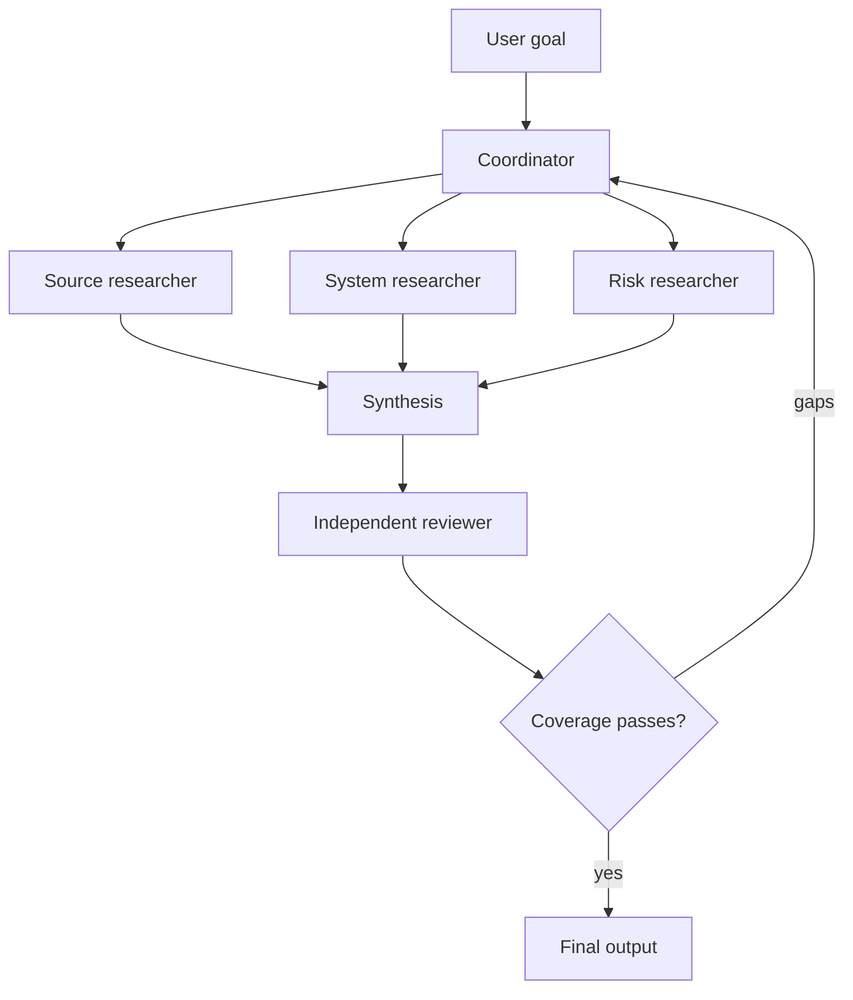

# 多 Agent 编排与委托

> 委托出去的应当是一个有边界的问题，而不是你全部的不确定性。

> **【中文解读】** 本课回答"什么时候值得把一个任务拆进多个 Agent 上下文，以及怎么拆才不失控"。核心论断：多 Agent 架构本身不解决分解问题——它只是把缺失的契约变得更贵；真正的收益只有五个来源（边界清晰的上下文隔离、独立工作的并行执行、专用工具或指令、不受生成者污染的独立评审、保护协调者的上下文预算）。全课依次给出：五类编排模式、委托任务契约的写法、确定性前置条件必须放在模型之外的代码里、任务边界的持久设计原则、complete/partial/blocked 三种结果状态、按身份与来源合并结果、以及"评轨迹而不仅是评最终输出"的评测方法。

> **【拓展：编排生态位→认证路线位置】** 在认证路线中，本课是第 10 课"工具循环是受控的委托"从单 Agent 到多 Agent 的延伸：单课讲一次委托的授权模型，本课讲委托链的拓扑与契约。它向下衔接第 12 课（Agent SDK 提供的子 Agent 与任务边界原语），向上为第 17 课（会话、子 Agent 与上下文的恢复语义）、第 20 课（批处理与独立评审者）和架构师毕业设计 31 提供编排蓝图；思路与 Anthropic《Building effective agents》中"编排者-工作者"与"评估者-优化者"模式一脉相承。

> 🔗 **【前置】** 学本课前请先掌握：(1) 第 10 课——工具循环是受控的委托：模型提议、代码授权，本课的每一条委托链都要落回这个模型；(2) Phase 14 第 12、28 课——编排模式对比与工作流设计，本课在认证语境下重述并收紧这些模式的选择条件。

**类型：** 参考
**语言：** Python
**前置条件：** 第 10 课（工具循环是受控的委托）；Phase 14 第 12、28 课
**预计用时：** 约 135 分钟

## 学习目标

- 会选择单 Agent、协调者、流水线、并行与评审者这几类编排模式。
- 写出带范围、工具、输出与完成标准的委托任务。
- 用上下文隔离削减膨胀并保护独立判断。
- 区分确定性前置条件与自适应模型决策。
- 合并部分结果而不丢失来源、错误或未解决的缺口。

## 问题引入

> **【中文解读】** 开篇是两个对称的反面案例：巨型单 Agent 在任务变长后遗忘约束、重复搜索；拆成五个"宽工具+笼统指令"的 Agent 后成本更高、更难调试。结论：多 Agent 架构没有解决分解，只是让缺失的契约变得更贵。这就是全课要补的那份契约。

一个研究 Agent 背着一份巨型提示词。它搜索六个来源、比对论断、计算置信度、写报告、评审引用，还要决定是否需要更多研究。随着任务变长，它遗忘早期约束并重复搜索。团队把它拆成五个 Agent，配上一组宽泛工具和一句"协作到报告优秀为止"的指令。

新系统成本更高、更难调试。两个 Agent 研究同一个论断；一个返回散文，而协调者期望的是 JSON；评审者看到生成者的推理，于是重复它的假设；一个 Agent 静默失败，最终综合却把缺失的结果当作阴性证据。

多 Agent 架构没有解决分解问题。它只是让缺失的契约变得更贵。

## 核心概念

### 先问"为什么需要另一个上下文"

只有在能带来具体收益时才创建子 Agent：

- 为边界清晰的事项做上下文隔离。
- 并行执行相互独立的工作。
- 专用的工具或指令。
- 不带生成者上下文的独立评审。
- 保护协调者的上下文预算。

如果子任务是一个确定性函数，用工具。如果是按需加载的可复用指引，用 Skill。只有当它需要自己的推理循环、证据与停止条件时，子 Agent 才可能合适。

### 从五个模式开始

> **【中文解读】** 五个模式是考试选择题的"题库"：单 Agent、顺序流水线、并行扇出-归并、协调者-专家、生成者-独立评审者。判型问题先问依赖与分解的可预知性，再问收益。



#### 单 Agent

最适合"一个上下文装得下所需证据、工具轨迹很短"的场景。它是最容易评测的系统。

#### 顺序流水线

每个阶段有固定前驱。当顺序与前置条件已知时使用，例如抽取、校验、评审、再渲染。

#### 并行扇出与归并

独立任务同时运行，再由归并器合并结构化结果。适用于逐文件评审或独立来源研究。不要并行化相互依赖对方发现的步骤。

#### 协调者与专家

协调者根据当前缺口选择并委托工作。当分解无法在开局完全知道时使用。

#### 生成者与独立评审者

一个上下文负责创建；另一个上下文拿到产物、证据与量表，但不带生成者那套有说服力的内部叙述。独立性是硬要求，而不是同一场对话里的第二意见。

### 写一份委托契约

> **【中文解读】** 委托契约是多 Agent 系统里"接口定义"的等价物，八个字段缺一不可。"彻底研究这个主题"没有定义完成；带来源 ID、日期、引文引用、置信级别、冲突清单与未解决问题的结构化输出才定义了完成。

一份有用的委托任务包含：

```text
Goal: one outcome the subagent owns
Scope: files, sources, claims, or systems included and excluded
Inputs: authoritative evidence and current state
Allowed tools: minimum necessary capabilities
Constraints: time, turns, cost, safety, and format
Output: machine-checkable schema with provenance and errors
Completion: observable conditions for done, partial, or blocked
Handoff: what the coordinator should do with each state
```

（目标：子 Agent 拥有的唯一产出；范围：纳入与排除的文件/来源/论断/系统；输入：权威证据与当前状态；允许工具：最小必要能力；约束：时间、轮次、成本、安全与格式；输出：带来源与错误的可机器校验 schema；完成：done/partial/blocked 的可观察条件；交接：协调者对每种状态该做什么。）

"彻底研究这个主题"没有定义完成。"返回至多五条有支撑的论断，每条带来源 ID、日期、引文跨度引用、置信级别、冲突清单与未解决问题"才定义了完成。

### 把确定性顺序放在模型之外

> **【中文解读】** 分工法则：Claude 决定语义问题，代码决定不变式（最大并发、必需输出、审批状态、阶段顺序）。硬前置由编排代码强制，不要指望协调者提示词在上下文压力下还记得。考试里凡是"用更长的提示词来保住顺序"的选项基本是干扰项。

如果评审必须发生在测试之后，由代码强制这个顺序。如果每个文件必须先做本地评审再做跨文件一致性评审，编排层就跟踪 manifest，并在第一步完成前阻塞第二步。

不要指望协调者提示词在上下文压力下还记得硬性前置条件。

Claude 决定语义问题，例如哪条缺失的论断需要更多研究。代码决定不变式，例如最大并发、必需输出、审批状态与阶段顺序。

### 有意识地使用任务边界

在 Claude Code 与各类 Agent 执行框架中，任务或子 Agent 边界可以提供隔离的上下文与受限的工具集。具体配置随时间变化，请核对当前文档。持久有效的设计原则是：

- 只传子 Agent 需要的证据。
- 用显式白名单限制工具。
- 要求结果附带结构化元数据。
- 只在调用互不依赖时才并行运行。
- 让协调者始终对全局约束与最终状态负责。
- 当探索替代方案不得改动原路径时，分叉会话。

隔离防止上下文膨胀。但如果所有 Agent 拿到的是同样有缺陷的证据或量表，隔离并不能保证事实上的独立。

### 保留三种结果状态

> **【中文解读】** 每个子任务必须返回 complete/partial/blocked 三种状态之一；绝不许因为"字段差不多都有"就把 partial 洗成 complete，协调者必须把缺失证据与结构化错误传播到综合层。

每个子任务都应返回：

- complete（完成）：请求的契约已满足。
- partial（部分）：有效工作，加上被点名的缺口或失败来源。
- blocked（阻塞）：没有新的授权或状态就无法安全推进。

绝不因为某些字段存在就把 partial 转成 complete。协调者必须把缺失证据与结构化错误传播到综合层。

### 按身份与来源合并

归并器需要稳定的键。代码评审用文件与发现标识符；研究用论断与来源标识符；客服用工单与动作标识符。

合并规则应当写明：

- 重复项的处理。
- 冲突的保留。
- 来源优先级（如有）。
- 新鲜度比较。
- 不完整输入的处理。
- 置信度聚合。
- Agent 意见分歧时的升级上报。

不要让合成器为了产出更顺滑的散文而隐藏冲突。

### 评测轨迹

> **【中文解读】** 多 Agent 系统的评测要盯轨迹而不仅是最终输出：子 Agent 选择、工具范围、所有权重复、前置顺序、结果 schema 与错误传播、轮次与成本预算、评审者独立性、最终状态完整性。用合成的工具失败与部分结果做注入测试——快乐路径是最没有说服力的证明。

最终输出可能看起来正确，而编排却在浪费工作量或越过边界。测试：

- 子 Agent 选择正确。
- 工具使用在允许范围内。
- 任务所有权没有重复。
- 前置顺序得到满足。
- 结果 schema 与错误传播。
- 轮次与成本预算。
- 评审者独立性。
- 最终状态完整性。

使用合成的工具失败与部分结果。快乐路径是最没有说服力的证明。

## 动手构建

## 交互实验室

```figure
16-multi-agent-topology
```

在增加 Agent 之前先用拓扑浏览器。比较单一上下文、顺序流水线、并行扇出、协调者与独立评审者；这张图把协调成本、前置条件与部分结果风险暴露出来。

## 练习实验室

设计下文那个有边界的研究流水线，然后移除一个不必要的上下文，并论证可度量的结果是否改变。

## 交付产物

已填写的 [`outputs/orchestration-contract.md`](../outputs/orchestration-contract.md) 是一份具体的研究流水线交接件，不是一张空白工作表。

## 验证

在本地校验它的任务身份、依赖顺序、预算、部分状态与评审者隔离：

```bash
cd certifications/claude/lessons/16-multi-agent-orchestration-and-delegation
python3 code/main.py
python3 -m unittest discover -s code/tests -v
```

修改一条依赖或删掉部分状态规则，确认校验器拦截该数据包。本课测验在构建之后考查拓扑决策。

## 毕业设计衔接

把验证过的契约复用为架构师基础场景毕业设计的编排部分。

为一个技术决策设计多 Agent 研究流水线。

### 第 1 步：定义最终契约

在定义 Agent 之前，先定好决策简报、论断 schema、来源要求与未解决缺口的表示法。

### 第 2 步：先试单 Agent 基线

度量质量、成本、延迟、重复工作量与上下文增长。没有基线失败就不要增加 Agent。

### 第 3 步：识别上下文边界

只拆分那些受益于隔离、并行、专业化或独立评审的事项。为每个新上下文记录预期改进。

### 第 4 步：写任务契约

创建一张表：

| 任务 | 范围 | 允许工具 | 输出 | 完成 | 部分 | 预算 |
|------|------|----------|------|------|------|------|

### 第 5 步：编码前置条件

用依赖图或状态机。在全部必需的研究状态变为 complete 或显式 partial 之前，评审者不能运行。

### 第 6 步：给合并做红队测试

注入重复论断、相互冲突的日期、一个失败的 Agent、过期证据和一个 schema 错误的结果。验证综合层不会静默抹掉失败。

## 运行验证

对代码库评审，一个可靠的形状是：

1. 构建文件与跨文件关注点的 manifest。
2. 用只读工具并行运行有边界的逐文件评审。
3. 把发现规范化到共享 schema。
4. 基于 manifest 与规范化发现跑一遍跨文件审查。
5. 用独立评审者剔除弱证据与重复项。
6. 只有确定性测试与范围门通过后才应用被接受的变更。

不要让每个 Agent 都检查整个仓库。那会复制上下文并让所有权变得含糊。

在客服场景里，既按专业也按权限分配角色。策略研究员可以读文档；退款建议者可以分析案例；只有单独的、经批准的执行者才应拿到写权限。

## 考试决策模式

> **【中文解读】** 强选项的共同点：带边界专家的协调者、按角色限工具、结构化结果与部分状态、只并行独立任务、独立评审放全新上下文、保留来源与错误出处、只重托已识别缺口。弱选项是让更多 Agent 共享同一份宽泛提示词与工具集。

前置条件与权限选择结构性强制。子 Agent 用于隔离推理，而不是确定性的工具调用。

强选项通常：

- 用带边界专家的协调者。
- 按角色限制工具。
- 返回结构化结果与部分状态。
- 并行化独立任务。
- 把独立评审放在全新上下文里。
- 保留来源与错误出处。
- 只把已识别的缺口重新委托。

弱选项是让更多 Agent 共享同一份宽泛的提示词与工具集。

## 常见陷阱

> **【中文解读】** 四个陷阱各自的解药：固定步骤用代码或工具、相互依赖的任务不并行、协调者不囤原始转录、评审者拿干净上下文。考试中"每步一个 Agent""默认并行""评审者看全部历史"都是标准错项。

### 每步一个 Agent

固定步骤不需要自主上下文。操作是确定性的时候，用代码或工具。

### 默认并行

相互依赖的任务并行会用过期的假设工作，并需要昂贵的合并修复。

### 协调者当数据仓库

原始的子 Agent 转录会撑爆全局上下文。返回紧凑的结构化结果，把详细证据保留在提示词之外。

### 评审者带着生成者上下文

评审者继承同样的框架，退化成文体编辑。在干净的上下文里提供产物、证据与量表。

## 练习

1. 把一个过度膨胀的单 Agent 提示词拆成工具、Skill 与子 Agent 职责。论证每条边界的理由。
2. 当三个来源研究员之一超时时，设计部分结果的行为。
3. 给逐文件与跨文件评审流水线加确定性前置条件。
4. 在同一评测集上比较顺序分解与自适应分解。
5. 创建一个"两个 Agent 重复拥有任务"时就会失败的轨迹测试。

## 关键术语

| 术语 | 人们以为的意思 | 实际含义 |
|------|----------------|----------|
| Coordinator（协调者） | 最聪明的 Agent | 负责分解、全局约束、合并与完成判定的那个上下文 |
| Subagent（子 Agent） | 一次函数调用 | 一个带边界任务与工具的隔离推理循环 |
| Fan-out（扇出） | 多用几个 Agent | 并发运行相互独立的有界任务 |
| Reduce（归并） | 把一切做摘要 | 按显式冲突与部分状态规则合并结构化结果 |
| Handoff（交接） | 发一段散文 | 转移类型化状态、证据、错误与下一步责任 |
| Independent reviewer（独立评审者） | 再问一遍 | 在与生成者说服隔离的上下文里评估产物与证据 |

## 延伸阅读

- [Claude Agent SDK documentation](https://platform.claude.com/docs/en/agent-sdk/overview) — 当前子 Agent 与会话能力的官方入口
- [Building effective agents](https://www.anthropic.com/research/building-effective-agents) — 编排模式的经典参考
- Phase 14, Lesson 28 — 更宽视角的编排对比
- Phase 14, Lesson 39 — 独立评审者设计
