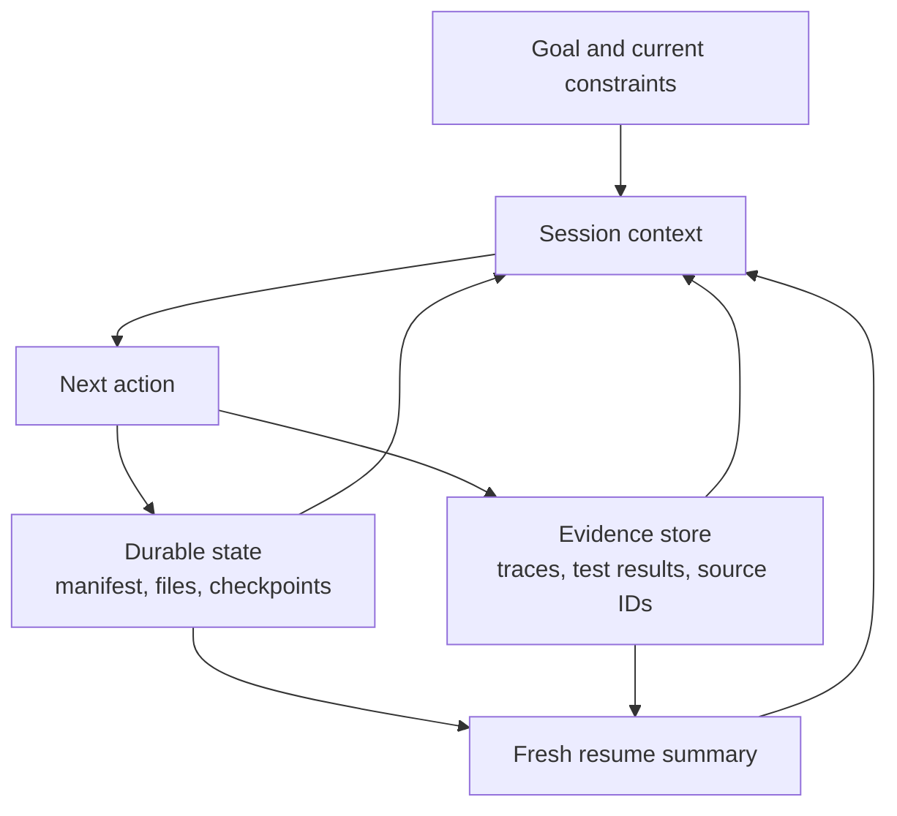

# Agent SDK Sessions, Subagents, and Context | Agent SDK 会话、子 Agent 与上下文

> Resume state when continuity helps. Fork context when inherited assumptions become risk.

> **【中文解读】** 本课回答"长运行 Agent 中断之后，凭什么敢继续"。核心区分是三样东西不能混成一坨：持久外部状态（manifest、文件、检查点、审批）、当前对话上下文（工作集）、执行历史（追踪）。会话只是连续性工具，不是真相来源。全课给出：上下文=工作集的心智模型、四种会话操作（新建/恢复/分叉/压缩）按失败风险选择的准则、结构化恢复包（resume packet）、按职责隔离子 Agent 上下文、钩子的确定性生命周期分工（前置拦截/后置规范化/停止检查/会话装取）、副作用幂等与"先分类再重试"、边界处的重验证，以及上下文预算的分配。

> **【拓展：会话语义→认证路线位置】** 在认证路线中，本课把第 12 课"会话是连续性，不是真相"的论断展开成可操作的设计：恢复前先对照持久状态核对、压缩不等于恢复、分叉不等于独立。它与第 16 课互为一对——16 课管"委托链怎么拆"，本课管"每条链断了之后怎么接回去"。产品面上对应 Claude Agent SDK 的 sessions、subagents 与 hooks 能力面，并为第 21 课（长上下文可靠性）与架构师毕业设计 31 的恢复与上下文管理证据铺路。

> 🔗 **【前置】** 学本课前请先掌握：(1) 第 12 课——Agent SDK 是执行框架而非许可，其中"会话是连续性、不是真相"与"子代理买到的是上下文隔离"是本课的直接前置；(2) 第 16 课——多 Agent 编排与委托，本课的子 Agent 隔离与协调者职责沿用它定下的契约写法；(3) Phase 14 第 17 课——会话管理的更宽视角。

**Type:** Reference | **类型:** 参考
**Languages:** Python | **语言:** Python
**Prerequisites:** [The Agent SDK Is a Harness, Not Permission](../../12-claude-agent-sdk-and-hooks/), [Multi-Agent Orchestration and Delegation](../../16-multi-agent-orchestration-and-delegation/); Phase 14, Lesson 17 | **前置知识:** 第 12 课（Agent SDK 是执行框架，不是许可）、第 16 课（多 Agent 编排与委托）；Phase 14 第 17 课
**Time:** ~120 minutes | **时间:** 约 120 分钟

## Learning Objectives | 学习目标

- Separate durable task state from conversational context
  中文翻译：把持久的任务状态与对话上下文分开。
- Choose new, resumed, forked, and compacted sessions from failure risk
  中文翻译：按失败风险在新建、恢复、分叉与压缩会话之间做选择。
- Use subagents to isolate context and tools
  中文翻译：用子 Agent 隔离上下文与工具。
- Place hooks around deterministic lifecycle events
  中文翻译：把钩子安放在确定性的生命周期事件周围。
- Design recovery that does not replay stale assumptions or duplicate side effects
  中文翻译：设计不会重放过期假设、不会重复副作用恢复方案。

## The Problem | 问题引入

> **【中文解读】** 开篇事故是"把三样东西混为一坨"的标准样本：一个跑了数小时的仓库迁移 Agent，会话里堆着原始计划、工具输出、失败实验、残缺补丁、测试日志和几份摘要；依赖变更后团队恢复同一会话说"从停下的地方继续"，结果 Agent 跟着过时计划走、把超时前已成功的写动作又做了一遍、压缩摘要恰好丢掉那次关键测试失败、评审子 Agent 继承全部父历史后仍假设旧依赖行为成立。病因不是"会话不好"，而是系统混淆了持久外部状态、当前对话上下文、执行历史三件事——它们相关，但不该被当成一个存储。

A repository migration agent runs for several hours. Its context contains the
original plan, tool outputs, failed experiments, partial patches, test logs, and
several summaries. After a dependency changes, the team resumes the same session
and says, "Continue from where you stopped."

> 一个仓库迁移 Agent 运行了数小时。它的上下文里装着原始计划、工具输出、失败实验、残缺补丁、测试日志和几份摘要。一个依赖变更之后，团队恢复了同一个会话并说："从你停下的地方继续。"

The agent follows an obsolete plan. It repeats a write action that had already
succeeded before a timeout. Compaction preserved the broad story but dropped a
critical test failure. A reviewer subagent receives the entire parent history
and assumes the old dependency behavior is still true.

> Agent 跟着一份过时的计划走。它重复了一个在超时之前就已成功的写动作。压缩保留了大致故事，却丢掉了一次关键的测试失败。评审子 Agent 收到完整的父历史，于是假设旧的依赖行为仍然成立。

The system confused three things:

> 系统混淆了三样东西：

- durable external state
  中文翻译：持久的外部状态。
- current conversational context
  中文翻译：当前的对话上下文。
- execution history
  中文翻译：执行历史。

They are related, but they should not be treated as one store.

> 它们相互关联，但不应当被当成同一个存储。

## The Concept | 核心概念

### Context Is a Working Set

> **【中文解读】** 第一块地基：模型上下文是"下一步决策所需的工作集"，不是已完成工作、审批、文件、检查点或工具副作用的权威数据库。持久事实（任务 manifest 与状态、产物与版本、幂等键与外部动作 ID、审批与过期时间、最近验证过的测试与部署结果、未解决的阻塞项、来源与追踪引用）一律放在上下文之外；会话启动或恢复时，从这些状态重建一份紧凑的当前工作集。图里的"新鲜恢复摘要"就是这个重建动作——它由持久状态与证据库生成，而不是由旧对话直接继承。

The model context should contain the information needed for the next decisions.
It is not the authoritative database for completed work, approvals, files,
checkpoints, or tool side effects.

> 模型上下文应当装的是下一步决策所需的信息。它不是已完成工作、审批、文件、检查点或工具副作用的权威数据库。



Store durable facts outside context:

> 把持久事实存在上下文之外：

- current task manifest and statuses
  中文翻译：当前任务 manifest 与各任务状态。
- completed artifacts and versions
  中文翻译：已完成产物及其版本。
- idempotency keys and external action IDs
  中文翻译：幂等键与外部动作 ID。
- approvals and expiration
  中文翻译：审批及其过期时间。
- last verified test and deployment results
  中文翻译：最近验证过的测试与部署结果。
- unresolved blockers
  中文翻译：未解决的阻塞项。
- source and trace references
  中文翻译：来源与追踪引用。

When a session starts or resumes, reconstruct a compact current working set from
that state.

> 会话启动或恢复时，从这些状态重建一份紧凑的当前工作集。

### Choose Among Four Session Moves

> **【中文解读】** 四种会话操作按"失败风险"选择，这是考试与实战的双高频判断题：新建（目标或信任边界变了、继承上下文不可靠、前任务已完成；用权威状态构造结构化简报开场）；恢复（任务、约束、证据仍有效且连续性有价值；先重验证外部状态——会话 ID 不能证明世界没变）；分叉（探索替代方案但不得改动原分支：竞争性架构方案、独立调试假设、高风险迁移选项；分叉继承起点，但没有显式协调不得改共享状态）；压缩（上下文变大但当前工作仍受益于连续性；好的摘要保留决策、约束、产物 ID、测试状态、开放缺口与下一步动作，大块证据外置只留引用）。压缩省的是上下文，不提供持久执行、不保证关键事实幸存、不验证新鲜度。

#### New Session

Use a clean session when the goal or trust boundary changes, inherited context is
unreliable, or the prior task is complete. Supply a structured brief from
authoritative state.

> 当目标或信任边界变化、继承上下文不可靠、或前序任务已完成时，使用干净的新会话。用权威状态构造一份结构化简报作为输入。

#### Resume Session

Resume when the task, constraints, and evidence remain valid and conversational
continuity provides value. Revalidate external state first. A session ID does
not prove the world is unchanged.

> 当任务、约束与证据仍然有效、且对话连续性有价值时才恢复。先重验证外部状态。会话 ID 不能证明世界没有变。

#### Fork Session

Fork when exploring an alternative should preserve the original branch. Useful
cases include competing architecture plans, independent debugging hypotheses,
or a risky migration option. The fork inherits a starting point but should not
mutate shared state without explicit coordination.

> 当探索替代方案需要保留原分支时分叉。典型场景：竞争性架构方案、相互独立的调试假设、高风险迁移选项。分叉继承一个起点，但没有显式协调就不应改动共享状态。

#### Compact Session

Compact when context grows but current work still benefits from continuity. A
good compact summary keeps decisions, constraints, artifact IDs, test state,
open gaps, and next action. Store large evidence externally and retain references.

> 当上下文增长但当前工作仍受益于连续性时压缩。一份好的压缩摘要保留决策、约束、产物 ID、测试状态、开放缺口与下一步动作。大块证据外置存储，只保留引用。

Compaction saves context. It does not create durable execution, guarantee that
critical facts survive, or validate freshness.

> 压缩省下的是上下文。它不创造持久执行，不保证关键事实幸存，也不验证新鲜度。

### Use a Structured Resume Packet

> **【中文解读】** 恢复包是"恢复时唯一可信输入"的载体：报告当前真相，而不是概括每一轮对话。字段骨架：目标、范围、已完成（带产物与验证标志）、当前状态（分支、已重验证的依赖版本、测试结果）、开放缺口、约束、下一步动作。配套纪律在下一小节：子 Agent 按职责拿最小上下文——一个目标与范围、最小相关证据、受限工具、显式输出与错误 schema、轮次/时间/成本预算、完成与升级规则；不相关父历史一律不给。协调者保留全局状态，并在合并前校验返回的契约。

```json
{
  "goal": "Migrate the request client without changing public behavior",
  "scope": ["src/client.py", "tests/test_client.py"],
  "completed": [
    {"task": "inventory", "artifact": "work/inventory.json", "verified": true}
  ],
  "current_state": {
    "branch": "migration/client-v2",
    "dependency_version": "verified-at-resume",
    "tests": "12 passed, 1 blocked"
  },
  "open_gaps": ["timeout retry semantics need decision"],
  "constraints": ["no public API change", "no production writes"],
  "next_action": "compare retry behavior against the contract tests"
}
```

The packet reports current truth. Do not summarize every conversation turn.

> 恢复包报告的是当前真相。不要概括每一轮对话。

### Isolate Subagent Context by Responsibility

A subagent should receive:

> 子 Agent 应当收到：

- one goal and scope
  中文翻译：一个目标与范围。
- minimum relevant evidence
  中文翻译：最小限度的相关证据。
- restricted tools
  中文翻译：受限的工具。
- explicit output and error schema
  中文翻译：显式的输出与错误 schema。
- turn, time, and cost budget
  中文翻译：轮次、时间与成本预算。
- completion and escalation rules
  中文翻译：完成与升级上报规则。

It should not receive unrelated parent history. Isolation protects attention and
can preserve reviewer independence.

> 它不应收到不相关的父历史。隔离保护注意力，也能保住评审者的独立性。

The coordinator retains global state and checks the returned contract before
merging it.

> 协调者保留全局状态，并在合并前校验返回的契约。

### Use Hooks for Deterministic Lifecycle Work

> **【中文解读】** 钩子的持久分工法则（事件名与配置随 SDK 版本变，先学分工再查文档）：前置动作钩子负责校验或拦截；后置动作钩子负责规范化、记录或验证；停止钩子检查完成与清理；会话钩子装载或持久化受控状态。典型例子：拦截声明范围之外的写入、破坏性工具前要求新鲜审批、截断或外置超大工具输出、把工具错误规范化到统一 schema、编辑后跑格式化或定向测试、写不可变追踪引用。两条红线：需要模型推理的语义判断别塞进脆弱的 shell 逻辑；硬授权别写进提示词。

Hooks run at defined events around sessions or tools. Exact event names and
configuration vary, so consult current Agent SDK and Claude Code documentation.
The durable placement rule is:

> 钩子在会话或工具周围的既定事件上运行。确切的事件名与配置各不相同，请查阅当前的 Agent SDK 与 Claude Code 文档。持久有效的安放法则是：

- pre-action hooks validate or block
  中文翻译：前置动作钩子负责校验或拦截。
- post-action hooks normalize, record, or verify
  中文翻译：后置动作钩子负责规范化、记录或验证。
- stop hooks check completion and cleanup
  中文翻译：停止钩子检查完成与清理。
- session hooks load or persist controlled state
  中文翻译：会话钩子装载或持久化受控状态。

Examples:

> 示例：

- block writes outside declared scope
  中文翻译：拦截声明范围之外的写入。
- require fresh approval before a destructive tool
  中文翻译：破坏性工具之前要求新鲜审批。
- truncate or externalize oversized tool output
  中文翻译：截断或外置超大的工具输出。
- normalize tool errors to a common schema
  中文翻译：把工具错误规范化到统一 schema。
- run a formatter or targeted test after an edit
  中文翻译：编辑后运行格式化器或定向测试。
- write an immutable trace reference
  中文翻译：写一条不可变追踪引用。

Do not put semantic judgment that needs model reasoning into brittle shell logic.
Do not put hard authorization into a prompt.

> 不要把需要模型推理的语义判断塞进脆弱的 shell 逻辑。不要把硬授权写进提示词。

### Make Side Effects Idempotent

> **【中文解读】** 恢复最大的隐患是"结果丢失后的重复执行"：超时后重试，可能把已经成功的写动作再做一遍。每个外部写都要有幂等或对账策略（退款用唯一请求键、补丁前记录预期文件哈希、重试前检查部署版本、持久化工具调用 ID 与结果状态、再写之前先对账未知结果）；"再试一次"只有在错误分类之后才安全。配套的边界重验证五步：解析当前文件/依赖版本/分支/服务状态→对照检查点→标记过期假设→重跑能确立安全下一步的最小验证→生成新的当前状态摘要；若环境已实质分叉，就带着新计划新建或分叉，而不是逼旧会话自我重新解释。

Resume after timeout can repeat an action when the result was lost. Every
external write needs an idempotency or reconciliation strategy.

> 超时后的恢复可能在结果已丢失时重复一个动作。每个外部写都需要幂等或对账策略。

For example:

> 例如：

- create refund with a unique request key
  中文翻译：用唯一请求键创建退款。
- record expected file hash before patch
  中文翻译：打补丁前记录预期文件哈希。
- check deployment version before retry
  中文翻译：重试前检查部署版本。
- persist tool call ID and result status
  中文翻译：持久化工具调用 ID 与结果状态。
- reconcile unknown outcomes before another write
  中文翻译：再写之前先对账未知结果。

"Try again" is safe only after error classification.

> "再试一次"只有在错误分类之后才安全。

### Revalidate at the Boundary

Before continuing:

> 继续之前：

1. Resolve current files, dependency versions, branch, and service state.
   中文翻译：解析当前的文件、依赖版本、分支与服务状态。
2. Compare against the checkpoint.
   中文翻译：对照检查点比较。
3. Mark stale assumptions.
   中文翻译：标记过期的假设。
4. Re-run the smallest verification that establishes a safe next step.
   中文翻译：重跑能确立安全下一步的最小验证。
5. Create a fresh current-state summary.
   中文翻译：生成一份新鲜的当前状态摘要。

If the environment diverged materially, start or fork with a new plan rather
than forcing the old session to reinterpret itself.

> 如果环境已实质分叉，就带着新计划新建或分叉，而不是逼旧会话自我重新解释。

### Plan Context Budgets

Allocate context to:

> 把上下文分配给：

- goal and hard constraints
  中文翻译：目标与硬约束。
- current plan and manifest
  中文翻译：当前计划与 manifest。
- recent evidence needed for the next choice
  中文翻译：下一步选择所需的近期证据。
- compact relevant tool output
  中文翻译：紧凑的相关工具输出。
- final output contract
  中文翻译：最终输出契约。

Large raw logs, entire repositories, and repeated tool schemas belong outside
the active working set or behind progressive discovery.

> 大块原始日志、整个仓库、重复的工具 schema 应放在活跃工作集之外，或藏在渐进披露之后。

Use subagents for bounded searches and return summaries with references. Context
is a scarce reasoning surface even when the nominal window is large.

> 用子 Agent 做有边界的搜索并返回带引用的摘要。即使名义窗口很大，上下文也是稀缺的推理表面。

## Build It | 动手构建

## Interactive Lab | 交互实验室

```figure
17-session-context-budget
```

Use the context-budget simulator to allocate the working set across goals,
constraints, evidence, tool results, and output contract. It makes visible why
compaction can reduce size without proving that state is current.

> 用上下文预算模拟器在目标、约束、证据、工具结果与输出契约之间分配工作集。它直观展示：压缩能缩减体积，却不能证明状态是当前的。

## Practice Lab | 练习实验室

Invalidate one checkpoint in the migration exercise and repair the resume packet
without trusting conversation history.

> 在迁移练习中让一个检查点失效，然后在不信任对话历史的前提下修复恢复包。

## Shipped Artifact | 交付产物

The filled [`outputs/session-recovery-packet.md`](../outputs/session-recovery-packet.md)
captures one interrupted migration with hashes, an unknown side effect, and a
safe next action.

> 已填写的 [`outputs/session-recovery-packet.md`](../outputs/session-recovery-packet.md) 记录了一次被中断的迁移，带哈希、一个未知副作用和一个安全的下一步动作。

## Verify It | 验证

Verify that it includes durable state, revalidation, an idempotency key, and
isolated review:

> 验证它包含持久状态、重验证、幂等键与隔离评审：

```bash
cd certifications/claude/lessons/17-agent-sdk-sessions-subagents-and-context
python3 code/main.py
python3 -m unittest discover -s code/tests -v
```

The quiz checks session selection and recovery rules.

> 测验考查会话选择与恢复规则。

## Capstone Connection | 毕业设计衔接

Attach the verified packet to the Architect Foundations capstone as its resume
and context-management evidence.

> 把验证过的恢复包附到架构师基础毕业设计上，作为其恢复与上下文管理的证据。

Create a durable three-session migration exercise.

> 创建一个持久化的三会话迁移练习。

### Session 1: Inventory and Plan

Produce a manifest of files, tests, public contracts, dependencies, and risks.
Persist it outside the conversation. No implementation yet.

> 产出文件、测试、公共契约、依赖与风险的 manifest。把它持久化在对话之外。此时尚不实现。

### Session 2: Implement and Verify

Start from the manifest and current repository state. Use restricted file tools.
Persist completed task IDs, file hashes, test output references, and unresolved
gaps.

> 从 manifest 与当前仓库状态出发。使用受限的文件工具。持久化已完成任务 ID、文件哈希、测试输出引用与未解决缺口。

Midway, simulate a timeout after a file write. Resume by reconciling the file
hash before any retry.

> 中途在一次文件写入之后模拟超时。恢复时先核对文件哈希，再考虑任何重试。

### Session 3: Independent Review

Fork a fresh review context. Supply the diff, requirements, tests, and rubric,
not the implementation transcript. The reviewer returns structured findings
with evidence.

> 分叉一个全新的评审上下文。提供 diff、需求、测试与量表，而不是实现转录。评审者返回带证据的结构化发现。

### Hook Requirements

- pre-write scope gate
  中文翻译：写前范围门。
- post-write targeted verification
  中文翻译：写后定向验证。
- tool-output size limit with external evidence reference
  中文翻译：工具输出大小上限并外置证据引用。
- structured trace record
  中文翻译：结构化追踪记录。
- stop check requiring manifest completion or explicit partial state
  中文翻译：停止检查，要求 manifest 完成或显式部分状态。

## Use It | 运行验证

For a customer-support agent, store ticket state, retrieved evidence IDs,
approval, and tool outcome in a durable case record. Session context contains the
current question and relevant evidence. If a human returns hours later, rebuild
the working set from the case record and revalidate policy freshness.

> 对客服 Agent，把工单状态、检索到的证据 ID、审批与工具结果存进持久的案件记录。会话上下文只装当前问题与相关证据。如果人工几小时后回来，从案件记录重建工作集并重验证政策新鲜度。

For CI, each run should start clean from a commit and declared inputs. Reusing an
interactive session can introduce unstated state. Use persisted findings or a
structured summary as explicit input instead.

> 对 CI，每次运行都应从某个提交与声明的输入干净启动。复用交互式会话可能引入未声明的状态。改用持久化的发现或结构化摘要作为显式输入。

## Exam Decision Patterns | 考试决策模式

Choose resume for valid continuity, fork for isolated alternatives, and a fresh
session when stale context is the risk. Compaction addresses size, not truth.

> 连续性有效选恢复，隔离的替代方案选分叉，过期上下文本身是风险时选全新会话。压缩解决的是体积，不是真相。

Prefer answers that:

> 优先选择这样的答案：

- persist durable state outside the prompt
  中文翻译：把持久状态放在提示词之外。
- revalidate current environment on resume
  中文翻译：恢复时重验证当前环境。
- isolate subagent context and tools
  中文翻译：隔离子 Agent 的上下文与工具。
- use hooks for deterministic gates and normalization
  中文翻译：用钩子做确定性门与规范化。
- reconcile unknown side effects before retry
  中文翻译：重试前先对账未知副作用。
- pass structured summaries with artifact references
  中文翻译：传递带产物引用的结构化摘要。

Avoid answers that feed an entire old transcript into every new agent.

> 避免把整份旧转录塞进每个新 Agent 的答案。

## Common Traps | 常见陷阱

> **【中文解读】** 四个陷阱就是四句考纲级判断：会话≠状态（对话历史不提供事务、幂等、版本控制或权威外部真相）；压缩≠恢复（摘要可能恰好漏掉最重要的那次失败，恢复靠持久状态+验证）；分叉≠独立（分叉可能继承有缺陷的证据，评审独立还需要干净量表与受控输入）；钩子≠越多越好（过多不透明钩子让行为难以调试——保持小、可观测、带版本、绑定具名不变式）。

### Session Equals State

Conversation history does not provide transactions, idempotency, versioning, or
authoritative external truth.

> 对话历史不提供事务、幂等、版本控制，也不提供权威的外部真相。

### Compaction Equals Recovery

A summary can omit the one failure that matters. Recovery uses durable state and
verification.

> 摘要可能恰好漏掉最重要的那次失败。恢复靠的是持久状态与验证。

### Fork Equals Independence

A fork can inherit flawed evidence. Reviewer independence also requires a clean
rubric and controlled inputs.

> 分叉可能继承有缺陷的证据。评审者独立还需要干净的量表与受控输入。

### Hooks Everywhere

Too many opaque hooks make behavior hard to debug. Keep them small, observable,
versioned, and tied to a named invariant.

> 过多不透明的钩子让行为难以调试。保持它们小、可观测、带版本，并绑定到具名不变式上。

## Exercises | 练习

1. Design a resume packet for an agent that was interrupted during a deployment.
   中文翻译：为一个在部署过程中被中断的 Agent 设计恢复包。
2. Add idempotency and reconciliation to a high-impact tool call.
   中文翻译：给一个高影响工具调用加上幂等与对账。
3. Decide whether five scenarios need resume, fork, compact, or a new session.
   中文翻译：判断五个场景分别需要恢复、分叉、压缩还是新建会话。
4. Create a hook map that separates semantic model work from deterministic gates.
   中文翻译：创建一张把语义模型工作与确定性门分开的钩子映射表。
5. Test a reviewer with and without generator transcript context and compare
   repeated assumptions.
   中文翻译：分别测试带与不带生成者转录上下文的评审者，并比较重复出现的假设。

## Key Terms | 关键术语

| Term | What people say | What it actually means |
|------|-----------------|------------------------|
| Session | Durable memory | A conversational working context, not the authoritative system state |
| Resume | Continue blindly | Reuse valid context after reconciling current external state |
| Fork | Copy everything | Branch an existing context for isolated alternative work |
| Compaction | Save all details | Compress current context while external state retains authoritative evidence |
| Hook | A prompt | Deterministic code attached to a lifecycle event |
| Idempotency | Retry once | Repeating an operation produces no additional effect for the same request identity |

## Further Reading | 延伸阅读

- [Claude Agent SDK sessions documentation](https://platform.claude.com/docs/en/agent-sdk/sessions) for current session behavior
  中文翻译：Agent SDK 会话文档——当前会话行为的官方说明
- [Claude Agent SDK hooks documentation](https://platform.claude.com/docs/en/agent-sdk/hooks) for current lifecycle events
  中文翻译：Agent SDK 钩子文档——当前生命周期事件的官方说明
- Phase 14, Lesson 40 for multi-session handoff
  中文翻译：Phase 14 第 40 课——多会话交接
- Phase 15, Lesson 12 for durable execution
  中文翻译：Phase 15 第 12 课——持久执行
