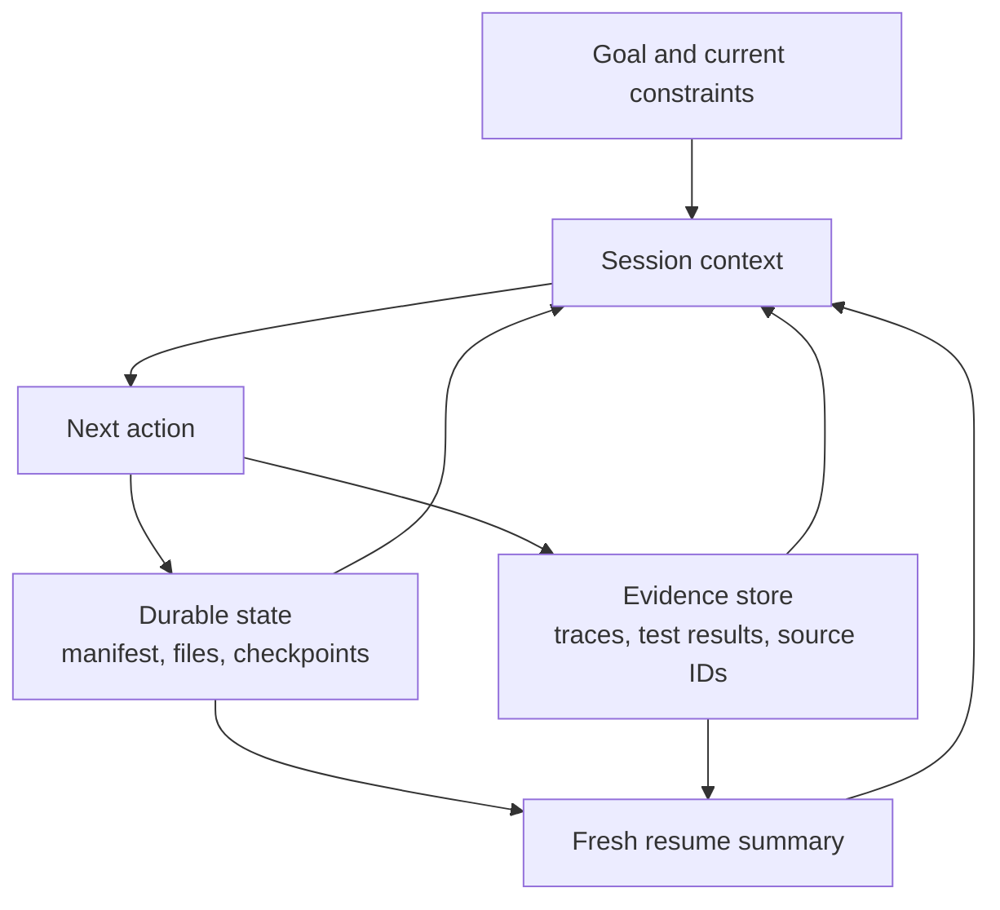

# Agent SDK 会话、子 Agent 与上下文

> 连续性有帮助时才恢复状态；继承来的假设变成风险时就分叉上下文。

> **【中文解读】** 本课回答"长运行 Agent 中断之后，凭什么敢继续"。核心区分是三样东西不能混成一坨：持久外部状态（manifest、文件、检查点、审批）、当前对话上下文（工作集）、执行历史（追踪）。会话只是连续性工具，不是真相来源。全课给出：上下文=工作集的心智模型、四种会话操作（新建/恢复/分叉/压缩）按失败风险选择的准则、结构化恢复包、按职责隔离子 Agent 上下文、钩子的确定性生命周期分工、副作用幂等与"先分类再重试"、边界处的重验证，以及上下文预算的分配。

> **【拓展：会话语义→认证路线位置】** 在认证路线中，本课把第 12 课"会话是连续性，不是真相"的论断展开成可操作的设计：恢复前先对照持久状态核对、压缩不等于恢复、分叉不等于独立。它与第 16 课互为一对——16 课管"委托链怎么拆"，本课管"每条链断了之后怎么接回去"。产品面上对应 Claude Agent SDK 的 sessions、subagents 与 hooks 能力面，并为第 21 课（长上下文可靠性）与架构师毕业设计 31 的恢复与上下文管理证据铺路。

> 🔗 **【前置】** 学本课前请先掌握：(1) 第 12 课——Agent SDK 是执行框架而非许可，其中"会话是连续性、不是真相"与"子 Agent 买到的是上下文隔离"是本课的直接前置；(2) 第 16 课——多 Agent 编排与委托，本课的子 Agent 隔离与协调者职责沿用它定下的契约写法；(3) Phase 14 第 17 课——会话管理的更宽视角。

**类型：** 参考
**语言：** Python
**前置条件：** 第 12 课（Agent SDK 是执行框架，不是许可）、第 16 课（多 Agent 编排与委托）；Phase 14 第 17 课
**预计用时：** 约 120 分钟

## 学习目标

- 把持久的任务状态与对话上下文分开。
- 按失败风险在新建、恢复、分叉与压缩会话之间做选择。
- 用子 Agent 隔离上下文与工具。
- 把钩子安放在确定性的生命周期事件周围。
- 设计不会重放过期假设、不会重复副作用的恢复方案。

## 问题引入

> **【中文解读】** 开篇事故是"把三样东西混成一坨"的标准样本：恢复旧会话后 Agent 跟着过时计划走、重复已成功的写动作、压缩摘要丢掉关键测试失败、评审子 Agent 继承父历史后假设旧行为仍成立。病因不是"会话不好"，而是混淆了持久外部状态、当前对话上下文、执行历史三件事。

一个仓库迁移 Agent 运行了数小时。它的上下文里装着原始计划、工具输出、失败实验、残缺补丁、测试日志和几份摘要。一个依赖变更之后，团队恢复了同一个会话并说："从你停下的地方继续。"

Agent 跟着一份过时的计划走。它重复了一个在超时之前就已成功的写动作。压缩保留了大致故事，却丢掉了一次关键的测试失败。评审子 Agent 收到完整的父历史，于是假设旧的依赖行为仍然成立。

系统混淆了三样东西：

- 持久的外部状态。
- 当前的对话上下文。
- 执行历史。

它们相互关联，但不应当被当成同一个存储。

## 核心概念

### 上下文是工作集

> **【中文解读】** 第一块地基：模型上下文是"下一步决策所需的工作集"，不是已完成工作、审批、文件、检查点或工具副作用的权威数据库。持久事实一律放在上下文之外；会话启动或恢复时，从这些状态重建一份紧凑的当前工作集。

模型上下文应当装的是下一步决策所需的信息。它不是已完成工作、审批、文件、检查点或工具副作用的权威数据库。



把持久事实存在上下文之外：

- 当前任务 manifest 与各任务状态。
- 已完成产物及其版本。
- 幂等键与外部动作 ID。
- 审批及其过期时间。
- 最近验证过的测试与部署结果。
- 未解决的阻塞项。
- 来源与追踪引用。

会话启动或恢复时，从这些状态重建一份紧凑的当前工作集。

### 在四种会话操作中做选择

> **【中文解读】** 四种会话操作按"失败风险"选择，这是考试与实战的双高频判断题：新建（目标或信任边界变了、继承上下文不可靠、前任务已完成）；恢复（任务、约束、证据仍有效且连续性有价值；先重验证外部状态——会话 ID 不能证明世界没变）；分叉（探索替代方案但不得改动原分支）；压缩（上下文变大但当前工作仍受益于连续性）。压缩省的是上下文，不提供持久执行、不保证关键事实幸存、不验证新鲜度。

#### 新建会话

当目标或信任边界变化、继承上下文不可靠、或前序任务已完成时，使用干净的新会话。用权威状态构造一份结构化简报作为输入。

#### 恢复会话

当任务、约束与证据仍然有效、且对话连续性有价值时才恢复。先重验证外部状态。会话 ID 不能证明世界没有变。

#### 分叉会话

当探索替代方案需要保留原分支时分叉。典型场景：竞争性架构方案、相互独立的调试假设、高风险迁移选项。分叉继承一个起点，但没有显式协调就不应改动共享状态。

#### 压缩会话

当上下文增长但当前工作仍受益于连续性时压缩。一份好的压缩摘要保留决策、约束、产物 ID、测试状态、开放缺口与下一步动作。大块证据外置存储，只保留引用。

压缩省下的是上下文。它不创造持久执行，不保证关键事实幸存，也不验证新鲜度。

### 使用结构化恢复包

> **【中文解读】** 恢复包是"恢复时唯一可信输入"的载体：报告当前真相，而不是概括每一轮对话。

```json
{
  "goal": "Migrate the request client without changing public behavior",
  "scope": ["src/client.py", "tests/test_client.py"],
  "completed": [
    {"task": "inventory", "artifact": "work/inventory.json", "verified": true}
  ],
  "current_state": {
    "branch": "migration/client-v2",
    "dependency_version": "verified-at-resume",
    "tests": "12 passed, 1 blocked"
  },
  "open_gaps": ["timeout retry semantics need decision"],
  "constraints": ["no public API change", "no production writes"],
  "next_action": "compare retry behavior against the contract tests"
}
```

（目标：在不改变公共行为的前提下迁移请求客户端；范围：两个文件；已完成：清单任务及其产物与验证标志；当前状态：分支、恢复时已验证的依赖版本、测试结果"12 通过 1 阻塞"；开放缺口：超时重试语义待决策；约束：不改公共 API、不写生产；下一步：把重试行为与契约测试比对。）

恢复包报告的是当前真相。不要概括每一轮对话。

### 按职责隔离子 Agent 上下文

子 Agent 应当收到：

- 一个目标与范围。
- 最小限度的相关证据。
- 受限的工具。
- 显式的输出与错误 schema。
- 轮次、时间与成本预算。
- 完成与升级上报规则。

它不应收到不相关的父历史。隔离保护注意力，也能保住评审者的独立性。

协调者保留全局状态，并在合并前校验返回的契约。

### 用钩子做确定性的生命周期工作

> **【中文解读】** 钩子的持久分工法则（事件名与配置随 SDK 版本变，先学分工再查文档）：前置动作钩子负责校验或拦截；后置动作钩子负责规范化、记录或验证；停止钩子检查完成与清理；会话钩子装载或持久化受控状态。两条红线：需要模型推理的语义判断别塞进脆弱的 shell 逻辑；硬授权别写进提示词。

钩子在会话或工具周围的既定事件上运行。确切的事件名与配置各不相同，请查阅当前的 Agent SDK 与 Claude Code 文档。持久有效的安放法则是：

- 前置动作钩子负责校验或拦截。
- 后置动作钩子负责规范化、记录或验证。
- 停止钩子检查完成与清理。
- 会话钩子装载或持久化受控状态。

示例：

- 拦截声明范围之外的写入。
- 破坏性工具之前要求新鲜审批。
- 截断或外置超大的工具输出。
- 把工具错误规范化到统一 schema。
- 编辑后运行格式化器或定向测试。
- 写一条不可变追踪引用。

不要把需要模型推理的语义判断塞进脆弱的 shell 逻辑。不要把硬授权写进提示词。

### 让副作用幂等

> **【中文解读】** 恢复最大的隐患是"结果丢失后的重复执行"：超时后重试，可能把已经成功的写动作再做一遍。每个外部写都要有幂等或对账策略；"再试一次"只有在错误分类之后才安全。

超时后的恢复可能在结果已丢失时重复一个动作。每个外部写都需要幂等或对账策略。

例如：

- 用唯一请求键创建退款。
- 打补丁前记录预期文件哈希。
- 重试前检查部署版本。
- 持久化工具调用 ID 与结果状态。
- 再写之前先对账未知结果。

"再试一次"只有在错误分类之后才安全。

### 在边界处重验证

继续之前：

1. 解析当前的文件、依赖版本、分支与服务状态。
2. 对照检查点比较。
3. 标记过期的假设。
4. 重跑能确立安全下一步的最小验证。
5. 生成一份新鲜的当前状态摘要。

如果环境已实质分叉，就带着新计划新建或分叉，而不是逼旧会话自我重新解释。

### 规划上下文预算

把上下文分配给：

- 目标与硬约束。
- 当前计划与 manifest。
- 下一步选择所需的近期证据。
- 紧凑的相关工具输出。
- 最终输出契约。

大块原始日志、整个仓库、重复的工具 schema 应放在活跃工作集之外，或藏在渐进披露之后。

用子 Agent 做有边界的搜索并返回带引用的摘要。即使名义窗口很大，上下文也是稀缺的推理表面。

## 动手构建

## 交互实验室

```figure
17-session-context-budget
```

用上下文预算模拟器在目标、约束、证据、工具结果与输出契约之间分配工作集。它直观展示：压缩能缩减体积，却不能证明状态是当前的。

## 练习实验室

在迁移练习中让一个检查点失效，然后在不信任对话历史的前提下修复恢复包。

## 交付产物

已填写的 [`outputs/session-recovery-packet.md`](../outputs/session-recovery-packet.md) 记录了一次被中断的迁移，带哈希、一个未知副作用和一个安全的下一步动作。

## 验证

验证它包含持久状态、重验证、幂等键与隔离评审：

```bash
cd certifications/claude/lessons/17-agent-sdk-sessions-subagents-and-context
python3 code/main.py
python3 -m unittest discover -s code/tests -v
```

测验考查会话选择与恢复规则。

## 毕业设计衔接

把验证过的恢复包附到架构师基础毕业设计上，作为其恢复与上下文管理的证据。

创建一个持久化的三会话迁移练习。

### 会话 1：盘点与计划

产出文件、测试、公共契约、依赖与风险的 manifest。把它持久化在对话之外。此时尚不实现。

### 会话 2：实现与验证

从 manifest 与当前仓库状态出发。使用受限的文件工具。持久化已完成任务 ID、文件哈希、测试输出引用与未解决缺口。

中途在一次文件写入之后模拟超时。恢复时先核对文件哈希，再考虑任何重试。

### 会话 3：独立评审

分叉一个全新的评审上下文。提供 diff、需求、测试与量表，而不是实现转录。评审者返回带证据的结构化发现。

### 钩子要求

- 写前范围门。
- 写后定向验证。
- 工具输出大小上限并外置证据引用。
- 结构化追踪记录。
- 停止检查，要求 manifest 完成或显式部分状态。

## 运行验证

对客服 Agent，把工单状态、检索到的证据 ID、审批与工具结果存进持久的案件记录。会话上下文只装当前问题与相关证据。如果人工几小时后回来，从案件记录重建工作集并重验证政策新鲜度。

对 CI，每次运行都应从某个提交与声明的输入干净启动。复用交互式会话可能引入未声明的状态。改用持久化的发现或结构化摘要作为显式输入。

## 考试决策模式

> **【中文解读】** 一句话决策：连续性有效选恢复，隔离的替代方案选分叉，过期上下文本身是风险时选全新会话；压缩解决的是体积，不是真相。优先"持久状态在提示词之外、恢复时重验证、子 Agent 隔离、钩子做确定性门、重试前对账、传递结构化摘要"的答案；避免把整份旧转录塞进每个新 Agent。

连续性有效选恢复，隔离的替代方案选分叉，过期上下文本身是风险时选全新会话。压缩解决的是体积，不是真相。

优先选择这样的答案：

- 把持久状态放在提示词之外。
- 恢复时重验证当前环境。
- 隔离子 Agent 的上下文与工具。
- 用钩子做确定性门与规范化。
- 重试前先对账未知副作用。
- 传递带产物引用的结构化摘要。

避免把整份旧转录塞进每个新 Agent 的答案。

## 常见陷阱

> **【中文解读】** 四个陷阱就是四句考纲级判断：会话≠状态；压缩≠恢复；分叉≠独立；钩子≠越多越好（保持小、可观测、带版本、绑定具名不变式）。

### 会话等于状态

对话历史不提供事务、幂等、版本控制，也不提供权威的外部真相。

### 压缩等于恢复

摘要可能恰好漏掉最重要的那次失败。恢复靠的是持久状态与验证。

### 分叉等于独立

分叉可能继承有缺陷的证据。评审者独立还需要干净的量表与受控输入。

### 处处都是钩子

过多不透明的钩子让行为难以调试。保持它们小、可观测、带版本，并绑定到具名不变式上。

## 练习

1. 为一个在部署过程中被中断的 Agent 设计恢复包。
2. 给一个高影响工具调用加上幂等与对账。
3. 判断五个场景分别需要恢复、分叉、压缩还是新建会话。
4. 创建一张把语义模型工作与确定性门分开的钩子映射表。
5. 分别测试带与不带生成者转录上下文的评审者，并比较重复出现的假设。

## 关键术语

| 术语 | 人们以为的意思 | 实际含义 |
|------|----------------|----------|
| Session（会话） | 持久记忆 | 一个对话式工作上下文，不是权威的系统状态 |
| Resume（恢复） | 盲目继续 | 在核对当前外部状态之后复用仍有效的上下文 |
| Fork（分叉） | 复制一切 | 从既有上下文分出分支，做隔离的替代工作 |
| Compaction（压缩） | 保住全部细节 | 压缩当前上下文，权威证据仍保留在外部状态里 |
| Hook（钩子） | 一句提示词 | 挂在生命周期事件上的确定性代码 |
| Idempotency（幂等） | 重试一次 | 对同一请求身份重复执行操作不再产生额外效果 |

## 延伸阅读

- [Claude Agent SDK sessions documentation](https://platform.claude.com/docs/en/agent-sdk/sessions) — 当前会话行为的官方说明
- [Claude Agent SDK hooks documentation](https://platform.claude.com/docs/en/agent-sdk/hooks) — 当前生命周期事件的官方说明
- Phase 14, Lesson 40 — 多会话交接
- Phase 15, Lesson 12 — 持久执行
