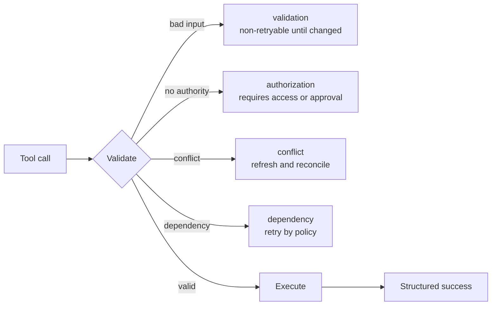

# Tool Contracts, Errors, and Progressive Discovery | 工具契约、错误与渐进式披露

> The model chooses from the interface you describe. Ambiguous tools create ambiguous behavior.

> **【中文解读】** 本课回答"为什么 Agent 会选错工具、失败后为什么会胡乱重试"：根源往往不是模型能力，而是**工具契约（tool contract）**本身模糊。一个强契约 = 互不重叠的名称与描述 + 承载不变量的 schema + 分类且带重试语义的结构化错误 + 按角色收窄的工具分发 + 面向大目录的渐进式披露（progressive disclosure）。全课主线是把"工具定义"从一句功能描述升级为一套决策面：模型选工具、选后校验、失败后恢复，靠的都是这份契约。考试高频点：描述即授权的反模式、错误按类别返回而非自由文本、工具选择（tool choice）与抽取/执行的分离、项目配置与用户机密的分离。

> 🔗 **【前置】** 学本课前请先掌握：(1) 10 课《工具循环是受控的委托》——工具调用是"提议 + 授权"两段式，本课的契约决定提议的质量；(2) 11 课《MCP 把能力与宿主分离》——MCP 的 tools/resources/prompts 三原语，本课直接复用；(3) Phase 13 · 05——工具 schema 设计基础。本课是 CCAR-F/CCAR-P 中工具设计考区的核心参考课。

**Type:** Reference | **类型:** 参考
**Languages:** Python | **语言:** Python
**Prerequisites:** [A Tool Loop Is Controlled Delegation](../../10-tool-use-and-agentic-loops/), [MCP Separates Capability From Host](../../11-mcp-server-design-and-integration/); Phase 13, Lesson 05 | **前置知识:** 10 工具循环是受控的委托；11 MCP 把能力与宿主分离；Phase 13 · 05
**Time:** ~120 minutes | **时间:** 约 120 分钟

## Learning Objectives | 学习目标

- Write tool names, descriptions, and schemas with non-overlapping boundaries
  中文翻译：写出名称、描述与 schema 边界互不重叠的工具。
- Design structured tool and MCP errors that guide safe recovery
  中文翻译：设计能引导安全恢复的结构化工具与 MCP 错误。
- Use tool choice and narrow tool distribution deliberately
  中文翻译：有意识地使用 tool choice 控制与收窄的工具分发。
- Scope MCP configuration and secrets for user and project use
  中文翻译：为用户与项目用途划分 MCP 配置和机密的作用域。
- Apply progressive discovery to large tool catalogs without losing authorization
  中文翻译：对大型工具目录应用渐进式披露，同时不丢掉授权控制。

## The Problem | 问题引入

> **【中文解读】** 本节是全课的反面案例：三个工具 `search`、`find`、`lookup` 的描述全都写着"find information"——一个搜公网、一个查内部客户记录、一个取已批准的政策，schema 都只收一个字符串，错误返回任意文本。结果是公共调研任务查了私有数据、政策问题去搜了网页、工具一报 "failed" 就盲目重试到预算耗尽。定性判断要背下来：**模型不是被工具使用搞糊涂了，是接口抹掉了它安全选择所需的区分**——修接口，而不是修提示词。

An agent sees three tools:

- `search`
- `find`
- `lookup`

Their descriptions all say "find information." One searches public web pages,
one queries internal customer records, and one retrieves approved policy. The
schemas accept a single string. Errors return arbitrary text.

The model chooses inconsistently. A public research task queries private data.
A policy question searches the web. When a tool returns "failed," the agent
retries until its budget expires.

The model is not confused by tool use. The interface erased the distinctions it
needed to choose safely.

> 模型并不是被工具使用搞糊涂了。是接口抹掉了它安全选择所需的区分。

## The Concept | 核心概念

### A Tool Description Is Part of the Decision Surface

> **【中文解读】** 工具描述不是文档，是**决策面**的一部分——模型靠它决定"何时用、何时不用、结果长什么样"。一个强契约要写全八项：单一动作与对象、何时用、何时不用、权威数据边界、所需身份或批准、参数含义与约束、结果与错误形状、副作用与可逆性。对比示例值得精读：`search`（"Search for information"，单字符串参数）与 `search_active_support_policy`（具名数据源 + 正反使用准则 + enum 区域 + 有界 top_k + 版本化结果承诺）的差别，就是"模型猜"与"模型知道"的差别。注意最后一句的边界：接口给了选择边界和结果承诺，**身份与区域校验仍必须在执行时做**——描述不是授权。

A strong tool contract states:

- one action and object
- when to use it
- when not to use it
- authoritative data boundary
- required identity or approval
- argument meaning and constraints
- result and error shape
- side effects and reversibility

Compare:

```json
{
  "name": "search",
  "description": "Search for information",
  "input_schema": {
    "type": "object",
    "properties": {"q": {"type": "string"}}
  }
}
```

with:

```json
{
  "name": "search_active_support_policy",
  "description": "Search approved active support-policy text for the caller's region. Use for policy questions. Do not use for customer-account facts or public web research. Returns versioned policy passages with source IDs.",
  "input_schema": {
    "type": "object",
    "properties": {
      "query": {"type": "string", "minLength": 3},
      "region": {"type": "string", "enum": ["uk", "eu", "us"]},
      "top_k": {"type": "integer", "minimum": 1, "maximum": 8}
    },
    "required": ["query", "region", "top_k"],
    "additionalProperties": false
  }
}
```

The second interface supplies the selection boundary and a result promise. The
service must still validate identity and region at execution.

> 第二个接口给出了选择边界和结果承诺。服务在执行时仍必须校验身份与区域。

### Avoid Overlapping Tools

Two tools overlap when the model cannot infer which one owns a request. Repair
the interface by:

> 当模型无法推断哪个工具拥有一个请求时，两个工具就发生了重叠。通过以下方式修复接口：

- combining identical actions behind one tool
  中文翻译：把相同的动作合并到一个工具背后。
- splitting by a visible object or authority boundary
  中文翻译：按可见的对象或权限边界拆分。
- naming the source or side effect
  中文翻译：把数据源或副作用写进名称。
- adding positive and negative use criteria
  中文翻译：补充正面与负面使用准则。
- providing input examples where current APIs support them
  中文翻译：在当前 API 支持的场合提供输入示例。
- testing selection on confusing pairs
  中文翻译：用易混淆工具对测试选择行为。

Do not add prompt rules to compensate for an incoherent catalog.

> 不要用添加提示词规则来弥补一个不自洽的目录。

### Make Schemas Carry Invariants

Use types, enums, required fields, bounds, patterns, and closed objects. A string
called `options` pushes validation into natural language. Typed fields make
invalid states harder to express.

> 使用类型、enum、必填字段、边界、模式匹配和封闭对象。一个叫 `options` 的字符串等于把校验推给了自然语言。类型化字段让非法状态更难被表达出来。

Schema validity is not semantic validity. The service must still check that the
account exists, the amount fits policy, the user has authority, and referenced
resources belong to the tenant.

> schema 合法不等于语义合法。服务仍然必须检查：账户存在、金额符合政策、用户有权限、被引用的资源属于该租户。

### Return Errors as Data

> **【中文解读】** 本节把"错误"从自由文本升级为**数据契约**。流程图给出四类失败各自的恢复路径：校验失败（改输入前不可重试）、授权失败（需要获取权限或审批）、冲突（刷新后对账）、依赖失败（按策略重试）。错误体七要素见下方清单；两条红线：不暴露堆栈、机密或内部路径；不把所有错误都标成可重试。MCP 工具还要注意：协议的结构化错误信号 + 客户端可解读的内容体，且**传输成功与工具成功是两回事**——HTTP 200 不代表工具逻辑成功。



An error contract should include:

- category
  中文翻译：类别。
- retryable flag
  中文翻译：可重试标志。
- safe message
  中文翻译：安全消息。
- field errors where relevant
  中文翻译：必要时的字段级错误。
- partial result and provenance
  中文翻译：部分结果及其来源。
- suggested safe next action
  中文翻译：建议的安全下一步动作。
- trace or incident reference
  中文翻译：trace 或事件引用。

Do not expose stack traces, secrets, raw credentials, or internal paths. Do not
mark every error retryable.

> 不要暴露堆栈、机密、原始凭据或内部路径。不要把每个错误都标记为可重试。

For MCP tools, use the protocol's structured error signal and a content body the
client can interpret. Transport success and tool success are distinct. Verify
the current specification for exact fields.

> 对 MCP 工具，使用协议的结构化错误信号和一个客户端能解读的内容体。传输成功与工具成功是两回事。确切字段请核对现行规范。

### Use Tool Choice Deliberately

Tool-choice controls can require a tool, allow automatic selection, select a
specific tool, or prevent tool use depending on the current API surface.

> 依当前 API 能力而定，tool choice 控制可以强制指定工具、允许自动选择、选定特定工具或禁止工具使用。

Use forced structured tool output when the application requires a typed result.
Allow automatic choice when deciding whether or which tool is the model's job.
Do not force a real-world action merely to obtain JSON. Separate extraction from
execution.

> 应用需要类型化结果时，使用强制的结构化工具输出。当"是否用工具、用哪个工具"本来就是模型的职责时，交给自动选择。不要为了拿 JSON 而强制触发一个真实世界的动作。把抽取与执行分开。

If parallel tool use is allowed, ensure calls are independent and the harness
can associate every result with the correct call identifier.

> 若允许并行工具使用，要确保各调用相互独立，且 harness 能把每个结果关联到正确的调用标识符。

### Distribute Fewer Tools

> **【中文解读】** 工具列表本身是双刃剑：**既消耗上下文，又制造选择**。正确做法是按角色发最小目录——调研 Agent 只给只读 web/源码工具，政策 Agent 只给生效政策资源与检索，退款建议器只给读案卷 + 算建议，获批执行器只给一个带新鲜审批的有界写工具。反面模式：为了省事把四套目录全塞给一个 Agent。这正是最小权限原则在工具面上的投影。

The tool list consumes context and creates choices. Give each role the minimum
catalog it needs.

> 工具列表既消耗上下文又制造选择。给每个角色它所需的最小目录。

- Research agent: read-only web and source tools.
  中文翻译：调研 Agent：只读的 web 与源码工具。
- Policy agent: active policy resources and search.
  中文翻译：政策 Agent：生效政策资源与检索。
- Refund recommender: read case and calculate recommendation.
  中文翻译：退款建议器：读案卷并计算建议。
- Approved executor: one bounded write tool with fresh approval.
  中文翻译：获批执行器：一个带新鲜审批的有界写工具。

Do not give one agent all four catalogs for convenience.

> 不要为了方便把四套目录全给一个 Agent。

### Discover Large Catalogs Progressively

Start with common tools plus a capability-search mechanism. Load specialized
definitions only after the task establishes need.

> 从常用工具加一个能力检索机制开始。只在任务确立了需求之后，才加载专门定义。

Progressive discovery can improve:

> 渐进式披露可以改善：

- context use
  中文翻译：上下文占用。
- tool selection
  中文翻译：工具选择质量。
- prompt-cache stability
  中文翻译：提示词缓存稳定性。
- security review surface
  中文翻译：安全评审面。

Discovery must apply identity and scope. It must not leak restricted capability
names or descriptions.

> 发现过程必须施加身份与作用域校验。它不得泄露受限能力的名称或描述。

### Scope MCP Configuration

> **【中文解读】** 配置的作用域一句话：**项目配置给团队、随版本走；用户配置跟人走、不进仓库**。共享的服务器声明和安全默认值放项目作用域；个人路径、本地选择、用户专属凭据放提交范围之外。机密只引用环境变量名、绝不提交值。还要按"控制方向"选 MCP 原语：tool 是模型请求动作、resource 是宿主或模型读上下文数据、prompt 是用户或宿主调用可复用模板——不要把每份静态文档都包成动作工具。

Project configuration is versioned for the team. User configuration applies
across projects on one account or machine. Keep shared server declarations and
safe defaults in project scope. Keep personal paths, local choices, and
user-specific credentials outside committed files.

> 项目配置为团队做版本化。用户配置在同一账号或机器上跨项目生效。共享的服务器声明和安全默认值放在项目作用域。个人路径、本地选择和用户专属凭据放在提交文件之外。

Use environment-variable references for secrets. Never commit values. Review
server command, arguments, environment, transport, origin, and tool surface.

> 机密用环境变量引用。绝不提交值。评审服务器命令、参数、环境、传输、origin 和工具面。

MCP servers can expose tools, resources, and prompts. Choose the primitive from
control direction:

> MCP 服务器可以暴露 tools、resources 和 prompts。按控制方向选择原语：

- tool: model requests an action
  中文翻译：tool：模型请求一个动作。
- resource: host or model reads contextual data
  中文翻译：resource：宿主或模型读取上下文数据。
- prompt: user or host invokes a reusable template
  中文翻译：prompt：用户或宿主调用一个可复用模板。

Do not wrap every static document in an action tool.

> 不要把每份静态文档都包进一个动作工具。

### Choose Claude Code Built-In Tools by Intent

Durable boundaries:

- Read for known file content
- Glob for path discovery
- Grep for text and symbol search
- Edit for bounded changes to existing files
- Write for creating or replacing a full file
- Bash for commands, tests, and operations without a safer specialized tool

Restrict Bash and write tools by task. Use the most specific interface that
expresses the intended operation and produces inspectable evidence.

> 按任务限制 Bash 与写工具。使用既能表达预期操作、又能产出可检证据的最具体接口。

## Build It | 动手构建

## Interactive Lab | 交互实验室

> **【中文解读】** 实验与验证环节把契约变成可执行证据：交互图比较重叠工具、渐进加载工具与执行授权三态；练习实验室故意制造一个重叠描述和一个可重试的授权错误，观察两种失败后修复接口与恢复契约；确定性验证器给 `outputs/tool-catalog-review.md` 打分（必备标题 + 证据关键词 + 占位符检查）；毕业设计衔接把评审产物作为 CCAR-F 毕业设计的工具与 MCP 契约索引。审计清单十条与"至少 12 个选择用例（含可命中两工具的查询）"是拿证据说话的标准做法。

```figure
18-tool-discovery-contract
```

Use the discovery-contract figure to compare overlapping tools, progressively
loaded tools, and execution authorization. Change error categories to see when
retry, changed input, approval, or escalation is the only safe continuation.

> 用发现契约图比较重叠工具、渐进加载工具与执行授权。改变错误类别，观察何时重试、改输入、审批或升级是唯一安全的继续方式。

## Practice Lab | 练习实验室

Introduce one overlapping description and one retryable authorization error,
observe both failures, and repair the interface and recovery contract.

> 引入一个重叠描述和一个可重试的授权错误，观察两种失败，然后修复接口与恢复契约。

## Shipped Artifact | 交付产物

The filled [`outputs/tool-catalog-review.md`](../outputs/tool-catalog-review.md)
contains distinct policy, account, and public-search boundaries plus a failure
matrix.

> 填写完成的 [`outputs/tool-catalog-review.md`](../outputs/tool-catalog-review.md)
> 包含互异的政策、账户与公开搜索边界，外加一张失败矩阵。

## Verify It | 验证

Run the deterministic contract review:

> 运行确定性契约评审：

```bash
cd certifications/claude/lessons/18-tool-contracts-errors-and-progressive-discovery
python3 code/main.py
python3 -m unittest discover -s code/tests -v
```

The quiz tests the same selection rules.

> 测验考查同样的选择规则。

## Capstone Connection | 毕业设计衔接

Carry the artifact into the Architect Foundations capstone as the tool and MCP
contract index.

> 把该产物带进架构师基础级毕业设计，作为工具与 MCP 契约索引。

Audit a tool catalog with this checklist.

> 用这份清单审计一个工具目录。

| Question | Evidence |
|----------|----------|
| Does each name identify one action and object? | Selection test |
| Are positive and negative use cases distinct? | Confusion-pair eval |
| Does schema reject invalid shapes? | Validator tests |
| Does service enforce semantic and auth rules? | Integration tests |
| Are errors categorized and retry-aware? | Failure fixtures |
| Is every side effect named and bounded? | Threat model |
| Are tools minimal for each role? | Capability matrix |
| Can large catalogs load progressively? | Context and cache measurement |
| Are project and user configs separated? | Configuration review |
| Are secrets referenced, never stored? | Repository scan |

Create at least twelve selection cases, including queries that could plausibly
match two tools. The eval passes only when the model selects the correct tool or
correctly chooses no tool.

> 创建至少十二个选择用例，包括那些看起来可能命中两个工具的查询。只有当模型选出正确工具、或正确地选择不用工具时，评估才算通过。

Inject validation, authorization, conflict, rate-limit, timeout, and partial
result failures. Assert the harness changes behavior according to category.

> 注入校验、授权、冲突、限流、超时与部分结果失败。断言 harness 依据错误类别改变行为。

## Use It | 运行验证

For structured extraction, define one no-side-effect tool whose schema represents
the desired record. Force that tool when a structured record is required. Then
validate semantic constraints and provenance. Do not reuse a production write
tool as an output schema.

> 做结构化抽取时，定义一个无副作用的工具，其 schema 就是想要的记录。需要结构化记录时强制该工具。然后校验语义约束与来源。不要把生产写工具复用为输出 schema。

For a large enterprise catalog, use a registry to find capabilities by task and
scope. Load only the selected definitions. Monitor catalog size, discovery
precision, tool selection, cache hits, and unauthorized discovery attempts.

> 面向大型企业目录，用注册中心按任务与作用域发现能力。只加载选中的定义。监控目录规模、发现精度、工具选择、缓存命中与未授权的发现尝试。

## Exam Decision Patterns | 考试决策模式

> **【中文解读】** 应试主线一句话：**工具问题多半是接口问题**——先修描述、边界、schema、分发与错误契约，再考虑加提示词复杂度。偏好选项六条见下；对照"常见陷阱"四条记忆：描述当授权（"Admins only" 只是文本）、错误文本当恢复策略（要返回显式类别与重试状态）、一个工具包打天下（大 schema 难选择难授权）、共享配置里藏机密（项目文件要引用环境变量、值放版本控制之外）。

Tool problems are often interface problems. Repair descriptions, boundaries,
schemas, distribution, and error contracts before adding prompt complexity.

> 工具问题往往是接口问题。在添加提示词复杂度之前，先修描述、边界、schema、分发与错误契约。

Prefer answers that:

- give tools distinct names and negative-use guidance
  中文翻译：给工具互异的名称与负面使用准则。
- return structured `isError`-style results with retry semantics
  中文翻译：返回带重试语义的结构化 `isError` 式结果。
- use tool choice to enforce typed output where appropriate
  中文翻译：在合适的场合用 tool choice 强制类型化输出。
- separate project configuration from user secrets
  中文翻译：把项目配置与用户机密分开。
- use resources for contextual data and tools for actions
  中文翻译：上下文数据用 resource、动作用 tool。
- apply progressive discovery to large catalogs
  中文翻译：对大型目录应用渐进式披露。

## Common Traps | 常见陷阱

### Tool Description as Authorization

"Admins only" is text. The service needs authenticated scope and policy.

> "Admins only" 只是一句文本。服务需要经过认证的作用域与策略。

### Error Text as Recovery Policy

The model guesses whether "failed" means retry, change input, escalate, or stop.
Return explicit category and retry state.

> 模型只能猜 "failed" 是要重试、改输入、升级还是停止。要返回显式的类别与重试状态。

### One Tool for Every Operation

Huge schemas and conditional behavior become difficult to select, validate, and
authorize. Split along meaningful boundaries.

> 巨大的 schema 和条件化行为会变得难以选择、难以校验、难以授权。沿有意义的边界拆分。

### Secrets in Shared Configuration

Project files are designed for collaboration. Reference environment names and
provision values outside version control.

> 项目文件天生为协作设计。引用环境变量名，把值放在版本控制之外供给。

## Exercises | 练习

1. Rewrite five ambiguous tool definitions with distinct boundaries.
   中文翻译：重写五个边界模糊的工具定义，使其互异。
2. Build a confusion-pair evaluation for internal, public, and policy search.
   中文翻译：为内部、公开与政策检索构建易混淆对评估。
3. Design structured partial results for a multi-source search timeout.
   中文翻译：为多源搜索超时设计结构化部分结果。
4. Split a monolithic MCP server into tools, resources, and prompts.
   中文翻译：把一个单体 MCP 服务器拆成 tools、resources 和 prompts。
5. Create project and user configuration examples with no secret values.
   中文翻译：创建不含机密值的项目与用户配置示例。

## Key Terms | 关键术语

| Term | What people say | What it actually means |
|------|-----------------|------------------------|
| Tool contract | Function name | Selection guidance, schema, result, error, authority, and side-effect boundary |
| Negative-use guidance | Extra prompt text | Explicit situations where another interface owns the request |
| Tool choice | Tool permission | Request-level control over whether or which tool Claude must call |
| Progressive discovery | Dynamic authorization | Loading relevant capabilities on demand after scoped discovery |
| MCP resource | A read tool | Contextual data identified and read through the resource primitive |
| Project scope | Global config | Versioned configuration intended for one repository or team |

## Further Reading

- [Claude tool use documentation](https://platform.claude.com/docs/en/agents-and-tools/tool-use/overview)
- [MCP specification](https://modelcontextprotocol.io/specification/latest)
- [Claude Code MCP documentation](https://docs.anthropic.com/en/docs/claude-code/mcp)
- Phase 13, Lesson 05 for tool schema design
- Phase 13, Lesson 15 for tool-poisoning threats
