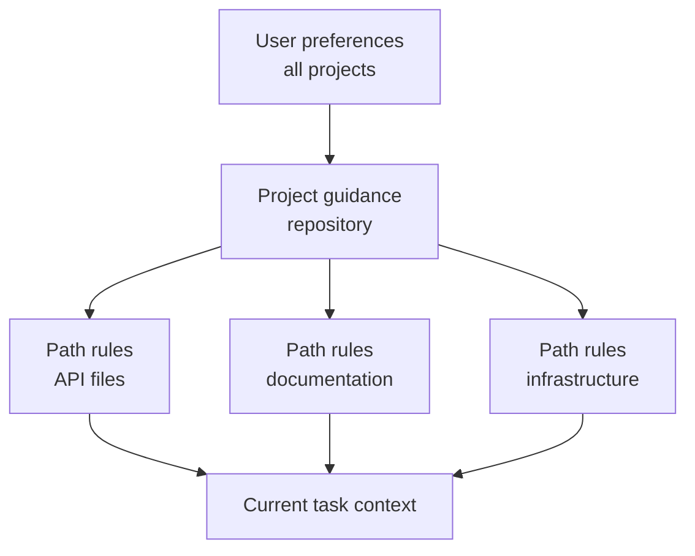

# Claude Code Memory, Rules, Skills, and CI | Claude Code 记忆、规则、Skill 与 CI

> Put stable guidance where its scope is true, and executable constraints where failure is unacceptable.

> **【中文解读】** 本课是 Claude Code 配置面的"总装课"：把记忆（CLAUDE.md 及导入）、路径规则、Skill、Command、子代理、钩子、settings 和无头 CI 放进一张选择矩阵。核心原则只有两句：稳定的指南要放在其作用域为真的最窄位置；不可失败的约束要用可执行的机制（钩子、权限、CI）而不是更粗的提示词。全课主线：先诊断"根文件膨胀 + 私有覆盖 + CI 配置不一致"的病根，再逐个机制讲"何时用、何时避"，最后落到无头 CI 的可复现评审与跨运行的发现留存。

> **【拓展：个人工具→团队基础设施→CI 证据链】** Claude Code 的配置体系是一条演进线：个人用 CLAUDE.md 放偏好，团队把共享决策提交进仓库（记忆、路径规则、Skill、子代理），组织用插件市场分发版本化捆绑包，最后用无头模式把"AI 评审"接进 CI 产出结构化证据。这条线与第 15 课（团队共享约束）、第 17 课（Agent SDK 会话与子代理）直接衔接；2026 年 7 月的 CCAR-F 蓝图明确考察这套层级、规则、记忆、规划与无头工作流。记住分层：项目配置是团队决策，托管 settings 是不可覆盖的组织策略。

> 🔗 **【前置】** 学本课前请先掌握：(1) 第 15 课"Claude Code 靠共享约束扩展规模"——团队为什么要把配置版本化进仓库；(2) 第 17 课"Agent SDK 会话、子代理与上下文"——子代理的隔离上下文与结果契约，本课把同样的边界思想搬进 Claude Code 的 `/agents`。

**Type:** Reference | **类型:** 参考
**Languages:** Python | **语言:** Python
**Prerequisites:** [Claude Code Scales Through Shared Constraints](../../15-claude-code-for-development-teams/), [Agent SDK Sessions, Subagents, and Context](../../17-agent-sdk-sessions-subagents-and-context/) | **前置知识:** 第 15 课（Claude Code 靠共享约束扩展规模）、第 17 课（Agent SDK 会话、子代理与上下文）
**Time:** ~210 minutes | **时间:** 约 210 分钟

## Learning Objectives | 学习目标

- Design project and user instruction hierarchy without context bloat
  中文翻译：设计项目级与用户级的指令层级，同时不造成上下文膨胀。
- Choose CLAUDE.md, path rules, Skills, commands, agents, hooks, and settings by purpose
  中文翻译：按用途在 CLAUDE.md、路径规则、Skill、Command、Agent、钩子和 settings 之间做选择。
- Author and distribute a real multi-file `SKILL.md` package with narrow tool grants
  中文翻译：编写并分发一个带窄工具授权的真实多文件 `SKILL.md` 软件包。
- Use plan, direct execution, and bounded subagents with explicit obstacle reports
  中文翻译：使用规划模式、直接执行与有边界的子代理，并要求显式的障碍报告。
- Configure headless Claude Code for reproducible CI evidence
  中文翻译：配置无头 Claude Code，产出可复现的 CI 证据。
- Prevent stale memory, broad permissions, and hidden local configuration from controlling team work
  中文翻译：防止过期记忆、过宽权限和隐藏的本地配置控制团队工作。

## The Problem | 问题引入

> **【中文解读】** 开篇病例要背下来：一个团队把所有指令塞进一个根 `CLAUDE.md`——架构历史、格式规范、数据库规则、部署步骤、个人偏好、六种语言的命令与示例——每个任务都被整体复制进上下文。接着四个并发症依次出现：开发者加私有覆盖、CI 用另一套配置、某个命令假设有写权限、一个宽泛钩子重排无关文件；"总是跑全部测试"的指令让一次文档小改动触发 40 分钟测试。诊断：问题不是指令不够多，而是作用域、优先级、渐进式披露，以及把"指导"误当"强制"。

A team keeps every instruction in one root `CLAUDE.md`: architecture history,
formatting, database rules, deployment steps, personal preferences, commands, and
examples for six languages. It is copied into every task.

> 一个团队把所有指令都塞进一个根 `CLAUDE.md`：架构历史、格式规范、数据库规则、部署步骤、个人偏好、命令，以及六种语言的示例。它被复制进每个任务。

Developers add private overrides. CI has a different configuration. One command
assumes write access. A broad hook reformats unrelated files. The instructions
say "always run every test," so a small docs edit triggers a 40-minute suite.
When the agent ignores a safety rule, the team adds more bold text.

> 开发者添加私有覆盖。CI 用的是另一套配置。某个命令假设自己有写权限。一个宽泛的钩子重排了无关文件。指令写着"总是跑每一个测试"，于是一次文档小改动触发了 40 分钟的测试套件。当 Agent 无视一条安全规则时，团队的做法是加更多加粗文字。

The problem is not insufficient instruction. The problem is scope, precedence,
progressive disclosure, and confusing guidance with enforcement.

> 问题不在于指令不足。问题在于作用域、优先级、渐进式披露，以及把指导与强制混为一谈。

## The Concept | 核心概念

### Match the Mechanism to the Job | 让机制匹配任务

> **【中文解读】** 这张选择矩阵是全课的骨架，也是考试题眼：`CLAUDE.md` 放精简稳定的仓库级指南与指针（禁放完整手册、临时状态、密钥）；导入文件放靠近所有者的共享支撑指令（防循环、防隐形指令图）；路径规则只对匹配文件生效（别把全局规则复制进每个任务）；Skill 放按需加载的可复用流程（别放一次性事实或硬授权）；Command 是用户显式调用的兼容名；Agent 放带隔离上下文与工具的有边界角色（别放确定性工具函数）；钩子放确定性校验、拦截、规范化或自动化（别放开放式语义判断）；settings 放权限、模型、插件与运行时配置（别放提交进仓库的密钥值）。

| Mechanism | Best use | Avoid |
|-----------|----------|-------|
| `CLAUDE.md` | Concise stable repository guidance and pointers | Full manuals, transient state, secrets |
| Imported files | Shared supporting instructions kept near their owners | Circular or invisible instruction graphs |
| Path rules | Guidance true only for matching files | Global rules copied into every task |
| Skill | Reusable process or domain playbook loaded when relevant | One-off facts or hard authorization |
| Command | Compatibility name for an explicit user-invoked workflow | New multi-step packages without Skill structure |
| Agent | Bounded role with isolated context and tools | Deterministic utility functions |
| Hook | Deterministic validation, blocking, normalization, or automation | Open-ended semantic judgment |
| Settings | Permission, model, plugin, and runtime configuration | Secret values committed to the repository |

Product note, verified 2026-08-09: custom commands have been merged into Skills.
Files under `.claude/commands/` remain compatible, while
`.claude/skills/<name>/SKILL.md` is the preferred package for new workflows.
Exact fields, precedence, and product availability can change. Verify the
current Claude Code documentation before implementation. The July 2026 CCAR-F
blueprint expects you to understand the hierarchy, rules, commands, Skills,
agents, memory, planning, and headless workflows.

> 产品说明（2026-08-09 核实）：自定义 Command 已并入 Skill。`.claude/commands/` 下的文件保持兼容，而 `.claude/skills/<name>/SKILL.md` 是新工作流的首选软件包形式。确切字段、优先级与产品可用性可能变化。实现前请核对当前 Claude Code 文档。2026 年 7 月的 CCAR-F 蓝图要求你理解层级、规则、Command、Skill、Agent、记忆、规划与无头工作流。

### Keep the Root Instruction File Small | 保持根指令文件精简

> **【中文解读】** 根文件的验收标准：帮一个能干的新贡献者正确起步。该放：项目目的与非显而易见的架构边界、权威的构建/测试/格式化命令、事实源文件、安全与作用域约束、指向更深入指南的链接或导入、验证与贡献预期。不该放：临时任务状态、生成的清单、冗长的 API 参考、个人编辑器设置、密钥值、只适用于单个目录的指令。定位是"入职路由器"，不是"知识倾倒场"。

The root file should help a capable new contributor start correctly.

> 根文件应该帮一个能干的新贡献者正确起步。

Include:

- project purpose and non-obvious architecture boundaries
  中文翻译：项目目的与非显而易见的架构边界。
- canonical build, test, and formatting commands
  中文翻译：权威的构建、测试与格式化命令。
- source-of-truth files
  中文翻译：事实源文件。
- security and scope constraints
  中文翻译：安全与作用域约束。
- links or imports to deeper guidance
  中文翻译：指向更深入指南的链接或导入。
- verification and contribution expectations
  中文翻译：验证与贡献预期。

Exclude:

- temporary task status
  中文翻译：临时任务状态。
- generated inventories
  中文翻译：生成的清单。
- long API references
  中文翻译：冗长的 API 参考。
- personal editor settings
  中文翻译：个人编辑器设置。
- secret values
  中文翻译：密钥值。
- instructions that apply only to one directory
  中文翻译：只适用于单个目录的指令。

Treat it as an onboarding router, not a knowledge dump.

> 把它当作入职路由器，而不是知识倾倒场。

### Place Instructions at the Narrowest True Scope | 把指令放到最窄的真实作用域



User scope holds personal defaults that should not define team behavior. Project
scope holds versioned shared decisions. Path-specific rules load only where
their file patterns apply. Task instructions contain the current request.

> 用户作用域放个人默认值，不应由它定义团队行为。项目作用域放版本化的共享决策。路径级规则只在其文件模式匹配处加载。任务指令包含当前请求。

When two rules conflict, investigate the documented precedence and make the
project source of truth explicit. Do not depend on a hidden local override for a
critical workflow.

> 当两条规则冲突时，查明文档规定的优先级，并让项目事实源显式化。不要让关键工作流依赖一个隐藏的本地覆盖。

### Import Stable Supporting Guidance | 导入稳定的支撑性指南

Use imports to keep the root file concise while preserving modular ownership.
For example, database migration policy belongs near database documentation. A
root pointer keeps it discoverable.

> 用导入保持根文件精简，同时保留模块化的所有权。例如，数据库迁移策略应靠近数据库文档存放，根文件里放一个指针保证它可被发现。

Audit the import graph:

- every target exists
  中文翻译：每个目标都存在。
- no cycles
  中文翻译：没有环。
- no broad file import leaks secrets or irrelevant text
  中文翻译：没有宽泛的文件导入泄漏密钥或无关文本。
- ownership and update trigger are clear
  中文翻译：所有权与更新触发条件清晰。
- deleted or renamed guidance fails visibly
  中文翻译：被删除或改名的指南会显式失败。

Memory inspection commands can help reveal which instructions are active. Use
them to debug configuration, not to store unrecoverable project state.

> 记忆检查命令能帮助揭示哪些指令处于激活状态。用它们调试配置，而不是用来存放不可恢复的项目状态。

### Use Skills for Progressive Disclosure | 用 Skill 实现渐进式披露

> **【中文解读】** Skill 是"按需加载的流程包"：描述（description）帮 Agent 判断何时适用，正文只在被选中时加载，从而保护无关任务的上下文。好例子：数据库迁移评审、事件分诊、发行说明生成、威胁模型清单、架构决策访谈。Skill 要定义输入、步骤、证据、输出与停止条件，不能内嵌密钥或授予权限。描述是"触发契约"：写清做什么、何时用，用开发者真正会说的话；要测正例触发和近似例不触发。`allowed-tools` 只是对本次调用回合的工具预批准，不收窄可用工具集、不覆盖拒绝规则、不会成为会话级授权。

A Skill packages a repeatable method, references, scripts, and artifacts. Its
description helps the agent decide when it applies. The full body loads only
when selected, protecting context for unrelated work.

> Skill 把可复用的方法、参考、脚本与工件打包在一起。它的描述帮 Agent 判断何时适用。正文只在被选中时才加载，从而保护无关工作的上下文。

Good Skills:

- database migration review
  中文翻译：数据库迁移评审。
- incident triage
  中文翻译：事件分诊。
- release-note generation
  中文翻译：发行说明生成。
- threat-model checklist
  中文翻译：威胁模型清单。
- architecture decision interview
  中文翻译：架构决策访谈。

The Skill should define inputs, sequence, evidence, output, and stop conditions.
It should not embed secrets or grant permissions.

> Skill 应定义输入、步骤、证据、输出与停止条件。它不应内嵌密钥，也不应授予权限。

An actual project Skill lives at `.claude/skills/<skill-name>/SKILL.md`. The
entry file has YAML frontmatter and Markdown instructions:

```yaml
---
name: migration-review
description: Review database migration files when a change adds or modifies paths under migrations/. Use it before merge to collect forward, rollback, locking, and data-safety evidence.
allowed-tools: Read Grep Glob Bash(python3 ${CLAUDE_SKILL_DIR}/scripts/check_scope.py *)
---
```

The description is a trigger contract. State what the Skill does and when it
applies using language a developer will actually use. Test requests that should
trigger and near-miss requests that should not. Use
`disable-model-invocation: true` when only an explicit `/skill-name` invocation
should load it.

> 描述是一份触发契约。用开发者真正会说的话，写清这个 Skill 做什么、何时适用。既要测试应当触发的请求，也要测试不应触发的近似请求。当只允许显式 `/skill-name` 调用加载时，使用 `disable-model-invocation: true`。

`allowed-tools` pre-approves matching tools for the invocation turn. It does not
restrict the available tool set, override deny rules, or persist as a session
grant. Keep the pattern as narrow as the packaged procedure and review project
Skills before accepting folder trust.

> `allowed-tools` 为本次调用回合预批准匹配的工具。它不收窄可用工具集、不覆盖拒绝规则、也不会持久化为会话级授权。让模式保持与打包流程一样窄，并在接受文件夹信任前评审项目 Skill。

Move detail out of `SKILL.md` and route to it deliberately:

| Skill file | Purpose | Load condition |
|---|---|---|
| `SKILL.md` | Trigger, core sequence, stop condition, output contract | When the Skill is invoked |
| `references/review-checklist.md` | Detailed domain evidence | When the core sequence reaches review |
| `scripts/check_scope.py` | Deterministic path validation | Before reading requested migration files |
| `examples/accepted.md` | One representative output shape | When format is ambiguous |

Reference every supporting file from `SKILL.md` so Claude knows why and when to
open it. Resolve bundled paths through `${CLAUDE_SKILL_DIR}` rather than assuming
the current working directory. The shipped package under
[`outputs/migration-review-skill/`](../outputs/migration-review-skill/) is a
runnable example.

> 从 `SKILL.md` 引用每一个支撑文件，让 Claude 知道为什么以及何时打开它。通过 `${CLAUDE_SKILL_DIR}` 解析捆绑路径，而不是假设当前工作目录。[`outputs/migration-review-skill/`](../outputs/migration-review-skill/) 下的随课软件包是一个可运行的示例。

### Use Commands for Explicit User Intent | 用 Command 承接明确的用户意图

Commands are useful when the user deliberately invokes a repeatable workflow.
Define argument hints, allowed tools, and execution context. If a command needs
isolation, use a forked context when supported and appropriate.

> 当用户有意识地调用一个可复用工作流时，Command 很有用。定义参数提示、允许的工具与执行上下文。如果命令需要隔离，在受支持且合适时使用分叉上下文。

Examples:

- review one migration file
  中文翻译：评审一个迁移文件。
- generate an ADR from an interview
  中文翻译：从一次访谈生成一份 ADR。
- run a targeted test plan
  中文翻译：运行一个有针对性的测试计划。
- inspect a failed CI trace
  中文翻译：检查一次失败的 CI 追踪。

Avoid commands that silently write, deploy, or use broad Bash access. The name
and argument contract should make the consequence clear.

> 避免会静默写入、部署或使用宽泛 Bash 权限的命令。名称与参数契约应让后果一目了然。

For new work, implement that explicit workflow as a user-invocable Skill.
Existing `.claude/commands/<name>.md` files still create `/<name>` and can migrate
without breaking users. Prefer the Skill directory when the procedure needs
scripts, references, templates, invocation controls, or distribution through a
plugin.

> 对新工作，把这种显式工作流实现为用户可调用的 Skill。既有的 `.claude/commands/<name>.md` 文件仍然会创建 `/<name>`，可以迁移而不破坏用户。当流程需要脚本、参考、模板、调用控制或通过插件分发时，优先使用 Skill 目录。

### Use Subagents as Bounded Evidence Gatherers | 把子代理当作有边界的证据收集者

> **【中文解读】** 子代理的纪律是"预算 + 契约 + 障碍报告"：`description` 告诉 Claude 何时委托；`tools` 限制其工具池；`maxTurns` 给出硬回合预算；`isolation: worktree` 给会编辑的子代理一份独立检出。关键观念：回合或时间盒是停止条件，不是完成证据——父会话负责校验结果并拥有集成。要求结构化的障碍报告：子代理访问不了文件时，返回 `status: blocked`、确切障碍、已尝试的证据和窄的 `next_step`，而不是静默放宽工具或范围。还要记住：worktree 只对会编辑的子代理用；只读研究者通常只需要独立上下文；worktree 隔离文件和分支，不隔离网络、凭据、共享 Git 元数据或外部系统。

Run `/agents` to create and manage reusable subagent definitions. Store a
project agent under `.claude/agents/` so its role is reviewed with the codebase.
The `description` tells Claude when to delegate; `tools` restricts its tool pool;
`maxTurns` supplies a hard turn budget; `isolation: worktree` gives an editing
agent a separate checkout.

> 运行 `/agents` 创建和管理可复用的子代理定义。把项目级 Agent 存放在 `.claude/agents/` 下，让它的角色随代码库一起评审。`description` 告诉 Claude 何时委托；`tools` 限制其工具池；`maxTurns` 提供硬回合预算；`isolation: worktree` 给会编辑的 Agent 一份独立检出。

```markdown
---
name: migration-auditor
description: Audit migration safety when a change touches migrations/. Return evidence and blockers; do not edit.
tools: Read, Grep, Glob, Bash
maxTurns: 10
isolation: worktree
---

Inspect only the assigned migration and adjacent schema code.
Stop after ten turns or twenty minutes, whichever comes first.
Return JSON with status, evidence, blockers, and next_step.
Never replace missing evidence with an assumption.
```

A turn or time box is a stop condition, not evidence of completion. The parent
session validates the result and owns integration. Require structured obstacle
reporting so a subagent that cannot access a file returns `status: blocked`, the
exact obstacle, attempted evidence, and a narrow `next_step` instead of silently
widening tools or scope.

> 回合或时间盒是停止条件，不是完成证据。父会话校验结果并拥有集成。要求结构化的障碍报告：访问不了文件的子代理应返回 `status: blocked`、确切的障碍、已尝试的证据和一个窄的 `next_step`，而不是静默放宽工具或范围。

Use worktree isolation only when the subagent edits. A read-only researcher often
needs only a separate context. Worktrees isolate files and branches, not network,
credentials, shared Git metadata, or external systems.

> 只在子代理会编辑时使用 worktree 隔离。只读研究者通常只需要一份独立上下文。worktree 隔离的是文件和分支，不隔离网络、凭据、共享 Git 元数据或外部系统。

### Distribute Through the Smallest Shared Surface | 通过最小的共享面分发

Choose distribution from the audience:

- Commit `.claude/skills/` and `.claude/agents/` for one repository.
  中文翻译：单一仓库：直接提交 `.claude/skills/` 与 `.claude/agents/`。
- Put skills, agents, hooks, and MCP definitions in a plugin when several
  repositories need the same versioned bundle.
  中文翻译：多个仓库需要同一套版本化捆绑包时：把 Skill、Agent、钩子与 MCP 定义放进插件。
- Publish plugins through a reviewed marketplace and pin a release or commit.
  中文翻译：通过受评审的市场发布插件，并固定到某个 release 或 commit。
- Use managed settings for organization policy and marketplace restrictions,
  not as a dumping ground for every team's procedure.
  中文翻译：托管 settings 用于组织策略与市场限制，而不是每个团队流程的倾倒场。

A project can announce a marketplace and enable reviewed plugins in
`.claude/settings.json`:

```json
{
  "extraKnownMarketplaces": {
    "company-tools": {
      "source": {"source": "github", "repo": "company/claude-plugins"},
      "autoUpdate": false
    }
  },
  "enabledPlugins": {
    "migration-review@company-tools": true
  }
}
```

Folder trust still matters, and managed `strictKnownMarketplaces` can restrict
which sources users may add before any network or filesystem operation. Review
publisher, version, components, scripts, hooks, MCP servers, permissions,
updates, and rollback. Project defaults are team configuration; managed settings
are non-overridable organization policy.

> 文件夹信任依然重要，托管的 `strictKnownMarketplaces` 能在任何网络或文件系统操作之前限制用户可添加的来源。评审发布者、版本、组件、脚本、钩子、MCP 服务器、权限、更新与回滚。项目默认值是团队配置；托管 settings 是不可覆盖的组织策略。

### Use Path Rules as Local Policy | 把路径规则当局部策略

Path globs can express rules such as:

- API changes require contract tests
  中文翻译：API 变更必须带契约测试。
- migration files are append-only
  中文翻译：迁移文件只允许追加。
- docs use a specific style
  中文翻译：文档遵循特定风格。
- production configuration cannot contain literal secrets
  中文翻译：生产配置不得包含字面密钥。

Test glob behavior. A rule that never matches creates false confidence. A glob
that matches the whole repository recreates root-file bloat.

> 测试 glob 的行为。永不匹配的规则制造虚假信心；匹配整个仓库的 glob 会重新制造根文件膨胀。

### Separate Planning, Exploration, and Execution | 分离规划、探索与执行

Use plan mode when scope or strategy needs approval before mutation. Use an
exploration subagent for read-only codebase questions that would otherwise bloat
the main task. Execute directly when the change is already bounded and the next
safe action is obvious.

> 当范围或策略需要在动手改之前获批时，使用规划模式。当只读的代码库问题会撑大主任务上下文时，使用探索子代理。当变更已有边界且下一个安全动作显而易见时，直接执行。

An interview pattern is useful when requirements are missing. Ask questions
that materially change the implementation, record decisions, then build.

> 需求缺失时，访谈模式很有用。问那些会实质改变实现的问题，记录决策，然后再构建。

Examples and tests improve consistency when they demonstrate the actual
acceptance boundary. Do not add examples that only repeat instructions.

> 当示例与测试展示的是真实的验收边界时，它们能提升一致性。不要添加 merely 复述指令的示例。

### Make Tests Part of the Conversation Contract | 让测试成为会话契约的一部分

For a code task:

1. Identify the behavior and smallest relevant verification.
   中文翻译：识别行为与最小的相关验证。
2. Establish or write a failing test where practical.
   中文翻译：在可行处建立或编写一个失败的测试。
3. Make the bounded change.
   中文翻译：做出有边界的变更。
4. Run focused tests.
   中文翻译：运行聚焦测试。
5. Run broader gates proportional to risk.
   中文翻译：按风险比例运行更宽的关卡。
6. Inspect the actual artifact or behavior.
   中文翻译：检查实际的工件或行为。
7. Report exact evidence and remaining uncertainty.
   中文翻译：报告确切的证据与剩余的不确定性。

Claude can propose and execute this loop, but deterministic CI decides whether
the gate passed.

> Claude 可以提议并执行这个循环，但关卡是否通过由确定性 CI 决定。

### Hook Decisions Need Exact Contracts | 钩子决策需要精确契约

> **【中文解读】** 钩子的 JSON 契约必须精确到字段：命令钩子要么以退出码 `0` 退出并向 stdout 打印一个结构化 JSON 对象，要么以退出码 `2` 退出并向 stderr 写入拦截原因——不能混用，因为 JSON 只在退出码 `0` 时被解析；退出码 `1` 对大多数事件是非阻塞的。事件 schema 不可互换：`PreToolUse` 用 `hookSpecificOutput.permissionDecision`（`allow`/`deny`/`ask`/`defer`）；`PermissionRequest` 用 `hookSpecificOutput.decision.behavior`（`allow`/`deny`）。已配置的 deny 与 ask 规则仍会被评估，allow 结果不能覆盖匹配的 deny 规则。退出码 `2` 能拦截 `PreToolUse` 并拒绝 `PermissionRequest`，但无法撤销 `PostToolUse` 已观察到的动作。

Claude Code sends JSON to hooks. A command hook either exits `0` and prints one
structured JSON object to stdout, or exits `2` and writes a blocking reason to
stderr. Do not mix the two because JSON is parsed only on exit `0`. Exit `1` is
non-blocking for most events.

> Claude Code 向钩子发送 JSON。命令钩子要么以退出码 `0` 退出并向 stdout 打印一个结构化 JSON 对象，要么以退出码 `2` 退出并向 stderr 写入拦截原因。不要混用两者，因为 JSON 只在退出码 `0` 时被解析。退出码 `1` 对大多数事件是非阻塞的。

Event schemas are not interchangeable. `PreToolUse` uses
`hookSpecificOutput.permissionDecision` with `allow`, `deny`, `ask`, or `defer`.
`PermissionRequest` uses `hookSpecificOutput.decision.behavior` with `allow` or
`deny`. Configured deny and ask rules are still evaluated; an allow result does
not override a matching deny rule.

> 事件 schema 不可互换。`PreToolUse` 使用 `hookSpecificOutput.permissionDecision`，取值为 `allow`、`deny`、`ask` 或 `defer`。`PermissionRequest` 使用 `hookSpecificOutput.decision.behavior`，取值为 `allow` 或 `deny`。已配置的 deny 与 ask 规则仍会被评估；allow 结果不能覆盖匹配的 deny 规则。

```json
{
  "hookSpecificOutput": {
    "hookEventName": "PermissionRequest",
    "decision": {
      "behavior": "deny",
      "message": "Production access requires interactive approval"
    }
  }
}
```

Confirm whether exit `2` can block the chosen event. It blocks `PreToolUse` and
denies `PermissionRequest`; it cannot undo an action observed by `PostToolUse`.

> 确认退出码 `2` 能否拦截所选事件。它能拦截 `PreToolUse` 并拒绝 `PermissionRequest`；但它无法撤销已被 `PostToolUse` 观察到的动作。

### Design Headless CI as a Fresh Reviewer | 把无头 CI 设计成全新评审者

> **【中文解读】** 无头模式的持久原则：从干净的提交与声明的输入出发；用最小权限工具与 settings；固定或记录模型与配置；设时间、回合与成本上限；要求 JSON 或受 schema 约束的输出；把"生成发现"与"应用变更"分开；需要时跑独立评审；检查整改时显式带上先前的发现；让确定性测试与策略关卡拥有最终权威。CI 不应继承交互式开发者会话——可复现性要求全新状态。产品事实（2026-08-09 核实）：Anthropic 托管的 Code Review 产品是 Team 与 Enterprise 计划的研究预览，只报告拉取请求发现、不批准不拦截；`anthropics/claude-code-action@v1` 在仓库工作流内运行，事件、GitHub 权限、密钥来源、settings、工具、模型与回合上限都要显式声明。两者都不能替代确定性关卡或受保护的合并路径。

Headless Claude Code can run non-interactively with print mode and structured
output. Verify current flags and schemas before use. Durable principles:

> 无头 Claude Code 可以用打印模式与结构化输出做非交互运行。使用前核实当前旗标与 schema。持久原则：

- start from a clean commit and declared inputs
  中文翻译：从干净的提交与声明的输入出发。
- use least-privilege tools and settings
  中文翻译：使用最小权限的工具与 settings。
- pin or record the model and configuration
  中文翻译：固定或记录模型与配置。
- set time, turn, and cost bounds
  中文翻译：设置时间、回合与成本上限。
- request JSON or schema-constrained output
  中文翻译：要求 JSON 或受 schema 约束的输出。
- separate findings generation from change application
  中文翻译：把发现生成与变更应用分开。
- run independent review where required
  中文翻译：在需要处运行独立评审。
- include prior findings explicitly when checking remediation
  中文翻译：检查整改时显式带上先前的发现。
- make deterministic tests and policy gates authoritative
  中文翻译：让确定性测试与策略关卡拥有最终权威。

CI should not inherit an interactive developer session. Reproducibility requires
fresh state.

> CI 不应继承一个交互式开发者会话。可复现性要求全新状态。

Product note, verified 2026-08-09: Anthropic's managed Code Review product is a
research preview for Team and Enterprise plans. It and the official GitHub
Action are separate operational choices. Managed Code Review reports
pull-request findings but does not approve or block.
`anthropics/claude-code-action@v1` runs inside a repository workflow with
explicit event, GitHub permissions, secret source, settings, tools, model, and
turn bounds. Neither replaces deterministic gates or the protected merge path.

> 产品说明（2026-08-09 核实）：Anthropic 托管的 Code Review 产品是面向 Team 与 Enterprise 计划的研究预览。它与官方 GitHub Action 是两个不同的运营选项。托管 Code Review 报告拉取请求的发现，但不批准也不拦截。`anthropics/claude-code-action@v1` 在仓库工作流内运行，事件、GitHub 权限、密钥来源、settings、工具、模型与回合上限都要显式声明。两者都不能替代确定性关卡或受保护的合并路径。

### Preserve Findings Across Runs | 让发现跨运行留存

If one run finds issues and another verifies fixes, store findings as structured
artifacts with stable IDs, files, evidence, severity, and status. Passing only a
natural-language summary can lose the exact claim being verified.

> 如果一次运行发现问题、另一次运行验证修复，就把发现存成带稳定 ID、文件、证据、严重度与状态的结构化工件。只传一份自然语言摘要，可能丢失正在验证的确切论断。

The remediation review receives the original finding, current diff, relevant
tests, and acceptance rule. It does not need the entire original conversation.

> 整改评审接收原始发现、当前 diff、相关测试与验收规则。它不需要完整的原始对话。

## Build It | 动手构建

## Interactive Lab | 交互实验室

```figure
19-memory-rule-precedence
```

Use the precedence explorer to route stable project facts, path-specific
guidance, reusable Skills, commands, and deterministic hooks to their narrowest
true scope. Conflicting layers show why hidden local policy cannot govern CI.

> 用优先级探索器把稳定的项目事实、路径级指南、可复用 Skill、Command 与确定性钩子路由到各自最窄的真实作用域。冲突的层展示了为什么隐藏的本地策略无法治理 CI。

## Practice Lab | 练习实验室

Break one documented path glob, inspect which fixture paths load the rule, and
repair scope without moving narrow guidance back to the root file. Then run the
shipped Skill checker with one migration path and one traversal attempt:

> 破坏一个已记录的路径 glob，检查哪些 fixture 路径会加载该规则，然后修复作用域——不要把窄指南搬回根文件。接着用一条迁移路径和一次穿越尝试运行随课的 Skill 检查器：

```bash
python3 outputs/migration-review-skill/scripts/check_scope.py migrations/2026_add_index.sql
python3 outputs/migration-review-skill/scripts/check_scope.py ../secrets.sql
```

## Shipped Artifact | 交付产物

The filled [`outputs/configuration-scope-audit.md`](../outputs/configuration-scope-audit.md)
records tested glob fixtures, one allow and deny boundary, a bounded subagent,
plugin distribution, exact hook output, and the fresh CI contract. The
[`outputs/migration-review-skill/`](../outputs/migration-review-skill/) directory
ships an actual `SKILL.md`, deterministic script, and on-demand reference.

> 填写好的 [`outputs/configuration-scope-audit.md`](../outputs/configuration-scope-audit.md) 记录了测试过的 glob fixture、一条 allow 与 deny 边界、一个有边界的子代理、插件分发、精确的钩子输出与全新 CI 契约。[`outputs/migration-review-skill/`](../outputs/migration-review-skill/) 目录交付了一个真实的 `SKILL.md`、确定性脚本与按需参考。

## Verify It | 验证

Verify it without Claude, network access, or credentials:

> 无需 Claude、网络访问或凭据即可验证：

```bash
cd certifications/claude/lessons/19-claude-code-memory-rules-skills-and-ci
python3 code/main.py
python3 -m unittest discover -s code/tests -v
```

The quiz checks mechanism selection and CI remediation.

> 测验检查机制选择与 CI 整改。

## Capstone Connection | 毕业设计衔接

Reuse the result in the Architect Foundations capstone's Claude Code
configuration section.

> 把结果复用到架构师基础毕业设计的 Claude Code 配置一节。

Design a team configuration for a repository with Python API code, database
migrations, and documentation.

> 为一个包含 Python API 代码、数据库迁移与文档的仓库设计团队配置。

### Root Guidance | 根指南

Keep it under one readable page. Include project map, canonical commands,
security constraints, and links to path rules.

> 控制在一页可读篇幅内。包含项目地图、权威命令、安全约束与指向路径规则的链接。

### Path Rules | 路径规则

Create separate rules for:

- `src/api/**`: contract and authorization tests
  中文翻译：`src/api/**`：契约与授权测试。
- `migrations/**`: append-only and rollback requirements
  中文翻译：`migrations/**`：只追加与回滚要求。
- `docs/**`: style and link checks
  中文翻译：`docs/**`：风格与链接检查。

### Skills and Commands | Skill 与 Command

Install the shipped migration-review package as
`.claude/skills/migration-review/`, test one trigger and near miss, and preserve
its narrow `allowed-tools` grant. Migrate the explicit `/adr` command to a Skill
when it needs templates or scripts.

> 把随课的 migration-review 软件包安装为 `.claude/skills/migration-review/`，测试一次正例触发与一次近似例，并保留其窄的 `allowed-tools` 授权。当显式的 `/adr` 命令需要模板或脚本时，把它迁移为 Skill。

Define one read-only migration-auditor through `/agents`. Give it `maxTurns`, a
structured `status` / `evidence` / `blockers` / `next_step` result, and a rule to
stop rather than assume when evidence is missing.

> 通过 `/agents` 定义一个只读的 migration-auditor。给它 `maxTurns`、结构化的 `status` / `evidence` / `blockers` / `next_step` 结果，以及一条"证据缺失时停下而不是假设"的规则。

### Hooks | 钩子

- pre-write: block files outside declared scope
  中文翻译：写入前：拦截声明范围之外的文件。
- post-edit: run the formatter only on edited files
  中文翻译：编辑后：只对被编辑的文件运行格式化器。
- pre-Bash: deny destructive or secret-printing commands
  中文翻译：Bash 前：拒绝破坏性或打印密钥的命令。
- stop: require exact verification evidence
  中文翻译：停止时：要求确切的验证证据。

### CI Review | CI 评审

Run a fresh read-only review that emits JSON findings. A separate job applies
deterministic tests and policy checks. Store both artifacts.

> 运行一次全新的只读评审，输出 JSON 发现。另一个独立作业应用确定性测试与策略检查。两份工件都存档。

Then test configuration debugging: introduce a path glob that fails to match and
prove your audit catches it.

> 然后测试配置排错：引入一个匹配不到的路径 glob，证明你的审计能抓住它。

## Use It | 运行验证

Configuration should be reviewed like code. Changes can alter permissions,
context, tools, and automated behavior.

> 配置应当像代码一样被评审。变更可能改变权限、上下文、工具与自动化行为。

Require review for:

- new MCP servers or plugins
  中文翻译：新的 MCP 服务器或插件。
- broader tool permissions
  中文翻译：更宽的工具权限。
- hooks with write or command effects
  中文翻译：带写入或命令效果的钩子。
- model or provider changes
  中文翻译：模型或提供商变更。
- new imports and path patterns
  中文翻译：新的导入与路径模式。
- Skills that reach external systems
  中文翻译：触达外部系统的 Skill。
- agents with broader tools, higher turn bounds, or worktree isolation
  中文翻译：工具更宽、回合上限更高或带 worktree 隔离的 Agent。
- plugin marketplaces, enabled plugins, and automatic update policy
  中文翻译：插件市场、启用的插件与自动更新策略。
- CI workflows that can apply changes
  中文翻译：能应用变更的 CI 工作流。

Record current behavior with small fixture tasks. A configuration test might
assert that migration guidance loads only for migration paths, a dangerous
command is blocked, and a review command returns the expected schema.

> 用小型 fixture 任务记录当前行为。一个配置测试可以断言：迁移指南只在迁移路径加载、危险命令被拦截、评审命令返回预期 schema。

## Exam Decision Patterns | 考试决策模式

> **【中文解读】** 考试决策两句话：指令太大或只适用于部分文件时，移到带作用域的规则或 Skill；条件绝不能被违反时，用确定性 settings、权限、钩子或 CI，而不是更重的提示词措辞。优先选项清单：保持 `CLAUDE.md` 精简且版本化；窄指南用导入与路径规则；可复用工作流打包成 Skill 或显式命令；认真写 Skill 触发描述、支撑文件与窄调用授权；用工具集、回合、所有权与结构化障碍报告约束子代理；单项目配置直接提交、跨项目捆绑走受评审插件；隔离命令工作流用分叉上下文；大改前先规划或探索；无头 CI 从干净状态跑结构化输出；按先前发现 ID 验证整改。

When instructions are too large or apply only to some files, move them to scoped
rules or Skills. When a condition must never be violated, use deterministic
settings, permissions, hooks, or CI rather than stronger prompt wording.

> 指令太大或只适用于部分文件时，把它们移到带作用域的规则或 Skill。条件绝不能被违反时，使用确定性 settings、权限、钩子或 CI，而不是更重的提示词措辞。

Prefer answers that:

- keep `CLAUDE.md` concise and versioned
  中文翻译：保持 `CLAUDE.md` 精简且版本化。
- use imports and path-specific rules for narrow guidance
  中文翻译：窄指南用导入与路径级规则。
- package reusable workflows as Skills or explicit commands
  中文翻译：可复用工作流打包成 Skill 或显式命令。
- author Skill trigger descriptions, supporting files, and narrow invocation grants
  中文翻译：认真编写 Skill 触发描述、支撑文件与窄的调用授权。
- bound subagents by tool set, turns, ownership, and structured obstacle reports
  中文翻译：用工具集、回合、所有权与结构化障碍报告约束子代理。
- distribute one-project configuration directly and cross-project bundles as reviewed plugins
  中文翻译：单项目配置直接分发，跨项目捆绑作为受评审插件分发。
- fork context for isolated command work where needed
  中文翻译：在需要处为隔离的命令工作分叉上下文。
- use plan or exploration before broad edits
  中文翻译：大范围编辑前先规划或探索。
- run headless CI from clean state with structured output
  中文翻译：无头 CI 从干净状态运行并输出结构化结果。
- verify remediation against prior finding IDs
  中文翻译：按先前发现 ID 验证整改。

## Common Traps | 常见陷阱

> **【中文解读】** 四个反模式对四条正解：根文件变百科全书——所有内容处处加载，重要约束与无关细节互相挤压且无主腐朽，正解是一页路由器；私有配置冒充团队策略——本地行为无法被评审、无法在 CI 复现，正解是共享决策进项目作用域；钩子变隐形构建系统——不透明的自动化让命令行为出人意料、故障难以定位，正解是钩子小巧且可观察；AI 评审当唯一关卡——模型发现支撑判断，正解是确定性测试、schema、安全策略与审批来强制不变量。

### Root File as Encyclopedia | 根文件变百科全书

Everything loads everywhere. Important constraints compete with irrelevant
detail and decay without ownership.

> 所有内容处处加载。重要约束与无关细节相互挤压，且因无主而腐朽。

### Private Configuration as Team Policy | 私有配置冒充团队策略

Local behavior cannot be reviewed or reproduced in CI. Put shared decisions in
project scope.

> 本地行为无法被评审，也无法在 CI 中复现。把共享决策放进项目作用域。

### Hook as Hidden Build System | 钩子变隐形构建系统

Opaque automation makes commands surprising and failures hard to localize. Keep
hooks small and observable.

> 不透明的自动化让命令行为出人意料、故障难以定位。保持钩子小巧且可观察。

### AI Review as the Only Gate | AI 评审当唯一关卡

Model findings support judgment. Deterministic tests, schemas, security policy,
and approvals enforce invariants.

> 模型发现支撑判断。确定性测试、schema、安全策略与审批才强制不变量。

## Exercises | 练习

1. Reduce an overgrown root instruction file to a one-page router.
   中文翻译：把一个过度膨胀的根指令文件精简为一页路由器。
2. Design path rules and write fixture paths that prove each glob matches.
   中文翻译：设计路径规则并编写 fixture 路径，证明每个 glob 都能匹配。
3. Turn a 200-line workflow prompt into a multi-file Skill with a trigger test, reference file, and deterministic script.
   中文翻译：把一个 200 行的工作流提示词改造成多文件 Skill，带触发测试、参考文件与确定性脚本。
4. Create a read-only subagent through `/agents`; cap turns and test its blocked obstacle report.
   中文翻译：通过 `/agents` 创建只读子代理；限制回合并测试它的 blocked 障碍报告。
5. Validate a `PreToolUse` denial and a `PermissionRequest` denial using their distinct JSON shapes.
   中文翻译：用各自不同的 JSON 形状验证一次 `PreToolUse` 拒绝与一次 `PermissionRequest` 拒绝。
6. Package the Skill and agent as a plugin, pin it in a test marketplace, and document rollback.
   中文翻译：把 Skill 与 Agent 打包成插件，在测试市场中固定版本，并记录回滚方法。
7. Create a read-only headless review schema with stable finding IDs.
   中文翻译：创建带稳定发现 ID 的只读无头评审 schema。

## Key Terms | 关键术语

| Term | What people say | What it actually means |
|------|-----------------|------------------------|
| CLAUDE.md | Permanent model memory | Versioned project guidance loaded according to documented scope |
| Path rule | Extra prompt | Guidance activated only for matching file paths |
| Skill | A command alias | A reusable process with instructions, references, tools, and outputs loaded on demand |
| Command | Automation magic | An explicit user-invoked workflow with arguments, tools, and context behavior |
| `allowed-tools` | A sandbox | A temporary pre-approval for matching tools during the Skill invocation turn |
| Subagent | Unlimited parallel worker | A separate context with a declared role, tools, turn budget, and result contract |
| Plugin | A prompt file | A versioned bundle of Skills, agents, hooks, MCP servers, and related configuration |
| Hook | Model instruction | Deterministic code around a lifecycle event |
| Headless mode | Interactive chat without UI | Non-interactive execution from declared inputs with machine-readable output |

## Further Reading | 延伸阅读

- [Claude Code memory documentation](https://code.claude.com/docs/en/memory)
  中文翻译：Claude Code 记忆文档——层级与作用域的权威说明
- [Claude Code Skills](https://code.claude.com/docs/en/skills)
  中文翻译：Claude Code Skill——软件包结构与渐进式披露
- [Claude Code subagents](https://code.claude.com/docs/en/sub-agents)
  中文翻译：Claude Code 子代理——角色、工具与回合预算
- [Claude Code worktrees](https://code.claude.com/docs/en/worktrees)
  中文翻译：Claude Code worktree——编辑型子代理的隔离检出
- [Claude Code settings](https://code.claude.com/docs/en/settings)
  中文翻译：Claude Code settings——权限、模型与运行时配置
- [Claude Code plugin marketplaces](https://code.claude.com/docs/en/plugin-marketplaces)
  中文翻译：Claude Code 插件市场——跨仓库分发版本化捆绑包
- [Claude Code hooks](https://code.claude.com/docs/en/hooks)
  中文翻译：Claude Code 钩子——事件、退出码与 JSON 契约
- [Claude Code managed Code Review](https://code.claude.com/docs/en/code-review)
  中文翻译：Claude Code 托管 Code Review——研究预览版拉取请求评审
- [Claude Code GitHub Actions](https://code.claude.com/docs/en/github-actions)
  中文翻译：Claude Code GitHub Actions——仓库工作流内的官方 Action
- [Claude Code headless mode](https://code.claude.com/docs/en/headless)
  中文翻译：Claude Code 无头模式——非交互执行与结构化输出
- Phase 14, Lessons 33 through 38 for executable instructions, state, scope, and verification
  中文翻译：Phase 14 第 33-38 课——可执行指令、状态、作用域与验证
