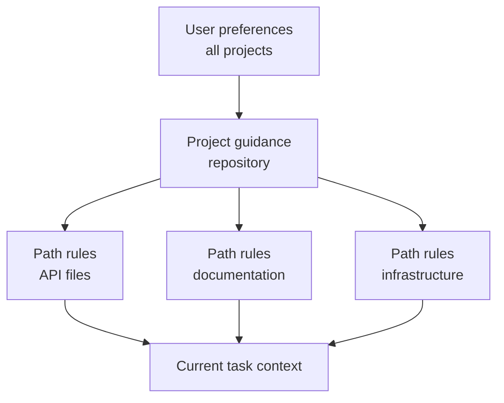

# Claude Code 记忆、规则、Skill 与 CI

> 把稳定的指南放在其作用域为真的位置，把不可失败的约束写成可执行的机制。

> **【中文解读】** 本课是 Claude Code 配置面的"总装课"：把记忆（CLAUDE.md 及导入）、路径规则、Skill、Command、子代理、钩子、settings 和无头 CI 放进一张选择矩阵。核心原则只有两句：稳定的指南要放在其作用域为真的最窄位置；不可失败的约束要用可执行的机制（钩子、权限、CI）而不是更粗的提示词。全课主线：先诊断"根文件膨胀 + 私有覆盖 + CI 配置不一致"的病根，再逐个机制讲"何时用、何时避"，最后落到无头 CI 的可复现评审与跨运行的发现留存。

> **【拓展：个人工具→团队基础设施→CI 证据链】** Claude Code 的配置体系是一条演进线：个人用 CLAUDE.md 放偏好，团队把共享决策提交进仓库（记忆、路径规则、Skill、子代理），组织用插件市场分发版本化捆绑包，最后用无头模式把"AI 评审"接进 CI 产出结构化证据。这条线与第 15 课（团队共享约束）、第 17 课（Agent SDK 会话与子代理）直接衔接；2026 年 7 月的 CCAR-F 蓝图明确考察这套层级、规则、Command、Skill、Agent、记忆、规划与无头工作流。记住分层：项目配置是团队决策，托管 settings 是不可覆盖的组织策略。

> 🔗 **【前置】** 学本课前请先掌握：(1) 第 15 课"Claude Code 靠共享约束扩展规模"——团队为什么要把配置版本化进仓库；(2) 第 17 课"Agent SDK 会话、子代理与上下文"——子代理的隔离上下文与结果契约，本课把同样的边界思想搬进 Claude Code 的 `/agents`。

**类型：** 参考
**语言：** Python
**前置条件：** 第 15 课（Claude Code 靠共享约束扩展规模）、第 17 课（Agent SDK 会话、子代理与上下文）
**预计用时：** 约 210 分钟

## 学习目标

- 设计项目级与用户级的指令层级，同时不造成上下文膨胀。
- 按用途在 CLAUDE.md、路径规则、Skill、Command、Agent、钩子和 settings 之间做选择。
- 编写并分发一个带窄工具授权的真实多文件 `SKILL.md` 软件包。
- 使用规划模式、直接执行与有边界的子代理，并要求显式的障碍报告。
- 配置无头 Claude Code，产出可复现的 CI 证据。
- 防止过期记忆、过宽权限和隐藏的本地配置控制团队工作。

## 问题引入

> **【中文解读】** 开篇病例要背下来：一个团队把所有指令塞进一个根 `CLAUDE.md`——架构历史、格式规范、数据库规则、部署步骤、个人偏好、六种语言的命令与示例——每个任务都被整体复制进上下文。接着四个并发症依次出现：开发者加私有覆盖、CI 用另一套配置、某个命令假设有写权限、一个宽泛钩子重排无关文件；"总是跑全部测试"的指令让一次文档小改动触发 40 分钟测试。诊断：问题不是指令不够多，而是作用域、优先级、渐进式披露，以及把"指导"误当"强制"。

一个团队把所有指令都塞进一个根 `CLAUDE.md`：架构历史、格式规范、数据库规则、部署步骤、个人偏好、命令，以及六种语言的示例。它被复制进每个任务。

开发者添加私有覆盖。CI 用的是另一套配置。某个命令假设自己有写权限。一个宽泛的钩子重排了无关文件。指令写着"总是跑每一个测试"，于是一次文档小改动触发了 40 分钟的测试套件。当 Agent 无视一条安全规则时，团队的做法是加更多加粗文字。

问题不在于指令不足。问题在于作用域、优先级、渐进式披露，以及把指导与强制混为一谈。

## 核心概念

### 让机制匹配任务

> **【中文解读】** 这张选择矩阵是全课的骨架，也是考试题眼：`CLAUDE.md` 放精简稳定的仓库级指南与指针（禁放完整手册、临时状态、密钥）；导入文件放靠近所有者的共享支撑指令（防循环、防隐形指令图）；路径规则只对匹配文件生效（别把全局规则复制进每个任务）；Skill 放按需加载的可复用流程（别放一次性事实或硬授权）；Command 是用户显式调用的兼容名；Agent 放带隔离上下文与工具的有边界角色（别放确定性工具函数）；钩子放确定性校验、拦截、规范化或自动化（别放开放式语义判断）；settings 放权限、模型、插件与运行时配置（别放提交进仓库的密钥值）。

| 机制 | 最佳用途 | 避免 |
|-------|----------|-------|
| `CLAUDE.md` | 精简稳定的仓库级指南与指针 | 完整手册、临时状态、密钥 |
| 导入文件 | 靠近所有者存放的共享支撑指令 | 循环或隐形的指令图 |
| 路径规则 | 只对匹配文件为真的指南 | 被复制进每个任务的全局规则 |
| Skill | 相关时按需加载的可复用流程或领域手册 | 一次性事实或硬授权 |
| Command | 用户显式调用工作流的兼容名 | 没有 Skill 结构的新多步软件包 |
| Agent | 带隔离上下文与工具的有边界角色 | 确定性工具函数 |
| 钩子 | 确定性校验、拦截、规范化或自动化 | 开放式语义判断 |
| Settings | 权限、模型、插件与运行时配置 | 提交进仓库的密钥值 |

产品说明（2026-08-09 核实）：自定义 Command 已并入 Skill。`.claude/commands/` 下的文件保持兼容，而 `.claude/skills/<name>/SKILL.md` 是新工作流的首选软件包形式。确切字段、优先级与产品可用性可能变化。实现前请核对当前 Claude Code 文档。2026 年 7 月的 CCAR-F 蓝图要求你理解层级、规则、Command、Skill、Agent、记忆、规划与无头工作流。

### 保持根指令文件精简

根文件应该帮一个能干的新贡献者正确起步。

该放：

- 项目目的与非显而易见的架构边界。
- 权威的构建、测试与格式化命令。
- 事实源文件。
- 安全与作用域约束。
- 指向更深入指南的链接或导入。
- 验证与贡献预期。

不该放：

- 临时任务状态。
- 生成的清单。
- 冗长的 API 参考。
- 个人编辑器设置。
- 密钥值。
- 只适用于单个目录的指令。

把它当作入职路由器，而不是知识倾倒场。

### 把指令放到最窄的真实作用域



用户作用域放个人默认值，不应由它定义团队行为。项目作用域放版本化的共享决策。路径级规则只在其文件模式匹配处加载。任务指令包含当前请求。

当两条规则冲突时，查明文档规定的优先级，并让项目事实源显式化。不要让关键工作流依赖一个隐藏的本地覆盖。

### 导入稳定的支撑性指南

用导入保持根文件精简，同时保留模块化的所有权。例如，数据库迁移策略应靠近数据库文档存放，根文件里放一个指针保证它可被发现。

审计导入图：

- 每个目标都存在。
- 没有环。
- 没有宽泛的文件导入泄漏密钥或无关文本。
- 所有权与更新触发条件清晰。
- 被删除或改名的指南会显式失败。

记忆检查命令能帮助揭示哪些指令处于激活状态。用它们调试配置，而不是用来存放不可恢复的项目状态。

### 用 Skill 实现渐进式披露

> **【中文解读】** Skill 是"按需加载的流程包"：描述（description）帮 Agent 判断何时适用，正文只在被选中时加载，从而保护无关任务的上下文。好例子：数据库迁移评审、事件分诊、发行说明生成、威胁模型清单、架构决策访谈。Skill 要定义输入、步骤、证据、输出与停止条件，不能内嵌密钥或授予权限。描述是"触发契约"：写清做什么、何时用，用开发者真正会说的话；要测正例触发和近似例不触发。`allowed-tools` 只是对本次调用回合的工具预批准，不收窄可用工具集、不覆盖拒绝规则、不会成为会话级授权。

Skill 把可复用的方法、参考、脚本与工件打包在一起。它的描述帮 Agent 判断何时适用。正文只在被选中时才加载，从而保护无关工作的上下文。

好的 Skill：

- 数据库迁移评审。
- 事件分诊。
- 发行说明生成。
- 威胁模型清单。
- 架构决策访谈。

Skill 应定义输入、步骤、证据、输出与停止条件。它不应内嵌密钥，也不应授予权限。

一个真实的项目 Skill 位于 `.claude/skills/<skill-name>/SKILL.md`。入口文件带 YAML frontmatter 与 Markdown 指令：

```yaml
---
name: migration-review
description: Review database migration files when a change adds or modifies paths under migrations/. Use it before merge to collect forward, rollback, locking, and data-safety evidence.
allowed-tools: Read Grep Glob Bash(python3 ${CLAUDE_SKILL_DIR}/scripts/check_scope.py *)
---
```

描述是一份触发契约。用开发者真正会说的话，写清这个 Skill 做什么、何时适用。既要测试应当触发的请求，也要测试不应触发的近似请求。当只允许显式 `/skill-name` 调用加载时，使用 `disable-model-invocation: true`。

`allowed-tools` 为本次调用回合预批准匹配的工具。它不收窄可用工具集、不覆盖拒绝规则、也不会持久化为会话级授权。让模式保持与打包流程一样窄，并在接受文件夹信任前评审项目 Skill。

把细节移出 `SKILL.md`，并有意识地路由过去：

| Skill 文件 | 用途 | 加载条件 |
|---|---|---|
| `SKILL.md` | 触发、核心步骤、停止条件、输出契约 | Skill 被调用时 |
| `references/review-checklist.md` | 详细的领域证据 | 核心步骤进行到评审时 |
| `scripts/check_scope.py` | 确定性路径校验 | 读取请求的迁移文件之前 |
| `examples/accepted.md` | 一个有代表性的输出形状 | 格式有歧义时 |

从 `SKILL.md` 引用每一个支撑文件，让 Claude 知道为什么以及何时打开它。通过 `${CLAUDE_SKILL_DIR}` 解析捆绑路径，而不是假设当前工作目录。[`outputs/migration-review-skill/`](../outputs/migration-review-skill/) 下的随课软件包是一个可运行的示例。

### 用 Command 承接明确的用户意图

当用户有意识地调用一个可复用工作流时，Command 很有用。定义参数提示、允许的工具与执行上下文。如果命令需要隔离，在受支持且合适时使用分叉上下文。

例子：

- 评审一个迁移文件。
- 从一次访谈生成一份 ADR。
- 运行一个有针对性的测试计划。
- 检查一次失败的 CI 追踪。

避免会静默写入、部署或使用宽泛 Bash 权限的命令。名称与参数契约应让后果一目了然。

对新工作，把这种显式工作流实现为用户可调用的 Skill。既有的 `.claude/commands/<name>.md` 文件仍然会创建 `/<name>`，可以迁移而不破坏用户。当流程需要脚本、参考、模板、调用控制或通过插件分发时，优先使用 Skill 目录。

### 把子代理当作有边界的证据收集者

> **【中文解读】** 子代理的纪律是"预算 + 契约 + 障碍报告"：`description` 告诉 Claude 何时委托；`tools` 限制其工具池；`maxTurns` 给出硬回合预算；`isolation: worktree` 给会编辑的子代理一份独立检出。关键观念：回合或时间盒是停止条件，不是完成证据——父会话负责校验结果并拥有集成。要求结构化的障碍报告：子代理访问不了文件时，返回 `status: blocked`、确切障碍、已尝试的证据和窄的 `next_step`，而不是静默放宽工具或范围。还要记住：worktree 只对会编辑的子代理用；只读研究者通常只需要独立上下文；worktree 隔离文件和分支，不隔离网络、凭据、共享 Git 元数据或外部系统。

运行 `/agents` 创建和管理可复用的子代理定义。把项目级 Agent 存放在 `.claude/agents/` 下，让它的角色随代码库一起评审。`description` 告诉 Claude 何时委托；`tools` 限制其工具池；`maxTurns` 提供硬回合预算；`isolation: worktree` 给会编辑的 Agent 一份独立检出。

```markdown
---
name: migration-auditor
description: Audit migration safety when a change touches migrations/. Return evidence and blockers; do not edit.
tools: Read, Grep, Glob, Bash
maxTurns: 10
isolation: worktree
---

Inspect only the assigned migration and adjacent schema code.
Stop after ten turns or twenty minutes, whichever comes first.
Return JSON with status, evidence, blockers, and next_step.
Never replace missing evidence with an assumption.
```

回合或时间盒是停止条件，不是完成证据。父会话校验结果并拥有集成。要求结构化的障碍报告：访问不了文件的子代理应返回 `status: blocked`、确切的障碍、已尝试的证据和一个窄的 `next_step`，而不是静默放宽工具或范围。

只在子代理会编辑时使用 worktree 隔离。只读研究者通常只需要一份独立上下文。worktree 隔离的是文件和分支，不隔离网络、凭据、共享 Git 元数据或外部系统。

### 通过最小的共享面分发

按受众选择分发方式：

- 单一仓库：直接提交 `.claude/skills/` 与 `.claude/agents/`。
- 多个仓库需要同一套版本化捆绑包时：把 Skill、Agent、钩子与 MCP 定义放进插件。
- 通过受评审的市场发布插件，并固定到某个 release 或 commit。
- 托管 settings 用于组织策略与市场限制，而不是每个团队流程的倾倒场。

项目可以在 `.claude/settings.json` 里声明市场并启用受评审插件：

```json
{
  "extraKnownMarketplaces": {
    "company-tools": {
      "source": {"source": "github", "repo": "company/claude-plugins"},
      "autoUpdate": false
    }
  },
  "enabledPlugins": {
    "migration-review@company-tools": true
  }
}
```

文件夹信任依然重要，托管的 `strictKnownMarketplaces` 能在任何网络或文件系统操作之前限制用户可添加的来源。评审发布者、版本、组件、脚本、钩子、MCP 服务器、权限、更新与回滚。项目默认值是团队配置；托管 settings 是不可覆盖的组织策略。

### 把路径规则当局部策略

路径 glob 可以表达这样的规则：

- API 变更必须带契约测试。
- 迁移文件只允许追加。
- 文档遵循特定风格。
- 生产配置不得包含字面密钥。

测试 glob 的行为。永不匹配的规则制造虚假信心；匹配整个仓库的 glob 会重新制造根文件膨胀。

### 分离规划、探索与执行

当范围或策略需要在动手改之前获批时，使用规划模式。当只读的代码库问题会撑大主任务上下文时，使用探索子代理。当变更已有边界且下一个安全动作显而易见时，直接执行。

需求缺失时，访谈模式很有用。问那些会实质改变实现的问题，记录决策，然后再构建。

当示例与测试展示的是真实的验收边界时，它们能提升一致性。不要添加只复述指令的示例。

### 让测试成为会话契约的一部分

对一个代码任务：

1. 识别行为与最小的相关验证。
2. 在可行处建立或编写一个失败的测试。
3. 做出有边界的变更。
4. 运行聚焦测试。
5. 按风险比例运行更宽的关卡。
6. 检查实际的工件或行为。
7. 报告确切的证据与剩余的不确定性。

Claude 可以提议并执行这个循环，但关卡是否通过由确定性 CI 决定。

### 钩子决策需要精确契约

> **【中文解读】** 钩子的 JSON 契约必须精确到字段：命令钩子要么以退出码 `0` 退出并向 stdout 打印一个结构化 JSON 对象，要么以退出码 `2` 退出并向 stderr 写入拦截原因——不能混用，因为 JSON 只在退出码 `0` 时被解析；退出码 `1` 对大多数事件是非阻塞的。事件 schema 不可互换：`PreToolUse` 用 `hookSpecificOutput.permissionDecision`（`allow`/`deny`/`ask`/`defer`）；`PermissionRequest` 用 `hookSpecificOutput.decision.behavior`（`allow`/`deny`）。已配置的 deny 与 ask 规则仍会被评估，allow 结果不能覆盖匹配的 deny 规则。退出码 `2` 能拦截 `PreToolUse` 并拒绝 `PermissionRequest`，但无法撤销 `PostToolUse` 已观察到的动作。

Claude Code 向钩子发送 JSON。命令钩子要么以退出码 `0` 退出并向 stdout 打印一个结构化 JSON 对象，要么以退出码 `2` 退出并向 stderr 写入拦截原因。不要混用两者，因为 JSON 只在退出码 `0` 时被解析。退出码 `1` 对大多数事件是非阻塞的。

事件 schema 不可互换。`PreToolUse` 使用 `hookSpecificOutput.permissionDecision`，取值为 `allow`、`deny`、`ask` 或 `defer`。`PermissionRequest` 使用 `hookSpecificOutput.decision.behavior`，取值为 `allow` 或 `deny`。已配置的 deny 与 ask 规则仍会被评估；allow 结果不能覆盖匹配的 deny 规则。

```json
{
  "hookSpecificOutput": {
    "hookEventName": "PermissionRequest",
    "decision": {
      "behavior": "deny",
      "message": "Production access requires interactive approval"
    }
  }
}
```

确认退出码 `2` 能否拦截所选事件。它能拦截 `PreToolUse` 并拒绝 `PermissionRequest`；但它无法撤销已被 `PostToolUse` 观察到的动作。

### 把无头 CI 设计成全新评审者

> **【中文解读】** 无头模式的持久原则：从干净的提交与声明的输入出发；用最小权限工具与 settings；固定或记录模型与配置；设时间、回合与成本上限；要求 JSON 或受 schema 约束的输出；把"生成发现"与"应用变更"分开；需要时跑独立评审；检查整改时显式带上先前的发现；让确定性测试与策略关卡拥有最终权威。CI 不应继承交互式开发者会话——可复现性要求全新状态。产品事实（2026-08-09 核实）：Anthropic 托管的 Code Review 产品是 Team 与 Enterprise 计划的研究预览，只报告拉取请求发现、不批准不拦截；`anthropics/claude-code-action@v1` 在仓库工作流内运行，事件、GitHub 权限、密钥来源、settings、工具、模型与回合上限都要显式声明。两者都不能替代确定性关卡或受保护的合并路径。

无头 Claude Code 可以用打印模式与结构化输出做非交互运行。使用前核实当前旗标与 schema。持久原则：

- 从干净的提交与声明的输入出发。
- 使用最小权限的工具与 settings。
- 固定或记录模型与配置。
- 设置时间、回合与成本上限。
- 要求 JSON 或受 schema 约束的输出。
- 把发现生成与变更应用分开。
- 在需要处运行独立评审。
- 检查整改时显式带上先前的发现。
- 让确定性测试与策略关卡拥有最终权威。

CI 不应继承一个交互式开发者会话。可复现性要求全新状态。

产品说明（2026-08-09 核实）：Anthropic 托管的 Code Review 产品是面向 Team 与 Enterprise 计划的研究预览。它与官方 GitHub Action 是两个不同的运营选项。托管 Code Review 报告拉取请求的发现，但不批准也不拦截。`anthropics/claude-code-action@v1` 在仓库工作流内运行，事件、GitHub 权限、密钥来源、settings、工具、模型与回合上限都要显式声明。两者都不能替代确定性关卡或受保护的合并路径。

### 让发现跨运行留存

如果一次运行发现问题、另一次运行验证修复，就把发现存成带稳定 ID、文件、证据、严重度与状态的结构化工件。只传一份自然语言摘要，可能丢失正在验证的确切论断。

整改评审接收原始发现、当前 diff、相关测试与验收规则。它不需要完整的原始对话。

## 动手构建

## 交互实验室

```figure
19-memory-rule-precedence
```

用优先级探索器把稳定的项目事实、路径级指南、可复用 Skill、Command 与确定性钩子路由到各自最窄的真实作用域。冲突的层展示了为什么隐藏的本地策略无法治理 CI。

## 练习实验室

破坏一个已记录的路径 glob，检查哪些 fixture 路径会加载该规则，然后修复作用域——不要把窄指南搬回根文件。接着用一条迁移路径和一次穿越尝试运行随课的 Skill 检查器：

```bash
python3 outputs/migration-review-skill/scripts/check_scope.py migrations/2026_add_index.sql
python3 outputs/migration-review-skill/scripts/check_scope.py ../secrets.sql
```

## 交付产物

填写好的 [`outputs/configuration-scope-audit.md`](../outputs/configuration-scope-audit.md) 记录了测试过的 glob fixture、一条 allow 与 deny 边界、一个有边界的子代理、插件分发、精确的钩子输出与全新 CI 契约。[`outputs/migration-review-skill/`](../outputs/migration-review-skill/) 目录交付了一个真实的 `SKILL.md`、确定性脚本与按需参考。

## 验证

无需 Claude、网络访问或凭据即可验证：

```bash
cd certifications/claude/lessons/19-claude-code-memory-rules-skills-and-ci
python3 code/main.py
python3 -m unittest discover -s code/tests -v
```

测验检查机制选择与 CI 整改。

## 毕业设计衔接

把结果复用到架构师基础毕业设计的 Claude Code 配置一节。

为一个包含 Python API 代码、数据库迁移与文档的仓库设计团队配置。

### 根指南

控制在一页可读篇幅内。包含项目地图、权威命令、安全约束与指向路径规则的链接。

### 路径规则

为以下目录分别创建规则：

- `src/api/**`：契约与授权测试。
- `migrations/**`：只追加与回滚要求。
- `docs/**`：风格与链接检查。

### Skill 与 Command

把随课的 migration-review 软件包安装为 `.claude/skills/migration-review/`，测试一次正例触发与一次近似例，并保留其窄的 `allowed-tools` 授权。当显式的 `/adr` 命令需要模板或脚本时，把它迁移为 Skill。

通过 `/agents` 定义一个只读的 migration-auditor。给它 `maxTurns`、结构化的 `status` / `evidence` / `blockers` / `next_step` 结果，以及一条"证据缺失时停下而不是假设"的规则。

### 钩子

- 写入前：拦截声明范围之外的文件。
- 编辑后：只对被编辑的文件运行格式化器。
- Bash 前：拒绝破坏性或打印密钥的命令。
- 停止时：要求确切的验证证据。

### CI 评审

运行一次全新的只读评审，输出 JSON 发现。另一个独立作业应用确定性测试与策略检查。两份工件都存档。

然后测试配置排错：引入一个匹配不到的路径 glob，证明你的审计能抓住它。

## 运行验证

配置应当像代码一样被评审。变更可能改变权限、上下文、工具与自动化行为。

以下情况必须评审：

- 新的 MCP 服务器或插件。
- 更宽的工具权限。
- 带写入或命令效果的钩子。
- 模型或提供商变更。
- 新的导入与路径模式。
- 触达外部系统的 Skill。
- 工具更宽、回合上限更高或带 worktree 隔离的 Agent。
- 插件市场、启用的插件与自动更新策略。
- 能应用变更的 CI 工作流。

用小型 fixture 任务记录当前行为。一个配置测试可以断言：迁移指南只在迁移路径加载、危险命令被拦截、评审命令返回预期 schema。

## 考试决策模式

> **【中文解读】** 考试决策两句话：指令太大或只适用于部分文件时，移到带作用域的规则或 Skill；条件绝不能被违反时，用确定性 settings、权限、钩子或 CI，而不是更重的提示词措辞。优先选项清单：保持 `CLAUDE.md` 精简且版本化；窄指南用导入与路径规则；可复用工作流打包成 Skill 或显式命令；认真写 Skill 触发描述、支撑文件与窄调用授权；用工具集、回合、所有权与结构化障碍报告约束子代理；单项目配置直接提交、跨项目捆绑走受评审插件；隔离命令工作流用分叉上下文；大改前先规划或探索；无头 CI 从干净状态跑结构化输出；按先前发现 ID 验证整改。

指令太大或只适用于部分文件时，把它们移到带作用域的规则或 Skill。条件绝不能被违反时，使用确定性 settings、权限、钩子或 CI，而不是更重的提示词措辞。

优先选择这样的答案：

- 保持 `CLAUDE.md` 精简且版本化。
- 窄指南用导入与路径级规则。
- 可复用工作流打包成 Skill 或显式命令。
- 认真编写 Skill 触发描述、支撑文件与窄的调用授权。
- 用工具集、回合、所有权与结构化障碍报告约束子代理。
- 单项目配置直接分发，跨项目捆绑作为受评审插件分发。
- 在需要处为隔离的命令工作分叉上下文。
- 大范围编辑前先规划或探索。
- 无头 CI 从干净状态运行并输出结构化结果。
- 按先前发现 ID 验证整改。

## 常见陷阱

> **【中文解读】** 四个反模式对四条正解：根文件变百科全书——所有内容处处加载，重要约束与无关细节互相挤压且无主腐朽，正解是一页路由器；私有配置冒充团队策略——本地行为无法被评审、无法在 CI 复现，正解是共享决策进项目作用域；钩子变隐形构建系统——不透明的自动化让命令行为出人意料、故障难以定位，正解是钩子小巧且可观察；AI 评审当唯一关卡——模型发现支撑判断，正解是确定性测试、schema、安全策略与审批来强制不变量。

### 根文件变百科全书

所有内容处处加载。重要约束与无关细节相互挤压，且因无主而腐朽。

### 私有配置冒充团队策略

本地行为无法被评审，也无法在 CI 中复现。把共享决策放进项目作用域。

### 钩子变隐形构建系统

不透明的自动化让命令行为出人意料、故障难以定位。保持钩子小巧且可观察。

### AI 评审当唯一关卡

模型发现支撑判断。确定性测试、schema、安全策略与审批才强制不变量。

## 练习

1. 把一个过度膨胀的根指令文件精简为一页路由器。
2. 设计路径规则并编写 fixture 路径，证明每个 glob 都能匹配。
3. 把一个 200 行的工作流提示词改造成多文件 Skill，带触发测试、参考文件与确定性脚本。
4. 通过 `/agents` 创建只读子代理；限制回合并测试它的 blocked 障碍报告。
5. 用各自不同的 JSON 形状验证一次 `PreToolUse` 拒绝与一次 `PermissionRequest` 拒绝。
6. 把 Skill 与 Agent 打包成插件，在测试市场中固定版本，并记录回滚方法。
7. 创建带稳定发现 ID 的只读无头评审 schema。

## 关键术语

| 术语 | 人们常说的 | 实际含义 |
|------|-----------------|------------------------|
| CLAUDE.md | 永久的模型记忆 | 按文档化作用域加载的版本化项目指南 |
| 路径规则 | 额外的提示词 | 只对匹配文件路径激活的指南 |
| Skill | 一个命令别名 | 带指令、参考、工具与输出的按需加载可复用流程 |
| Command | 自动化魔法 | 一个显式的用户调用工作流，带参数、工具与上下文行为 |
| `allowed-tools` | 沙箱 | Skill 调用回合内对匹配工具的临时预批准 |
| 子代理 | 无限并行的工人 | 一个独立上下文，带声明的角色、工具、回合预算与结果契约 |
| 插件 | 一个提示词文件 | Skill、Agent、钩子、MCP 服务器及相关配置的版本化捆绑包 |
| 钩子 | 模型指令 | 围绕生命周期事件运行的确定性代码 |
| 无头模式 | 没有 UI 的交互式聊天 | 从声明的输入出发、输出机器可读结果的非交互执行 |

## 延伸阅读

- [Claude Code memory documentation](https://code.claude.com/docs/en/memory) — Claude Code 记忆文档：层级与作用域的权威说明
- [Claude Code Skills](https://code.claude.com/docs/en/skills) — Claude Code Skill：软件包结构与渐进式披露
- [Claude Code subagents](https://code.claude.com/docs/en/sub-agents) — Claude Code 子代理：角色、工具与回合预算
- [Claude Code worktrees](https://code.claude.com/docs/en/worktrees) — Claude Code worktree：编辑型子代理的隔离检出
- [Claude Code settings](https://code.claude.com/docs/en/settings) — Claude Code settings：权限、模型与运行时配置
- [Claude Code plugin marketplaces](https://code.claude.com/docs/en/plugin-marketplaces) — Claude Code 插件市场：跨仓库分发版本化捆绑包
- [Claude Code hooks](https://code.claude.com/docs/en/hooks) — Claude Code 钩子：事件、退出码与 JSON 契约
- [Claude Code managed Code Review](https://code.claude.com/docs/en/code-review) — Claude Code 托管 Code Review：研究预览版拉取请求评审
- [Claude Code GitHub Actions](https://code.claude.com/docs/en/github-actions) — Claude Code GitHub Actions：仓库工作流内的官方 Action
- [Claude Code headless mode](https://code.claude.com/docs/en/headless) — Claude Code 无头模式：非交互执行与结构化输出
- Phase 14 第 33-38 课：可执行指令、状态、作用域与验证
