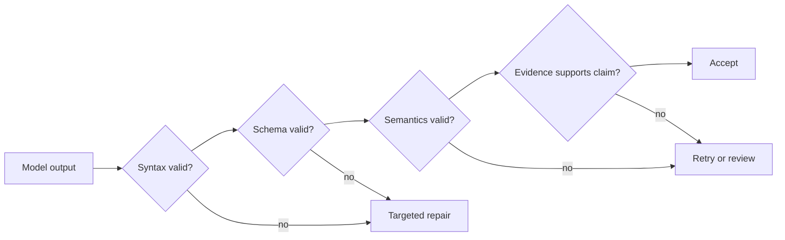

# 可靠抽取、批处理与独立评审者

> 合法的 JSON 证明形状活了下来。它不能证明事实也活了下来。

> **【中文解读】** 本课回答"结构化输出合法之后，正确性从哪来"。核心论断：合法 JSON 只证明"形状"活了下来，不证明"事实"活了下来。开篇病例：抽取合同义务的流水线每条记录都过 schema，法务仍打回 18%——模型给缺失日期编合理值、把背景陈述标成义务、把不认识的类别映射到最近的枚举；重试循环把同一提示词喂回去直到"校验通过"，而校验只查类型，于是编造的值被格式化得越来越自信。全课主线：先定义判断标准再定 schema、用少样本示例钉住边界、让"缺失"可表示、四层校验（语法/schema/语义/来源可溯）、最小有用错误反馈、生成者与评审者分离、批处理与实时的工作流选型、稳定 ID 对账、按你关心的错误做评测。

> **【拓展：第 09 课防御性解析→多记录生产流水线】** 第 09 课已经证明"结构化输出是不可信契约"，本课把它放大到生产规模：单条记录的 schema 校验升级为四层校验，防御性解析升级为带边界的修复与升级，输出校验升级为独立评审者加人工裁决。批处理一节承接官方 Message Batches 的事实（50% 成本降低、最长 24 小时处理窗口、无延迟 SLA 保证、批内无多轮工具调用）——这些是考试参考事实，部署前仍要查现行文档。本课是第 21 课（长上下文可靠性）的直接前置，也是架构师基础毕业设计抽取场景的证据来源。

> 🔗 **【前置】** 学本课前请先掌握：(1) 第 05 课"校验论断，不是校验信心"——评测要看最终状态而非模型口吻；(2) 第 09 课"结构化输出是不可信契约"——合法 JSON 不等于正确内容，本课在其上加语义与来源可溯两层；(3) Phase 14 第 39 课——评审者 Agent 的独立上下文设计。

**类型：** 参考
**语言：** Python
**前置条件：** 第 05 课（校验论断，不是校验信心）、第 09 课（结构化输出是不可信契约）、Phase 14 第 39 课（评审者 Agent）
**预计用时：** 约 135 分钟

## 学习目标

- 定义能降低误报与含混标签的抽取标准。
- 有意识地使用 schema、示例、可空字段、枚举与证据片段。
- 分离语法、schema、语义与来源可溯四层校验。
- 设计有边界的重试与独立评审者通道。
- 按工作流需求在实时与批处理之间做选择。

## 问题引入

一条流水线把合同义务抽取成合法 JSON。每条记录都匹配 schema。法务评审者仍然打回 18%。

模型给缺失的日期填上看似合理的值，把背景陈述标注成义务，把不认识的类别映射到最近的枚举。一个重试循环把同一份提示词反复喂回去，直到校验通过。由于校验只检查类型，编造出来的值被格式化得越来越自信。

团队解决的是序列化问题，却把它误当成了正确性。

## 核心概念

### 先定义判断标准，再定 schema

> **【中文解读】** schema 说的是"有哪些字段"，判断标准说的是"什么才算数"。义务抽取器的标准范例：义务方必须显式出现或被无歧义地关联；要求的动作必须是"被陈述"而不只是"被讨论"；触发条件与截止日期只在有依据时抽取；证据片段必须包含该论断；未知值保持 `null`；无依据的类别用 `other` 加备注或转人工；例外与否定会改变结果。没有这些规则，标注者、模型和评测器执行的其实是三个不同的任务。

schema 说的是有哪些字段。判断标准说的才是什么才算数。

对一个义务抽取器，定义：

- 义务方必须显式出现或被无歧义地关联。
- 要求的动作必须是"被陈述"，而不只是"被讨论"。
- 触发条件与截止日期只在有依据时抽取。
- 证据片段必须包含该论断。
- 未知值保持 `null`。
- 无依据的类别使用 `other` 加备注，或触发评审。
- 例外与否定会改变结果。

没有这些规则，标注者、模型和评测器执行的其实是不同的任务。

### 用少样本示例钉住边界

示例在"讲道理的人会做出不同判断"的地方最有价值。

要包含：

- 一个清晰的正例。
- 一个近似例。
- 一个被否定的义务。
- 缺失日期用 `null` 表示。
- 一个枚举之外的类别。
- 一段话里的两条义务。
- 相互冲突的条款。

每个示例都应展示判断理由，而不只是答案。不要用冗余的简单用例灌满上下文。

### 让"缺失"可表示

> **【中文解读】** 如果一个字段可能未知，schema 就需要一个显式状态去表达它；强迫返回字符串就是在鼓励编造。示例 schema 的做法是"必填 + 可空"：`party`、`deadline` 用 `["string", "null"]`，`category` 用枚举加 `other`，`evidence_span` 强制非空，`needs_review` 标记争议。必填且可空迫使模型做显式决定——给出有依据的值，或声明已知缺失——从而杜绝静默漏字段。

如果一个字段可能未知，schema 就需要一个显式状态。强迫返回字符串会鼓励编造。

```json
{
  "type": "object",
  "properties": {
    "party": {"type": ["string", "null"]},
    "action": {"type": "string"},
    "deadline": {"type": ["string", "null"]},
    "category": {
      "type": "string",
      "enum": ["payment", "delivery", "reporting", "other"]
    },
    "evidence_span": {"type": "string"},
    "needs_review": {"type": "boolean"}
  },
  "required": ["party", "action", "deadline", "category", "evidence_span", "needs_review"],
  "additionalProperties": false
}
```

必填加可空，迫使一次显式决定：有依据的值，或已知的缺失。它防止字段被静默省略。

### 用工具调用获得类型化输出

一个无副作用的抽取工具可以承载 schema。当应用需要时，tool choice 可以强制返回那条类型化记录。在当前 API 支持处，严格 schema 特性能保证结构合法。

不要为了拿到结构化输出去调用一个真实的动作工具。抽取与执行拥有的授权不同。

### 四层校验

> **【中文解读】** 四层是本课的骨架：语法层问"能否解析"；schema 层问"字段、类型、枚举、边界是否合法"；语义层问"跨字段关系是否成立"——截止日期不能早于生效日期、`needs_review` 为 false 不能伴随无依据类别；来源可溯层问"证据片段是否真的支撑抽取出的论断、是否来自正确的源版本"。关键结论：只有后两层能抓住大量"自信的幻觉"——类型检查对编造值无能为力。失败的修复路径也分层：语法/schema 失败走定向修复，语义/来源失败走重试或评审。



#### 语法层

载荷能否被解析？

#### Schema 层

字段、类型、枚举与边界是否合法？

#### 语义层

跨字段关系是否成立？当领域禁止时，截止日期不能早于生效日期。`needs_review` 为 false 的结果不能伴随一个无依据的类别。

#### 来源可溯层

证据片段是否真的支撑抽取出的论断，它是否来自正确的源版本？

只有最后两层能抓住大量自信的幻觉。

### 回馈最小有用的错误

修复时，返回结构化的校验反馈：

```json
{
  "category": "semantic_validation",
  "field": "deadline",
  "message": "The extracted date does not appear in the evidence span.",
  "allowed_action": "Set deadline to null or select a supported span."
}
```

不要只说"再试一次"。保留原始来源与先前结果。限制重试次数。反复的语义失败应该升级处理，而不是把不确定性转换成延迟与成本。

### 分离生成者与评审者

> **【中文解读】** 独立性的做法：生成者做抽取；评审者拿到源文本、候选记录与评分标准（rubric），检查必需证据是否存在、片段是否支撑每条非空论断、否定与例外是否被处理、类别是否符合定义、未知是否被编造、冲突与歧义是否被标记。用全新上下文获得更强的独立性。评审者返回发现 ID、字段、证据与处置意见，不静默改写记录。最后一句要背：拿人工标注去测评审者自己的精确率与召回率——模型评审者是一台仪器，不是真值。

生成者做抽取。评审者拿到源文本、候选记录与评分标准。它检查：

- 必需的证据存在。
- 片段支撑每一条非空论断。
- 否定与例外得到了处理。
- 类别符合定义。
- 未知值没有被编造。
- 冲突与歧义被标记。

用全新上下文获得更强的独立性。评审者返回发现 ID、字段、证据与处置意见。它不静默改写记录。

拿人工标注去测评审者的精确率与召回率。模型评审者是一台仪器，不是真值。

### 按工作流选批处理

2026 年 7 月的 CCAR-F 公开指南给出：Message Batches 成本降低 50%、最长 24 小时的处理窗口且无保证的延迟 SLA、单个批处理请求内没有多轮工具调用。这些是有日期的考试参考事实，不是定价或服务限制保持不变的承诺。部署前请在 [Message Batches 文档](https://platform.claude.com/docs/en/build-with-claude/batch-processing)中确认现行定价、限制、保留策略与特性兼容性。

批处理适合：

- 大规模离线抽取。
- 评测数据集。
- 每夜分类。
- 回填与重处理。
- 生成之后的独立评审。

实时适合：

- 交互式用户响应。
- 有严格短延迟上限的任务。
- 同一请求内的自适应工具调用。
- 需要即时审批或反馈的工作流。

当下一步依赖一个模型必须在请求中途观察的外部动作时，不要用批处理。预计算输入，或把工作流拆成多个作业。

### 让批处理作业可对账

给每个条目一个稳定的 `custom_id`。持久化源版本、schema 版本、提示词版本与预期输出位置。结果可能乱序返回。

要处理：

- 成功。
- 校验失败。
- 提供商故障。
- 过期。
- 重复提交。
- 作业部分完成。
- 源变更后的重试。

绝不要按数组位置把结果与输入拼在一起。

### 评测你在意的错误

对抽取任务：

- 字段级精确率与召回率。
- 在合适处做精确匹配或归一化匹配。
- 证据支撑率。
- 高风险字段的误报率。
- null 校准。
- 类别混淆矩阵。
- 评审者分歧率。
- 每条被接受记录的成本与延迟。

平均值会掩盖一个危险的误报类别。按文档类型、语言、长度与风险分层。

## 动手构建

## 交互实验室

```figure
20-batch-review-confidence
```

用置信度与评审模拟器让记录依次通过语法、schema、语义与来源可溯四道关卡。调整误报成本与评审覆盖率，看看为什么"合法 JSON + 模型置信度"不足以作为发布标准。

## 练习实验室

把一个有依据的日期改成编造值，跑四层校验，把失败记录送去裁决，而不是再做一次盲目重试。

## 交付产物

填写好的 [`outputs/extraction-review-report.md`](../outputs/extraction-review-report.md) 包含一个带稳定 `custom_id` 的批处理作业、可空的未知值、乱序的结果、评审发现与一个裁决状态。

## 验证

运行它的确定性校验器：

```bash
cd certifications/claude/lessons/20-reliable-extraction-batch-and-reviewers
python3 code/main.py
python3 -m unittest discover -s code/tests -v
```

测验检查修复、批处理与评审者决策。

## 毕业设计衔接

把验证过的报告带进架构师基础毕业设计的抽取场景，作为全部四层校验的证据。

为支持政策变更创建一条抽取流水线。

### 输出契约

抽取政策 ID、生效日期、受影响地区、动作类型、阈值、证据片段、源版本与评审状态。每个不确定字段都可空，或带有显式的 `other` 状态。

### 数据集

构建至少 40 个示例：

- 15 条清晰的变更。
- 10 条没有变更的背景陈述。
- 5 条否定或例外。
- 5 条缺失日期或阈值。
- 5 条相互冲突的版本。

### 处理通道

1. 带严格 schema 的生成者。
2. 确定性语法与 schema 校验。
3. 语义关系校验。
4. 独立证据评审者。
5. 针对分歧的人工裁决。

### 实验

对比零样本标准、少样本边界示例、生成者加评审者三种方案。报告误报数、证据支撑率、成本与延迟。

### 批处理设计

用稳定 ID 提交记录。在测试中打乱结果顺序。注入部分失败，证明对账能保住已完成的记录、只重试安全条目。

## 运行验证

> **【中文解读】** 生产纪律四条：原始源与归一化抽取分开存放，保留源版本与证据偏移；标准或 schema 变更时新建输出版本而不是覆盖历史决定；人工修正要存原因代码，分歧先用来改进标准与评测集、再考虑改提示词；高风险抽取的评审可以分层——每个高影响字段、低证据记录、新文档类型全查，普通案例随机抽检。

生产中，把原始源与归一化抽取分开存放。保留源版本与证据偏移。当标准或 schema 变更时，创建新的输出版本，而不是覆盖历史决定。

如果人工修正了一条记录，存一个原因代码。用分歧去改进标准与评测集，然后再考虑改提示词。

对高风险抽取，评审可以分层：每个高影响字段、每条低证据记录、每种新文档类型全查，再加上普通案例的随机抽检。

## 考试决策模式

JSON 合法但内容错误时，加语义与证据校验。判断边界处一致性不稳时，用显式标准加少样本示例。

优先选择这样的答案：

- 用 `null` 或 `other`，而不是编造。
- 强制类型化输出，而不触发真实动作。
- 带重试上限地回馈具体校验错误。
- 分离生成者与评审者。
- 为异步、不依赖工具的工作负载使用批处理。
- 用稳定 ID 对账结果。

## 常见陷阱

> **【中文解读】** 四个陷阱对四条正解："schema 即真理"——类型无法证明值出现在源中或由源推出，正解是加语义与来源可溯校验；"必填不可空字段"——契约没有缺失的表示法，模型只能编一个合理值，正解是必填加可空；"无限修复"——同一份歧义源产生反复猜测，正解是有界尝试后升级；"评审者静默改写"——系统丢失了哪条论断失败、为什么失败，正解是任何受控修正之前先返回结构化发现。

### Schema 即真理

类型无法证明一个值出现在源中，或由源推出。

### 必填不可空字段

模型编造一个看似合理的值，因为契约没有"缺失"的表示法。

### 无限修复

同一份歧义源产生反复的猜测。有界尝试之后就该升级。

### 评审者静默改写

系统丢失了哪条论断失败、为什么失败。任何受控修正之前，先返回结构化发现。

## 练习

1. 加一条把阈值与币种关联起来的语义规则。
2. 设计能减少虚假义务的负例。
3. 拿人工标注校准一个评审者，并报告分歧。
4. 为乱序的批处理结果构建稳定 ID 对账。
5. 对比单遍流水线与带评审者流水线的每条接受记录成本。

## 关键术语

| 术语 | 人们常说的 | 实际含义 |
|------|-----------------|------------------------|
| 结构化输出 | 正确的数据 | 匹配机器可读形状的数据 |
| 语义校验 | schema 校验 | 检查值与关系对该领域是否讲得通 |
| 来源可溯校验 | 有效的引用 | 证明源证据支撑确切的抽取论断 |
| 可空 | 可选字段 | 针对未知或缺失值的显式受支持状态 |
| 批处理 | 更快的 API | 面向离线体量与不同成本/延迟约束优化的异步处理 |
| 裁决 | 重试 | 一个解决评测者或标签分歧的合格决定 |

## 延伸阅读

- [Claude structured outputs documentation](https://platform.claude.com/docs/en/build-with-claude/structured-outputs) — Claude 结构化输出文档：严格 schema 与合法结构的官方说明
- [Claude Message Batches documentation](https://platform.claude.com/docs/en/build-with-claude/message-batches) — Claude Message Batches 文档：批处理定价、限制与对账的权威出处
- Phase 11 第 03 课：从第一性原理理解结构化输出
- Phase 14 第 39 课：评审者 Agent
- Phase 17 第 15 课：批处理架构
