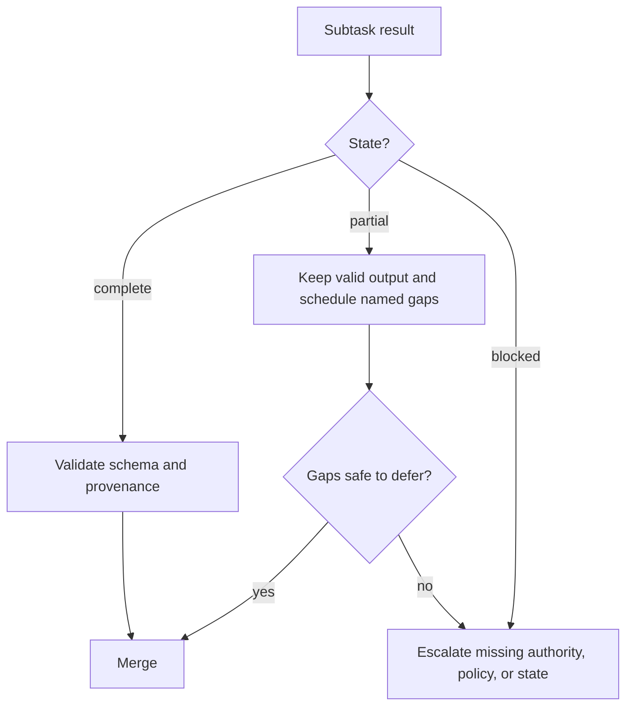

# Make Large Context Observable | 让长上下文可观测

> A large context window can hold more evidence. It cannot tell you which evidence was noticed, current, authoritative, or safe to act on.

> **【中文解读】** 本课回答"塞得下"之后的问题：大上下文窗口能装下更多证据，却不能告诉你哪些证据被注意到了、是否最新、是否权威、是否可以安全地据其行动。开篇病例要背：迁移协调者收到 140 个文件、三份架构文档、依赖报告、测试日志和四个子代理的结果，提示词都在标称窗口内，最终方案仍违反安全规则——规则只在中部出现一次；失败的集成测试被裁剪成"测试大体通过"；一个子代理超时只看了 24 个文件中的 18 个，散文总结却显得完整；Markdown 表格在抽取中丢了列关系。全课主线：注意力拓扑摆放、证据信封、按决策价值裁剪、complete/partial/blocked 三态、升级缺失的"决定"而非焦虑、四种记忆工具（清单/草稿区/子代理/压缩）、证据校准的置信度、分层人工评审、内容类型保真。

> **【拓展：第 17 课上下文工程→长上下文可观测性】** 本课把第 17 课的"上下文是状态管理问题"推到大规模：窗口变大不等于注意力变可靠，"lost in the middle"（中部丢失）是长输入的固有风险。工程答案是给证据装"信封"（来源可溯元数据）、给任务结果定三态契约、给大代码库配四种记忆工具。官方长上下文提示技巧、Citations 与 Agent SDK 上下文管理是权威出处。本课承接第 20 课的来源可溯校验（那边校验单条抽取，这边保住整条证据链），也是架构师基础毕业设计"上下文可靠性附录"的证据来源。

> 🔗 **【前置】** 学本课前请先掌握：(1) 第 17 课"Agent SDK 会话、子代理与上下文"——隔离上下文与子代理委托；(2) 第 18 课"工具契约、错误与渐进发现"——错误要作为数据返回，本课把它扩展成"裁剪不得删状态"；(3) 第 20 课"可靠抽取、批处理与独立评审者"——来源可溯校验，本课把它升级为证据信封。

**Type:** Reference | **类型:** 参考
**Languages:** Python | **语言:** Python
**Prerequisites:** [Agent SDK Sessions, Subagents, and Context](../../17-agent-sdk-sessions-subagents-and-context/), [Tool Contracts, Errors, and Progressive Discovery](../../18-tool-contracts-errors-and-progressive-discovery/), [Reliable Extraction, Batch, and Independent Reviewers](../../20-reliable-extraction-batch-and-reviewers/) | **前置知识:** 第 17 课（Agent SDK 会话、子代理与上下文）、第 18 课（工具契约、错误与渐进发现）、第 20 课（可靠抽取、批处理与独立评审者）
**Time:** ~150 minutes | **时间:** 约 150 分钟

## Learning Objectives | 学习目标

- Place and retrieve critical facts to reduce lost-in-the-middle failures.
  中文翻译：摆放与检索关键事实，降低"中部丢失"失败。
- Trim tool output without losing provenance, errors, conflicts, or decision-relevant detail.
  中文翻译：裁剪工具输出而不丢失来源可溯信息、错误、冲突或决策相关细节。
- Propagate complete, partial, and blocked results through agentic workflows.
  中文翻译：在 Agent 工作流中传播 complete、partial、blocked 三种结果状态。
- Use manifests, scratchpads, subagents, and compaction for different large-codebase jobs.
  中文翻译：为不同的大代码库任务使用清单、草稿区、子代理与压缩。
- Calibrate confidence and stratify human review from evidence and consequence.
  中文翻译：从证据与后果出发校准置信度，并对人工评审分层。
- Preserve source identity, dates, conflicts, and content type through ingestion and rendering.
  中文翻译：在摄取与渲染全程保留来源身份、日期、冲突与内容类型。

## The Problem | 问题引入

> **【中文解读】** 病例的四个失效点对应全课四个工具：安全规则只在中部出现一次——摆放问题；测试失败被缩成"大体通过"——裁剪删掉了状态；子代理超时但总结显得完整——缺三态契约；表格丢列关系——内容类型失真。结论句要背：上下文可靠性不是"装下更多文本"的能力，而是"保住正确的状态、暴露不确定性、在证据不足时路由决策"的能力。

A migration coordinator receives 140 files, three architecture documents, a dependency report, test logs, and results from four subagents. The prompt fits inside the advertised context window.

> 一个迁移协调者收到 140 个文件、三份架构文档、一份依赖报告、测试日志和四个子代理的结果。提示词装得进标称的上下文窗口。

The final plan still violates a security rule. The rule appears once near the middle of a long architecture document. A tool result containing the failed integration test was shortened to "tests mostly passed." One subagent timed out after reviewing 18 of 24 files, but its prose summary looks complete. A Markdown table lost its column relationships during extraction, so a deprecated dependency appears supported.

> 最终方案仍然违反了一条安全规则。这条规则只在一篇长架构文档的中部附近出现过一次。一份包含失败集成测试的工具结果被缩短成"测试大体通过"。一个子代理在看完 24 个文件中的 18 个后超时，但它的散文总结看起来是完整的。一张 Markdown 表格在抽取中丢失了列关系，于是一个已废弃的依赖显得仍受支持。

Nothing exceeded the nominal token limit. The system failed because important facts had weak placement, metadata disappeared, partial work looked complete, and nobody defined an escalation rule.

> 没有任何东西超出标称的 token 上限。系统失败是因为：重要事实摆放乏力、元数据消失、部分完成的工作看起来完整、没有人定义升级规则。

Context reliability is not the ability to fit more text. It is the ability to preserve the right state, expose uncertainty, and route decisions when evidence is insufficient.

> 上下文可靠性不是装下更多文本的能力。它是在证据不足时，保住正确的状态、暴露不确定性并路由决策的能力。

## The Concept | 核心概念

### Context has an attention topology | 上下文有注意力拓扑

> **【中文解读】** 模型并不把每个 token 在每个任务里当作同等有用；长输入让证据更难定位，尤其是关键事实被相似或冲突材料包围时——这就是"中部丢失"。五条摆放纪律：任务、决定、硬约束与输出契约放在证据之前；证据按稳定身份（文件/论断/来源/子系统）分组；当前问题紧贴模型必须回答的位置；只在最终请求附近重复极少数关键约束；为当前决定检索窄证据而不是搬运整个档案。反面提醒：别把每条规则在首尾各重复一遍——重复消耗上下文还可能放大过期指令。若证据能被可靠检索，检索通常强过一个巨型提示词；大窗口是留给剩余难点的容量，不是跳过信息架构的许可。

Models do not treat every token as equally useful in every task. Long inputs can make evidence harder to locate, especially when the relevant fact is surrounded by similar or conflicting material. This is often called lost in the middle.

> 模型并不把每个 token 在每个任务里当作同等有用。长输入会让证据更难定位，尤其是当相关事实被相似或冲突的材料包围时。这通常被称为"中部丢失"（lost in the middle）。

Use placement deliberately:

1. Put the task, decision, hard constraints, and output contract before the evidence.
   中文翻译：把任务、决定、硬约束与输出契约放在证据之前。
2. Group evidence by a stable identity such as file, claim, source, or subsystem.
   中文翻译：按稳定身份（文件、论断、来源或子系统）给证据分组。
3. Put the current question immediately before the model must answer it.
   中文翻译：把当前问题紧贴在模型必须回答它的位置之前。
4. Repeat only the few critical constraints near the final request.
   中文翻译：只在最终请求附近重复极少数关键约束。
5. Retrieve narrow evidence for the current decision instead of carrying the entire archive.
   中文翻译：为当前决定检索窄证据，而不是搬运整个档案。

Do not repeat every rule at both ends. Repetition consumes context and can amplify stale instructions. Promote only invariants whose omission would cause material failure.

> 不要把每条规则在首尾各重复一遍。重复消耗上下文，还可能放大过期指令。只提升那些"漏掉就会造成实质失败"的不变量。

```text
goal and hard constraints
current manifest and unresolved gaps
relevant evidence blocks with metadata
decision-specific question
required result and escalation schema
```

If evidence can be selected reliably, retrieval is usually stronger than one enormous prompt. A large context window is capacity for the remaining hard case, not permission to skip information architecture.

> 如果证据能被可靠地选择，检索通常强过一个巨大的提示词。大上下文窗口是留给剩余难点的容量，不是跳过信息架构的许可。

### Evidence needs an envelope | 证据需要信封

Raw text is not enough. Wrap every important unit with structured metadata:

> 光有原始文本不够。给每一个重要单元包上结构化元数据：

```json
{
  "evidence_id": "policy-auth-017",
  "source_uri": "repo://docs/security/authentication.md",
  "source_version": "git:3a91c7e",
  "content_type": "text/markdown",
  "effective_date": "2026-07-15",
  "observed_at": "2026-08-08T10:30:00Z",
  "authority": "approved-architecture-policy",
  "scope": ["services/auth/**"],
  "extractor": "markdown-section-v2",
  "location": {"heading": "Token rotation", "lines": [88, 112]},
  "status": "active"
}
```

The values are illustrative. The envelope answers questions prose cannot:

- Which version did the agent see?
  中文翻译：Agent 看到的是哪个版本？
- Was it policy, a draft, or a generated summary?
  中文翻译：它是政策、草稿，还是生成的摘要？
- Which files or claims does it govern?
  中文翻译：它治理哪些文件或论断？
- Can the original span be inspected?
  中文翻译：原始片段还能被检查吗？
- Is another source newer or more authoritative?
  中文翻译：是否有另一个来源更新或更权威？

Keep the source body and metadata associated through every handoff. A clean summary without identity is difficult to verify.

> 让源正文与元数据在每一次交接中都保持关联。一份没有身份的干净摘要很难被验证。

### Trim tool output by decision value | 按决策价值裁剪工具输出

> **【中文解读】** 工具输出会吞掉上下文，但裁剪应当删"重复"而不是删"状态"。该保的：工具调用与追踪 ID、命令或查询及范围目标、退出或完成状态、结构化错误与可重试性、受影响的文件/记录/论断、失败断言与最小支撑摘录、计数/总数/未处理条目数、源版本与时间戳、冲突与未解决缺口、指向完整外部工件的指针。该删或外置的：重复的进度行、重复的堆栈帧、无新证据的成功行、装饰性格式、已有稳定引用的大块内容。"大体通过"删掉的恰恰是最重要的区分：哪一部分没通过。

Tool output can dominate context. Trimming should remove repetition, not state.

> 工具输出可能主导上下文。裁剪应当移除重复，而不是移除状态。

Preserve:

- tool call and trace IDs
  中文翻译：工具调用 ID 与追踪 ID。
- command or query and scoped target
  中文翻译：命令或查询及其范围目标。
- exit or completion status
  中文翻译：退出或完成状态。
- structured errors and retryability
  中文翻译：结构化错误与可重试性。
- affected files, records, or claims
  中文翻译：受影响的文件、记录或论断。
- failing assertions and the smallest supporting excerpt
  中文翻译：失败的断言与最小的支撑摘录。
- counts, totals, and omitted-item count
  中文翻译：计数、总数与未处理条目数。
- source versions and timestamps
  中文翻译：源版本与时间戳。
- conflicts and unresolved gaps
  中文翻译：冲突与未解决的缺口。
- a pointer to the full external artifact
  中文翻译：指向完整外部工件的指针。

Remove or externalize:

- repeated progress lines
  中文翻译：重复的进度行。
- duplicate stack frames
  中文翻译：重复的堆栈帧。
- successful rows that add no distinct evidence
  中文翻译：不提供新证据的成功行。
- decorative formatting
  中文翻译：装饰性格式。
- large bodies already stored under a stable reference
  中文翻译：已存放在稳定引用下的大块内容。

Use a deterministic adapter where possible:

```json
{
  "status": "partial",
  "summary": "18 of 24 files reviewed; 2 findings; 6 files not processed",
  "findings": ["finding-014", "finding-015"],
  "errors": [
    {
      "category": "dependency_timeout",
      "retryable": true,
      "scope": ["services/payments/**"],
      "trace_id": "trace-8801"
    }
  ],
  "full_artifact": "artifact://review/run-224"
}
```

"Mostly passed" deletes the most important distinction: which part did not pass.

> "大体通过"删掉的恰恰是最重要的区分：哪一部分没有通过。

### Complete, partial, and blocked are first-class states | complete、partial、blocked 是一等状态

> **【中文解读】** 每个任务契约都应定义三种结果：complete——每个必需部分都满足输出契约；partial——存在有效工作，但有具名缺失的范围或证据；blocked——安全推进需要新的权限、政策、数据或外部状态。关键判断：partial 不是失败也不是完成——协调者可以保留有效发现、只重试有资格的缺口，并阻止"把没做的工作综合成'没有问题'"。错误要带类别、可重试性、安全消息、受影响范围、部分结果引用与建议的下一步：超时可重试；授权拒绝靠重试修不好；含混的政策需要的是负责人，不是更多 token。

Every task contract should define three outcomes:

- **Complete:** Every required part satisfies the output contract.
  中文翻译：**complete（完成）：**每个必需部分都满足输出契约。
- **Partial:** Valid work exists, but named scope or evidence is missing.
  中文翻译：**partial（部分完成）：**存在有效工作，但有具名的范围或证据缺失。
- **Blocked:** Safe progress requires new authority, policy, data, or external state.
  中文翻译：**blocked（受阻）：**安全推进需要新的权限、政策、数据或外部状态。

Partial is not failure, and it is not complete. The coordinator can retain valid findings, retry only eligible gaps, and prevent synthesis from interpreting missing work as no issue.

> partial 不是失败，也不是完成。协调者可以保留有效发现、只重试有资格的缺口，并阻止综合过程把缺失的工作解读为"没有问题"。



Errors need category, retryability, safe message, affected scope, partial result reference, and suggested next action. A timeout may be retryable. An authorization denial is not fixed by retrying. An ambiguous policy needs an owner, not more tokens.

> 错误需要类别、可重试性、安全消息、受影响范围、部分结果引用与建议的下一步。超时也许可重试。授权拒绝不是靠重试修复的。含混的政策需要的是负责人，不是更多 token。

### Escalate the reason, not the anxiety | 升级理由，而不是升级焦虑

Escalation should name the missing decision:

> 升级应当点出缺失的决定：

| Condition | Safe response |
|---|---|
| Missing evidence | Identify source needed and affected conclusion |
| Conflicting authoritative sources | Preserve both, apply documented precedence, or route to owner |
| Policy gap | Stop the governed action and ask the policy owner for a rule |
| Permission gap | Request scoped access or choose an approved alternate path |
| Repeated semantic failure | Stop bounded retries and request adjudication |
| Unknown external side effect | Reconcile state before retry |

Do not escalate with "the model is unsure." Provide source IDs, attempted checks, the exact ambiguity, consequence, deadline, and available safe options.

> 不要用"模型不确定"来升级。提供来源 ID、已尝试的检查、确切的歧义、后果、截止时间与可用的安全选项。

### Large codebases need four different memory tools | 大代码库需要四种不同的记忆工具

> **【中文解读】** 四件工具各管一段，不可互换：清单（manifest）是持久地图——文件 ID、所有权、用途、依赖、评审状态、哈希、发现与未完成工作，支持覆盖率与恢复，在对话之外保持权威；草稿区（scratchpad）承载当前有界任务的临时推理——搜索假设、候选文件、下一步检查，可以丢弃，绝不在里面存放决定/审批/已完成动作的唯一副本；子代理为有界关注点拿到隔离上下文并返回带文件与证据引用的结构化结果——隔离减少上下文竞争，但协调者仍要强制覆盖率与合并规则；压缩（compaction）把增长的会话压成当前目标、约束、已验证工作、开放缺口、证据引用与下一步——它控制上下文规模，不保证真实或持久状态。大仓库的正确次序：先结构与依赖地图，再检索最小连通切片，让有界子代理查特定子系统，把归一化发现写回清单，最后基于清单与已接受证据跑跨文件总查——而不是对原始转录跑。

These mechanisms are related but not interchangeable.

#### Manifest | 清单

A manifest is the durable map: file IDs, ownership, purpose, dependencies, review state, hashes, findings, and unresolved work. It supports coverage and recovery. The manifest remains authoritative outside the conversation.

> 清单是持久地图：文件 ID、所有权、用途、依赖、评审状态、哈希、发现与未完成工作。它支持覆盖率与恢复。清单在对话之外保持权威。

#### Scratchpad | 草稿区

A scratchpad supports temporary reasoning for the current bounded task: search hypotheses, candidate files, and next checks. It can be discarded. Never store the only copy of a decision, approval, or completed action there.

> 草稿区支撑当前有界任务的临时推理：搜索假设、候选文件与下一步检查。它可以被丢弃。绝不在里面存放决定、审批或已完成动作的唯一副本。

#### Subagent | 子代理

A subagent gets isolated context for a bounded concern. It returns a structured result with file and evidence references. Isolation reduces context competition, but the coordinator must still enforce coverage and merge rules.

> 子代理为一个有界关注点拿到隔离上下文。它返回带文件与证据引用的结构化结果。隔离减少了上下文竞争，但协调者仍必须强制覆盖率与合并规则。

#### Compaction | 压缩

Compaction compresses a growing session into current goal, constraints, verified work, open gaps, evidence references, and next action. It controls context size. It does not guarantee truth or durable state.

> 压缩把增长的会话压缩成当前目标、约束、已验证工作、开放缺口、证据引用与下一步动作。它控制上下文规模。它不保证真实或持久状态。

Use them together:

```text
manifest says what exists and what is done
scratchpad helps decide the next bounded search
subagent isolates one reasoning responsibility
compaction rebuilds a smaller current working set
```

For a large repository, start with structure and dependency maps, then retrieve the smallest connected slice. Ask bounded subagents to inspect specific subsystems. Return normalized findings to the manifest. Run a final cross-file pass over the manifest and accepted evidence, not raw transcripts.

> 对大仓库：先建结构与依赖地图，再检索最小连通切片。让有界子代理检查特定子系统。把归一化发现写回清单。最后基于清单与已接受证据跑一次跨文件总查，而不是对原始转录跑。

### Confidence should be evidence-calibrated | 置信度应当按证据校准

A model-generated percentage is not calibrated merely because it has two decimal places. Express confidence through observable evidence:

- support class: direct, calculated, indirect, conflicting, or absent
  中文翻译：支撑类别：直接、计算得出、间接、冲突或缺失。
- source authority and freshness
  中文翻译：来源的权威性与新鲜度。
- coverage: reviewed items divided by required items
  中文翻译：覆盖率：已评审项除以必需项。
- evaluator agreement and known disagreement
  中文翻译：评测者一致性与已知分歧。
- novelty relative to tested cases
  中文翻译：相对已测案例的新颖度。
- consequence if wrong
  中文翻译：出错时的后果。

A decision record can say:

```text
Evidence class: direct in two approved sources
Coverage: 24 of 24 required files
Conflicts: one resolved by architecture owner on 2026-08-07
Automated checks: 18 passed, 0 failed
Residual uncertainty: runtime behavior not observed under network partition
Disposition: human review required before production rollout
```

This is more useful than "92 percent confident."

> 这比"92% 有信心"有用得多。

### Human review should be stratified | 人工评审应当分层

Review every case when consequence or policy requires it. Otherwise allocate human attention by risk:

- every high-impact decision
  中文翻译：每个高影响决定。
- every conflict or policy gap
  中文翻译：每次冲突或政策缺口。
- every low-evidence or partial result
  中文翻译：每条低证据或 partial 结果。
- every new content type, language, or subsystem
  中文翻译：每种新内容类型、语言或子系统。
- cases near a decision threshold
  中文翻译：靠近决定阈值的案例。
- a random sample of ordinary passing cases
  中文翻译：普通通过案例的随机抽检。

The random sample detects unknown failure classes. If you review only flagged cases, a broken flagger can remain invisible.

> 随机抽检用于发现未知的失败类别。如果你只评审被标记的案例，一个坏掉的标记器可以一直隐形。

Track reviewer disagreement and corrections. Use them to update evaluation cases and routing thresholds, not merely to calculate a vanity acceptance rate.

> 跟踪评审者分歧与修正。用它们更新评测案例与路由阈值，而不是只拿来算一个好看的接受率。

### Content type changes meaning | 内容类型改变含义

Ingestion and rendering must respect content type:

- Markdown uses headings, lists, links, and fenced code as structure.
  中文翻译：Markdown 用标题、列表、链接与围栏代码块承载结构。
- HTML may contain hidden navigation, scripts, or accessibility labels distinct from visible text.
  中文翻译：HTML 可能含有与可见文本不同的隐藏导航、脚本或无障碍标签。
- PDF pages can carry tables, footnotes, columns, diagrams, and scanned images.
  中文翻译：PDF 页面可能带表格、脚注、多栏、图示与扫描图像。
- CSV and spreadsheets express relationships through rows, columns, formulas, and sheets.
  中文翻译：CSV 与电子表格通过行、列、公式与工作表表达关系。
- Source code depends on symbols, imports, comments, generated files, and repository paths.
  中文翻译：源代码依赖符号、导入、注释、生成文件与仓库路径。
- Images and diagrams need visual interpretation plus a reference to the original asset.
  中文翻译：图像与图示需要视觉解释，外加对原始资产的引用。

Flattening every format into undifferentiated text can invert a table, detach a footnote, or merge navigation with evidence. Store the original content type, extraction method, location, and rendering warnings. Test the actual rendered artifact when layout carries meaning.

> 把每种格式都压平成无差别文本，可能翻转表格、扯断脚注，或把导航混进证据。保存原始内容类型、抽取方法、位置与渲染警告。当排版承载含义时，测试实际渲染出的工件。

Treat document text as untrusted data. A hidden HTML element or code comment can contain instructions that should not override the task or tool policy.

> 把文档文本当作不可信数据。一个隐藏的 HTML 元素或代码注释可能含有指令，这些指令不应覆盖任务或工具策略。

## Build It | 动手构建

## Interactive Lab | 交互实验室

```figure
21-provenance-escalation
```

Use the provenance and escalation simulator to bury, trim, conflict, or remove
evidence while watching coverage and task state change. The interaction makes
`partial` and `blocked` observable instead of allowing a smooth summary to hide
missing work.

> 用来源可溯与升级模拟器去掩埋、裁剪、制造冲突或移除证据，同时观察覆盖率与任务状态的变化。这种交互让 `partial` 与 `blocked` 变得可观察，而不是让一份圆滑的摘要藏住缺失的工作。

## Practice Lab | 练习实验室

Remove the omitted-item count or conflict owner from a copy of the packet,
observe the false-completion risk, and repair the evidence envelope.

> 从数据包副本中删掉未处理条目数或冲突负责人，观察虚假完成风险，然后修复证据信封。

## Shipped Artifact | 交付产物

The filled [`outputs/reliability-packet.md`](../outputs/reliability-packet.md)
records a 24-file review with one conflict, explicit coverage, source metadata,
and an owner-bound escalation.

> 填写好的 [`outputs/reliability-packet.md`](../outputs/reliability-packet.md) 记录了一次 24 文件的评审：一个冲突、显式覆盖率、来源元数据与一条绑定负责人的升级。

## Verify It | 验证

Verify the evidence envelope and review strata:

> 验证证据信封与评审分层：

```bash
cd certifications/claude/lessons/21-long-context-reliability-provenance-and-escalation
python3 code/main.py
python3 -m unittest discover -s code/tests -v
```

The quiz checks placement, manifests, and recovery.

> 测验检查摆放、清单与恢复。

## Capstone Connection | 毕业设计衔接

Use the packet as the context-reliability appendix of the Architect Foundations
capstone.

> 把这个数据包用作架构师基础毕业设计的"上下文可靠性"附录。

Build a reliability packet for a large-codebase security review.

> 为一次大代码库安全评审构建可靠性数据包。

### Step 1: Create the manifest | 第一步：创建清单

List every in-scope file with subsystem, owner, hash, content type, review state, assigned subagent, finding IDs, and unresolved gaps. Add deterministic coverage checks.

> 列出每个范围内文件，附子系统、负责人、哈希、内容类型、评审状态、指派的子代理、发现 ID 与未解决缺口。加上确定性的覆盖率检查。

### Step 2: Define the context budget | 第二步：定义上下文预算

Reserve space for goal, hard constraints, current manifest slice, relevant evidence, structured errors, and output contract. Store full logs externally with stable references.

> 为目标、硬约束、当前清单切片、相关证据、结构化错误与输出契约预留空间。完整日志用稳定引用存放在外部。

### Step 3: Normalize tool results | 第三步：归一化工具结果

Write adapters for search, tests, and file inspection. Inject a timeout, truncated log, permission denial, and partial search result. Verify that each preserves affected scope and correct retry behavior.

> 为搜索、测试与文件检查编写适配器。注入一次超时、一段截断日志、一次权限拒绝与一次部分搜索结果。验证每一个都保住了受影响范围与正确的重试行为。

### Step 4: Add escalation rules | 第四步：加升级规则

Create fixtures for conflicting policies, an uncovered file, missing authorization, and an unknown side effect. Each should name an owner and safe next action.

> 为冲突政策、未覆盖文件、缺失授权与未知副作用创建 fixture。每一个都应点名负责人与安全的下一步动作。

### Step 5: Calibrate review | 第五步：校准评审

Review every severe finding and partial result, plus a random sample of passes. Compare reported evidence class with reviewer disposition. Adjust routing from measured false-pass risk.

> 评审每个严重发现与 partial 结果，外加通过案例的随机抽检。对比报告的证据类别与评审者处置意见。按测得的"假通过"风险调整路由。

### Step 6: Test rendering | 第六步：测试渲染

Use one Markdown policy, one table-heavy PDF, one CSV, and one source file. Confirm that citations resolve to the right section, page, cell range, or lines and that layout-dependent facts survive.

> 用一份 Markdown 政策、一份表格密集的 PDF、一份 CSV 与一个源文件。确认引用能解析到正确的节、页、单元格范围或行，且依赖排版的论断得以幸存。

## Use It | 运行验证

### Exam decision patterns | 考试决策模式

> **【中文解读】** 长上下文可靠性场景的七步决策序列：把当前目标与关键约束放在清晰边界；选择相关证据并携带结构化来源可溯信封；裁剪冗词但保住失败、计数、冲突与引用；显式传播 complete/partial/blocked 三态；把政策、权限与歧义缺口升级给具名负责人；用证据与覆盖率校准置信度；按后果、不确定性、新颖度与随机抽检对人工评审分层。

For long-context reliability scenarios:

1. Put the current goal and critical constraints at clear boundaries.
   中文翻译：把当前目标与关键约束放在清晰的边界上。
2. Select relevant evidence and carry a structured provenance envelope.
   中文翻译：选择相关证据并携带结构化的来源可溯信封。
3. Trim verbosity while preserving failures, counts, conflicts, and references.
   中文翻译：裁剪冗词，同时保住失败、计数、冲突与引用。
4. Propagate complete, partial, and blocked states explicitly.
   中文翻译：显式传播 complete、partial、blocked 三态。
5. Escalate policy, authority, and ambiguity gaps to the named owner.
   中文翻译：把政策、权限与歧义缺口升级给具名负责人。
6. Calibrate confidence from evidence and coverage.
   中文翻译：从证据与覆盖率校准置信度。
7. Stratify human review by consequence, uncertainty, novelty, and random sampling.
   中文翻译：按后果、不确定性、新颖度与随机抽检对人工评审分层。

### Common traps | 常见陷阱

> **【中文解读】** 九个陷阱各对一句正解："装得下即被注意到"——把容量当可靠注意力；"摘要当证据"——源身份、日期与支撑片段消失；"把错误也裁掉"——唯一失败的断言随重复日志一起被删；"partial 当没有发现"——未评审范围被转成否定证据；"每个失败都重试"——授权与政策缺口烧预算而不改状态；"草稿区当数据库"——上下文一变，持久决定蒸发；"压缩当验证"——更小的摘要可能保留过期假设；"置信度当百分比"——把措辞精度当校准；"所有格式都按纯文本摄取"——表格、脚注、代码结构与渲染含义全丢。

- **Fits in context, therefore noticed:** Capacity is mistaken for reliable attention.
  中文翻译：**装得下即被注意到：**把容量误当可靠注意力。
- **Summary as evidence:** Source identity, date, and supporting span disappear.
  中文翻译：**摘要当证据：**源身份、日期与支撑片段消失。
- **Trim every error:** The one failed assertion is removed with repetitive logs.
  中文翻译：**把错误也裁掉：**唯一失败的断言随重复日志一起被删。
- **Partial means no findings:** Unreviewed scope is converted into negative evidence.
  中文翻译：**partial 当没有发现：**未评审范围被转成否定证据。
- **Retry every failure:** Authorization and policy gaps consume budget without changing state.
  中文翻译：**每个失败都重试：**授权与政策缺口烧掉预算却不改变状态。
- **Scratchpad as database:** Durable decisions vanish when context changes.
  中文翻译：**草稿区当数据库：**上下文一变，持久决定就蒸发。
- **Compaction as verification:** A smaller summary can preserve stale assumptions.
  中文翻译：**压缩当验证：**更小的摘要可能保留过期假设。
- **Confidence as a percentage:** Precision of wording is mistaken for calibration.
  中文翻译：**置信度当百分比：**把措辞精度误当校准。
- **Plain-text ingestion for every format:** Tables, footnotes, code structure, and rendered meaning are lost.
  中文翻译：**所有格式都按纯文本摄取：**表格、脚注、代码结构与渲染含义全部丢失。

### Exercises | 练习

1. Reorder a 50-page context packet so the task and critical policy remain visible without duplicating every rule.
   中文翻译：重排一个 50 页的上下文数据包，让任务与关键政策保持可见，又不重复每条规则。
2. Convert a 5,000-line test log into a structured partial result with a pointer to the full artifact.
   中文翻译：把一份 5000 行测试日志转成结构化 partial 结果，并带指向完整工件的指针。
3. Design a manifest and three subagent contracts for a repository with 300 files.
   中文翻译：为一个 300 文件的仓库设计一份清单与三份子代理契约。
4. Write escalation packets for missing evidence, policy conflict, and unknown side effect.
   中文翻译：为缺失证据、政策冲突与未知副作用各写一份升级数据包。
5. Create a stratified review plan for 10,000 extraction records.
   中文翻译：为一万条抽取记录创建分层评审计划。
6. Compare extraction from a Markdown table and its rendered view. Record lost relationships.
   中文翻译：对比从 Markdown 表格与其渲染视图的抽取，记录丢失的关系。

## Key Terms | 关键术语

- **Lost in the middle:** Reduced reliable use of relevant information buried inside long context.
  中文翻译：**中部丢失：**被埋在长上下文中部的相关信息，其可靠利用率下降。
- **Provenance envelope:** Metadata preserving source identity, version, dates, authority, location, and extraction method.
  中文翻译：**来源可溯信封：**保存来源身份、版本、日期、权威性、位置与抽取方法的元数据。
- **Partial result:** Valid completed work accompanied by explicit missing scope or errors.
  中文翻译：**partial 结果：**有效的已完成工作，附带显式缺失的范围或错误。
- **Manifest:** Durable structured inventory of scope, state, ownership, evidence, and gaps.
  中文翻译：**清单：**范围、状态、所有权、证据与缺口的持久结构化库存。
- **Scratchpad:** Temporary working notes that are not authoritative state.
  中文翻译：**草稿区：**不是权威状态的临时工作笔记。
- **Compaction:** Compression of conversational context into a smaller working set.
  中文翻译：**压缩：**把会话上下文压缩成更小的工作集。
- **Confidence calibration:** Aligning expressed certainty or routing with measured evidence and error behavior.
  中文翻译：**置信度校准：**让表达的确定性或路由与测得的证据及错误行为对齐。
- **Stratified review:** Allocating human review by risk categories plus representative sampling.
  中文翻译：**分层评审：**按风险类别加代表性抽检分配人工评审。
- **Content-type rendering:** Preserving the structural and visual semantics of the original format.
  中文翻译：**内容类型渲染：**保留原始格式的结构与视觉语义。

## Further Reading | 延伸阅读

- [Claude Certified Architect Foundations Exam Guide](https://everpath-course-content.s3-accelerate.amazonaws.com/instructor%2F6nizmqk8tpzpfjvt6qmmav7rh%2Fpublic%2F1783542750%2FClaude+Certified+Architect+%E2%80%93+Foundations+Exam+Guide.pdf)
  中文翻译：Claude 认证架构师基础考试指南——官方蓝图原始出处
- [Anthropic: Long context prompting tips](https://platform.claude.com/docs/en/build-with-claude/prompt-engineering/long-context-tips)
  中文翻译：Anthropic 长上下文提示技巧——摆放与引用的官方建议
- [Anthropic: Context windows](https://platform.claude.com/docs/en/build-with-claude/context-windows)
  中文翻译：Anthropic 上下文窗口——容量与计价的官方说明
- [Anthropic: Citations](https://platform.claude.com/docs/en/build-with-claude/citations)
  中文翻译：Anthropic 引用——让来源可溯落到 API 层
- [Anthropic: Agent SDK context management](https://platform.claude.com/docs/en/agent-sdk/context-management)
  中文翻译：Anthropic Agent SDK 上下文管理——压缩与上下文编辑
- [AI Engineering from Scratch: Context Engineering](../../../../../phases/11-llm-engineering/05-context-engineering/)
  中文翻译：AI Engineering from Scratch 第 11 阶段——上下文工程
- [AI Engineering from Scratch: Repository Memory and State](../../../../../phases/14-agent-engineering/34-repo-memory-and-state/)
  中文翻译：AI Engineering from Scratch 第 14 阶段——仓库记忆与状态
- [AI Engineering from Scratch: Multi-Session Handoff](../../../../../phases/14-agent-engineering/40-multi-session-handoff/)
  中文翻译：AI Engineering from Scratch 第 14 阶段——多会话交接

Context limits, compaction behavior, citations, SDK features, model support, and content-processing capabilities can change. These references were checked on 2026-08-08. Verify current official documentation and test the exact platform behavior before deployment.

> 上下文上限、压缩行为、引用、SDK 特性、模型支持与内容处理能力都可能变化。这些参考于 2026-08-08 核实。部署前请核对当前官方文档，并测试确切的平台行为。
