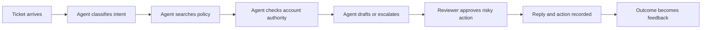

# 业务调研、需求与 SLA

> 第一个架构决策，是确定你真正负责解决的是什么问题。

> **【中文解读】** 本课是架构师路线方法论的第一站：在画任何架构图之前，先弄清"你真正负责解决的是什么问题"。全课的链条是：把宽泛的 AI 请求改写成"决策形"问题陈述（有负责人、有基线、有目标、有护栏）→ 把需求分成功能、质量、性能、安全、防护、可运营、生命周期七类 → 观察真实工作流而不是幻灯片流程 → 区分"能力"与"价值" → 把风险变成带触发条件的评审边界 → 用 SLI/SLO/SLA 三层定义服务等级 → 显式声明非目标。开篇反例要记住："自动解决所有工单的 Agent"听起来具体，实际上什么都没定义；从模型和工具清单开始，你优化的是一个假设。

> **【拓展：需求工程与 SRE→Claude 架构师决策】** 本课把需求工程的分类法与 SRE 的 SLI/SLO/SLA 体系搬进 Claude 应用立项：SLI 是被测信号、SLO 是内部目标、SLA 是带后果的对外承诺，三层不可混用。在认证路线中，它是第 23 课（端到端架构与价值权衡）的直接输入——23 课的架构决策记录（ADR）以本课产出的调研简报为第一份证据；第 24 课（RAG、检索与数据管道）的新鲜度门与权限过滤也要回溯到本课定义的 SLI。调研简报同时是架构师专业级毕业设计的第一份产物。

> 🔗 **【前置】** 学本课前请先掌握：(1) Phase 11 第 13 课"构建生产级 LLM 应用"——生产应用边界的概念；(2) Phase 14 第 12 课"Anthropic 工作流模式"——工作流与 Agent 的取舍，本课的三个架构候选直接复用这套判断；(3) Phase 17 第 08 课"推理指标"——延迟、吞吐与 goodput 度量，本课的 SLI 定义最终要落到这些量上。

**类型：** 参考
**语言：** Python
**前置条件：** Phase 11 第 13 课、Phase 14 第 12 课、Phase 17 第 08 课
**预计用时：** 约 120 分钟

## 学习目标

- 把宽泛的 AI 请求转化为可度量的问题陈述。
- 区分功能、质量、基础设施、防护与生命周期需求。
- 定义成功指标、服务等级目标（SLO）与上报边界。
- 识别在架构开始前需要证据支撑的假设。
- 产出一份技术与业务干系人都能批准的调研简报。

## 问题引入

> **【中文解读】** 问题陈述的质量决定架构的质量。本节给出诊断清单：范围（哪些工单类别在内）、语义（"解决"指什么）、系统边界（能改哪些系统）、财务权限（有多大）、延迟容忍（用户接受多少）、人工边界（哪些动作必须由人做），以及真问题到底在哪（响应时间？政策执行不一致？积压？成本？满意度？）。三个典型失败模式要背：改进了错误的度量、自动执行了被禁止的步骤、把工作从客服挪给评审人而总工作量没降。技能价值一句话：专业的架构从调研开始，这一步能避免数月返工。

一位客服主管想要一个能自动解决每张工单的 Agent。这个请求听起来很具体，其实不是。

你不知道哪些工单类别在范围内、"解决"是什么意思、Agent 可以改哪些系统、它有多大财务权限、用户能容忍多大延迟、哪些动作必须由人完成。你也不知道真正的问题究竟是响应时间、政策执行不一致、积压、成本，还是客户满意度。

如果你从模型和工具清单开始，你优化的是一个假设。一个技术上令人印象深刻的系统仍然可能失败：它改进了错误的度量、自动执行了被禁止的步骤，或者只是把工作从客服转给评审人而总工作量没有降低。

专业的架构从调研开始。考试考察你能否把业务意图翻译成方案并为权衡辩护。在实践中，这项技能能避免数月的返工。

## 核心概念

### 从决策出发，而不是从功能出发

> **【中文解读】** "决策形问题陈述"是本课最实用的模板：弱陈述"做一个 Claude 客服 Agent"没有任何可度量内容；决策形陈述则同时给出度量对象（计费问题首次政策正确响应的中位时长从 11 分钟降到 3 分钟以内）与护栏（未经支持的退款保持零次、超团队阈值的退款保留人工审批）。首次调研会的五个问题把对话从功能清单拉回决策：哪个可观察结果该变、谁拥有它、输出后跟什么动作、错误答案的代价多大、哪些约束不能交易。核心口诀：第二个陈述告诉你该度量什么，也告诉你什么不该自动化。

把请求改写成一个决策：有负责人、有证据、有后果。

弱问题陈述：

```text
Build a Claude support agent.
```

决策形陈述：

```text
Reduce median time to a policy-correct first response for billing questions
from 11 minutes to under 3 minutes, while keeping unsupported-refund actions at
zero and preserving human approval for refunds above the team threshold.
```

第二个陈述告诉你该度量什么，也告诉你什么不该自动化。

在第一次调研会上使用这五个问题：

1. 哪个可观察的结果应该改变？
2. 谁拥有这个结果？
3. 输出之后跟着什么动作？
4. 错误、迟到或缺失的答案要付出什么代价？
5. 哪些约束不能拿来交易？

### 先分类需求，再排优先级

> **【中文解读】** 七类需求分类表是本课的骨架。分类的价值不是形式主义，而是暴露矛盾："即时回答"撞上"三来源合规审查"，"全自动退款"撞上人工审批要求——这些冲突必须在写代码之前显形，否则代码会把它们变成事故。

当每个请求都变成"需求"下泛化的一条时，架构师就在丢失信息。使用显式的类别。

| 类别 | 问题 | 客服示例 |
|-------|----------|-----------------|
| 功能 | 系统必须做什么？ | 读工单、找政策、起草回复 |
| 质量 | 必须做多好？ | 在被评估的草稿中 98% 引用现行政策版本 |
| 性能 | 多快、多大规模？ | 40 请求/秒下 P95 草稿延迟低于 8 秒 |
| 安全 | 谁可以看或改什么？ | 只有被指派的客服能查看账户上下文 |
| 防护 | 哪些结果需要阻止或审批？ | 没有经过验证的授权决定绝不发起退款 |
| 可运营 | 失败如何被发现与恢复？ | 对检索新鲜度与工具错误率告警 |
| 生命周期 | 谁更新、审批并退役它？ | 政策团队负责来源新鲜度；平台团队负责运行时 |

这种分类会暴露矛盾。"即时回答"与"做三来源合规审查"冲突；"自动执行所有退款"与人工审批要求冲突。调研让这些冲突在代码把它们变成事故之前就显形。

### 绘制当前工作流

> **【中文解读】** 八字段工作流勘察是防"幻灯片架构"的工具：价值最高的干预往往不是自主 Agent，而是政策环节的检索、受理处的窄分类器或更好的审批界面。这一节把"自主 Agent 只是可能的模式之一"钉死在证据上——先看真实工作，再选干预点。

不要按幻灯片里描述的理想化流程做设计。去观察真实的工作。



对每个环节，记录：

- 输入与输出。
- 记录系统。
- 负责的角色。
- 决策规则。
- 常见异常。
- 延迟与返工。
- 数据分级。
- 保留的证据。

价值最高的干预可能是政策环节的检索、受理处的一个窄分类器，或一个更好的审批界面。自主 Agent 只是可能的模式之一。

### 区分价值与能力

Claude 也许有能力起草回复。但业务价值取决于这份草稿在评审后是否降低总处理时长、提升一致性，或支撑起新的服务等级。

用一个简单的价值假设：

```text
For [user or team], changing [workflow step] with [bounded capability] will
improve [business measure] from [baseline] to [target], without violating
[guardrail]. We will know after [evaluation window].
```

每个字段都必须填上证据，或标注为假设。不要把不确定性藏进一张自信满满的架构图里。

### 把风险变成评审边界

人工评审不是万能的安全答案。它必须有触发条件、评审人、证据包、时间预算和兜底方案。

对每个动作，估计：

- 出错时的影响。
- 可逆性。
- 从证据能获得的置信度。
- 监管或政策义务。
- 被滥用的可能性。
- 评审成本。

低影响、可逆的草稿可以自动放行。高影响或不可逆的动作需要确定性检查和显式授权。中等风险通常需要抽样、按阈值评审或事后审计。

### 正确区分 SLI、SLO 与 SLA

> **【中文解读】** SLI/SLO/SLA 三层区分是考试与实战的双热点。两条红线：(1) 没有定义总体、标签、测量方法和未达标应对措施的"模型准确率 SLA"在运营上没有意义，"模型准确率 95%"这种话不许直接进 SLA；(2) AI 系统的指标要覆盖任务质量、系统性能、经济性、防护、运营五类，单一准确率数字撑不起一个服务等级。

服务等级指标（SLI）是被测量的信号。服务等级目标（SLO）是内部目标。服务等级协议（SLA）是带有业务或合同后果的承诺。

| 层 | 示例 |
|-------|---------|
| SLI | 草稿中有效引用现行政策的占比 |
| SLO | 滚动七天窗口内至少 98% |
| SLA | 在合同约定的支持窗口内完成对客首次响应 |

不要在不定义总体、标签、测量方法以及目标未达成时应对措施的情况下，承诺模型准确率 SLA。"模型准确率 95%"在运营上没有意义。

对一个 AI 系统，要包含几类指标：

- 任务质量：事实性、完整性、政策依从性。
- 系统性能：延迟、可用性、吞吐。
- 经济性：每成功任务成本、缓存命中率、评审工作量。
- 防护：被拦截的不安全动作、误拦截、上报精确率。
- 运营：检索新鲜度、工具故障、回滚时间。

### 显式声明非目标

非目标保护系统免受无声的范围扩张。

示例：

- 第一版只起草回复，不发送。
- 它处理账单 FAQ，但不处理账户注销。
- 它推荐退款金额，但不能执行退款。
- 试点期间只支持英文工单。

如果有干系人不同意，说明调研找到了一个需要归属的决策。这就是进展。

## 动手构建

## 交互实验室

```figure
22-sla-value-tradeoff
```

用价值与 SLA 探索器调整基线、目标、评审工作量、质量、延迟和硬性权限约束。它会展示一个有能力的系统何时仍会产生负的工作流价值，或违反不可交易的门槛。

## 练习实验室

把一个基线改成无依据的断言，正确地给它分类，并在选择架构之前补上负责人、证据来源和决策日期。

## 交付产物

填写好的 [`outputs/discovery-brief.md`](../outputs/discovery-brief.md) 是一份已获批准、决策形的客服试点简报，带有可度量的 SLI、SLO、假设、非目标和负责人。

## 验证

验证事实、估计、偏好和约束没有被混为一谈：

```bash
cd certifications/claude/lessons/22-business-discovery-requirements-and-slas
python3 code/main.py
python3 -m unittest discover -s code/tests -v
```

测验检查调研与服务等级决策。

## 毕业设计衔接

把这份简报用作架构师专业级毕业设计的第一份产物。

在画架构之前，先写一页调研简报。

```markdown
# Discovery Brief

## Outcome
- Owner:
- Current baseline:
- Target:
- Evaluation window:

## Users and Workflow
- Primary user:
- Current workflow step:
- Downstream action:
- Exceptions:

## Requirements
- Functional:
- Quality:
- Performance:
- Security:
- Safety:
- Operability:
- Lifecycle:

## Data and Authority
- Data classes:
- Systems of record:
- Read permissions:
- Write permissions:
- Human approval triggers:

## Measures
- SLIs:
- SLOs:
- Business measures:
- Guardrail measures:

## Assumptions to Test
- Assumption:
- Evidence needed:
- Owner:
- Decision date:

## Non-Goals
- Not in the first release:
```

现在做一次假设审计。把每条陈述标记为事实、估计、偏好或约束。事实需要来源，估计需要置信区间，偏好需要负责人，约束需要授权来源。

### 用错误代价排优先级

对每个候选用例使用这张决策表：

| 维度 | 低 | 中 | 高 |
|-----------|-----|--------|------|
| 错误输出影响 | 小幅编辑 | 客户摩擦 | 财务、法律或安全伤害 |
| 可逆性 | 一键撤销 | 人工纠正 | 不可逆或很难逆转 |
| 数据敏感度 | 公开 | 内部 | 受监管或机密 |
| 动作权限 | 仅草稿 | 有界写入 | 破坏性或资金写入 |
| 证据质量 | 直接来源 | 部分来源 | 模糊或缺失 |

高分不等于自动禁用 AI。它会把架构推向更窄的范围、确定性门、更强的证据、人工审批和更保守的上线方式。

## 运行验证

> **【中文解读】** 三个架构候选与 ADR 是从调研到架构的桥。判据不是"哪个最强大"而是"哪个在当前约束下得分最高"——工作流稳定已知时，确定性编排通常降低延迟、成本与故障面；只有当路径取决于执行中发现的证据、且额外灵活性值得控制负担时才用 Agent。ADR 把选择变成可审计的记录：上下文、选项、决策、被拒方案与后果缺一不可，"架构是当前的决策，不是永久的身份"。

把简报应用到三个架构候选上：

1. 带人工审批的检索辅助草稿生成。
2. 只在分类和起草环节调用 Claude 的确定性工作流。
3. 配备工单、政策、账户和退款工具的自适应 Agent。

按需求给每个候选打分。最有能力的选项并不自动最优。如果工作流稳定且已知，确定性编排通常能降低延迟、成本和故障面。当路径取决于执行中发现的证据、且额外的灵活性值得承担控制负担时，才使用 Agent。

把选择记录进一份架构决策记录（ADR）：

```markdown
# ADR: Support Resolution Pattern

## Status
Proposed

## Context
Decision, constraints, evidence, and unresolved assumptions.

## Options
1. Retrieval-assisted draft workflow
2. Deterministic multi-step workflow
3. Adaptive tool-using agent

## Decision
Chosen option and the requirement it best satisfies.

## Rejected Alternatives
Why each alternative loses under current constraints.

## Consequences
New operational work, residual risk, and reversal plan.

## Verification
Offline evaluation, pilot guardrails, SLOs, and review date.
```

## 考试决策模式

当一个场景以一个宽泛的业务请求开头时，最强的第一步通常是在选技术之前先降低歧义。

优先选择这样的答案：

- 确立业务结果与当前基线。
- 识别用户、记录系统和下游动作。
- 区分硬约束与偏好。
- 定义质量与运营度量。
- 指定评审与生命周期的归属。
- 用有边界的试点检验风险最高的假设。

对那些立即选最大模型、直接加一个 Agent、或不澄清权限与错误代价就承诺自动化的答案保持警惕。

## 常见陷阱

> **【中文解读】** 四个陷阱对应四条考试直觉：Agent 的灵活性有真实代价；人工评审不是免费的；没有分母的准确率无法指导运营决策；没有归属的控制会无声失效。

### 把每个请求都变成 Agent

Agent 的灵活性有代价：更多工具调用、更大攻击面、更难测试、更不可预测的延迟。只有当自适应规划本身是需求时才选它。

### 把人工评审当作免费

评审队列可能变成新的瓶颈。度量评审时长、一致率和上报质量。

### 使用没有分母的准确率

写明数据集、总体、标签、评估者和时间窗口。否则这个数字无法指导运营决策。

### 忽视上线后的归属

每个提示词、数据源、工具、控制、指标和上报路径都需要负责人。没有归属的控制会无声地失效。

## 练习

1. 把"做一个 AI 分析师"改写成带基线、目标、护栏和负责人的决策形问题陈述。
2. 绘制一个真实工作流，并找出一个确定性规则优于模型调用的环节。
3. 为一个检索辅助的合规工作流定义五个 SLI，至少包含一个质量、防护、经济性和可运营性信号。
4. 写一份拒绝 Agent 架构的 ADR，即使模型本身有能力完成这项工作。
5. 设计一个检验最高风险假设的试点，且不给系统生产写权限。

## 关键术语

| 术语 | 人们常说 | 实际含义 |
|------|-----------------|------------------------|
| 需求（Requirement） | 一个要做的功能 | 解决方案必须满足的可测试条件 |
| 约束（Constraint） | 一件不方便的事 | 架构不可拿来交易的边界 |
| SLI | 一个 SLA 目标 | 用于评判服务行为的被测信号 |
| SLO | 厂商承诺 | 针对某指标的内部目标 |
| SLA | 任何性能目标 | 带明确后果的服务承诺 |
| 非目标（Non-goal） | 被悄悄推迟的工作 | 防止范围漂移的显式边界 |
| ADR | 一张图 | 记录上下文、选项、决策与后果的持久文档 |

## 延伸阅读

- [Claude Certified Architect Professional exam guide](https://everpath-course-content.s3-accelerate.amazonaws.com/instructor%2F6nizmqk8tpzpfjvt6qmmav7rh%2Fpublic%2F1783542810%2FClaude+Certified+Architect+%E2%80%93+Professional+Exam+Guide.pdf) —— Claude 认证架构师专业级考试指南：公开的生命周期与架构目标
- [Building effective agents](https://www.anthropic.com/research/building-effective-agents) —— Anthropic"构建有效 Agent"指南：工作流与 Agent 的权衡
- [Claude Platform documentation](https://platform.claude.com/docs/en/home) —— Claude 平台文档：当前产品与 API 行为
- Phase 11, Lesson 13 —— 生产应用边界
- Phase 17, Lesson 08 —— 延迟、吞吐与 goodput 度量
