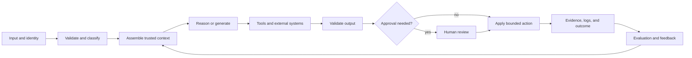

# End-to-End Architecture and Value Tradeoffs | 端到端架构与价值权衡

> Architecture is the art of spending complexity only where it changes the outcome.

> **【中文解读】** 本课把第 22 课的调研简报升级为完整架构：从输入到反馈与运营画出整条回路，再在四种模式（增强调用、确定性工作流、自适应 Agent、多 Agent 系统）中选"刚好够用的最小者"。核心命题：架构是把复杂度只花在能改变结果的地方。开篇反例是"一个提示词装下合同+政策库+抽取 schema+谈判规则+最终红线"的合同评审助手——演示能跑，生产失败，因为多种职责被压缩进了单个概率步骤。全课工具箱：整条回路的边界六问、四模式取舍、围绕契约分解、语义与确定性控制分离、全轨迹成本预算、延迟分布、把反馈当产品面设计。

> **【拓展：从单次调用到系统架构→认证与毕业设计】** 本课对应 Anthropic"构建有效 Agent"指南中 workflow 与 agent 的官方区分，是架构师专业级考试的核心决策域：当选项之间的差别是复杂度时，选择满足既定需求的最简架构。它在认证路线中承上启下——上游是第 22 课（调研简报提供需求、权重与硬约束），下游是第 24 课（RAG 系统是回路中"组装可信上下文"一环的展开）；ADR 与三候选加权打分表直接进入架构师专业级毕业设计的架构选项章节。

> 🔗 **【前置】** 学本课前请先掌握：(1) 第 22 课"业务调研、需求与 SLA"——本课打分的权重和硬约束全部来自那份调研简报；(2) Phase 14 第 01 课"Agent 循环"——从第一性原理理解观察-思考-行动循环，本课四种模式都以它为底层；(3) Phase 14 第 12、28 课——工作流模式与编排模式的取舍先例。

**Type:** Reference | **类型:** 参考
**Languages:** Python | **语言:** Python
**Prerequisites:** [Business Discovery, Requirements, and SLAs](../../22-business-discovery-requirements-and-slas/); Phase 14, Lessons 01, 12, and 28 | **前置知识:** 第 22 课（业务调研、需求与 SLA）、Phase 14 第 01、12、28 课
**Time:** ~135 minutes | **时间:** 约 135 分钟

## Learning Objectives | 学习目标

- Draw a complete Claude system from input through feedback and operations
  中文翻译：画出从输入经反馈到运营的完整 Claude 系统。
- Choose among augmented calls, workflows, agents, and multi-agent systems
  中文翻译：在增强调用、工作流、Agent 与多 Agent 系统之间做选择。
- Decompose complex work around evidence, authority, and verification boundaries
  中文翻译：围绕证据、权限与验证边界分解复杂工作。
- Defend cost, latency, quality, safety, and maintainability tradeoffs
  中文翻译：为成本、延迟、质量、安全与可维护性的权衡辩护。
- Identify when additional model capability cannot repair a structural design flaw
  中文翻译：识别什么时候额外的模型能力也修不好结构性设计缺陷。

## The Problem | 问题引入

> **【中文解读】** 开篇反例值得逐句拆：合同评审助手把合同、政策库、抽取 schema、谈判规则和对最终红线的请求全塞进一个提示词。演示能跑，生产失败的五个症状——大合同超出上下文预算、政策版本冲突、模型返回合法 JSON 但法律结论无依据、评审人看不出哪处修改由哪个来源支撑、重试只加成本不改变失败。诊断只有一个：系统失败不是因为提示词还差一句话，而是因为几种不同的职责被压缩进了单个概率步骤。换更大的模型只让行文更好，溯源、权限与生命周期归属依旧悬空。

A team launches a contract-review assistant. One prompt contains the contract,
policy library, extraction schema, negotiation rules, and a request for a final
redline. The demo works. Production does not.

> 一个团队上线了合同评审助手。一个提示词里装着合同、政策库、抽取 schema、谈判规则和对最终红线（redline）的请求。演示能跑。生产不行。

Large contracts exceed the practical context budget. Policy versions conflict.
The model returns valid JSON with an unsupported legal conclusion. Reviewers
cannot see which source supported which change. Retrying increases cost without
changing the failure. A larger model improves prose while leaving provenance,
authority, and lifecycle ownership unresolved.

> 大合同超出实际可用的上下文预算。政策版本相互冲突。模型返回合法的 JSON，里面的法律结论却没有依据。评审人看不出哪处修改由哪个来源支撑。重试只增加成本，不改变失败。换更大的模型只让行文更好，溯源、权限和生命周期归属依旧没解决。

The system is not failing because the prompt needs another sentence. It is
failing because several different responsibilities have been compressed into a
single probabilistic step.

> 系统失败不是因为提示词还差一句话，而是因为几种不同的职责被压缩进了单个概率步骤。

## The Concept | 核心概念

### Draw the Whole Loop | 画出完整回路

> **【中文解读】** 端到端架构不止于模型调用：输入与身份 → 校验与分类 → 组装可信上下文 → 推理或生成 → 工具与外部系统 → 校验输出 → 是否需要审批（是则人工评审）→ 执行有界动作 → 证据/日志/结果 → 评估与反馈（回流到上下文组装）。每条边六问：什么数据过界、哪个身份与权限生效、强制什么 schema 或契约、超时/歧义/部分失败怎么办、保留什么证据、谁拥有下一个决策。金句要背：没有失败路径的架构图只是一张营销图。

An end-to-end architecture includes more than the model call.

> 端到端架构包含的不止模型调用。



For every edge, ask:

> 对每条边，问：

- What data crosses the boundary?
  中文翻译：什么数据越过边界？
- Which identity and permission apply?
  中文翻译：哪个身份与权限生效？
- What schema or contract is enforced?
  中文翻译：强制执行什么 schema 或契约？
- What happens on timeout, ambiguity, or partial failure?
  中文翻译：超时、歧义或部分失败时会发生什么？
- What evidence is retained?
  中文翻译：保留了什么证据？
- Who owns the next decision?
  中文翻译：谁拥有下一个决策？

An architecture diagram without failure paths is a marketing picture.

> 没有失败路径的架构图只是一张营销图。

### Choose the Smallest Pattern That Fits | 选择刚好够用的最小模式

> **【中文解读】** 四种起点模式一张表记牢——增强调用：单请求+选定上下文/检索/工具，适合分类、抽取、起草、打分，编排开销最低、最易评估、延迟成本可预测，但不擅长分支与多步恢复。确定性工作流：代码控制序列、在选定步骤调 Claude，状态与重试显式、每步权限窄、测试可复现，但路径无法预知时脆弱。自适应 Agent：模型按观察选动作直到停止条件，规划灵活、适合开放式研究与修复，但延迟成本可变、权限与评估面大、有循环与漂移风险。多 Agent 系统：协调者把隔离关切委派给专家或独立评审人，可并行、每角色上下文小、可独立评审，但交接损耗、调用更多、协调成本可能超过收益。纪律：不要因为图看起来成熟就选多 Agent。

There are four useful starting patterns.

> 有四种有用的起点模式。

#### Augmented Model Call | 增强模型调用

One request uses selected context, retrieval, or a tool and returns a bounded
output. Use it for classification, extraction, drafting, or scoring when the
steps are known and a single turn can contain the necessary evidence.

> 一个请求使用选定的上下文、检索或工具，返回有界的输出。当步骤已知且单轮能装下必要证据时，把它用于分类、抽取、起草或打分。

Benefits:

> 收益：

- lowest orchestration overhead
  中文翻译：最低的编排开销。
- easiest to evaluate
  中文翻译：最容易评估。
- predictable latency and cost
  中文翻译：可预测的延迟与成本。

Limits:

> 局限：

- weak fit for branching work
  中文翻译：不适合分支型工作。
- limited recovery across several external actions
  中文翻译：跨多个外部动作的恢复能力有限。

#### Deterministic Workflow | 确定性工作流

Code controls the sequence and calls Claude at selected steps. Use it when the
business process is stable, auditability matters, or each transition needs a
clear contract.

> 代码控制序列，在选定的步骤调用 Claude。当业务流程稳定、可审计性重要、或每次转换都需要清晰契约时使用它。

Benefits:

> 收益：

- explicit states and retries
  中文翻译：显式的状态与重试。
- narrow permissions per step
  中文翻译：每步权限收窄。
- reproducible tests
  中文翻译：可复现的测试。

Limits:

> 局限：

- brittle when the path cannot be known in advance
  中文翻译：路径无法预知时脆弱。
- new exception classes require workflow changes
  中文翻译：新的异常类别需要修改工作流。

#### Adaptive Agent | 自适应 Agent

Claude selects the next action based on observations until a stop condition is
met. Use it when evidence discovery determines the path and enumerating every
branch would be impractical.

> Claude 根据观察选择下一个动作，直到满足停止条件。当证据发现决定路径、穷举每个分支不现实时使用它。

Benefits:

> 收益：

- flexible planning
  中文翻译：规划灵活。
- useful for open-ended research and repair
  中文翻译：适合开放式研究与修复。

Limits:

> 局限：

- variable latency and cost
  中文翻译：延迟与成本可变。
- larger permission and evaluation surface
  中文翻译：权限与评估面更大。
- loop, drift, and tool-error risks
  中文翻译：循环、漂移与工具错误风险。

#### Multi-Agent System | 多 Agent 系统

A coordinator delegates isolated concerns to specialists or independent
reviewers. Use it when work can be partitioned, context isolation improves
quality, or independence is required for verification.

> 协调者把相互隔离的关切委派给专家或独立评审人。当工作可分区、上下文隔离能提升质量、或验证需要独立性时使用它。

Benefits:

> 收益：

- parallel execution
  中文翻译：并行执行。
- smaller context per role
  中文翻译：每个角色的上下文更小。
- independent review
  中文翻译：独立评审。

Limits:

> 局限：

- handoff loss and duplicated work
  中文翻译：交接损耗与重复劳动。
- more calls and harder trace analysis
  中文翻译：调用更多、追踪分析更难。
- coordination can cost more than it saves
  中文翻译：协调的成本可能超过它省下的。

Do not choose multi-agent because the diagram looks mature. Choose it when a
specific context, independence, parallelism, or specialization requirement pays
for the coordination.

> 不要因为图看起来成熟就选多 Agent。当某个具体的上下文、独立性、并行或专业化需求能为协调成本买单时才选它。

### Decompose Around Contracts | 围绕契约分解

> **【中文解读】** 分解的判据是"正确性如何检查"，不是文档章节或团队边界：每次交接处创建契约。合同评审八步（受理校验→条款切分→政策检索→条款分析→独立评审→红线生成→人工法务审批→证据与结果记录）是标准示范——每步职责都比"评审这份合同"更窄，失败可局部化：重试检索不必重新生成已接受的条款分析，否决一条发现不必丢弃全部工作。配套记忆"语义与确定性控制分离"的规则：能写成"对可信数据的稳定谓词"的条件，一律在模型之外强制执行。

Bad decomposition follows document sections or team boundaries without asking
how correctness will be checked. Good decomposition creates a contract at each
handoff.

> 糟糕的分解按文档章节或团队边界切分，却不问正确性将如何检查。好的分解在每次交接处创建一个契约。

For the contract-review system:

> 对合同评审系统：

1. Intake validates file type, identity, and jurisdiction metadata.
   中文翻译：受理环节校验文件类型、身份与辖区元数据。
2. Clause segmentation returns stable identifiers and source spans.
   中文翻译：条款切分返回稳定标识符与来源跨度。
3. Policy retrieval returns versioned evidence with provenance.
   中文翻译：政策检索返回带溯源的版本化证据。
4. Clause analysis returns findings against a schema.
   中文翻译：条款分析按 schema 返回发现项。
5. An independent reviewer checks evidence coverage and contradictions.
   中文翻译：独立评审人检查证据覆盖与矛盾。
6. Redline generation uses only accepted findings.
   中文翻译：红线生成只使用被接受的发现项。
7. Human counsel approves material changes.
   中文翻译：人工法务审批实质性变更。
8. The system records decision evidence and later outcome.
   中文翻译：系统记录决策证据与后续结果。

Each step has a narrower job than "review this contract." A failure can be
localized. The system can retry retrieval without regenerating accepted clause
analysis, and a reviewer can reject one finding without discarding all work.

> 每一步的职责都比"评审这份合同"更窄。失败可以被局部化。系统可以只重试检索而不重新生成已接受的条款分析，评审人可以只否决一条发现而不丢弃全部工作。

### Separate Semantic and Deterministic Controls | 分离语义控制与确定性控制

Claude is useful for ambiguous judgments such as whether a clause materially
changes liability. Code is better for invariants such as required fields,
permission checks, maximum refund, allowed jurisdiction, and document version.

> Claude 擅长模糊判断，比如某条款是否实质性改变责任。代码更适合不变式，比如必填字段、权限检查、退款上限、允许的辖区和文档版本。

Use this rule:

> 使用这条规则：

```text
If a condition can be expressed as a stable predicate over trusted data,
enforce it outside the model.
```

Prompt instructions guide behavior. They do not create a security boundary.

> 提示词指引行为。它们造不出安全边界。

### Budget Across the Whole Trajectory | 为整条轨迹做预算

> **【中文解读】** 成本与延迟两节合起来记。成本不只是单次调用的输入加输出 token，而是整条轨迹：模型调用+检索与工具成本+重试概率×重试成本+人工评审分钟数×人力费率+预期事故与纠正成本；重试更多的小模型，每成功任务成本可能反而更高，能砍掉昂贵评审步骤的大模型可能更便宜——但这一点只有评估能证明。延迟必须当分布看：至少 P50、P95 与超时率，交互式工作还要看"首个有用输出的时间"；并行只对相互独立的工作有效，争抢同一限流或需要串行合并的并行调用可能只加成本不降时延。

Cost is not only input plus output tokens for one call. A system trajectory may
include retrieval, several model calls, tool execution, retries, review, and
human labor.

> 成本不只是单次调用的输入加输出 token。一条系统轨迹可能包含检索、多次模型调用、工具执行、重试、评审和人工劳动。

Estimate:

> 估计：

```text
expected task cost =
  model calls
  + retrieval and tool cost
  + retry probability times retry cost
  + human review minutes times labor rate
  + expected incident and correction cost
```

A smaller model that produces more retries can cost more per successful task.
A larger model may be cheaper if it eliminates an expensive review step, but
only an evaluation can establish that.

> 一个产生更多重试的小模型，每成功任务的成本可能更高。大模型如果能砍掉昂贵的评审步骤可能更便宜——但这一点只有评估才能确立。

### Treat Latency as a Distribution | 把延迟当作分布

Average latency hides the long tail that users experience. Model time, tool
time, queueing, retries, and human approval combine.

> 平均延迟掩盖了用户实际经历的长尾。模型时间、工具时间、排队、重试与人工审批会叠加。

Use at least P50, P95, and timeout rate. For interactive work, track time to
first useful output as well as total completion. For background work, throughput
and completion deadline may matter more than first-token latency.

> 至少使用 P50、P95 和超时率。交互式工作要同时跟踪首个有用输出的时间与总完成时间。后台工作中，吞吐与完成截止时间可能比首 token 延迟更重要。

Parallel execution only helps independent work. Parallel calls that compete for
the same rate limit or produce results requiring serial reconciliation may add
cost without reducing end-to-end time.

> 并行执行只对独立工作有帮助。争抢同一限流配额、或结果需要串行合并的并行调用，可能只增加成本而不缩短端到端时间。

### Design Feedback as a Product Surface | 把反馈设计成产品面

Feedback is not a pile of thumbs-up events. It must connect an outcome to the
inputs, versions, trajectory, and decision.

> 反馈不是一堆点赞事件。它必须把结果与输入、版本、轨迹和决策关联起来。

Store:

> 存储：

- input class and risk tier
  中文翻译：输入类别与风险层级。
- prompt, model, tool, and knowledge versions
  中文翻译：提示词、模型、工具与知识版本。
- retrieved evidence identifiers
  中文翻译：检索到的证据标识符。
- tool calls and structured errors
  中文翻译：工具调用与结构化错误。
- output and validator results
  中文翻译：输出与校验器结果。
- human edits and reason codes
  中文翻译：人工修改与原因代码。
- downstream outcome
  中文翻译：下游结果。

The feedback loop then supports a decision: change a prompt, repair retrieval,
adjust routing, improve a tool, or narrow scope.

> 反馈回路随后支撑一个决策：改提示词、修检索、调路由、改进工具，或收窄范围。

## Build It | 动手构建

## Interactive Lab | 交互实验室

```figure
23-architecture-tradeoff
```

Use the architecture tradeoff explorer to compare an augmented call, workflow,
agent, and multi-agent design against weighted quality, latency, cost, safety,
auditability, and change-cost evidence. Hard constraints cannot be averaged
away by a high total score.

> 用架构权衡探索器，对照加权的质量、延迟、成本、安全、可审计性与变更成本证据，比较增强调用、工作流、Agent 与多 Agent 设计。硬约束不会被高总分平均掉。

## Practice Lab | 练习实验室

Remove one rejected alternative or hard safety gate from a copy of the decision,
observe the readiness failure, and repair the architectural rationale.

> 从决策副本中删掉一个被拒方案或硬安全门，观察就绪性校验失败，然后修复架构论证。

## Shipped Artifact | 交付产物

The filled [`outputs/architecture-decision.md`](../outputs/architecture-decision.md)
selects a deterministic contract-review workflow and records failure paths and
a reversal condition.

> 填写好的 `outputs/architecture-decision.md` 选定确定性合同评审工作流，并记录失败路径与逆转条件。

## Verify It | 验证

Run the deterministic decision-packet verifier:

> 运行确定性的决策包校验器：

```bash
cd certifications/claude/lessons/23-end-to-end-architecture-and-value-tradeoffs
python3 code/main.py
python3 -m unittest discover -s code/tests -v
```

The quiz tests the same pattern and control decisions.

> 测验考察同样的模式与控制决策。

## Capstone Connection | 毕业设计衔接

Carry the ADR into the Architect Professional capstone's architecture options
section.

> 把 ADR 带进架构师专业级毕业设计的架构选项章节。

Create an architecture packet for one business workflow.

> 为一个业务工作流创建一份架构包。

### Step 1: Draw Three Candidates | 第一步：画出三个候选

Draw an augmented-call, deterministic-workflow, and adaptive-agent design. Keep
the same inputs, outputs, and constraints so the comparison is fair.

> 分别画出增强调用、确定性工作流与自适应 Agent 设计。保持相同的输入、输出和约束，比较才公平。

### Step 2: Score Explicit Tradeoffs | 第二步：为显式权衡打分

Use a one-to-five scale with written evidence.

> 用 1 到 5 分制并附书面证据。

| Criterion | Weight | Augmented call | Workflow | Agent |
|-----------|-------:|---------------:|---------:|------:|
| Task quality | 25 | | | |
| P95 latency | 15 | | | |
| Cost per success | 15 | | | |
| Safety and authority | 20 | | | |
| Auditability | 15 | | | |
| Change cost | 10 | | | |

Weights come from discovery, not habit. If a regulated action makes safety a
hard constraint, do not average it away with convenience.

> 权重来自调研，不是习惯。如果受监管的动作使安全成为硬约束，就不要用便利性把它平均掉。

### Step 3: Write Failure Paths | 第三步：写失败路径

For each external dependency, specify timeout, retry, circuit-break behavior,
partial result, user message, and operator evidence. Include a total turn and
cost budget for agents.

> 对每个外部依赖，写明超时、重试、熔断行为、部分结果、用户消息与运维证据。为 Agent 设总轮次与成本预算。

### Step 4: Define the Evaluation | 第四步：定义评估

Build a representative set covering normal, ambiguous, adversarial, and
dependency-failure cases. Measure final quality, trajectory quality, cost,
latency, and safety.

> 构建覆盖正常、歧义、对抗与依赖失败情形的代表性集合。度量最终质量、轨迹质量、成本、延迟与安全。

### Step 5: Record Reversal Conditions | 第五步：记录逆转条件

State what evidence would cause the team to switch patterns. Architecture is a
current decision, not a permanent identity.

> 写明什么证据会让团队切换模式。架构是当前的决策，不是永久的身份。

## Use It | 运行验证

> **【中文解读】** "Use It"一节用跨财报问答系统把四模式落位：一条检索查询能可靠取回足够证据时用单次增强调用；每个任务都遵循查询→检索→排序→回答→引用时用工作流；必须发现缺失实体、改写查询、判断证据是否充分时用 Agent；只有当并行来源研究或独立验证足以改善目标指标、值得协调成本时多 Agent 才成立。随后加两个约束（一小时作答时限+严格成本预算），最优设计可能改变——架构永远是约束之下的架构。

Consider a research system that must answer questions across company filings.

> 考虑一个必须跨公司财报回答问题的研究系统。

A single augmented call fits when one retrieval query reliably returns enough
evidence. A workflow fits when every task follows query, retrieve, rank, answer,
and cite. An agent fits when it must discover missing entities, reformulate
queries, and decide whether evidence is sufficient. A multi-agent design fits
only if parallel source research or independent verification improves the target
metric enough to justify coordination.

> 一条检索查询能可靠返回足够证据时，单次增强调用合适。每个任务都遵循查询、检索、排序、回答、引用时，工作流合适。必须发现缺失实体、改写查询并判断证据是否充分时，Agent 合适。只有当并行来源研究或独立验证能把目标指标改善到值得协调时，多 Agent 设计才合适。

Now add a one-hour answer deadline and a strict cost budget. The optimal design
may change. Architecture is always architecture under constraints.

> 现在加上一小时的作答时限和严格的成本预算。最优设计可能改变。架构永远是约束之下的架构。

## Exam Decision Patterns | 考试决策模式

When options differ by complexity, choose the simplest architecture that meets
the stated requirement. Look for structural fixes before prompt patches.

> 当选项之间的差别在复杂度时，选择满足既定需求的最简架构。先找结构性修复，再考虑提示词补丁。

Strong answers often:

> 强答案常常：

- enforce deterministic rules in code
  中文翻译：用代码强制执行确定性规则。
- isolate high-risk tools and permissions
  中文翻译：隔离高风险工具与权限。
- use a workflow for known paths and an agent for genuinely adaptive paths
  中文翻译：已知路径用工作流，真正自适应的路径才用 Agent。
- add an independent reviewer when independence is a requirement
  中文翻译：当独立性是需求时加独立评审人。
- keep provenance through every transformation
  中文翻译：让溯源贯穿每一次转换。
- define stop, retry, partial-result, and escalation behavior
  中文翻译：定义停止、重试、部分结果与上报行为。
- optimize cost per successful outcome, not cost per call
  中文翻译：优化每成功结果的成本，而不是每次调用的成本。

Weak answers often add a larger model, longer prompt, more agents, or more tools
without addressing the actual failure boundary.

> 弱答案常常加更大的模型、更长的提示词、更多 Agent 或更多工具，却不触及真正的失败边界。

## Common Traps | 常见陷阱

> **【中文解读】** 四个陷阱各配一句反驳：能力膨胀——每个多余的工具都在扩大提示词体积、选择歧义、攻击面与授权风险，只暴露当前角色所需的最小集合；围绕缺失契约做提示——两个步骤对标识符、schema 或错误行为各执一词时，再清晰的自然语言指令也造不出可靠接口，去定义契约；自我评审冒充独立——让同一段上下文"再检查一遍"只会重复同一个假设，独立性要靠带明确评分标准与隔离证据的独立评审人；只优化演示路径——生产质量活在歧义、过期数据、权限错误、超时与部分失败里，架构批准前必须把它们纳入。

### Capability Bloat | 能力膨胀

Every unnecessary tool expands prompt size, choice ambiguity, attack surface,
and authorization risk. Expose the minimum set required for the current role.

> 每个不必要的工具都在扩大提示词体积、选择歧义、攻击面和授权风险。只暴露当前角色所需的最小集合。

### Prompting Around a Missing Contract | 围绕缺失契约做提示

If two steps disagree about identifiers, schemas, or error behavior, clearer
natural-language instructions cannot create a reliable interface. Define the
contract.

> 如果两个步骤对标识符、schema 或错误行为各执一词，更清晰的自然语言指令也造不出可靠接口。去定义契约。

### Self-Review as Independence | 自我评审冒充独立性

Asking the same context to "double-check" can repeat the same assumption. Use a
separate reviewer with an explicit rubric and isolated evidence when independence
matters.

> 让同一段上下文"再检查一遍"只会重复同一个假设。当独立性重要时，使用带明确评分标准与隔离证据的独立评审人。

### Optimizing the Demo Path | 只优化演示路径

Production quality lives in ambiguity, stale data, permission errors, timeouts,
and partial failure. Include them before architecture approval.

> 生产质量活在歧义、过期数据、权限错误、超时和部分失败之中。在架构批准之前把它们纳入。

## Exercises | 练习

1. Design augmented-call, workflow, and agent candidates for an invoice-dispute
   process. Choose one and state the reversal condition.
   中文翻译：为发票争议流程设计增强调用、工作流与 Agent 三个候选。选定一个并写出逆转条件。
2. Find three invariants in an AI workflow that should be deterministic code.
   中文翻译：找出一个 AI 工作流中三条应当是确定性代码的不变式。
3. Calculate cost per successful task for two models with different retry and
   review rates.
   中文翻译：为两个重试率与评审率不同的模型计算每成功任务的成本。
4. Add a tool outage to a multi-agent research design and specify partial-result
   behavior.
   中文翻译：给多 Agent 研究设计加入一次工具中断，并写明部分结果行为。
5. Write an evaluation that detects a system with good final prose but wasteful
   or unsafe trajectories.
   中文翻译：写一个能检测"最终行文漂亮但轨迹浪费或不安全"的评估。

## Key Terms | 关键术语

| Term | What people say | What it actually means |
|------|-----------------|------------------------|
| Augmented call | A weak agent | A bounded model call supplied with selected context or tools |
| Workflow | An agent with fixed steps | Code-owned orchestration with explicit transitions |
| Agent | Any LLM application | A model-directed loop that chooses actions from observations |
| Multi-agent | More intelligence | Several model contexts coordinated for isolation, parallelism, or independent review |
| Contract | A prompt instruction | A machine-checkable boundary for data, errors, and responsibility |
| Cost per success | Token price | Total expected model, tool, retry, review, and correction cost per accepted outcome |

## Further Reading | 延伸阅读

- [Building effective agents](https://www.anthropic.com/research/building-effective-agents) for workflow and agent patterns
  中文翻译：构建有效 Agent——工作流与 Agent 模式的官方指南
- [Claude Agent SDK documentation](https://platform.claude.com/docs/en/agent-sdk/overview) for current agent harness capabilities
  中文翻译：Claude Agent SDK 文档——当前 Agent 执行框架能力
- Phase 14, Lesson 01 for the agent loop from first principles
  中文翻译：Phase 14 第 01 课——从第一性原理讲 Agent 循环
- Phase 14, Lesson 28 for orchestration tradeoffs
  中文翻译：Phase 14 第 28 课——编排模式取舍
- Phase 17, Lesson 08 for goodput and latency measurement
  中文翻译：Phase 17 第 08 课——goodput 与延迟度量
