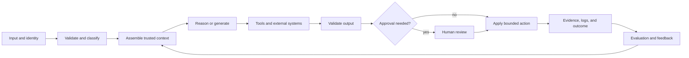

# 端到端架构与价值权衡

> 架构是一门花钱的艺术：把复杂度只花在能改变结果的地方。

> **【中文解读】** 本课把第 22 课的调研简报升级为完整架构：从输入到反馈与运营画出整条回路，再在四种模式（增强调用、确定性工作流、自适应 Agent、多 Agent 系统）中选"刚好够用的最小者"。核心命题：架构是把复杂度只花在能改变结果的地方。开篇反例是"一个提示词装下合同+政策库+抽取 schema+谈判规则+最终红线"的合同评审助手——演示能跑，生产失败，因为多种职责被压缩进了单个概率步骤。全课工具箱：整条回路的边界六问、四模式取舍、围绕契约分解、语义与确定性控制分离、全轨迹成本预算、延迟分布、把反馈当产品面设计。

> **【拓展：从单次调用到系统架构→认证与毕业设计】** 本课对应 Anthropic"构建有效 Agent"指南中 workflow 与 agent 的官方区分，是架构师专业级考试的核心决策域：当选项之间的差别是复杂度时，选择满足既定需求的最简架构。它在认证路线中承上启下——上游是第 22 课（调研简报提供需求、权重与硬约束），下游是第 24 课（RAG 系统是回路中"组装可信上下文"一环的展开）；ADR 与三候选加权打分表直接进入架构师专业级毕业设计的架构选项章节。

> 🔗 **【前置】** 学本课前请先掌握：(1) 第 22 课"业务调研、需求与 SLA"——本课打分的权重和硬约束全部来自那份调研简报；(2) Phase 14 第 01 课"Agent 循环"——从第一性原理理解观察-思考-行动循环，本课四种模式都以它为底层；(3) Phase 14 第 12、28 课——工作流模式与编排模式的取舍先例。

**类型：** 参考
**语言：** Python
**前置条件：** 第 22 课（业务调研、需求与 SLA）、Phase 14 第 01、12、28 课
**预计用时：** 约 135 分钟

## 学习目标

- 画出从输入经反馈到运营的完整 Claude 系统。
- 在增强调用、工作流、Agent 与多 Agent 系统之间做选择。
- 围绕证据、权限与验证边界分解复杂工作。
- 为成本、延迟、质量、安全与可维护性的权衡辩护。
- 识别什么时候额外的模型能力也修不好结构性设计缺陷。

## 问题引入

> **【中文解读】** 开篇反例值得逐句拆：合同评审助手把合同、政策库、抽取 schema、谈判规则和对最终红线的请求全塞进一个提示词。演示能跑，生产失败的五个症状——大合同超出上下文预算、政策版本冲突、模型返回合法 JSON 但法律结论无依据、评审人看不出哪处修改由哪个来源支撑、重试只加成本不改变失败。诊断只有一个：系统失败不是因为提示词还差一句话，而是因为几种不同的职责被压缩进了单个概率步骤。

一个团队上线了合同评审助手。一个提示词里装着合同、政策库、抽取 schema、谈判规则和对最终红线（redline）的请求。演示能跑。生产不行。

大合同超出实际可用的上下文预算。政策版本相互冲突。模型返回合法的 JSON，里面的法律结论却没有依据。评审人看不出哪处修改由哪个来源支撑。重试只增加成本，不改变失败。换更大的模型只让行文更好，溯源、权限和生命周期归属依旧没解决。

系统失败不是因为提示词还差一句话，而是因为几种不同的职责被压缩进了单个概率步骤。

## 核心概念

### 画出完整回路

> **【中文解读】** 端到端架构不止于模型调用，每条边都要能回答边界六问。金句要背：没有失败路径的架构图只是一张营销图。

端到端架构包含的不止模型调用。



对每条边，问：

- 什么数据越过边界？
- 哪个身份与权限生效？
- 强制执行什么 schema 或契约？
- 超时、歧义或部分失败时会发生什么？
- 保留了什么证据？
- 谁拥有下一个决策？

没有失败路径的架构图只是一张营销图。

### 选择刚好够用的最小模式

> **【中文解读】** 四种起点模式一张表记牢：增强调用最省编排、最易评估；确定性工作流状态显式、权限窄、测试可复现；自适应 Agent 规划灵活但延迟成本可变；多 Agent 可并行、可独立评审但协调成本可能超过收益。纪律：不要因为图看起来成熟就选多 Agent。

有四种有用的起点模式。

#### 增强模型调用

一个请求使用选定的上下文、检索或工具，返回有界的输出。当步骤已知且单轮能装下必要证据时，把它用于分类、抽取、起草或打分。

收益：

- 最低的编排开销。
- 最容易评估。
- 可预测的延迟与成本。

局限：

- 不适合分支型工作。
- 跨多个外部动作的恢复能力有限。

#### 确定性工作流

代码控制序列，在选定的步骤调用 Claude。当业务流程稳定、可审计性重要、或每次转换都需要清晰契约时使用它。

收益：

- 显式的状态与重试。
- 每步权限收窄。
- 可复现的测试。

局限：

- 路径无法预知时脆弱。
- 新的异常类别需要修改工作流。

#### 自适应 Agent

Claude 根据观察选择下一个动作，直到满足停止条件。当证据发现决定路径、穷举每个分支不现实时使用它。

收益：

- 规划灵活。
- 适合开放式研究与修复。

局限：

- 延迟与成本可变。
- 权限与评估面更大。
- 循环、漂移与工具错误风险。

#### 多 Agent 系统

协调者把相互隔离的关切委派给专家或独立评审人。当工作可分区、上下文隔离能提升质量、或验证需要独立性时使用它。

收益：

- 并行执行。
- 每个角色的上下文更小。
- 独立评审。

局限：

- 交接损耗与重复劳动。
- 调用更多、追踪分析更难。
- 协调的成本可能超过它省下的。

不要因为图看起来成熟就选多 Agent。当某个具体的上下文、独立性、并行或专业化需求能为协调成本买单时才选它。

### 围绕契约分解

> **【中文解读】** 分解的判据是"正确性如何检查"，不是文档章节或团队边界：每次交接处创建契约。合同评审八步是标准示范——每步职责更窄、失败可局部化：重试检索不必重新生成已接受的条款分析，否决一条发现不必丢弃全部工作。配套记忆：能写成"对可信数据的稳定谓词"的条件，一律在模型之外强制执行。

糟糕的分解按文档章节或团队边界切分，却不问正确性将如何检查。好的分解在每次交接处创建一个契约。

对合同评审系统：

1. 受理环节校验文件类型、身份与辖区元数据。
2. 条款切分返回稳定标识符与来源跨度。
3. 政策检索返回带溯源的版本化证据。
4. 条款分析按 schema 返回发现项。
5. 独立评审人检查证据覆盖与矛盾。
6. 红线生成只使用被接受的发现项。
7. 人工法务审批实质性变更。
8. 系统记录决策证据与后续结果。

每一步的职责都比"评审这份合同"更窄。失败可以被局部化。系统可以只重试检索而不重新生成已接受的条款分析，评审人可以只否决一条发现而不丢弃全部工作。

### 分离语义控制与确定性控制

Claude 擅长模糊判断，比如某条款是否实质性改变责任。代码更适合不变式，比如必填字段、权限检查、退款上限、允许的辖区和文档版本。

使用这条规则：

```text
If a condition can be expressed as a stable predicate over trusted data,
enforce it outside the model.
```

提示词指引行为。它们造不出安全边界。

### 为整条轨迹做预算

> **【中文解读】** 成本与延迟两节合起来记。成本是整条轨迹：模型调用+检索与工具成本+重试概率×重试成本+人工评审分钟数×人力费率+预期事故与纠正成本。延迟必须当分布看：至少 P50、P95 与超时率；并行只对相互独立的工作有效。

成本不只是单次调用的输入加输出 token。一条系统轨迹可能包含检索、多次模型调用、工具执行、重试、评审和人工劳动。

估计：

```text
expected task cost =
  model calls
  + retrieval and tool cost
  + retry probability times retry cost
  + human review minutes times labor rate
  + expected incident and correction cost
```

一个产生更多重试的小模型，每成功任务的成本可能更高。大模型如果能砍掉昂贵的评审步骤可能更便宜——但这一点只有评估才能确立。

### 把延迟当作分布

平均延迟掩盖了用户实际经历的长尾。模型时间、工具时间、排队、重试与人工审批会叠加。

至少使用 P50、P95 和超时率。交互式工作要同时跟踪首个有用输出的时间与总完成时间。后台工作中，吞吐与完成截止时间可能比首 token 延迟更重要。

并行执行只对独立工作有帮助。争抢同一限流配额、或结果需要串行合并的并行调用，可能只增加成本而不缩短端到端时间。

### 把反馈设计成产品面

反馈不是一堆点赞事件。它必须把结果与输入、版本、轨迹和决策关联起来。

存储：

- 输入类别与风险层级。
- 提示词、模型、工具与知识版本。
- 检索到的证据标识符。
- 工具调用与结构化错误。
- 输出与校验器结果。
- 人工修改与原因代码。
- 下游结果。

反馈回路随后支撑一个决策：改提示词、修检索、调路由、改进工具，或收窄范围。

## 动手构建

## 交互实验室

```figure
23-architecture-tradeoff
```

用架构权衡探索器，对照加权的质量、延迟、成本、安全、可审计性与变更成本证据，比较增强调用、工作流、Agent 与多 Agent 设计。硬约束不会被高总分平均掉。

## 练习实验室

从决策副本中删掉一个被拒方案或硬安全门，观察就绪性校验失败，然后修复架构论证。

## 交付产物

填写好的 [`outputs/architecture-decision.md`](../outputs/architecture-decision.md) 选定确定性合同评审工作流，并记录失败路径与逆转条件。

## 验证

运行确定性的决策包校验器：

```bash
cd certifications/claude/lessons/23-end-to-end-architecture-and-value-tradeoffs
python3 code/main.py
python3 -m unittest discover -s code/tests -v
```

测验考察同样的模式与控制决策。

## 毕业设计衔接

把 ADR 带进架构师专业级毕业设计的架构选项章节。

为一个业务工作流创建一份架构包。

### 第一步：画出三个候选

分别画出增强调用、确定性工作流与自适应 Agent 设计。保持相同的输入、输出和约束，比较才公平。

### 第二步：为显式权衡打分

用 1 到 5 分制并附书面证据。

| 评分维度 | 权重 | 增强调用 | 工作流 | Agent |
|-----------|-------:|---------------:|---------:|------:|
| 任务质量 | 25 | | | |
| P95 延迟 | 15 | | | |
| 每成功成本 | 15 | | | |
| 安全与权限 | 20 | | | |
| 可审计性 | 15 | | | |
| 变更成本 | 10 | | | |

权重来自调研，不是习惯。如果受监管的动作使安全成为硬约束，就不要用便利性把它平均掉。

### 第三步：写失败路径

对每个外部依赖，写明超时、重试、熔断行为、部分结果、用户消息与运维证据。为 Agent 设总轮次与成本预算。

### 第四步：定义评估

构建覆盖正常、歧义、对抗与依赖失败情形的代表性集合。度量最终质量、轨迹质量、成本、延迟与安全。

### 第五步：记录逆转条件

写明什么证据会让团队切换模式。架构是当前的决策，不是永久的身份。

## 运行验证

> **【中文解读】** "Use It"一节用跨财报问答系统把四模式落位：一条检索查询能可靠取回足够证据时用单次增强调用；每个任务都遵循查询→检索→排序→回答→引用时用工作流；必须发现缺失实体、改写查询、判断证据是否充分时用 Agent；只有当并行来源研究或独立验证足以改善目标指标、值得协调成本时多 Agent 才成立。随后加两个约束（一小时作答时限+严格成本预算），最优设计可能改变——架构永远是约束之下的架构。

考虑一个必须跨公司财报回答问题的研究系统。

一条检索查询能可靠返回足够证据时，单次增强调用合适。每个任务都遵循查询、检索、排序、回答、引用时，工作流合适。必须发现缺失实体、改写查询并判断证据是否充分时，Agent 合适。只有当并行来源研究或独立验证能把目标指标改善到值得协调时，多 Agent 设计才合适。

现在加上一小时的作答时限和严格的成本预算。最优设计可能改变。架构永远是约束之下的架构。

## 考试决策模式

当选项之间的差别在复杂度时，选择满足既定需求的最简架构。先找结构性修复，再考虑提示词补丁。

强答案常常：

- 用代码强制执行确定性规则。
- 隔离高风险工具与权限。
- 已知路径用工作流，真正自适应的路径才用 Agent。
- 当独立性是需求时加独立评审人。
- 让溯源贯穿每一次转换。
- 定义停止、重试、部分结果与上报行为。
- 优化每成功结果的成本，而不是每次调用的成本。

弱答案常常加更大的模型、更长的提示词、更多 Agent 或更多工具，却不触及真正的失败边界。

## 常见陷阱

> **【中文解读】** 四个陷阱各配一句反驳：能力膨胀——只暴露当前角色所需的最小工具集合；围绕缺失契约做提示——去定义契约而不是润色指令；自我评审冒充独立——独立性要靠带明确评分标准与隔离证据的独立评审人；只优化演示路径——把歧义、过期数据、权限错误、超时与部分失败在架构批准前纳入。

### 能力膨胀

每个不必要的工具都在扩大提示词体积、选择歧义、攻击面和授权风险。只暴露当前角色所需的最小集合。

### 围绕缺失契约做提示

如果两个步骤对标识符、schema 或错误行为各执一词，更清晰的自然语言指令也造不出可靠接口。去定义契约。

### 自我评审冒充独立性

让同一段上下文"再检查一遍"只会重复同一个假设。当独立性重要时，使用带明确评分标准与隔离证据的独立评审人。

### 只优化演示路径

生产质量活在歧义、过期数据、权限错误、超时和部分失败之中。在架构批准之前把它们纳入。

## 练习

1. 为发票争议流程设计增强调用、工作流与 Agent 三个候选。选定一个并写出逆转条件。
2. 找出一个 AI 工作流中三条应当是确定性代码的不变式。
3. 为两个重试率与评审率不同的模型计算每成功任务的成本。
4. 给多 Agent 研究设计加入一次工具中断，并写明部分结果行为。
5. 写一个能检测"最终行文漂亮但轨迹浪费或不安全"的评估。

## 关键术语

| 术语 | 人们常说 | 实际含义 |
|------|-----------------|------------------------|
| 增强调用（Augmented call） | 一个弱 Agent | 配备选定上下文或工具的有界模型调用 |
| 工作流（Workflow） | 步骤固定的 Agent | 代码拥有编排权、转换显式的执行方式 |
| Agent | 任何 LLM 应用 | 由模型驱动、根据观察选择动作的循环 |
| 多 Agent（Multi-agent） | 更多智能 | 为隔离、并行或独立评审而协调的多个模型上下文 |
| 契约（Contract） | 一条提示词指令 | 对数据、错误与责任可机器检查的边界 |
| 每成功成本（Cost per success） | token 单价 | 每个被接受结果所分摊的模型、工具、重试、评审与纠正总成本 |

## 延伸阅读

- [Building effective agents](https://www.anthropic.com/research/building-effective-agents) —— 构建有效 Agent：工作流与 Agent 模式的官方指南
- [Claude Agent SDK documentation](https://platform.claude.com/docs/en/agent-sdk/overview) —— Claude Agent SDK 文档：当前 Agent 执行框架能力
- Phase 14, Lesson 01 —— 从第一性原理讲 Agent 循环
- Phase 14, Lesson 28 —— 编排模式取舍
- Phase 17, Lesson 08 —— goodput 与延迟度量
