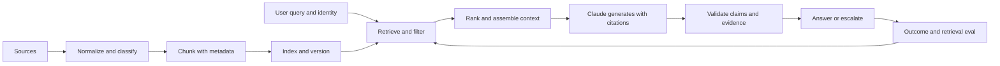

# RAG, Retrieval, and Data Pipelines | RAG、检索与数据管道

> A grounded answer is only as trustworthy as the evidence that reached the model.

> **【中文解读】** 本课的核心命题：有据回答（grounded answer）的可信度上限，就是送达模型的证据的可信度。开篇事故要背下来：政策助手运行数月后，一次文档刷新让它开始基于旧退款阈值给出自信回答——模型版本、提示词、延迟都没变；团队往提示词里加"用最新政策"毫无效果，因为模型无法遵循它从未收到的证据：索引里新旧版本并存、缺元数据过滤、检索器因为旧块措辞更贴近查询而把它排在前面。这是检索事故，不是模型事故。全课依次覆盖：RAG 作为数据系统、按语义与检索设计分块、五种检索模式匹配、检索评估与答案评估分离、溯源作为数据、原子化可观察的刷新。

> **【拓展：RAG 的系统观→认证与后续课程】** 本课把 RAG 从"接一个向量库"升级为数据系统治理问题：新鲜度、权限、溯源都靠元数据与版本化落地，正对应 Claude 平台的 citations 能力，也对应架构师考试"先查摄取/索引/过滤/检索、再考虑换模型"的决策模式。它与第 23 课的端到端回路直接衔接——检索是"组装可信上下文"一环的展开；Phase 11 第 06、07 课从第一性原理构建 RAG 与高级检索，Phase 19 第 65 课做混合稀疏-稠密检索，本课给出它们的架构视角。

> 🔗 **【前置】** 学本课前请先掌握：(1) 第 23 课"端到端架构与价值权衡"——检索是回路中"组装可信上下文"一环的展开，本课的失败诊断也沿用"找最早失败边界"的方法；(2) Phase 11 第 06、07 课——从零实现 RAG 管道与高级检索（分块、重排序、混合搜索）；(3) Phase 5 第 23 课——RAG 分块策略。

**Type:** Build | **类型:** 动手构建
**Languages:** Python | **语言:** Python
**Prerequisites:** [End-to-End Architecture and Value Tradeoffs](../../23-end-to-end-architecture-and-value-tradeoffs/); Phase 11, Lessons 06 and 07; Phase 5, Lesson 23 | **前置知识:** 第 23 课（端到端架构与价值权衡）、Phase 11 第 06、07 课、Phase 5 第 23 课
**Time:** ~150 minutes | **时间:** 约 150 分钟

## Learning Objectives | 学习目标

- Design ingestion, chunking, indexing, retrieval, generation, and citation boundaries
  中文翻译：设计摄取、分块、索引、检索、生成与引用的边界。
- Match sparse, dense, hybrid, filtered, and iterative retrieval to the data shape
  中文翻译：把稀疏、稠密、混合、过滤与迭代式检索匹配到数据形态上。
- Diagnose retrieval failures before changing the model or prompt
  中文翻译：在更换模型或改提示词之前先诊断检索失败。
- Measure retrieval quality separately from answer quality
  中文翻译：把检索质量与答案质量分开度量。
- Preserve freshness, access control, and provenance through the pipeline
  中文翻译：让新鲜度、访问控制与溯源贯穿整条管道。

## The Problem | 问题引入

> **【中文解读】** "模型没变、答案变了"是检索事故的标志性指纹。三层原因链要能复述：(1) 提示词修不好缺失的证据——"用最新政策"这条指令对从未进入上下文的证据无效；(2) 索引里新旧版本并存且没有元数据过滤，等于把过期数据合法化；(3) 排序按相似度而非权威性——旧块措辞更贴近查询就排第一。定性错误（当模型事故处理）不仅浪费时间，还会掩盖真正的控制失效。

A policy assistant works for months. After a document refresh, it begins giving
confident answers based on an old refund threshold. Model version, prompt, and
latency have not changed.

> 一个政策助手正常运行数月。一次文档刷新之后，它开始基于旧的退款阈值给出自信的回答。模型版本、提示词和延迟都没有变。

The team adds "use the latest policy" to the prompt. Nothing improves. The
model cannot follow evidence it never received. The index contains both policy
versions, metadata filters are missing, and the retriever ranks the obsolete
chunk first because its wording matches the query more closely.

> 团队在提示词里加上"使用最新政策"。毫无改善。模型无法遵循它从未收到的证据。索引里同时存在两个政策版本，元数据过滤器缺失，而检索器把过时的块排在第一位，只因为它的措辞与查询更贴近。

This is a retrieval incident. Treating it as a model incident wastes time and
can hide the real control failure.

> 这是一起检索事故。把它当模型事故处理会浪费时间，还可能掩盖真正的控制失效。

## The Concept | 核心概念

### RAG Is a Data System | RAG 是一个数据系统

> **【中文解读】** 把 RAG 当数据系统看：左侧是数据管道（来源→规范化与分类→带元数据分块→索引与版本化），右侧是查询路径（用户查询与身份→检索与过滤→排序与上下文组装→Claude 带引用生成→校验论断与证据→回答或上报），结果再回流到检索评估。八条系统级失败原因覆盖从摄取到生成的全链路——模型可以很优秀而系统照样失败。诊断纪律一句话：找最早失败的那层边界，别一上来就换模型。

Retrieval-augmented generation has two connected systems with different failure
modes.

> 检索增强生成（RAG）是两个相连但失败模式不同的系统。



The model can be excellent while the system fails because:

> 模型可以很优秀，而系统照样失败，原因可能是：

- the source was never ingested
  中文翻译：来源从未被摄取。
- parsing dropped the relevant table
  中文翻译：解析丢掉了相关的表格。
- chunking split a condition from its exception
  中文翻译：分块把条件与它的例外切开了。
- the index used stale or incompatible representations
  中文翻译：索引使用了过期或不兼容的表示。
- filters ignored tenant, jurisdiction, date, or permission
  中文翻译：过滤器忽略了租户、辖区、日期或权限。
- ranking favored a keyword match over the authoritative source
  中文翻译：排序偏向关键词匹配而非权威来源。
- context assembly truncated the best evidence
  中文翻译：上下文组装截断了最好的证据。
- generation cited one chunk while claiming more than it supports
  中文翻译：生成只引用了一个块，却断言了超出它支撑范围的内容。

Diagnose the earliest failing boundary.

> 诊断最早失败的那层边界。

### Design Chunks Around Meaning and Retrieval | 围绕语义与检索设计分块

> **【中文解读】** 分块准则一句话：保留"一个人会引用的单位"——政策按标题段落、API 文档按方法签名+参数+错误、表格按表头+行组、工单带会话上下文、代码按函数与类。重叠不是免费的好东西：它复制证据、增大索引、可能让近重复文本挤占上下文，必须度量。七项块元数据（稳定 ID、来源标识、版本与生效日期、租户/辖区/产品/内容类型、访问控制属性、摄取与解析器版本、父标题与位置）是本课的治理支点——金句：有了元数据，检索才从"仅仅相似"升级为"受治理"。

Fixed token chunks are a baseline, not a universal answer. Chunk shape should
preserve the unit a person would cite.

> 固定 token 数的分块只是基线，不是万能答案。块的形状应当保留"一个人会引用的那个单位"。

For prose policies, headings and paragraphs often provide useful boundaries.
For API documentation, keep a method signature with parameters and errors. For
tables, preserve headers with each row group. For tickets, one message may need
conversation context. For source code, functions and classes are better than
arbitrary character windows.

> 散文式政策常用标题与段落作边界。API 文档要把方法签名连同参数与错误放在一起。表格要把表头随每组行保留。工单里一条消息可能需要会话上下文。源代码用函数与类比任意字符窗口更好。

Overlap helps when a fact crosses a boundary, but it also duplicates evidence,
increases index size, and can crowd the final context with near-identical text.
Measure it.

> 重叠在事实跨越边界时有帮助，但它也复制证据、增大索引，并可能让近重复文本挤占最终上下文。要度量它。

Every chunk needs metadata:

> 每个块都需要元数据：

- stable document and chunk identifiers
  中文翻译：稳定的文档与块标识符。
- source URI or system-of-record identifier
  中文翻译：来源 URI 或记录系统标识符。
- version and effective date
  中文翻译：版本与生效日期。
- tenant, jurisdiction, product, or content type
  中文翻译：租户、辖区、产品或内容类型。
- access-control attributes
  中文翻译：访问控制属性。
- ingestion and parser version
  中文翻译：摄取与解析器版本。
- parent heading and position
  中文翻译：父标题与位置。

Metadata is how retrieval becomes governed rather than merely similar.

> 元数据是让检索从"仅仅相似"变成"受治理"的手段。

### Match Retrieval to Query and Data Shape | 让检索匹配查询与数据形态

> **【中文解读】** 五种检索模式按查询与数据形态选择：稀疏（BM25 式词项匹配）对标识符、产品名、错误码、政策措辞很强，便宜且可解释；稠密（嵌入语义相似）在用户换说法、查询与来源用词不一致时有用，但可能漏掉精确标识符、可能检索出语义相关却不权威的文本；混合（稀疏+稠密候选融合或重排）对自然语言与标识符混合的查询通常最好；过滤——在证据到达模型之前用可信元数据与授权过滤，不许让 Claude"忽略"用户无权看的块，禁止数据根本不该进上下文；迭代——Agent 改写查询、跟进引用、发现缺失证据，只在发现确实需要自适应时用，并设查询/轮次/时间/成本预算，稳定的问答管道默认不为 Agent 复杂度付费。

#### Sparse Retrieval | 稀疏检索

BM25-style retrieval matches explicit terms. It is strong for identifiers,
product names, error codes, and policy phrases. It is cheap and explainable.

> BM25 式检索匹配显式词项。它对标识符、产品名、错误码和政策措辞很强。它便宜且可解释。

#### Dense Retrieval | 稠密检索

Embeddings match semantic similarity. They help when users paraphrase a concept
or vocabulary differs between query and source. They can miss exact identifiers
and can retrieve semantically related but non-authoritative text.

> 嵌入匹配语义相似度。当用户换个说法表达概念、或查询与来源用词不一致时它们有用。它们可能漏掉精确标识符，也可能检索出语义相关却不权威的文本。

#### Hybrid Retrieval | 混合检索

Combine sparse and dense candidates, then fuse or rerank. Hybrid retrieval often
handles mixed natural-language and identifier queries better than either alone.

> 合并稀疏与稠密候选，再融合或重排。混合检索处理自然语言与标识符混合的查询时，通常比单独任一种更好。

#### Filtered Retrieval | 过滤检索

Apply trusted metadata and authorization before evidence reaches the model. Do
not ask Claude to ignore chunks the user is not allowed to see. The forbidden
data should not enter context.

> 在证据到达模型之前施加可信元数据与授权。不要让 Claude 去"忽略"用户无权查看的块。被禁止的数据根本不应进入上下文。

#### Iterative Retrieval | 迭代检索

An agent can reformulate queries, follow references, or identify missing
evidence. Use this when discovery is genuinely adaptive. Set query, turn, time,
and cost budgets. Stable question-answering pipelines should not pay agentic
complexity by default.

> Agent 可以改写查询、跟进引用或识别缺失证据。当发现过程确实需要自适应时使用它。设查询、轮次、时间与成本预算。稳定的问答管道默认不应为 Agent 复杂度付费。

### Separate Retrieval Evaluation From Answer Evaluation | 把检索评估与答案评估分开

> **【中文解读】** 评估分层的原因一句话：如果正确证据不在候选集里，答案质量就有天花板——所以先测检索。检索侧六个度量：K 处召回率、K 处精确率、平均倒数排名（MRR）、nDCG、新鲜度覆盖、授权泄漏。生成侧五个：引用证据对论断的支撑、引用正确性与完整性、答案完整性、证据不足时弃答、跨来源冲突检测。单一端到端分数无法告诉你修哪一层。

If the correct evidence is absent from the top candidates, answer quality has a
ceiling. Measure retrieval first.

> 如果正确证据不在头部候选里，答案质量就有天花板。先测检索。

Useful measures include:

> 有用的度量包括：

- recall at K: did the candidate set contain the required source?
  中文翻译：K 处召回率：候选集里是否包含必需的来源？
- precision at K: how much of the candidate set was relevant?
  中文翻译：K 处精确率：候选集里有多大比例相关？
- mean reciprocal rank: how early did the first relevant source appear?
  中文翻译：平均倒数排名（MRR）：第一个相关来源出现得多早？
- nDCG: did the ranking place highly relevant sources first?
  中文翻译：nDCG：排序是否把高度相关的来源放在前面？
- freshness coverage: did results use the active version?
  中文翻译：新鲜度覆盖：结果是否使用了现行版本？
- authorization leakage: did any result violate the caller's access?
  中文翻译：授权泄漏：是否有结果违反了调用方的访问权限？

Then evaluate generation:

> 然后评估生成：

- claim support by cited evidence
  中文翻译：被引证据对论断的支撑。
- citation correctness and completeness
  中文翻译：引用的正确性与完整性。
- answer completeness
  中文翻译：答案完整性。
- abstention when evidence is insufficient
  中文翻译：证据不足时弃答。
- conflict detection across sources
  中文翻译：跨来源的冲突检测。

A single end-to-end score cannot tell you which layer to repair.

> 单一的端到端分数无法告诉你该修哪一层。

### Preserve Provenance as Data | 把溯源保存为数据

Do not let provenance exist only as prose generated after the answer. Carry
source identifiers through retrieval, context assembly, output schema, and logs.

> 不要让溯源只以答案后面生成的散文形式存在。让来源标识符贯穿检索、上下文组装、输出 schema 和日志。

For each claim, retain:

> 对每条论断，保留：

- source document and chunk identifier
  中文翻译：来源文档与块标识符。
- source version and effective date
  中文翻译：来源版本与生效日期。
- exact supporting span
  中文翻译：精确的支撑片段。
- retrieval score and rank
  中文翻译：检索得分与排名。
- transformation or summarization steps
  中文翻译：转换或摘要步骤。

If sources conflict, report the conflict. Do not silently choose the most recent
date unless the domain has an explicit precedence rule.

> 如果来源相互冲突，报告冲突。除非领域有显式的优先级规则，否则不要默默选择最新日期。

### Make Refresh Atomic and Observable | 让刷新原子化且可观察

A document refresh can create a mixed index where old and new chunks coexist.
Safer patterns build a new version, validate it, then switch an alias or pointer
atomically. Keep rollback until the new index passes retrieval and freshness
checks.

> 文档刷新可能造出新旧块并存的混合索引。更安全的模式是构建新版本、验证它、然后原子地切换别名或指针。在新索引通过检索与新鲜度检查之前保留回滚。

Monitor:

> 监控：

- ingestion success and lag
  中文翻译：摄取成功率与滞后。
- parsed content count and size
  中文翻译：解析出的内容数量与大小。
- active version by source
  中文翻译：每个来源的现行版本。
- embedding or index version
  中文翻译：嵌入或索引版本。
- empty-result and low-score rates
  中文翻译：空结果率与低分率。
- retrieval distribution shifts
  中文翻译：检索分布漂移。
- top failed evaluation queries
  中文翻译：失败最多的评估查询。

## Build It | 动手构建

## Interactive Lab | 交互实验室

```figure
24-rag-ranking
```

Use the ranking lab to compare lexical matches, metadata filters, stale-source
exclusion, and top-K behavior before editing code. The visible ranks connect a
retrieval decision to recall, reciprocal rank, freshness, and provenance.

> 在改代码之前，用排序实验室比较词法匹配、元数据过滤、过期来源排除与 top-K 行为。可见的排名把一个检索决策与召回率、倒数排名、新鲜度和溯源联系起来。

## Practice Lab | 练习实验室

Add a stale or unauthorized document to a copy of the fixture and prove that it
cannot enter the candidate set before generation.

> 向 fixture 副本添加一份过期或未授权的文档，并证明它在生成之前无法进入候选集。

## Shipped Artifact | 交付产物

[`outputs/retrieval-evidence-report.json`](../outputs/retrieval-evidence-report.json)
is a filled baseline containing ranked chunk identities, active source versions,
and retrieval metrics.

> `outputs/retrieval-evidence-report.json` 是一份填好的基线，包含排好序的块标识、现行来源版本和检索指标。

## Verify It | 验证

Reproduce and verify it with:

> 复现并验证它：

```bash
cd certifications/claude/lessons/24-rag-retrieval-and-data-pipelines/code
python3 main.py
python3 -m unittest discover tests -v
```

The six-question quiz checks diagnosis and retrieval selection.

> 六题测验检查诊断与检索选择。

## Capstone Connection | 毕业设计衔接

Carry the evidence report into the Architect Professional capstone's RAG
evaluation and freshness gates.

> 把证据报告带进架构师专业级毕业设计的 RAG 评估与新鲜度门。

The lab implements a small BM25-style index in the Python standard library. It
is intentionally transparent. Production search systems are faster and more
capable, but the scoring and metadata boundaries should stop feeling magical.

> 本实验室用 Python 标准库实现了一个小型 BM25 式索引。它刻意保持透明。生产级搜索系统更快更强，但打分与元数据边界不应再显得神秘。

Run it:

> 运行它：

```bash
cd certifications/claude/lessons/24-rag-retrieval-and-data-pipelines/code
python3 main.py
python3 -m unittest discover tests -v
```

### Step 1: Normalize Tokens | 第一步：规范化词元

`tokenize` lowercases text and extracts alphanumeric terms. Production pipelines
need language-aware tokenization, field handling, and parser tests. The lesson
keeps only the ranking concept.

> `tokenize` 把文本转小写并抽取字母数字词元。生产管道需要语言感知的分词、字段处理和解析器测试。本课只保留排序概念。

### Step 2: Chunk With Stable Identity | 第二步：带稳定身份分块

`chunk_document` creates overlapping word windows while retaining document ID,
position, update time, and a stable chunk ID. Invalid overlap fails early rather
than creating an infinite loop.

> `chunk_document` 创建带重叠的词窗口，同时保留文档 ID、位置、更新时间和稳定的块 ID。非法的重叠参数会尽早失败，而不是造成死循环。

### Step 3: Exclude Inactive Sources Before Indexing | 第三步：索引前排除非活跃来源

`RetrievalIndex.build` ignores inactive document versions. This is a simplified
freshness gate. In production, activation should be tied to a validated index
version and atomic switch.

> `RetrievalIndex.build` 忽略非活跃的文档版本。这是一个简化版新鲜度门。生产环境中，激活应绑定到经过验证的索引版本和原子切换。

### Step 4: Score Transparently | 第四步：透明打分

The index computes term frequency, document frequency, length normalization,
and an inverse-document-frequency score. Exact query terms can raise the source
that actually contains the active policy language.

> 索引计算词频、文档频率、长度归一化和逆文档频率得分。精确的查询词项能把真正包含现行政策措辞的来源顶上去。

### Step 5: Return Provenance | 第五步：返回溯源

Every `RetrievalHit` carries document ID, chunk ID, update date, text, and score.
The generation layer should consume this structured evidence and return claim
links to it.

> 每个 `RetrievalHit` 都带文档 ID、块 ID、更新日期、文本和得分。生成层应消费这份结构化证据并返回指向它的论断链接。

### Step 6: Evaluate the Retriever | 第六步：评估检索器

`evaluate_retrieval` calculates recall at K and mean reciprocal rank against
labeled cases. Add normal, ambiguous, stale-version, permission, and adversarial
queries before changing ranking.

> `evaluate_retrieval` 对照标注用例计算 K 处召回率与平均倒数排名。在改排序之前，加入正常、歧义、过期版本、权限与对抗性查询。

## Use It | 运行验证

> **【中文解读】** 政策事故的八步处置是本课的收束，也是考试题眼：复现查询并检查检索到的块 ID → 确认索引中哪些来源版本活跃 → 检查阈值与例外附近的解析与分块边界 → 核验身份与元数据过滤 → 比较稀疏/稠密/混合候选集 → 修复前后各跑一次冻结的检索评估 → 原子切换已验证索引并保留回滚 → 在生成层重跑论断支撑评估。红线一句：不要先改 temperature 或模型大小——两者都救不回缺失或被禁止的证据。

Production systems usually combine a document parser, object storage, sparse or
vector index, metadata filters, reranker, and an evaluation pipeline. Keep the
same contracts even when managed services hide the implementation.

> 生产系统通常组合文档解析器、对象存储、稀疏或向量索引、元数据过滤器、重排器和评估管道。即使托管服务隐藏了实现，也要保持同样的契约。

For the policy incident:

> 对这起政策事故：

1. Reproduce the query and inspect the retrieved chunk IDs.
   中文翻译：复现查询并检查检索到的块 ID。
2. Confirm which source versions are active in the index.
   中文翻译：确认索引中哪些来源版本处于活跃状态。
3. Check parsing and chunk boundaries around the threshold and exception.
   中文翻译：检查阈值与例外附近的解析与分块边界。
4. Verify identity and metadata filters.
   中文翻译：核验身份与元数据过滤器。
5. Compare sparse, dense, and hybrid candidate sets.
   中文翻译：比较稀疏、稠密与混合候选集。
6. Run the frozen retrieval evaluation before and after the repair.
   中文翻译：在修复前后各运行一次冻结的检索评估。
7. Switch the validated index atomically and retain rollback.
   中文翻译：原子切换已验证的索引并保留回滚。
8. Re-run claim-support evaluation at the generation layer.
   中文翻译：在生成层重跑论断支撑评估。

Do not start by changing temperature or model size. Neither can recover missing
or forbidden evidence.

> 不要一开始就改 temperature 或模型大小。两者都救不回缺失或被禁止的证据。

## Exam Decision Patterns | 考试决策模式

When answers became wrong immediately after a document refresh while model and
latency stayed stable, investigate ingestion, indexing, filtering, and retrieval
first.

> 当答案在文档刷新之后立刻变错、而模型与延迟保持稳定时，先调查摄取、索引、过滤与检索。

Strong architecture choices:

> 强的架构选择：

- match retrieval to exact identifiers and semantic paraphrases
  中文翻译：让检索同时匹配精确标识符与语义转述。
- filter by identity and metadata before generation
  中文翻译：在生成之前按身份与元数据过滤。
- version sources and indexes
  中文翻译：为来源与索引做版本化。
- evaluate retrieval separately from final answers
  中文翻译：把检索与最终答案分开评估。
- carry provenance through the output contract
  中文翻译：让溯源贯穿输出契约。
- represent insufficient or conflicting evidence explicitly
  中文翻译：显式表达证据不足或相互冲突。

Weak choices:

> 弱的选择：

- tell the model to remember the latest document
  中文翻译：告诉模型记住最新文档。
- increase context with every source
  中文翻译：把每个来源都塞进上下文。
- replace the model before inspecting candidates
  中文翻译：还没查看候选集就换模型。
- rely on generated citations without source identifiers
  中文翻译：依赖没有来源标识符的生成式引用。

## Common Traps | 常见陷阱

> **【中文解读】** 四个陷阱对应四句反直觉结论：更多上下文不等于更接地气——无关上下文会争夺注意力、淹没最好的证据，更好的检索与排序常常胜过更大的上下文载荷；相似不等于权威——语义相似度不编码政策优先级、权限与生效日期，这些要靠元数据与规则；有效引用不等于支撑论断——引用可以指向一个真实却不支撑整条论断的来源，要评估蕴含与覆盖，而不只是链接有效性；刷新不等于追加——只追加新块不停用旧版本会制造矛盾证据，把刷新当版本化部署来做。

### More Context Means More Grounding | 上下文越多越接地气

Irrelevant context competes for attention and can hide the best evidence. Better
retrieval and ordering often beat a larger context payload.

> 无关上下文会争夺注意力，可能淹没最好的证据。更好的检索与排序常常胜过更大的上下文载荷。

### Similar Means Authoritative | 相似即权威

Semantic similarity does not encode policy precedence, permissions, or effective
date. Those need metadata and rules.

> 语义相似度不编码政策优先级、权限或生效日期。这些需要元数据与规则。

### Valid Citation Means Supported Claim | 有效引用即支撑论断

A citation can point to a real source that does not support the whole claim.
Evaluate entailment and coverage, not only link validity.

> 一条引用可以指向一个真实存在、却不支撑整条论断的来源。要评估蕴含与覆盖，而不只是链接有效性。

### Refresh Means Append | 刷新即追加

Appending new chunks without deactivating old versions creates contradictory
evidence. Treat refresh as a versioned deployment.

> 只追加新块而不停用旧版本会制造矛盾证据。把刷新当作一次版本化部署。

## Exercises | 练习

1. Add field-aware boosting so title matches score more than body matches.
   中文翻译：加入字段感知加权，让标题匹配比正文匹配得分更高。
2. Add a jurisdiction filter and a test proving unauthorized chunks never
   appear in candidates.
   中文翻译：加一个辖区过滤器，并写一个证明未授权块从不进入候选集的测试。
3. Build a hybrid rank-fusion function over two ranked lists.
   中文翻译：在两个已排序列表之上构建混合排序融合函数。
4. Create ten retrieval cases where exact identifiers and paraphrases require
   different strategies.
   中文翻译：构造十个"精确标识符与语义转述需要不同策略"的检索用例。
5. Design an atomic index-refresh checklist with validation and rollback.
   中文翻译：设计一份带验证与回滚的原子索引刷新清单。

## Key Terms | 关键术语

| Term | What people say | What it actually means |
|------|-----------------|------------------------|
| Chunk | A fixed number of tokens | A retrievable, citable unit with identity and metadata |
| Sparse retrieval | Old keyword search | Term-based ranking that excels at exact vocabulary and identifiers |
| Dense retrieval | Semantic truth | Similarity in embedding space, not authority or factual support |
| Hybrid retrieval | Two databases | Candidate fusion that combines exact and semantic signals |
| Recall at K | Answer accuracy | Whether required evidence appears among the top K retrieved items |
| Provenance | A generated footnote | Structured lineage carried from source through claim |

## Further Reading | 延伸阅读

- [Claude citations documentation](https://platform.claude.com/docs/en/build-with-claude/citations) for current citation support
  中文翻译：Claude 引用（citations）文档——当前的引用支持
- [Claude token counting documentation](https://platform.claude.com/docs/en/build-with-claude/token-counting) for context budgeting
  中文翻译：Claude token 计数文档——上下文预算
- Phase 11, Lesson 06 for a RAG pipeline from first principles
  中文翻译：Phase 11 第 06 课——从第一性原理构建 RAG 管道
- Phase 11, Lesson 07 for advanced retrieval and reranking
  中文翻译：Phase 11 第 07 课——高级检索与重排序
- Phase 19, Lesson 65 for hybrid sparse and dense retrieval
  中文翻译：Phase 19 第 65 课——混合稀疏与稠密检索
