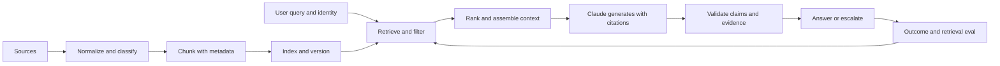

# RAG、检索与数据管道

> 有据回答的可信度，上限就是送达模型的那份证据的可信度。

> **【中文解读】** 本课的核心命题：有据回答（grounded answer）的可信度上限，就是送达模型的证据的可信度。开篇事故要背下来：政策助手运行数月后，一次文档刷新让它开始基于旧退款阈值给出自信回答——模型版本、提示词、延迟都没变；团队往提示词里加"用最新政策"毫无效果，因为模型无法遵循它从未收到的证据：索引里新旧版本并存、缺元数据过滤、检索器因为旧块措辞更贴近查询而把它排在前面。这是检索事故，不是模型事故。全课依次覆盖：RAG 作为数据系统、按语义与检索设计分块、五种检索模式匹配、检索评估与答案评估分离、溯源作为数据、原子化可观察的刷新。

> **【拓展：RAG 的系统观→认证与后续课程】** 本课把 RAG 从"接一个向量库"升级为数据系统治理问题：新鲜度、权限、溯源都靠元数据与版本化落地，正对应 Claude 平台的 citations 能力，也对应架构师考试"先查摄取/索引/过滤/检索、再考虑换模型"的决策模式。它与第 23 课的端到端回路直接衔接——检索是"组装可信上下文"一环的展开；Phase 11 第 06、07 课从第一性原理构建 RAG 与高级检索，Phase 19 第 65 课做混合稀疏-稠密检索，本课给出它们的架构视角。

> 🔗 **【前置】** 学本课前请先掌握：(1) 第 23 课"端到端架构与价值权衡"——检索是回路中"组装可信上下文"一环的展开，本课的失败诊断也沿用"找最早失败边界"的方法；(2) Phase 11 第 06、07 课——从零实现 RAG 管道与高级检索（分块、重排序、混合搜索）；(3) Phase 5 第 23 课——RAG 分块策略。

**类型：** 动手构建
**语言：** Python
**前置条件：** 第 23 课（端到端架构与价值权衡）、Phase 11 第 06、07 课、Phase 5 第 23 课
**预计用时：** 约 150 分钟

## 学习目标

- 设计摄取、分块、索引、检索、生成与引用的边界。
- 把稀疏、稠密、混合、过滤与迭代式检索匹配到数据形态上。
- 在更换模型或改提示词之前先诊断检索失败。
- 把检索质量与答案质量分开度量。
- 让新鲜度、访问控制与溯源贯穿整条管道。

## 问题引入

> **【中文解读】** "模型没变、答案变了"是检索事故的标志性指纹。三层原因链要能复述：提示词修不好缺失的证据；索引里新旧版本并存且没有元数据过滤；排序按相似度而非权威性。定性错误（当模型事故处理）不仅浪费时间，还会掩盖真正的控制失效。

一个政策助手正常运行数月。一次文档刷新之后，它开始基于旧的退款阈值给出自信的回答。模型版本、提示词和延迟都没有变。

团队在提示词里加上"使用最新政策"。毫无改善。模型无法遵循它从未收到的证据。索引里同时存在两个政策版本，元数据过滤器缺失，而检索器把过时的块排在第一位，只因为它的措辞与查询更贴近。

这是一起检索事故。把它当模型事故处理会浪费时间，还可能掩盖真正的控制失效。

## 核心概念

### RAG 是一个数据系统

> **【中文解读】** 把 RAG 当数据系统看：左侧是数据管道，右侧是查询路径，结果再回流到检索评估。八条系统级失败原因覆盖从摄取到生成的全链路——模型可以很优秀而系统照样失败。诊断纪律一句话：找最早失败的那层边界，别一上来就换模型。

检索增强生成（RAG）是两个相连但失败模式不同的系统。



模型可以很优秀，而系统照样失败，原因可能是：

- 来源从未被摄取。
- 解析丢掉了相关的表格。
- 分块把条件与它的例外切开了。
- 索引使用了过期或不兼容的表示。
- 过滤器忽略了租户、辖区、日期或权限。
- 排序偏向关键词匹配而非权威来源。
- 上下文组装截断了最好的证据。
- 生成只引用了一个块，却断言了超出它支撑范围的内容。

诊断最早失败的那层边界。

### 围绕语义与检索设计分块

> **【中文解读】** 分块准则一句话：保留"一个人会引用的单位"。重叠不是免费的好东西：它复制证据、增大索引、可能让近重复文本挤占上下文，必须度量。七项块元数据是本课的治理支点——金句：有了元数据，检索才从"仅仅相似"升级为"受治理"。

固定 token 数的分块只是基线，不是万能答案。块的形状应当保留"一个人会引用的那个单位"。

散文式政策常用标题与段落作边界。API 文档要把方法签名连同参数与错误放在一起。表格要把表头随每组行保留。工单里一条消息可能需要会话上下文。源代码用函数与类比任意字符窗口更好。

重叠在事实跨越边界时有帮助，但它也复制证据、增大索引，并可能让近重复文本挤占最终上下文。要度量它。

每个块都需要元数据：

- 稳定的文档与块标识符。
- 来源 URI 或记录系统标识符。
- 版本与生效日期。
- 租户、辖区、产品或内容类型。
- 访问控制属性。
- 摄取与解析器版本。
- 父标题与位置。

元数据是让检索从"仅仅相似"变成"受治理"的手段。

### 让检索匹配查询与数据形态

> **【中文解读】** 五种检索模式按查询与数据形态选择：稀疏、稠密、混合、过滤、迭代。其中过滤检索的红线要背：不要让 Claude"忽略"用户无权看的块——被禁止的数据根本不应进入上下文；迭代检索的红线：稳定的问答管道默认不为 Agent 复杂度付费。

#### 稀疏检索

BM25 式检索匹配显式词项。它对标识符、产品名、错误码和政策措辞很强。它便宜且可解释。

#### 稠密检索

嵌入匹配语义相似度。当用户换个说法表达概念、或查询与来源用词不一致时它们有用。它们可能漏掉精确标识符，也可能检索出语义相关却不权威的文本。

#### 混合检索

合并稀疏与稠密候选，再融合或重排。混合检索处理自然语言与标识符混合的查询时，通常比单独任一种更好。

#### 过滤检索

在证据到达模型之前施加可信元数据与授权。不要让 Claude 去"忽略"用户无权查看的块。被禁止的数据根本不应进入上下文。

#### 迭代检索

Agent 可以改写查询、跟进引用或识别缺失证据。当发现过程确实需要自适应时使用它。设查询、轮次、时间与成本预算。稳定的问答管道默认不应为 Agent 复杂度付费。

### 把检索评估与答案评估分开

> **【中文解读】** 评估分层的原因一句话：如果正确证据不在候选集里，答案质量就有天花板——所以先测检索。检索侧六个度量：K 处召回率、K 处精确率、平均倒数排名（MRR）、nDCG、新鲜度覆盖、授权泄漏。生成侧五个：引用证据对论断的支撑、引用正确性与完整性、答案完整性、证据不足时弃答、跨来源冲突检测。单一端到端分数无法告诉你修哪一层。

如果正确证据不在头部候选里，答案质量就有天花板。先测检索。

有用的度量包括：

- K 处召回率：候选集里是否包含必需的来源？
- K 处精确率：候选集里有多大比例相关？
- 平均倒数排名（MRR）：第一个相关来源出现得多早？
- nDCG：排序是否把高度相关的来源放在前面？
- 新鲜度覆盖：结果是否使用了现行版本？
- 授权泄漏：是否有结果违反了调用方的访问权限？

然后评估生成：

- 被引证据对论断的支撑。
- 引用的正确性与完整性。
- 答案完整性。
- 证据不足时弃答。
- 跨来源的冲突检测。

单一的端到端分数无法告诉你该修哪一层。

### 把溯源保存为数据

不要让溯源只以答案后面生成的散文形式存在。让来源标识符贯穿检索、上下文组装、输出 schema 和日志。

对每条论断，保留：

- 来源文档与块标识符。
- 来源版本与生效日期。
- 精确的支撑片段。
- 检索得分与排名。
- 转换或摘要步骤。

如果来源相互冲突，报告冲突。除非领域有显式的优先级规则，否则不要默默选择最新日期。

### 让刷新原子化且可观察

文档刷新可能造出新旧块并存的混合索引。更安全的模式是构建新版本、验证它、然后原子地切换别名或指针。在新索引通过检索与新鲜度检查之前保留回滚。

监控：

- 摄取成功率与滞后。
- 解析出的内容数量与大小。
- 每个来源的现行版本。
- 嵌入或索引版本。
- 空结果率与低分率。
- 检索分布漂移。
- 失败最多的评估查询。

## 动手构建

## 交互实验室

```figure
24-rag-ranking
```

在改代码之前，用排序实验室比较词法匹配、元数据过滤、过期来源排除与 top-K 行为。可见的排名把一个检索决策与召回率、倒数排名、新鲜度和溯源联系起来。

## 练习实验室

向 fixture 副本添加一份过期或未授权的文档，并证明它在生成之前无法进入候选集。

## 交付产物

[`outputs/retrieval-evidence-report.json`](../outputs/retrieval-evidence-report.json) 是一份填好的基线，包含排好序的块标识、现行来源版本和检索指标。

## 验证

复现并验证它：

```bash
cd certifications/claude/lessons/24-rag-retrieval-and-data-pipelines/code
python3 main.py
python3 -m unittest discover tests -v
```

六题测验检查诊断与检索选择。

## 毕业设计衔接

把证据报告带进架构师专业级毕业设计的 RAG 评估与新鲜度门。

本实验室用 Python 标准库实现了一个小型 BM25 式索引。它刻意保持透明。生产级搜索系统更快更强，但打分与元数据边界不应再显得神秘。

运行它：

```bash
cd certifications/claude/lessons/24-rag-retrieval-and-data-pipelines/code
python3 main.py
python3 -m unittest discover tests -v
```

### 第一步：规范化词元

`tokenize` 把文本转小写并抽取字母数字词元。生产管道需要语言感知的分词、字段处理和解析器测试。本课只保留排序概念。

### 第二步：带稳定身份分块

`chunk_document` 创建带重叠的词窗口，同时保留文档 ID、位置、更新时间和稳定的块 ID。非法的重叠参数会尽早失败，而不是造成死循环。

### 第三步：索引前排除非活跃来源

`RetrievalIndex.build` 忽略非活跃的文档版本。这是一个简化版新鲜度门。生产环境中，激活应绑定到经过验证的索引版本和原子切换。

### 第四步：透明打分

索引计算词频、文档频率、长度归一化和逆文档频率得分。精确的查询词项能把真正包含现行政策措辞的来源顶上去。

### 第五步：返回溯源

每个 `RetrievalHit` 都带文档 ID、块 ID、更新日期、文本和得分。生成层应消费这份结构化证据并返回指向它的论断链接。

### 第六步：评估检索器

`evaluate_retrieval` 对照标注用例计算 K 处召回率与平均倒数排名。在改排序之前，加入正常、歧义、过期版本、权限与对抗性查询。

## 运行验证

> **【中文解读】** 政策事故的八步处置是本课的收束，也是考试题眼。红线一句：不要先改 temperature 或模型大小——两者都救不回缺失或被禁止的证据。

生产系统通常组合文档解析器、对象存储、稀疏或向量索引、元数据过滤器、重排器和评估管道。即使托管服务隐藏了实现，也要保持同样的契约。

对这起政策事故：

1. 复现查询并检查检索到的块 ID。
2. 确认索引中哪些来源版本处于活跃状态。
3. 检查阈值与例外附近的解析与分块边界。
4. 核验身份与元数据过滤器。
5. 比较稀疏、稠密与混合候选集。
6. 在修复前后各运行一次冻结的检索评估。
7. 原子切换已验证的索引并保留回滚。
8. 在生成层重跑论断支撑评估。

不要一开始就改 temperature 或模型大小。两者都救不回缺失或被禁止的证据。

## 考试决策模式

当答案在文档刷新之后立刻变错、而模型与延迟保持稳定时，先调查摄取、索引、过滤与检索。

强的架构选择：

- 让检索同时匹配精确标识符与语义转述。
- 在生成之前按身份与元数据过滤。
- 为来源与索引做版本化。
- 把检索与最终答案分开评估。
- 让溯源贯穿输出契约。
- 显式表达证据不足或相互冲突。

弱的选择：

- 告诉模型记住最新文档。
- 把每个来源都塞进上下文。
- 还没查看候选集就换模型。
- 依赖没有来源标识符的生成式引用。

## 常见陷阱

> **【中文解读】** 四个陷阱对应四句反直觉结论：更多上下文不等于更接地气；相似不等于权威；有效引用不等于支撑论断；刷新不等于追加——把刷新当版本化部署来做。

### 上下文越多越接地气

无关上下文会争夺注意力，可能淹没最好的证据。更好的检索与排序常常胜过更大的上下文载荷。

### 相似即权威

语义相似度不编码政策优先级、权限或生效日期。这些需要元数据与规则。

### 有效引用即支撑论断

一条引用可以指向一个真实存在、却不支撑整条论断的来源。要评估蕴含与覆盖，而不只是链接有效性。

### 刷新即追加

只追加新块而不停用旧版本会制造矛盾证据。把刷新当作一次版本化部署。

## 练习

1. 加入字段感知加权，让标题匹配比正文匹配得分更高。
2. 加一个辖区过滤器，并写一个证明未授权块从不进入候选集的测试。
3. 在两个已排序列表之上构建混合排序融合函数。
4. 构造十个"精确标识符与语义转述需要不同策略"的检索用例。
5. 设计一份带验证与回滚的原子索引刷新清单。

## 关键术语

| 术语 | 人们常说 | 实际含义 |
|------|-----------------|------------------------|
| 块（Chunk） | 固定数量的 token | 带身份与元数据、可检索可引用的单位 |
| 稀疏检索（Sparse retrieval） | 老式关键词搜索 | 擅长精确词汇与标识符的词项排序 |
| 稠密检索（Dense retrieval） | 语义真相 | 嵌入空间中的相似度，不等于权威性或事实支撑 |
| 混合检索（Hybrid retrieval） | 两个数据库 | 融合精确信号与语义信号的候选合并 |
| K 处召回率（Recall at K） | 答案准确率 | 必需证据是否出现在检索结果前 K 项之中 |
| 溯源（Provenance） | 一条生成的脚注 | 从来源贯穿到论断的结构化谱系 |

## 延伸阅读

- [Claude citations documentation](https://platform.claude.com/docs/en/build-with-claude/citations) —— Claude 引用（citations）文档：当前的引用支持
- [Claude token counting documentation](https://platform.claude.com/docs/en/build-with-claude/token-counting) —— Claude token 计数文档：上下文预算
- Phase 11, Lesson 06 —— 从第一性原理构建 RAG 管道
- Phase 11, Lesson 07 —— 高级检索与重排序
- Phase 19, Lesson 65 —— 混合稀疏与稠密检索
