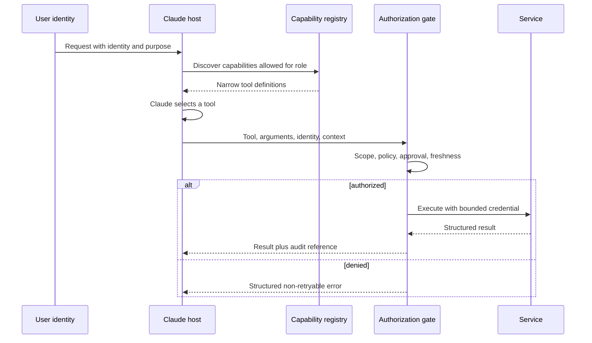

# Integration Protocols, Identity, and Least Privilege | 集成协议、身份与最小权限

> A tool is not safe because Claude uses it carefully. It is safe when the system refuses unauthorized use.

> **【中文解读】** 本课回答"工具的安全到底由谁保证"。核心论断：工具不是因为 Claude 用得小心而安全，而是因为系统拒绝未授权使用才安全。全课把能力暴露拆成三段彼此独立的控制：发现（discovery，决定模型看得见什么）、选择（selection，模型挑哪个工具）、执行（execution，授权门在真正调用前做最终裁决）。围绕这条主线依次覆盖：四种集成形态（直连 API、CLI、MCP、Agent 间委托）的边界取舍、身份传播（principal、租户、scope、审批引用一路带到下游）、四层最小权限（工具集、schema、凭据、动作）、把审批设计成绑定动作与参数的能力、结构化错误分类（标明可否重试）、渐进式发现，以及"MCP scope 不等于业务授权"。

> **【拓展：协议选型→架构决策记录】** 直连 API、CLI、MCP、Agent 间委托不是时尚排行榜，而是由集成边界决定的结构选择：多个宿主需要统一发现和调用能力时 MCP 才挣得席位，本地与 CI 自动化适合 CLI，远端真正拥有自主任务时才值得 Agent 间委托。本课是第 13 课"安全活在提示词之外"在集成边界的工程化延续（13 课给威胁模型与纵深防御，本课给身份传播与执行时授权的落地形态），也是第 27 课"企业治理、合规与人工审查"的技术底座，并为架构师毕业设计 32 提供身份与最小权限证据。

> 🔗 **【前置】** 学本课前请先掌握：(1) 第 23 课"端到端架构与价值权衡"——先有整体架构与价值判断，才能谈单一集成边界的取舍；(2) 第 13 课"安全活在提示词之外"——最小权限、策略门与会话身份绑定的方法论，本课把它们扩展到协议选型与身份传播。

**Type:** Build | **类型:** 动手构建
**Languages:** Python | **语言:** Python
**Prerequisites:** [End-to-End Architecture and Value Tradeoffs](../../23-end-to-end-architecture-and-value-tradeoffs/); Phase 13, Lessons 01, 05, 06, 16, and 18 | **前置知识:** 第 23 课（端到端架构与价值权衡）；Phase 13 第 01、05、06、16、18 课
**Time:** ~150 minutes | **时间:** 约 150 分钟

## Learning Objectives | 学习目标

- Choose direct API, CLI, MCP, or agent-to-agent integration from requirements
  中文翻译：根据需求在直连 API、CLI、MCP 或 Agent 间集成之间做选择。
- Separate capability discovery from execution authorization
  中文翻译：把能力发现与执行授权分开。
- Design least-privilege tool sets and identity propagation
  中文翻译：设计最小权限的工具集与身份传播。
- Return structured, actionable errors without leaking secrets
  中文翻译：返回结构化、可行动的错误，同时不泄漏密钥。
- Place approval, audit, and revocation controls at the execution boundary
  中文翻译：把审批、审计与撤销控制放在执行边界上。

## The Problem | 问题引入

> **【中文解读】** 开篇反例是"用提示词当权限"：四个工具全开，再加一句"除非绝对必要，绝不退款删号"。这不算最小权限——危险能力仍然存在、模型仍然看得见、提示词注入仍然可以瞄准它；确认文案能减少误用，但替代不了授权。结构性修复反而更省：不暴露角色不需要的能力、传播调用方身份、在工具执行时强制 scope 与审批。

A support agent can read tickets, draft replies, issue refunds, and delete user
accounts. Most support staff only need the first two capabilities. The team keeps
all four tools enabled and adds a prompt: "Never issue refunds or delete accounts
unless absolutely necessary."

> 一个客服 Agent 能读工单、起草回复、发起退款、删除用户账户。大多数客服人员只需要前两项能力。团队却让四个工具全部保持启用，只是加了一句提示词："除非绝对必要，绝不要退款或删账户。"

This is not least privilege. The dangerous capability still exists, the model
still sees it, and prompt injection can still target it. Confirmation text can
reduce accidental use, but it cannot replace authorization.

> 这不是最小权限。危险能力依然存在，模型依然看得见它，提示词注入依然可以瞄准它。确认文案能减少误用，但无法替代授权。

The structural fix is smaller: do not expose capabilities the role does not
need, propagate the caller's identity, and enforce scope plus approval when a
tool executes.

> 结构性修复反而更小：不暴露该角色不需要的能力，传播调用方身份，并在工具执行时强制 scope 加审批。

## The Concept | 核心概念

### Choose an Integration Shape From the Boundary

The protocols overlap, but they solve different primary problems.

> 这些协议互相重叠，但各自解决的首要问题不同。

| Shape | Best fit | Main tradeoff |
|-------|----------|---------------|
| Direct API | Your application knows one service contract and needs low overhead | Tight service coupling and custom discovery |
| CLI | Local or CI automation around an executable | Process, environment, and output-management burden |
| MCP | A host needs standard discovery of tools, resources, or prompts across servers | Another protocol boundary and authorization model to operate |
| Agent-to-agent | One agent delegates a task to another autonomous service | Harder trust, identity, progress, and failure semantics |

MCP does not replace every API. A stable internal service call may be clearer and
faster as a direct API. MCP earns its place when several hosts need a common way
to discover and call capabilities, or when tool ownership should remain behind
a server boundary.

> MCP 并不取代所有 API。一次稳定的内部服务调用，用直连 API 可能更清晰也更快。当多个宿主需要统一的方式来发现和调用能力，或工具所有权应留在服务器边界之后时，MCP 才挣得自己的席位。

A CLI is useful for local developer workflows and CI, but long-running work
needs durable state, cancellation, and result retrieval beyond a fragile child
process. Agent-to-agent integration makes sense when the remote party owns an
autonomous task, not when it is simply a function endpoint.

> CLI 适合本地开发者工作流和 CI，但长时运行的工作需要持久状态、取消和结果取回，这些超出了一次脆弱的子进程所能提供的。Agent 间集成在远端真正拥有一个自主任务时才有意义，而不是把远端当成一个函数端点。

### Separate Discovery, Selection, and Execution

> **【中文解读】** 这张时序图是全课的骨架：用户身份进入宿主，注册中心只返回该角色 scope 内的窄工具定义，Claude 选择工具，授权门在执行前检查 scope、策略、审批与新鲜度，之后才用有界凭据调用服务并回传结果加审计引用；被拒则返回结构化的不可重试错误。两个关键结论：发现控制模型看见什么，授权控制实际发生什么，两者缺一不可；只做发现不做授权，隐藏工具就只是遮蔽（obscurity），调用方仍可直接打到端点。



Discovery controls what the model sees. Authorization controls what actually
happens. Both are necessary.

> 发现控制模型看见什么。授权控制实际发生什么。两者都必不可少。

If discovery returns every tool, the model pays extra context and choice cost.
It also sees descriptions for dangerous operations. If authorization is missing,
hiding a tool is only obscurity. A caller may still reach the endpoint directly.

> 如果发现返回全部工具，模型要付出额外的上下文与选择成本，还会看到危险操作的描述。如果缺少授权，隐藏一个工具只是遮蔽。调用方仍然可以直接访问端点。

### Propagate Identity, Do Not Replace It

An application API key identifies the application. It does not automatically
represent the human user or service making the request.

> 应用 API 密钥标识的是应用。它并不自动代表发起请求的人类用户或服务。

Carry:

> 携带：

- principal ID
  中文翻译：主体 ID。
- tenant or organization
  中文翻译：租户或组织。
- authenticated session
  中文翻译：已认证会话。
- roles and scopes
  中文翻译：角色与 scope。
- purpose or case identifier where policy requires it
  中文翻译：策略要求时的目的或工单标识符。
- approval reference for elevated action
  中文翻译：高权限动作的审批引用。
- request and trace IDs
  中文翻译：请求与追踪 ID。

Downstream systems should make their own authorization decision using trusted
identity claims. Do not grant a broad service credential and ask Claude to
simulate user permissions.

> 下游系统应当用受信任的身份声明自己做授权决定。不要发放宽泛的服务凭据，然后让 Claude 去模拟用户权限。

### Use Least Privilege at Four Levels

> **【中文解读】** 最小权限要落在四层，缺一层就漏一层：工具集（只暴露任务与角色需要的能力）、工具 schema（只收必要参数并约束取值）、凭据（只给必需的服务 scope 与资源）、动作（执行时重查当前策略、对象所有权与审批）。理由是时效性：权限会变、审批会过期、工具定义可能是几分钟前加载的——执行时授权才是最终控制。

1. Tool set: expose only capabilities needed for the task and role.
   中文翻译：工具集：只暴露任务与角色需要的能力。
2. Tool schema: accept only necessary arguments and constrain values.
   中文翻译：工具 schema：只接受必要参数并约束取值。
3. Credential: grant only required service scopes and resources.
   中文翻译：凭据：只授予必需的服务 scope 与资源。
4. Action: re-check current policy, object ownership, and approval at execution.
   中文翻译：动作：执行时重查当前策略、对象所有权与审批。

Permissions change. Approval expires. A tool definition may have been loaded
minutes earlier. Execution-time authorization is the final control.

> 权限会变。审批会过期。工具定义可能是几分钟前加载的。执行时授权是最终控制。

### Design Approval as a Capability

> **【中文解读】** "先问用户"太含糊。可靠审批是一个能力对象，必须包含：确切的拟执行动作与参数、预期效果与可逆性、请求者身份、审批者身份与权限、过期时间、单次或有界使用语义、审计引用。审批之后执行的一定是"被审阅过的那个动作"——参数一变就要重新审批。这与第 13 课"审批绑定规范化参数"（批 20 不等于批 200）是同一条规则。

"Ask the user first" is ambiguous. A reliable approval contains:

> "先问用户"是含糊的。一份可靠的审批包含：

- exact proposed action and parameters
  中文翻译：确切的拟执行动作与参数。
- expected effect and reversibility
  中文翻译：预期效果与可逆性。
- requester identity
  中文翻译：请求者身份。
- approving identity and authority
  中文翻译：审批者身份与权限。
- expiration time
  中文翻译：过期时间。
- single-use or bounded-use semantics
  中文翻译：单次或有界使用语义。
- audit reference
  中文翻译：审计引用。

After approval, execute the exact reviewed action. If arguments change, request
new approval.

> 审批之后，执行确切的被审阅过的动作。参数变了，就请求新的审批。

### Return Structured Errors

Tools fail in ways that require different recovery.

> 工具会以需要不同恢复方式的形式失败。

```json
{
  "ok": false,
  "error": {
    "category": "authorization",
    "retryable": false,
    "message": "refunds:write scope is required",
    "safe_details": {
      "required_action": "request authorized human review"
    }
  }
}
```

Categories might include validation, authorization, not-found, conflict,
rate-limit, dependency, timeout, and internal. Tell the agent whether retry is
safe and what can change the outcome. Do not return raw stack traces, tokens, or
secret-bearing upstream messages.

> 类别可以包括校验、授权、未找到、冲突、限流、依赖、超时与内部错误。告诉 Agent 重试是否安全、什么能改变结果。不要返回原始堆栈、token 或携带密钥的上游消息。

### Progressive Discovery Reduces Capability Bloat

Large tool catalogs consume context and increase selection errors. Start with a
small stable set plus a search or registry mechanism. Load specialized tools
when the task establishes a need.

> 大型工具目录消耗上下文并增加选择错误。从一小组稳定工具加一个搜索或注册机制开始，等任务确立了需要再加载专用工具。

Progressive discovery should still enforce the principal's scope. Search must
not reveal the existence or description of capabilities the caller cannot know
about.

> 渐进式发现仍应强制主体的 scope。搜索不得泄露调用方无权知晓的能力的存在或描述。

### MCP Scopes Do Not Define Business Authorization

> **【中文解读】** 收尾定位要背：MCP 标准化的是能力交换；身份、租户隔离、同意、审批、策略、审计与凭据管理仍归你的应用。传输安全不是授权，协议握手成功不等于对每个工具都有权限。考试里"连上 MCP 就等于授权通过"的说法一律拒绝。

MCP standardizes capability exchange. Your application still owns identity,
tenant isolation, consent, approval, policy, audit, and credential management.
Transport security is not authorization, and a successful protocol handshake
does not grant permission to every tool.

> MCP 标准化能力交换。身份、租户隔离、同意、审批、策略、审计与凭据管理仍归你的应用所有。传输安全不是授权，协议握手成功也不授予对每个工具的权限。

## Build It | 动手构建

## Interactive Lab | 交互实验室

```figure
25-identity-permission-path
```

Use the permission-path explorer to follow identity from authenticated request
through capability discovery, model selection, execution-time authorization,
approval, service call, and audit. Changing scopes demonstrates why discovery
and authorization are separate controls.

> 用权限路径探索器跟踪身份从已认证请求经能力发现、模型选择、执行时授权、审批、服务调用到审计的全过程。改变 scope 能演示发现与授权为什么是两个独立的控制。

## Practice Lab | 练习实验室

Grant only discovery scope, attempt execution, then add a bound approval and
observe which decision changes and which boundary remains enforced.

> 只授予发现 scope，尝试执行，再加一份绑定的审批，观察哪个决定变了、哪条边界仍然生效。

## Shipped Artifact | 交付产物

[`outputs/least-privilege-review.json`](../outputs/least-privilege-review.json)
is a filled capability review showing visible tools and a structured denied
refund attempt.

> `outputs/least-privilege-review.json` 是一份填好的能力评审：展示可见工具与一次结构化的退款拒绝尝试。

## Verify It | 验证

Reproduce the behavior and run all authorization tests:

> 复现该行为并运行全部授权测试：

```bash
cd certifications/claude/lessons/25-integration-protocols-identity-and-least-privilege/code
python3 main.py
python3 -m unittest discover tests -v
```

The quiz checks protocol, identity, approval, and retry rules.

> 测验检查协议、身份、审批与重试规则。

## Capstone Connection | 毕业设计衔接

Use the report as the Architect Professional capstone's identity and
least-privilege evidence.

> 把报告用作架构师专业级毕业设计的身份与最小权限证据。

The lab makes the boundary visible with standard-library Python.

> 本实验用标准库 Python 把边界可视化。

```bash
cd certifications/claude/lessons/25-integration-protocols-identity-and-least-privilege/code
python3 main.py
python3 -m unittest discover tests -v
```

### Step 1: Select a Primary Shape

`select_protocol` requires one primary integration need. Dynamic discovery maps
to MCP, local automation to CLI, autonomous remote delegation to agent-to-agent,
and a known service call to direct API. Ambiguous requirements fail so an
architect must clarify the boundary.

> `select_protocol` 要求一个主要集成需求。动态发现映射到 MCP，本地自动化映射到 CLI，自主远程委托映射到 Agent 间集成，已知服务调用映射到直连 API。含糊的需求直接失败，迫使架构师澄清边界。

### Step 2: Define Principal and Tool Contracts

`Principal` carries scopes and fresh approvals. `ToolContract` declares required
scopes, risk, and whether approval is required. The description explains the
behavior but does not authorize it.

> `Principal` 携带 scope 与新鲜审批。`ToolContract` 声明所需 scope、风险以及是否需要审批。描述解释行为，但不授权行为。

### Step 3: Filter Discovery

`discover_tools` removes capabilities beyond the principal's scopes. A support
drafter never sees account deletion.

> `discover_tools` 移除超出主体 scope 的能力。客服回复者永远看不到删账户工具。

### Step 4: Authorize at Execution

`authorize` checks current scopes and approval. `execute_tool` refuses the call
with a structured non-retryable error when the check fails.

> `authorize` 检查当前 scope 与审批。检查失败时 `execute_tool` 以结构化的不可重试错误拒绝调用。

This toy system does not implement cryptographic identity, token verification,
or a policy engine. Those belong in production infrastructure. It does preserve
the placement of the decision.

> 这个玩具系统不实现密码学身份、token 校验或策略引擎。那些属于生产基础设施。它保留的是决策的摆放位置。

## Use It | 运行验证

For the support system, create role-specific tool bundles:

> 为客服系统创建按角色的工具束：

- triage: read assigned ticket, classify, route
  中文翻译：分诊：读指派工单、分类、路由。
- responder: read ticket and policy, write draft
  中文翻译：回复者：读工单与政策、写草稿。
- refund reviewer: read case and recommendation, approve or reject
  中文翻译：退款审查者：读案件与建议、批准或拒绝。
- refund executor: execute only a specific approved action
  中文翻译：退款执行者：只执行某个已批准的具体动作。
- administrator: account maintenance outside the support agent path
  中文翻译：管理员：客服 Agent 路径之外的账户维护。

The model should not receive administrator tools just because one service can
provide them. A high-risk operation should use a short-lived credential tied to
the approved action and produce an immutable audit record.

> 不应仅因为某个服务能提供管理员工具，就把它们交给模型。高风险操作应使用绑定到已批准动作的短时凭据，并产出不可变的审计记录。

When choosing MCP versus a direct API, write an ADR that compares:

> 在 MCP 与直连 API 之间做选择时，写一份 ADR 比较：

- number and diversity of hosts
  中文翻译：宿主的数量与多样性。
- need for dynamic discovery
  中文翻译：动态发现的需要。
- latency budget
  中文翻译：延迟预算。
- existing auth and SDK maturity
  中文翻译：现有认证与 SDK 的成熟度。
- deployment and ownership boundary
  中文翻译：部署与所有权边界。
- streaming or long-running behavior
  中文翻译：流式或长时运行行为。
- observability and support burden
  中文翻译：可观测性与支持负担。

Protocol fashion is not a requirement.

> 协议时尚不是需求。

## Exam Decision Patterns | 考试决策模式

> **【中文解读】** 考试速判：角色用不到的能力，直接从配置里移除；日志与确认只是补偿控制，不是最小权限。优先选：传播已认证的用户或服务身份、窄化工具与凭据的 scope、执行时再次授权、高影响动作用新鲜审批、返回分类且感知重试的错误、按集成边界选协议、目录大时渐进式发现。拒绝一切"更好的提示词、更大的模型、MCP 连接成功就解决了授权"的选项。

If a role never needs a capability, remove it from the configuration. Logging
and confirmation are compensating controls, not least privilege.

> 角色永远不需要的能力，就从配置中移除。日志与确认是补偿控制，不是最小权限。

Prefer answers that:

> 优先选择这样的答案：

- propagate authenticated user or service identity
  中文翻译：传播已认证的用户或服务身份。
- scope tools and credentials narrowly
  中文翻译：窄化工具与凭据的 scope。
- authorize again at execution
  中文翻译：执行时再次授权。
- use fresh approval for high-impact actions
  中文翻译：高影响动作使用新鲜审批。
- return categorized, retry-aware errors
  中文翻译：返回分类且感知重试的错误。
- choose a protocol from the integration boundary
  中文翻译：按集成边界选择协议。
- discover capabilities progressively when the catalog is large
  中文翻译：目录大时渐进式发现能力。

Reject answers that assume a better prompt, larger model, or successful MCP
connection solves authorization.

> 拒绝那些假设更好的提示词、更大的模型或 MCP 连接成功就解决了授权的答案。

## Common Traps | 常见陷阱

### One Service Account for Every User

The downstream service sees only broad application authority. Per-user limits
become prompt policy instead of enforceable policy.

> 下游服务只看到宽泛的应用权限。按用户的限制变成了提示词政策，而不是可执行的政策。

### Confirmation Without Binding

The user approves a refund of 50 dollars, then the arguments change to 500.
Approval must bind to action, parameters, identity, and time.

> 用户批准了退 50 美元，随后参数变成 500。审批必须绑定动作、参数、身份与时间。

### Tool Descriptions as Controls

Descriptions help selection. They are untrusted text from a security perspective
and can themselves carry prompt injection.

> 描述帮助选择。从安全视角看它们是不可信文本，本身就可能携带提示词注入。

### Retrying Authorization Errors

Retries will not create permission. Mark the error non-retryable and route to
the proper approval or access process.

> 重试造不出权限。把错误标记为不可重试，并路由到正确的审批或访问流程。

## Exercises | 练习

1. Add resource-level authorization so a principal can read only assigned
   tickets.
   中文翻译：加入资源级授权，使主体只能读取被指派的工单。
2. Create a signed, single-use approval record and reject changed arguments.
   中文翻译：创建签名、单次使用的审批记录，并拒绝被修改的参数。
3. Define a progressive discovery interface that hides unauthorized tool names.
   中文翻译：定义一个隐藏未授权工具名的渐进式发现接口。
4. Compare MCP and direct API for three internal services with a 200 ms latency
   budget.
   中文翻译：在 200 毫秒延迟预算下为三个内部服务比较 MCP 与直连 API。
5. Red-team tool descriptions and results for indirect prompt injection.
   中文翻译：对工具描述与结果做红队测试，找间接提示词注入。

## Key Terms | 关键术语

| Term | What people say | What it actually means |
|------|-----------------|------------------------|
| Authentication | Permission to act | Evidence of an identity |
| Authorization | A login | A decision about whether this identity may perform this action |
| Scope | A prompt rule | A bounded permission carried by a trusted credential or policy decision |
| Discovery | Authorization | Finding a capability, separate from permission to execute it |
| Least privilege | Add confirmation | Remove unnecessary capabilities and minimize every remaining authority boundary |
| Approval | User said yes | A time-bound, identity-bound authorization for exact action parameters |

## Further Reading | 延伸阅读

- [MCP specification](https://modelcontextprotocol.io/specification/latest) for current protocol behavior
  中文翻译：MCP 规范——当前协议行为的权威定义
- [MCP authorization specification](https://modelcontextprotocol.io/specification/latest/basic/authorization) for protocol-level authorization requirements
  中文翻译：MCP 授权规范——协议层授权要求
- [Claude tool use documentation](https://platform.claude.com/docs/en/agents-and-tools/tool-use/overview) for current tool contracts
  中文翻译：Claude 工具使用文档——当前工具契约
- Phase 13, Lesson 05 for schema design
  中文翻译：Phase 13 第 05 课——schema 设计
- Phase 13, Lesson 18 for production MCP authentication
  中文翻译：Phase 13 第 18 课——生产 MCP 认证
- Phase 17, Lesson 25 for secrets and audit controls
  中文翻译：Phase 17 第 25 课——密钥与审计控制
