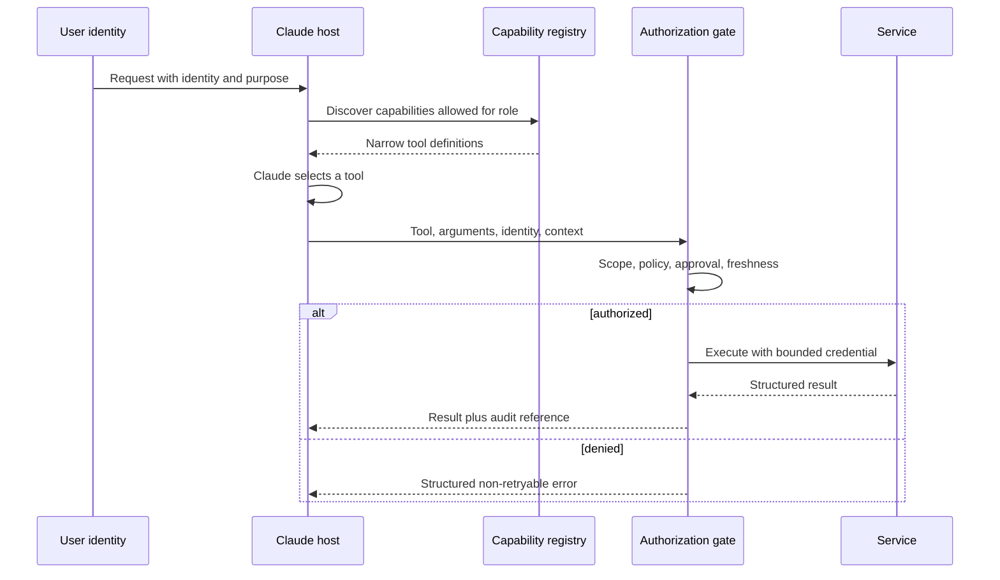

# 集成协议、身份与最小权限

> 工具不是因为 Claude 用得小心而安全。它是因为系统拒绝未授权使用才安全。

> **【中文解读】** 本课回答"工具的安全到底由谁保证"。核心论断：工具不是因为 Claude 用得小心而安全，而是因为系统拒绝未授权使用才安全。全课把能力暴露拆成三段彼此独立的控制：发现（discovery，决定模型看得见什么）、选择（selection，模型挑哪个工具）、执行（execution，授权门在真正调用前做最终裁决）。围绕这条主线依次覆盖：四种集成形态（直连 API、CLI、MCP、Agent 间委托）的边界取舍、身份传播（principal、租户、scope、审批引用一路带到下游）、四层最小权限（工具集、schema、凭据、动作）、把审批设计成绑定动作与参数的能力、结构化错误分类（标明可否重试）、渐进式发现，以及"MCP scope 不等于业务授权"。

> **【拓展：协议选型→架构决策记录】** 直连 API、CLI、MCP、Agent 间委托不是时尚排行榜，而是由集成边界决定的结构选择：多个宿主需要统一发现和调用能力时 MCP 才挣得席位，本地与 CI 自动化适合 CLI，远端真正拥有自主任务时才值得 Agent 间委托。本课是第 13 课"安全活在提示词之外"在集成边界的工程化延续（13 课给威胁模型与纵深防御，本课给身份传播与执行时授权的落地形态），也是第 27 课"企业治理、合规与人工审查"的技术底座，并为架构师毕业设计 32 提供身份与最小权限证据。

> 🔗 **【前置】** 学本课前请先掌握：(1) 第 23 课"端到端架构与价值权衡"——先有整体架构与价值判断，才能谈单一集成边界的取舍；(2) 第 13 课"安全活在提示词之外"——最小权限、策略门与会话身份绑定的方法论，本课把它们扩展到协议选型与身份传播。

**类型：** 动手构建
**语言：** Python
**前置条件：** 第 23 课（端到端架构与价值权衡）；Phase 13 第 01、05、06、16、18 课
**预计用时：** 约 150 分钟

## 学习目标

- 根据需求在直连 API、CLI、MCP 或 Agent 间集成之间做选择。
- 把能力发现与执行授权分开。
- 设计最小权限的工具集与身份传播。
- 返回结构化、可行动的错误，同时不泄漏密钥。
- 把审批、审计与撤销控制放在执行边界上。

## 问题引入

> **【中文解读】** 开篇反例是"用提示词当权限"：四个工具全开，再加一句"除非绝对必要，绝不退款删号"。这不算最小权限——危险能力仍然存在、模型仍然看得见、提示词注入仍然可以瞄准它；确认文案能减少误用，但替代不了授权。结构性修复反而更省：不暴露角色不需要的能力、传播调用方身份、在工具执行时强制 scope 与审批。

一个客服 Agent 能读工单、起草回复、发起退款、删除用户账户。大多数客服人员只需要前两项能力。团队却让四个工具全部保持启用，只是加了一句提示词："除非绝对必要，绝不要退款或删账户。"

这不是最小权限。危险能力依然存在，模型依然看得见它，提示词注入依然可以瞄准它。确认文案能减少误用，但无法替代授权。

结构性修复反而更小：不暴露该角色不需要的能力，传播调用方身份，并在工具执行时强制 scope 加审批。

## 核心概念

### 按边界选择集成形态

这些协议互相重叠，但各自解决的首要问题不同。

| 形态 | 最适合 | 主要取舍 |
|-------|----------|---------------|
| 直连 API | 应用只认一个服务契约、需要低开销 | 服务耦合紧，发现要自建 |
| CLI | 围绕一个可执行文件的本地或 CI 自动化 | 进程、环境与输出管理负担 |
| MCP | 宿主需要跨服务器标准化发现工具、资源或提示词 | 多运维一个协议边界与授权模型 |
| Agent 间集成 | 一个 Agent 把任务委托给另一个自主服务 | 信任、身份、进度与失败语义更难 |

MCP 并不取代所有 API。一次稳定的内部服务调用，用直连 API 可能更清晰也更快。当多个宿主需要统一的方式来发现和调用能力，或工具所有权应留在服务器边界之后时，MCP 才挣得自己的席位。

CLI 适合本地开发者工作流和 CI，但长时运行的工作需要持久状态、取消和结果取回，这些超出了一次脆弱的子进程所能提供的。Agent 间集成在远端真正拥有一个自主任务时才有意义，而不是把远端当成一个函数端点。

### 把发现、选择与执行分开

> **【中文解读】** 这张时序图是全课的骨架：用户身份进入宿主，注册中心只返回该角色 scope 内的窄工具定义，Claude 选择工具，授权门在执行前检查 scope、策略、审批与新鲜度，之后才用有界凭据调用服务并回传结果加审计引用；被拒则返回结构化的不可重试错误。两个关键结论：发现控制模型看见什么，授权控制实际发生什么，两者缺一不可；只做发现不做授权，隐藏工具就只是遮蔽（obscurity），调用方仍可直接打到端点。



发现控制模型看见什么。授权控制实际发生什么。两者都必不可少。

如果发现返回全部工具，模型要付出额外的上下文与选择成本，还会看到危险操作的描述。如果缺少授权，隐藏一个工具只是遮蔽。调用方仍然可以直接访问端点。

### 传播身份，而不是替换身份

应用 API 密钥标识的是应用。它并不自动代表发起请求的人类用户或服务。

携带：

- 主体 ID
- 租户或组织
- 已认证会话
- 角色与 scope
- 策略要求时的目的或工单标识符
- 高权限动作的审批引用
- 请求与追踪 ID

下游系统应当用受信任的身份声明自己做授权决定。不要发放宽泛的服务凭据，然后让 Claude 去模拟用户权限。

### 在四个层面运用最小权限

> **【中文解读】** 最小权限要落在四层，缺一层就漏一层：工具集、工具 schema、凭据、动作。理由是时效性：权限会变、审批会过期、工具定义可能是几分钟前加载的——执行时授权才是最终控制。

1. 工具集：只暴露任务与角色需要的能力。
2. 工具 schema：只接受必要参数并约束取值。
3. 凭据：只授予必需的服务 scope 与资源。
4. 动作：执行时重查当前策略、对象所有权与审批。

权限会变。审批会过期。工具定义可能是几分钟前加载的。执行时授权是最终控制。

### 把审批设计成一种能力

> **【中文解读】** "先问用户"太含糊。可靠审批是一个能力对象，必须包含：确切的拟执行动作与参数、预期效果与可逆性、请求者身份、审批者身份与权限、过期时间、单次或有界使用语义、审计引用。审批之后执行的一定是"被审阅过的那个动作"——参数一变就要重新审批。这与第 13 课"审批绑定规范化参数"（批 20 不等于批 200）是同一条规则。

"先问用户"是含糊的。一份可靠的审批包含：

- 确切的拟执行动作与参数
- 预期效果与可逆性
- 请求者身份
- 审批者身份与权限
- 过期时间
- 单次或有界使用语义
- 审计引用

审批之后，执行确切的被审阅过的动作。参数变了，就请求新的审批。

### 返回结构化错误

工具会以需要不同恢复方式的形式失败。

```json
{
  "ok": false,
  "error": {
    "category": "authorization",
    "retryable": false,
    "message": "refunds:write scope is required",
    "safe_details": {
      "required_action": "request authorized human review"
    }
  }
}
```

类别可以包括校验、授权、未找到、冲突、限流、依赖、超时与内部错误。告诉 Agent 重试是否安全、什么能改变结果。不要返回原始堆栈、token 或携带密钥的上游消息。

### 渐进式发现减少能力膨胀

大型工具目录消耗上下文并增加选择错误。从一小组稳定工具加一个搜索或注册机制开始，等任务确立了需要再加载专用工具。

渐进式发现仍应强制主体的 scope。搜索不得泄露调用方无权知晓的能力的存在或描述。

### MCP scope 不定义业务授权

> **【中文解读】** 收尾定位要背：MCP 标准化的是能力交换；身份、租户隔离、同意、审批、策略、审计与凭据管理仍归你的应用。传输安全不是授权，协议握手成功不等于对每个工具都有权限。考试里"连上 MCP 就等于授权通过"的说法一律拒绝。

MCP 标准化能力交换。身份、租户隔离、同意、审批、策略、审计与凭据管理仍归你的应用所有。传输安全不是授权，协议握手成功也不授予对每个工具的权限。

## 动手构建

## 交互实验室

```figure
25-identity-permission-path
```

用权限路径探索器跟踪身份从已认证请求经能力发现、模型选择、执行时授权、审批、服务调用到审计的全过程。改变 scope 能演示发现与授权为什么是两个独立的控制。

## 练习实验室

只授予发现 scope，尝试执行，再加一份绑定的审批，观察哪个决定变了、哪条边界仍然生效。

## 交付产物

[`outputs/least-privilege-review.json`](../outputs/least-privilege-review.json) 是一份填好的能力评审：展示可见工具与一次结构化的退款拒绝尝试。

## 验证

复现该行为并运行全部授权测试：

```bash
cd certifications/claude/lessons/25-integration-protocols-identity-and-least-privilege/code
python3 main.py
python3 -m unittest discover tests -v
```

测验检查协议、身份、审批与重试规则。

## 毕业设计衔接

把报告用作架构师专业级毕业设计的身份与最小权限证据。

本实验用标准库 Python 把边界可视化。

```bash
cd certifications/claude/lessons/25-integration-protocols-identity-and-least-privilege/code
python3 main.py
python3 -m unittest discover tests -v
```

### 第 1 步：选择主要形态

`select_protocol` 要求一个主要集成需求。动态发现映射到 MCP，本地自动化映射到 CLI，自主远程委托映射到 Agent 间集成，已知服务调用映射到直连 API。含糊的需求直接失败，迫使架构师澄清边界。

### 第 2 步：定义主体与工具契约

`Principal` 携带 scope 与新鲜审批。`ToolContract` 声明所需 scope、风险以及是否需要审批。描述解释行为，但不授权行为。

### 第 3 步：过滤发现

`discover_tools` 移除超出主体 scope 的能力。客服回复者永远看不到删账户工具。

### 第 4 步：执行时授权

`authorize` 检查当前 scope 与审批。检查失败时 `execute_tool` 以结构化的不可重试错误拒绝调用。

这个玩具系统不实现密码学身份、token 校验或策略引擎。那些属于生产基础设施。它保留的是决策的摆放位置。

## 运行验证

为客服系统创建按角色的工具束：

- 分诊：读指派工单、分类、路由
- 回复者：读工单与政策、写草稿
- 退款审查者：读案件与建议、批准或拒绝
- 退款执行者：只执行某个已批准的具体动作
- 管理员：客服 Agent 路径之外的账户维护

不应仅因为某个服务能提供管理员工具，就把它们交给模型。高风险操作应使用绑定到已批准动作的短时凭据，并产出不可变的审计记录。

在 MCP 与直连 API 之间做选择时，写一份 ADR 比较：

- 宿主的数量与多样性
- 动态发现的需要
- 延迟预算
- 现有认证与 SDK 的成熟度
- 部署与所有权边界
- 流式或长时运行行为
- 可观测性与支持负担

协议时尚不是需求。

## 考试决策模式

> **【中文解读】** 考试速判：角色用不到的能力，直接从配置里移除；日志与确认只是补偿控制，不是最小权限。优先选：传播已认证的用户或服务身份、窄化工具与凭据的 scope、执行时再次授权、高影响动作用新鲜审批、返回分类且感知重试的错误、按集成边界选协议、目录大时渐进式发现。拒绝一切"更好的提示词、更大的模型、MCP 连接成功就解决了授权"的选项。

角色永远不需要的能力，就从配置中移除。日志与确认是补偿控制，不是最小权限。

优先选择这样的答案：

- 传播已认证的用户或服务身份
- 窄化工具与凭据的 scope
- 执行时再次授权
- 高影响动作使用新鲜审批
- 返回分类且感知重试的错误
- 按集成边界选择协议
- 目录大时渐进式发现能力

拒绝那些假设更好的提示词、更大的模型或 MCP 连接成功就解决了授权的答案。

## 常见陷阱

### 一个服务账户走天下

下游服务只看到宽泛的应用权限。按用户的限制变成了提示词政策，而不是可执行的政策。

### 没有绑定的确认

用户批准了退 50 美元，随后参数变成 500。审批必须绑定动作、参数、身份与时间。

### 把工具描述当控制

描述帮助选择。从安全视角看它们是不可信文本，本身就可能携带提示词注入。

### 重试授权错误

重试造不出权限。把错误标记为不可重试，并路由到正确的审批或访问流程。

## 练习

1. 加入资源级授权，使主体只能读取被指派的工单。
2. 创建签名、单次使用的审批记录，并拒绝被修改的参数。
3. 定义一个隐藏未授权工具名的渐进式发现接口。
4. 在 200 毫秒延迟预算下为三个内部服务比较 MCP 与直连 API。
5. 对工具描述与结果做红队测试，找间接提示词注入。

## 关键术语

| 术语 | 人们常说 | 实际含义 |
|------|-----------------|------------------------|
| 认证（Authentication） | 行动的许可 | 一个身份的证据 |
| 授权（Authorization） | 一次登录 | 关于"这个身份是否可以执行这个动作"的决定 |
| Scope | 一条提示词规则 | 由受信任凭据或策略决定携带的有界权限 |
| 发现（Discovery） | 授权 | 找到一个能力，与执行它的许可是两回事 |
| 最小权限（Least privilege） | 加个确认 | 移除不必要的能力，并最小化每个剩余的权限边界 |
| 审批（Approval） | 用户说了"是" | 对确切动作参数的、有时间界限、绑定身份的授权 |

## 延伸阅读

- [MCP specification](https://modelcontextprotocol.io/specification/latest) — MCP 规范：当前协议行为
- [MCP authorization specification](https://modelcontextprotocol.io/specification/latest/basic/authorization) — MCP 授权规范：协议层授权要求
- [Claude tool use documentation](https://platform.claude.com/docs/en/agents-and-tools/tool-use/overview) — Claude 工具使用文档：当前工具契约
- Phase 13 第 05 课 — schema 设计
- Phase 13 第 18 课 — 生产 MCP 认证
- Phase 17 第 25 课 — 密钥与审计控制
