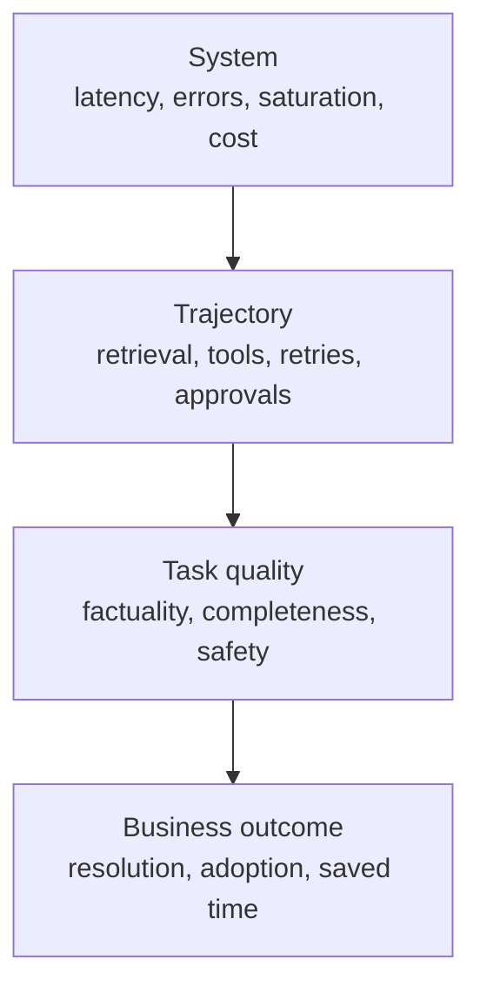

# Production Observability, Latency, and Cost | 生产可观测性、延迟与成本

> A green API call can still be a failed task.

> **【中文解读】** 本课回答"仪表盘全绿为什么用户还在投诉"。核心论断：一次绿色的 API 调用仍可能是一个失败的任务——仪表盘度量的是传输成功，产品依赖的是任务成功，可观测性负责把两者连起来。全课沿四层观测展开：系统（延迟、错误、饱和、成本）→ 轨迹（检索、工具、重试、审批）→ 任务质量（事实性、完整性、安全）→ 业务结果（解决率、采用、节省时间）。配套工程手段：日志/指标/追踪各司其职、延迟拆解到每个 span 并盯 P50/P95、按"每次成功结果的成本"算钱、提示词缓存形状、可行动告警、以及用灰度发布限制证据风险。

> **【拓展：可观测性→LLM FinOps 与 SRE 实践】** 本课把传统 SRE 的 SLI/SLO/错误预算词汇搬到 Claude 应用：日志对应结构化事件、指标对应时间聚合、追踪对应分布式链路追踪（OpenTelemetry 的 span 模型），再叠上 LLM 特有的信号——token 用量、缓存读写、检索召回、任务通过率、每次成功成本。它与第 24 课（RAG 管道，质量问题的上游）和第 14 课（评测，把 Agent 行为变成证据）共同构成上线后的证据闭环，也是架构师毕业设计 31/32 的记分卡与金丝雀门的出处。

> 🔗 **【前置】** 学本课前请先掌握：(1) 第 24 课"RAG、检索与数据管道"——本课的检索新鲜度、召回率信号都挂在那条管道上；(2) 第 13 课"安全活在提示词之外"——日志脱敏与"不记录原始密钥"的纪律在本课被复用为可观测性红线。

**Type:** Build | **类型:** 动手构建
**Languages:** Python | **语言:** Python
**Prerequisites:** [RAG, Retrieval, and Data Pipelines](../../24-rag-retrieval-and-data-pipelines/); Phase 11, Lesson 10; Phase 17, Lessons 08, 13, and 27 | **前置知识:** 第 24 课（RAG、检索与数据管道）；Phase 11 第 10 课；Phase 17 第 08、13、27 课
**Time:** ~150 minutes | **时间:** 约 150 分钟

## Learning Objectives | 学习目标

- Separate system reliability from task quality and business outcome
  中文翻译：把系统可靠性、任务质量与业务结果分开。
- Design logs, metrics, and traces for Claude requests and agent trajectories
  中文翻译：为 Claude 请求与 Agent 轨迹设计日志、指标与追踪。
- Diagnose latency across model, retrieval, tools, queues, and retries
  中文翻译：跨模型、检索、工具、队列与重试诊断延迟。
- Measure total cost and cost per successful outcome
  中文翻译：度量总成本与每次成功结果的成本。
- Define alerts and rollout gates from service objectives
  中文翻译：从服务目标出发定义告警与灰度发布门。

## The Problem | 问题引入

> **【中文解读】** 开篇五个症状对应五类病因，是诊断题的模板：答案用过期来源→检索新鲜度；工具超时后 Agent 静默继续→轨迹级失败被传输成功掩盖；时间戳放在开头导致长提示词错失缓存→缓存形状；P95 翻倍而均值正常→尾部延迟；换便宜模型单价降了但重试和人审变多→每次成功成本。一句话结论：仪表盘度量传输成功，产品依赖任务成功，可观测性必须连接两者。

A production dashboard reports 99.9 percent successful API calls. Customers are
still complaining.

> 一个生产仪表盘报告 99.9% 的 API 调用成功。客户仍在抱怨。

The model returns HTTP 200, but some answers use stale sources. A tool times out
and the agent silently continues. Long prompts miss the cache because a timestamp
was placed near the beginning. P95 latency has doubled while the average looks
acceptable. A cheaper model lowered call price but increased retries and human
review.

> 模型返回 HTTP 200，但有些答案用的是过期来源。一个工具超时，Agent 静默继续。长提示词因为时间戳被放在开头而错失缓存。P95 延迟翻倍，平均值却看着还行。更便宜的模型压低了单次调用价格，却增加了重试与人工审查。

The dashboard measures transport success. The product depends on task success.
Observability must connect the two.

> 仪表盘度量的是传输成功。产品依赖的是任务成功。可观测性必须把两者连接起来。

## The Concept | 核心概念

### Observe Four Layers



System signals tell you whether components ran. Trajectory signals tell you what
the application did. Quality signals tell you whether the result met the task.
Business signals tell you whether the workflow created value.

> 系统信号告诉你组件是否运行了。轨迹信号告诉你应用做了什么。质量信号告诉你结果是否达到任务要求。业务信号告诉你工作流是否创造了价值。

Do not collapse them into one "success" field.

> 不要把它们坍缩成一个"success"字段。

### Logs, Metrics, and Traces Have Different Jobs

> **【中文解读】** 三件套的分工要背：日志记离散事件（请求被接受、检索无候选、工具被拒授权、输出未过 schema 校验、评审者升级），用结构化字段让人能分组过滤；指标做时间聚合（请求率、错误率、P95 延迟、token 用量、缓存命中、检索召回、任务通过率、每次成功成本），驱动仪表盘与告警；追踪串起完整轨迹，一条 trace 带父子时序地展示模型调用、检索、工具执行、校验、重试与人工审批——没有 trace，一个慢请求只是一块不透明的整体。

Logs record discrete events: request accepted, retrieval returned no candidates,
tool rejected authorization, output failed schema validation, reviewer escalated.
Use structured fields so operators can group and filter them.

> 日志记录离散事件：请求被接受、检索未返回候选、工具被拒授权、输出未通过 schema 校验、评审者升级。使用结构化字段，让运维人员能分组和过滤。

Metrics aggregate behavior over time: request rate, error rate, P95 latency,
token use, cache hits, retrieval recall, task pass rate, and cost per success.
They drive dashboards and alerts.

> 指标聚合随时间变化的行为：请求率、错误率、P95 延迟、token 用量、缓存命中、检索召回、任务通过率与每次成功成本。它们驱动仪表盘与告警。

Traces connect the full trajectory. One trace should show model calls, retrieval,
tool execution, validation, retries, and human approval with parent-child timing.
Without the trace, a slow request looks like one opaque block.

> 追踪连接完整轨迹。一条 trace 应当以父子时序展示模型调用、检索、工具执行、校验、重试与人工审批。没有 trace，一个慢请求看起来只是一块不透明的整体。

### Trace the Semantic Contract

Capture enough information to reproduce and classify the outcome:

> 捕获足够复现并分类结果的信息：

- trace, request, session, and user-safe identifiers
  中文翻译：trace、请求、会话与用户安全标识符。
- application, prompt, model, tool, knowledge, and eval versions
  中文翻译：应用、提示词、模型、工具、知识与评测版本。
- input class and risk tier
  中文翻译：输入类别与风险层级。
- token counts and cache reads or writes
  中文翻译：token 计数与缓存读写。
- stop reasons and tool names
  中文翻译：停止原因与工具名。
- tool duration and structured error category
  中文翻译：工具时长与结构化错误类别。
- validation and policy decisions
  中文翻译：校验与策略决定。
- evaluator results and human edits
  中文翻译：评审器结果与人工修改。
- final state and downstream outcome
  中文翻译：最终状态与下游结果。

Do not log secrets, raw credentials, or unnecessary personal data. For sensitive
inputs, store hashes, classes, counts, or access-controlled references instead
of plaintext.

> 不要记录密钥、原始凭据或不必要的个人数据。对敏感输入，存哈希、类别、计数或受访问控制的引用，而不是明文。

### Separate System Success From Task Success

System success asks whether the request completed according to protocol. Task
success asks whether the output met the defined rubric. A valid JSON response can
be factually wrong. An agent can end normally without completing the requested
state change.

> 系统成功问请求是否按协议完成。任务成功问输出是否达到定义的评分标准。一个合法的 JSON 响应可能在事实上是错的。一个 Agent 可以正常结束却没有完成请求的状态变更。

For agent systems, evaluate both:

> 对 Agent 系统，两者都评估：

- final state: did the intended artifact or system state exist?
  中文翻译：最终状态：预期的产物或系统状态是否存在？
- trajectory: were tools, permissions, evidence, and budgets used correctly?
  中文翻译：轨迹：工具、权限、证据与预算是否被正确使用？

Text matching alone misses both.

> 只做文本匹配两者都会漏掉。

### Decompose Latency

> **【中文解读】** 延迟诊断的公式要背：端到端延迟 = 排队 + 上下文组装 + 模型 + 检索 + 工具 + 校验 + 重试 + 审批。在每个主要 span 上同时盯 P50 与 P95：P50 描述普通路径，P95 暴露慢工具、长上下文、限流与重试。流式体验要计入"首个有用输出时间"——首 token 可以很快，用户却在等引用、工具结果或最终通过校验的答案。后台与批处理系统度量截止时间完成率与吞吐：只要整批在业务窗口内跑完，单项 30 秒也可以接受。

End-to-end latency includes:

> 端到端延迟包括：

```text
queue + context assembly + model + retrieval + tools + validation + retries + approval
```

Track P50 and P95 at every major span. P50 describes the ordinary path. P95
exposes slow tools, long contexts, rate limits, and retries.

> 在每个主要 span 上跟踪 P50 与 P95。P50 描述普通路径。P95 暴露慢工具、长上下文、限流与重试。

For streaming experiences, include time to first useful output. Time to first
token can look good while the user waits for citations, tool results, or a final
validated answer.

> 对流式体验，计入首个有用输出的时间。首 token 时间可以很好看，用户却在等待引用、工具结果或最终通过校验的答案。

For background and batch systems, measure deadline completion and throughput.
A 30-second batch item can be acceptable if the entire job finishes within its
business window.

> 对后台与批处理系统，度量截止时间完成率与吞吐。只要整个作业在其业务窗口内完成，一个 30 秒的批处理项也可以接受。

### Optimize From Evidence

Common latency interventions:

> 常见的延迟干预：

- route simple work to a faster suitable model
  中文翻译：把简单工作路由到更快的合适模型。
- reduce irrelevant context
  中文翻译：削减无关上下文。
- place stable prompt prefixes for caching
  中文翻译：放置稳定的提示词前缀以利用缓存。
- retrieve fewer, better candidates
  中文翻译：检索更少但更好的候选。
- run independent tool calls concurrently
  中文翻译：并发运行相互独立的工具调用。
- move non-interactive workloads to batch
  中文翻译：把非交互负载移入批处理。
- enforce time, turn, and retry budgets
  中文翻译：强制时间、轮次与重试预算。
- cache deterministic tool results where freshness permits
  中文翻译：在新鲜度允许处缓存确定性工具结果。

Each can change quality or safety. Measure the tradeoff on a representative
evaluation set.

> 每一项都可能改变质量或安全性。在代表性评测集上度量这个取舍。

### Measure Cost Per Successful Outcome

> **【中文解读】** 算钱的公式要背：总成本 = 模型 + 缓存读写 + 工具 + 基础设施 + 人工审查 + 纠正；每次成功成本 = 总成本 / 被接受的任务结果。失败请求照样烧钱，安全拒答、重试、评审时间、事故纠正也一样。输入、输出、缓存与工具成本要分开上报，团队才能有的放矢。在选模型或架构变体时，真正有意义的比较是每次成功结果的成本——单价便宜但失败率高的方案会在这里现出原形。

Token price is one component.

> token 价格只是一个组成部分。

```text
total cost = model + cache writes and reads + tools + infrastructure + review + correction
cost per success = total cost / accepted task outcomes
```

Failed requests still cost money. So do safe rejections, retries, reviewer time,
and incident correction. Report input, output, cache, and tool costs separately
so the team can act on them.

> 失败请求仍然花钱。安全拒答、重试、评审时间与事故纠正也一样。把输入、输出、缓存与工具成本分开上报，团队才能据此行动。

Cost per successful outcome is the comparison that matters when selecting a
model or architecture variant.

> 在选择模型或架构变体时，真正有意义的比较是每次成功结果的成本。

### Understand Prompt Cache Shape

Prompt caching reuses a stable prefix. Changes near the front can invalidate
everything after them. Place stable tool definitions, system instructions, and
large reference material before dynamic user content when current documentation
supports that cache layout.

> 提示词缓存复用稳定的前缀。靠近开头的改动可能使其后的一切失效。在当前文档支持该缓存布局时，把稳定的工具定义、系统指令与大型参考资料放在动态用户内容之前。

Track cache-read and cache-write tokens. A cache feature flag without a hit-rate
metric is not an optimization.

> 跟踪缓存读与缓存写 token。一个没有命中率指标的缓存功能开关算不上优化。

Tool definitions, model settings, thinking configuration, and other request
changes can affect cache behavior. Verify against current official documentation
because details evolve.

> 工具定义、模型设置、thinking 配置与其他请求变化都可能影响缓存行为。细节会演进，请对照当前官方文档核实。

### Build Actionable Alerts

Alert on user and operator decisions, not every metric movement.

> 按用户和运维需要做的决策来告警，而不是对每个指标波动都告警。

Good alerts include:

> 好的告警包括：

- task pass rate below SLO for a meaningful window
  中文翻译：任务通过率在一个有意义的窗口内低于 SLO。
- safety control failure or unauthorized action attempt
  中文翻译：安全控制失效或未授权动作尝试。
- P95 latency exceeding user tolerance
  中文翻译：P95 延迟超出用户容忍度。
- retrieval freshness lag
  中文翻译：检索新鲜度滞后。
- tool error-category spike
  中文翻译：工具错误类别激增。
- cache hit collapse after a deployment
  中文翻译：部署后缓存命中率崩塌。
- cost per success above budget
  中文翻译：每次成功成本超出预算。
- evaluator disagreement or label drift
  中文翻译：评审器分歧或标签漂移。

Every alert needs an owner, runbook, evidence link, and escalation path. If nobody
knows what action follows, it is dashboard decoration.

> 每条告警都需要负责人、运维手册、证据链接与升级路径。如果没人知道接下来该做什么动作，它就只是仪表盘装饰。

### Use Rollouts to Limit Evidence Risk

> **【中文解读】** 灰度发布四步要背：先影子评测（无用户影响），再按租户或流量比例小规模金丝雀，然后在自动回滚的保护下扩大，最后通过质量、延迟、成本、安全四道门才全量。与稳定基线比较，并按任务类别分层——一个总体增益可能掩盖某个高风险分层的严重回退。离线评测必要但不充分：生产流量里有新查询、新数据、新负载与新集成。

Offline evaluation is necessary, not sufficient. Production traffic contains new
queries, data, load, and integrations.

> 离线评测是必要的，但不充分。生产流量包含新的查询、数据、负载与集成。

Use:

> 使用：

1. shadow evaluation with no user impact
   中文翻译：无用户影响的影子评测。
2. small canary by tenant or traffic percentage
   中文翻译：按租户或流量百分比的小规模金丝雀。
3. guarded expansion with automatic rollback
   中文翻译：带自动回滚的保护性扩大。
4. full rollout after quality, latency, cost, and safety gates pass
   中文翻译：质量、延迟、成本与安全门全部通过后的全量发布。

Compare against a stable baseline and stratify by task class. An aggregate gain
can hide a serious regression for a high-risk segment.

> 与稳定基线比较，并按任务类别分层。总体增益可能掩盖某个高风险分层的严重回退。

## Build It | 动手构建

## Interactive Lab | 交互实验室

```figure
26-latency-cost-slo
```

Use the SLO explorer to change task success, cache rate, retry cost, P50, and
P95 independently. It exposes variants where cheaper calls or healthy transport
still fail the user, quality, or cost-per-success gate.

> 用 SLO 探索器独立改变任务成功率、缓存率、重试成本、P50 与 P95。它暴露这样的变体：更便宜的调用或健康的传输仍然过不了用户、质量或每次成功成本这道门。

## Practice Lab | 练习实验室

Add a cheap failed trace and observe cost per success increase even though unit
price falls. Then identify the first gate that should block rollout.

> 加一条便宜的失败 trace，观察单价下降的同时每次成功成本上升。然后找出第一个应当挡下发布的门。

## Shipped Artifact | 交付产物

[`outputs/release-scorecard.json`](../outputs/release-scorecard.json) is a filled
baseline and candidate comparison with independent quality, latency, cache, and
economic gates.

> `outputs/release-scorecard.json` 是一份填好的基线与候选比较：带相互独立的质量、延迟、缓存与经济门。

## Verify It | 验证

Reproduce and test the aggregation:

> 复现并测试该聚合：

```bash
cd certifications/claude/lessons/26-production-observability-latency-and-cost/code
python3 main.py
python3 -m unittest discover tests -v
```

The quiz checks diagnosis and rollout decisions.

> 测验检查诊断与灰度发布决策。

## Capstone Connection | 毕业设计衔接

Carry the scorecard into the Architect Professional capstone's evaluation,
observability, and canary gates.

> 把记分卡带进架构师专业级毕业设计的评测、可观测性与金丝雀门。

The lab aggregates synthetic trace records using only Python.

> 本实验只用 Python 聚合合成 trace 记录。

```bash
cd certifications/claude/lessons/26-production-observability-latency-and-cost/code
python3 main.py
python3 -m unittest discover tests -v
```

### Step 1: Represent One Task Trajectory

`Trace` stores a compact end-to-end record: variant, latency, token counts,
cost, system result, task result, cache state, and error category. A production
trace would contain child spans and access-controlled references rather than one
flat object.

> `Trace` 存一份紧凑的端到端记录：变体、延迟、token 计数、成本、系统结果、任务结果、缓存状态与错误类别。生产级 trace 会包含子 span 与受访问控制的引用，而不是一个扁平对象。

### Step 2: Aggregate Without Hiding Failure

`summarize` reports system and task success separately. It calculates nearest-rank
P50 and P95, cache-read rate, error categories, total cost, and cost per task
success. Failed attempts remain in the cost numerator.

> `summarize` 分开上报系统成功与任务成功。它计算近邻秩 P50 与 P95、缓存读率、错误类别、总成本与每次任务成功成本。失败尝试仍留在成本的分子里。

### Step 3: Compare Variants

`by_variant` prevents a cached or routed design from being averaged into the
baseline. Compare quality, latency, and cost together.

> `by_variant` 防止带缓存或路由的设计被平均进基线。把质量、延迟与成本放在一起比较。

### Step 4: Evaluate Service Objectives

`evaluate_objectives` applies minimum task success and maximum latency and cost
thresholds. A variant must pass every required gate. Do not average a safety or
quality failure away with lower cost.

> `evaluate_objectives` 施加最低任务成功率与最高延迟、成本阈值。一个变体必须通过每一道必需的门。不要用更低的成本把安全或质量失败平均掉。

## Use It | 运行验证

Start with one production question: "Why did task success drop after release?"

> 从一个生产问题开始："发布后任务成功率为什么降了？"

Filter traces by application and release version. Stratify by input class. Check
system errors, then retrieval and tool spans, then validator and evaluator
results. Compare prompt, model, knowledge, and tool versions. Identify the
earliest divergence from the baseline trajectory.

> 按应用与发布版本过滤 trace。按输入类别分层。先查系统错误，再查检索与工具 span，然后查校验器与评审器结果。比较提示词、模型、知识与工具版本。找出与基线轨迹最早的分叉点。

If P95 latency rises while P50 stays stable, inspect slow-path behavior: retries,
rate limits, large inputs, tool timeouts, and approval waits. If cost rises with
stable token price, inspect call count, context length, cache hits, and review.

> 如果 P95 延迟上升而 P50 稳定，检查慢路径行为：重试、限流、大输入、工具超时与审批等待。如果成本上升而 token 价格稳定，检查调用次数、上下文长度、缓存命中与人工审查。

Keep a release scorecard:

> 维护一份发布记分卡：

| Gate | Baseline | Candidate | Required |
|------|----------|-----------|----------|
| Task pass rate | | | no regression in high-risk strata |
| Safety pass rate | | | 100 percent on hard controls |
| P95 latency | | | within SLO |
| Cost per success | | | within budget |
| Retrieval recall | | | within tolerance |
| Human review minutes | | | no hidden workflow burden |

## Exam Decision Patterns | 考试决策模式

> **【中文解读】** 考试速判：API 成功率高但用户报告结果差，就补看或检查语义质量与轨迹证据；文档刷新之后开始答错，先追检索链路再考虑换模型。优先选：日志、指标、追踪三者合用；分开传输、任务与业务成功；盯 P95 而不只是均值；比较每次成功结果的成本；给提示词、模型、工具、知识做版本化；用质量、延迟、成本、安全四道门守发布；每条告警都有负责人和手册。

If API success is high but users report bad results, add or inspect semantic
quality and trajectory evidence. If a document refresh precedes wrong answers,
trace retrieval before changing models.

> 如果 API 成功率很高但用户报告结果差，就补充或检查语义质量与轨迹证据。如果答错之前发生了文档刷新，先追踪检索，再考虑更换模型。

Prefer answers that:

> 优先选择这样的答案：

- use logs, metrics, and traces together
  中文翻译：日志、指标与追踪三者合用。
- separate transport, task, and business success
  中文翻译：分开传输、任务与业务成功。
- monitor P95 rather than only averages
  中文翻译：监控 P95 而不是只看均值。
- compare cost per successful outcome
  中文翻译：比较每次成功结果的成本。
- version prompts, models, tools, and knowledge
  中文翻译：给提示词、模型、工具与知识做版本化。
- gate rollouts on quality, latency, cost, and safety
  中文翻译：用质量、延迟、成本与安全守发布门。
- give every alert an owner and runbook
  中文翻译：每条告警都有负责人与运维手册。

## Common Traps | 常见陷阱

### Logging Full Prompts by Default

This can leak personal data, secrets, or regulated content. Record the minimum
safe evidence and keep sensitive references under access control.

> 默认记录完整提示词可能泄漏个人数据、密钥或受监管内容。记录最小的安全证据，并把敏感引用置于访问控制之下。

### One Aggregate Quality Score

It can hide regressions by language, risk tier, task, or customer. Stratify.

> 一个总体质量分数可能掩盖按语言、风险层级、任务或客户的回退。要分层。

### Average Latency

A small slow cohort can damage experience while the mean remains stable. Track
tail latency and timeout rate.

> 一小批慢请求就能损害体验，而均值保持稳定。跟踪尾部延迟与超时率。

### Cost per Call

It rewards cheap failures. Use cost per accepted outcome and include review and
correction.

> 它奖励廉价的失败。改用每次被接受结果的成本，并把审查与纠正算进去。

## Exercises | 练习

1. Extend the lab with child spans for retrieval and two tools.
   中文翻译：给实验扩展检索与两个工具的子 span。
2. Add input-risk strata and prove an aggregate improvement can hide a critical
   regression.
   中文翻译：加入输入风险分层，证明总体改进可能掩盖一次关键回退。
3. Create a cache-invalidation experiment and measure hit rate, P95, and cost.
   中文翻译：设计一个缓存失效实验，度量命中率、P95 与成本。
4. Design an alert for tool authorization failures with an owner and runbook.
   中文翻译：为工具授权失败设计一条带负责人与运维手册的告警。
5. Write a canary policy that rolls back on any hard-control failure.
   中文翻译：写一条在任何硬控制失败时即回滚的金丝雀策略。

## Key Terms | 关键术语

| Term | What people say | What it actually means |
|------|-----------------|------------------------|
| Log | Debug text | A structured event with safe evidence and identifiers |
| Metric | Any number | An aggregation over time used to understand or control behavior |
| Trace | A request ID | The connected timing and outcome of a full trajectory |
| Task success | HTTP 200 | The requested outcome met its rubric and constraints |
| P95 latency | Slowest request | The value at or below which 95 percent of measured requests complete |
| Cost per success | Model price | Total expected cost divided by accepted task outcomes |

## Further Reading | 延伸阅读

- [Claude usage and cost API documentation](https://platform.claude.com/docs/en/build-with-claude/usage-cost-api) for current usage reporting
  中文翻译：Claude 用量与成本 API 文档——当前用量上报
- [Prompt caching documentation](https://platform.claude.com/docs/en/build-with-claude/prompt-caching) for current cache behavior
  中文翻译：提示词缓存文档——当前缓存行为
- Phase 17, Lesson 13 for LLM observability
  中文翻译：Phase 17 第 13 课——LLM 可观测性
- Phase 17, Lesson 27 for LLM financial operations
  中文翻译：Phase 17 第 27 课——LLM 财务运营
- Phase 17, Lessons 20 and 21 for progressive delivery and A/B testing
  中文翻译：Phase 17 第 20、21 课——渐进式交付与 A/B 测试
