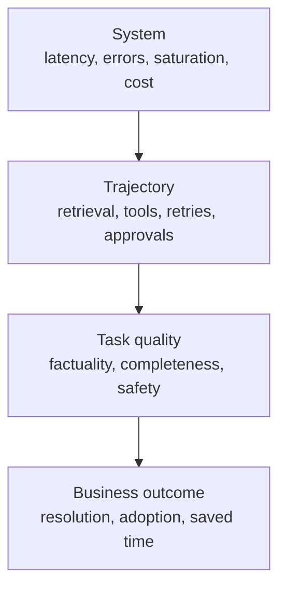

# 生产可观测性、延迟与成本

> 一次绿色的 API 调用，仍可能是一个失败的任务。

> **【中文解读】** 本课回答"仪表盘全绿为什么用户还在投诉"。核心论断：一次绿色的 API 调用仍可能是一个失败的任务——仪表盘度量的是传输成功，产品依赖的是任务成功，可观测性负责把两者连起来。全课沿四层观测展开：系统（延迟、错误、饱和、成本）→ 轨迹（检索、工具、重试、审批）→ 任务质量（事实性、完整性、安全）→ 业务结果（解决率、采用、节省时间）。配套工程手段：日志/指标/追踪各司其职、延迟拆解到每个 span 并盯 P50/P95、按"每次成功结果的成本"算钱、提示词缓存形状、可行动告警、以及用灰度发布限制证据风险。

> **【拓展：可观测性→LLM FinOps 与 SRE 实践】** 本课把传统 SRE 的 SLI/SLO/错误预算词汇搬到 Claude 应用：日志对应结构化事件、指标对应时间聚合、追踪对应分布式链路追踪（OpenTelemetry 的 span 模型），再叠上 LLM 特有的信号——token 用量、缓存读写、检索召回、任务通过率、每次成功成本。它与第 24 课（RAG 管道，质量问题的上游）和第 14 课（评测，把 Agent 行为变成证据）共同构成上线后的证据闭环，也是架构师毕业设计 31/32 的记分卡与金丝雀门的出处。

> 🔗 **【前置】** 学本课前请先掌握：(1) 第 24 课"RAG、检索与数据管道"——本课的检索新鲜度、召回率信号都挂在那条管道上；(2) 第 13 课"安全活在提示词之外"——日志脱敏与"不记录原始密钥"的纪律在本课被复用为可观测性红线。

**类型：** 动手构建
**语言：** Python
**前置条件：** 第 24 课（RAG、检索与数据管道）；Phase 11 第 10 课；Phase 17 第 08、13、27 课
**预计用时：** 约 150 分钟

## 学习目标

- 把系统可靠性、任务质量与业务结果分开。
- 为 Claude 请求与 Agent 轨迹设计日志、指标与追踪。
- 跨模型、检索、工具、队列与重试诊断延迟。
- 度量总成本与每次成功结果的成本。
- 从服务目标出发定义告警与灰度发布门。

## 问题引入

> **【中文解读】** 开篇五个症状对应五类病因，是诊断题的模板：答案用过期来源→检索新鲜度；工具超时后 Agent 静默继续→轨迹级失败被传输成功掩盖；时间戳放在开头导致长提示词错失缓存→缓存形状；P95 翻倍而均值正常→尾部延迟；换便宜模型单价降了但重试和人审变多→每次成功成本。一句话结论：仪表盘度量传输成功，产品依赖任务成功，可观测性必须连接两者。

一个生产仪表盘报告 99.9% 的 API 调用成功。客户仍在抱怨。

模型返回 HTTP 200，但有些答案用的是过期来源。一个工具超时，Agent 静默继续。长提示词因为时间戳被放在开头而错失缓存。P95 延迟翻倍，平均值却看着还行。更便宜的模型压低了单次调用价格，却增加了重试与人工审查。

仪表盘度量的是传输成功。产品依赖的是任务成功。可观测性必须把两者连接起来。

## 核心概念

### 观测四个层面



系统信号告诉你组件是否运行了。轨迹信号告诉你应用做了什么。质量信号告诉你结果是否达到任务要求。业务信号告诉你工作流是否创造了价值。

不要把它们坍缩成一个"success"字段。

### 日志、指标与追踪各司其职

> **【中文解读】** 三件套的分工要背：日志记离散事件，用结构化字段让人能分组过滤；指标做时间聚合，驱动仪表盘与告警；追踪串起完整轨迹，一条 trace 带父子时序地展示模型调用、检索、工具执行、校验、重试与人工审批——没有 trace，一个慢请求只是一块不透明的整体。

日志记录离散事件：请求被接受、检索未返回候选、工具被拒授权、输出未通过 schema 校验、评审者升级。使用结构化字段，让运维人员能分组和过滤。

指标聚合随时间变化的行为：请求率、错误率、P95 延迟、token 用量、缓存命中、检索召回、任务通过率与每次成功成本。它们驱动仪表盘与告警。

追踪连接完整轨迹。一条 trace 应当以父子时序展示模型调用、检索、工具执行、校验、重试与人工审批。没有 trace，一个慢请求看起来只是一块不透明的整体。

### 追踪语义契约

捕获足够复现并分类结果的信息：

- trace、请求、会话与用户安全标识符
- 应用、提示词、模型、工具、知识与评测版本
- 输入类别与风险层级
- token 计数与缓存读写
- 停止原因与工具名
- 工具时长与结构化错误类别
- 校验与策略决定
- 评审器结果与人工修改
- 最终状态与下游结果

不要记录密钥、原始凭据或不必要的个人数据。对敏感输入，存哈希、类别、计数或受访问控制的引用，而不是明文。

### 把系统成功与任务成功分开

系统成功问请求是否按协议完成。任务成功问输出是否达到定义的评分标准。一个合法的 JSON 响应可能在事实上是错的。一个 Agent 可以正常结束却没有完成请求的状态变更。

对 Agent 系统，两者都评估：

- 最终状态：预期的产物或系统状态是否存在？
- 轨迹：工具、权限、证据与预算是否被正确使用？

只做文本匹配两者都会漏掉。

### 拆解延迟

> **【中文解读】** 延迟诊断的公式要背：端到端延迟 = 排队 + 上下文组装 + 模型 + 检索 + 工具 + 校验 + 重试 + 审批。在每个主要 span 上同时盯 P50 与 P95：P50 描述普通路径，P95 暴露慢工具、长上下文、限流与重试。流式体验要计入"首个有用输出时间"。后台与批处理系统度量截止时间完成率与吞吐。

端到端延迟包括：

```text
queue + context assembly + model + retrieval + tools + validation + retries + approval
```

在每个主要 span 上跟踪 P50 与 P95。P50 描述普通路径。P95 暴露慢工具、长上下文、限流与重试。

对流式体验，计入首个有用输出的时间。首 token 时间可以很好看，用户却在等待引用、工具结果或最终通过校验的答案。

对后台与批处理系统，度量截止时间完成率与吞吐。只要整个作业在其业务窗口内完成，一个 30 秒的批处理项也可以接受。

### 从证据出发做优化

常见的延迟干预：

- 把简单工作路由到更快的合适模型
- 削减无关上下文
- 放置稳定的提示词前缀以利用缓存
- 检索更少但更好的候选
- 并发运行相互独立的工具调用
- 把非交互负载移入批处理
- 强制时间、轮次与重试预算
- 在新鲜度允许处缓存确定性工具结果

每一项都可能改变质量或安全性。在代表性评测集上度量这个取舍。

### 度量每次成功结果的成本

> **【中文解读】** 算钱的公式要背：总成本 = 模型 + 缓存读写 + 工具 + 基础设施 + 人工审查 + 纠正；每次成功成本 = 总成本 / 被接受的任务结果。失败请求照样烧钱，安全拒答、重试、评审时间、事故纠正也一样。输入、输出、缓存与工具成本要分开上报。在选模型或架构变体时，真正有意义的比较是每次成功结果的成本。

token 价格只是一个组成部分。

```text
total cost = model + cache writes and reads + tools + infrastructure + review + correction
cost per success = total cost / accepted task outcomes
```

失败请求仍然花钱。安全拒答、重试、评审时间与事故纠正也一样。把输入、输出、缓存与工具成本分开上报，团队才能据此行动。

在选择模型或架构变体时，真正有意义的比较是每次成功结果的成本。

### 理解提示词缓存的形状

提示词缓存复用稳定的前缀。靠近开头的改动可能使其后的一切失效。在当前文档支持该缓存布局时，把稳定的工具定义、系统指令与大型参考资料放在动态用户内容之前。

跟踪缓存读与缓存写 token。一个没有命中率指标的缓存功能开关算不上优化。

工具定义、模型设置、thinking 配置与其他请求变化都可能影响缓存行为。细节会演进，请对照当前官方文档核实。

### 建立可行动的告警

按用户和运维需要做的决策来告警，而不是对每个指标波动都告警。

好的告警包括：

- 任务通过率在一个有意义的窗口内低于 SLO
- 安全控制失效或未授权动作尝试
- P95 延迟超出用户容忍度
- 检索新鲜度滞后
- 工具错误类别激增
- 部署后缓存命中率崩塌
- 每次成功成本超出预算
- 评审器分歧或标签漂移

每条告警都需要负责人、运维手册、证据链接与升级路径。如果没人知道接下来该做什么动作，它就只是仪表盘装饰。

### 用灰度发布限制证据风险

> **【中文解读】** 灰度发布四步要背：先影子评测（无用户影响），再按租户或流量比例小规模金丝雀，然后在自动回滚的保护下扩大，最后通过质量、延迟、成本、安全四道门才全量。与稳定基线比较，并按任务类别分层——一个总体增益可能掩盖某个高风险分层的严重回退。离线评测必要但不充分：生产流量里有新查询、新数据、新负载与新集成。

离线评测是必要的，但不充分。生产流量包含新的查询、数据、负载与集成。

使用：

1. 无用户影响的影子评测。
2. 按租户或流量百分比的小规模金丝雀。
3. 带自动回滚的保护性扩大。
4. 质量、延迟、成本与安全门全部通过后的全量发布。

与稳定基线比较，并按任务类别分层。总体增益可能掩盖某个高风险分层的严重回退。

## 动手构建

## 交互实验室

```figure
26-latency-cost-slo
```

用 SLO 探索器独立改变任务成功率、缓存率、重试成本、P50 与 P95。它暴露这样的变体：更便宜的调用或健康的传输仍然过不了用户、质量或每次成功成本这道门。

## 练习实验室

加一条便宜的失败 trace，观察单价下降的同时每次成功成本上升。然后找出第一个应当挡下发布的门。

## 交付产物

[`outputs/release-scorecard.json`](../outputs/release-scorecard.json) 是一份填好的基线与候选比较：带相互独立的质量、延迟、缓存与经济门。

## 验证

复现并测试该聚合：

```bash
cd certifications/claude/lessons/26-production-observability-latency-and-cost/code
python3 main.py
python3 -m unittest discover tests -v
```

测验检查诊断与灰度发布决策。

## 毕业设计衔接

把记分卡带进架构师专业级毕业设计的评测、可观测性与金丝雀门。

本实验只用 Python 聚合合成 trace 记录。

```bash
cd certifications/claude/lessons/26-production-observability-latency-and-cost/code
python3 main.py
python3 -m unittest discover tests -v
```

### 第 1 步：表示一条任务轨迹

`Trace` 存一份紧凑的端到端记录：变体、延迟、token 计数、成本、系统结果、任务结果、缓存状态与错误类别。生产级 trace 会包含子 span 与受访问控制的引用，而不是一个扁平对象。

### 第 2 步：聚合但不隐藏失败

`summarize` 分开上报系统成功与任务成功。它计算近邻秩 P50 与 P95、缓存读率、错误类别、总成本与每次任务成功成本。失败尝试仍留在成本的分子里。

### 第 3 步：比较变体

`by_variant` 防止带缓存或路由的设计被平均进基线。把质量、延迟与成本放在一起比较。

### 第 4 步：评估服务目标

`evaluate_objectives` 施加最低任务成功率与最高延迟、成本阈值。一个变体必须通过每一道必需的门。不要用更低的成本把安全或质量失败平均掉。

## 运行验证

从一个生产问题开始："发布后任务成功率为什么降了？"

按应用与发布版本过滤 trace。按输入类别分层。先查系统错误，再查检索与工具 span，然后查校验器与评审器结果。比较提示词、模型、知识与工具版本。找出与基线轨迹最早的分叉点。

如果 P95 延迟上升而 P50 稳定，检查慢路径行为：重试、限流、大输入、工具超时与审批等待。如果成本上升而 token 价格稳定，检查调用次数、上下文长度、缓存命中与人工审查。

维护一份发布记分卡：

| 门 | 基线 | 候选 | 要求 |
|------|----------|-----------|----------|
| 任务通过率 | | | 高风险分层无回退 |
| 安全通过率 | | | 硬控制 100% |
| P95 延迟 | | | 在 SLO 内 |
| 每次成功成本 | | | 在预算内 |
| 检索召回 | | | 在容差内 |
| 人工审查分钟数 | | | 无隐藏的工作流负担 |

## 考试决策模式

> **【中文解读】** 考试速判：API 成功率高但用户报告结果差，就补看或检查语义质量与轨迹证据；文档刷新之后开始答错，先追检索链路再考虑换模型。优先选：日志、指标、追踪三者合用；分开传输、任务与业务成功；盯 P95 而不只是均值；比较每次成功结果的成本；给提示词、模型、工具、知识做版本化；用质量、延迟、成本、安全四道门守发布；每条告警都有负责人和手册。

如果 API 成功率很高但用户报告结果差，就补充或检查语义质量与轨迹证据。如果答错之前发生了文档刷新，先追踪检索，再考虑更换模型。

优先选择这样的答案：

- 日志、指标与追踪三者合用。
- 分开传输、任务与业务成功。
- 监控 P95 而不是只看均值。
- 比较每次成功结果的成本。
- 给提示词、模型、工具与知识做版本化。
- 用质量、延迟、成本与安全守发布门。
- 每条告警都有负责人与运维手册。

## 常见陷阱

### 默认记录完整提示词

这可能泄漏个人数据、密钥或受监管内容。记录最小的安全证据，并把敏感引用置于访问控制之下。

### 只有一个总体质量分数

一个总体质量分数可能掩盖按语言、风险层级、任务或客户的回退。要分层。

### 平均延迟

一小批慢请求就能损害体验，而均值保持稳定。跟踪尾部延迟与超时率。

### 每次调用成本

它奖励廉价的失败。改用每次被接受结果的成本，并把审查与纠正算进去。

## 练习

1. 给实验扩展检索与两个工具的子 span。
2. 加入输入风险分层，证明总体改进可能掩盖一次关键回退。
3. 设计一个缓存失效实验，度量命中率、P95 与成本。
4. 为工具授权失败设计一条带负责人与运维手册的告警。
5. 写一条在任何硬控制失败时即回滚的金丝雀策略。

## 关键术语

| 术语 | 人们常说 | 实际含义 |
|------|-----------------|------------------------|
| 日志（Log） | 调试文本 | 带安全证据与标识符的结构化事件 |
| 指标（Metric） | 任何数字 | 随时间聚合、用于理解或控制行为的数据 |
| 追踪（Trace） | 一个请求 ID | 一条完整轨迹的连通时序与结果 |
| 任务成功（Task success） | HTTP 200 | 请求的产出达到了它的评分标准与约束 |
| P95 延迟 | 最慢的请求 | 95% 的被测请求在此值或以内完成 |
| 每次成功成本（Cost per success） | 模型价格 | 总预期成本除以被接受的任务结果数 |

## 延伸阅读

- [Claude usage and cost API documentation](https://platform.claude.com/docs/en/build-with-claude/usage-cost-api) — Claude 用量与成本 API 文档：当前用量上报
- [Prompt caching documentation](https://platform.claude.com/docs/en/build-with-claude/prompt-caching) — 提示词缓存文档：当前缓存行为
- Phase 17 第 13 课 — LLM 可观测性
- Phase 17 第 27 课 — LLM 财务运营
- Phase 17 第 20、21 课 — 渐进式交付与 A/B 测试
