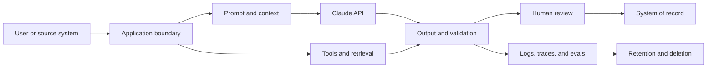

# Enterprise Governance, Compliance, and Human Review | 企业治理、合规与人工审查

> Governance is the system that decides who may take which risk with whose data.

> **【中文解读】** 本课回答"企业环境里谁拍板"。核心定义：治理是决定"谁可以拿谁的数据冒哪种风险"的系统，不是一份政策文档。开篇用医疗场景立规矩：设计文档里写"模型不保留数据、所有输出都有人审、系统符合 HIPAA"——这三句没有一句是架构；合规取决于具体的用途、合同、配置、区域、控制与法律分析，架构师无法用一句话宣布它。全课方法论：先做风险决策，再画数据全链路地图，然后最小化、建控制矩阵（预防/检测/纠正/治理四类）、分层护栏、把人工审查设计成真正的控制（触发、资格、证据包、回退、审计），最后是公平性、可争议性与材料变更触发的重新评估。本课教架构判断，不是法律意见。

> **【拓展：治理→架构师考试的证据链】** 本课把 NIST/ISO 风险管理词汇翻译成 Claude 应用的工程决策：风险登记册对应 RMF 的风险评估、控制矩阵对应控制族、人审设计对应 HITL 控制。它与第 06 课（把权限围绕能力来设计）和第 25 课（集成协议、身份与最小权限）构成治理三部曲：06 课给原则、25 课给集成边界的落法、本课给企业级证据包。交付物 governance-control-packet 直接作为架构师毕业设计 32 的治理与人审章节证据。

> 🔗 **【前置】** 学本课前请先掌握：(1) 第 06 课"把权限围绕能力来设计"——治理的原则层：谁有权批准什么；(2) 第 25 课"集成协议、身份与最小权限"——身份传播、审批能力与执行时授权，本课的控制矩阵建立在这些机制之上。

**Type:** Reference | **类型:** 参考
**Languages:** Python | **语言:** Python
**Prerequisites:** [Put Authority Around Capability](../../06-governance-safety-and-responsible-use/), [Integration Protocols, Identity, and Least Privilege](../../25-integration-protocols-identity-and-least-privilege/); Phase 17, Lesson 26 | **前置知识:** 第 06 课（把权限围绕能力来设计）、第 25 课（集成协议、身份与最小权限）；Phase 17 第 26 课
**Time:** ~150 minutes | **时间:** 约 150 分钟

## Learning Objectives | 学习目标

- Convert policy and regulatory obligations into owned technical controls
  中文翻译：把政策与监管义务转换成有负责人的技术控制。
- Classify data and map it across prompts, tools, storage, logs, and review
  中文翻译：给数据分类，并跨提示词、工具、存储、日志与审查绘制地图。
- Design human review from risk, authority, and reversibility
  中文翻译：从风险、权限与可逆性出发设计人工审查。
- Evaluate bias, fairness, transparency, and contestability in context
  中文翻译：在具体情境中评估偏见、公平性、透明度与可争议性。
- Build evidence for approval, monitoring, incident response, and audit
  中文翻译：为审批、监控、事件响应与审计构建证据。

## The Problem | 问题引入

> **【中文解读】** 开篇三句话要会拆："模型不保留数据"——数据会出现在 API 载荷、文件、缓存、批处理存储、日志、trace、支持系统与评审工具里；"所有输出都有人审"——没说评审者资格、证据、工作量与权限；"系统符合 HIPAA"——合规取决于具体用途、合同、配置、区域、控制与法律分析。正确响应不是自动拒绝，而是一个受治理的设计：数据地图、风险决策、控制负责人、证据，以及按需升级给安全、隐私、法务、临床或合规专家。

A healthcare team proposes a Claude workflow that summarizes patient messages,
recommends a routing category, and drafts a response. The design document says:
"The model does not retain data, all outputs are reviewed by a human, and the
system complies with HIPAA."

> 一个医疗团队提议一个 Claude 工作流：汇总患者消息、推荐一个路由分类、起草回复。设计文档写道："模型不保留数据，所有输出都经人工审查，系统符合 HIPAA。"

None of those statements is an architecture.

> 这些话没有一句是架构。

Data may appear in API payloads, files, caches, batch storage, logs, traces,
support systems, and reviewer tools. "Human review" says nothing about reviewer
qualification, evidence, workload, or authority. Compliance depends on the
specific use, contracts, configuration, region, controls, and legal analysis.
An architect cannot declare it with one sentence.

> 数据可能出现在 API 载荷、文件、缓存、批处理存储、日志、trace、支持系统与评审工具里。"人工审查"没有说明评审者的资格、证据、工作量或权限。合规取决于具体的用途、合同、配置、区域、控制与法律分析。架构师无法用一句话宣布它。

The right response is not automatic rejection. It is a governed design with a
data map, risk decisions, control owners, evidence, and escalation to security,
privacy, legal, clinical, or compliance experts where required.

> 正确的响应不是自动拒绝。而是一个受治理的设计：数据地图、风险决策、控制负责人、证据，以及在需要时升级给安全、隐私、法务、临床或合规专家。

This lesson teaches architecture judgment. It is not legal advice.

> 本课教的是架构判断。它不是法律意见。

## The Concept | 核心概念

### Start With a Risk Decision

Governance begins by identifying:

> 治理从识别以下内容开始：

- decision or action the system influences
  中文翻译：系统影响的决策或动作。
- people who can benefit or be harmed
  中文翻译：可能受益或受害的人。
- data classes involved
  中文翻译：涉及的数据类别。
- error and abuse modes
  中文翻译：错误与滥用模式。
- reversibility
  中文翻译：可逆性。
- required authority
  中文翻译：所需的权限。
- applicable organizational and external obligations
  中文翻译：适用的组织内与外部义务。
- owner who accepts residual risk
  中文翻译：接受残余风险的负责人。

Do not start with a generic list of guardrails. A content filter, approval queue,
or encryption control is valuable only when it addresses a named risk at a
specific boundary.

> 不要从一份通用的护栏清单开始。内容过滤器、审批队列或加密控制，只有当它在特定边界上应对一个被点名的风险时才有价值。

### Map Data Through the Whole System

> **【中文解读】** 数据地图是本课的核心工件：沿"用户/源系统→应用边界→提示词与上下文→Claude API→工具与检索→输出与校验→人工审查→记录系统；日志/trace/评测→保留与删除"把每条边和每个存储都登记起来。要点有二：(1) 每个环节记录数据类别与目的、必要字段、身份与访问、加密与密钥归属、提供商与子处理者边界、区域/驻留要求、保留与删除行为、是否用于模型改进或评测、事件与访问审计证据；(2) 产品特性可以有不同的保留与资格行为——文件、批处理、代码执行、MCP 连接器、托管会话与标准 Messages 请求未必共享同一边界，要按当前官方文档与协议核实确切组合。



For each edge and store, record:

> 对每条边和每个存储，记录：

- data category and purpose
  中文翻译：数据类别与目的。
- source and data subject where relevant
  中文翻译：相关时的来源与数据主体。
- fields required versus optional
  中文翻译：必要字段与可选字段。
- identity and access
  中文翻译：身份与访问。
- encryption and key ownership
  中文翻译：加密与密钥归属。
- provider and subprocessor boundary
  中文翻译：提供商与子处理者边界。
- region or residency requirement
  中文翻译：区域或数据驻留要求。
- retention and deletion behavior
  中文翻译：保留与删除行为。
- use in model improvement or evaluation
  中文翻译：是否用于模型改进或评测。
- incident and access-audit evidence
  中文翻译：事件与访问审计证据。

Product features can have different retention and eligibility behavior. Files,
batch processing, code execution, MCP connectors, hosted sessions, and standard
Messages requests may not share the same boundary. Check current official
documentation and your agreement for the exact feature combination.

> 产品特性可能有不同的保留与资格行为。文件、批处理、代码执行、MCP 连接器、托管会话与标准 Messages 请求未必共享同一边界。请对照当前官方文档与你的协议核实确切的特性组合。

### Minimize Before Protecting

> **【中文解读】** 顺序要背：先删掉任务不需要的字段，再做假名化或聚合，再按明确要求限制特性或提供商边界，再收窄身份、scope、保留与日志，最后才用加密、监控与事件控制保护剩余数据。"告诉 Claude 别记住"不是保留控制——保留由配置与合同行为定义。这与第 26 课"默认不记完整提示词"是同一条纪律。

Security controls are stronger when unnecessary data never enters the system.

> 当不必要的数据从不进入系统时，安全控制会更强。

Apply this order:

> 按此顺序执行：

1. Remove fields the task does not need.
   中文翻译：删除任务不需要的字段。
2. Pseudonymize or aggregate where identity is not required.
   中文翻译：不需要身份之处做假名化或聚合。
3. Restrict the feature or provider boundary from explicit requirements.
   中文翻译：按明确要求限制特性或提供商边界。
4. Limit identity, scope, retention, and logs.
   中文翻译：收窄身份、scope、保留与日志。
5. Protect remaining data with encryption, monitoring, and incident controls.
   中文翻译：用加密、监控与事件控制保护剩余数据。

"Tell Claude not to remember" is not a retention control. Configuration and
contractual behavior define retention.

> "告诉 Claude 别记住"不是保留控制。保留由配置与合同行为定义。

### Build a Control Matrix

Controls fall into several types.

> 控制分为几种类型。

| Type | Purpose | Example |
|------|---------|---------|
| Preventive | Stop an unsafe event | Scope gate blocks an unauthorized write |
| Detective | Reveal a problem | Alert on sensitive-field leakage in sampled outputs |
| Corrective | Limit or repair harm | Revoke access, roll back model route, correct affected record |
| Governance | Assign and review authority | Named owner re-approves the use case after material change |

For each control, record owner, implementation, evidence, test, failure response,
and review frequency. A control without an owner and test is a hope.

> 对每项控制，记录负责人、实现、证据、测试、失效响应与复审频率。没有负责人和测试的控制只是一厢情愿。

### Layer Model and System Guardrails

Use several boundaries:

> 使用多层边界：

- input validation and classification
  中文翻译：输入校验与分类。
- trusted-source separation from untrusted content
  中文翻译：受信任来源与不可信内容的分离。
- prompt instructions and examples
  中文翻译：提示词指令与示例。
- minimal tool exposure
  中文翻译：最小的工具暴露。
- authentication and authorization
  中文翻译：认证与授权。
- schema and semantic output validation
  中文翻译：schema 与语义输出校验。
- action limits and approvals
  中文翻译：动作限制与审批。
- post-deployment monitoring and red-team tests
  中文翻译：部署后监控与红队测试。

Prompt guardrails influence generation. System guardrails enforce invariants.
Neither replaces the other.

> 提示词护栏影响生成。系统护栏强制不变式。谁也替代不了谁。

### Design Human Review as a Control

> **【中文解读】** 人审是不是真控制，取决于评审者能否改进决策，以及是否拥有这样做所需的信息、时间、能力与权限。设计要素要背：触发（风险类别、低证据、冲突、不确定或抽样）、评审者（角色与资格）、证据包（来源证据、模型输出、工具轨迹、标记与拟执行动作）、决定（批准/修改/拒绝/升级/要证据）、服务级别（时间预算与队列容量）、回退（审查不可用时的安全行为）、审计（身份、理由、时间戳与最终动作）。要防自动化偏见：给评审者一个检查证据的理由，而不是一个鼓励盖章的漂亮答案——先展示来源摘录再展示生成结论，或要求结构化理由码。

Human-in-the-loop is useful when the reviewer can improve the decision and has
the information, time, competence, and authority to do it.

> 当评审者能改进决策、并拥有这样做所需的信息、时间、能力与权限时，人工介入才有用。

Define:

> 定义：

- trigger: risk class, low evidence, conflict, uncertainty, or sampled case
  中文翻译：触发：风险类别、证据不足、冲突、不确定或抽样案例。
- reviewer: role and qualification
  中文翻译：评审者：角色与资格。
- packet: source evidence, model output, tool trajectory, flags, and proposed action
  中文翻译：证据包：来源证据、模型输出、工具轨迹、标记与拟执行动作。
- decision: approve, edit, reject, escalate, or request evidence
  中文翻译：决定：批准、修改、拒绝、升级或索要证据。
- service level: time budget and queue capacity
  中文翻译：服务级别：时间预算与队列容量。
- fallback: safe behavior if review is unavailable
  中文翻译：回退：审查不可用时的安全行为。
- audit: identity, rationale, timestamp, and final action
  中文翻译：审计：身份、理由、时间戳与最终动作。

Avoid automation bias. Reviewers need a reason to inspect the evidence, not a
polished answer that encourages rubber-stamping. Consider showing source excerpts
before generated conclusions, or requiring structured reason codes.

> 避免自动化偏见。评审者需要一个检查证据的理由，而不是一个鼓励草率盖章的漂亮答案。可以考虑先展示来源摘录再展示生成结论，或要求结构化的理由码。

### Match Review to Risk

| Risk | Example | Review pattern |
|------|---------|----------------|
| Low | Internal draft with easy undo | Automated checks plus sampled review |
| Medium | Customer-facing recommendation | Threshold or exception review |
| High | Financial, legal, clinical, or destructive action | Qualified approval before action |
| Unknown | New use case or weak evidence | Hold, escalate, and gather evidence |

Confidence emitted by the same model is not a reliable safety boundary. Use
observable evidence, calibrated evaluators, deterministic conditions, and
qualified review.

> 同一个模型发出的置信度不是可靠的安全边界。使用可观察的证据、校准过的评审器、确定性条件与有资格的审查。

### Treat Fairness as a Contextual Requirement

> **【中文解读】** 公平性不是唯一普适指标。要问：在做什么决策？哪些群体可能经历不同的错误率或访问？哪些受保护或敏感属性是显式的、推断的还是代理的？哪个公平定义符合法律与伦理情境？与准确率、隐私、个体对待有何取舍？谁有权选择并复审标准？在合适处测试代表性切片与交叉群体；小样本带来的不确定性应被报告而不是隐藏。不同公平定义可能互相冲突，从情境、法律、伤害与干系人决策中选择，然后报告取舍。

Bias means systematic error or representation that can disadvantage people.
Fairness is not one universal metric.

> 偏见指可能使人处于不利地位的系统性错误或表征。公平性不是唯一普适指标。

Ask:

> 要问：

- What decision is being made?
  中文翻译：正在做什么决策？
- Which groups may experience different error rates or access?
  中文翻译：哪些群体可能经历不同的错误率或访问？
- Which protected or sensitive attributes are present, inferred, or proxied?
  中文翻译：哪些受保护或敏感属性是显式的、推断的还是代理的？
- Which fairness definition fits the legal and ethical context?
  中文翻译：哪个公平定义符合法律与伦理情境？
- What tradeoffs exist with accuracy, privacy, and individual treatment?
  中文翻译：与准确率、隐私、个体对待之间存在什么取舍？
- Who has authority to choose and review the criterion?
  中文翻译：谁有权选择并复审该标准？

Test representative slices and intersectional groups where appropriate. Small
sample sizes create uncertainty, which should be reported rather than hidden.

> 在合适处测试代表性切片与交叉群体。小样本带来不确定性，应当被报告而不是隐藏。

### Provide Transparency and Contestability

People need different explanations.

> 不同的人需要不同的解释。

- End users need to know when AI materially influences an interaction and how
  to challenge a harmful outcome.
  中文翻译：终端用户需要知道 AI 何时实质影响了交互，以及如何挑战有害结果。
- Reviewers need evidence, uncertainty, and control context.
  中文翻译：评审者需要证据、不确定性与控制上下文。
- Operators need versions, traces, and failure categories.
  中文翻译：运维人员需要版本、trace 与失败类别。
- Auditors need policy mapping, tests, ownership, and retained evidence.
  中文翻译：审计人员需要政策映射、测试、归属与留存证据。
- Executives need residual risk, business impact, and decision status.
  中文翻译：高管需要残余风险、业务影响与决策状态。

Do not expose chain-of-thought or sensitive system instructions as an
explanation. Provide source-based reasons, applied rules, relevant factors, and
the human appeal path.

> 不要把思维链或敏感的系统指令当作解释公开。提供基于来源的理由、被应用的规则、相关因素与人工申诉路径。

### Plan for Change

Reassess when any material element changes:

> 任何材料要素变化时重新评估：

- use case or affected population
  中文翻译：用例或受影响人群。
- model or provider
  中文翻译：模型或提供商。
- prompt or tool authority
  中文翻译：提示词或工具权限。
- data source, retention, or region
  中文翻译：数据来源、保留或区域。
- evaluation result or incident pattern
  中文翻译：评测结果或事件模式。
- law, policy, or contract
  中文翻译：法律、政策或合同。
- deployment scale
  中文翻译：部署规模。

Version the risk assessment and control evidence. A launch approval does not
cover an unrelated future system.

> 给风险评估与控制证据做版本化。一次上线审批覆盖不了未来一个不相关的系统。

## Build It | 动手构建

## Interactive Lab | 交互实验室

```figure
27-governance-approval-flow
```

Use the approval-flow explorer to vary consequence, reversibility, evidence,
reviewer qualification, queue capacity, and fallback. It makes visible when a
human review label is a real control and when it is only a bottleneck.

> 用审批流探索器改变后果、可逆性、证据、评审者资格、队列容量与回退。它让人看清：什么时候"人工审查"标签是一个真控制，什么时候它只是一个瓶颈。

## Practice Lab | 练习实验室

Remove the review fallback or one control owner from a copy of the packet,
observe the blocked state, and repair the governance design.

> 从证据包副本中移除审查回退或某个控制负责人，观察被拦截的状态，然后修复治理设计。

## Shipped Artifact | 交付产物

The filled [`outputs/governance-control-packet.md`](../outputs/governance-control-packet.md)
contains a risk register, data boundary, preventive, detective, corrective, and
governance controls, plus a staffed approval path.

> 填好的 `outputs/governance-control-packet.md` 包含风险登记册、数据边界、预防/检测/纠正/治理四类控制，以及一条有人员配备的审批路径。

## Verify It | 验证

Verify its ownership and failure response deterministically:

> 确定性地验证它的归属与失效响应：

```bash
cd certifications/claude/lessons/27-enterprise-governance-compliance-and-hitl
python3 code/main.py
python3 -m unittest discover -s code/tests -v
```

The quiz checks governance and reassessment decisions.

> 测验检查治理与重新评估决策。

## Capstone Connection | 毕业设计衔接

Carry this packet into the Architect Professional capstone's governance and
human-review section.

> 把这个证据包带进架构师专业级毕业设计的治理与人工审查章节。

Create a governance packet for a high-impact Claude workflow.

> 为一个高影响的 Claude 工作流创建治理证据包。

### Step 1: Risk Register

```markdown
| Risk | Cause | Affected party | Impact | Likelihood | Control | Owner | Residual risk |
|------|-------|----------------|--------|------------|---------|-------|---------------|
```

Include accidental failure, misuse, prompt injection, insider access, dependency
failure, stale knowledge, unfair performance, and reviewer overload.

> 覆盖意外失败、滥用、提示词注入、内部人员访问、依赖故障、过期知识、不公平表现与评审者过载。

### Step 2: Data Map

List every payload, store, log, cache, evaluation set, human interface, and
external service. Mark data purpose, minimum fields, retention, deletion,
identity, region, and contractual boundary.

> 列出每个载荷、存储、日志、缓存、评测集、人工界面与外部服务。标注数据目的、最小字段、保留、删除、身份、区域与合同边界。

### Step 3: Control Matrix

```markdown
| Control | Risk addressed | Boundary | Owner | Evidence | Test | On failure |
|---------|----------------|----------|-------|----------|------|------------|
```

Include at least one preventive, detective, corrective, and governance control.

> 至少包含一个预防、检测、纠正与治理控制。

### Step 4: Human Review Design

Specify triggers, reviewer qualifications, evidence packet, actions, queue SLO,
fallback, and audit record. Calculate expected review volume. If the queue cannot
meet the SLO, the design is incomplete.

> 指定触发条件、评审者资格、证据包、动作、队列 SLO、回退与审计记录。计算预期审查量。如果队列满足不了 SLO，设计就是不完整的。

### Step 5: Approval and Reassessment

Name the technical, security, privacy, domain, and business decisions that need
separate owners. Define material-change triggers and the next review date.

> 点名需要独立负责人的技术、安全、隐私、领域与业务决策。定义材料变更触发条件与下次复审日期。

## Use It | 运行验证

For the patient-message workflow, a safer first release might draft a routing
recommendation for a qualified reviewer without sending a response or changing
the medical record. It uses minimum necessary fields, trusted clinical sources,
strict tenant and role authorization, source-linked output, high-risk keyword
and evidence checks, and a safe fallback when the reviewer queue is unavailable.

> 对患者消息工作流，更安全的首发可以是：为有资格的评审者起草一个路由建议，而不发送回复、不修改病历。它使用最小必要字段、受信任的临床来源、严格的租户与角色授权、带来源链接的输出、高风险关键词与证据检查，以及评审者队列不可用时的安全回退。

The team then validates:

> 团队随后验证：

- task accuracy by message class
  中文翻译：按消息类别统计的任务准确率。
- false-negative behavior for urgent cases
  中文翻译：紧急案例的漏报行为。
- demographic and language slices where permitted and appropriate
  中文翻译：在允许且合适处的人群与语言切片。
- source support and stale-data handling
  中文翻译：来源支持与过期数据处理。
- reviewer agreement, time, and overrides
  中文翻译：评审者一致性、耗时与推翻情况。
- privacy, access, retention, and deletion controls
  中文翻译：隐私、访问、保留与删除控制。
- incident, rollback, and audit behavior
  中文翻译：事件、回滚与审计行为。

Legal, privacy, security, and clinical owners decide whether the resulting
evidence satisfies the applicable obligations. The architect supplies the map,
controls, tests, and residual-risk statement.

> 法务、隐私、安全与临床负责人决定所得证据是否满足适用义务。架构师提供地图、控制、测试与残余风险声明。

## Exam Decision Patterns | 考试决策模式

> **【中文解读】** 考试速判：场景含受监管或敏感数据时，不要推断"内部使用就自动允许"——先最小化、分类、核实政策与合同、再请对口的权威参与。优先选：移除或匿名化不必要的标识符；映射按特性的数据边界与保留；分层模型与确定性控制；高影响动作绑定有资格的审批；测试代表性切片与对抗案例；提供证据与申诉/升级路径；点名控制负责人与重新评估触发条件。拒绝把提示词、模型置信度、泛泛的审查或厂商声明当成完整治理的答案。

When a scenario includes regulated or sensitive data, do not infer that an
internal use is automatically allowed. Minimize, classify, verify policy and
contract, and involve the proper authority.

> 当场景包含受监管或敏感数据时，不要推断内部使用就自动被允许。最小化、分类、核实政策与合同，并让对口权威参与。

Prefer answers that:

> 优先选择这样的答案：

- remove or anonymize unnecessary identifiers
  中文翻译：移除或匿名化不必要的标识符。
- map feature-specific data boundaries and retention
  中文翻译：映射按特性的数据边界与保留。
- layer model and deterministic controls
  中文翻译：分层模型与确定性控制。
- bind high-impact actions to qualified approval
  中文翻译：把高影响动作绑定到有资格的审批。
- test representative slices and adverse cases
  中文翻译：测试代表性切片与对抗案例。
- provide evidence and an appeal or escalation path
  中文翻译：提供证据与申诉或升级路径。
- name control owners and reassessment triggers
  中文翻译：点名控制负责人与重新评估触发条件。

Avoid answers that treat a prompt, model confidence, generic review, or vendor
claim as complete governance.

> 避免把提示词、模型置信度、泛泛的审查或厂商声明当作完整治理的答案。

## Common Traps | 常见陷阱

### Compliance by Product Name

Eligibility can depend on feature, configuration, agreement, region, and data
flow. Verify the exact architecture.

> 资格可能取决于特性、配置、协议、区域与数据流。核实确切的架构。

### Human Review as a Checkbox

An unqualified or overloaded reviewer without evidence cannot reliably reduce
risk.

> 一个没有资格、没有证据、超负荷的评审者无法可靠地降低风险。

### Logging for Audit Without Minimization

Verbose logs can create a new sensitive data store. Retain the minimum evidence
under appropriate access and deletion controls.

> 冗长的日志可能造出一个新的敏感数据存储。在合适的访问与删除控制下保留最小的证据。

### One Fairness Metric

Different fairness definitions can conflict. Choose from context, law, harm, and
stakeholder decision, then report tradeoffs.

> 不同的公平定义可能互相冲突。从情境、法律、伤害与干系人决策中选择，然后报告取舍。

## Exercises | 练习

1. Build a data map for a support workflow using files, an MCP connector, batch
   evaluation, and human review.
   中文翻译：为一个使用文件、MCP 连接器、批量评测与人工审查的客服工作流构建数据地图。
2. Design a review queue for 10,000 daily tasks with a 5 percent trigger rate and
   calculate staffing assumptions.
   中文翻译：为每日 10,000 个任务、5% 触发率设计一个审查队列，并计算人员配备假设。
3. Write a control test that proves unauthorized tenant data never reaches model
   context.
   中文翻译：写一个控制测试，证明未授权的租户数据从不进入模型上下文。
4. Define a contestability path for a user harmed by an AI-assisted decision.
   中文翻译：为被 AI 辅助决策伤害的用户定义一条可争议性路径。
5. Create material-change criteria that force governance reassessment.
   中文翻译：创建能强制触发治理重新评估的材料变更标准。

## Key Terms | 关键术语

| Term | What people say | What it actually means |
|------|-----------------|------------------------|
| Governance | A policy document | Decisions, ownership, controls, evidence, and review over a system lifecycle |
| Data minimization | Encrypt everything | Do not collect or send fields the purpose does not require |
| Human-in-the-loop | A person sees output | A defined control with trigger, qualified owner, evidence, authority, and fallback |
| Residual risk | A hidden problem | Risk remaining after controls, explicitly accepted by an authorized owner |
| Fairness | Equal accuracy | A context-specific criterion with tradeoffs and affected stakeholders |
| Contestability | Customer support | A meaningful path to challenge, review, and correct an outcome |

## Further Reading | 延伸阅读

- [Claude API data retention documentation](https://platform.claude.com/docs/en/manage-claude/api-and-data-retention) for current feature-specific boundaries
  中文翻译：Claude API 数据保留文档——当前按特性的边界
- [Anthropic Trust Center](https://trust.anthropic.com/) for current security and compliance materials
  中文翻译：Anthropic 信任中心——当前安全与合规材料
- [Claude's Constitution](https://www.anthropic.com/constitution) for Anthropic's public model-behavior framework
  中文翻译：Claude 的宪法——Anthropic 公开的模型行为框架
- Phase 17, Lesson 26 for compliance architecture
  中文翻译：Phase 17 第 26 课——合规架构
- Phase 18, Lessons 20 and 21 for bias and fairness
  中文翻译：Phase 18 第 20、21 课——偏见与公平性
