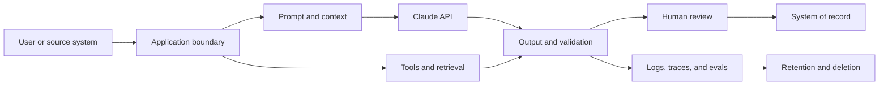

# 企业治理、合规与人工审查

> 治理是决定"谁可以拿谁的数据冒哪种风险"的系统。

> **【中文解读】** 本课回答"企业环境里谁拍板"。核心定义：治理是决定"谁可以拿谁的数据冒哪种风险"的系统，不是一份政策文档。开篇用医疗场景立规矩：设计文档里写"模型不保留数据、所有输出都有人审、系统符合 HIPAA"——这三句没有一句是架构；合规取决于具体的用途、合同、配置、区域、控制与法律分析，架构师无法用一句话宣布它。全课方法论：先做风险决策，再画数据全链路地图，然后最小化、建控制矩阵（预防/检测/纠正/治理四类）、分层护栏、把人工审查设计成真正的控制（触发、资格、证据包、回退、审计），最后是公平性、可争议性与材料变更触发的重新评估。本课教架构判断，不是法律意见。

> **【拓展：治理→架构师考试的证据链】** 本课把 NIST/ISO 风险管理词汇翻译成 Claude 应用的工程决策：风险登记册对应 RMF 的风险评估、控制矩阵对应控制族、人审设计对应 HITL 控制。它与第 06 课（把权限围绕能力来设计）和第 25 课（集成协议、身份与最小权限）构成治理三部曲：06 课给原则、25 课给集成边界的落法、本课给企业级证据包。交付物 governance-control-packet 直接作为架构师毕业设计 32 的治理与人审章节证据。

> 🔗 **【前置】** 学本课前请先掌握：(1) 第 06 课"把权限围绕能力来设计"——治理的原则层：谁有权批准什么；(2) 第 25 课"集成协议、身份与最小权限"——身份传播、审批能力与执行时授权，本课的控制矩阵建立在这些机制之上。

**类型：** 参考
**语言：** Python
**前置条件：** 第 06 课（把权限围绕能力来设计）、第 25 课（集成协议、身份与最小权限）；Phase 17 第 26 课
**预计用时：** 约 150 分钟

## 学习目标

- 把政策与监管义务转换成有负责人的技术控制。
- 给数据分类，并跨提示词、工具、存储、日志与审查绘制地图。
- 从风险、权限与可逆性出发设计人工审查。
- 在具体情境中评估偏见、公平性、透明度与可争议性。
- 为审批、监控、事件响应与审计构建证据。

## 问题引入

> **【中文解读】** 开篇三句话要会拆："模型不保留数据"——数据会出现在 API 载荷、文件、缓存、批处理存储、日志、trace、支持系统与评审工具里；"所有输出都有人审"——没说评审者资格、证据、工作量与权限；"系统符合 HIPAA"——合规取决于具体用途、合同、配置、区域、控制与法律分析。正确响应不是自动拒绝，而是一个受治理的设计：数据地图、风险决策、控制负责人、证据，以及按需升级给安全、隐私、法务、临床或合规专家。

一个医疗团队提议一个 Claude 工作流：汇总患者消息、推荐一个路由分类、起草回复。设计文档写道："模型不保留数据，所有输出都经人工审查，系统符合 HIPAA。"

这些话没有一句是架构。

数据可能出现在 API 载荷、文件、缓存、批处理存储、日志、trace、支持系统与评审工具里。"人工审查"没有说明评审者的资格、证据、工作量或权限。合规取决于具体的用途、合同、配置、区域、控制与法律分析。架构师无法用一句话宣布它。

正确的响应不是自动拒绝。而是一个受治理的设计：数据地图、风险决策、控制负责人、证据，以及在需要时升级给安全、隐私、法务、临床或合规专家。

本课教的是架构判断。它不是法律意见。

## 核心概念

### 从风险决策开始

治理从识别以下内容开始：

- 系统影响的决策或动作
- 可能受益或受害的人
- 涉及的数据类别
- 错误与滥用模式
- 可逆性
- 所需的权限
- 适用的组织内与外部义务
- 接受残余风险的负责人

不要从一份通用的护栏清单开始。内容过滤器、审批队列或加密控制，只有当它在特定边界上应对一个被点名的风险时才有价值。

### 把数据映射到整个系统

> **【中文解读】** 数据地图是本课的核心工件：把每条边和每个存储都登记起来。要点有二：(1) 每个环节记录数据类别与目的、必要字段、身份与访问、加密与密钥归属、提供商与子处理者边界、区域/驻留要求、保留与删除行为、是否用于模型改进或评测、事件与访问审计证据；(2) 产品特性可以有不同的保留与资格行为——文件、批处理、代码执行、MCP 连接器、托管会话与标准 Messages 请求未必共享同一边界，要按当前官方文档与协议核实确切组合。



对每条边和每个存储，记录：

- 数据类别与目的
- 相关时的来源与数据主体
- 必要字段与可选字段
- 身份与访问
- 加密与密钥归属
- 提供商与子处理者边界
- 区域或数据驻留要求
- 保留与删除行为
- 是否用于模型改进或评测
- 事件与访问审计证据

产品特性可能有不同的保留与资格行为。文件、批处理、代码执行、MCP 连接器、托管会话与标准 Messages 请求未必共享同一边界。请对照当前官方文档与你的协议核实确切的特性组合。

### 先最小化，再保护

> **【中文解读】** 顺序要背：先删掉任务不需要的字段，再做假名化或聚合，再按明确要求限制特性或提供商边界，再收窄身份、scope、保留与日志，最后才用加密、监控与事件控制保护剩余数据。"告诉 Claude 别记住"不是保留控制——保留由配置与合同行为定义。这与第 26 课"默认不记完整提示词"是同一条纪律。

当不必要的数据从不进入系统时，安全控制会更强。

按此顺序执行：

1. 删除任务不需要的字段。
2. 不需要身份之处做假名化或聚合。
3. 按明确要求限制特性或提供商边界。
4. 收窄身份、scope、保留与日志。
5. 用加密、监控与事件控制保护剩余数据。

"告诉 Claude 别记住"不是保留控制。保留由配置与合同行为定义。

### 建立控制矩阵

控制分为几种类型。

| 类型 | 目的 | 示例 |
|------|---------|---------|
| 预防（Preventive） | 阻止不安全事件 | scope 门拦截一次未授权写入 |
| 检测（Detective） | 揭示问题 | 对抽样输出中敏感字段泄漏告警 |
| 纠正（Corrective） | 限制或修复伤害 | 撤销访问、回滚模型路由、修正受影响记录 |
| 治理（Governance） | 分配并复审权限 | 指定负责人在材料变更后重新审批该用例 |

对每项控制，记录负责人、实现、证据、测试、失效响应与复审频率。没有负责人和测试的控制只是一厢情愿。

### 分层模型护栏与系统护栏

使用多层边界：

- 输入校验与分类
- 受信任来源与不可信内容的分离
- 提示词指令与示例
- 最小的工具暴露
- 认证与授权
- schema 与语义输出校验
- 动作限制与审批
- 部署后监控与红队测试

提示词护栏影响生成。系统护栏强制不变式。谁也替代不了谁。

### 把人工审查设计成一种控制

> **【中文解读】** 人审是不是真控制，取决于评审者能否改进决策，以及是否拥有这样做所需的信息、时间、能力与权限。要防自动化偏见：给评审者一个检查证据的理由，而不是一个鼓励盖章的漂亮答案——先展示来源摘录再展示生成结论，或要求结构化理由码。

当评审者能改进决策、并拥有这样做所需的信息、时间、能力与权限时，人工介入才有用。

定义：

- 触发：风险类别、证据不足、冲突、不确定或抽样案例。
- 评审者：角色与资格。
- 证据包：来源证据、模型输出、工具轨迹、标记与拟执行动作。
- 决定：批准、修改、拒绝、升级或索要证据。
- 服务级别：时间预算与队列容量。
- 回退：审查不可用时的安全行为。
- 审计：身份、理由、时间戳与最终动作。

避免自动化偏见。评审者需要一个检查证据的理由，而不是一个鼓励草率盖章的漂亮答案。可以考虑先展示来源摘录再展示生成结论，或要求结构化的理由码。

### 让审查匹配风险

| 风险 | 示例 | 审查模式 |
|------|---------|----------------|
| 低 | 易撤销的内部草稿 | 自动化检查加抽样审查 |
| 中 | 面向客户的推荐 | 阈值或异常审查 |
| 高 | 金融、法律、临床或破坏性动作 | 动作前经有资格者审批 |
| 未知 | 新用例或证据薄弱 | 暂停、升级并收集证据 |

同一个模型发出的置信度不是可靠的安全边界。使用可观察的证据、校准过的评审器、确定性条件与有资格的审查。

### 把公平性当作情境化要求

> **【中文解读】** 公平性不是唯一普适指标。要问：在做什么决策？哪些群体可能经历不同的错误率或访问？哪些受保护或敏感属性是显式的、推断的还是代理的？哪个公平定义符合法律与伦理情境？与准确率、隐私、个体对待有何取舍？谁有权选择并复审标准？小样本带来的不确定性应被报告而不是隐藏；不同公平定义可能互相冲突，从情境、法律、伤害与干系人决策中选择，然后报告取舍。

偏见指可能使人处于不利地位的系统性错误或表征。公平性不是唯一普适指标。

要问：

- 正在做什么决策？
- 哪些群体可能经历不同的错误率或访问？
- 哪些受保护或敏感属性是显式的、推断的还是代理的？
- 哪个公平定义符合法律与伦理情境？
- 与准确率、隐私、个体对待之间存在什么取舍？
- 谁有权选择并复审该标准？

在合适处测试代表性切片与交叉群体。小样本带来不确定性，应当被报告而不是隐藏。

### 提供透明度与可争议性

不同的人需要不同的解释。

- 终端用户需要知道 AI 何时实质影响了交互，以及如何挑战有害结果。
- 评审者需要证据、不确定性与控制上下文。
- 运维人员需要版本、trace 与失败类别。
- 审计人员需要政策映射、测试、归属与留存证据。
- 高管需要残余风险、业务影响与决策状态。

不要把思维链或敏感的系统指令当作解释公开。提供基于来源的理由、被应用的规则、相关因素与人工申诉路径。

### 为变更做计划

任何材料要素变化时重新评估：

- 用例或受影响人群
- 模型或提供商
- 提示词或工具权限
- 数据来源、保留或区域
- 评测结果或事件模式
- 法律、政策或合同
- 部署规模

给风险评估与控制证据做版本化。一次上线审批覆盖不了未来一个不相关的系统。

## 动手构建

## 交互实验室

```figure
27-governance-approval-flow
```

用审批流探索器改变后果、可逆性、证据、评审者资格、队列容量与回退。它让人看清：什么时候"人工审查"标签是一个真控制，什么时候它只是一个瓶颈。

## 练习实验室

从证据包副本中移除审查回退或某个控制负责人，观察被拦截的状态，然后修复治理设计。

## 交付产物

填好的 [`outputs/governance-control-packet.md`](../outputs/governance-control-packet.md) 包含风险登记册、数据边界、预防/检测/纠正/治理四类控制，以及一条有人员配备的审批路径。

## 验证

确定性地验证它的归属与失效响应：

```bash
cd certifications/claude/lessons/27-enterprise-governance-compliance-and-hitl
python3 code/main.py
python3 -m unittest discover -s code/tests -v
```

测验检查治理与重新评估决策。

## 毕业设计衔接

把这个证据包带进架构师专业级毕业设计的治理与人工审查章节。

为一个高影响的 Claude 工作流创建治理证据包。

### 第 1 步：风险登记册

```markdown
| Risk | Cause | Affected party | Impact | Likelihood | Control | Owner | Residual risk |
|------|-------|----------------|--------|------------|---------|-------|---------------|
```

覆盖意外失败、滥用、提示词注入、内部人员访问、依赖故障、过期知识、不公平表现与评审者过载。

### 第 2 步：数据地图

列出每个载荷、存储、日志、缓存、评测集、人工界面与外部服务。标注数据目的、最小字段、保留、删除、身份、区域与合同边界。

### 第 3 步：控制矩阵

```markdown
| Control | Risk addressed | Boundary | Owner | Evidence | Test | On failure |
|---------|----------------|----------|-------|----------|------|------------|
```

至少包含一个预防、检测、纠正与治理控制。

### 第 4 步：人工审查设计

指定触发条件、评审者资格、证据包、动作、队列 SLO、回退与审计记录。计算预期审查量。如果队列满足不了 SLO，设计就是不完整的。

### 第 5 步：审批与重新评估

点名需要独立负责人的技术、安全、隐私、领域与业务决策。定义材料变更触发条件与下次复审日期。

## 运行验证

对患者消息工作流，更安全的首发可以是：为有资格的评审者起草一个路由建议，而不发送回复、不修改病历。它使用最小必要字段、受信任的临床来源、严格的租户与角色授权、带来源链接的输出、高风险关键词与证据检查，以及评审者队列不可用时的安全回退。

团队随后验证：

- 按消息类别统计的任务准确率
- 紧急案例的漏报行为
- 在允许且合适处的人群与语言切片
- 来源支持与过期数据处理
- 评审者一致性、耗时与推翻情况
- 隐私、访问、保留与删除控制
- 事件、回滚与审计行为

法务、隐私、安全与临床负责人决定所得证据是否满足适用义务。架构师提供地图、控制、测试与残余风险声明。

## 考试决策模式

> **【中文解读】** 考试速判：场景含受监管或敏感数据时，不要推断"内部使用就自动允许"——先最小化、分类、核实政策与合同、再请对口的权威参与。优先选：移除或匿名化不必要的标识符；映射按特性的数据边界与保留；分层模型与确定性控制；高影响动作绑定有资格的审批；测试代表性切片与对抗案例；提供证据与申诉/升级路径；点名控制负责人与重新评估触发条件。拒绝把提示词、模型置信度、泛泛的审查或厂商声明当成完整治理的答案。

当场景包含受监管或敏感数据时，不要推断内部使用就自动被允许。最小化、分类、核实政策与合同，并让对口权威参与。

优先选择这样的答案：

- 移除或匿名化不必要的标识符。
- 映射按特性的数据边界与保留。
- 分层模型与确定性控制。
- 把高影响动作绑定到有资格的审批。
- 测试代表性切片与对抗案例。
- 提供证据与申诉或升级路径。
- 点名控制负责人与重新评估触发条件。

避免把提示词、模型置信度、泛泛的审查或厂商声明当作完整治理的答案。

## 常见陷阱

### 按产品名宣布合规

资格可能取决于特性、配置、协议、区域与数据流。核实确切的架构。

### 把人工审查当打卡

一个没有资格、没有证据、超负荷的评审者无法可靠地降低风险。

### 为审计而记录但不做最小化

冗长的日志可能造出一个新的敏感数据存储。在合适的访问与删除控制下保留最小的证据。

### 只用一个公平性指标

不同的公平定义可能互相冲突。从情境、法律、伤害与干系人决策中选择，然后报告取舍。

## 练习

1. 为一个使用文件、MCP 连接器、批量评测与人工审查的客服工作流构建数据地图。
2. 为每日 10,000 个任务、5% 触发率设计一个审查队列，并计算人员配备假设。
3. 写一个控制测试，证明未授权的租户数据从不进入模型上下文。
4. 为被 AI 辅助决策伤害的用户定义一条可争议性路径。
5. 创建能强制触发治理重新评估的材料变更标准。

## 关键术语

| 术语 | 人们常说 | 实际含义 |
|------|-----------------|------------------------|
| 治理（Governance） | 一份政策文档 | 覆盖系统生命周期的决策、归属、控制、证据与复审 |
| 数据最小化（Data minimization） | 把一切加密 | 不收集、不发送目的所不需要的字段 |
| 人工介入（Human-in-the-loop） | 有个人看了输出 | 一个有触发条件、有资格负责人、有证据、有权限、有回退的已定义控制 |
| 残余风险（Residual risk） | 一个隐藏问题 | 控制之后仍剩下的风险，由被授权的负责人显式接受 |
| 公平性（Fairness） | 相等的准确率 | 一个有取舍与受影响干系人的情境化标准 |
| 可争议性（Contestability） | 客户支持 | 一条挑战、复审与纠正结果的有意义路径 |

## 延伸阅读

- [Claude API data retention documentation](https://platform.claude.com/docs/en/manage-claude/api-and-data-retention) — Claude API 数据保留文档：当前按特性的边界
- [Anthropic Trust Center](https://trust.anthropic.com/) — Anthropic 信任中心：当前安全与合规材料
- [Claude's Constitution](https://www.anthropic.com/constitution) — Claude 的宪法：Anthropic 公开的模型行为框架
- Phase 17 第 26 课 — 合规架构
- Phase 18 第 20、21 课 — 偏见与公平性
