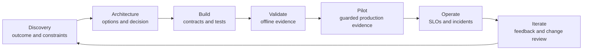

# Stakeholder Communication, ADRs, and Lifecycle Ownership | 干系人沟通、ADR 与生命周期归属

> An architecture is not delivered when the diagram is finished. It is delivered when the next owner can operate the decision.

> **【中文解读】** 本课回答"架构什么时候才算交付"。核心论断：图画完不等于架构交付，下一个所有者能运营这个决策才算。三条主线：一是"一个系统、多个视图"——高管、产品、工程、安全、领域负责人、SRE 各要不同决策证据，但事实必须一致；二是 ADR（架构决策记录）——记录上下文、选项、后果与翻转条件，让未来团队能重启决策而不重蹈覆辙；三是生命周期归属——为每个可变更资产命名负责人，定义交接验收与运营就绪，把采用、事件沟通和证据链一直管到下线为止。

> **【拓展：沟通与生命周期→架构师毕业设计】** 本课是认证路线里"沟通与生命周期"的收口课：它把第 22 课（业务调研、需求与 SLA）谈定的目标与约束、第 27 课（企业治理、合规与人工审查）建立的审批链，组装成能交付给下一个所有者的交付包。它的五件套产物（高管决策简报、ADR、工程契约索引、运营就绪清单、归属与变更地图）直接构成架构师方向毕业设计的最终交接章节；"翻转条件必须可度量"也是考试场景题的高频判分点。

> 🔗 **【前置】** 学本课前请先掌握：(1) 第 22 课"业务调研、需求与 SLA"——先把业务目标、约束和服务水平谈清楚，本课把这些谈定的东西翻译成各受众能消费的视图；(2) 第 27 课"企业治理、合规与人工审查"——治理链与人工审查归属是本课"归属地图"与"交接验收"的前置输入。

**Type:** Reference | **类型:** 参考
**Languages:** Python | **语言:** Python
**Prerequisites:** [Business Discovery, Requirements, and SLAs](../../22-business-discovery-requirements-and-slas/), [Enterprise Governance, Compliance, and Human Review](../../27-enterprise-governance-compliance-and-hitl/); Phase 17, Lesson 23 | **前置知识:** 第 22 课（业务调研、需求与 SLA）、第 27 课（企业治理、合规与人工审查）；Phase 17 第 23 课
**Time:** ~135 minutes | **时间:** 约 135 分钟

## Learning Objectives | 学习目标

- Communicate one architecture at executive, product, engineering, and control levels
  中文翻译：在高管、产品、工程与控制层面沟通同一个架构。
- Write decision records that preserve tradeoffs and reversal conditions
  中文翻译：写保留权衡与翻转条件的决策记录。
- Turn a design into implementation guidance, rollout gates, and named ownership
  中文翻译：把设计转化为实现指引、发布门与具名归属。
- Define handoff acceptance and operational readiness
  中文翻译：定义交接验收与运营就绪标准。
- Run feedback and change management across the system lifecycle
  中文翻译：在整个系统生命周期内运行反馈与变更管理。

## The Problem | 问题引入

> **【中文解读】** 问题场景是全课的靶子：架构师向高管指导委员会展示了一张技术上完整的多 Agent 图，但没人答得出三个基本问题——批的是什么业务决策、控制之后还剩什么风险、上线后系统归谁。设计随后以一张幻灯片交给工程，关键选择只活在会议记忆里；运营拿不到 SLO 与回滚规则；策略团队不知道知识新鲜度归自己管；评审员到试点才发现自己的队列。结论：设计可以技术正确却不可交付——沟通与生命周期归属本身就是架构职责。

An architect presents a detailed multi-agent diagram to an executive steering
group. The diagram contains model routes, MCP servers, vector indexes, event
queues, evaluators, and tracing. Nobody can answer three basic questions:

> 一位架构师向高管指导委员会展示了一张详尽的多 Agent 图。图里有模型路由、MCP 服务器、向量索引、事件队列、评测器和追踪。没有人答得出三个基本问题：

- What business decision is being approved?
  中文翻译：正在批准的是什么业务决策？
- Which risk remains after the proposed controls?
  中文翻译：提议的控制措施之后还剩哪些风险？
- Who owns the system after launch?
  中文翻译：上线之后系统归谁管？

The same design is later handed to engineering as a slide. Critical choices
live only in meeting memory. Operations receives no SLO or rollback rule. The
policy team does not know it owns knowledge freshness. Reviewers discover their
queue only during the pilot.

> 同一份设计后来以一张幻灯片交给工程。关键选择只活在会议记忆里。运营拿不到 SLO 或回滚规则。策略团队不知道知识新鲜度归自己管。评审员直到试点期间才发现自己的队列。

The design can be technically correct and still be undeliverable. Communication
and lifecycle ownership are architecture responsibilities.

> 一个设计可以技术正确却不可交付。沟通与生命周期归属是架构职责。

## The Concept | 核心概念

### One System Needs Several Views | 一个系统需要多个视图

> **【中文解读】** 本节的规则是"不同干系人要的是不同决策，不是不同真相"。表格把六类受众（高管、产品与运营、工程、安全与隐私、领域负责人、SRE 与支持）各自的"首要问题"和"最小证据"列成清单——例如高管要的是"价值是否值得剩余风险与投入"，SRE 要的是"故障如何被发现、被限制、被恢复"。关键纪律：不要靠删掉决策来简化，而是把同一个决策翻译成每个受众使用的证据。

Different stakeholders need different decisions, not different truths.

> 不同的干系人需要的是不同的决策，不是不同的真相。

| Audience | Primary question | Minimum evidence |
|----------|------------------|------------------|
| Executive | Is the value worth the residual risk and investment? | outcome, baseline, target, options, cost range, risk decision |
| Product and operations | How does the workflow and user experience change? | journey, exceptions, review, SLOs, adoption plan |
| Engineering | What must be built and how do boundaries behave? | components, contracts, identity, errors, versions, tests |
| Security and privacy | Where do data and authority cross boundaries? | data map, threat model, controls, retention, evidence |
| Domain owner | Is the output valid for the real task? | evaluation cases, sources, policy, escalation, change ownership |
| SRE and support | How is failure detected, limited, and recovered? | telemetry, alerts, runbooks, rollback, dependencies |

Do not simplify by removing the decision. Translate the same decision into the
evidence each audience uses.

> 不要靠删掉决策来简化。把同一个决策翻译成每个受众使用的证据。

### Build an Architecture Narrative | 构建架构叙事

A useful review follows a decision sequence:

> 一次有用的评审遵循这样的决策序列：

1. Current workflow and measurable problem.
   中文翻译：当前工作流与可度量的问题。
2. Constraints and risks that shape the solution.
   中文翻译：塑造方案的约束与风险。
3. Options considered.
   中文翻译：考虑过的选项。
4. Recommended architecture and why it wins.
   中文翻译：推荐的架构及其胜出理由。
5. Consequences and rejected alternatives.
   中文翻译：后果与被否决的替代方案。
6. Verification and rollout plan.
   中文翻译：验证与发布计划。
7. Residual risk and approvals required.
   中文翻译：剩余风险与所需审批。
8. Ownership through operation and change.
   中文翻译：贯穿运营与变更的归属。

Leading with a component diagram forces the audience to reconstruct this logic.
Give them the logic first.

> 一上来就放组件图，等于逼听众自己重构这套逻辑。先给他们逻辑。

### Use Diagrams to Answer One Question | 用图表回答一个问题



A context diagram answers who and what crosses the system boundary. A data-flow
diagram answers where sensitive data moves. A sequence diagram answers how one
trajectory works. A deployment diagram answers runtime ownership. A control
map answers where risk is prevented, detected, and corrected.

> 上下文图回答谁和什么跨越系统边界。数据流图回答敏感数据在哪里流动。时序图回答一条轨迹如何运作。部署图回答运行时归属。控制图回答风险在哪里被预防、检测和纠正。

One overloaded diagram answers none of them well.

> 一张过载的图哪个都答不好。

### Record Decisions, Not Meeting Transcripts | 记录决策，而非会议纪要

> **【中文解读】** ADR 的可操作定义：短到能读完，完整到能重启决策。必填字段背下来：状态与决策负责人、上下文与约束、选项与证据、决策与理由、后果与剩余风险、被否决的替代方案、验证计划、翻转条件与复审日期。被否决方案不是废纸——没有它们，未来团队要么重复同样的分析，要么在不懂会破坏哪条约束的情况下改设计。估计值要明说是估计，比把未测试的延迟或成本数字当事实展示更诚实也更有用。

An ADR should be short enough to read and complete enough to revisit.

> 一份 ADR 应该短到能读完，又完整到值得回头再看。

Required fields:

> 必填字段：

- status and decision owner
  中文翻译：状态与决策负责人。
- context and constraints
  中文翻译：上下文与约束。
- options and evidence
  中文翻译：选项与证据。
- decision and rationale
  中文翻译：决策与理由。
- consequences and residual risk
  中文翻译：后果与剩余风险。
- rejected alternatives
  中文翻译：被否决的替代方案。
- verification plan
  中文翻译：验证计划。
- reversal conditions and review date
  中文翻译：翻转条件与复审日期。

The rejected alternatives matter. Without them, a future team repeats the same
analysis or changes the design without understanding which constraint it breaks.

> 被否决的替代方案很重要。没有它们，未来团队要么重复同样的分析，要么在不明白会破坏哪条约束的情况下改动设计。

Use explicit confidence. "We estimate" is more honest and useful than presenting
an untested latency or cost number as fact.

> 使用显式的置信度。"我们估计"比把未经测试的延迟或成本数字当事实展示更诚实也更有用。

### Turn Architecture Into Contracts | 把架构变成契约

Implementation guidance needs machine-checkable boundaries:

> 实现指引需要机器可校验的边界：

- request and response schemas
  中文翻译：请求与响应 schema。
- identity and authorization requirements
  中文翻译：身份与授权要求。
- versioning and compatibility rules
  中文翻译：版本管理与兼容规则。
- timeout, retry, cancellation, and idempotency behavior
  中文翻译：超时、重试、取消与幂等行为。
- structured error categories
  中文翻译：结构化错误类别。
- data classification and retention
  中文翻译：数据分级与保留。
- prompt, model, tool, and knowledge ownership
  中文翻译：提示词、模型、工具与知识的归属。
- evaluation fixtures and release gates
  中文翻译：评测 fixture 与发布门。
- observability fields and redaction
  中文翻译：可观测性字段与脱敏。

An architecture packet should point to these contracts. It should not duplicate
every line of implementation.

> 架构包应该指向这些契约，而不应该复述每一行实现。

### Define Ownership by Decision | 按决策定义归属

> **【中文解读】** "AI 团队负责"宽得没有信息量。归属要落到具体决策上，本课给出十二类：业务结果、产品工作流与用户沟通、提示词与输出契约、模型选择与路由、工具与集成服务、知识源新鲜度、身份与权限、评测标签与验收阈值、安全与合规控制、运行时 SLO 与事件响应、供应商与成本管理、废弃与退役。再加一条制衡：建议变更的人与有权接受其风险的人必须分开。

"The AI team owns it" is too broad.

> "AI 团队负责"太宽泛。

Name owners for:

> 为以下各项命名负责人：

- business outcome
  中文翻译：业务结果。
- product workflow and user communication
  中文翻译：产品工作流与用户沟通。
- prompt and output contract
  中文翻译：提示词与输出契约。
- model selection and routing
  中文翻译：模型选择与路由。
- tool and integration service
  中文翻译：工具与集成服务。
- knowledge-source freshness
  中文翻译：知识源新鲜度。
- identity and permissions
  中文翻译：身份与权限。
- evaluation labels and acceptance thresholds
  中文翻译：评测标签与验收阈值。
- safety and compliance controls
  中文翻译：安全与合规控制。
- runtime SLO and incident response
  中文翻译：运行时 SLO 与事件响应。
- vendor and cost management
  中文翻译：供应商与成本管理。
- deprecation and retirement
  中文翻译：废弃与退役。

Separate the person who recommends a change from the person authorized to accept
its risk.

> 把建议变更的人与有权接受其风险的人分开。

### Design Handoff Acceptance | 设计交接验收

Handoff is complete when the receiving team can operate and change the system
safely, not when a document link is sent.

> 交接的完成标志是接收团队能安全地运营和变更系统，而不是发出一个文档链接。

Acceptance criteria:

> 验收标准：

- owners and escalation contacts confirmed
  中文翻译：负责人与升级联系人已确认。
- architecture and ADRs current
  中文翻译：架构与 ADR 处于最新状态。
- dependencies and access provisioned
  中文翻译：依赖与访问已开通。
- dashboards and alerts live
  中文翻译：仪表盘与告警已上线。
- runbooks rehearsed through failure drills
  中文翻译：运行手册已通过故障演练彩排。
- evaluation suite runnable and baselines stored
  中文翻译：评测套件可运行且基线已存储。
- rollback tested
  中文翻译：回滚已测试。
- data retention and deletion verified
  中文翻译：数据保留与删除已验证。
- reviewer queue staffed
  中文翻译：评审队列已配备人手。
- known limitations communicated
  中文翻译：已知限制已传达。
- change and incident processes agreed
  中文翻译：变更与事件流程已达成一致。

Use a joint acceptance review. The receiving owner should demonstrate recovery
from a simulated failure.

> 使用联合验收评审。接收负责人应当演示从一次模拟故障中恢复。

### Plan Adoption as Part of the Workflow | 把采用规划进工作流

AI systems change how people work. Training only on the interface is insufficient.
Users need to know:

> AI 系统改变人们的工作方式。只培训界面用法是不够的。用户需要知道：

- which tasks are in scope
  中文翻译：哪些任务在范围内。
- what evidence to inspect
  中文翻译：要检查哪些证据。
- when to edit, reject, or escalate
  中文翻译：何时编辑、拒绝或升级。
- which data may be entered
  中文翻译：可以录入哪些数据。
- what the system records
  中文翻译：系统记录了什么。
- how to report harmful or incorrect behavior
  中文翻译：如何报告有害或错误的行为。
- what happens when the service is unavailable
  中文翻译：服务不可用时会怎样。

Measure adoption with outcome and quality, not logins alone. A high usage number
can reflect forced process or repeated rework.

> 用结果和质量度量采用情况，而不是只看登录数。高使用量可能反映的是强制流程或重复返工。

### Communicate Incidents by Impact and Decision | 按影响与决策沟通事件

During an incident, separate confirmed fact, current impact, mitigation, and
unknowns.

> 事件期间，把已确认事实、当前影响、缓解措施与未知项分开。

```text
Impact: Which users, tasks, or records may be affected?
Evidence: What telemetry or evaluation confirms it?
Containment: What capability is disabled or routed safely?
Recovery: What must pass before restoration?
Follow-up: Which control, owner, or assumption changes?
```

Do not speculate about model intent. Describe observable system behavior and
the control response.

> 不要猜测模型意图。描述可观察的系统行为与控制的响应。

### Keep Lifecycle Evidence Connected | 保持生命周期证据相连

Each production outcome should be traceable to:

> 每个生产结果都应可追溯到：

- requirement and decision
  中文翻译：需求与决策。
- system and configuration version
  中文翻译：系统与配置版本。
- test and approval evidence
  中文翻译：测试与审批证据。
- deployment and runtime trace
  中文翻译：部署与运行时追踪。
- human review or override
  中文翻译：人工评审或人工覆盖。
- downstream outcome
  中文翻译：下游结果。
- change request if the evidence reveals a problem
  中文翻译：证据暴露问题时的变更请求。

This chain supports debugging, governance, and rational iteration.

> 这条证据链支撑调试、治理与理性迭代。

## Build It | 动手构建

## Interactive Lab | 交互实验室

```figure
28-adr-lifecycle
```

Use the ADR lifecycle explorer to move one decision from discovery through
build, validation, pilot, operation, incident, and reconsideration. Change the
evidence or reversal condition and observe which owner must act next.

> 用 ADR 生命周期探索器把一个决策从发现推进到构建、验证、试点、运营、事件与重新考虑。改动证据或翻转条件，观察下一个必须行动的所有者是谁。

## Practice Lab | 练习实验室

Fail the stale-retrieval tabletop drill, trace the changed evidence to its
decision owner, and update the ADR instead of editing only the diagram.

> 让"检索过期"桌面演练失败一次，把变化的证据追溯到它的决策负责人，然后更新 ADR，而不是只改图。

## Shipped Artifact | 交付产物

The filled [`outputs/delivery-handoff-packet.md`](../outputs/delivery-handoff-packet.md)
connects an executive decision, ADR, engineering contracts, operations drill,
and ownership map.

> 填写好的交付交接包把一项高管决策、ADR、工程契约、运营演练与归属地图连接在一起。

## Verify It | 验证

Verify its decisions, owners, recovery proof, and measurable reversal trigger:

> 验证它的决策、负责人、恢复证明与可度量的翻转触发条件：

```bash
cd certifications/claude/lessons/28-stakeholder-communication-adrs-and-lifecycle
python3 code/main.py
python3 -m unittest discover -s code/tests -v
```

The quiz checks communication and lifecycle decisions.

> 测验检查沟通与生命周期决策。

## Capstone Connection | 毕业设计衔接

> **【中文解读】** 毕业设计部分给出交付包五件套的精确清单：(1) 一页高管决策简报——问题、基线、目标、选项、建议、投入区间、首要风险、验证方式与所请决策；(2) ADR——选定模式加至少两个被否决方案，含翻转条件；(3) 工程契约索引表（边界/契约/负责人/版本规则/失败规则/测试）；(4) 运营就绪清单；(5) 归属与变更地图（决策或资产/运营负责人/变更审批人/证据/复审触发）。随后跑一次桌面演练：过期检索导致不安全建议、授权服务故障、评测器漂移。这个验证过的交付包就是架构师专业级毕业设计的最终交接章节。

Use the verified delivery packet as the final handoff section of the Architect
Professional capstone.

> 把验证过的交付包用作架构师专业级毕业设计的最终交接章节。

Create a delivery packet with five artifacts.

> 用五件产物创建一个交付包。

### 1. Executive Decision Brief | 1. 高管决策简报

One page: problem, baseline, target, options, recommendation, investment range,
top risks, verification, and decision requested.

> 一页纸：问题、基线、目标、选项、建议、投入区间、首要风险、验证方式与所请决策。

### 2. Architecture Decision Record | 2. 架构决策记录

Capture the selected pattern and at least two rejected alternatives. Include
reversal conditions.

> 记录选定的模式与至少两个被否决的替代方案。包含翻转条件。

### 3. Engineering Contract Index | 3. 工程契约索引

```markdown
| Boundary | Contract | Owner | Version rule | Failure rule | Test |
|----------|----------|-------|--------------|--------------|------|
```

### 4. Operational Readiness Checklist | 4. 运营就绪清单

Include dashboards, alerts, runbooks, access, evaluation, rollback, dependencies,
review capacity, and incident communication.

> 包含仪表盘、告警、运行手册、访问、评测、回滚、依赖、评审容量与事件沟通。

### 5. Ownership and Change Map | 5. 归属与变更地图

```markdown
| Decision or asset | Operating owner | Change approver | Evidence | Review trigger |
|-------------------|-----------------|-----------------|----------|----------------|
```

Run a tabletop exercise. Simulate stale retrieval causing unsafe recommendations,
a failed authorization service, and evaluator drift. The receiving team should
identify impact, contain the capability, recover from a known-safe version, and
record follow-up ownership.

> 跑一次桌面演练。模拟过期检索导致不安全建议、授权服务故障与评测器漂移。接收团队应当识别影响、遏制能力、从已知安全版本恢复，并记录后续归属。

## Use It | 运行验证

For an enterprise research assistant, provide these views:

> 为一个企业研究助手提供这些视图：

- Executive: reduced analyst cycle time, evidence quality target, budget, and
  residual confidentiality risk.
  中文翻译：高管：分析师周期时间缩短、证据质量目标、预算与剩余保密风险。
- Product: query journey, insufficient-evidence state, citation experience, and
  feedback path.
  中文翻译：产品：查询旅程、证据不足状态、引用体验与反馈路径。
- Engineering: retrieval, model, tool, identity, and evaluation contracts.
  中文翻译：工程：检索、模型、工具、身份与评测契约。
- Security: tenant boundary, source permissions, logs, retention, and incident
  controls.
  中文翻译：安全：租户边界、来源权限、日志、保留与事件控制。
- Operations: freshness, latency, cost, error, and quality dashboards with
  rollback rules.
  中文翻译：运营：带回滚规则的新鲜度、延迟、成本、错误与质量仪表盘。

The facts remain consistent. The detail follows the decision each audience owns.

> 事实保持一致。细节跟随每个受众拥有的决策。

At the end of the pilot, review more than accuracy. Compare analyst time, citation
inspection, reviewer workload, adoption by task class, cost per accepted report,
and incidents. Decide to expand, revise, constrain, or stop.

> 试点结束时，评审的不能只有准确率。对比分析师时间、引用检查、评审员负担、按任务类别的采用、每份被接受报告的成本与事件数。再决定扩展、修订、限制还是停止。

## Exam Decision Patterns | 考试决策模式

> **【中文解读】** 场景题问"如何沟通权衡"时，答题骨架是：业务后果 + 技术证据 + 被否决方案 + 剩余风险，并用适合受众的语言表达。优先选项：承诺之前先做结构化发现；记录上下文、选项与后果；给提示词、数据、工具、控制、指标与运营指派负责人；定义实现与失败契约；要求运营就绪与交接验收；把反馈接到版本化的变更决策上。避开那些"只交一张图、没有 SLO、运行手册、评测器、归属或回滚"的选项。

When a scenario asks how to communicate tradeoffs, state business consequence,
technical evidence, rejected alternatives, and residual risk in language suited
to the audience.

> 当场景题问如何沟通权衡时，用适合受众的语言陈述业务后果、技术证据、被否决的替代方案与剩余风险。

Prefer answers that:

> 优先选择这样的答案：

- run structured discovery before commitment
  中文翻译：承诺之前先做结构化发现。
- document context, options, and consequences
  中文翻译：记录上下文、选项与后果。
- assign owners to prompts, data, tools, controls, metrics, and operations
  中文翻译：给提示词、数据、工具、控制、指标与运营指派负责人。
- define implementation and failure contracts
  中文翻译：定义实现契约与失败契约。
- require operational readiness and handoff acceptance
  中文翻译：要求运营就绪与交接验收。
- connect feedback to versioned change decisions
  中文翻译：把反馈接到版本化的变更决策上。

Avoid answers that hand over a diagram without SLOs, runbooks, evaluators,
ownership, or rollback.

> 避开那些交出一张没有 SLO、运行手册、评测器、归属或回滚的图的答案。

## Common Traps | 常见陷阱

### One Deck for Every Audience | 一套幻灯片打天下

Either executives drown in implementation or engineers receive vague claims.
Use consistent views tuned to decisions.

> 要么高管淹死在实现细节里，要么工程师收到含糊的断言。使用与决策对齐的一致视图。

### Architecture as a Launch Artifact | 把架构当上线一次性产物

Architecture changes with evidence, scale, dependencies, and risk. Keep decisions
and diagrams versioned through operation.

> 架构会随证据、规模、依赖与风险变化。让决策与图在运营期保持版本化。

### Ownership by Team Name | 以团队名代替归属

A team label does not identify who updates a stale source, accepts an eval change,
or responds to an alert. Assign concrete decisions.

> 团队标签指不出谁来更新过期来源、接受评测变更或响应告警。指派具体决策。

### Adoption Equals Value | 采用量等于价值

Usage can rise while quality, review burden, or total handling time worsens.
Measure the outcome.

> 使用量可以上升，而质量、评审负担或总处理时间却在恶化。度量结果本身。

## Exercises | 练习

1. Turn a technical architecture into a one-page executive decision brief.
   中文翻译：把一个技术架构转成一页高管决策简报。
2. Write an ADR with a measurable reversal condition.
   中文翻译：写一份带可度量翻转条件的 ADR。
3. Create a handoff drill for a tool that begins returning partial results.
   中文翻译：为一个开始返回部分结果的工具设计交接演练。
4. Assign owners for every changeable artifact in a RAG application.
   中文翻译：为 RAG 应用中每个可变更的产物指派负责人。
5. Design an adoption scorecard that includes quality, rework, and user trust.
   中文翻译：设计一张包含质量、返工与用户信任的采用计分卡。

## Key Terms | 关键术语

| Term | What people say | What it actually means |
|------|-----------------|------------------------|
| Stakeholder | Anyone invited to a meeting | A person or group who owns, affects, or bears a decision or outcome |
| ADR | Architecture documentation | A focused record of one decision, its context, alternatives, and consequences |
| Handoff | Send the documents | Transfer operational ability and accepted responsibility with evidence |
| Operational readiness | Deployment succeeded | Owners, controls, observability, recovery, evaluation, and support are proven |
| Adoption | Number of users | Sustained workflow use that produces the intended outcome without hidden burden |
| Reversal condition | Lack of confidence | Evidence that triggers a planned architecture or scope change |

## Further Reading | 延伸阅读

- [Claude Platform documentation](https://platform.claude.com/docs/en/home) for current implementation boundaries
  中文翻译：Claude 平台文档——查当前实现边界的官方出处
- [Building effective agents](https://www.anthropic.com/research/building-effective-agents) for explaining workflow and agent choices
  中文翻译：构建有效的 Agent——解释工作流与 Agent 选择的官方文章
- Phase 17, Lesson 23 for SRE practices
  中文翻译：Phase 17 第 23 课——SRE 实践
- Phase 14, Lesson 40 for structured technical handoffs
  中文翻译：Phase 14 第 40 课——结构化技术交接
- Phase 17, Lesson 24 for incident response and operational recovery
  中文翻译：Phase 17 第 24 课——事件响应与运营恢复
