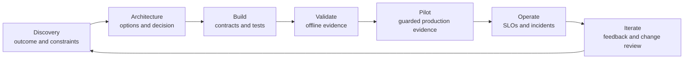

# 干系人沟通、ADR 与生命周期归属

> 架构不是在图画完时交付的。它是在下一个所有者能运营这个决策时才交付的。

> **【中文解读】** 本课回答"架构什么时候才算交付"。核心论断：图画完不等于架构交付，下一个所有者能运营这个决策才算。三条主线：一是"一个系统、多个视图"——高管、产品、工程、安全、领域负责人、SRE 各要不同决策证据，但事实必须一致；二是 ADR（架构决策记录）——记录上下文、选项、后果与翻转条件，让未来团队能重启决策而不重蹈覆辙；三是生命周期归属——为每个可变更资产命名负责人，定义交接验收与运营就绪，把采用、事件沟通和证据链一直管到下线为止。

> **【拓展：沟通与生命周期→架构师毕业设计】** 本课是认证路线里"沟通与生命周期"的收口课：它把第 22 课（业务调研、需求与 SLA）谈定的目标与约束、第 27 课（企业治理、合规与人工审查）建立的审批链，组装成能交付给下一个所有者的交付包。它的五件套产物（高管决策简报、ADR、工程契约索引、运营就绪清单、归属与变更地图）直接构成架构师方向毕业设计的最终交接章节；"翻转条件必须可度量"也是考试场景题的高频判分点。

> 🔗 **【前置】** 学本课前请先掌握：(1) 第 22 课"业务调研、需求与 SLA"——先把业务目标、约束和服务水平谈清楚，本课把这些谈定的东西翻译成各受众能消费的视图；(2) 第 27 课"企业治理、合规与人工审查"——治理链与人工审查归属是本课"归属地图"与"交接验收"的前置输入。

**类型：** 参考
**语言：** Python
**前置条件：** 第 22 课（业务调研、需求与 SLA）、第 27 课（企业治理、合规与人工审查）；Phase 17 第 23 课
**预计用时：** 约 135 分钟

## 学习目标

- 在高管、产品、工程与控制层面沟通同一个架构。
- 写保留权衡与翻转条件的决策记录。
- 把设计转化为实现指引、发布门与具名归属。
- 定义交接验收与运营就绪标准。
- 在整个系统生命周期内运行反馈与变更管理。

## 问题引入

> **【中文解读】** 问题场景是全课的靶子：架构师向高管指导委员会展示了一张技术上完整的多 Agent 图，但没人答得出三个基本问题——批的是什么业务决策、控制之后还剩什么风险、上线后系统归谁。设计随后以一张幻灯片交给工程，关键选择只活在会议记忆里；运营拿不到 SLO 与回滚规则；策略团队不知道知识新鲜度归自己管；评审员到试点才发现自己的队列。结论：设计可以技术正确却不可交付——沟通与生命周期归属本身就是架构职责。

一位架构师向高管指导委员会展示了一张详尽的多 Agent 图。图里有模型路由、MCP 服务器、向量索引、事件队列、评测器和追踪。没有人答得出三个基本问题：

- 正在批准的是什么业务决策？
- 提议的控制措施之后还剩哪些风险？
- 上线之后系统归谁管？

同一份设计后来以一张幻灯片交给工程。关键选择只活在会议记忆里。运营拿不到 SLO 或回滚规则。策略团队不知道知识新鲜度归自己管。评审员直到试点期间才发现自己的队列。

一个设计可以技术正确却不可交付。沟通与生命周期归属是架构职责。

## 核心概念

### 一个系统需要多个视图

> **【中文解读】** 本节的规则是"不同干系人要的是不同决策，不是不同真相"。表格把六类受众（高管、产品与运营、工程、安全与隐私、领域负责人、SRE 与支持）各自的"首要问题"和"最小证据"列成清单——例如高管要的是"价值是否值得剩余风险与投入"，SRE 要的是"故障如何被发现、被限制、被恢复"。关键纪律：不要靠删掉决策来简化，而是把同一个决策翻译成每个受众使用的证据。

不同的干系人需要的是不同的决策，不是不同的真相。

| 受众 | 首要问题 | 最小证据 |
|------|----------|----------|
| 高管 | 价值是否值得剩余风险与投入？ | 结果、基线、目标、选项、成本区间、风险决策 |
| 产品与运营 | 工作流和用户体验如何变化？ | 旅程、例外、评审、SLO、采用计划 |
| 工程 | 必须构建什么，边界如何表现？ | 组件、契约、身份、错误、版本、测试 |
| 安全与隐私 | 数据与权限在哪里跨越边界？ | 数据地图、威胁模型、控制、保留、证据 |
| 领域负责人 | 输出对真实任务是否有效？ | 评测用例、来源、策略、升级、变更归属 |
| SRE 与支持 | 故障如何被发现、被限制、被恢复？ | 遥测、告警、运行手册、回滚、依赖 |

不要靠删掉决策来简化。把同一个决策翻译成每个受众使用的证据。

### 构建架构叙事

一次有用的评审遵循这样的决策序列：

1. 当前工作流与可度量的问题。
2. 塑造方案的约束与风险。
3. 考虑过的选项。
4. 推荐的架构及其胜出理由。
5. 后果与被否决的替代方案。
6. 验证与发布计划。
7. 剩余风险与所需审批。
8. 贯穿运营与变更的归属。

一上来就放组件图，等于逼听众自己重构这套逻辑。先给他们逻辑。

### 用图表回答一个问题



上下文图回答谁和什么跨越系统边界。数据流图回答敏感数据在哪里流动。时序图回答一条轨迹如何运作。部署图回答运行时归属。控制图回答风险在哪里被预防、检测和纠正。

一张过载的图哪个都答不好。

### 记录决策，而非会议纪要

> **【中文解读】** ADR 的可操作定义：短到能读完，完整到能重启决策。必填字段背下来：状态与决策负责人、上下文与约束、选项与证据、决策与理由、后果与剩余风险、被否决的替代方案、验证计划、翻转条件与复审日期。被否决方案不是废纸——没有它们，未来团队要么重复同样的分析，要么在不懂会破坏哪条约束的情况下改设计。估计值要明说是估计，比把未测试的延迟或成本数字当事实展示更诚实也更有用。

一份 ADR 应该短到能读完，又完整到值得回头再看。

必填字段：

- 状态与决策负责人。
- 上下文与约束。
- 选项与证据。
- 决策与理由。
- 后果与剩余风险。
- 被否决的替代方案。
- 验证计划。
- 翻转条件与复审日期。

被否决的替代方案很重要。没有它们，未来团队要么重复同样的分析，要么在不明白会破坏哪条约束的情况下改动设计。

使用显式的置信度。"我们估计"比把未经测试的延迟或成本数字当事实展示更诚实也更有用。

### 把架构变成契约

实现指引需要机器可校验的边界：

- 请求与响应 schema。
- 身份与授权要求。
- 版本管理与兼容规则。
- 超时、重试、取消与幂等行为。
- 结构化错误类别。
- 数据分级与保留。
- 提示词、模型、工具与知识的归属。
- 评测 fixture 与发布门。
- 可观测性字段与脱敏。

架构包应该指向这些契约，而不应该复述每一行实现。

### 按决策定义归属

> **【中文解读】** "AI 团队负责"宽得没有信息量。归属要落到具体决策上，本课给出十二类：业务结果、产品工作流与用户沟通、提示词与输出契约、模型选择与路由、工具与集成服务、知识源新鲜度、身份与权限、评测标签与验收阈值、安全与合规控制、运行时 SLO 与事件响应、供应商与成本管理、废弃与退役。再加一条制衡：建议变更的人与有权接受其风险的人必须分开。

"AI 团队负责"太宽泛。

为以下各项命名负责人：

- 业务结果。
- 产品工作流与用户沟通。
- 提示词与输出契约。
- 模型选择与路由。
- 工具与集成服务。
- 知识源新鲜度。
- 身份与权限。
- 评测标签与验收阈值。
- 安全与合规控制。
- 运行时 SLO 与事件响应。
- 供应商与成本管理。
- 废弃与退役。

把建议变更的人与有权接受其风险的人分开。

### 设计交接验收

交接的完成标志是接收团队能安全地运营和变更系统，而不是发出一个文档链接。

验收标准：

- 负责人与升级联系人已确认。
- 架构与 ADR 处于最新状态。
- 依赖与访问已开通。
- 仪表盘与告警已上线。
- 运行手册已通过故障演练彩排。
- 评测套件可运行且基线已存储。
- 回滚已测试。
- 数据保留与删除已验证。
- 评审队列已配备人手。
- 已知限制已传达。
- 变更与事件流程已达成一致。

使用联合验收评审。接收负责人应当演示从一次模拟故障中恢复。

### 把采用规划进工作流

AI 系统改变人们的工作方式。只培训界面用法是不够的。用户需要知道：

- 哪些任务在范围内。
- 要检查哪些证据。
- 何时编辑、拒绝或升级。
- 可以录入哪些数据。
- 系统记录了什么。
- 如何报告有害或错误的行为。
- 服务不可用时会怎样。

用结果和质量度量采用情况，而不是只看登录数。高使用量可能反映的是强制流程或重复返工。

### 按影响与决策沟通事件

事件期间，把已确认事实、当前影响、缓解措施与未知项分开。

```text
Impact: Which users, tasks, or records may be affected?
Evidence: What telemetry or evaluation confirms it?
Containment: What capability is disabled or routed safely?
Recovery: What must pass before restoration?
Follow-up: Which control, owner, or assumption changes?
```

（影响：哪些用户、任务或记录可能受影响？证据：什么遥测或评测确认了它？遏制：什么能力被禁用或被安全路由？恢复：恢复前必须通过什么？后续：哪个控制、负责人或假设要变？）

不要猜测模型意图。描述可观察的系统行为与控制的响应。

### 保持生命周期证据相连

每个生产结果都应可追溯到：

- 需求与决策。
- 系统与配置版本。
- 测试与审批证据。
- 部署与运行时追踪。
- 人工评审或人工覆盖。
- 下游结果。
- 证据暴露问题时的变更请求。

这条证据链支撑调试、治理与理性迭代。

## 动手构建

## 交互实验室

```figure
28-adr-lifecycle
```

用 ADR 生命周期探索器把一个决策从发现推进到构建、验证、试点、运营、事件与重新考虑。改动证据或翻转条件，观察下一个必须行动的所有者是谁。

## 练习实验室

让"检索过期"桌面演练失败一次，把变化的证据追溯到它的决策负责人，然后更新 ADR，而不是只改图。

## 交付产物

填写好的[`交付交接包`](../outputs/delivery-handoff-packet.md)把一项高管决策、ADR、工程契约、运营演练与归属地图连接在一起。

## 验证

验证它的决策、负责人、恢复证明与可度量的翻转触发条件：

```bash
cd certifications/claude/lessons/28-stakeholder-communication-adrs-and-lifecycle
python3 code/main.py
python3 -m unittest discover -s code/tests -v
```

测验检查沟通与生命周期决策。

## 毕业设计衔接

> **【中文解读】** 毕业设计部分给出交付包五件套的精确清单：(1) 一页高管决策简报——问题、基线、目标、选项、建议、投入区间、首要风险、验证方式与所请决策；(2) ADR——选定模式加至少两个被否决方案，含翻转条件；(3) 工程契约索引表（边界/契约/负责人/版本规则/失败规则/测试）；(4) 运营就绪清单；(5) 归属与变更地图（决策或资产/运营负责人/变更审批人/证据/复审触发）。随后跑一次桌面演练：过期检索导致不安全建议、授权服务故障、评测器漂移。这个验证过的交付包就是架构师专业级毕业设计的最终交接章节。

把验证过的交付包用作架构师专业级毕业设计的最终交接章节。

用五件产物创建一个交付包。

### 1. 高管决策简报

一页纸：问题、基线、目标、选项、建议、投入区间、首要风险、验证方式与所请决策。

### 2. 架构决策记录

记录选定的模式与至少两个被否决的替代方案。包含翻转条件。

### 3. 工程契约索引

```markdown
| Boundary | Contract | Owner | Version rule | Failure rule | Test |
|----------|----------|-------|--------------|--------------|------|
```

（列依次为：边界、契约、负责人、版本规则、失败规则、测试。）

### 4. 运营就绪清单

包含仪表盘、告警、运行手册、访问、评测、回滚、依赖、评审容量与事件沟通。

### 5. 归属与变更地图

```markdown
| Decision or asset | Operating owner | Change approver | Evidence | Review trigger |
|-------------------|-----------------|-----------------|----------|----------------|
```

（列依次为：决策或资产、运营负责人、变更审批人、证据、复审触发。）

跑一次桌面演练。模拟过期检索导致不安全建议、授权服务故障与评测器漂移。接收团队应当识别影响、遏制能力、从已知安全版本恢复，并记录后续归属。

## 运行验证

为一个企业研究助手提供这些视图：

- 高管：分析师周期时间缩短、证据质量目标、预算与剩余保密风险。
- 产品：查询旅程、证据不足状态、引用体验与反馈路径。
- 工程：检索、模型、工具、身份与评测契约。
- 安全：租户边界、来源权限、日志、保留与事件控制。
- 运营：带回滚规则的新鲜度、延迟、成本、错误与质量仪表盘。

事实保持一致。细节跟随每个受众拥有的决策。

试点结束时，评审的不能只有准确率。对比分析师时间、引用检查、评审员负担、按任务类别的采用、每份被接受报告的成本与事件数。再决定扩展、修订、限制还是停止。

## 考试决策模式

> **【中文解读】** 场景题问"如何沟通权衡"时，答题骨架是：业务后果 + 技术证据 + 被否决方案 + 剩余风险，并用适合受众的语言表达。优先选项：承诺之前先做结构化发现；记录上下文、选项与后果；给提示词、数据、工具、控制、指标与运营指派负责人；定义实现与失败契约；要求运营就绪与交接验收；把反馈接到版本化的变更决策上。避开那些"只交一张图、没有 SLO、运行手册、评测器、归属或回滚"的选项。

当场景题问如何沟通权衡时，用适合受众的语言陈述业务后果、技术证据、被否决的替代方案与剩余风险。

优先选择这样的答案：

- 承诺之前先做结构化发现。
- 记录上下文、选项与后果。
- 给提示词、数据、工具、控制、指标与运营指派负责人。
- 定义实现契约与失败契约。
- 要求运营就绪与交接验收。
- 把反馈接到版本化的变更决策上。

避开那些交出一张没有 SLO、运行手册、评测器、归属或回滚的图的答案。

## 常见陷阱

### 一套幻灯片打天下

要么高管淹死在实现细节里，要么工程师收到含糊的断言。使用与决策对齐的一致视图。

### 把架构当上线一次性产物

架构会随证据、规模、依赖与风险变化。让决策与图在运营期保持版本化。

### 以团队名代替归属

团队标签指不出谁来更新过期来源、接受评测变更或响应告警。指派具体决策。

### 采用量等于价值

使用量可以上升，而质量、评审负担或总处理时间却在恶化。度量结果本身。

## 练习

1. 把一个技术架构转成一页高管决策简报。
2. 写一份带可度量翻转条件的 ADR。
3. 为一个开始返回部分结果的工具设计交接演练。
4. 为 RAG 应用中每个可变更的产物指派负责人。
5. 设计一张包含质量、返工与用户信任的采用计分卡。

## 关键术语

| 英文 | 常见说法 | 实际含义 |
|------|----------|----------|
| Stakeholder（干系人） | 任何被拉进会议的人 | 拥有、影响或承担某个决策或结果的人或群体 |
| ADR（架构决策记录） | 架构文档 | 聚焦记录一个决策及其上下文、替代方案与后果 |
| Handoff（交接） | 把文档发过去 | 连同证据一起移交运营能力与已接受的责任 |
| Operational readiness（运营就绪） | 部署成功了 | 负责人、控制、可观测性、恢复、评测与支持都已证明 |
| Adoption（采用） | 用户数量 | 持续的工作流使用，产出预期结果且没有隐藏负担 |
| Reversal condition（翻转条件） | 缺乏信心 | 触发既定架构或范围变更的证据 |

## 延伸阅读

- [Claude Platform documentation](https://platform.claude.com/docs/en/home) — Claude 平台文档：查当前实现边界的官方出处
- [Building effective agents](https://www.anthropic.com/research/building-effective-agents) — 构建有效的 Agent：解释工作流与 Agent 选择的官方文章
- Phase 17, Lesson 23 — SRE 实践
- Phase 14, Lesson 40 — 结构化技术交接
- Phase 17, Lesson 24 — 事件响应与运营恢复
