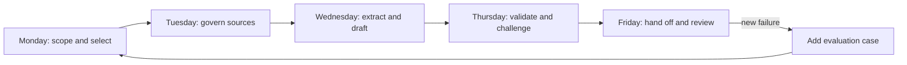

# 交付一周的工作量，而非一个完美的提示词

> 你的毕业设计是一个受治理的决策工作流：来源进、论断被核查、人的权限被保留、状态被交接。

> **【中文解读】** 本课是 Associate（助理级）认证路线的毕业设计，标题就是方法论：要交付的是一周的"受治理决策工作流"，而不是一个精雕细琢的提示词。四个关键词定义了工作流的骨架：来源进（受治理的证据源）、论断被核查（引用必须真正支撑论断）、人的权限被保留（发布与重大决策归授权的人）、状态被交接（评审者拿到完整决策包而不是重新摸索）。全课按模拟工作周展开：周一界定决策与产品面、周二冻结并治理证据、周三分四段分解工作、周四验证与挑战、周五交接并闭环，每天以一道门收尾——门不过，就不把不确定性推给下游。

> **【拓展：五天门→第 01-07 课的综合运用】** 本课把前半程的六门课拧成一条流水线：第 01 课（选择能承载工作的最小接口面）用于周一的产品面决策，第 03 课（把请求变成可测试的契约）与第 04 课（把每类事实放进正确类型的上下文）用于周二的来源治理与周三的分段提示词契约，第 05 课（验证的是论断，不是自信）用于周四的论断-证据矩阵，第 06 课（把权限围绕能力来设计）与第 07 课（先设计交接，再设计自动化）用于治理检查与周五的人工交接。它也是助理级路线唯一被"另一个人评审"的提交物，为开发者方向毕业设计 30 铺路。

> 🔗 **【前置】** 学本课前请先掌握第 01、03、04、05、06、07 课——它们分别提供接口面选择、提示词契约、上下文分层、输出验证、权限设计、人机交接六大块，本课的每一天都是其中一块的实战复用。

**类型：** 动手构建
**语言：** Python
**前置条件：** 第 01 课（选择能承载工作的最小接口面）、第 03 课（把请求变成可测试的契约）、第 04 课（把每类事实放进正确类型的上下文）、第 05 课（验证的是论断，不是自信）、第 06 课（把权限围绕能力来设计）、第 07 课（先设计交接，再设计自动化）
**预计用时：** 约 4 小时，在一个模拟工作周内完成

## 学习目标

- 综合运用产品选择、提示词、知识管理、验证、治理、故障排查与交接设计。
- 构建一个有明确检查点、以来源支撑的每周简报工作流。
- 实现一个针对来源、论断、治理与交接就绪度的确定性 Python 验证器。
- 在建议发布之前先跑正常用例与失败用例。
- 产出就绪度的证据，而不是宣称工作流是安全的。

## 问题引入

> **【中文解读】** 场景设定：你是 Northstar Field Services（虚构公司，七个区域团队）的运营负责人，每周五领导层要一份覆盖服务延误、客户影响事件、策略例外的简报，外加下周的两个决策。现状很脆：各区域格式不一、分析师手工抄录对账、三个人审批，简报偶尔漏区域或带旧数字。"用 Claude 自动化周报"这个要求本身不是方案——简报影响人员调度与客户沟通，部分输入含客户明细，策略例外需要授权负责人，一份没有证据的自信草稿反而会加速错误决策。任务因此被界定为：Claude 只做提取、比对、起草；确定性检查验证精确性质；授权的人拥有发布与重大决策。

你是 Northstar Field Services（一家有七个区域团队的虚构公司）的运营负责人。每周五，领导层需要一份简报，覆盖服务延误、影响客户的事件、策略例外，以及下周的两个决策。

现有流程很脆弱。区域负责人提交的格式各不相同。一名分析师把事实抄进文档、核对冲突的日期，再找三个人审批。最终简报有时漏掉一个区域，有时带着旧消息里已被更正的数字。

领导层要求你"用 Claude 把周报自动化"。这个要求本身不是方案。简报影响人员调度和客户沟通。部分输入包含客户明细。策略例外需要授权负责人。一份没有证据的自信草稿可能加速错误的决策。

你的任务是设计一个有边界的 Claude 辅助工作流。Claude 可以提取、比对和起草。确定性检查验证精确性质。一个被授权的人拥有发布与重大决策。

## 核心概念

### 交付物是一条证据链

> **【中文解读】** 毕业设计要交付五件相互衔接的产物：用例与产品选择记录、受维护的来源注册表加固定周快照、分阶段提示词契约、论断-证据与治理验证结果、带回退方案的人工交接包。Mermaid 图给出模拟周节奏：周一界定与选择、周二治理来源、周三提取与起草、周四验证与挑战、周五交接与评审，失败时回流"新增评测用例"。铁律是"每天以一道门收尾"——门不过，就不要把不确定性推给下游。

你将产出五件相互衔接的产物：

1. 用例与产品选择记录。
2. 受维护的来源注册表与固定的每周快照。
3. 分阶段的提示词契约。
4. 论断-证据与治理验证结果。
5. 带回退方案的人工交接包。



每一天以一道门收尾。门不过，就不要把不确定性推给下游。

### Python 验证器刻意保持有限

> **【中文解读】** 本课的代码刻意不调用 Claude，它演示的是一条关键的架构边界：精确的工作流性质属于确定性代码。验证器检查：必填章节是否齐全；每个活跃来源是否有负责人、权威级别、日期、敏感度与稳定 ID；论断是否引用已知来源；重大论断是否有直接或计算得出的支撑；过期与冲突证据是否可见；所选产品面是否被该数据级别批准；高后果或不可逆工作是否有授权的人工负责人；交接是否写明决策、期限、回退与下一负责人。它判不了策略在伦理上是否充分、评审者是否称职、来源陈述是否为真——这些仍是组织与人的责任。

毕业设计代码不调用 Claude。它演示一条关键的架构边界：精确的工作流性质属于确定性代码。

验证器检查：

- 必填的包章节存在。
- 每个活跃来源都有负责人、权威级别、日期、敏感度和稳定 ID。
- 论断引用的是已知来源。
- 重大论断使用直接或计算得出的支撑。
- 过期与冲突的证据是可见的。
- 所选产品面被批准用于该数据级别。
- 高后果或不可逆的工作有授权的人工负责人。
- 交接写明了决策、期限、回退方案与下一负责人。

它无法判定一项策略在伦理上是否充分、人工评审者是否称职、来源陈述是否为真。这些仍是组织与人的责任。

## 动手构建

## 交互实验室

```figure
29-associate-capstone-readiness
```

在五天构建过程中全程使用就绪看板。它把目的、来源、提示词阶段、论断支撑、权限、交接与回退连接起来，让一份打磨光鲜的简报藏不住任何一道没过的门。

## 练习实验室

完成下面的五天工作流，然后逐个故意打破产品面、来源、论断支撑、权限与交接这五道门。

## 交付产物

随课附带的清单和填写好的[演示就绪报告](../outputs/demo-readiness-report.json)是实际产物。

## 验证

用下面的命令复现通过的数据包和全部"失败优先"测试；不需要网络访问或凭据。课程测验是最后的个人检查。

## 毕业设计衔接

完成的数据包是助理级路线毕业设计的证据，由另一个人评审。

### 周一：界定决策与产品面

为决策写一句话：

```text
By Friday at 15:00, the operations director will choose no more than two
staffing or process changes for the following week using the approved regional snapshot.
```

（到周五 15:00，运营总监将基于已批准的区域快照，为下周选择不超过两项人员或流程变更。）

界定范围之外的事：

- 不做自动客户消息。
- 不做员工绩效排名。
- 不改动人员排班。
- 不下法律或监管结论。
- 不使用受限数据。

对比候选产品面。一次性聊天很容易，但对需要维护的指令和固定的来源集合来说太弱。若当前的条款、方案控制与数据处理获得批准，Project 可能适合协作式、重复性的工作。当需要程序化摄取、验证与审计集成时，API 可能更合适。Research 适合查当前的外部事实，不适合替代内部已批准的策略。

记录决策本身，而不只是产品名：

```text
Surface:
Why it fits:
Data class allowed:
Current terms checked on:
Unsupported requirements:
Fallback surface or manual path:
```

（产品面 / 为何合适 / 允许的数据级别 / 条款核实日期 / 未被支持的需求 / 回退产品面或手工路径。）

门：负责人批准目的、产品面、数据级别与禁止动作。

### 周二：冻结并治理证据

为以下各项创建来源注册表：

- 七个区域状态文件。
- 事件系统导出。
- 已批准的服务策略。
- 人员产能表。
- 上一周的决策记录。

每个来源都需要稳定 ID、负责人、权威级别、生效日期、复审日期与敏感度。把讨论笔记标记为参考资料而非策略。如果决策不需要客户姓名，就去掉。

在一个有记录的时间点冻结每周来源快照。之后变化的事实应进入修订或例外流程。否则草稿、评审者与领导看到的可能是三个不同的世界。

定义权威顺序：

```text
1. Approved service policy and signed incident status
2. Current regional status submitted before the cutoff
3. Prior decision record
4. Discussion notes, for leads only and never as sole support
```

（已批准的服务策略与签字的事件状态 > 截止前提交的当期区域状态 > 上一期决策记录 > 讨论笔记——仅限负责人查看，且绝不作为唯一支撑。）

门：七个区域全部在场或被显式标记缺失；来源通过新鲜度与权限检查；冲突有负责人。

### 周三：分解工作

不要一步索要最终简报。使用四个有边界的阶段。

**阶段 1，提取：**返回结构化行，包含区域、延误、受影响服务、事件 ID、策略例外、来源 ID 与不确定性。不要建议行动。

**阶段 2，对账：**检查区域覆盖、合计数、重复事件、日期冲突与无支撑字段。仍有阻断项就停下。

**阶段 3，分析：**识别模式并提出不超过三个候选行动。每个行动都需要支撑发现、策略约束、可能收益、downside，以及一个能授权它的负责人。

**阶段 4，起草：**只基于已验证的行与已批准的分析产出高管简报。包含所需决策、证据、例外与已知的不确定性。

每个阶段都使用提示词契约。包含来源层级、弃权行为、输出形状与验收标准。保存版本，让失败的结果可以复现。

门：结构化提取先与快照对账，然后才开始分析。

### 周四：验证与挑战

> **【中文解读】** 周四的节奏是"先跑通、再故意打破"：先运行验证器让演示包返回 `ready_for_human_review`，再逐个制造失败（把 `approved_surface` 改为 false、删掉来源负责人、引用不存在的来源 ID、把重大论断标成推测、删掉决策负责人、把动作改成不可逆），看验证器是否都拦得住。随后为真实草稿建论断-证据矩阵：引用必须支撑确切的论断；合计数用代码或表格核对，不用模型评分器；把评分标准和证据交给独立评审者，要求它报告发现而不是默默改稿。发布分级也要背：阻断、修订、质量改进三级各管一类问题。

运行附带的验证器：

```bash
cd certifications/claude/lessons/29-associate-workflow-capstone
python3 code/main.py
```

演示数据包应返回 `ready_for_human_review` 状态。现在故意打破它：

- 把 `approved_surface` 设为 false。
- 删掉一个来源负责人。
- 引用一个不存在的来源 ID。
- 把一个重大论断标记为推测。
- 删掉决策负责人。
- 把动作改成不可逆。

运行单元测试：

```bash
python3 -m unittest discover -s code/tests -v
```

然后为实际草稿建一个论断-证据矩阵。引用必须支撑确切的论断。用代码或电子表格核对合计数，而不是模型评分器。把评分标准和证据交给一位独立评审者。要求它报告发现，而不是默默重写草稿。

使用发布分级：

- **阻断：**未批准的数据或产品面、未知来源、合计数错误、无支撑的重大论断、缺失决策权限。
- **修订：**覆盖不完整、冲突未解决、来源过期、不确定性不清晰。
- **质量改进：**重复、弱标题或非关键的语气问题。

门：所有阻断项都已解决。剩余的不确定性在人工数据包中可见。

### 周五：交接并闭环

填写[清单](../outputs/checklist.md)。构建评审数据包：

```text
Decision: Choose up to two next-week interventions.
Owner: Operations director.
Deadline: Friday 15:00.
Snapshot: Weekly source registry version and cutoff.
Candidate: Brief version and prompt version.
Evidence: Claim IDs, source IDs, calculations.
Checks: Passed, failed, and manually reviewed.
Uncertainty: Missing region, conflicting date, or weak support.
Options: Approve, revise, reject, escalate.
Fallback: Publish the manual template or delay with notice.
```

（决策 / 负责人 / 期限 / 快照版本与截止 / 候选简报与提示词版本 / 证据（论断 ID、来源 ID、计算）/ 检查结果 / 不确定性 / 选项（批准、修订、拒绝、升级）/ 回退（发布手工模板或带通知推迟）。）

批准决策的是总监，不是"AI"。记录谁基于哪个快照批准了什么。如果批准之后来源发生变化，让发布门失效并复审增量。

模拟发布之后，做一次简短的复盘：

- 哪个阶段消耗的人工时间最多？
- 哪项检查抓住了最严重的缺陷？
- 有没有哪个重要判断变得更难了？
- 哪个来源需要更好的归属？
- 哪个失败应该进入评测集？
- 工作流应该保持辅助、走向有限自动化，还是回到手工？

## 运行验证

### 一份完整的证据包

你的提交应包含：

- 带核实日期的产品面选择记录。
- 十个来源的注册表，或覆盖全部必需来源类别的较小等价物。
- 四份提示词阶段契约。
- 至少十个评测用例：四个正常、三个边界、三个治理或对抗。
- 每个重大论断的论断-证据矩阵。
- 一个通过与三个失败数据包的验证器输出。
- 通过的单元测试输出。
- 填写完成的人工交接清单。
- 一页复盘，含一条具体的工作流改动。

### 毕业设计决策模式

> **【中文解读】** 六条决策模式是本课的精华，也是考试场景题的答题模板：没有批准的目的就停下（能力不创造许可）；没有权威证据就弃权或升级（更多提示词变不出一个来源）；精确性质用确定性检查（合计数和 schema 不需要主观评分）；高后果交人工权限（给这个人证据和否决权）；反复失败就修系统（加用例、控制或来源规则）；会变的产品事实要现场核实（记录产品面、日期与出处）。

在检查自己的工作或回答考试场景题时使用这些模式：

1. **没有批准的目的，停下。**能力不创造许可。
2. **没有权威证据，弃权或升级。**更多提示词变不出一个来源。
3. **精确性质，确定性检查。**合计数和 schema 不需要主观评分。
4. **高后果，人工权限。**给这个人证据和否决权。
5. **反复失败，修系统。**增加用例、控制或来源规则。
6. **会变的产品事实，现场核实。**记录产品面、日期与出处。

### 常见陷阱

- **从最终提示词开始：**范围与来源的失败变成了散文问题。
- **上传整个档案库：**被取代的证据与现行策略竞争。
- **信任引用格式：**被引用的来源未必能推出该论断。
- **让评审者重新摸索状态：**交接时间吃掉了承诺的节省。
- **先自动化发布：**可逆性与权限被忽略。
- **把测试当安全证明：**单元测试覆盖已实现的规则，不覆盖组织层面的事实。
- **把当前产品细节冻结进设计：**条款、功能、模型、成本与限额都会漂移。

### 练习

1. 把虚构场景换成一个真实的周期性任务，保留五天的门。
2. 为你的工作流独有的一条策略增加一条验证器规则。
3. 先写一个失败的测试，再实现那条规则。
4. 在同样十个用例上，对比单个巨型提示词与四阶段流程。
5. 让一位评审者只用你的数据包完成交接。记录他们不得不索要的每一个事实。
6. 计算每份被接受简报的成本，计入评审与返工时间。

## 关键术语

- **决策工作流：**把受治理的证据变成经过评审的行动或建议的序列。
- **来源快照：**一次运行所使用的固定、版本化的证据集。
- **重大论断：**实质影响某个决策或行动的论断。
- **验证数据包：**发布前接受检查的结构化来源、论断、治理与交接状态。
- **发布分级：**基于后果判定的阻断、修订或质量状态。
- **决策负责人：**对最终选择拥有权限并承担责任的人。
- **增量复审：**重新验证早先批准之后引入的变更。
- **就绪证据：**测试结果、失败用例、批准与回退证明，而不是一句泛泛的保证。

## 延伸阅读

- [Claude Certified Associate Foundations Exam Guide](https://everpath-course-content.s3-accelerate.amazonaws.com/instructor%2F6nizmqk8tpzpfjvt6qmmav7rh%2Fpublic%2F1783542847%2FClaude+Certified+Associate+%E2%80%93+Foundations+Exam+Guide.pdf) — Claude 认证助理基础考试指南：本课对齐的官方蓝图
- [Anthropic: Building effective agents](https://www.anthropic.com/research/building-effective-agents) — 构建有效的 Agent：工作流与 Agent 选择的官方文章
- [Anthropic: Define success criteria and build evaluations](https://platform.claude.com/docs/en/test-and-evaluate/develop-tests) — 定义成功标准并构建评测：官方评测指南
- [Anthropic: API and data retention](https://platform.claude.com/docs/en/manage-claude/api-and-data-retention) — API 与数据保留：数据级别的官方依据
- [AI Engineering from Scratch: Scope Contracts](../../../../../phases/14-agent-engineering/36-scope-contracts/) — 范围契约：Phase 14 第 36 课
- [AI Engineering from Scratch: Verification Gates](../../../../../phases/14-agent-engineering/38-verification-gates/) — 验证门：Phase 14 第 38 课
- [AI Engineering from Scratch: Multi-Session Handoff](../../../../../phases/14-agent-engineering/40-multi-session-handoff/) — 多会话交接：Phase 14 第 40 课

官方考试蓝图和 Claude 产品行为可能变化。本毕业设计对齐 2026 年 7 月生效的指南，来源核实于 2026-08-08。在依赖版本相关的事实之前，请确认当前指南、产品条款、模型、限额与控制。
