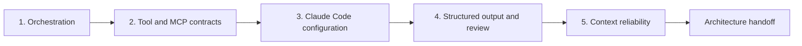

# Defend One Architecture Across Six Contexts | 在六种情境下捍卫同一套架构

> Architecture is the set of boundaries that still hold when the scenario changes, a tool fails, and the evidence is incomplete.

> **【中文解读】** 本课是架构师基础级（CCAR-F）的毕业设计课，核心命题是标题这句话：架构 = 当情境改变、工具失败、证据不完整时仍然守得住的那组边界。反面教材是"一个用例画一张图"的架构师——六张图各用各的套路，评审时说不清为什么这一步是工具、那一步是子 Agent。本课的做法：先建一套"五道门"决策栈（编排 → 工具与 MCP 契约 → Claude Code 配置 → 结构化输出与评审 → 上下文可靠性），再把这套方法套到考试指南公开的六个情境（客服解决、Claude Code 代码生成、多 Agent 研究、开发者生产力、CI/CD、结构化抽取）上，用一个虚构公司 Cedar Bridge 的原创任务逐一压测。交付物是一份架构方案包：任务依赖图、能力矩阵、工具契约、校验器、失败 fixture、跨情境增量和三份 ADR。

> **【拓展：CCAR-F 情境题→迁移能力测试】** 公开考试指南的六类情境本质上考的是同一件事：你能不能把一套决策方法迁移到换了名字和业务细节的新场景。因此备考策略不是背六种拓扑，而是练"看到情境先写后果、证据、权威边界，再画确定性前置条件，最后才选 Agent"。本课的 JSON 校验器把这套不变式做成了确定性检查——它验证的是架构不变式而非文字质量，这个思路与第 14 课（评测把 Agent 行为变成工程证据）一脉相承，也是后续第 32 课（专业级系统毕业设计）十件套证据包的直接前置。

> 🔗 **【前置】** 学本课前请先掌握：(1) 第 16 课"多 Agent 编排与委派"——子 Agent 需要理由（隔离、专门化、独立评审、安全并行）；(2) 第 18 课"工具契约、错误与渐进式发现"——单一动作与对象、封闭 schema、结构化错误；(3) 第 19 课"Claude Code 记忆、规则、Skill 与 CI"——共享指引与路径规则；(4) 第 20 课"可靠抽取、批处理与独立评审者"——四层校验与生成者/评审者分离；(5) 第 21 课"让大上下文可观测"——出处、分层评审与状态传播。本课是这五条线的汇合点。

**Type:** Build | **类型:** 动手构建
**Languages:** Python | **语言:** Python
**Prerequisites:** [Multi-Agent Orchestration and Delegation](../../16-multi-agent-orchestration-and-delegation/), [Tool Contracts, Errors, and Progressive Discovery](../../18-tool-contracts-errors-and-progressive-discovery/), [Claude Code Memory, Rules, Skills, and CI](../../19-claude-code-memory-rules-skills-and-ci/), [Reliable Extraction, Batch, and Independent Reviewers](../../20-reliable-extraction-batch-and-reviewers/), [Make Large Context Observable](../../21-long-context-reliability-provenance-and-escalation/) | **前置知识:** 第 16 课（多 Agent 编排与委派）、第 18 课（工具契约、错误与渐进式发现）、第 19 课（Claude Code 记忆、规则、Skill 与 CI）、第 20 课（可靠抽取、批处理与独立评审者）、第 21 课（让大上下文可观测）
**Time:** ~6 hours across two focused sessions | **时间:** 分两个专注时段，共约 6 小时

## Learning Objectives | 学习目标

- Defend architecture choices across all five CCAR-F domains.
  中文翻译：在 CCAR-F 全部五个领域捍卫架构选择。
- Adapt one decision method to the six public scenario contexts without memorizing one topology.
  中文翻译：把同一套决策方法适配到六个公开情境，而不是背熟某一种拓扑。
- Implement deterministic checks for orchestration, tools, Claude Code, structured output, and context reliability.
  中文翻译：为编排、工具、Claude Code、结构化输出与上下文可靠性实现确定性检查。
- Build failure packets that test partial results, stale state, unsafe tools, and invalid output.
  中文翻译：构建能测试部分结果、过期状态、不安全工具与无效输出的失败包。
- Produce a reviewer-ready architecture packet with explicit tradeoffs and escalation.
  中文翻译：产出一份评审者拿来即用的架构方案包，内含显式权衡与上报路径。

## The Problem | 问题引入

> **【中文解读】** 问题场景要先背下来：架构师为六个预期用例各画一张图——客服图用 Agent 循环、代码图用 Claude Code、研究图有子 Agent、抽取图用 JSON——结果是六套彼此无关的设计。评审时答不上"为什么这一步是工具、那一步是子 Agent"，图里也没有重试语义、配置作用域、部分结果、来源版本和人工权威，每个设计只在快乐路径上成立。情境式架构题考的是迁移：名字和业务细节会换，但同样的决策反复出现——哪些顺序是确定性的、每个关注点由哪个上下文持有、哪些工具可见且可重试、共享指引放在哪、类型正确如何升级为语义与证据成立、哪些状态能在失败和交接后幸存。

An architect prepares six diagrams for six expected use cases. The support diagram uses an agent loop. The code diagram uses Claude Code. The research diagram has subagents. The extraction diagram uses JSON.

> 一位架构师为六个预期用例准备了六张图。客服那张用 Agent 循环，代码那张用 Claude Code，研究那张有子 Agent，抽取那张用 JSON。

During review, the architect cannot explain why one step is a tool and another is a subagent. The diagrams omit retry semantics, configuration scope, partial results, source versions, and human authority. Each design works only on its happy path.

> 评审时，架构师说不清为什么这一步是工具、那一步是子 Agent。这些图漏掉了重试语义、配置作用域、部分结果、来源版本和人工权威。每个设计都只在快乐路径上成立。

Scenario-based architecture questions test transfer. The names and business details change, but the same decisions recur:

> 情境式架构题考的是迁移能力。名字和业务细节会变，但同样的决策反复出现：

- What sequence is deterministic, and what choice requires model reasoning?
  中文翻译：哪些顺序是确定性的，哪些选择需要模型推理？
- Which context should own each concern?
  中文翻译：每个关注点应该由哪个上下文持有？
- Which tools are visible, authorized, and retryable?
  中文翻译：哪些工具可见、已授权、可重试？
- Where does shared Claude Code guidance live?
  中文翻译：共享的 Claude Code 指引应该放在哪里？
- How does a typed result become semantically and evidentially valid?
  中文翻译：一个类型正确的结果如何升级为语义与证据上都成立？
- What state survives failure, compaction, resume, and human handoff?
  中文翻译：哪些状态能在失败、压缩、恢复和人工交接之后幸存？

This capstone builds one architecture method and applies it to all six public contexts.

> 这个毕业设计构建一套架构方法，并把它应用到全部六个公开情境。

## The Concept | 核心概念

### The six contexts are lenses, not templates | 六个情境是透镜，不是模板

> **【中文解读】** 关键观念：六个公开情境是压测同一套架构的六面透镜，不是六张要抄的模板。课程用虚构的软件与服务公司 Cedar Bridge 构造原创任务，每面透镜主攻一处设计失败：客服透镜考"未授权动作或过期策略"、代码生成考"宽权限或缺失跨文件契约"、研究考"重复工作/冲突/来源不全"、开发者生产力考"过期会话状态或隐藏本地配置"、CI/CD 考"无界权限或不可复现的发现"、抽取考"schema 合法但值是编造的"。方法论结论：你不需要六个互不相关的平台，你需要一套核心架构加显式的变化点（variation point）。

The July 2026 public CCAR-F guide names these scenario contexts:

> 2026 年 7 月的公开 CCAR-F 指南列出了这些情境：

1. Customer support resolution agent.
   中文翻译：客服工单解决 Agent。
2. Code generation with Claude Code.
   中文翻译：用 Claude Code 做代码生成。
3. Multi-agent research.
   中文翻译：多 Agent 研究。
4. Developer productivity with Claude.
   中文翻译：用 Claude 提升开发者生产力。
5. Claude Code for CI/CD.
   中文翻译：在 CI/CD 中使用 Claude Code。
6. Structured data extraction.
   中文翻译：结构化数据抽取。

This course does not reproduce exam scenarios. You will create an original system called Cedar Bridge, a fictional software and service company. Each lens stresses a different part of the same architecture.

> 本课程不复制考试情境。你将创造一个名为 Cedar Bridge 的原创系统——一家虚构的软件与服务公司。每面透镜压测同一套架构的不同部位。

| Lens | Original Cedar Bridge task | Primary failure to design |
|---|---|---|
| Support | Draft a resolution from active policy and case evidence | Unauthorized action or stale policy |
| Code generation | Patch a request parser in a monorepo | Broad scope or missing cross-file contract |
| Research | Compare three migration approaches | Duplicate work, conflicts, or partial sources |
| Developer productivity | Turn an approved decision into an ADR and task plan | Stale conversational state or hidden local config |
| CI/CD | Review a pull request from a clean checkout | Unbounded permissions or non-reproducible findings |
| Extraction | Normalize change notices into records | Valid schema with invented or unsupported values |

You do not need six unrelated platforms. You need a core architecture plus explicit variation points.

> 你不需要六个互不相关的平台。你需要一套核心架构加上显式的变化点。

### Use a five-gate decision stack | 使用五道门的决策栈

> **【中文解读】** 五道门就是 CCAR-F 五个领域的顺序化：门 1 编排（什么用代码固化、什么留给模型推理、子 Agent 需要理由）、门 2 工具与 MCP 契约（单一动作与对象、封闭 schema、写工具要新鲜授权加幂等、渐进式发现不缩水访问范围）、门 3 Claude Code 配置（项目指引简洁共享进版本库、路径规则、Skill 与命令、钩子做确定性控制、CI 从干净提交启动而不继承交互会话）、门 4 提示词与结构化输出（先定评测标准再写措辞、未知值可表达、四层校验、限重试、生成者与评审者分离）、门 5 上下文可靠性（最小证据切片带来源元数据、清单和副作用持久化在会话之外、传播完整/部分/受阻状态、置信度来自证据类别与覆盖度、人工评审按后果分层）。五道门走完，落到一份架构交接。



#### Gate 1: Agentic architecture and orchestration | 门 1：Agentic 架构与编排

Define tasks, prerequisites, context boundaries, allowed tools, complete or partial states, and merge rules. Use code for fixed ordering and model reasoning for semantic choices. A subagent needs a reason: isolation, specialization, independent review, or safe parallelism.

> 定义任务、前置条件、上下文边界、允许的工具、完整或部分状态，以及合并规则。固定顺序用代码实现，语义选择交给模型推理。设立子 Agent 需要理由：隔离、专门化、独立评审或安全并行。

For support, a policy researcher and case analyst can work independently after intake. The resolution draft depends on both. The approved executor is a separate authority boundary and is not part of a read-only recommendation loop.

> 对客服情境：策略研究员与案件分析师可以在受理之后独立工作，解决草稿依赖两者。已获授权的执行器是另一个独立的权威边界，不属于只读的推荐循环。

For research, fan out by non-overlapping question and reduce by claim ID. For code, use a manifest and bounded explorers rather than assigning every agent the whole repository.

> 对研究情境：按互不重叠的问题扇出，按论断 ID 归并。对代码情境：使用清单和有边界的探索器，而不是把整个仓库分给每个 Agent。

#### Gate 2: Tool design and MCP integration | 门 2：工具设计与 MCP 集成

Every tool needs one action and object, positive and negative selection guidance, a closed schema, permission scope, side-effect declaration, and structured error contract. A write tool needs fresh authorization, idempotency, and reconciliation.

> 每个工具都需要单一的动作与对象、正向与反向的选择指引、封闭 schema、权限范围、副作用声明和结构化错误契约。写工具还需要新鲜授权、幂等性和对账。

Use MCP resources for contextual data, tools for model-requested actions, and prompts for reusable user-invoked templates. Progressive discovery reduces catalog size but must preserve access scope.

> 用 MCP 资源承载情境数据，用工具承载模型请求的动作，用提示词承载可复用的用户调用模板。渐进式发现缩小了目录规模，但必须保留访问范围。

In CI, read, search, and test interfaces should be sufficient for review. Do not grant production deployment merely because the workflow runs in a pipeline.

> 在 CI 里，读取、搜索和测试接口应当足以完成评审。不要仅仅因为工作流跑在流水线里，就授予生产部署权限。

#### Gate 3: Claude Code configuration and workflows | 门 3：Claude Code 配置与工作流

Keep project guidance concise, versioned, and shared. Put file-specific requirements in path rules. Package reusable methods as Skills and explicit user workflows as commands. Use hooks for deterministic scope and command controls.

> 项目指引保持简洁、纳入版本控制、团队共享。文件特定的要求放进路径规则。可复用方法打包成 Skill，显式用户工作流做成命令。钩子用于确定性的范围与命令控制。

Plan before broad mutation. Explore in isolated read-only contexts. CI starts from a clean commit with declared settings, bounded tools, structured findings, and deterministic tests. It does not resume an interactive developer session.

> 大范围变更之前先规划。在隔离的只读上下文里探索。CI 从干净的提交启动：声明过的设置、有边界的工具、结构化的发现和确定性的测试。它不恢复交互式的开发者会话。

#### Gate 4: Prompt engineering and structured output | 门 4：提示词工程与结构化输出

Define evaluation criteria before prompt wording. Use boundary examples for ambiguous judgments. Make unknown values representable. Enforce schemas where supported, then validate syntax, schema, semantics, and provenance.

> 先定评测标准，再写提示词措辞。为模糊判断准备边界示例。让未知值可被表达。在支持之处强制 schema，然后依次校验语法、schema、语义和出处。

Limit retries and feed back the smallest useful validation error. Separate generator and reviewer contexts. Batch fits asynchronous independent items, not an adaptive tool loop that must observe intermediate results.

> 限制重试次数，只回传最小可用的校验错误。把生成者与评审者的上下文分开。批处理适合异步的独立条目，不适合必须观察中间结果的自适应工具循环。

#### Gate 5: Context management and reliability | 门 5：上下文管理与可靠性

Place hard constraints and the current question clearly. Retrieve the smallest relevant evidence slice with source metadata. Trim logs without deleting failures or coverage. Persist manifests and side effects outside conversation. Propagate complete, partial, and blocked states.

> 把硬约束和当前问题放在显眼位置。检索最小的相关证据切片并带上来源元数据。裁剪日志但不删除失败与覆盖信息。清单和副作用持久化在会话之外。传播完整、部分、受阻三种状态。

Confidence comes from evidence class, coverage, conflict, novelty, and measured errors. Human review is stratified by consequence and uncertainty plus a random sample of ordinary passes.

> 置信度来自证据类别、覆盖度、冲突、新颖性和已测误差。人工评审按后果与不确定性分层，再叠加一份普通通过结果的随机抽样。

### Architecture quality appears in failure behavior | 架构质量显现在失败行为里

> **【中文解读】** 这一组失败场景是本课的"考点清单"：来源在返回有效部分结果后超时、工具返回不该盲目重试的冲突、子 Agent 违反结果 schema、CI 收到仓库里不存在的隐藏本地指令、抽取记录 JSON 合法却引用错误版本、分支变更后恢复的会话里装着过期计划、两条已批准策略冲突且无优先级规则。对每种失败都要写明五件事：检测、遏制、重试或上报、持久状态、人工责任人。图展示组件，情境包展示压力之下的行为——这就是"失败优先"的设计观。

A diagram shows components. A scenario packet shows behavior under pressure:

> 图展示组件。情境包展示压力之下的行为：

- One source times out after returning valid partial results.
  中文翻译：一个来源在返回了有效部分结果之后超时。
- A tool returns a conflict that should not be retried blindly.
  中文翻译：一个工具返回了不该盲目重试的冲突。
- A subagent violates its result schema.
  中文翻译：一个子 Agent 违反了自己的结果 schema。
- CI receives a hidden local instruction that is absent from the repository.
  中文翻译：CI 收到一条仓库里不存在的隐藏本地指令。
- An extraction record is valid JSON but cites the wrong version.
  中文翻译：一条抽取记录是合法 JSON，却引用了错误版本。
- A resumed session contains an obsolete plan after the branch changed.
  中文翻译：分支变更后，一个恢复的会话里还装着过期计划。
- Two approved policies conflict with no precedence rule.
  中文翻译：两条已批准的策略相互冲突，且没有优先级规则。

For each failure, name detection, containment, retry or escalation, durable state, and the human owner.

> 对每种失败，写明检测、遏制、重试或上报、持久状态和人工责任人。

## Build It | 动手构建

## Interactive Lab | 交互实验室

```figure
31-architect-foundation-readiness
```

Use the readiness matrix to test all five architecture gates across the six
scenario lenses. Change a tool, configuration, validation, or context invariant
and observe which scenarios become blocked rather than relying on one topology.

> 用就绪度矩阵在六个情境透镜下测试全部五道架构门。改动一个工具、配置、校验或上下文不变式，观察哪些情境被阻塞——而不是依赖某一种拓扑。

## Practice Lab | 练习实验室

Run one failure fixture per architecture domain and write the cross-scenario
delta that repairs it without weakening the shared invariant.

> 每个架构领域运行一个失败 fixture，并写出能修复它而不削弱共享不变式的跨情境增量。

## Shipped Artifact | 交付产物

The architecture packet and filled
[`outputs/demo-readiness-report.json`](../outputs/demo-readiness-report.json)
are the practical outputs.

> 架构方案包和填写好的 `outputs/demo-readiness-report.json` 就是实践产物。

## Verify It | 验证

Reproduce the report and run failure-first tests with the commands below. The
lesson quiz checks individual transfer decisions.

> 用下面的命令复现报告并运行失败优先测试。本课测验检查的是单项迁移决策。

## Capstone Connection | 毕业设计衔接

The completed packet, cross-scenario deltas, ADRs, and independent review form
the Architect Foundations capstone submission.

> 完成的方案包、跨情境增量、ADR 和独立评审共同构成架构师基础级毕业设计的提交物。

### Step 1: Choose one primary lens | 步骤 1：选定一个主透镜

Select one Cedar Bridge lens or replace it with your own original scenario. Write:

> 选一个 Cedar Bridge 透镜，或换成你自己的原创情境。写下：

```text
Decision supported:
Users and affected people:
Input sources and sensitivity:
Allowed actions:
Prohibited actions:
Latency and volume:
Failure consequence:
Human authority:
```

Do not begin with "use a multi-agent system." Begin with the decision and boundaries.

> 不要从"用一个多 Agent 系统"开始。从决策和边界开始。

### Step 2: Complete the architecture packet | 步骤 2：完成架构方案包

Copy [`outputs/architecture-packet.md`](../outputs/architecture-packet.md). Fill every domain section. The packet should contain:

> 复制 `outputs/architecture-packet.md`，填满每个领域小节。方案包应包含：

- Context and non-goals.
  中文翻译：情境与非目标。
- Task dependency graph and result states.
  中文翻译：任务依赖图与结果状态。
- Role and tool capability matrix.
  中文翻译：角色与工具能力矩阵。
- Tool and MCP contracts with structured errors.
  中文翻译：带结构化错误的工具与 MCP 契约。
- Claude Code instruction, rule, Skill, command, hook, and CI decisions.
  中文翻译：Claude Code 的指令、规则、Skill、命令、钩子与 CI 决策。
- Prompt contract, schema, validators, retry limit, and independent review.
  中文翻译：提示词契约、schema、校验器、重试上限与独立评审。
- Context budget, manifest, provenance, escalation, and human review.
  中文翻译：上下文预算、清单、出处、上报与人工评审。
- Threats, alternatives, rollout, and recovery.
  中文翻译：威胁、备选方案、上线与恢复。

### Step 3: Encode the packet as JSON | 步骤 3：把方案包编码为 JSON

> **【中文解读】** 校验器的定位要讲清楚：它检查的是架构不变式，不是散文质量。七类检查分别对应五道门——必需小节与可识别情境、任务唯一且依赖无环且工具分布到多任务、工具选择边界与结构化错误和幂等、共享 Claude Code 指引与全新 CI 评审、四层校验与评审者分离、出处字段与分层评审、完整架构交接。它证不了的三件事也要记住：模型永远选对、策略本身有效、人工责任人合格——这些要靠情境评测和组织评审补上。红线：不要为了让坏方案包通过而削弱校验器。

Use the shape demonstrated by the included Python validator. The validator intentionally checks architecture invariants, not prose quality.

> 使用随附 Python 校验器演示的形状。校验器刻意检查的是架构不变式，不是文字质量。

Run the passing example:

> 运行通过示例：

```bash
cd certifications/claude/lessons/31-architect-foundations-scenario-capstone
python3 code/main.py
```

Then save your packet and run:

> 然后保存你的方案包并运行：

```bash
python3 code/main.py --input outputs/my-scenario.json
```

The program checks:

> 程序检查：

- Required sections and recognized scenario context.
  中文翻译：必需小节与可识别的情境。
- Unique tasks, known prerequisites, acyclic dependencies, and distributed tools.
  中文翻译：任务唯一、前置已知、依赖无环、工具分布到多任务。
- Tool selection boundaries, structured errors, authorization, and idempotency.
  中文翻译：工具选择边界、结构化错误、授权与幂等性。
- Shared Claude Code guidance, scoped rules, and fresh structured CI review.
  中文翻译：共享的 Claude Code 指引、带作用域的规则、全新且结构化的 CI 评审。
- Four validation layers, bounded retry, unknown states, and reviewer separation.
  中文翻译：四层校验、有界重试、未知状态可表达与评审者分离。
- Provenance fields, result states, escalation reasons, and stratified review.
  中文翻译：出处字段、结果状态、上报原因与分层评审。
- A complete architecture handoff.
  中文翻译：一份完整的架构交接。

It cannot prove the model will always select correctly, the policy is valid, or a human owner is qualified. Add scenario evaluations and organizational review.

> 它无法证明模型永远选对、策略本身有效或人工责任人合格。请补充情境评测与组织评审。

### Step 4: Run failure-first tests | 步骤 4：运行失败优先测试

Run:

> 运行：

```bash
python3 -m unittest discover -s code/tests -v
```

Create at least one additional fixture for each domain:

> 为每个领域至少新增一个 fixture：

| Domain | Injected failure | Expected disposition |
|---|---|---|
| Orchestration | Dependency cycle or missing partial state | Block |
| Tools and MCP | Write tool lacks idempotency | Block |
| Claude Code | CI inherits interactive state | Block |
| Structured output | Schema passes but provenance layer is absent | Block |
| Reliability | Policy conflict has no escalation path | Block |

Do not weaken the validator to make a broken packet pass. Repair the design or explain why the invariant does not apply and replace it with an equivalent control.

> 不要为了让一个坏方案包通过而削弱校验器。修复设计，或解释该不变式为何不适用，并用一个等效控制替换它。

### Step 5: Transfer across all six lenses | 步骤 5：跨全部六个透镜迁移

For each remaining context, write a one-page delta:

> 为其余每个情境写一页增量：

```text
What remains unchanged:
New source or authority boundary:
New tool or MCP requirement:
New Claude Code configuration requirement:
New validation or output requirement:
New context or escalation risk:
Control removed and why:
Control added and why:
```

Examples of valid changes:

> 有效变更的示例：

- Support adds policy freshness and approval before refund execution.
  中文翻译：客服情境增加策略新鲜度检查与退款执行前的审批。
- Code generation adds repository scope, path rules, and tests.
  中文翻译：代码生成情境增加仓库范围、路径规则与测试。
- Research adds claim-level merge and source-conflict preservation.
  中文翻译：研究情境增加论断级归并与来源冲突保留。
- Developer productivity adds a concise project memory hierarchy and explicit commands.
  中文翻译：开发者生产力情境增加简洁的项目记忆层级与显式命令。
- CI/CD adds clean-state headless review and read-only permissions.
  中文翻译：CI/CD 情境增加干净状态的无头评审与只读权限。
- Extraction adds nullable unknowns, evidence spans, and batch reconciliation.
  中文翻译：抽取情境增加可空的未知值、证据片段与批处理对账。

The core requirements for provenance, errors, bounded authority, and verification should survive every lens.

> 出处、错误、有界权威与验证这四项核心要求，应在每个透镜下都幸存。

### Step 6: Defend tradeoffs | 步骤 6：为权衡辩护

Write three architecture decision records:

> 写三份架构决策记录（ADR）：

1. Single agent versus coordinator and subagents.
   中文翻译：单 Agent 对协调者加子 Agent。
2. Direct tool catalog versus MCP and progressive discovery.
   中文翻译：直接工具目录对 MCP 与渐进式发现。
3. Interactive processing versus asynchronous batch.
   中文翻译：交互式处理对异步批处理。

For each, include context, chosen option, rejected alternatives, consequence, evidence, change trigger, and owner. An ADR is not a product preference. It explains why the choice fits this scenario.

> 每份 ADR 都要包含情境、所选选项、被否决的备选、后果、证据、变更触发条件和责任人。ADR 不是产品偏好。它解释这个选择为什么贴合这个情境。

### Step 7: Conduct independent review | 步骤 7：执行独立评审

Give a fresh reviewer the packet, validator output, threat fixtures, and rubric. Do not give it the persuasive design transcript. Require findings with stable IDs, affected domain, evidence, severity, and required correction.

> 给一位新评审者方案包、校验器输出、威胁 fixture 和评分量表，但不要给他那份带说服倾向的设计过程记录。要求发现项带稳定 ID、受影响领域、证据、严重程度和必需的纠正措施。

The architect then resolves or rejects each finding with evidence. Run deterministic validation again and preserve the final handoff.

> 架构师随后用证据逐条解决或驳回发现。再跑一次确定性校验，并保留最终交接。

## Use It | 运行验证

### Exam scenario method | 考试情境方法论

> **【中文解读】** 考试做题顺序本身就是答案：先写后果、证据与权威边界；在选 Agent 之前先画确定性前置条件；给每个角色最小的工具面；把共享配置与用户本地上下文分开；区分结构性有效与语义、出处有效；传播部分工作并把不可重试的缺口上报；优先选能保住每条必需不变式的最小架构。配对的排除法：不要因为选项提到的 Claude 功能更多就选它，要选那个能修复点名失败又不制造更大失败的控制。八条常见陷阱反向对应这个方法：拓扑优先、子 Agent 当函数用、工具描述当授权、个人配置当团队策略、schema 当真相、恢复当故障还原、一个情境名一套设计、功能密度当先进性。

When reading a scenario:

> 读情境题时：

1. Write the consequence, evidence, and authority boundary.
   中文翻译：先写下后果、证据与权威边界。
2. Draw deterministic prerequisites before choosing agents.
   中文翻译：在选 Agent 之前先画确定性前置条件。
3. Give each role the smallest tool surface.
   中文翻译：给每个角色最小的工具面。
4. Separate shared configuration from user-local context.
   中文翻译：把共享配置与用户本地上下文分开。
5. Distinguish structural validity from semantic and provenance validity.
   中文翻译：区分结构性有效与语义、出处有效。
6. Propagate partial work and escalate non-retryable gaps.
   中文翻译：传播部分工作，把不可重试的缺口上报。
7. Prefer the smallest architecture that preserves every required invariant.
   中文翻译：优先选择能保住每条必需不变式的最小架构。

Do not select an option because it mentions more Claude features. Select the control that repairs the named failure without creating a larger one.

> 不要因为一个选项提到的 Claude 功能更多就选它。选那个能修复点名失败、又不会制造更大失败的控制。

### Submission evidence | 提交证据

A complete capstone contains:

> 完整的毕业设计包含：

- One completed primary architecture packet.
  中文翻译：一份完成的主架构方案包。
- One valid JSON packet and validator output.
  中文翻译：一份合法的 JSON 方案包与校验器输出。
- Five cross-scenario delta pages.
  中文翻译：五页跨情境增量。
- At least five added failure fixtures, one per domain.
  中文翻译：至少五个新增失败 fixture，每个领域一个。
- Three ADRs with rejected alternatives.
  中文翻译：三份带被否决备选方案的 ADR。
- Independent reviewer findings and dispositions.
  中文翻译：独立评审者的发现与处置。
- Passing test output.
  中文翻译：通过的测试输出。
- One residual-risk and human-ownership statement.
  中文翻译：一份残余风险与人工责任人声明。

### Common traps | 常见陷阱

- **Topology first:** Agents are selected before requirements and dependencies.
  中文翻译：**拓扑优先：**还没理清需求和依赖就先选 Agent。
- **Subagent as function:** Deterministic utilities receive unnecessary reasoning contexts.
  中文翻译：**子 Agent 当函数用：**确定性工具被塞进不必要的推理上下文。
- **Tool description as authorization:** Natural language replaces service enforcement.
  中文翻译：**工具描述当授权：**自然语言取代了服务端强制。
- **Personal config as team policy:** CI and collaborators cannot reproduce behavior.
  中文翻译：**个人配置当团队策略：**CI 和协作者无法复现行为。
- **Schema as truth:** Unsupported values pass type checks.
  中文翻译：**schema 当真相：**无依据的值通过了类型检查。
- **Resume as recovery:** Stale conversation replaces external state reconciliation.
  中文翻译：**恢复当故障还原：**过期会话取代了外部状态对账。
- **One design per scenario name:** Shared architecture principles never transfer.
  中文翻译：**一个情境名一套设计：**共享的架构原则从不迁移。
- **Feature density as sophistication:** Extra components add cost without closing a failure path.
  中文翻译：**功能密度当先进性：**多余组件只增加成本，没堵住任何失败路径。

### Exercises | 练习

1. Remove one subagent from your design and determine whether quality changes.
   中文翻译：从你的设计里移除一个子 Agent，判断质量是否变化。
2. Replace an action tool with an MCP resource where the model only needs context.
   中文翻译：在模型只需要上下文的地方，把一个动作工具换成 MCP 资源。
3. Move one global instruction into a tested path rule.
   中文翻译：把一条全局指令移进经过测试的路径规则。
4. Add a semantic validator that catches a schema-valid false claim.
   中文翻译：增加一个能抓住"schema 合法但内容为假"论断的语义校验器。
5. Compact a long session into a resume packet and prove external state is still authoritative.
   中文翻译：把长会话压缩成恢复包，并证明外部状态仍然具有权威性。
6. Exchange architecture packets with another learner and run each other's failure fixtures.
   中文翻译：与另一位学习者交换架构方案包，并互跑对方的失败 fixture。

## Key Terms | 关键术语

- **Scenario lens:** A business context used to stress shared architecture decisions.
  中文翻译：**情境透镜：**用来压测共享架构决策的业务情境。
- **Variation point:** A component or policy expected to change by scenario while core invariants remain.
  中文翻译：**变化点：**预期随情境改变、而核心不变式保持不变的组件或策略。
- **Capability matrix:** A mapping of roles to allowed tools, data, and actions.
  中文翻译：**能力矩阵：**角色到允许的工具、数据与动作的映射。
- **Architecture invariant:** A condition that must hold across components and failures.
  中文翻译：**架构不变式：**必须在各组件之间和失败之下都成立的条件。
- **Failure fixture:** A controlled scenario that proves detection and recovery behavior.
  中文翻译：**失败 fixture：**用来证明检测与恢复行为的受控情境。
- **Cross-scenario delta:** The explicit change required to adapt one architecture to another context.
  中文翻译：**跨情境增量：**把一套架构适配到另一个情境所需的显式变更。
- **Residual risk:** Known risk that remains after controls, with owner and disposition.
  中文翻译：**残余风险：**控制实施后仍然存在的已知风险，带责任人与处置。
- **Architecture handoff:** The packet of decisions, evidence, controls, gaps, and next ownership required to implement safely.
  中文翻译：**架构交接：**安全实施所需的决策、证据、控制、缺口与后续责任归属之包。

## Further Reading | 延伸阅读

- [Claude Certified Architect Foundations Exam Guide](https://everpath-course-content.s3-accelerate.amazonaws.com/instructor%2F6nizmqk8tpzpfjvt6qmmav7rh%2Fpublic%2F1783542750%2FClaude+Certified+Architect+%E2%80%93+Foundations+Exam+Guide.pdf)
  中文翻译：Claude 认证架构师基础级考试指南——六类情境与五领域的官方出处
- [Anthropic: Building effective agents](https://www.anthropic.com/research/building-effective-agents)
  中文翻译：构建有效的 Agent——Anthropic 的编排模式总览
- [Anthropic: Claude Agent SDK](https://platform.claude.com/docs/en/agent-sdk/overview)
  中文翻译：Claude Agent SDK——宿主与权限边界的官方文档
- [Anthropic: Tool use](https://platform.claude.com/docs/en/agents-and-tools/tool-use/overview)
  中文翻译：工具使用——工具契约与结构化错误的官方文档
- [Model Context Protocol specification](https://modelcontextprotocol.io/specification/latest)
  中文翻译：MCP 规范——资源、工具与提示词原语的权威定义
- [Anthropic: Structured outputs](https://platform.claude.com/docs/en/build-with-claude/structured-outputs)
  中文翻译：结构化输出——schema 强制与校验分层的官方文档
- [AI Engineering from Scratch: Orchestration Patterns](../../../../../phases/14-agent-engineering/28-orchestration-patterns/)
  中文翻译：本课程第 14 阶段的编排模式课——扇出/归并的实现细节
- [AI Engineering from Scratch: Durable Execution](../../../../../phases/15-autonomous-systems/12-durable-execution/)
  中文翻译：本课程第 15 阶段的持久执行课——失败后状态幸存的工程基础
- [AI Engineering from Scratch: Reviewer Agent](../../../../../phases/14-agent-engineering/39-reviewer-agent/)
  中文翻译：本课程第 14 阶段的评审者 Agent 课——独立评审的分离实现

Agent SDK, Claude Code, API, MCP, context, model, and batch behavior can change. The public blueprint and references were checked on 2026-08-08. Verify current official documentation and the exact runtime before freezing implementation details.

> Agent SDK、Claude Code、API、MCP、上下文、模型与批处理的行为都可能变化。公开蓝图和参考文献已于 2026-08-08 核实。在冻结实现细节之前，请核对当前官方文档与确切的运行时。
