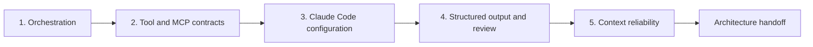

# 在六种情境下捍卫同一套架构

> 架构是当情境改变、工具失败、证据不完整时，仍然守得住的那一组边界。

> **【中文解读】** 本课是架构师基础级（CCAR-F）的毕业设计课，核心命题是标题这句话：架构 = 当情境改变、工具失败、证据不完整时仍然守得住的那组边界。反面教材是"一个用例画一张图"的架构师——六张图各用各的套路，评审时说不清为什么这一步是工具、那一步是子 Agent。本课的做法：先建一套"五道门"决策栈（编排 → 工具与 MCP 契约 → Claude Code 配置 → 结构化输出与评审 → 上下文可靠性），再把这套方法套到考试指南公开的六个情境（客服解决、Claude Code 代码生成、多 Agent 研究、开发者生产力、CI/CD、结构化抽取）上，用一个虚构公司 Cedar Bridge 的原创任务逐一压测。交付物是一份架构方案包：任务依赖图、能力矩阵、工具契约、校验器、失败 fixture、跨情境增量和三份 ADR。

> **【拓展：CCAR-F 情境题→迁移能力测试】** 公开考试指南的六类情境本质上考的是同一件事：你能不能把一套决策方法迁移到换了名字和业务细节的新场景。因此备考策略不是背六种拓扑，而是练"看到情境先写后果、证据、权威边界，再画确定性前置条件，最后才选 Agent"。本课的 JSON 校验器把这套不变式做成了确定性检查——它验证的是架构不变式而非文字质量，这个思路与第 14 课（评测把 Agent 行为变成工程证据）一脉相承，也是后续第 32 课（专业级系统毕业设计）十件套证据包的直接前置。

> 🔗 **【前置】** 学本课前请先掌握：(1) 第 16 课"多 Agent 编排与委派"——子 Agent 需要理由（隔离、专门化、独立评审、安全并行）；(2) 第 18 课"工具契约、错误与渐进式发现"——单一动作与对象、封闭 schema、结构化错误；(3) 第 19 课"Claude Code 记忆、规则、Skill 与 CI"——共享指引与路径规则；(4) 第 20 课"可靠抽取、批处理与独立评审者"——四层校验与生成者/评审者分离；(5) 第 21 课"让大上下文可观测"——出处、分层评审与状态传播。本课是这五条线的汇合点。

**类型：** 动手构建
**语言：** Python
**前置条件：** 第 16 课（多 Agent 编排与委派）、第 18 课（工具契约、错误与渐进式发现）、第 19 课（Claude Code 记忆、规则、Skill 与 CI）、第 20 课（可靠抽取、批处理与独立评审者）、第 21 课（让大上下文可观测）
**预计用时：** 分两个专注时段，共约 6 小时

## 学习目标

- 在 CCAR-F 全部五个领域捍卫架构选择。
- 把同一套决策方法适配到六个公开情境，而不是背熟某一种拓扑。
- 为编排、工具、Claude Code、结构化输出与上下文可靠性实现确定性检查。
- 构建能测试部分结果、过期状态、不安全工具与无效输出的失败包。
- 产出一份评审者拿来即用的架构方案包，内含显式权衡与上报路径。

## 问题引入

> **【中文解读】** 问题场景要先背下来：架构师为六个预期用例各画一张图——客服图用 Agent 循环、代码图用 Claude Code、研究图有子 Agent、抽取图用 JSON——结果是六套彼此无关的设计。评审时答不上"为什么这一步是工具、那一步是子 Agent"，图里也没有重试语义、配置作用域、部分结果、来源版本和人工权威，每个设计只在快乐路径上成立。情境式架构题考的是迁移：名字和业务细节会换，但同样的决策反复出现——哪些顺序是确定性的、每个关注点由哪个上下文持有、哪些工具可见且可重试、共享指引放在哪、类型正确如何升级为语义与证据成立、哪些状态能在失败和交接后幸存。

一位架构师为六个预期用例准备了六张图。客服那张用 Agent 循环，代码那张用 Claude Code，研究那张有子 Agent，抽取那张用 JSON。

评审时，架构师说不清为什么这一步是工具、那一步是子 Agent。这些图漏掉了重试语义、配置作用域、部分结果、来源版本和人工权威。每个设计都只在快乐路径上成立。

情境式架构题考的是迁移能力。名字和业务细节会变，但同样的决策反复出现：

- 哪些顺序是确定性的，哪些选择需要模型推理？
- 每个关注点应该由哪个上下文持有？
- 哪些工具可见、已授权、可重试？
- 共享的 Claude Code 指引应该放在哪里？
- 一个类型正确的结果如何升级为语义与证据上都成立？
- 哪些状态能在失败、压缩、恢复和人工交接之后幸存？

这个毕业设计构建一套架构方法，并把它应用到全部六个公开情境。

## 核心概念

### 六个情境是透镜，不是模板

> **【中文解读】** 关键观念：六个公开情境是压测同一套架构的六面透镜，不是六张要抄的模板。课程用虚构的软件与服务公司 Cedar Bridge 构造原创任务，每面透镜主攻一处设计失败：客服透镜考"未授权动作或过期策略"、代码生成考"宽权限或缺失跨文件契约"、研究考"重复工作/冲突/来源不全"、开发者生产力考"过期会话状态或隐藏本地配置"、CI/CD 考"无界权限或不可复现的发现"、抽取考"schema 合法但值是编造的"。方法论结论：你不需要六个互不相关的平台，你需要一套核心架构加显式的变化点（variation point）。

2026 年 7 月的公开 CCAR-F 指南列出了这些情境：

1. 客服工单解决 Agent。
2. 用 Claude Code 做代码生成。
3. 多 Agent 研究。
4. 用 Claude 提升开发者生产力。
5. 在 CI/CD 中使用 Claude Code。
6. 结构化数据抽取。

本课程不复制考试情境。你将创造一个名为 Cedar Bridge 的原创系统——一家虚构的软件与服务公司。每面透镜压测同一套架构的不同部位。

| 透镜 | Cedar Bridge 原创任务 | 要设计掉的主要失败 |
|---|---|---|
| 客服 | 从现行策略与案件证据起草解决方案 | 未授权动作或过期策略 |
| 代码生成 | 在 monorepo 里修补一个请求解析器 | 宽权限或缺失跨文件契约 |
| 研究 | 比较三种迁移方案 | 重复工作、冲突或来源不全 |
| 开发者生产力 | 把已批准的决策变成 ADR 与任务计划 | 过期会话状态或隐藏本地配置 |
| CI/CD | 从干净检出评审一个拉取请求 | 无界权限或不可复现的发现 |
| 抽取 | 把变更通知规范化为记录 | schema 合法但值是编造或无依据的 |

你不需要六个互不相关的平台。你需要一套核心架构加上显式的变化点。

### 使用五道门的决策栈

> **【中文解读】** 五道门就是 CCAR-F 五个领域的顺序化：门 1 编排（什么用代码固化、什么留给模型推理、子 Agent 需要理由）、门 2 工具与 MCP 契约（单一动作与对象、封闭 schema、写工具要新鲜授权加幂等、渐进式发现不缩水访问范围）、门 3 Claude Code 配置（项目指引简洁共享进版本库、路径规则、Skill 与命令、钩子做确定性控制、CI 从干净提交启动而不继承交互会话）、门 4 提示词与结构化输出（先定评测标准再写措辞、未知值可表达、四层校验、限重试、生成者与评审者分离）、门 5 上下文可靠性（最小证据切片带来源元数据、清单和副作用持久化在会话之外、传播完整/部分/受阻状态、置信度来自证据类别与覆盖度、人工评审按后果分层）。五道门走完，落到一份架构交接。



#### 门 1：Agentic 架构与编排

定义任务、前置条件、上下文边界、允许的工具、完整或部分状态，以及合并规则。固定顺序用代码实现，语义选择交给模型推理。设立子 Agent 需要理由：隔离、专门化、独立评审或安全并行。

对客服情境：策略研究员与案件分析师可以在受理之后独立工作，解决草稿依赖两者。已获授权的执行器是另一个独立的权威边界，不属于只读的推荐循环。

对研究情境：按互不重叠的问题扇出，按论断 ID 归并。对代码情境：使用清单和有边界的探索器，而不是把整个仓库分给每个 Agent。

#### 门 2：工具设计与 MCP 集成

每个工具都需要单一的动作与对象、正向与反向的选择指引、封闭 schema、权限范围、副作用声明和结构化错误契约。写工具还需要新鲜授权、幂等性和对账。

用 MCP 资源承载情境数据，用工具承载模型请求的动作，用提示词承载可复用的用户调用模板。渐进式发现缩小了目录规模，但必须保留访问范围。

在 CI 里，读取、搜索和测试接口应当足以完成评审。不要仅仅因为工作流跑在流水线里，就授予生产部署权限。

#### 门 3：Claude Code 配置与工作流

项目指引保持简洁、纳入版本控制、团队共享。文件特定的要求放进路径规则。可复用方法打包成 Skill，显式用户工作流做成命令。钩子用于确定性的范围与命令控制。

大范围变更之前先规划。在隔离的只读上下文里探索。CI 从干净的提交启动：声明过的设置、有边界的工具、结构化的发现和确定性的测试。它不恢复交互式的开发者会话。

#### 门 4：提示词工程与结构化输出

先定评测标准，再写提示词措辞。为模糊判断准备边界示例。让未知值可被表达。在支持之处强制 schema，然后依次校验语法、schema、语义和出处。

限制重试次数，只回传最小可用的校验错误。把生成者与评审者的上下文分开。批处理适合异步的独立条目，不适合必须观察中间结果的自适应工具循环。

#### 门 5：上下文管理与可靠性

把硬约束和当前问题放在显眼位置。检索最小的相关证据切片并带上来源元数据。裁剪日志但不删除失败与覆盖信息。清单和副作用持久化在会话之外。传播完整、部分、受阻三种状态。

置信度来自证据类别、覆盖度、冲突、新颖性和已测误差。人工评审按后果与不确定性分层，再叠加一份普通通过结果的随机抽样。

### 架构质量显现在失败行为里

> **【中文解读】** 这一组失败场景是本课的"考点清单"：来源在返回有效部分结果后超时、工具返回不该盲目重试的冲突、子 Agent 违反结果 schema、CI 收到仓库里不存在的隐藏本地指令、抽取记录 JSON 合法却引用错误版本、分支变更后恢复的会话里装着过期计划、两条已批准策略冲突且无优先级规则。对每种失败都要写明五件事：检测、遏制、重试或上报、持久状态、人工责任人。图展示组件，情境包展示压力之下的行为——这就是"失败优先"的设计观。

图展示组件。情境包展示压力之下的行为：

- 一个来源在返回了有效部分结果之后超时。
- 一个工具返回了不该盲目重试的冲突。
- 一个子 Agent 违反了自己的结果 schema。
- CI 收到一条仓库里不存在的隐藏本地指令。
- 一条抽取记录是合法 JSON，却引用了错误版本。
- 分支变更后，一个恢复的会话里还装着过期计划。
- 两条已批准的策略相互冲突，且没有优先级规则。

对每种失败，写明检测、遏制、重试或上报、持久状态和人工责任人。

## 动手构建

## 交互实验室

```figure
31-architect-foundation-readiness
```

用就绪度矩阵在六个情境透镜下测试全部五道架构门。改动一个工具、配置、校验或上下文不变式，观察哪些情境被阻塞——而不是依赖某一种拓扑。

## 练习实验室

每个架构领域运行一个失败 fixture，并写出能修复它而不削弱共享不变式的跨情境增量。

## 交付产物

架构方案包和填写好的 [`outputs/demo-readiness-report.json`](../outputs/demo-readiness-report.json) 就是实践产物。

## 验证

用下面的命令复现报告并运行失败优先测试。本课测验检查的是单项迁移决策。

## 毕业设计衔接

完成的方案包、跨情境增量、ADR 和独立评审共同构成架构师基础级毕业设计的提交物。

### 步骤 1：选定一个主透镜

选一个 Cedar Bridge 透镜，或换成你自己的原创情境。写下：

```text
Decision supported:
Users and affected people:
Input sources and sensitivity:
Allowed actions:
Prohibited actions:
Latency and volume:
Failure consequence:
Human authority:
```

不要从"用一个多 Agent 系统"开始。从决策和边界开始。

### 步骤 2：完成架构方案包

复制 [`outputs/architecture-packet.md`](../outputs/architecture-packet.md)，填满每个领域小节。方案包应包含：

- 情境与非目标。
- 任务依赖图与结果状态。
- 角色与工具能力矩阵。
- 带结构化错误的工具与 MCP 契约。
- Claude Code 的指令、规则、Skill、命令、钩子与 CI 决策。
- 提示词契约、schema、校验器、重试上限与独立评审。
- 上下文预算、清单、出处、上报与人工评审。
- 威胁、备选方案、上线与恢复。

### 步骤 3：把方案包编码为 JSON

> **【中文解读】** 校验器的定位要讲清楚：它检查的是架构不变式，不是散文质量。七类检查分别对应五道门——必需小节与可识别情境、任务唯一且依赖无环且工具分布到多任务、工具选择边界与结构化错误和幂等、共享 Claude Code 指引与全新 CI 评审、四层校验与评审者分离、出处字段与分层评审、完整架构交接。它证不了的三件事也要记住：模型永远选对、策略本身有效、人工责任人合格——这些要靠情境评测和组织评审补上。红线：不要为了让坏方案包通过而削弱校验器。

使用随附 Python 校验器演示的形状。校验器刻意检查的是架构不变式，不是文字质量。

运行通过示例：

```bash
cd certifications/claude/lessons/31-architect-foundations-scenario-capstone
python3 code/main.py
```

然后保存你的方案包并运行：

```bash
python3 code/main.py --input outputs/my-scenario.json
```

程序检查：

- 必需小节与可识别的情境。
- 任务唯一、前置已知、依赖无环、工具分布到多任务。
- 工具选择边界、结构化错误、授权与幂等性。
- 共享的 Claude Code 指引、带作用域的规则、全新且结构化的 CI 评审。
- 四层校验、有界重试、未知状态可表达与评审者分离。
- 出处字段、结果状态、上报原因与分层评审。
- 一份完整的架构交接。

它无法证明模型永远选对、策略本身有效或人工责任人合格。请补充情境评测与组织评审。

### 步骤 4：运行失败优先测试

运行：

```bash
python3 -m unittest discover -s code/tests -v
```

为每个领域至少新增一个 fixture：

| 领域 | 注入的失败 | 预期处置 |
|---|---|---|
| 编排 | 依赖成环或缺少部分状态 | 阻塞 |
| 工具与 MCP | 写工具缺少幂等性 | 阻塞 |
| Claude Code | CI 继承交互式状态 | 阻塞 |
| 结构化输出 | schema 通过但缺少出处层 | 阻塞 |
| 可靠性 | 策略冲突没有上报路径 | 阻塞 |

不要为了让一个坏方案包通过而削弱校验器。修复设计，或解释该不变式为何不适用，并用一个等效控制替换它。

### 步骤 5：跨全部六个透镜迁移

为其余每个情境写一页增量：

```text
What remains unchanged:
New source or authority boundary:
New tool or MCP requirement:
New Claude Code configuration requirement:
New validation or output requirement:
New context or escalation risk:
Control removed and why:
Control added and why:
```

有效变更的示例：

- 客服情境增加策略新鲜度检查与退款执行前的审批。
- 代码生成情境增加仓库范围、路径规则与测试。
- 研究情境增加论断级归并与来源冲突保留。
- 开发者生产力情境增加简洁的项目记忆层级与显式命令。
- CI/CD 情境增加干净状态的无头评审与只读权限。
- 抽取情境增加可空的未知值、证据片段与批处理对账。

出处、错误、有界权威与验证这四项核心要求，应在每个透镜下都幸存。

### 步骤 6：为权衡辩护

写三份架构决策记录（ADR）：

1. 单 Agent 对协调者加子 Agent。
2. 直接工具目录对 MCP 与渐进式发现。
3. 交互式处理对异步批处理。

每份 ADR 都要包含情境、所选选项、被否决的备选、后果、证据、变更触发条件和责任人。ADR 不是产品偏好。它解释这个选择为什么贴合这个情境。

### 步骤 7：执行独立评审

给一位新评审者方案包、校验器输出、威胁 fixture 和评分量表，但不要给他那份带说服倾向的设计过程记录。要求发现项带稳定 ID、受影响领域、证据、严重程度和必需的纠正措施。

架构师随后用证据逐条解决或驳回发现。再跑一次确定性校验，并保留最终交接。

## 运行验证

### 考试情境方法论

> **【中文解读】** 考试做题顺序本身就是答案：先写后果、证据与权威边界；在选 Agent 之前先画确定性前置条件；给每个角色最小的工具面；把共享配置与用户本地上下文分开；区分结构性有效与语义、出处有效；传播部分工作并把不可重试的缺口上报；优先选能保住每条必需不变式的最小架构。配对的排除法：不要因为选项提到的 Claude 功能更多就选它，要选那个能修复点名失败又不制造更大失败的控制。八条常见陷阱反向对应这个方法：拓扑优先、子 Agent 当函数用、工具描述当授权、个人配置当团队策略、schema 当真相、恢复当故障还原、一个情境名一套设计、功能密度当先进性。

读情境题时：

1. 先写下后果、证据与权威边界。
2. 在选 Agent 之前先画确定性前置条件。
3. 给每个角色最小的工具面。
4. 把共享配置与用户本地上下文分开。
5. 区分结构性有效与语义、出处有效。
6. 传播部分工作，把不可重试的缺口上报。
7. 优先选择能保住每条必需不变式的最小架构。

不要因为一个选项提到的 Claude 功能更多就选它。选那个能修复点名失败、又不会制造更大失败的控制。

### 提交证据

完整的毕业设计包含：

- 一份完成的主架构方案包。
- 一份合法的 JSON 方案包与校验器输出。
- 五页跨情境增量。
- 至少五个新增失败 fixture，每个领域一个。
- 三份带被否决备选方案的 ADR。
- 独立评审者的发现与处置。
- 通过的测试输出。
- 一份残余风险与人工责任人声明。

### 常见陷阱

- **拓扑优先：**还没理清需求和依赖就先选 Agent。
- **子 Agent 当函数用：**确定性工具被塞进不必要的推理上下文。
- **工具描述当授权：**自然语言取代了服务端强制。
- **个人配置当团队策略：**CI 和协作者无法复现行为。
- **schema 当真相：**无依据的值通过了类型检查。
- **恢复当故障还原：**过期会话取代了外部状态对账。
- **一个情境名一套设计：**共享的架构原则从不迁移。
- **功能密度当先进性：**多余组件只增加成本，没堵住任何失败路径。

### 练习

1. 从你的设计里移除一个子 Agent，判断质量是否变化。
2. 在模型只需要上下文的地方，把一个动作工具换成 MCP 资源。
3. 把一条全局指令移进经过测试的路径规则。
4. 增加一个能抓住"schema 合法但内容为假"论断的语义校验器。
5. 把长会话压缩成恢复包，并证明外部状态仍然具有权威性。
6. 与另一位学习者交换架构方案包，并互跑对方的失败 fixture。

## 关键术语

- **情境透镜：**用来压测共享架构决策的业务情境。
- **变化点：**预期随情境改变、而核心不变式保持不变的组件或策略。
- **能力矩阵：**角色到允许的工具、数据与动作的映射。
- **架构不变式：**必须在各组件之间和失败之下都成立的条件。
- **失败 fixture：**用来证明检测与恢复行为的受控情境。
- **跨情境增量：**把一套架构适配到另一个情境所需的显式变更。
- **残余风险：**控制实施后仍然存在的已知风险，带责任人与处置。
- **架构交接：**安全实施所需的决策、证据、控制、缺口与后续责任归属之包。

## 延伸阅读

- [Claude Certified Architect Foundations Exam Guide](https://everpath-course-content.s3-accelerate.amazonaws.com/instructor%2F6nizmqk8tpzpfjvt6qmmav7rh%2Fpublic%2F1783542750%2FClaude+Certified+Architect+%E2%80%93+Foundations+Exam+Guide.pdf) — Claude 认证架构师基础级考试指南：六类情境与五领域的官方出处
- [Anthropic: Building effective agents](https://www.anthropic.com/research/building-effective-agents) — 构建有效的 Agent：Anthropic 的编排模式总览
- [Anthropic: Claude Agent SDK](https://platform.claude.com/docs/en/agent-sdk/overview) — Claude Agent SDK：宿主与权限边界的官方文档
- [Anthropic: Tool use](https://platform.claude.com/docs/en/agents-and-tools/tool-use/overview) — 工具使用：工具契约与结构化错误的官方文档
- [Model Context Protocol specification](https://modelcontextprotocol.io/specification/latest) — MCP 规范：资源、工具与提示词原语的权威定义
- [Anthropic: Structured outputs](https://platform.claude.com/docs/en/build-with-claude/structured-outputs) — 结构化输出：schema 强制与校验分层的官方文档
- [AI Engineering from Scratch: Orchestration Patterns](../../../../../phases/14-agent-engineering/28-orchestration-patterns/) — 本课程第 14 阶段的编排模式课：扇出/归并的实现细节
- [AI Engineering from Scratch: Durable Execution](../../../../../phases/15-autonomous-systems/12-durable-execution/) — 本课程第 15 阶段的持久执行课：失败后状态幸存的工程基础
- [AI Engineering from Scratch: Reviewer Agent](../../../../../phases/14-agent-engineering/39-reviewer-agent/) — 本课程第 14 阶段的评审者 Agent 课：独立评审的分离实现

Agent SDK、Claude Code、API、MCP、上下文、模型与批处理的行为都可能变化。公开蓝图和参考文献已于 2026-08-08 核实。在冻结实现细节之前，请核对当前官方文档与确切的运行时。
