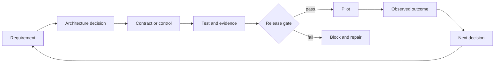

# Architect Professional System Capstone | 架构师专业级系统毕业设计

> Build the evidence packet that makes a production architecture defensible.

> **【中文解读】** 本课是架构师专业级（CCAR-P）路线的终点毕业设计：为一家多区域运营的公司设计一套受治理的企业客服工单解决系统，并构建"能让生产级架构站得住脚的证据包"。与第 31 课（基础级情境毕业设计）考"一套方法跨六个情境迁移"不同，本课考"全生命周期深度"：从业务发现、架构选项与 ADR、端到端视图、模型/提示词/上下文计划、RAG 设计、集成与身份，到评测证据、治理与人审、上线运维、干系人交接，共十件相互衔接的交付物。任务设定刻意不给"最大化自主权"的诱饵——你要在约束下设计最好的系统，并证明它为什么就绪。

> **【拓展：CCAR-P 评分量表→本课十件套的来源】** 十件套直接对应专业级公开考试蓝图的加权领域：方案设计 17、模型/提示词/上下文 13、集成 19、评测与优化 16、治理与风险 14、干系人生命周期 14、开发者运维 7（课程自用评分量表，非官方计分模型）。本课的 Python 实验室把"需求→决策→控制→测试与证据→发布门禁"的证据链做成了可运行的确定性校验，与第 14 课（评测即工程证据）和第 28 课（ADR 与生命周期归属）一脉相承。完成后，认证课 00-32 全部具备中文批注与完整翻译。

> 🔗 **【前置】** 本课汇聚架构师专业级路线的全部核心课程，重点依赖：第 01-06 课（产品与模型选型、上下文、输出校验、治理）、第 08-13 课（Messages API 生命周期、结构化输出、工具循环、MCP、Agent SDK、应用安全）、第 14-16/18 课（评测、Claude Code 团队协作、多 Agent 编排、工具契约）、第 22-28 课（业务发现与 SLA、端到端架构与价值权衡、RAG 与数据管道、集成协议与最小权限、生产可观测性、企业治理与合规、干系人沟通与 ADR）。建议最后完成。

**Type:** Build | **类型:** 动手构建
**Languages:** Python | **语言:** Python
**Prerequisites:** [Choose the Smallest Surface That Can Carry the Work](../../01-claude-product-and-model-landscape/), [Spend Capability Where Failure Is Expensive](../../02-model-selection-and-token-economics/), [Turn a Request Into a Testable Contract](../../03-prompting-and-task-decomposition/), [Put Each Fact in the Right Kind of Context](../../04-context-knowledge-memory-and-caching/), [Validate the Claim, Not the Confidence](../../05-output-evaluation-and-validation/), [Put Authority Around Capability](../../06-governance-safety-and-responsible-use/), [The Messages API Is a State Machine](../../08-messages-api-and-application-lifecycle/), [Structured Output Is an Untrusted Contract](../../09-structured-output-and-defensive-parsing/), [A Tool Loop Is Controlled Delegation](../../10-tool-use-and-agentic-loops/), [MCP Separates Capability From Host](../../11-mcp-server-design-and-integration/), [The Agent SDK Is a Harness, Not Permission](../../12-claude-agent-sdk-and-hooks/), [Security Lives Outside the Prompt](../../13-application-security-and-secrets/), [Evals Turn Agent Behavior Into Engineering Evidence](../../14-evals-testing-debugging-and-observability/), [Claude Code Scales Through Shared Constraints](../../15-claude-code-for-development-teams/), [Multi-Agent Orchestration and Delegation](../../16-multi-agent-orchestration-and-delegation/), [Tool Contracts, Errors, and Progressive Discovery](../../18-tool-contracts-errors-and-progressive-discovery/), [Business Discovery, Requirements, and SLAs](../../22-business-discovery-requirements-and-slas/), [End-to-End Architecture and Value Tradeoffs](../../23-end-to-end-architecture-and-value-tradeoffs/), [RAG, Retrieval, and Data Pipelines](../../24-rag-retrieval-and-data-pipelines/), [Integration Protocols, Identity, and Least Privilege](../../25-integration-protocols-identity-and-least-privilege/), [Production Observability, Latency, and Cost](../../26-production-observability-latency-and-cost/), [Enterprise Governance, Compliance, and Human Review](../../27-enterprise-governance-compliance-and-hitl/), [Stakeholder Communication, ADRs, and Lifecycle Ownership](../../28-stakeholder-communication-adrs-and-lifecycle/) | **前置知识:** 架构师专业级路线核心课程（第 01-06、08-16、18、22-28 课），建议最后完成
**Time:** ~8 to 12 hours | **时间:** 约 8-12 小时

## Learning Objectives | 学习目标

- Deliver a discovery-to-operations architecture for a production Claude system
  中文翻译：为生产级 Claude 系统交付一套从业务发现到运维的架构。
- Defend pattern, model, context, RAG, integration, and control decisions
  中文翻译：捍卫模式、模型、上下文、RAG、集成与控制等各类决策。
- Prove quality, latency, cost, safety, and security with explicit gates
  中文翻译：用显式门禁证明质量、延迟、成本、安全性与安全保障。
- Package governance, rollout, runbooks, and lifecycle ownership
  中文翻译：打包治理、上线、运维手册与生命周期归属。
- Present the same decision to executive, engineering, control, and operations audiences
  中文翻译：把同一个决策讲给高管、工程、控制与运维四类听众。

## The Mission | 使命

> **【中文解读】** 任务参数要原样记牢（官方事实数字不得改写）：团队每周处理 40,000 张工单；计费与物流问题占大头；首响中位数 11 分钟；策略变更每周跨文档与内部系统到达；评审发现引用不一致；此前一套自动化曾超出员工权限发放退款。系统被允许：分类工单、检索现行策略、读取有边界的账户上下文、起草回复、推荐动作；被禁止：删除账户；退款执行必须显式授权加新鲜人工审批。公司期望：分阶段上线、可测量的质量、区域感知的数据处理、向支持平台团队做运维交接。最后一句是题眼：不是最大化自主权，而是在约束下设计最好系统并证明它就绪。

Design a governed enterprise support-resolution system for a company operating
in several regions.

> 为一家在多个区域运营的公司设计一套受治理的企业客服工单解决系统。

The current team handles 40,000 tickets per week. Billing and shipping questions
account for most volume. Median first-response time is 11 minutes. Policy changes
arrive weekly across documents and internal systems. Review finds inconsistent
citations, and a prior automation issued refunds beyond staff authority.

> 当前团队每周处理 40,000 张工单，计费与物流问题占了大多数量。首响时间中位数为 11 分钟。策略变更每周跨文档与内部系统到达。评审发现引用不一致，而且此前的一套自动化曾超出员工权限发放退款。

The proposed system may classify tickets, retrieve current policy, read bounded
account context, draft replies, and recommend actions. It must not delete
accounts. Refund execution requires explicit authority and fresh human approval.
The company expects a staged rollout, measurable quality, region-aware data
handling, and an operational handoff to the support platform team.

> 拟建系统可以分类工单、检索现行策略、读取有边界的账户上下文、起草回复并推荐动作。它不得删除账户。退款执行需要显式授权和新鲜的人工审批。公司期望分阶段上线、可测量的质量、区域感知的数据处理，以及向支持平台团队的运维交接。

You are not asked to maximize autonomy. You are asked to design the best system
under the constraints and prove why it is ready.

> 没人要求你把自主权最大化。要求你在约束之下设计最好的系统，并证明它为什么就绪。

## Required Deliverables | 必需交付物

> **【中文解读】** 十件套的记忆结构：①发现简报（分清首响/总解决、系统完成/策略正确、推荐/执行授权、内部目标/合同承诺、已知事实/估计）→ ②架构选项与 ADR（至少比较三种模式并记录否决理由，组件多不加分）→ ③端到端视图（六张 Mermaid 图，外部边必须写明 schema、身份、超时、重试、证据、责任人）→ ④模型/提示词/上下文计划（产品事实不写核实日期不得冻结）→ ⑤RAG 设计（出处、冲突、新鲜度、版本激活与回滚，检索评测与回答质量分开测）→ ⑥集成与身份（退款审批绑定主体/金额/账户/理由/过期/单次使用）→ ⑦评测与生产证据（黄金集加混合方法，硬门禁不可被平均掉）→ ⑧治理与人审（风险登记册、控制矩阵，不代安全/法务表态）→ ⑨上线与运维（影子、金丝雀、回滚、演练）→ ⑩干系人与交接包（接收团队必须先证明能监控、安全关停、回滚、评测与上报）。

Use the template in `outputs/architecture-packet-template.md`. Your packet must
contain ten connected artifacts.

> 使用 `outputs/architecture-packet-template.md` 模板。你的方案包必须包含十件相互衔接的交付物。

### 1. Discovery Brief | 1. 发现简报

Define outcome, baseline, target, guardrails, users, current workflow, data,
authority, assumptions, and non-goals.

> 定义成果、基线、目标、护栏、用户、当前工作流、数据、权威、假设与非目标。

At minimum, distinguish:

> 至少要区分：

- first-response time from total resolution time
  中文翻译：首响时间与总解决时间。
- system completion from policy-correct task success
  中文翻译：系统完成与策略正确的任务成功。
- recommendation from execution authority
  中文翻译：建议权与执行授权。
- internal target from contractual commitment
  中文翻译：内部目标与合同承诺。
- known facts from estimates
  中文翻译：已知事实与估计值。

### 2. Architecture Options and ADRs | 2. 架构选项与 ADR

Compare at least:

> 至少比较：

1. retrieval-assisted drafting with full human review
   中文翻译：检索辅助起草加全量人工评审。
2. deterministic workflow with bounded model steps
   中文翻译：确定性工作流加有边界的模型步骤。
3. adaptive tool-using agent
   中文翻译：自适应的工具使用型 Agent。

Select one. Record the evidence, consequences, rejected alternatives, and
reversal condition. If you use multiple agents, justify each context boundary or
independent reviewer. More components do not earn more credit.

> 选定其一。记录证据、后果、被否决的备选与反转条件。如果使用多个 Agent，为每个上下文边界或独立评审者给出理由。组件更多不会赢得更多分数。

### 3. End-to-End System Views | 3. 端到端系统视图

Create Mermaid diagrams for:

> 为以下内容绘制 Mermaid 图：

- system context
  中文翻译：系统上下文。
- data and identity flow
  中文翻译：数据与身份流。
- one normal ticket sequence
  中文翻译：一张普通工单的时序。
- one high-risk refund sequence
  中文翻译：一张高风险退款工单的时序。
- deployment and ownership
  中文翻译：部署与归属。
- failure and partial-result path
  中文翻译：失败与部分结果路径。

Every external edge must state schema, identity, timeout, retry, evidence, and
owner.

> 每条外部边都必须写明 schema、身份、超时、重试、证据和责任人。

### 4. Model, Prompt, and Context Plan | 4. 模型、提示词与上下文计划

Define task classes and the model-selection criteria for each. Include quality,
latency, cost, context, and thinking requirements. Do not freeze product facts
without a verification date.

> 定义任务类别与各自的模型选型标准，涵盖质量、延迟、成本、上下文与思考要求。没有核实日期，不得冻结产品事实。

Design:

> 设计：

- system and user instruction boundaries
  中文翻译：系统与用户指令边界。
- few-shot examples where judgment consistency needs them
  中文翻译：在判断一致性需要之处使用少样本示例。
- stable prefix and prompt-caching plan
  中文翻译：稳定前缀与提示词缓存计划。
- context pruning and compaction
  中文翻译：上下文裁剪与压缩。
- structured output and semantic validation
  中文翻译：结构化输出与语义校验。
- prompt and model versioning
  中文翻译：提示词与模型版本管理。

### 5. Knowledge and RAG Design | 5. 知识与 RAG 设计

Specify source ownership, parsing, chunk shape, metadata, sparse or dense
retrieval, filters, reranking, context assembly, provenance, source conflicts,
freshness, version activation, and rollback.

> 写明来源归属、解析、分块形状、元数据、稀疏或稠密检索、过滤器、重排、上下文组装、出处、来源冲突、新鲜度、版本激活与回滚。

Create a retrieval evaluation with normal, ambiguous, stale, unauthorized, and
adversarial cases. Measure retrieval separately from answer quality.

> 建立包含正常、模糊、过期、未授权与对抗样本的检索评测。把检索质量与回答质量分开测量。

### 6. Integration and Identity Design | 6. 集成与身份设计

Choose direct API, CLI, MCP, or agent-to-agent boundaries from requirements.
Use least privilege across tool discovery, schema, credential, and action.

> 依据需求在直接 API、CLI、MCP 或 Agent 对 Agent 边界之间做选择。在工具发现、schema、凭据与动作四个层面贯彻最小权限。

Design fresh approval for refunds. Bind approval to principal, amount, account,
reason, expiration, and single use. Define structured errors for validation,
authorization, conflicts, rate limits, dependencies, and timeouts.

> 为退款设计新鲜审批。把审批绑定到主体、金额、账户、理由、过期时间与单次使用。为校验、授权、冲突、限流、依赖与超时定义结构化错误。

### 7. Evaluation and Production Evidence | 7. 评测与生产证据

Create a representative golden set and a mixed-method evaluation plan.

> 建立有代表性的黄金集与混合方法评测计划。

Include:

> 包含：

- retrieval recall and freshness
  中文翻译：检索召回与新鲜度。
- claim support and citation coverage
  中文翻译：论断支撑与引用覆盖率。
- policy adherence and completeness
  中文翻译：策略遵循与完整性。
- tool and authorization trajectory
  中文翻译：工具与授权轨迹。
- unsafe-action prevention
  中文翻译：不安全动作的预防。
- P50 and P95 latency
  中文翻译：P50 与 P95 延迟。
- cost per accepted task
  中文翻译：每个被接受任务的成本。
- reviewer agreement and time
  中文翻译：评审者一致性与耗时。
- high-risk and region or language strata
  中文翻译：高风险与区域/语言分层。

Compare a baseline with the proposed system. Define hard gates that cannot be
averaged away.

> 把基线与拟建系统做对比。定义无法被平均掉的硬门禁。

### 8. Governance and Human Review | 8. 治理与人工评审

Produce a risk register, data map, control matrix, review design, fairness plan,
contestability path, incident evidence plan, and material-change triggers.

> 产出风险登记册、数据地图、控制矩阵、评审设计、公平性计划、可申诉路径、事件证据计划与重大变更触发条件。

State which questions require security, privacy, legal, compliance, finance, or
domain approval. Do not claim legal compliance on behalf of those owners.

> 写明哪些问题需要安全、隐私、法务、合规、财务或领域审批。不要替这些责任人宣称法律合规。

### 9. Rollout and Operations | 9. 上线与运维

Plan shadow, canary, guarded expansion, rollback, dashboards, alerts, runbooks,
capacity, dependency failure, and reviewer queue behavior.

> 规划影子、金丝雀、受控扩展、回滚、仪表盘、告警、运维手册、容量、依赖失败与评审队列行为。

Each alert needs an owner and action. Each production version needs a known-safe
rollback. Run a tabletop exercise for stale policy, authorization outage, prompt
injection through a ticket, and evaluator drift.

> 每条告警都要有责任人和动作。每个生产版本都要有已知安全的回滚。针对过期策略、授权中断、经工单注入的提示词注入和评测器漂移各做一次桌面演练。

### 10. Stakeholder and Handoff Package | 10. 干系人与交接包

Prepare:

> 准备：

- one-page executive decision brief
  中文翻译：一页纸的高管决策简报。
- product workflow and adoption plan
  中文翻译：产品工作流与采纳计划。
- engineering contract index
  中文翻译：工程契约索引。
- security and privacy control summary
  中文翻译：安全与隐私控制摘要。
- operations readiness and handoff checklist
  中文翻译：运维就绪与交接清单。

The receiving team must demonstrate monitoring, safe shutdown, rollback,
evaluation, and incident escalation before acceptance.

> 接收团队必须先证明自己能监控、安全关停、回滚、评测和事件上报，交接才算成立。

## Architecture Method | 架构方法论

> **【中文解读】** 方法论只有一条证据链，贯穿整个方案包：需求 → 架构决策 → 契约或控制 → 测试与证据 → 发布门禁（通过进试点、失败则阻塞并修复）→ 观察到的结果 → 下一个决策，再回到需求。三句判据要背：一个组件若追溯不回任何需求，就问它是否必要；一个需求若没有控制或测试，架构就不完整；一个测试若没有发布后果，它只是一份报告。这条链也是 Python 实验室的数据模型（Requirement/Decision/Control/EvaluationGate）。

Use one evidence chain throughout the packet.

> 整个方案包使用同一条证据链。



If a component cannot trace back to a requirement, ask whether it is necessary.
If a requirement has no control or test, the architecture is incomplete. If a
test has no release consequence, it is only a report.

> 一个组件若追溯不回需求，就问它是否必要。一个需求若没有控制或测试，架构就不完整。一个测试若没有发布后果，它只是一份报告。

## Build It | 动手构建

## Interactive Lab | 交互实验室

```figure
32-architect-professional-readiness
```

Use the professional readiness board to connect requirements to decisions,
controls, evidence, release gates, pilot outcomes, and lifecycle owners. Hard
authorization, safety, and rollback failures remain visible regardless of the
weighted readiness score.

> 用专业级就绪度看板把需求连接到决策、控制、证据、发布门禁、试点结果与生命周期责任人。无论加权就绪度得分多少，授权、安全与回滚的硬失败始终保持可见。

## Practice Lab | 练习实验室

Run the support architecture through one failed requirement, unverified hard
control, failed evaluation gate, and rollback drill, repairing each at its owner
boundary.

> 让这套客服架构依次经历一条失败需求、一个未验证的硬控制、一道失败的评测门禁和一次回滚演练，并在各自的责任人边界处修复。

## Shipped Artifact | 交付产物

The packet template, completed
[`outputs/reference-architecture-packet.md`](../outputs/reference-architecture-packet.md),
filled [`outputs/demo-readiness-report.json`](../outputs/demo-readiness-report.json),
and [`outputs/scored-rubric.md`](../outputs/scored-rubric.md) are the practical
outputs. The scored reference remains blocked for production until its named
live hard-gate and handoff evidence passes.

> 方案包模板、填写完成的 `outputs/reference-architecture-packet.md`、填好的 `outputs/demo-readiness-report.json` 和 `outputs/scored-rubric.md` 是实践产物。评分后的参考方案包在点名的线上硬门禁与交接证据通过之前，对生产保持阻塞。

## Verify It | 验证

The Python lab validates the structure of an architecture packet. It does not
judge whether your business decision is correct. It catches a more basic class
of failure: missing owners, unmeasurable requirements, unverified hard controls,
failed evaluation gates, absent rollback, and decisions with no reversal rule.

> Python 实验室校验的是架构方案包的结构。它不判断你的业务决策是否正确。它抓的是更基础的一类失败：缺责任人、不可测量的需求、未验证的硬控制、失败的评测门禁、缺失的回滚，以及没有反转规则的决策。

```bash
cd certifications/claude/lessons/32-architect-professional-system-capstone/code
python3 main.py
python3 -m unittest discover tests -v
```

### Step 1: Encode Requirements | 步骤 1：编码需求

Each `Requirement` has a category, testable statement, measurability flag, and
owner. Replace the flag with an explicit measurement contract in your packet.

> 每个 `Requirement` 带类别、可测试陈述、可测量标志和责任人。在你的方案包里，把这个标志替换成显式的测量契约。

### Step 2: Encode Decisions | 步骤 2：编码决策

Each `Decision` records context, selection, rejected options, consequence,
reversal condition, and owner. A recommendation without alternatives cannot
demonstrate tradeoff judgment.

> 每个 `Decision` 记录情境、选择、被否决选项、后果、反转条件与责任人。没有备选的推荐无法证明权衡判断。

### Step 3: Encode Controls | 步骤 3：编码控制

Each `Control` names the risk, kind, owner, evidence, verification state, and
whether it is a hard release gate. A failed hard gate blocks release regardless
of average readiness.

> 每个 `Control` 写明风险、种类、责任人、证据、验证状态，以及它是否是硬发布门禁。硬门禁失败时，无论平均就绪度多高都阻塞发布。

### Step 4: Evaluate Gates | 步骤 4：评估门禁

`EvaluationGate` supports minimum, maximum, and equality thresholds. Use it for
quality, latency, cost, and zero-tolerance control results. Real gates also need
confidence intervals, sample requirements, and segment coverage.

> `EvaluationGate` 支持最小值、最大值与相等阈值。把它用于质量、延迟、成本和零容忍控制结果。真实的门禁还需要置信区间、样本量要求与分段覆盖。

### Step 5: Make the Release Decision | 步骤 5：做出发布决策

`release_decision` returns all findings and a blocking count. Non-goal omission
is reported but not blocked in the toy implementation. Your review board may
make it a gate.

> `release_decision` 返回全部发现和阻塞计数。在这个教学实现里，非目标缺失只报告不阻塞。你的评审委员会可以把它升级为门禁。

Reproduce the report and run all deterministic gates with the commands above.
The six-question quiz checks individual architecture judgment.

> 用上面的命令复现报告并运行全部确定性门禁。六题测验检查的是单项架构判断。

## Capstone Connection | 毕业设计衔接

The completed ten-artifact packet, defense, drills, and accepted handoff form
the Architect Professional capstone submission.

> 完成的十件套方案包、答辩、演练和被接受的交接共同构成架构师专业级毕业设计的提交物。

## Architecture Defense | 架构答辩

> **【中文解读】** 答辩规则：20 分钟讲完方案包，然后回答十个问题——为什么这个模式比最强的落选备选更简单；哪个需求为每次模型与 Agent 调用背书；检索返回不足或冲突证据时怎么办；哪个身份到达哪个工具、权威如何核查；什么证据会阻塞发布；怎么知道更便宜的变体按成功结果计更便宜；评审者能看到/决定/上报什么；哪些产品细节部署前要重新核实；每个来源、控制、指标、告警和事件归谁；什么证据会让你反转架构决策。所有回答必须引用交付物与证据，"模型有能力"不是答辩。

Present the packet in 20 minutes, then answer these questions:

> 用 20 分钟讲完方案包，然后回答这些问题：

1. Why is this pattern simpler than the strongest rejected alternative?
   中文翻译：为什么这个模式比最强的被否决备选更简单？
2. Which requirement justifies every model and agent call?
   中文翻译：哪条需求为每一次模型与 Agent 调用提供了正当性？
3. What happens when retrieval returns insufficient or conflicting evidence?
   中文翻译：检索返回不足或相互冲突的证据时会怎样？
4. Which identity reaches each tool and how is authority checked?
   中文翻译：哪个身份到达哪个工具，权威如何核查？
5. What evidence blocks a release?
   中文翻译：什么证据会阻塞一次发布？
6. How do you know the cheaper variant is cheaper per successful outcome?
   中文翻译：你怎么知道更便宜的变体按每个成功结果计真的更便宜？
7. What can a reviewer see, decide, and escalate?
   中文翻译：评审者能看到什么、能决定什么、能上报什么？
8. Which product details need re-verification before deployment?
   中文翻译：哪些产品细节在部署前需要重新核实？
9. Who owns every source, control, metric, alert, and incident?
   中文翻译：每个来源、控制、指标、告警和事件分别归谁负责？
10. What evidence would make you reverse the architecture decision?
    中文翻译：什么证据会让你反转这个架构决策？

Answers must reference artifacts and evidence. "The model is capable" is not a
defense.

> 回答必须引用交付物与证据。"模型有能力"不是答辩。

## Scoring Rubric | 评分量表

| Area | Weight | Evidence of mastery |
|------|-------:|---------------------|
| Solution design | 17 | Options fit requirements; decomposition and feedback are explicit |
| Models, prompts, context | 13 | Selection and reuse follow measured tradeoffs |
| Integration | 19 | RAG, protocols, identity, and least privilege are coherent |
| Evaluation and optimization | 16 | Representative tests and operational signals drive release |
| Governance and risk | 14 | Data, controls, review, fairness, and approvals have owners |
| Stakeholder lifecycle | 14 | Decisions translate into delivery, adoption, handoff, and change |
| Developer operations | 7 | Team configuration, debugging, runbooks, and ownership are usable |

Use the rubric for self-review and independent review. It is a curriculum tool,
not the official exam scoring model.

> 把这份量表用于自评与独立评审。它是课程工具，不是官方考试的计分模型。

## Exam Decision Patterns | 考试决策模式

> **【中文解读】** 专业级考试奖励生命周期判断。当几个选项都听起来合理时，选那个"在正确的系统边界上处理点名约束、并产出其他责任人可验证证据"的选项。九条结构性优先级按顺序背：先澄清再自动化；先最小化再加护栏；先检索过滤再生成；授权发生在执行时；校验语义论断而不只是语法；评测完整轨迹与最终状态；硬控制阻塞发布；渐进上线；归属一直指派到变更与退役。五类毕业设计常见失败反向印证：没有决策的精美图、没有证据的冗长控制清单、只有快乐路径的评测、没有容量规划的评审队列、没有恢复证明的交接。

The Professional exam rewards lifecycle judgment. When several options sound
reasonable, choose the one that addresses the stated constraint at the correct
system boundary and produces evidence another owner can verify.

> 专业级考试奖励生命周期判断。当几个选项听起来都合理时，选择那个在正确系统边界上处理点名约束、并产出其他责任人可验证证据的选项。

Structural priorities:

> 结构性优先级：

- clarify before automating
  中文翻译：先澄清，再自动化。
- minimize before guarding
  中文翻译：先最小化，再加护栏。
- retrieve and filter before generating
  中文翻译：先检索与过滤，再生成。
- authorize at execution
  中文翻译：授权发生在执行时。
- validate semantic claims, not only syntax
  中文翻译：校验语义论断，而不只是语法。
- evaluate the full trajectory and final state
  中文翻译：评测完整轨迹与最终状态。
- block on hard controls
  中文翻译：硬控制失败即阻塞。
- roll out progressively
  中文翻译：渐进上线。
- assign owners through change and retirement
  中文翻译：责任人一直指派到变更与退役。

## Common Capstone Failures | 毕业设计常见失败

### A Polished Diagram Without Decisions | 没有决策的精美图

Add requirements, alternatives, consequence, and reversal conditions.

> 补上需求、备选方案、后果与反转条件。

### A Long Control List Without Evidence | 没有证据的冗长控制清单

Give every control an owner, test, result, failure response, and review trigger.

> 给每个控制配上责任人、测试、结果、失败响应与评审触发条件。

### An Evaluation With Only Happy Paths | 只有快乐路径的评测

Add ambiguity, stale data, conflicting sources, prompt injection, authorization
failure, tool timeout, high-risk slices, and reviewer overload.

> 补充模糊性、过期数据、冲突来源、提示词注入、授权失败、工具超时、高风险切片与评审者过载。

### A Human Review Queue Without Capacity | 没有容量规划的评审队列

Estimate volume, time, qualifications, SLO, fallback, and escalation.

> 估算数量、耗时、资质、SLO、降级方案与上报路径。

### A Handoff Without Recovery Proof | 没有恢复证明的交接

Run the drill. The operating team should restore a known-safe state without the
architect narrating every step.

> 把演练跑起来。运维团队应当能在架构师不逐步口述的情况下恢复到已知安全状态。

## Exercises | 练习

1. Replace the support scenario with a regulated document-analysis workflow and
   identify which controls and owners change.
   中文翻译：把客服情境换成一个受监管的文档分析工作流，找出哪些控制与责任人需要改变。
2. Add statistical confidence and minimum sample sizes to `EvaluationGate`.
   中文翻译：给 `EvaluationGate` 增加统计置信度与最小样本量。
3. Make authorization and stale-source controls hard gates in a machine-readable
   packet.
   中文翻译：在机器可读的方案包里把授权与过期来源控制设为硬门禁。
4. Have an independent reviewer find five requirements with no test or owner.
   中文翻译：让一位独立评审者找出五条没有测试或责任人的需求。
5. Record a real reversal decision after a simulated canary regression.
   中文翻译：在一次模拟金丝雀回归之后，记录一次真实的反转决策。

## Key Terms | 关键术语

| Term | What people say | What it actually means |
|------|-----------------|------------------------|
| Architecture packet | A long design document | Connected decisions, contracts, evidence, controls, ownership, and recovery |
| Hard gate | A high-weight metric | A condition that blocks release regardless of averages |
| Readiness | Code complete | Demonstrated ability to meet requirements and operate failures safely |
| Architecture defense | Presentation skill | Evidence-backed explanation of choices, consequences, and rejected alternatives |
| Operating owner | Deployment team | The role accountable for SLOs, incidents, changes, and retirement |

## Further Reading | 延伸阅读

- [Claude Certified Architect Professional exam guide](https://everpath-course-content.s3-accelerate.amazonaws.com/instructor%2F6nizmqk8tpzpfjvt6qmmav7rh%2Fpublic%2F1783542810%2FClaude+Certified+Architect+%E2%80%93+Professional+Exam+Guide.pdf)
  中文翻译：Claude 认证架构师专业级考试指南——领域权重与题型的官方出处
- [Claude Platform documentation](https://platform.claude.com/docs/en/home)
  中文翻译：Claude 平台文档——模型、工具与结构化输出的现行事实来源
- [Building effective agents](https://www.anthropic.com/research/building-effective-agents)
  中文翻译：构建有效的 Agent——Anthropic 的编排模式总览
- Every lesson in the Architect Professional route
  中文翻译：架构师专业级路线的全部课程——本毕业设计的直接前置
